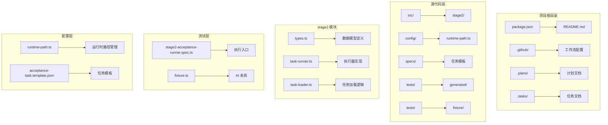
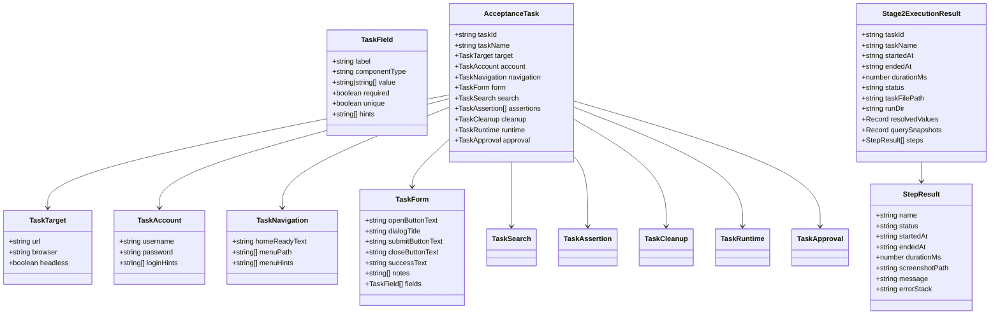
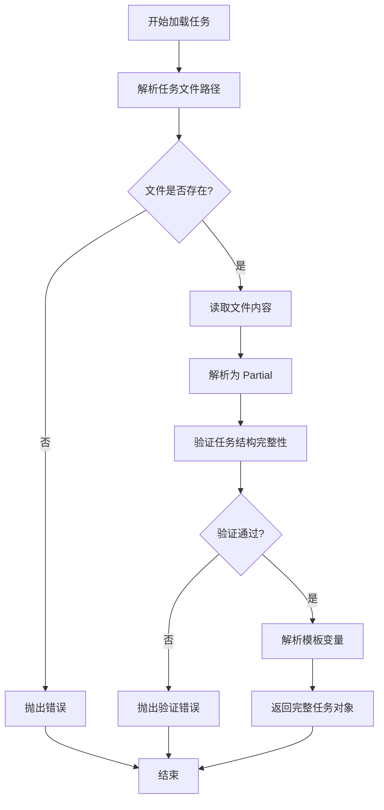
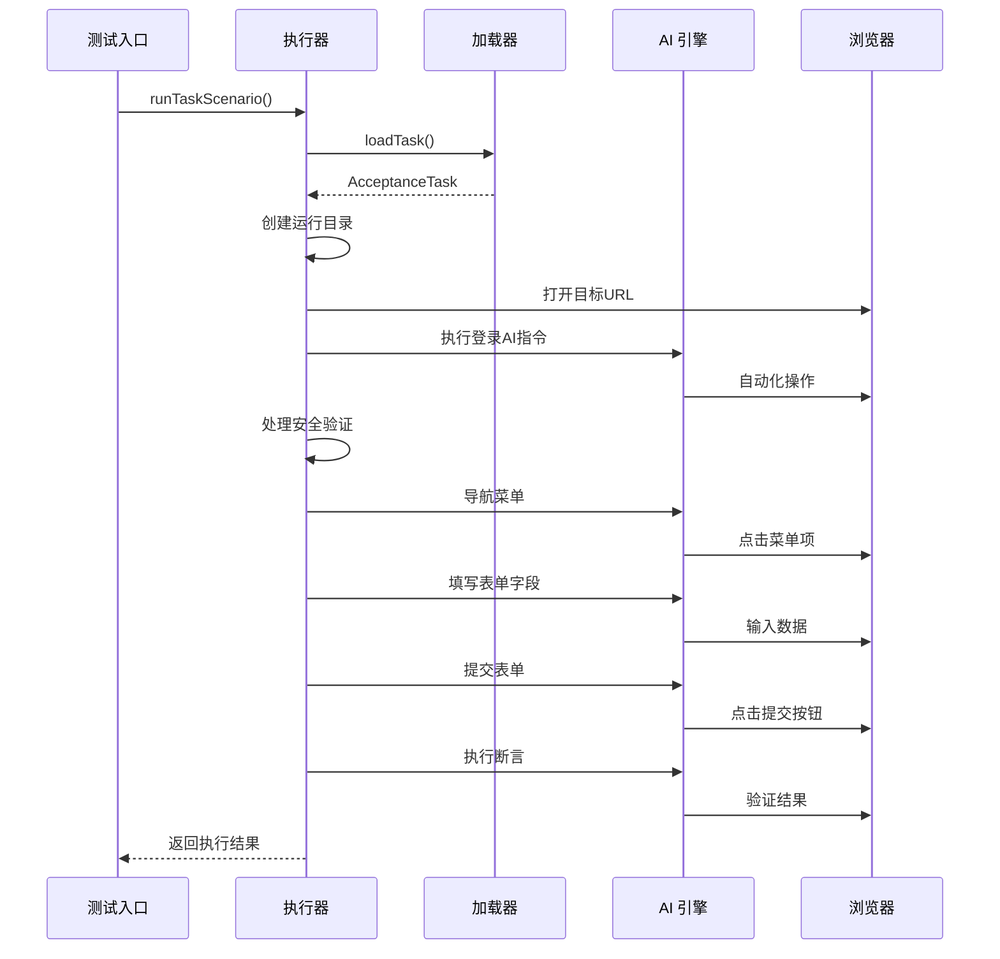
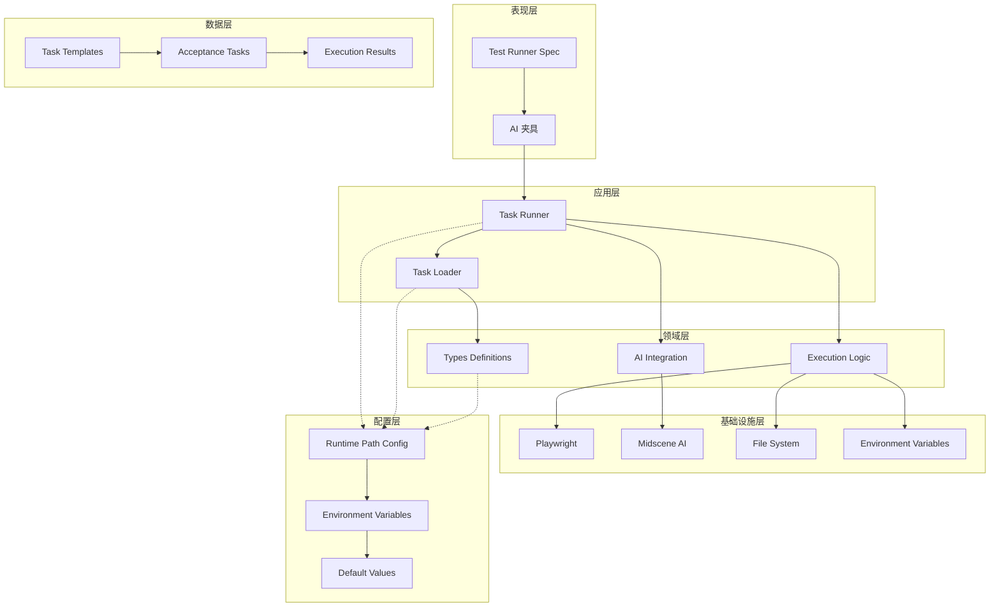
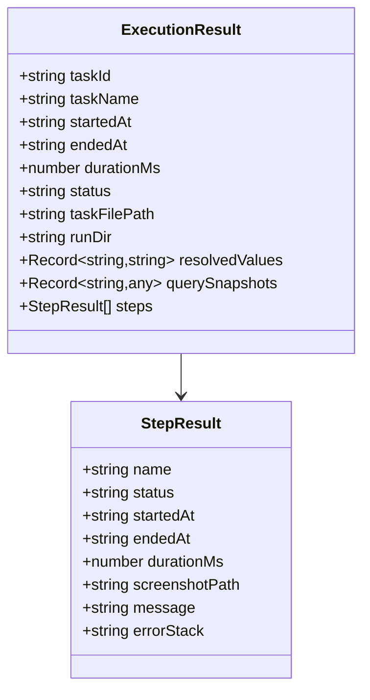
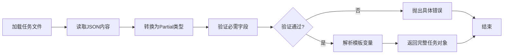
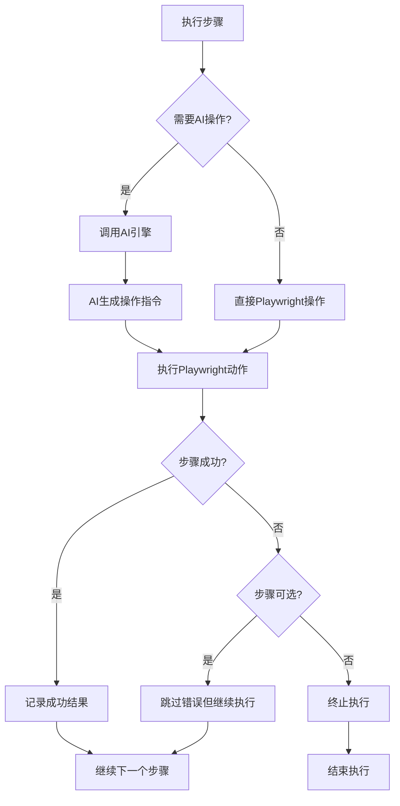
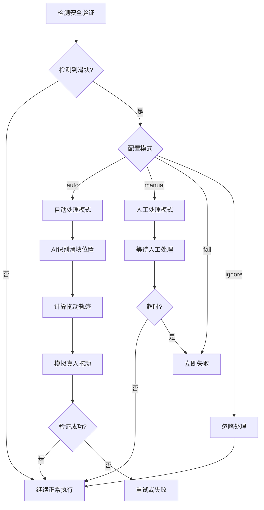

# 代码结构说明

<cite>
**本文档引用的文件**
- [types.ts](file://src/stage2/types.ts)
- [task-runner.ts](file://src/stage2/task-runner.ts)
- [task-loader.ts](file://src/stage2/task-loader.ts)
- [runtime-path.ts](file://config/runtime-path.ts)
- [stage2-acceptance-runner.spec.ts](file://tests/generated/stage2-acceptance-runner.spec.ts)
- [fixture.ts](file://tests/fixture/fixture.ts)
- [acceptance-task.template.json](file://specs/tasks/acceptance-task.template.json)
- [package.json](file://package.json)
- [README.md](file://README.md)
</cite>

## 目录
1. [简介](#简介)
2. [项目结构](#项目结构)
3. [核心组件](#核心组件)
4. [架构概览](#架构概览)
5. [详细组件分析](#详细组件分析)
6. [依赖关系分析](#依赖关系分析)
7. [性能考虑](#性能考虑)
8. [故障排除指南](#故障排除指南)
9. [结论](#结论)

## 简介

HI-TEST 是一个基于 Playwright 和 Midscene.js 的 AI 自动化测试项目，专注于第二阶段的验收测试执行。该项目采用模块化设计，通过 JSON 任务驱动的方式实现端到端的自动化测试流程。项目的核心价值在于将传统的手工测试流程转化为可复用、可维护的自动化测试体系。

## 项目结构

项目采用清晰的模块化组织结构，主要分为以下几个层次：



**图表来源**
- [package.json](file://package.json#L1-L24)
- [README.md](file://README.md#L1-L144)

**章节来源**
- [package.json](file://package.json#L1-L24)
- [README.md](file://README.md#L1-L144)

## 核心组件

### 数据模型层 (types.ts)

数据模型层是整个系统的基础，定义了完整的验收测试数据结构：



**图表来源**
- [types.ts](file://src/stage2/types.ts#L5-L125)

该层实现了以下设计原则：
- **单一职责原则**：每个接口只负责描述特定的业务实体
- **接口隔离**：将复杂的任务拆分为多个专门的接口
- **可扩展性**：通过泛型和可选属性支持未来扩展

**章节来源**
- [types.ts](file://src/stage2/types.ts#L1-L125)

### 任务加载器 (task-loader.ts)

任务加载器负责从 JSON 文件加载和解析验收测试任务：



**图表来源**
- [task-loader.ts](file://src/stage2/task-loader.ts#L71-L89)

**章节来源**
- [task-loader.ts](file://src/stage2/task-loader.ts#L1-L91)

### 执行器 (task-runner.ts)

执行器是系统的核心，实现了完整的验收测试执行流程：



**图表来源**
- [task-runner.ts](file://src/stage2/task-runner.ts#L1062-L1343)
- [stage2-acceptance-runner.spec.ts](file://tests/generated/stage2-acceptance-runner.spec.ts#L12-L37)

**章节来源**
- [task-runner.ts](file://src/stage2/task-runner.ts#L1-L1344)

## 架构概览

项目采用分层架构设计，各层职责清晰分离：



**图表来源**
- [runtime-path.ts](file://config/runtime-path.ts#L38-L40)
- [fixture.ts](file://tests/fixture/fixture.ts#L23-L99)

## 详细组件分析

### 类型系统设计

类型系统采用了高度模块化的接口设计，每个接口都针对特定的业务场景：

#### 核心数据模型

| 接口名称 | 主要用途 | 关键特性 |
|---------|---------|----------|
| TaskTarget | 目标系统配置 | URL、浏览器类型、无头模式 |
| TaskAccount | 用户认证信息 | 用户名、密码、登录提示 |
| TaskNavigation | 导航流程配置 | 首页就绪文本、菜单路径 |
| TaskField | 表单字段定义 | 标签、组件类型、值、验证规则 |
| TaskForm | 表单配置 | 打开按钮、对话框标题、字段集合 |
| AcceptanceTask | 完整任务定义 | 组合所有配置项 |

#### 执行结果模型

执行结果模型提供了完整的测试执行追踪能力：



**图表来源**
- [types.ts](file://src/stage2/types.ts#L100-L125)

**章节来源**
- [types.ts](file://src/stage2/types.ts#L1-L125)

### 任务加载机制

任务加载机制实现了智能的模板解析和验证：

#### 模板变量解析

系统支持多种模板变量解析方式：

1. **时间戳模板** (`NOW_YYYYMMDDHHMMSS`)
2. **环境变量模板** (`${ENV_VAR_NAME}`)
3. **嵌套对象解析** - 支持递归解析复杂对象结构

#### 结构验证

加载器对任务文件进行严格验证，确保所有必需字段都存在：



**图表来源**
- [task-loader.ts](file://src/stage2/task-loader.ts#L50-L89)

**章节来源**
- [task-loader.ts](file://src/stage2/task-loader.ts#L1-L91)

### 执行器核心逻辑

执行器实现了完整的验收测试生命周期管理：

#### 步骤执行框架

执行器提供了一个强大的步骤执行框架，支持：

1. **自动截图** - 每个步骤执行后自动截取屏幕快照
2. **错误处理** - 支持可选步骤和强制步骤的区别处理
3. **进度跟踪** - 实时更新执行进度到临时文件
4. **超时控制** - 支配每个步骤的超时设置

#### AI 集成机制

执行器深度集成了 Midscene AI 能力：



**图表来源**
- [task-runner.ts](file://src/stage2/task-runner.ts#L1110-L1155)

**章节来源**
- [task-runner.ts](file://src/stage2/task-runner.ts#L1062-L1343)

### 安全验证处理

系统实现了智能的安全验证处理机制：

#### 滑块验证码自动处理



**图表来源**
- [task-runner.ts](file://src/stage2/task-runner.ts#L647-L703)

**章节来源**
- [task-runner.ts](file://src/stage2/task-runner.ts#L58-L703)

## 依赖关系分析

项目采用清晰的依赖关系管理：

```mermaid
graph TB
subgraph "外部依赖"
A[@playwright/test] --> B[Web UI自动化]
C[@midscene/web] --> D[AI定位能力]
E[dotenv] --> F[环境变量管理]
end
subgraph "内部模块"
G[types.ts] --> H[数据模型]
I[task-loader.ts] --> J[任务加载]
K[task-runner.ts] --> L[执行逻辑]
M[runtime-path.ts] --> N[路径管理]
O[fixture.ts] --> P[AI夹具]
end
subgraph "测试模块"
Q[stage2-acceptance-runner.spec.ts] --> R[执行入口]
S[fixture.ts] --> T[测试夹具]
end
K --> I
K --> M
I --> G
O --> M
R --> K
T --> O
```

**图表来源**
- [package.json](file://package.json#L13-L22)
- [runtime-path.ts](file://config/runtime-path.ts#L1-L41)

**章节来源**
- [package.json](file://package.json#L1-L24)
- [runtime-path.ts](file://config/runtime-path.ts#L1-L41)

## 性能考虑

### 并发优化

系统在多个层面实现了性能优化：

1. **异步操作** - 所有网络和文件操作都是异步的
2. **重试机制** - 对不稳定的操作提供重试支持
3. **超时控制** - 每个步骤都有合理的超时设置
4. **资源清理** - 自动清理临时文件和缓存

### 内存管理

- **渐进式文件写入** - 执行进度实时写入临时文件，避免内存溢出
- **智能截图** - 只在需要时才截取屏幕快照
- **缓存机制** - AI 查询结果自动缓存

## 故障排除指南

### 常见问题及解决方案

#### 任务文件加载失败

**症状**：执行时报错提示任务文件不存在或格式错误

**排查步骤**：
1. 检查 `STAGE2_TASK_FILE` 环境变量设置
2. 验证任务文件 JSON 格式正确性
3. 确认所有必需字段都已填入

#### AI 操作失败

**症状**：AI 指令无法正确执行

**排查步骤**：
1. 检查 AI 模型配置（`OPENAI_API_KEY`、`MIDSCENE_MODEL_NAME`）
2. 验证网络连接和 API 访问权限
3. 查看 Midscene 日志输出

#### 滑块验证码处理失败

**症状**：自动处理滑块验证码失败

**解决方案**：
1. 调整 `STAGE2_CAPTCHA_MODE` 为 `manual` 模式
2. 检查滑块检测选择器配置
3. 增加 `STAGE2_CAPTCHA_WAIT_TIMEOUT_MS` 超时时间

**章节来源**
- [README.md](file://README.md#L54-L72)

## 结论

HI-TEST 项目展现了优秀的软件工程实践，通过以下关键设计实现了高质量的自动化测试系统：

### 设计优势

1. **模块化架构** - 清晰的职责分离和接口设计
2. **可扩展性** - 支持新的任务类型和执行模式
3. **可维护性** - 严格的类型系统和完善的错误处理
4. **智能化** - 深度集成 AI 能力，提升自动化水平

### 最佳实践总结

1. **接口设计** - 遵循单一职责和接口隔离原则
2. **错误处理** - 实现健壮的异常处理和恢复机制
3. **配置管理** - 通过环境变量和配置文件管理运行参数
4. **测试覆盖** - 提供完整的测试夹具和执行入口

### 后续发展方向

1. **扩展断言类型** - 支持更多业务场景的断言需求
2. **增强AI能力** - 集成更丰富的AI分析和决策能力
3. **性能优化** - 进一步优化执行效率和资源利用率
4. **监控告警** - 添加执行监控和异常告警机制

这个项目为后续的自动化测试系统开发奠定了坚实的技术基础，其模块化设计和清晰的职责划分使其成为企业级自动化测试解决方案的优秀范例。