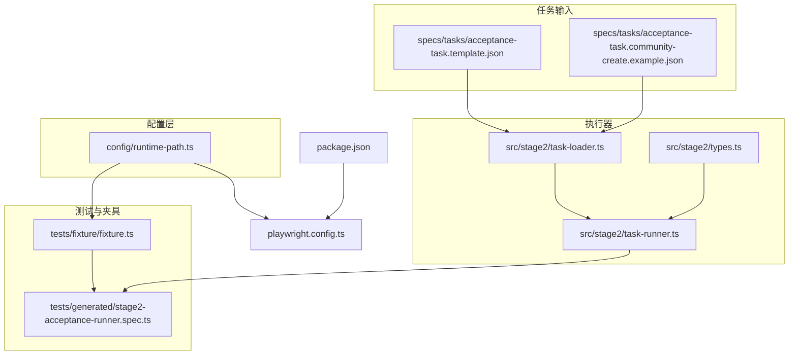
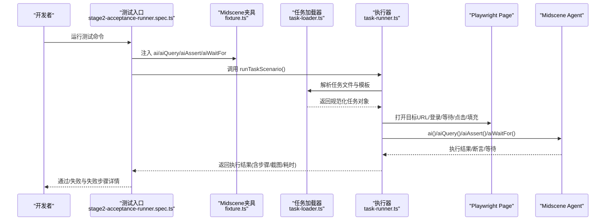
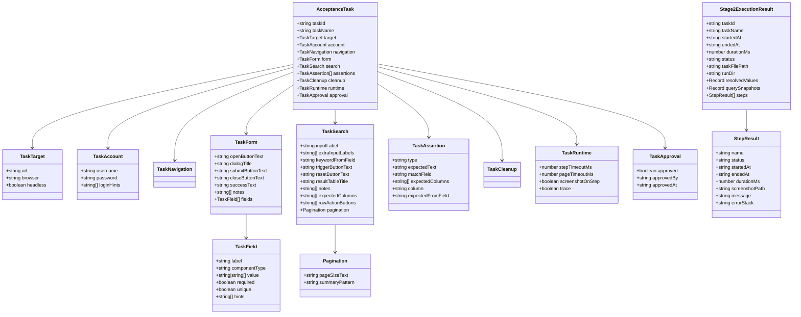
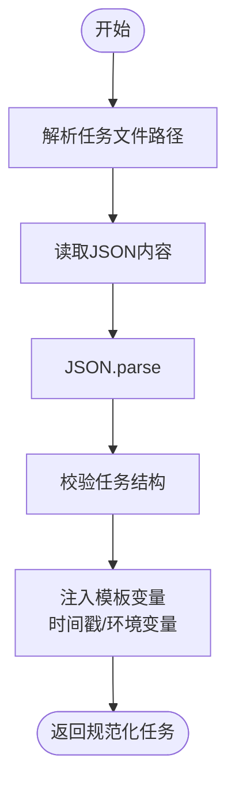
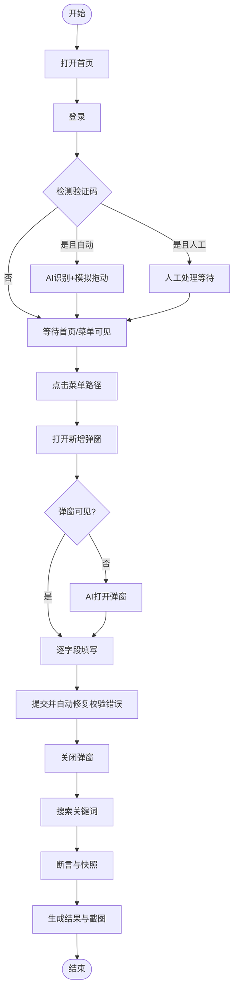
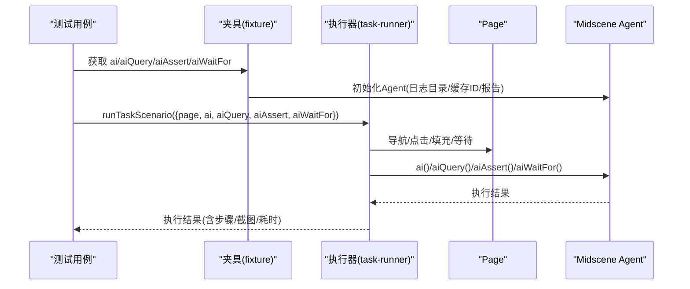
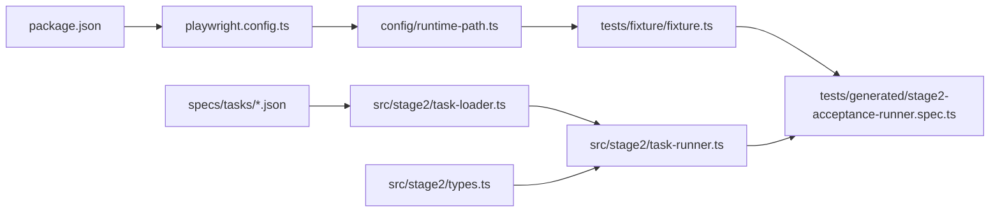

# 开发指南

<cite>
**本文引用的文件**
- [README.md](file://README.md)
- [package.json](file://package.json)
- [playwright.config.ts](file://playwright.config.ts)
- [config/runtime-path.ts](file://config/runtime-path.ts)
- [src/stage2/types.ts](file://src/stage2/types.ts)
- [src/stage2/task-loader.ts](file://src/stage2/task-loader.ts)
- [src/stage2/task-runner.ts](file://src/stage2/task-runner.ts)
- [tests/generated/stage2-acceptance-runner.spec.ts](file://tests/generated/stage2-acceptance-runner.spec.ts)
- [tests/fixture/fixture.ts](file://tests/fixture/fixture.ts)
- [specs/tasks/acceptance-task.template.json](file://specs/tasks/acceptance-task.template.json)
- [specs/tasks/acceptance-task.community-create.example.json](file://specs/tasks/acceptance-task.community-create.example.json)
- [AGENTS.md](file://AGENTS.md)
- [.tasks/AI自主代理验收系统开发改造方案_2026-03-11.md](file://.tasks/AI自主代理验收系统开发改造方案_2026-03-11.md)
</cite>

## 目录
1. [简介](#简介)
2. [项目结构](#项目结构)
3. [核心组件](#核心组件)
4. [架构总览](#架构总览)
5. [组件详解](#组件详解)
6. [依赖关系分析](#依赖关系分析)
7. [性能与稳定性](#性能与稳定性)
8. [调试与故障排查](#调试与故障排查)
9. [扩展开发指南](#扩展开发指南)
10. [开发环境搭建](#开发环境搭建)
11. [贡献与规范](#贡献与规范)
12. [结语](#结语)

## 简介
本指南面向 HI-TEST 项目的开发者，系统阐述“第二段执行器”的代码结构、模块划分、组件交互与扩展方法，覆盖从任务 JSON 驱动到 Midscene + Playwright 执行的完整链路。文档同时提供调试技巧、性能优化建议、开发环境配置与贡献规范，帮助团队快速迭代、稳定交付。

## 项目结构
项目采用“配置集中化 + 任务驱动 + 执行器 + 报告输出”的分层组织方式：
- config：运行期目录与路径解析集中管理
- specs/tasks：任务输入模板与示例
- src/stage2：第二段执行器核心代码（类型定义、任务加载、执行流程）
- tests：Playwright 测试入口与 Midscene Fixture 注入
- 根目录：README、package.json、playwright.config.ts 等

图表来源
- [config/runtime-path.ts](file://config/runtime-path.ts#L1-L41)
- [specs/tasks/acceptance-task.template.json](file://specs/tasks/acceptance-task.template.json#L1-L85)
- [specs/tasks/acceptance-task.community-create.example.json](file://specs/tasks/acceptance-task.community-create.example.json#L1-L184)
- [src/stage2/types.ts](file://src/stage2/types.ts#L1-L125)
- [src/stage2/task-loader.ts](file://src/stage2/task-loader.ts#L1-L91)
- [src/stage2/task-runner.ts](file://src/stage2/task-runner.ts#L1-L1344)
- [tests/generated/stage2-acceptance-runner.spec.ts](file://tests/generated/stage2-acceptance-runner.spec.ts#L1-L39)
- [tests/fixture/fixture.ts](file://tests/fixture/fixture.ts#L1-L100)
- [playwright.config.ts](file://playwright.config.ts#L1-L95)
- [package.json](file://package.json#L1-L24)

章节来源
- [README.md](file://README.md#L1-L144)
- [AGENTS.md](file://AGENTS.md#L1-L61)

## 核心组件
- 任务类型与结果模型：定义任务输入、运行时参数、步骤结果与最终执行结果的数据结构
- 任务加载器：解析任务文件、注入模板变量（含时间戳）、校验必填字段
- 执行器：按步骤编排执行，封装登录、菜单导航、弹窗表单、搜索断言、验证码处理、截图与日志
- 测试入口与夹具：注入 Midscene AI 能力，统一报告与日志输出目录
- 运行时路径：集中管理 t_runtime 下各类产物目录

章节来源
- [src/stage2/types.ts](file://src/stage2/types.ts#L1-L125)
- [src/stage2/task-loader.ts](file://src/stage2/task-loader.ts#L1-L91)
- [src/stage2/task-runner.ts](file://src/stage2/task-runner.ts#L1-L1344)
- [tests/generated/stage2-acceptance-runner.spec.ts](file://tests/generated/stage2-acceptance-runner.spec.ts#L1-L39)
- [tests/fixture/fixture.ts](file://tests/fixture/fixture.ts#L1-L100)
- [config/runtime-path.ts](file://config/runtime-path.ts#L1-L41)

## 架构总览
整体执行链路由“任务 JSON -> 加载与校验 -> 执行器步骤 -> Midscene AI + Playwright -> 结果与报告”构成。

图表来源
- [tests/generated/stage2-acceptance-runner.spec.ts](file://tests/generated/stage2-acceptance-runner.spec.ts#L1-L39)
- [tests/fixture/fixture.ts](file://tests/fixture/fixture.ts#L1-L100)
- [src/stage2/task-loader.ts](file://src/stage2/task-loader.ts#L1-L91)
- [src/stage2/task-runner.ts](file://src/stage2/task-runner.ts#L1062-L1344)

## 组件详解

### 任务类型与模型
- 任务目标、账户、导航、表单、搜索、断言、清理、运行时、审批等结构化定义
- 步骤结果与最终执行结果，包含时间戳、状态、截图路径、错误信息等

图表来源
- [src/stage2/types.ts](file://src/stage2/types.ts#L1-L125)

章节来源
- [src/stage2/types.ts](file://src/stage2/types.ts#L1-L125)

### 任务加载器
- 解析任务文件路径（支持绝对/相对）
- 注入模板变量：时间戳占位、环境变量占位
- 校验任务结构完整性（必填字段、URL、账号、按钮、字段等）

图表来源
- [src/stage2/task-loader.ts](file://src/stage2/task-loader.ts#L71-L91)

章节来源
- [src/stage2/task-loader.ts](file://src/stage2/task-loader.ts#L1-L91)

### 执行器：步骤编排与稳定性策略
- 执行生命周期：打开首页、登录、处理验证码、等待首页/菜单可见、点击菜单、打开弹窗、填写字段、提交、关闭弹窗、搜索回查、断言、生成结果与截图
- 稳定性策略：步骤超时、页面超时、截图记录、失败截图、错误堆栈、重试与回退
- 验证码处理：自动识别滑块、AI 查询位置与轨道宽度、模拟真人拖动轨迹、多次重试、人工兜底等待
- 表单与级联：候选定位、回填失败自动修复、级联路径匹配与重试
- 断言：Toast 提示、表格行存在、单元格等于/包含等

图表来源
- [src/stage2/task-runner.ts](file://src/stage2/task-runner.ts#L1062-L1344)

章节来源
- [src/stage2/task-runner.ts](file://src/stage2/task-runner.ts#L1-L1344)

### 测试入口与夹具
- 测试入口：注入 AI 能力，调用执行器，失败时输出失败步骤与截图路径
- 夹具：为每个测试用例初始化 Midscene Agent，设置日志目录、报告生成、缓存 ID 清洗

图表来源
- [tests/generated/stage2-acceptance-runner.spec.ts](file://tests/generated/stage2-acceptance-runner.spec.ts#L1-L39)
- [tests/fixture/fixture.ts](file://tests/fixture/fixture.ts#L1-L100)

章节来源
- [tests/generated/stage2-acceptance-runner.spec.ts](file://tests/generated/stage2-acceptance-runner.spec.ts#L1-L39)
- [tests/fixture/fixture.ts](file://tests/fixture/fixture.ts#L1-L100)

## 依赖关系分析
- 运行时路径集中管理：playwright.config.ts 与 runtime-path.ts 统一输出目录
- 执行器依赖：task-loader.ts 与 types.ts 为执行器提供任务模型与加载能力
- 测试入口依赖：fixture.ts 注入 AI 能力，spec.ts 调用执行器
- 脚本与配置：package.json 提供运行脚本，playwright.config.ts 配置报告与 workers

图表来源
- [package.json](file://package.json#L1-L24)
- [playwright.config.ts](file://playwright.config.ts#L1-L95)
- [config/runtime-path.ts](file://config/runtime-path.ts#L1-L41)
- [tests/fixture/fixture.ts](file://tests/fixture/fixture.ts#L1-L100)
- [src/stage2/task-loader.ts](file://src/stage2/task-loader.ts#L1-L91)
- [src/stage2/task-runner.ts](file://src/stage2/task-runner.ts#L1-L1344)
- [src/stage2/types.ts](file://src/stage2/types.ts#L1-L125)
- [tests/generated/stage2-acceptance-runner.spec.ts](file://tests/generated/stage2-acceptance-runner.spec.ts#L1-L39)

章节来源
- [package.json](file://package.json#L1-L24)
- [playwright.config.ts](file://playwright.config.ts#L1-L95)
- [config/runtime-path.ts](file://config/runtime-path.ts#L1-L41)

## 性能与稳定性
- 超时与重试
  - 步骤超时与页面超时可配置，避免长时间阻塞
  - 提交失败自动重试并收集校验消息进行字段修复
- 截图与日志
  - 每步可选截图，失败时自动截图并记录错误堆栈
  - Midscene 日志目录集中管理，便于定位问题
- 稳定性策略
  - 验证码自动处理失败重试、人工兜底等待
  - 级联选择失败重试与路径匹配
  - 列表搜索失败二次尝试与 AI 回查

章节来源
- [src/stage2/task-runner.ts](file://src/stage2/task-runner.ts#L1062-L1344)
- [src/stage2/task-runner.ts](file://src/stage2/task-runner.ts#L558-L703)
- [src/stage2/task-runner.ts](file://src/stage2/task-runner.ts#L973-L1018)
- [src/stage2/task-runner.ts](file://src/stage2/task-runner.ts#L907-L941)
- [src/stage2/task-runner.ts](file://src/stage2/task-runner.ts#L1273-L1311)

## 调试与故障排查
- 断点调试
  - 使用 VS Code 在执行器步骤中设置断点，观察页面状态与 Midscene AI 返回
  - 在测试入口中捕获失败步骤，查看截图路径与错误堆栈
- 日志与报告
  - Playwright HTML 报告与 Midscene 报告目录统一由配置管理
  - 执行器每步写入进度文件，失败时输出失败详情
- 常见问题
  - 验证码：自动模式失败时切换为人工模式或增大等待时间
  - 级联选择：确认候选选择器与层级路径，必要时开启截图辅助定位
  - 断言：优先使用结构化查询 + 代码断言，避免仅依赖 AI 断言

章节来源
- [tests/generated/stage2-acceptance-runner.spec.ts](file://tests/generated/stage2-acceptance-runner.spec.ts#L27-L36)
- [README.md](file://README.md#L106-L132)
- [config/runtime-path.ts](file://config/runtime-path.ts#L18-L36)

## 扩展开发指南

### 添加新的任务类型
- 在类型定义中扩展任务模型
  - 新增断言类型：在断言枚举中加入新类型，并在执行器中实现对应分支
  - 新增运行时选项：在运行时模型中加入新字段，执行器中读取并应用
- 更新任务加载器
  - 如需新增模板变量或占位符，扩展解析逻辑
- 更新测试入口
  - 如需新增 AI 能力或等待策略，扩展夹具注入

章节来源
- [src/stage2/types.ts](file://src/stage2/types.ts#L58-L66)
- [src/stage2/types.ts](file://src/stage2/types.ts#L73-L79)
- [src/stage2/task-runner.ts](file://src/stage2/task-runner.ts#L1020-L1060)
- [src/stage2/task-loader.ts](file://src/stage2/task-loader.ts#L19-L48)
- [tests/fixture/fixture.ts](file://tests/fixture/fixture.ts#L23-L99)

### 自定义执行步骤
- 在执行器中新增步骤函数，遵循“步骤封装 + 失败截图 + 错误堆栈记录”的模式
- 优先使用候选定位与回退策略，提升跨页面稳定性
- 为关键步骤补充 AI 查询/断言，降低幻觉风险

章节来源
- [src/stage2/task-runner.ts](file://src/stage2/task-runner.ts#L1110-L1155)
- [src/stage2/task-runner.ts](file://src/stage2/task-runner.ts#L894-L971)
- [src/stage2/task-runner.ts](file://src/stage2/task-runner.ts#L1020-L1060)

### 集成第三方服务
- 在夹具中扩展 AI 能力或外部服务调用，注意：
  - 保持日志目录与报告输出统一
  - 对外部调用增加超时与重试策略
  - 将敏感配置通过环境变量注入

章节来源
- [tests/fixture/fixture.ts](file://tests/fixture/fixture.ts#L23-L99)
- [config/runtime-path.ts](file://config/runtime-path.ts#L1-L41)

## 开发环境搭建
- 安装与准备
  - 克隆仓库、安装依赖、安装浏览器
- 环境变量
  - 配置 OPENAI_API_KEY、OPENAI_BASE_URL、MIDSCENE_MODEL_NAME 等
  - 运行产物目录通过 RUNTIME_DIR_PREFIX、PLAYWRIGHT_OUTPUT_DIR、PLAYWRIGHT_HTML_REPORT_DIR、MIDSCENE_RUN_DIR、ACCEPTANCE_RESULT_DIR 管理
- 运行命令
  - 第二段执行：使用 npm 脚本运行 Headed/Headless
  - Playwright 报告与 Midscene 报告输出目录由配置统一管理

章节来源
- [README.md](file://README.md#L10-L116)
- [package.json](file://package.json#L6-L9)
- [playwright.config.ts](file://playwright.config.ts#L22-L40)
- [config/runtime-path.ts](file://config/runtime-path.ts#L18-L36)

## 贡献与规范
- 统一规范
  - 使用中文交流、作者标注、优先复用现有实现
  - 配置与路径通过 .env 管理，避免硬编码
  - 自动生成目录统一以 t_ 开头，保持一致性
- 命名与日志
  - 类名/类型名大驼峰；变量/方法小驼峰；常量全大写
  - 日志保留上下文与完整堆栈，产物目录集中管理
- 变更与测试
  - 修改配置后执行基础校验，确保目录输出正确
  - 涉及 CI 的目录调整需同步工作流上传路径
  - 开发记录统一写入 .tasks 目录

章节来源
- [AGENTS.md](file://AGENTS.md#L1-L61)
- [.tasks/AI自主代理验收系统开发改造方案_2026-03-11.md](file://.tasks/AI自主代理验收系统开发改造方案_2026-03-11.md#L1-L463)

## 结语
本指南围绕“任务 JSON 驱动 + Midscene + Playwright”的第二段执行链路，提供了从架构到扩展、从调试到规范的完整开发指引。建议在新增任务类型与步骤时，严格遵循结构化输入、步骤原子化、断言硬化与结果沉淀的原则，持续提升可维护性与可复用性。