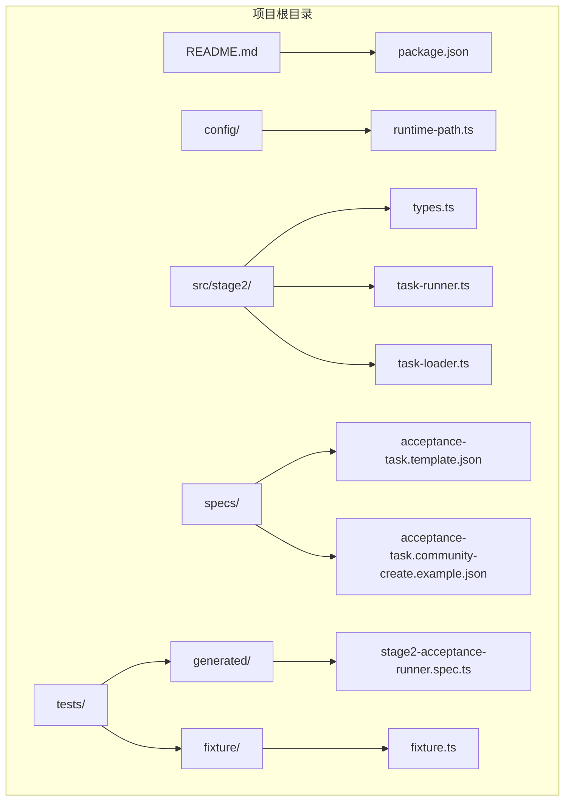
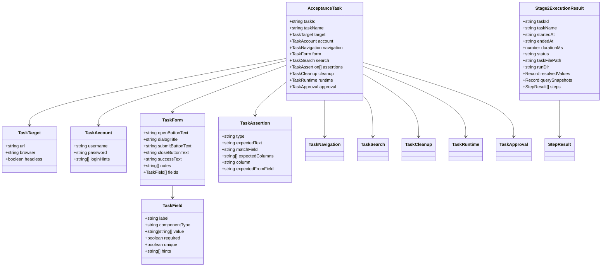
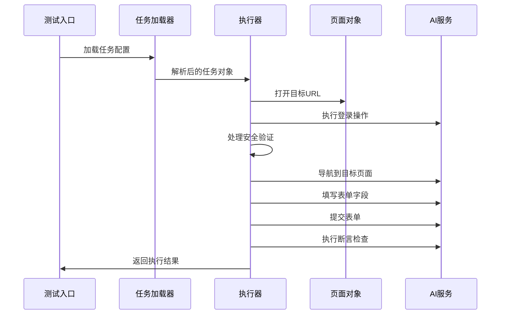
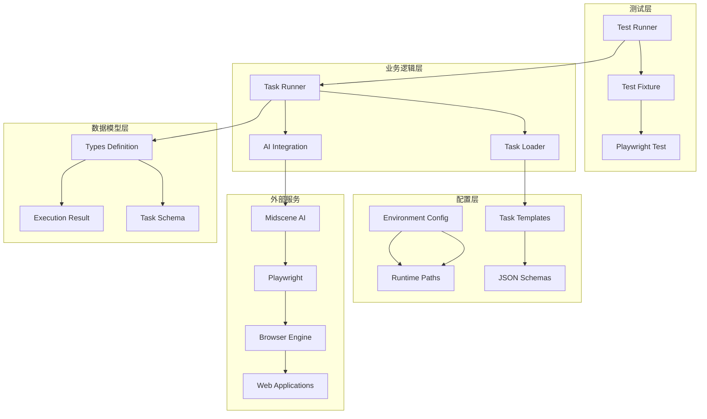
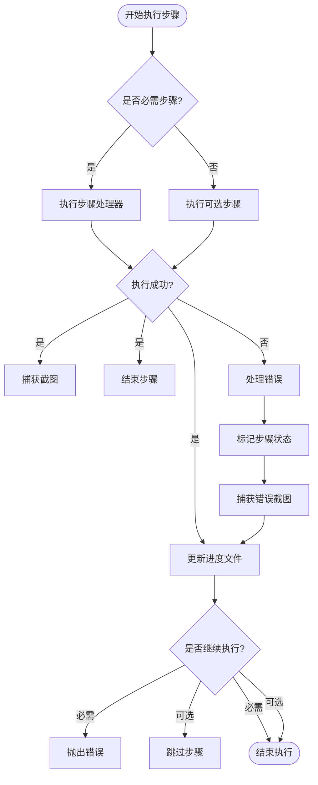
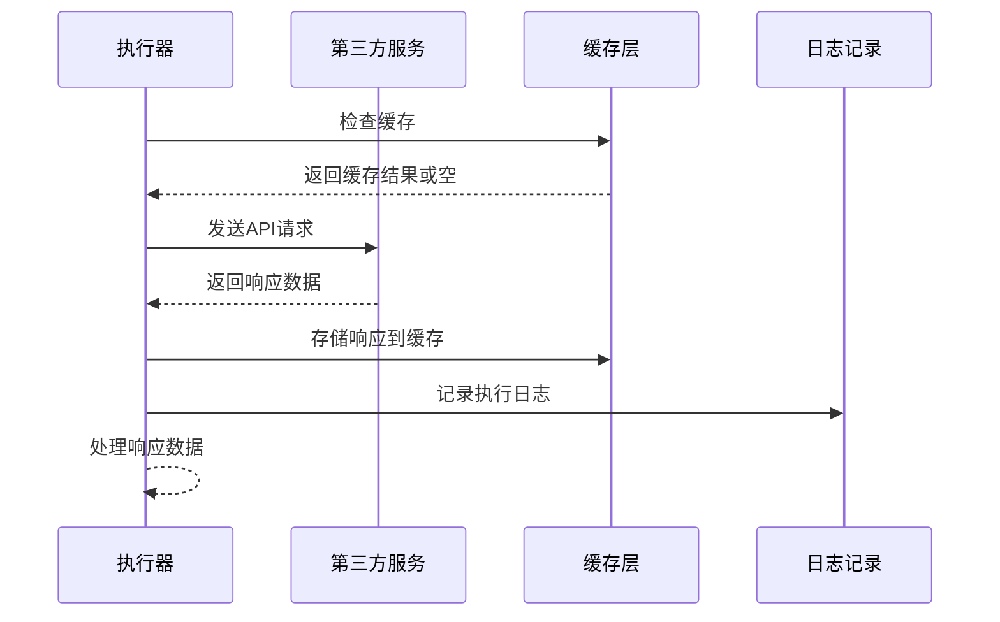
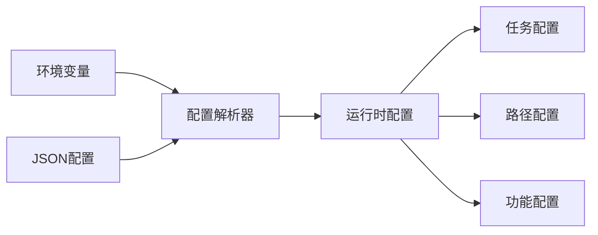
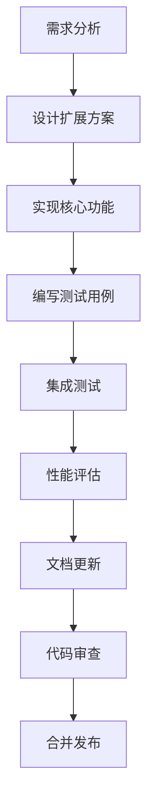

# 扩展开发指南

<cite>
**本文档引用的文件**
- [README.md](file://README.md)
- [types.ts](file://src/stage2/types.ts)
- [task-runner.ts](file://src/stage2/task-runner.ts)
- [task-loader.ts](file://src/stage2/task-loader.ts)
- [acceptance-task.template.json](file://specs/tasks/acceptance-task.template.json)
- [acceptance-task.community-create.example.json](file://specs/tasks/acceptance-task.community-create.example.json)
- [stage2-acceptance-runner.spec.ts](file://tests/generated/stage2-acceptance-runner.spec.ts)
- [fixture.ts](file://tests/fixture/fixture.ts)
- [runtime-path.ts](file://config/runtime-path.ts)
- [package.json](file://package.json)
</cite>

## 目录
1. [简介](#简介)
2. [项目结构](#项目结构)
3. [核心组件](#核心组件)
4. [架构概览](#架构概览)
5. [详细组件分析](#详细组件分析)
6. [依赖关系分析](#依赖关系分析)
7. [性能考虑](#性能考虑)
8. [故障排除指南](#故障排除指南)
9. [结论](#结论)
10. [附录](#附录)

## 简介

HI-TEST 是一个基于 Playwright 和 Midscene.js 的 AI 自动化测试项目，专门用于第二段验收测试场景。该项目提供了完整的任务驱动测试框架，支持通过 JSON 配置文件定义复杂的业务流程，并通过 AI 能力实现智能的页面交互和断言。

本指南旨在帮助开发者理解和扩展该测试框架，涵盖任务类型的扩展、执行步骤的自定义、第三方服务集成以及配置系统的扩展等方面。

## 项目结构

项目采用模块化的组织方式，主要分为以下几个核心目录：



**图表来源**
- [README.md](file://README.md#L1-L144)
- [package.json](file://package.json#L1-L24)

**章节来源**
- [README.md](file://README.md#L1-L144)
- [package.json](file://package.json#L1-L24)

## 核心组件

### 数据模型定义

项目的核心数据模型定义在 `types.ts` 文件中，包含了完整的任务结构定义：



**图表来源**
- [types.ts](file://src/stage2/types.ts#L1-L125)

### 任务执行器

`task-runner.ts` 是整个系统的核心执行引擎，负责解析任务配置、执行业务流程并生成执行结果：



**图表来源**
- [task-runner.ts](file://src/stage2/task-runner.ts#L1062-L1344)
- [stage2-acceptance-runner.spec.ts](file://tests/generated/stage2-acceptance-runner.spec.ts#L1-L39)

**章节来源**
- [types.ts](file://src/stage2/types.ts#L1-L125)
- [task-runner.ts](file://src/stage2/task-runner.ts#L1-L1344)

## 架构概览

HI-TEST 采用了分层架构设计，各层职责清晰分离：



**图表来源**
- [task-runner.ts](file://src/stage2/task-runner.ts#L1-L1344)
- [task-loader.ts](file://src/stage2/task-loader.ts#L1-L91)
- [fixture.ts](file://tests/fixture/fixture.ts#L1-L100)

## 详细组件分析

### 任务类型扩展

#### 扩展 AcceptanceTask 接口

要添加新的任务类型，需要在 `AcceptanceTask` 接口中扩展新字段：

1. **定义新字段类型**：在 `types.ts` 中添加新的接口定义
2. **更新 AcceptanceTask 接口**：在 `AcceptanceTask` 接口中添加新字段
3. **添加默认值处理**：在 `task-runner.ts` 中处理新字段的默认值
4. **实现执行逻辑**：在相应的执行步骤中使用新字段

#### 示例：添加自定义配置字段

假设需要添加一个 `customConfig` 字段：

```typescript
// 在 types.ts 中扩展
interface AcceptanceTask {
  // ... 现有字段
  customConfig?: {
    enableFeature?: boolean;
    featureSettings?: Record<string, any>;
  };
}

// 在 task-runner.ts 中使用
const customConfig = task.customConfig || {
  enableFeature: false,
  featureSettings: {}
};

// 在执行步骤中使用
if (customConfig.enableFeature) {
  // 实现自定义功能
}
```

**章节来源**
- [types.ts](file://src/stage2/types.ts#L86-L98)
- [task-runner.ts](file://src/stage2/task-runner.ts#L1062-L1344)

### 执行步骤自定义

#### 步骤注册机制

项目使用 `runStep` 函数作为步骤注册和执行的核心机制：



**图表来源**
- [task-runner.ts](file://src/stage2/task-runner.ts#L1110-L1155)

#### 参数传递和结果处理

每个步骤都支持参数传递和结果处理：

1. **步骤名称**：用于标识和记录
2. **处理器函数**：实际的执行逻辑
3. **选项配置**：控制步骤行为（如是否必需）
4. **结果记录**：自动记录执行状态、时间和截图

**章节来源**
- [task-runner.ts](file://src/stage2/task-runner.ts#L1110-L1155)

### 第三方服务集成

#### API 调用封装

项目通过 Midscene AI 服务实现智能页面交互，可以扩展集成其他第三方服务：



**图表来源**
- [task-runner.ts](file://src/stage2/task-runner.ts#L507-L556)

#### 错误处理和超时管理

项目实现了完善的错误处理机制：

1. **超时控制**：通过 `stepTimeoutMs` 和 `pageTimeoutMs` 控制执行超时
2. **重试机制**：对关键操作实现自动重试
3. **错误恢复**：在失败时自动捕获截图并记录详细信息
4. **优雅降级**：当 AI 服务不可用时提供备用方案

**章节来源**
- [task-runner.ts](file://src/stage2/task-runner.ts#L119-L126)
- [task-runner.ts](file://src/stage2/task-runner.ts#L1062-L1344)

### 配置系统扩展

#### 新增配置项

项目使用环境变量和 JSON 配置相结合的方式：



**图表来源**
- [runtime-path.ts](file://config/runtime-path.ts#L1-L41)
- [task-loader.ts](file://src/stage2/task-loader.ts#L19-L48)

#### 默认值设置和验证规则

配置系统支持默认值设置和验证规则：

1. **默认值处理**：为每个配置项提供合理的默认值
2. **环境变量优先**：允许通过环境变量覆盖默认值
3. **类型验证**：在加载时验证配置项的类型和格式
4. **模板解析**：支持在配置中使用模板语法

**章节来源**
- [runtime-path.ts](file://config/runtime-path.ts#L8-L16)
- [task-loader.ts](file://src/stage2/task-loader.ts#L50-L69)

## 依赖关系分析

项目的主要依赖关系如下：

```mermaid
graph TB
subgraph "核心依赖"
A[@playwright/test] --> B[测试框架]
C[@midscene/web] --> D[AI集成]
E[dotenv] --> F[环境变量]
end
subgraph "内部模块"
G[task-runner] --> H[types]
G --> I[task-loader]
J[task-loader] --> H
K[tests] --> G
K --> L[fixture]
end
subgraph "配置管理"
M[runtime-path] --> N[路径解析]
O[specs] --> P[任务模板]
end
A --> G
C --> G
E --> M
F --> M
G --> M
J --> P
```

**图表来源**
- [package.json](file://package.json#L13-L22)
- [task-runner.ts](file://src/stage2/task-runner.ts#L1-L18)
- [runtime-path.ts](file://config/runtime-path.ts#L1-L41)

**章节来源**
- [package.json](file://package.json#L13-L22)

## 性能考虑

### 执行效率优化

1. **异步操作**：充分利用 JavaScript 异步特性，避免阻塞操作
2. **缓存策略**：合理使用缓存减少重复计算和网络请求
3. **超时控制**：为每个步骤设置合适的超时时间
4. **资源管理**：及时清理临时文件和内存资源

### 内存使用优化

1. **渐进式处理**：分步骤处理大型任务，避免一次性加载过多数据
2. **垃圾回收**：定期清理不再使用的对象引用
3. **文件操作**：及时关闭文件句柄，避免文件句柄泄漏

## 故障排除指南

### 常见问题诊断

#### 任务执行失败

1. **检查任务配置**：确认 JSON 配置文件格式正确
2. **验证环境变量**：确保所有必需的环境变量已设置
3. **查看执行日志**：检查 `t_runtime/` 目录下的日志文件
4. **分析截图**：查看失败步骤的截图定位问题

#### 页面元素识别失败

1. **检查选择器**：确认页面元素的选择器是否正确
2. **验证页面状态**：确保页面已完全加载
3. **调整等待时间**：适当增加等待时间
4. **使用 AI 辅助**：利用 AI 能力进行智能识别

**章节来源**
- [stage2-acceptance-runner.spec.ts](file://tests/generated/stage2-acceptance-runner.spec.ts#L27-L36)

### 调试方法

1. **启用详细日志**：设置 `DEBUG=true` 获取更详细的执行信息
2. **使用 headed 模式**：通过 `--headed` 参数查看实际执行过程
3. **截图分析**：利用自动生成的截图进行问题定位
4. **逐步调试**：将复杂任务拆分为多个简单步骤逐一调试

## 结论

HI-TEST 项目提供了一个强大而灵活的自动化测试框架。通过本文档的指导，开发者可以：

1. **轻松扩展任务类型**：通过接口扩展和配置添加新的业务场景
2. **自定义执行步骤**：利用现有的步骤注册机制实现复杂的业务流程
3. **集成第三方服务**：通过标准化的接口集成各种外部服务
4. **扩展配置系统**：支持动态配置和环境适配

该框架的设计充分考虑了可扩展性和可维护性，为未来的功能扩展奠定了良好的基础。

## 附录

### 最佳实践清单

1. **版本控制**：为每个新功能创建独立的分支
2. **单元测试**：为新添加的功能编写单元测试
3. **文档更新**：同步更新相关的技术文档
4. **回归测试**：确保新功能不影响现有功能
5. **性能监控**：监控新功能对整体性能的影响

### 扩展开发流程

