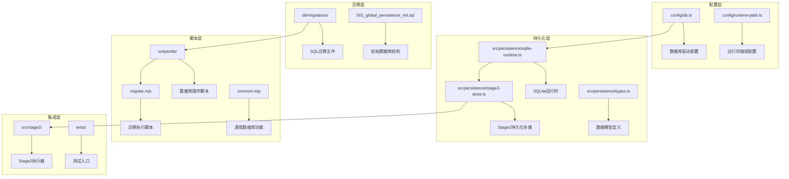
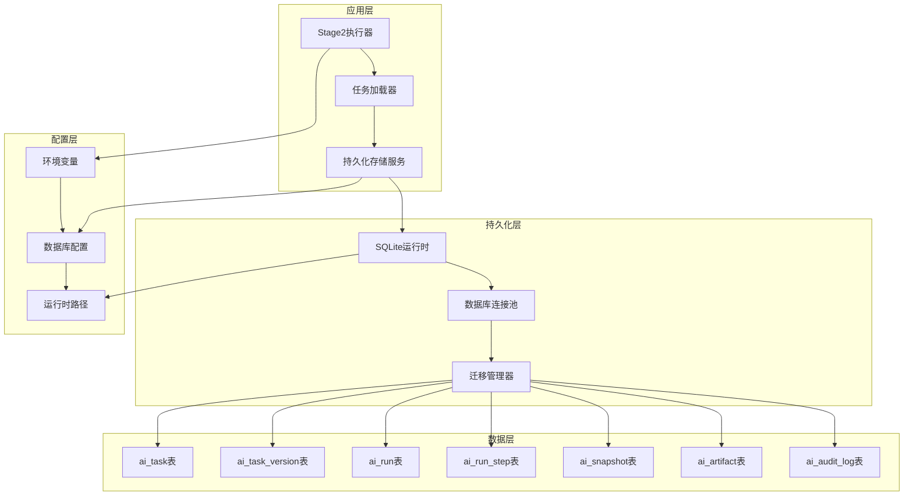
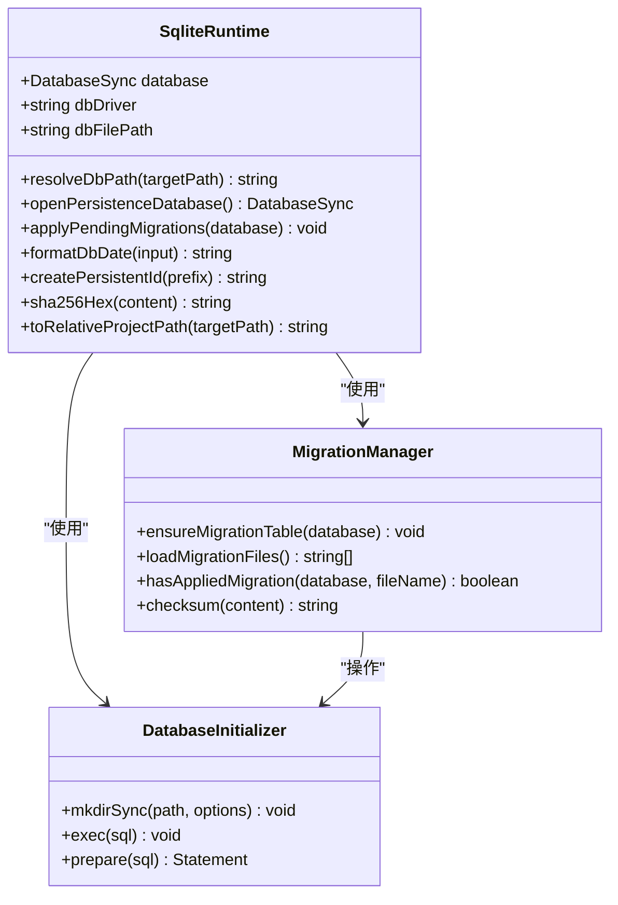
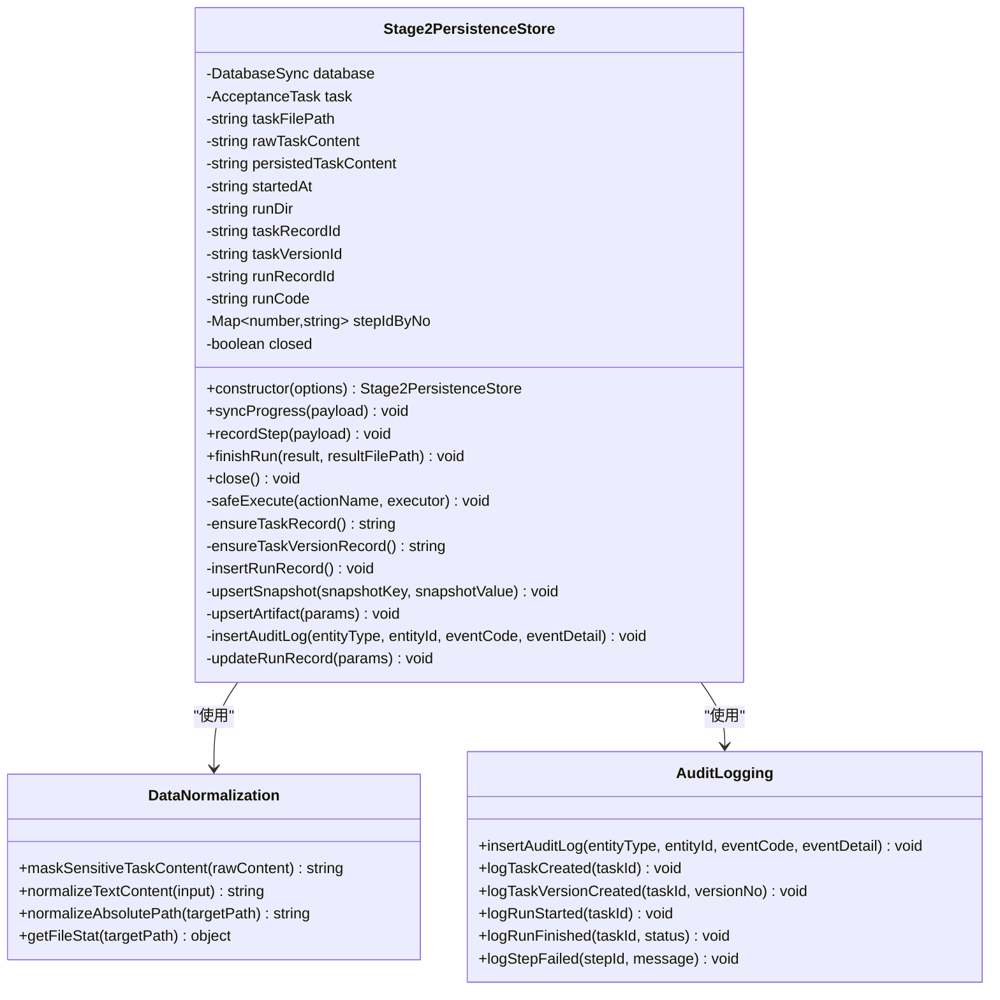
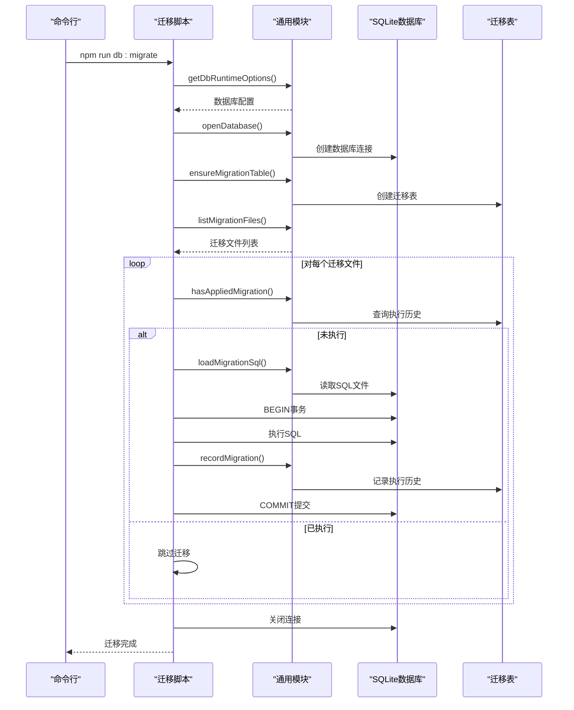
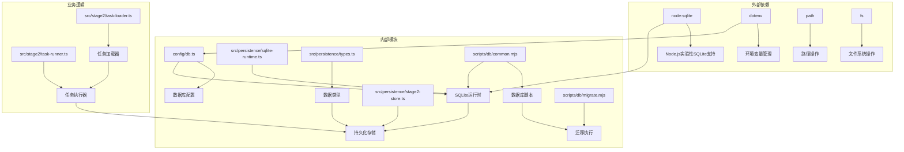

# 数据库持久化基础设施

<cite>
**本文档引用的文件**
- [README.md](file://README.md)
- [config/db.ts](file://config/db.ts)
- [src/persistence/sqlite-runtime.ts](file://src/persistence/sqlite-runtime.ts)
- [src/persistence/stage2-store.ts](file://src/persistence/stage2-store.ts)
- [src/persistence/types.ts](file://src/persistence/types.ts)
- [db/migrations/001_global_persistence_init.sql](file://db/migrations/001_global_persistence_init.sql)
- [scripts/db/common.mjs](file://scripts/db/common.mjs)
- [scripts/db/migrate.mjs](file://scripts/db/migrate.mjs)
- [package.json](file://package.json)
- [src/stage2/task-runner.ts](file://src/stage2/task-runner.ts)
- [src/stage2/task-loader.ts](file://src/stage2/task-loader.ts)
</cite>

## 目录
1. [简介](#简介)
2. [项目结构](#项目结构)
3. [核心组件](#核心组件)
4. [架构概览](#架构概览)
5. [详细组件分析](#详细组件分析)
6. [依赖关系分析](#依赖关系分析)
7. [性能考虑](#性能考虑)
8. [故障排除指南](#故障排除指南)
9. [结论](#结论)

## 简介

本项目实现了完整的数据库持久化基础设施，采用基于 SQLite 的本地单文件数据库作为默认存储引擎。该基础设施为 AI 自动化测试项目提供了可靠的数据持久化能力，支持任务执行过程中的数据记录、状态跟踪和结果存储。

主要特性包括：
- 全局数据持久化底座，支持 MySQL 兼容迁移
- 自动化的数据库迁移管理
- 完整的任务执行生命周期跟踪
- 多层次的数据结构化存储
- 安全的敏感信息处理机制

## 项目结构

数据库持久化基础设施主要分布在以下几个关键目录中：

**图表来源**
- [config/db.ts](file://config/db.ts#L1-L28)
- [src/persistence/sqlite-runtime.ts](file://src/persistence/sqlite-runtime.ts#L1-L116)
- [src/persistence/stage2-store.ts](file://src/persistence/stage2-store.ts#L1-L655)
- [db/migrations/001_global_persistence_init.sql](file://db/migrations/001_global_persistence_init.sql#L1-L128)

**章节来源**
- [README.md](file://README.md#L97-L130)
- [package.json](file://package.json#L6-L11)

## 核心组件

### 数据库配置管理

数据库配置通过环境变量进行集中管理，支持灵活的部署配置：

- **驱动程序配置**：默认使用 SQLite，支持未来扩展到 MySQL
- **文件路径管理**：统一的数据库文件路径解析和管理
- **运行时路径集成**：与项目运行时目录系统无缝集成

### SQLite 运行时管理

提供完整的 SQLite 数据库生命周期管理功能：

- **数据库连接管理**：自动创建数据库文件和必要的目录结构
- **迁移系统**：完整的数据库迁移管理和版本控制
- **事务处理**：支持原子性操作和回滚机制
- **索引优化**：预定义的性能优化索引

### Stage2 持久化存储

专门针对第二阶段执行器的数据持久化解决方案：

- **任务生命周期管理**：从任务创建到执行完成的完整跟踪
- **步骤级状态记录**：详细的执行步骤和状态变化记录
- **快照数据管理**：关键执行时刻的数据快照存储
- **附件关联管理**：执行结果相关的文件和资源管理

**章节来源**
- [config/db.ts](file://config/db.ts#L1-L28)
- [src/persistence/sqlite-runtime.ts](file://src/persistence/sqlite-runtime.ts#L73-L116)
- [src/persistence/stage2-store.ts](file://src/persistence/stage2-store.ts#L74-L123)

## 架构概览

数据库持久化基础设施采用分层架构设计，确保各组件职责清晰、耦合度低：

**图表来源**
- [src/stage2/task-runner.ts](file://src/stage2/task-runner.ts#L1-L800)
- [src/stage2/task-loader.ts](file://src/stage2/task-loader.ts#L1-L91)
- [src/persistence/stage2-store.ts](file://src/persistence/stage2-store.ts#L101-L123)
- [db/migrations/001_global_persistence_init.sql](file://db/migrations/001_global_persistence_init.sql#L1-L128)

## 详细组件分析

### SQLite 运行时管理器

SQLite 运行时管理器是整个持久化基础设施的核心组件，负责数据库的生命周期管理：

**图表来源**
- [src/persistence/sqlite-runtime.ts](file://src/persistence/sqlite-runtime.ts#L73-L116)
- [src/persistence/sqlite-runtime.ts](file://src/persistence/sqlite-runtime.ts#L86-L114)

#### 关键功能特性

1. **数据库连接管理**
   - 自动创建数据库文件和必要的目录结构
   - 启用外键约束和事务支持
   - 提供统一的数据库访问接口

2. **迁移系统**
   - 自动检测和应用未执行的迁移
   - 维护迁移历史和完整性校验
   - 支持原子性迁移执行

3. **工具函数**
   - 标准化的日期格式化
   - 唯一标识符生成
   - 文件路径标准化

**章节来源**
- [src/persistence/sqlite-runtime.ts](file://src/persistence/sqlite-runtime.ts#L1-L116)

### Stage2 持久化存储服务

Stage2 持久化存储服务是专门为第二阶段执行器设计的数据持久化解决方案：

**图表来源**
- [src/persistence/stage2-store.ts](file://src/persistence/stage2-store.ts#L74-L123)
- [src/persistence/stage2-store.ts](file://src/persistence/stage2-store.ts#L37-L48)
- [src/persistence/stage2-store.ts](file://src/persistence/stage2-store.ts#L305-L331)

#### 数据模型设计

系统采用规范化的关系型数据模型，支持完整的任务执行生命周期：

1. **任务管理表 (ai_task)**
   - 存储任务基本信息和元数据
   - 维护任务版本号和最新状态
   - 支持任务搜索和过滤

2. **任务版本表 (ai_task_version)**
   - 记录任务内容的历史版本
   - 基于内容哈希的去重机制
   - 支持版本比较和回滚

3. **执行记录表 (ai_run)**
   - 跟踪任务执行的完整生命周期
   - 记录执行状态和性能指标
   - 支持并发执行的隔离

4. **步骤记录表 (ai_run_step)**
   - 详细记录每个执行步骤的状态
   - 支持步骤级别的错误追踪
   - 维护步骤间的依赖关系

5. **快照表 (ai_snapshot)**
   - 存储关键执行时刻的数据快照
   - 支持实时状态监控和调试
   - 提供数据恢复和审计能力

6. **附件表 (ai_artifact)**
   - 管理执行产生的各种文件
   - 维护文件的元数据和存储信息
   - 支持文件关联和检索

7. **审计日志表 (ai_audit_log)**
   - 记录所有重要的系统事件
   - 支持合规性和审计需求
   - 提供问题诊断和追踪

**章节来源**
- [src/persistence/stage2-store.ts](file://src/persistence/stage2-store.ts#L1-L655)
- [src/persistence/types.ts](file://src/persistence/types.ts#L1-L125)

### 数据库迁移系统

数据库迁移系统提供了完整的数据库版本管理和演进能力：

**图表来源**
- [scripts/db/migrate.mjs](file://scripts/db/migrate.mjs#L15-L51)
- [scripts/db/common.mjs](file://scripts/db/common.mjs#L60-L106)

#### 迁移管理特性

1. **自动化迁移检测**
   - 自动扫描迁移文件目录
   - 基于文件名排序的执行顺序
   - 去重机制防止重复执行

2. **完整性保证**
   - 事务性执行确保原子性
   - 错误回滚保护数据库一致性
   - 校验和验证迁移完整性

3. **历史追踪**
   - 记录每次迁移的执行时间和校验和
   - 支持迁移状态查询和审计
   - 提供迁移历史的可视化

**章节来源**
- [scripts/db/migrate.mjs](file://scripts/db/migrate.mjs#L1-L52)
- [scripts/db/common.mjs](file://scripts/db/common.mjs#L1-L108)

## 依赖关系分析

数据库持久化基础设施的依赖关系呈现清晰的分层结构：

**图表来源**
- [src/persistence/sqlite-runtime.ts](file://src/persistence/sqlite-runtime.ts#L1-L5)
- [src/persistence/stage2-store.ts](file://src/persistence/stage2-store.ts#L1-L13)
- [config/db.ts](file://config/db.ts#L1-L3)

### 模块间耦合度分析

1. **低耦合设计**
   - 配置层与实现层分离
   - 接口抽象减少依赖绑定
   - 清晰的职责边界

2. **依赖注入模式**
   - 通过构造函数注入依赖
   - 支持测试替身和模拟对象
   - 便于单元测试和集成测试

3. **错误处理策略**
   - 统一的异常处理和日志记录
   - 失败时的安全回退机制
   - 用户友好的错误信息

**章节来源**
- [src/persistence/stage2-store.ts](file://src/persistence/stage2-store.ts#L125-L133)
- [src/persistence/sqlite-runtime.ts](file://src/persistence/sqlite-runtime.ts#L104-L113)

## 性能考虑

数据库持久化基础设施在设计时充分考虑了性能优化：

### 数据库性能优化

1. **索引策略**
   - 针对常用查询模式的索引设计
   - 支持任务状态快速筛选
   - 优化执行记录的查询性能

2. **连接池管理**
   - 单连接模式简化并发控制
   - 自动连接复用减少开销
   - 事务批量提交提升效率

3. **数据压缩和存储**
   - JSON数据的标准化存储
   - 文件路径相对化减少存储空间
   - 敏感信息掩码保护

### 执行性能优化

1. **异步操作**
   - 非阻塞的文件系统操作
   - 异步数据库连接管理
   - 并发执行的协调机制

2. **内存管理**
   - 最小化的内存占用
   - 及时的对象清理和垃圾回收
   - 大文件的流式处理

3. **网络和I/O优化**
   - 本地文件系统访问
   - 减少不必要的磁盘I/O
   - 批量写入优化

## 故障排除指南

### 常见问题和解决方案

#### 数据库连接问题

**问题症状**：无法连接到数据库或迁移失败
**可能原因**：
- 数据库文件权限不足
- 路径解析错误
- SQLite驱动未启用

**解决步骤**：
1. 检查数据库文件路径和权限
2. 确认运行时目录存在且可写
3. 验证Node.js实验性SQLite支持已启用

#### 迁移执行失败

**问题症状**：迁移过程中断或失败
**可能原因**：
- SQL语法错误
- 外键约束冲突
- 数据完整性问题

**解决步骤**：
1. 检查迁移文件的SQL语法
2. 验证外键关系的正确性
3. 查看具体的错误日志信息

#### 性能问题

**问题症状**：数据库操作响应缓慢
**可能原因**：
- 缺少必要的索引
- 查询语句效率低下
- 数据库文件过大

**解决步骤**：
1. 分析慢查询日志
2. 添加适当的索引
3. 考虑数据库文件的维护和优化

**章节来源**
- [src/persistence/sqlite-runtime.ts](file://src/persistence/sqlite-runtime.ts#L73-L84)
- [scripts/db/migrate.mjs](file://scripts/db/migrate.mjs#L15-L46)

## 结论

本数据库持久化基础设施为 AI 自动化测试项目提供了坚实的数据管理基础。通过采用分层架构设计、完善的错误处理机制和性能优化策略，系统能够可靠地支持任务执行过程中的数据持久化需求。

### 主要优势

1. **可靠性**：基于 SQLite 的本地存储确保数据持久性和一致性
2. **可扩展性**：支持 MySQL 兼容迁移，便于未来扩展
3. **易用性**：自动化的迁移管理和配置简化
4. **安全性**：敏感信息的自动掩码处理
5. **可观测性**：完整的审计日志和状态跟踪

### 发展方向

1. **MySQL 支持**：实现完整的 MySQL 连接和迁移能力
2. **分布式支持**：考虑多实例部署和数据同步
3. **性能优化**：进一步优化查询性能和存储效率
4. **监控增强**：添加更详细的性能指标和监控功能

该基础设施为项目的长期发展奠定了良好的技术基础，能够有效支撑 AI 自动化测试业务的持续演进。