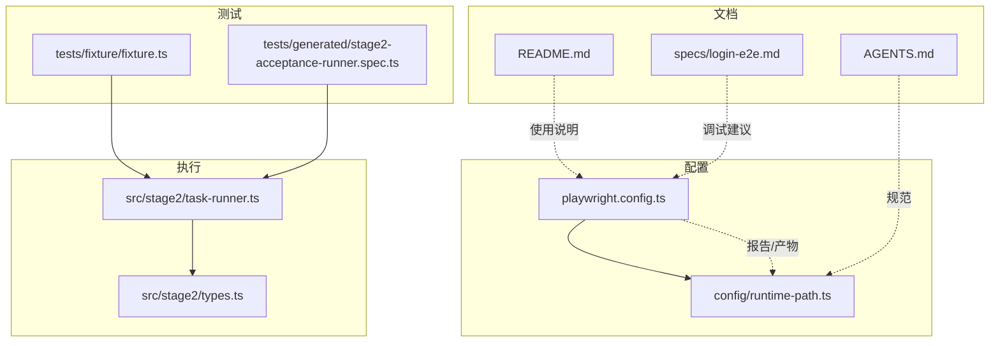
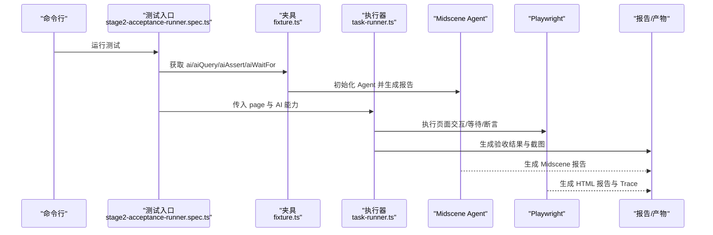
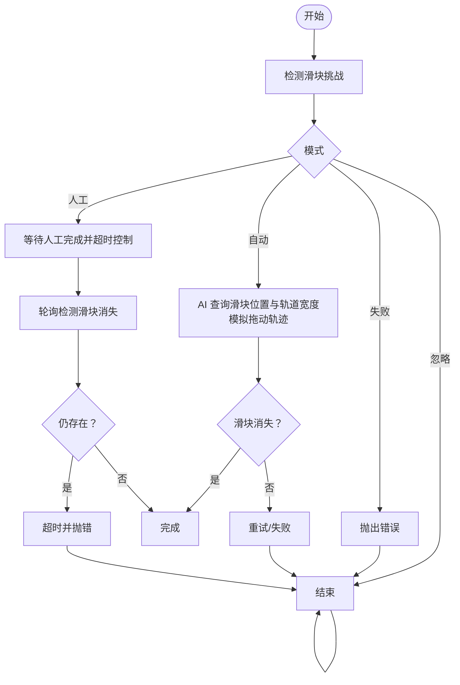
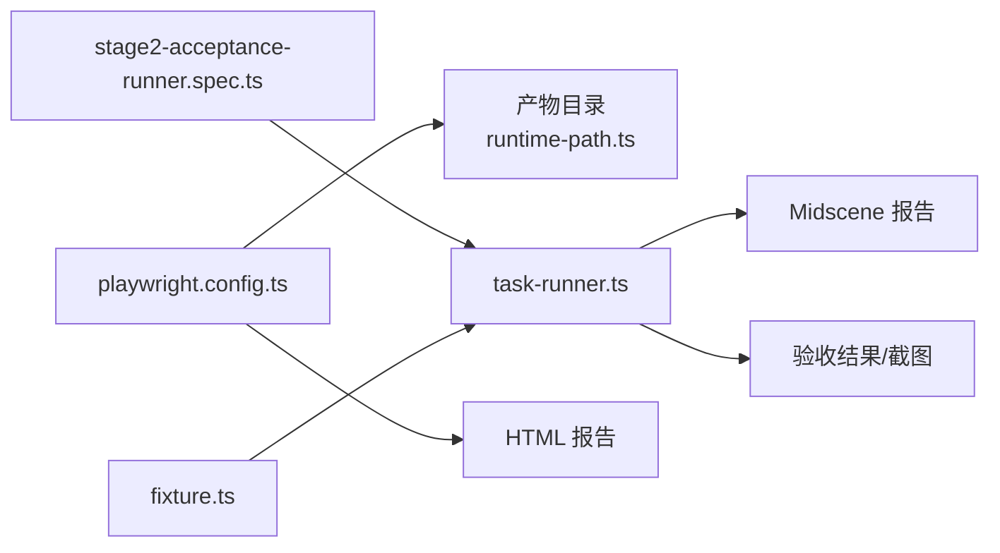

# 调试工具与技巧

<cite>
**本文引用的文件**
- [playwright.config.ts](file://playwright.config.ts)
- [package.json](file://package.json)
- [README.md](file://README.md)
- [runtime-path.ts](file://config/runtime-path.ts)
- [stage2-acceptance-runner.spec.ts](file://tests/generated/stage2-acceptance-runner.spec.ts)
- [fixture.ts](file://tests/fixture/fixture.ts)
- [task-runner.ts](file://src/stage2/task-runner.ts)
- [types.ts](file://src/stage2/types.ts)
- [login-e2e.md](file://specs/login-e2e.md)
- [AGENTS.md](file://AGENTS.md)
</cite>

## 目录
1. [简介](#简介)
2. [项目结构](#项目结构)
3. [核心组件](#核心组件)
4. [架构总览](#架构总览)
5. [详细组件分析](#详细组件分析)
6. [依赖关系分析](#依赖关系分析)
7. [性能考虑](#性能考虑)
8. [故障排查指南](#故障排查指南)
9. [结论](#结论)
10. [附录](#附录)

## 简介
本文件面向 HI-TEST 项目，聚焦 Playwright 浏览器自动化与 Midscene AI 能力的联合调试实践，覆盖断点与元素检查、网络监控、日志与结构化报告、截图与视频（HTML 报告）、性能统计与资源分析、IDE 集成与脚本化调试、以及常见问题的排查路径。文档以仓库现有配置与实现为依据，提供可操作的调试策略与工具链说明。

## 项目结构
- 配置层
  - Playwright 测试配置与报告输出目录
  - 运行时产物目录集中管理
- 测试层
  - 夹具注入 AI 能力与 Midscene Agent
  - 第二阶段任务执行入口
- 执行层
  - 任务驱动的 UI 自动化与 AI 辅助定位
  - 滑块验证码自动处理与人工兜底
- 文档与规范
  - 登录 E2E 测试计划与调试建议
  - 项目运行产物与日志规范

图表来源
- [playwright.config.ts](file://playwright.config.ts#L22-L94)
- [runtime-path.ts](file://config/runtime-path.ts#L18-L40)
- [fixture.ts](file://tests/fixture/fixture.ts#L1-L100)
- [stage2-acceptance-runner.spec.ts](file://tests/generated/stage2-acceptance-runner.spec.ts#L1-L39)
- [task-runner.ts](file://src/stage2/task-runner.ts#L1-L120)
- [types.ts](file://src/stage2/types.ts#L1-L125)
- [README.md](file://README.md#L10-L144)
- [login-e2e.md](file://specs/login-e2e.md#L1-L152)
- [AGENTS.md](file://AGENTS.md#L1-L61)

章节来源
- [playwright.config.ts](file://playwright.config.ts#L22-L94)
- [runtime-path.ts](file://config/runtime-path.ts#L18-L40)
- [README.md](file://README.md#L10-L144)

## 核心组件
- Playwright 配置与报告
  - 输出目录、报告器、并行与重试策略、首次重试收集 Trace
- 运行时产物目录
  - Playwright 执行结果、HTML 报告、Midscene 运行日志与缓存、验收结果与截图
- 测试夹具与 AI 能力
  - 注入 ai/aiQuery/aiAssert/aiWaitFor，启用 Midscene Agent 生成报告
- 任务执行器
  - 任务解析、字段填充、级联选择、按钮点击、滑块验证码处理、步骤截图与结果记录
- 类型模型
  - 任务结构、步骤结果、执行结果等

章节来源
- [playwright.config.ts](file://playwright.config.ts#L22-L94)
- [runtime-path.ts](file://config/runtime-path.ts#L18-L40)
- [fixture.ts](file://tests/fixture/fixture.ts#L23-L99)
- [stage2-acceptance-runner.spec.ts](file://tests/generated/stage2-acceptance-runner.spec.ts#L9-L38)
- [task-runner.ts](file://src/stage2/task-runner.ts#L1-L120)
- [types.ts](file://src/stage2/types.ts#L86-L125)

## 架构总览
下图展示从测试入口到执行器、再到 Midscene 报告与 Playwright HTML 报告的调试产物流向。

图表来源
- [stage2-acceptance-runner.spec.ts](file://tests/generated/stage2-acceptance-runner.spec.ts#L12-L37)
- [fixture.ts](file://tests/fixture/fixture.ts#L23-L99)
- [task-runner.ts](file://src/stage2/task-runner.ts#L558-L703)
- [playwright.config.ts](file://playwright.config.ts#L36-L40)

## 详细组件分析

### Playwright 配置与调试开关
- 关键调试开关
  - 并行与重试：提升稳定性，CI 上仅重试
  - 首次重试收集 Trace：便于失败回溯
  - 多报告器：list、HTML、第三方报告器
- 产物目录
  - 输出目录、HTML 报告目录由运行时路径模块统一解析
- 建议
  - 本地调试时可开启 --headed 查看页面
  - 失败时关注 HTML 报告与 Trace

章节来源
- [playwright.config.ts](file://playwright.config.ts#L22-L94)
- [runtime-path.ts](file://config/runtime-path.ts#L18-L40)

### 运行时产物与日志规范
- 产物目录
  - Playwright 执行结果、HTML 报告、Midscene 运行日志、验收结果与截图
- 日志与报告
  - Midscene Agent 生成报告，控制台日志保留上下文
- 建议
  - 通过 .env 统一管理路径，避免硬编码
  - 失败时优先查看 HTML 报告与 Midscene 报告

章节来源
- [README.md](file://README.md#L74-L116)
- [AGENTS.md](file://AGENTS.md#L33-L38)
- [runtime-path.ts](file://config/runtime-path.ts#L18-L40)
- [fixture.ts](file://tests/fixture/fixture.ts#L10-L10)

### 测试夹具与 AI 能力
- 夹具扩展
  - 提供 ai/aiAction/aiQuery/aiAssert/aiWaitFor，均基于 Midscene Agent
  - 生成报告、分组信息、缓存 ID 规范化
- 建议
  - 在调试中使用 aiQuery/aiAssert 快速验证页面状态
  - aiWaitFor 用于等待动态元素出现

章节来源
- [fixture.ts](file://tests/fixture/fixture.ts#L23-L99)

### 第二阶段任务执行器
- 功能要点
  - 任务解析与字段值解析
  - 可见元素定位与候选选择
  - 级联选择器展开与选项点击
  - 滑块验证码自动处理（AI 查询 + 鼠标轨迹模拟）
  - 步骤截图与结果记录
- 调试重点
  - 滑块自动处理失败时的日志与截图
  - 字段填充失败时的候选选择器与标签规范化
  - 等待超时与可见性判断

图表来源
- [task-runner.ts](file://src/stage2/task-runner.ts#L480-L703)

章节来源
- [task-runner.ts](file://src/stage2/task-runner.ts#L1-L120)
- [task-runner.ts](file://src/stage2/task-runner.ts#L480-L703)
- [types.ts](file://src/stage2/types.ts#L86-L125)

### 测试入口与失败定位
- 入口文件
  - 加载任务并执行，失败时汇总最后失败步骤信息与截图路径
- 建议
  - 结合入口抛错信息与验收结果中的截图进行定位

章节来源
- [stage2-acceptance-runner.spec.ts](file://tests/generated/stage2-acceptance-runner.spec.ts#L9-L38)

### 登录 E2E 测试计划与调试建议
- 调试建议
  - 环境变量注入、选择器兼容写法、错误消息关键字检测
  - 断言失败时优先检查 BASE_URL、表单字段 name、按钮文本与错误消息实际 HTML
- 建议
  - 本地运行单测并观察失败信息，随后根据实际 DOM 更新选择器或配置

章节来源
- [login-e2e.md](file://specs/login-e2e.md#L20-L116)

## 依赖关系分析
- 配置到产物
  - playwright.config.ts 决定报告器与输出目录，runtime-path.ts 解析具体路径
- 测试到执行
  - stage2-acceptance-runner.spec.ts 通过夹具注入 AI 能力，调用 task-runner.ts
- 执行到报告
  - Midscene Agent 生成报告；Playwright 生成 HTML 报告与 Trace

图表来源
- [playwright.config.ts](file://playwright.config.ts#L22-L94)
- [runtime-path.ts](file://config/runtime-path.ts#L18-L40)
- [stage2-acceptance-runner.spec.ts](file://tests/generated/stage2-acceptance-runner.spec.ts#L12-L37)
- [fixture.ts](file://tests/fixture/fixture.ts#L23-L99)
- [task-runner.ts](file://src/stage2/task-runner.ts#L108-L117)

章节来源
- [playwright.config.ts](file://playwright.config.ts#L22-L94)
- [runtime-path.ts](file://config/runtime-path.ts#L18-L40)
- [stage2-acceptance-runner.spec.ts](file://tests/generated/stage2-acceptance-runner.spec.ts#L12-L37)
- [fixture.ts](file://tests/fixture/fixture.ts#L23-L99)
- [task-runner.ts](file://src/stage2/task-runner.ts#L108-L117)

## 性能考虑
- 执行时间统计
  - 任务与步骤结果包含开始/结束时间与耗时，可用于性能回归
- 资源消耗
  - 并行与重试策略在 CI 上优化稳定性；本地调试建议关闭并行以减少干扰
- 报告与产物
  - HTML 报告与 Trace 有助于定位耗时环节与异常点

章节来源
- [types.ts](file://src/stage2/types.ts#L100-L125)
- [playwright.config.ts](file://playwright.config.ts#L22-L94)

## 故障排查指南

### 页面加载超时
- 现象
  - 等待元素或导航超时
- 排查
  - 检查环境变量与服务启动状态
  - 使用 aiWaitFor 等待动态元素
  - 查看 HTML 报告与 Trace 定位卡顿点
- 参考
  - [login-e2e.md](file://specs/login-e2e.md#L112-L116)

章节来源
- [login-e2e.md](file://specs/login-e2e.md#L112-L116)

### 元素定位失败
- 现象
  - 选择器不匹配或元素不可见
- 排查
  - 使用 aiQuery 验证页面状态
  - 检查标签规范化、占位文案候选与可见性判断
  - 对动态内容使用正则或角色选择器
- 参考
  - [task-runner.ts](file://src/stage2/task-runner.ts#L162-L202)
  - [task-runner.ts](file://src/stage2/task-runner.ts#L256-L274)

章节来源
- [task-runner.ts](file://src/stage2/task-runner.ts#L162-L202)
- [task-runner.ts](file://src/stage2/task-runner.ts#L256-L274)

### AI 识别错误
- 现象
  - aiQuery/aiAssert 返回不符合预期
- 排查
  - 检查 Prompt 清晰度与上下文
  - 查看 Midscene 报告与截图
  - 适当增加重试或切换为人工模式
- 参考
  - [fixture.ts](file://tests/fixture/fixture.ts#L23-L99)
  - [task-runner.ts](file://src/stage2/task-runner.ts#L507-L556)

章节来源
- [fixture.ts](file://tests/fixture/fixture.ts#L23-L99)
- [task-runner.ts](file://src/stage2/task-runner.ts#L507-L556)

### 滑块验证码处理失败
- 现象
  - 自动模式多次失败或人工模式超时
- 排查
  - 检查滑块检测选择器与文本模式
  - 调整自动拖动参数（步数、抖动、缓动）
  - 切换为 manual 模式并延长等待时间
- 参考
  - [task-runner.ts](file://src/stage2/task-runner.ts#L480-L703)
  - [README.md](file://README.md#L62-L72)

章节来源
- [task-runner.ts](file://src/stage2/task-runner.ts#L480-L703)
- [README.md](file://README.md#L62-L72)

### 截图与视频（HTML 报告）使用
- 使用场景
  - 失败案例分析：结合验收结果中的截图定位问题
  - 性能问题诊断：通过 HTML 报告与 Trace 观察页面渲染与交互耗时
- 产物位置
  - 验收结果截图、Midscene 报告、Playwright HTML 报告
- 参考
  - [README.md](file://README.md#L114-L131)

章节来源
- [README.md](file://README.md#L114-L131)

### IDE 集成与调试配置（VS Code）
- 建议
  - 使用 --headed 在本地可视化调试
  - 在测试入口设置断点，逐步执行到 AI 调用与页面交互
  - 使用变量监视观察步骤结果与截图路径
- 参考
  - [package.json](file://package.json#L6-L9)
  - [stage2-acceptance-runner.spec.ts](file://tests/generated/stage2-acceptance-runner.spec.ts#L12-L37)

章节来源
- [package.json](file://package.json#L6-L9)
- [stage2-acceptance-runner.spec.ts](file://tests/generated/stage2-acceptance-runner.spec.ts#L12-L37)

### 调试脚本与辅助工具
- 建议
  - 使用 npm run stage2:run:headed 在本地可视化执行
  - 通过 .env 统一管理路径与模式，避免硬编码
- 参考
  - [package.json](file://package.json#L6-L9)
  - [README.md](file://README.md#L31-L52)

章节来源
- [package.json](file://package.json#L6-L9)
- [README.md](file://README.md#L31-L52)

## 结论
本指南基于仓库现有配置与实现，提供了从 Playwright 配置、Midscene 报告、任务执行器到日志与产物的全链路调试方法。建议在本地使用 --headed 与断点逐步调试，在 CI 上利用重试与报告器提升稳定性。遇到常见问题时，优先检查环境变量、选择器与 AI Prompt，并结合 HTML 报告、Trace 与验收截图进行定位。

## 附录

### 常用命令与路径
- 运行第二段（任务 JSON 执行）
  - npm run stage2:run
  - npm run stage2:run:headed
- 产物目录
  - Playwright 输出目录、HTML 报告目录、Midscene 运行目录、验收结果与截图
- 参考
  - [package.json](file://package.json#L6-L9)
  - [README.md](file://README.md#L74-L116)
  - [runtime-path.ts](file://config/runtime-path.ts#L18-L40)

章节来源
- [package.json](file://package.json#L6-L9)
- [README.md](file://README.md#L74-L116)
- [runtime-path.ts](file://config/runtime-path.ts#L18-L40)