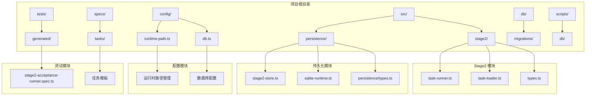
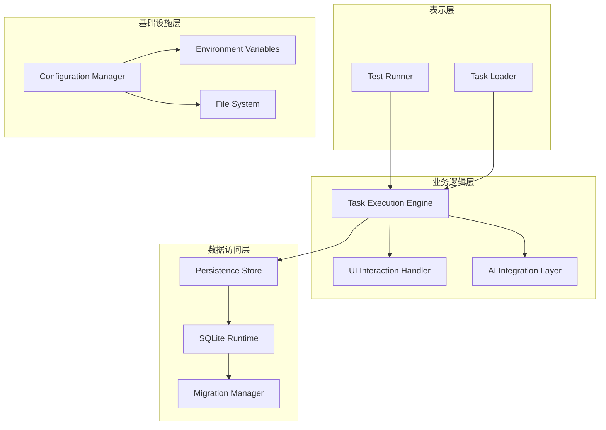
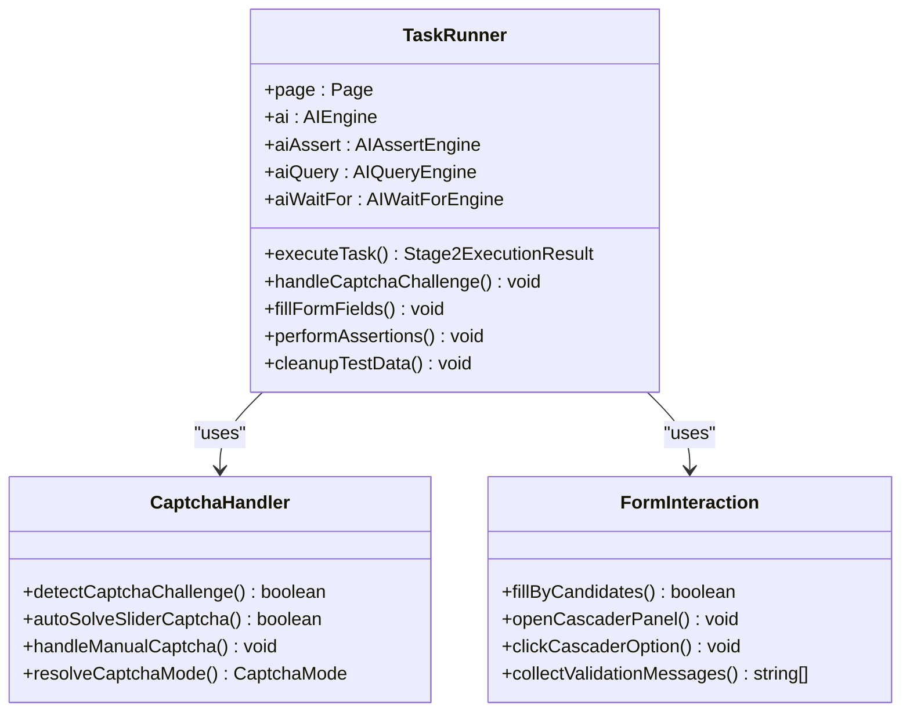
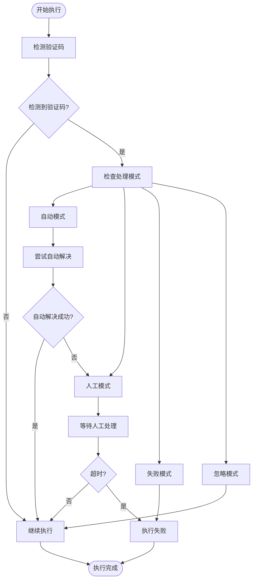
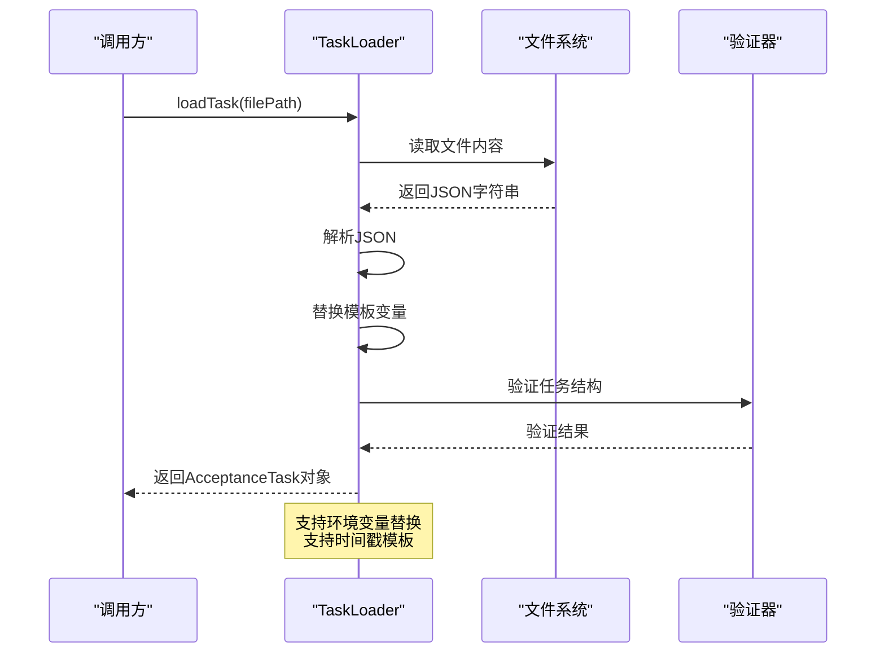
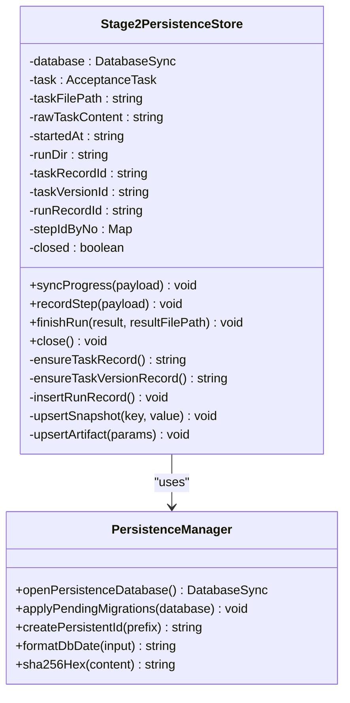
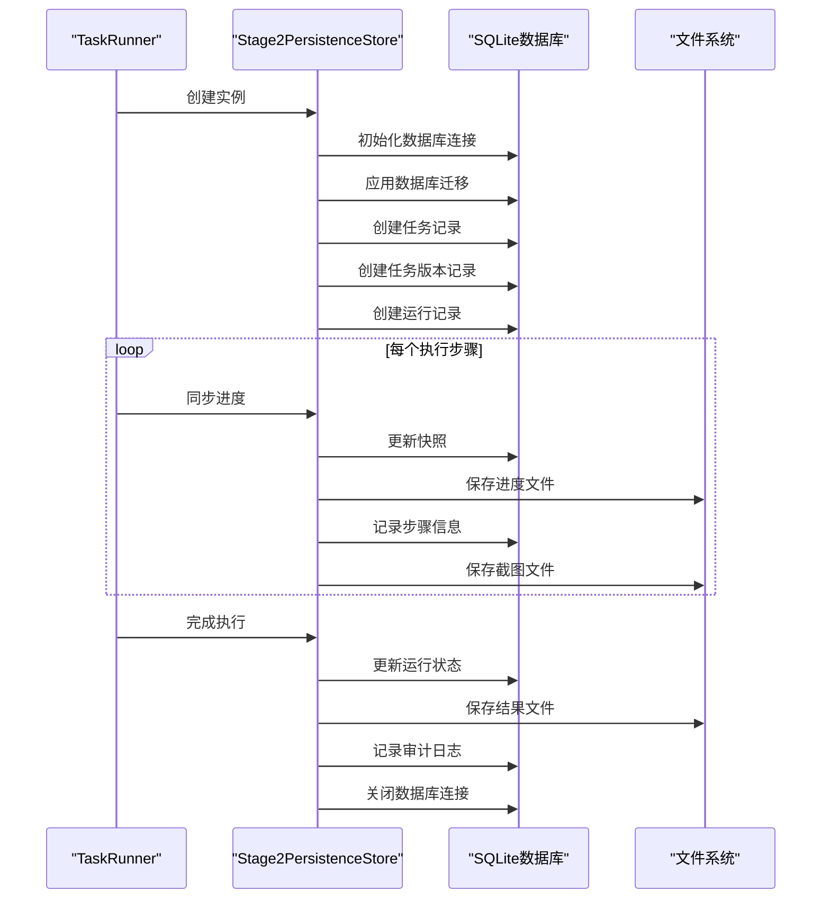
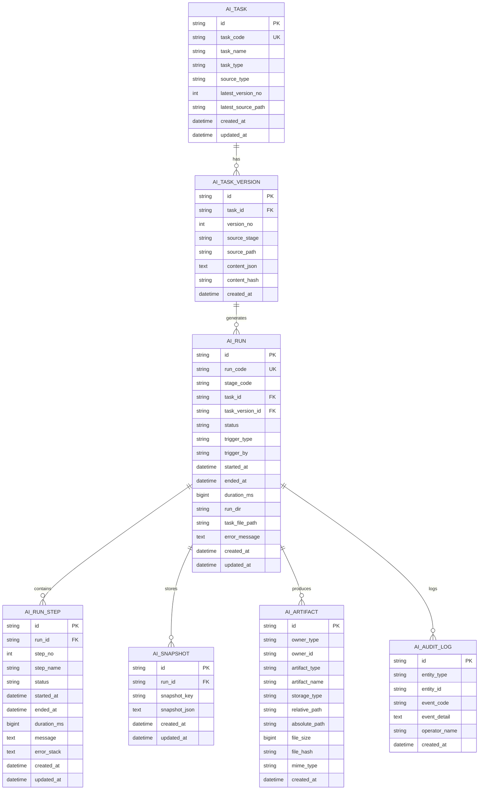
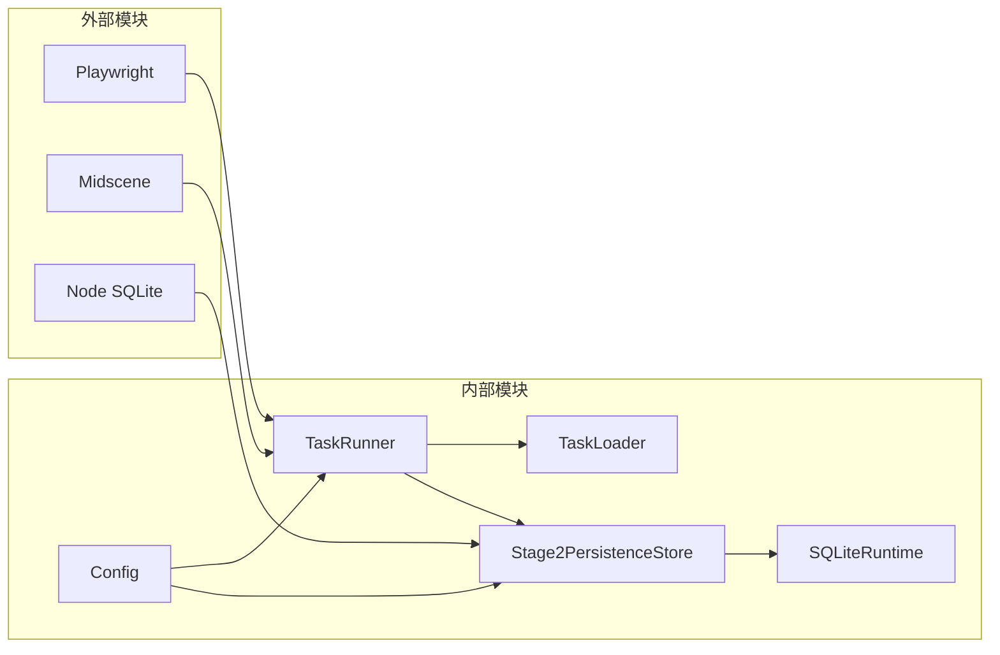

# 代码结构理解

<cite>
**本文档引用的文件**
- [task-runner.ts](file://src/stage2/task-runner.ts)
- [task-loader.ts](file://src/stage2/task-loader.ts)
- [stage2-store.ts](file://src/persistence/stage2-store.ts)
- [sqlite-runtime.ts](file://src/persistence/sqlite-runtime.ts)
- [types.ts](file://src/stage2/types.ts)
- [types.ts](file://src/persistence/types.ts)
- [runtime-path.ts](file://config/runtime-path.ts)
- [db.ts](file://config/db.ts)
- [stage2-acceptance-runner.spec.ts](file://tests/generated/stage2-acceptance-runner.spec.ts)
- [001_global_persistence_init.sql](file://db/migrations/001_global_persistence_init.sql)
- [package.json](file://package.json)
- [README.md](file://README.md)
- [acceptance-task.template.json](file://specs/tasks/acceptance-task.template.json)
</cite>

## 目录
1. [简介](#简介)
2. [项目结构](#项目结构)
3. [核心组件](#核心组件)
4. [架构概览](#架构概览)
5. [详细组件分析](#详细组件分析)
6. [依赖分析](#依赖分析)
7. [性能考虑](#性能考虑)
8. [故障排除指南](#故障排除指南)
9. [结论](#结论)

## 简介

这是一个基于 Playwright 和 Midscene.js 的 AI 自动化测试项目，专注于第二阶段（Stage2）的任务执行和数据持久化。项目采用模块化架构设计，通过 JSON 任务文件驱动自动化测试流程，实现了完整的测试执行、结果记录和数据持久化功能。

该项目的核心目标是：
- 提供可配置的 JSON 任务驱动测试框架
- 实现智能的 UI 元素定位和交互
- 集成 AI 能力进行页面理解和断言
- 建立完整的数据持久化体系
- 支持跨平台的通用配置

## 项目结构

项目采用清晰的模块化组织结构，主要分为以下几个核心目录：



**图表来源**
- [task-runner.ts:1-50](file://src/stage2/task-runner.ts#L1-L50)
- [stage2-store.ts:1-50](file://src/persistence/stage2-store.ts#L1-L50)
- [runtime-path.ts:1-41](file://config/runtime-path.ts#L1-L41)

### 目录组织原则

1. **按功能域划分**：src 目录下按业务功能划分为 stage2 和 persistence 两个主要模块
2. **按层次结构组织**：每个模块内部按照表现层、业务逻辑层、基础设施层进行组织
3. **配置集中管理**：所有配置相关的文件集中在 config 目录下
4. **测试隔离**：测试文件独立组织在 tests 目录下
5. **资源分类存放**：数据库迁移文件、脚本文件等按用途分类存放

**章节来源**
- [README.md:1-223](file://README.md#L1-L223)
- [package.json:1-26](file://package.json#L1-L26)

## 核心组件

### Stage2 执行器组件

项目的核心执行器由三个关键组件构成：

1. **TaskRunner**：主要的执行引擎，负责任务的完整生命周期管理
2. **TaskLoader**：任务加载和解析组件，负责从 JSON 文件加载和验证任务配置
3. **Stage2PersistenceStore**：数据持久化组件，负责将执行结果和中间状态持久化到数据库

### 配置管理组件

- **RuntimePath**：运行时路径管理，统一管理所有运行产物的输出目录
- **DatabaseConfig**：数据库配置管理，支持 SQLite 驱动配置

### 类型定义组件

- **Stage2Types**：定义了完整的任务执行模型和数据结构
- **PersistenceTypes**：定义了持久化相关的数据模型

**章节来源**
- [task-runner.ts:1-100](file://src/stage2/task-runner.ts#L1-L100)
- [task-loader.ts:1-50](file://src/stage2/task-loader.ts#L1-L50)
- [stage2-store.ts:74-124](file://src/persistence/stage2-store.ts#L74-L124)

## 架构概览

项目采用分层架构设计，实现了清晰的关注点分离：



**图表来源**
- [task-runner.ts:1-200](file://src/stage2/task-runner.ts#L1-L200)
- [stage2-store.ts:101-124](file://src/persistence/stage2-store.ts#L101-L124)
- [sqlite-runtime.ts:73-84](file://src/persistence/sqlite-runtime.ts#L73-L84)

### 设计模式应用

1. **工厂模式**：用于创建持久化存储实例
2. **策略模式**：用于处理不同类型的验证码处理策略
3. **观察者模式**：用于监控执行进度和状态变化
4. **适配器模式**：用于适配不同的 UI 组件类型

### 架构决策背景

- **模块化设计**：将执行逻辑和持久化逻辑分离，便于维护和扩展
- **配置驱动**：通过 JSON 任务文件实现无代码化的测试配置
- **AI 集成**：充分利用 AI 能力进行智能页面理解和交互
- **数据持久化**：建立完整的执行历史记录和审计跟踪

## 详细组件分析

### TaskRunner 组件分析

TaskRunner 是整个系统的执行核心，负责协调各个组件完成完整的测试执行流程。

#### 核心职责

1. **任务执行编排**：协调任务加载、UI 交互、断言验证等各个环节
2. **状态管理**：维护执行过程中的各种状态信息
3. **错误处理**：提供完善的异常处理和恢复机制
4. **结果聚合**：收集和汇总执行结果

#### 关键实现特性



**图表来源**
- [task-runner.ts:61-75](file://src/stage2/task-runner.ts#L61-L75)
- [task-runner.ts:483-501](file://src/stage2/task-runner.ts#L483-L501)

#### 验证码处理流程

TaskRunner 实现了智能的验证码处理机制，支持多种处理模式：



**图表来源**
- [task-runner.ts:650-706](file://src/stage2/task-runner.ts#L650-L706)

**章节来源**
- [task-runner.ts:1-2657](file://src/stage2/task-runner.ts#L1-L2657)

### TaskLoader 组件分析

TaskLoader 负责从 JSON 文件加载和解析任务配置，确保任务数据的完整性和有效性。

#### 核心功能

1. **任务文件解析**：读取和解析 JSON 任务文件
2. **模板变量替换**：支持环境变量和时间戳模板替换
3. **数据验证**：验证任务配置的完整性和正确性
4. **路径解析**：处理相对路径和绝对路径

#### 数据流处理



**图表来源**
- [task-loader.ts:79-89](file://src/stage2/task-loader.ts#L79-L89)

**章节来源**
- [task-loader.ts:1-91](file://src/stage2/task-loader.ts#L1-L91)

### Stage2PersistenceStore 组件分析

Stage2PersistenceStore 是数据持久化的核心组件，负责将执行过程中的各种数据持久化到 SQLite 数据库。

#### 核心架构



**图表来源**
- [stage2-store.ts:74-124](file://src/persistence/stage2-store.ts#L74-L124)
- [sqlite-runtime.ts:73-114](file://src/persistence/sqlite-runtime.ts#L73-L114)

#### 数据持久化流程



**图表来源**
- [stage2-store.ts:470-630](file://src/persistence/stage2-store.ts#L470-L630)

**章节来源**
- [stage2-store.ts:1-655](file://src/persistence/stage2-store.ts#L1-L655)
- [sqlite-runtime.ts:1-116](file://src/persistence/sqlite-runtime.ts#L1-L116)

### 数据模型设计

项目建立了完整的数据模型体系，支持任务执行的全生命周期管理：



**图表来源**
- [001_global_persistence_init.sql:1-128](file://db/migrations/001_global_persistence_init.sql#L1-L128)

**章节来源**
- [types.ts:1-125](file://src/persistence/types.ts#L1-L125)

## 依赖分析

项目采用了清晰的依赖管理策略，实现了低耦合高内聚的设计。

### 外部依赖

```mermaid
graph TB
subgraph "核心依赖"
A[Playwright Test] --> B[Web UI 自动化]
C[Midscene.js] --> D[AI 能力集成]
E[Node SQLite] --> F[数据库操作]
G[Dotenv] --> H[环境变量管理]
end
subgraph "开发依赖"
I[@types/node] --> J[类型定义]
K[@playwright/test] --> L[测试框架]
M[@midscene/web] --> N[AI 插件]
end
```

**图表来源**
- [package.json:15-24](file://package.json#L15-L24)

### 内部模块依赖



**图表来源**
- [task-runner.ts:1-10](file://src/stage2/task-runner.ts#L1-L10)
- [stage2-store.ts:1-13](file://src/persistence/stage2-store.ts#L1-L13)

### 依赖关系分析

1. **TaskRunner** 依赖于 TaskLoader 和 Stage2PersistenceStore
2. **Stage2PersistenceStore** 依赖于 SQLiteRuntime 和配置模块
3. **SQLiteRuntime** 依赖于配置模块和文件系统
4. **TaskLoader** 主要依赖于文件系统和类型定义

这种依赖关系确保了：
- 模块间的低耦合性
- 明确的职责边界
- 易于测试和维护

**章节来源**
- [package.json:1-26](file://package.json#L1-L26)
- [task-runner.ts:1-200](file://src/stage2/task-runner.ts#L1-L200)

## 性能考虑

### 执行性能优化

1. **异步操作优化**：所有 I/O 操作都采用异步方式，避免阻塞主线程
2. **缓存机制**：对频繁访问的数据进行缓存，减少重复计算
3. **批量操作**：数据库操作采用批量插入和更新，提高效率
4. **资源管理**：及时释放数据库连接和文件句柄

### 内存管理

1. **垃圾回收**：合理使用 JavaScript 的垃圾回收机制
2. **大对象处理**：对大文件采用流式处理而非一次性加载
3. **内存泄漏防护**：确保事件监听器和定时器的正确清理

### 数据库性能

1. **索引优化**：为常用查询字段建立适当的索引
2. **事务管理**：合理使用事务确保数据一致性
3. **连接池**：虽然当前使用单连接，但架构支持连接池扩展

## 故障排除指南

### 常见问题及解决方案

#### 验证码处理问题

**问题**：滑块验证码无法自动处理
**原因**：
- 页面元素选择器不匹配
- AI 识别失败
- 网络延迟导致的超时

**解决方案**：
1. 调整验证码检测选择器
2. 切换到人工处理模式
3. 增加等待超时时间

#### 数据库连接问题

**问题**：数据库连接失败
**原因**：
- 数据库文件权限问题
- 路径配置错误
- SQLite 驱动版本不兼容

**解决方案**：
1. 检查数据库文件权限
2. 验证数据库路径配置
3. 确认 Node.js 版本支持 SQLite

#### 任务文件加载问题

**问题**：任务文件解析失败
**原因**：
- JSON 格式错误
- 必填字段缺失
- 模板变量未定义

**解决方案**：
1. 验证 JSON 格式的正确性
2. 检查必填字段的完整性
3. 确保所有模板变量都有对应的环境变量

**章节来源**
- [task-runner.ts:650-706](file://src/stage2/task-runner.ts#L650-L706)
- [stage2-store.ts:125-133](file://src/persistence/stage2-store.ts#L125-L133)

## 结论

本项目展现了现代自动化测试框架的最佳实践，通过模块化设计、清晰的职责分离和完善的错误处理机制，构建了一个强大而灵活的测试执行平台。

### 主要优势

1. **高度模块化**：各组件职责明确，易于维护和扩展
2. **配置驱动**：通过 JSON 文件实现无代码化的测试配置
3. **AI 集成**：充分利用 AI 能力提升测试智能化水平
4. **数据持久化**：建立了完整的执行历史记录和审计体系
5. **跨平台支持**：通过通用配置支持多个 Web 平台

### 扩展建议

1. **性能监控**：添加执行性能指标收集和分析
2. **并发执行**：支持多任务并发执行和资源调度
3. **可视化界面**：开发 Web 界面用于任务管理和结果展示
4. **插件系统**：支持第三方插件扩展功能
5. **云部署**：支持云端执行和分布式测试

该项目为后续的系统扩展和功能增强奠定了坚实的基础，是一个值得学习和借鉴的优秀开源项目。