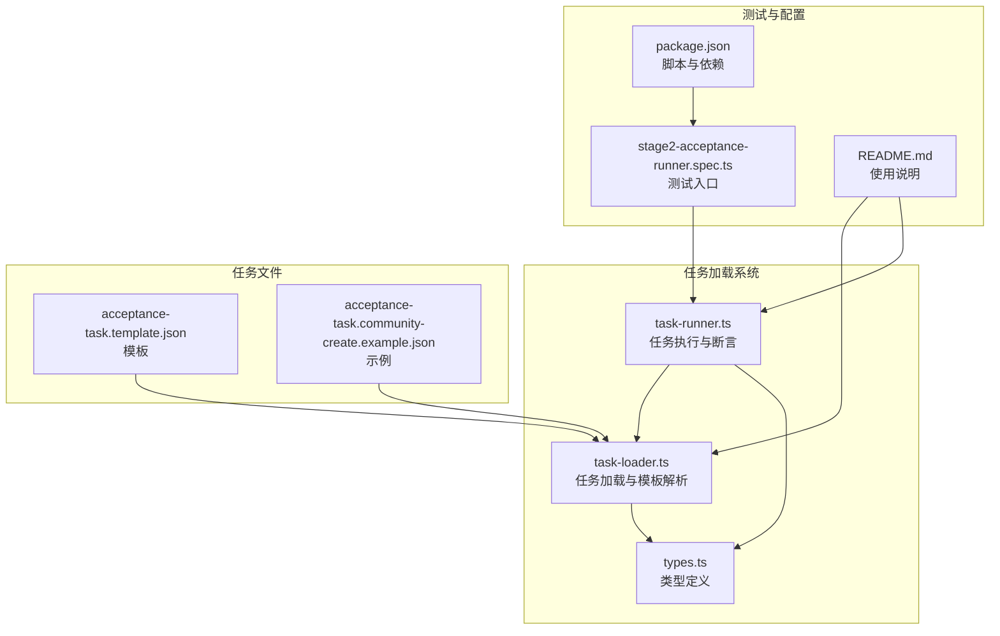
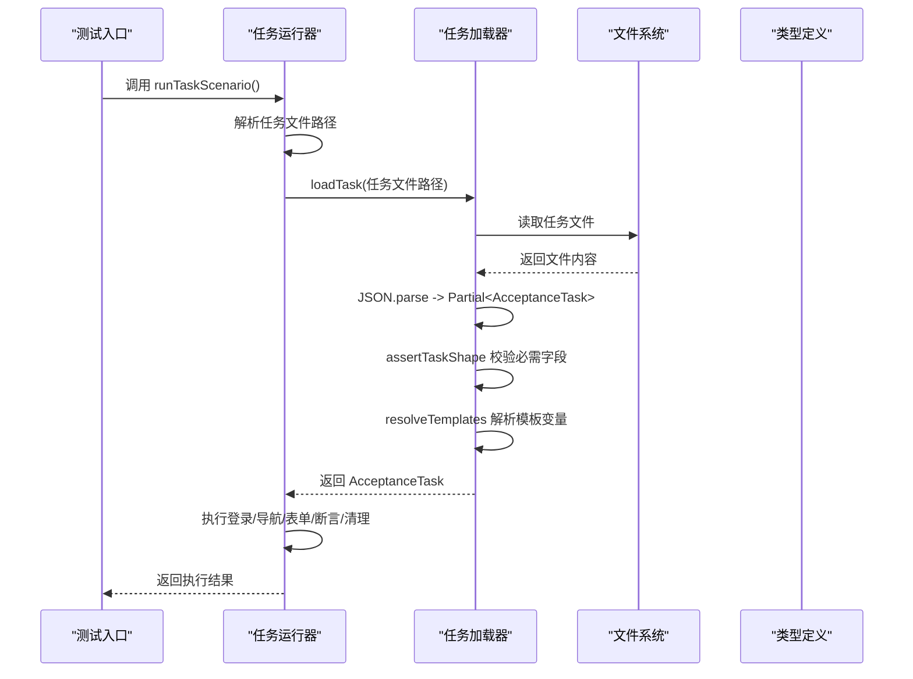
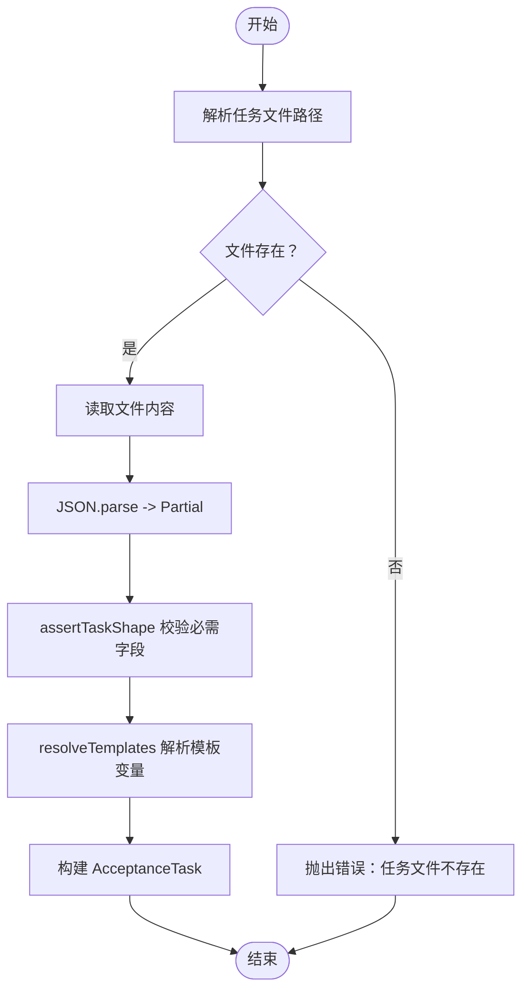
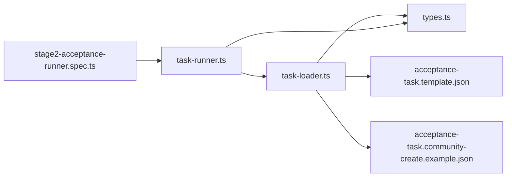

# 任务加载系统

<cite>
**本文引用的文件**
- [task-loader.ts](file://src/stage2/task-loader.ts)
- [task-runner.ts](file://src/stage2/task-runner.ts)
- [types.ts](file://src/stage2/types.ts)
- [acceptance-task.template.json](file://specs/tasks/acceptance-task.template.json)
- [acceptance-task.community-create.example.json](file://specs/tasks/acceptance-task.community-create.example.json)
- [stage2-acceptance-runner.spec.ts](file://tests/generated/stage2-acceptance-runner.spec.ts)
- [README.md](file://README.md)
- [package.json](file://package.json)
</cite>

## 目录
1. [简介](#简介)
2. [项目结构](#项目结构)
3. [核心组件](#核心组件)
4. [架构概览](#架构概览)
5. [详细组件分析](#详细组件分析)
6. [依赖关系分析](#依赖关系分析)
7. [性能考量](#性能考量)
8. [故障排查指南](#故障排查指南)
9. [结论](#结论)
10. [附录](#附录)

## 简介
本文件面向任务加载系统，重点阐述 TaskLoader 模块的设计原理与实现细节，涵盖任务配置文件解析、模板变量解析、字段校验、任务对象构建等核心流程。文档同时提供任务文件格式规范、字段定义规则、模板变量与环境变量的解析机制、继承与覆盖策略、配置示例、加载流程说明、错误处理策略以及任务模板使用指南与最佳实践建议。

## 项目结构
任务加载系统位于 stage2 子模块中，主要文件包括：
- 任务加载器：src/stage2/task-loader.ts
- 任务运行器：src/stage2/task-runner.ts
- 类型定义：src/stage2/types.ts
- 示例与模板：specs/tasks/acceptance-task.template.json、specs/tasks/acceptance-task.community-create.example.json
- 测试入口：tests/generated/stage2-acceptance-runner.spec.ts
- 项目说明：README.md、package.json

图表来源
- [task-loader.ts:1-91](file://src/stage2/task-loader.ts#L1-L91)
- [task-runner.ts:1-120](file://src/stage2/task-runner.ts#L1-L120)
- [types.ts:1-180](file://src/stage2/types.ts#L1-L180)
- [acceptance-task.template.json:1-141](file://specs/tasks/acceptance-task.template.json#L1-L141)
- [acceptance-task.community-create.example.json:1-229](file://specs/tasks/acceptance-task.community-create.example.json#L1-L229)
- [stage2-acceptance-runner.spec.ts:1-39](file://tests/generated/stage2-acceptance-runner.spec.ts#L1-L39)
- [README.md:1-223](file://README.md#L1-L223)
- [package.json:1-26](file://package.json#L1-L26)

章节来源
- [task-loader.ts:1-91](file://src/stage2/task-loader.ts#L1-L91)
- [task-runner.ts:1-120](file://src/stage2/task-runner.ts#L1-L120)
- [types.ts:1-180](file://src/stage2/types.ts#L1-L180)
- [acceptance-task.template.json:1-141](file://specs/tasks/acceptance-task.template.json#L1-L141)
- [acceptance-task.community-create.example.json:1-229](file://specs/tasks/acceptance-task.community-create.example.json#L1-L229)
- [stage2-acceptance-runner.spec.ts:1-39](file://tests/generated/stage2-acceptance-runner.spec.ts#L1-L39)
- [README.md:1-223](file://README.md#L1-L223)
- [package.json:1-26](file://package.json#L1-L26)

## 核心组件
- 任务加载器（TaskLoader）
  - 解析任务文件路径（支持绝对路径、相对路径、环境变量）
  - 读取并解析 JSON 任务文件
  - 校验任务必需字段
  - 模板变量解析（NOW_YYYYMMDDHHMMSS、环境变量占位符）
  - 构建强类型 AcceptanceTask 对象
- 任务运行器（TaskRunner）
  - 从任务文件加载任务
  - 执行登录、导航、表单填写、断言、清理等全流程
  - 支持滑块验证码自动处理
  - 生成运行目录、截图、结果文件与数据库持久化
- 类型定义（Types）
  - 定义 AcceptanceTask 及其子结构（TaskTarget、TaskAccount、TaskForm、TaskField、TaskSearch、TaskAssertion、TaskCleanup、TaskRuntime、TaskApproval 等）

章节来源
- [task-loader.ts:71-89](file://src/stage2/task-loader.ts#L71-L89)
- [task-runner.ts:2318-2399](file://src/stage2/task-runner.ts#L2318-L2399)
- [types.ts:141-154](file://src/stage2/types.ts#L141-L154)

## 架构概览
任务加载系统采用“加载器 + 运行器 + 类型定义”的分层架构：
- 加载器负责从磁盘读取任务文件并进行解析与校验
- 运行器负责执行任务流程，包含断言与清理逻辑
- 类型定义提供强类型约束，确保任务对象结构正确

图表来源
- [task-runner.ts:2318-2399](file://src/stage2/task-runner.ts#L2318-L2399)
- [task-loader.ts:79-89](file://src/stage2/task-loader.ts#L79-L89)
- [types.ts:141-154](file://src/stage2/types.ts#L141-L154)

## 详细组件分析

### 任务加载器（TaskLoader）
- 文件路径解析
  - 支持传入参数、环境变量 STAGE2_TASK_FILE、默认示例文件三种来源
  - 绝对路径直接使用，相对路径解析为工作目录下的绝对路径
- 任务文件读取与解析
  - 读取 UTF-8 文本，JSON.parse 后转换为 Partial<AcceptanceTask>
- 字段校验（assertTaskShape）
  - 必需字段：taskId、taskName、target.url、account.username/password、form.openButtonText、form.submitButtonText、form.fields（非空）
  - 任一缺失将抛出错误
- 模板变量解析（resolveTemplates）
  - 递归遍历任务对象，支持字符串、数组、对象三类
  - 字符串模板：${NOW_YYYYMMDDHHMMSS} 替换为当前时间戳（YYYYMMDDHHMMSS）
  - 字符串模板：${ENV_VAR} 替换为环境变量值，不存在则为空字符串
- 任务对象构建
  - 校验通过后，返回强类型 AcceptanceTask

图表来源
- [task-loader.ts:71-89](file://src/stage2/task-loader.ts#L71-L89)

章节来源
- [task-loader.ts:71-89](file://src/stage2/task-loader.ts#L71-L89)

### 任务文件格式规范与字段定义
- 顶层字段
  - taskId：任务唯一标识
  - taskName：任务名称
  - target：目标站点配置（url、browser、headless）
  - account：账户信息（username、password、loginHints）
  - navigation：导航配置（homeReadyText、menuPath、menuHints）
  - uiProfile：UI 适配配置（tableRowSelectors、toastSelectors、dialogSelectors）
  - form：表单配置（openButtonText、dialogTitle、submitButtonText、closeButtonText、successText、notes、fields）
  - search：搜索配置（inputLabel、extraInputLabels、keywordFromField、triggerButtonText、resetButtonText、resultTableTitle、notes、expectedColumns、rowActionButtons、pagination）
  - assertions：断言数组（type、expectedText、matchField、expectedColumns、expectedColumnFromFields、expectedColumnValues、column、expectedFromField、matchMode、timeoutMs、retryCount、soft、description）
  - cleanup：清理配置（enabled、strategy、matchField、action、searchBeforeCleanup、rowMatchMode、verifyAfterCleanup、failOnError、notes）
  - runtime：运行时配置（stepTimeoutMs、pageTimeoutMs、screenshotOnStep、trace）
  - approval：审批配置（approved、approvedBy、approvedAt）
- 字段规则
  - 必需字段：taskId、taskName、target.url、account.username、account.password、form.openButtonText、form.submitButtonText、form.fields
  - 可选字段：其余均为可选
  - 字段类型：遵循 types.ts 中的接口定义
- 继承与覆盖机制
  - 任务文件本身不支持 JSON Schema 继承
  - 通过模板文件（acceptance-task.template.json）提供字段与默认值，示例文件（community-create）覆盖模板中的必要字段
  - 运行器在执行前会加载任务文件，若缺失必需字段则报错，因此不存在“继承”覆盖，而是“示例覆盖模板 + 必需字段校验”

章节来源
- [types.ts:5-154](file://src/stage2/types.ts#L5-L154)
- [acceptance-task.template.json:1-141](file://specs/tasks/acceptance-task.template.json#L1-L141)
- [acceptance-task.community-create.example.json:1-229](file://specs/tasks/acceptance-task.community-create.example.json#L1-L229)
- [task-loader.ts:50-69](file://src/stage2/task-loader.ts#L50-L69)

### 模板变量与环境变量解析
- NOW_YYYYMMDDHHMMSS
  - 在加载时生成当前时间戳（YYYYMMDDHHMMSS），用于动态填充字段值（如去重、时间戳标记）
- 环境变量占位符
  - ${ENV_VAR} 会被替换为 process.env[ENV_VAR] 的值，不存在则为空字符串
- 解析范围
  - 递归应用于字符串、数组、对象，确保深层嵌套字段也能被解析

章节来源
- [task-loader.ts:8-31](file://src/stage2/task-loader.ts#L8-L31)
- [task-loader.ts:33-48](file://src/stage2/task-loader.ts#L33-L48)

### 任务对象构建与强类型保障
- 通过 assertTaskShape 校验后，返回 AcceptanceTask
- 类型定义确保字段结构与可选性符合预期
- 运行器在执行前再次读取任务文件，保证加载与执行一致性

章节来源
- [task-loader.ts:50-69](file://src/stage2/task-loader.ts#L50-L69)
- [types.ts:141-154](file://src/stage2/types.ts#L141-L154)

### 任务运行器与加载器集成
- 运行器在启动时调用 resolveTaskFilePath 与 loadTask
- 若开启审批要求（STAGE2_REQUIRE_APPROVAL=true），且任务未审批，则直接失败
- 运行器负责执行流程、断言与清理，并生成运行目录与结果文件

章节来源
- [task-runner.ts:2318-2399](file://src/stage2/task-runner.ts#L2318-L2399)
- [README.md:31-54](file://README.md#L31-L54)

## 依赖关系分析
- task-runner.ts 依赖 task-loader.ts 与 types.ts
- 任务文件（template 与 example）用于演示与示例，最终由 task-loader.ts 加载
- 测试入口 stage2-acceptance-runner.spec.ts 调用 runTaskScenario，间接依赖 task-runner.ts

图表来源
- [stage2-acceptance-runner.spec.ts:1-39](file://tests/generated/stage2-acceptance-runner.spec.ts#L1-L39)
- [task-runner.ts:1-120](file://src/stage2/task-runner.ts#L1-L120)
- [task-loader.ts:1-91](file://src/stage2/task-loader.ts#L1-L91)
- [types.ts:1-180](file://src/stage2/types.ts#L1-L180)
- [acceptance-task.template.json:1-141](file://specs/tasks/acceptance-task.template.json#L1-L141)
- [acceptance-task.community-create.example.json:1-229](file://specs/tasks/acceptance-task.community-create.example.json#L1-L229)

章节来源
- [stage2-acceptance-runner.spec.ts:1-39](file://tests/generated/stage2-acceptance-runner.spec.ts#L1-L39)
- [task-runner.ts:1-120](file://src/stage2/task-runner.ts#L1-L120)
- [task-loader.ts:1-91](file://src/stage2/task-loader.ts#L1-L91)
- [types.ts:1-180](file://src/stage2/types.ts#L1-L180)

## 性能考量
- 模板解析为一次性操作，仅在加载阶段执行，对整体性能影响较小
- 断言与清理流程包含多次页面等待与重试，建议合理设置 timeoutMs 与 retryCount
- 截图与报告生成会占用磁盘空间，建议在 CI 环境中控制截图频率

## 故障排查指南
- 任务文件不存在
  - 现象：抛出“任务文件不存在”错误
  - 排查：确认任务文件路径、是否为绝对路径、是否在工作目录下
- 必需字段缺失
  - 现象：抛出“缺少 taskId/taskName/target.url/account.username 或 account.password/form.openButtonText 或 form.submitButtonText/form.fields”等错误
  - 排查：对照模板字段补齐缺失项
- 模板变量解析问题
  - 现象：字段值为空或不符合预期
  - 排查：确认环境变量是否设置、NOW_YYYYMMDDHHMMSS 是否按预期替换
- 审批未通过
  - 现象：STAGE2_REQUIRE_APPROVAL=true 且任务未审批时报错
  - 排查：设置 approval.approved=true 或关闭审批要求

章节来源
- [task-loader.ts:80-82](file://src/stage2/task-loader.ts#L80-L82)
- [task-loader.ts:50-69](file://src/stage2/task-loader.ts#L50-L69)
- [task-loader.ts:19-31](file://src/stage2/task-loader.ts#L19-L31)
- [task-runner.ts:2325-2330](file://src/stage2/task-runner.ts#L2325-L2330)

## 结论
任务加载系统通过清晰的职责划分与强类型约束，实现了从任务文件到执行对象的可靠转换。模板变量与环境变量解析提供了灵活的任务配置能力；严格的字段校验确保了任务对象的完整性；运行器在加载器基础上扩展了断言与清理流程，形成完整的验收执行闭环。建议在团队内推广模板与示例文件，统一任务编写规范，提升可维护性与可复用性。

## 附录

### 任务配置示例与最佳实践
- 使用模板文件（acceptance-task.template.json）作为基线，示例文件（community-create）覆盖关键字段
- 在 form.fields 中使用 NOW_YYYYMMDDHHMMSS 动态生成唯一值，避免重复数据
- 设置合理的 assertions.timeoutMs 与 retryCount，平衡稳定性与执行效率
- 在 cleanup 中启用 verifyAfterCleanup，确保删除操作生效
- 在 CI 环境中通过环境变量注入敏感信息（如账号密码），避免硬编码

章节来源
- [acceptance-task.template.json:1-141](file://specs/tasks/acceptance-task.template.json#L1-L141)
- [acceptance-task.community-create.example.json:1-229](file://specs/tasks/acceptance-task.community-create.example.json#L1-L229)
- [README.md:31-54](file://README.md#L31-L54)