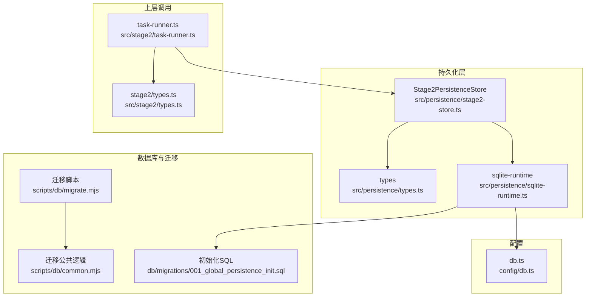
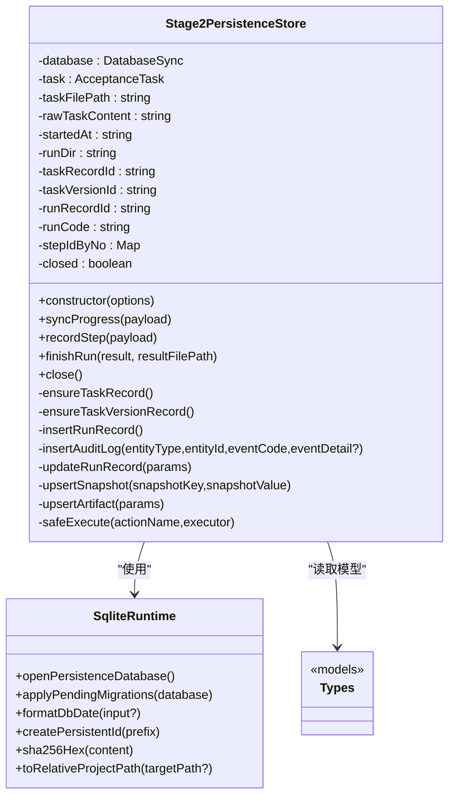
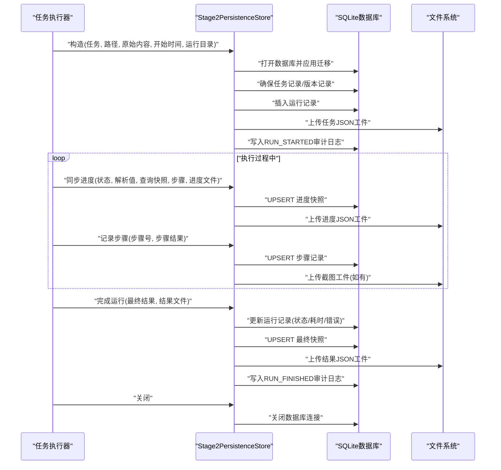
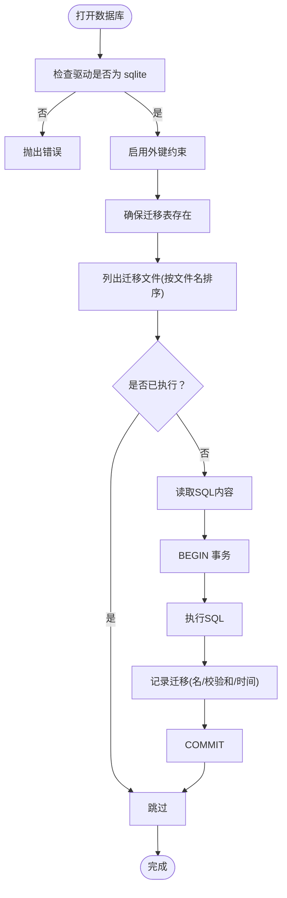
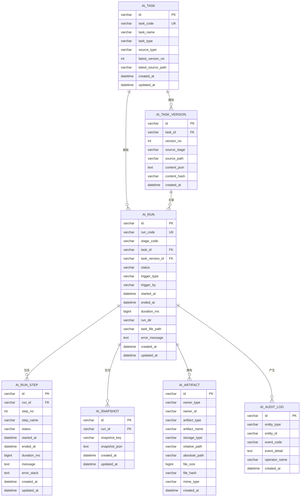
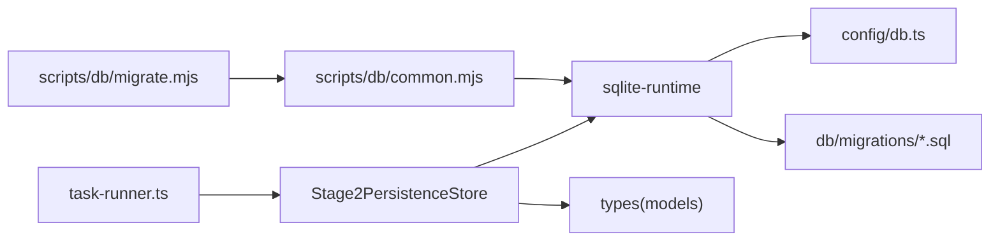

# 数据持久化层

<cite>
**本文引用的文件列表**
- [stage2-store.ts](file://src/persistence/stage2-store.ts)
- [sqlite-runtime.ts](file://src/persistence/sqlite-runtime.ts)
- [types.ts](file://src/persistence/types.ts)
- [001_global_persistence_init.sql](file://db/migrations/001_global_persistence_init.sql)
- [migrate.mjs](file://scripts/db/migrate.mjs)
- [common.mjs](file://scripts/db/common.mjs)
- [db.ts](file://config/db.ts)
- [task-runner.ts](file://src/stage2/task-runner.ts)
- [types.ts](file://src/stage2/types.ts)
</cite>

## 目录
1. [简介](#简介)
2. [项目结构](#项目结构)
3. [核心组件](#核心组件)
4. [架构总览](#架构总览)
5. [组件详细分析](#组件详细分析)
6. [依赖关系分析](#依赖关系分析)
7. [性能考量](#性能考量)
8. [故障排查指南](#故障排查指南)
9. [结论](#结论)
10. [附录](#附录)

## 简介
本文件面向数据持久化层，重点围绕 Stage2PersistenceStore 的设计与实现进行深入解析，涵盖：
- 数据存储策略与 SQLite 集成
- 文件系统存储机制与工件管理
- 执行结果存储、任务状态管理、审计日志记录
- 数据模型说明、存储接口使用方法与数据库迁移管理
- 数据备份恢复策略、性能优化配置与故障排查指南

## 项目结构
数据持久化层位于 src/persistence 目录，配合 db/migrations 提供数据库初始化与迁移能力，并通过 scripts/db 脚本工具支持独立迁移执行。配置由 config/db.ts 提供数据库路径与驱动选择。

图表来源
- [stage2-store.ts:1-655](file://src/persistence/stage2-store.ts#L1-L655)
- [sqlite-runtime.ts:1-116](file://src/persistence/sqlite-runtime.ts#L1-L116)
- [types.ts:1-125](file://src/persistence/types.ts#L1-L125)
- [001_global_persistence_init.sql:1-128](file://db/migrations/001_global_persistence_init.sql#L1-L128)
- [migrate.mjs:1-52](file://scripts/db/migrate.mjs#L1-L52)
- [common.mjs:1-108](file://scripts/db/common.mjs#L1-L108)
- [db.ts:1-28](file://config/db.ts#L1-L28)
- [task-runner.ts:2330-2657](file://src/stage2/task-runner.ts#L2330-L2657)
- [types.ts:141-180](file://src/stage2/types.ts#L141-L180)

章节来源
- [stage2-store.ts:1-655](file://src/persistence/stage2-store.ts#L1-L655)
- [sqlite-runtime.ts:1-116](file://src/persistence/sqlite-runtime.ts#L1-L116)
- [db.ts:1-28](file://config/db.ts#L1-L28)

## 核心组件
- Stage2PersistenceStore：负责任务生命周期内所有数据落盘，包括任务与版本记录、运行记录、步骤记录、快照、工件与审计日志。
- sqlite-runtime：封装 SQLite 打开、迁移应用、日期格式化、ID 生成、路径转换等通用能力。
- 数据模型：types.ts 中定义了持久化层的基础模型，与数据库表结构一一对应。
- 迁移系统：db/migrations 提供初始表结构，scripts/db 支持迁移执行与回滚。

章节来源
- [stage2-store.ts:74-123](file://src/persistence/stage2-store.ts#L74-L123)
- [sqlite-runtime.ts:73-114](file://src/persistence/sqlite-runtime.ts#L73-L114)
- [types.ts:34-123](file://src/persistence/types.ts#L34-L123)

## 架构总览
持久化层采用“类职责单一”的设计：Stage2PersistenceStore 负责业务语义的落盘；sqlite-runtime 负责底层数据库与迁移；迁移脚本提供独立执行能力；配置模块统一数据库路径与驱动。

图表来源
- [stage2-store.ts:74-641](file://src/persistence/stage2-store.ts#L74-L641)
- [sqlite-runtime.ts:73-114](file://src/persistence/sqlite-runtime.ts#L73-L114)
- [types.ts:34-123](file://src/persistence/types.ts#L34-L123)

## 组件详细分析

### Stage2PersistenceStore 设计与实现
- 初始化与生命周期
  - 构造函数中完成数据库打开、迁移应用、任务与版本记录确保、运行记录插入、任务 JSON 工件上传、审计日志记录。
  - 提供安全执行包装，避免异常影响主流程。
  - 支持关闭数据库连接，防止资源泄漏。
- 数据存储策略
  - 任务与版本：基于内容哈希去重，自动递增版本号，保留原始任务 JSON（敏感信息脱敏）。
  - 运行记录：记录运行编码、阶段、状态、触发方式、起止时间、耗时、错误信息等。
  - 步骤记录：按序号维护步骤状态、耗时、截图路径、错误栈等。
  - 快照：以键值形式保存运行过程中的关键状态（如解析值、查询快照、进度状态、最终摘要）。
  - 工件：以“拥有者+类型+名称”唯一约束，支持本地文件存储、相对/绝对路径、MIME 类型、文件大小等。
  - 审计日志：记录实体类型/ID、事件码、事件详情、操作人、时间。
- 敏感信息处理
  - 对任务 JSON 中的账号密码进行脱敏处理后再入库。
- 文件系统存储机制
  - 工件路径统一转换为相对工程路径，便于跨环境迁移。
  - 截图与中间产物通过工件表记录，便于检索与下载。

图表来源
- [stage2-store.ts:101-123](file://src/persistence/stage2-store.ts#L101-L123)
- [stage2-store.ts:470-493](file://src/persistence/stage2-store.ts#L470-L493)
- [stage2-store.ts:495-590](file://src/persistence/stage2-store.ts#L495-L590)
- [stage2-store.ts:592-630](file://src/persistence/stage2-store.ts#L592-L630)
- [stage2-store.ts:632-640](file://src/persistence/stage2-store.ts#L632-L640)

章节来源
- [stage2-store.ts:74-123](file://src/persistence/stage2-store.ts#L74-L123)
- [stage2-store.ts:125-133](file://src/persistence/stage2-store.ts#L125-L133)
- [stage2-store.ts:135-185](file://src/persistence/stage2-store.ts#L135-L185)
- [stage2-store.ts:187-261](file://src/persistence/stage2-store.ts#L187-L261)
- [stage2-store.ts:263-303](file://src/persistence/stage2-store.ts#L263-L303)
- [stage2-store.ts:305-331](file://src/persistence/stage2-store.ts#L305-L331)
- [stage2-store.ts:333-356](file://src/persistence/stage2-store.ts#L333-L356)
- [stage2-store.ts:358-395](file://src/persistence/stage2-store.ts#L358-L395)
- [stage2-store.ts:397-468](file://src/persistence/stage2-store.ts#L397-L468)
- [stage2-store.ts:470-590](file://src/persistence/stage2-store.ts#L470-L590)
- [stage2-store.ts:592-630](file://src/persistence/stage2-store.ts#L592-L630)
- [stage2-store.ts:632-640](file://src/persistence/stage2-store.ts#L632-L640)

### SQLite 数据库集成
- 数据库打开与约束
  - 通过 openPersistenceDatabase 创建数据库实例，启用外键约束并开启 PRAGMA foreign_keys。
  - 仅支持 sqlite 驱动，非 sqlite 将抛出错误。
- 迁移管理
  - applyPendingMigrations 会确保 schema_migrations 表存在，扫描 db/migrations 下的 SQL 文件，按文件名顺序执行。
  - 每个迁移文件执行在事务中，成功后记录迁移名、校验和与执行时间；失败则回滚。
- 日期与 ID
  - formatDbDate 统一日期格式，createPersistentId 生成带前缀的稳定 ID，sha256Hex 用于内容哈希。

图表来源
- [sqlite-runtime.ts:73-84](file://src/persistence/sqlite-runtime.ts#L73-L84)
- [sqlite-runtime.ts:86-114](file://src/persistence/sqlite-runtime.ts#L86-L114)
- [migrate.mjs:15-51](file://scripts/db/migrate.mjs#L15-L51)
- [common.mjs:47-58](file://scripts/db/common.mjs#L47-L58)
- [common.mjs:60-69](file://scripts/db/common.mjs#L60-L69)
- [common.mjs:71-86](file://scripts/db/common.mjs#L71-L86)
- [common.mjs:97-106](file://scripts/db/common.mjs#L97-L106)

章节来源
- [sqlite-runtime.ts:73-114](file://src/persistence/sqlite-runtime.ts#L73-L114)
- [migrate.mjs:1-52](file://scripts/db/migrate.mjs#L1-52)
- [common.mjs:1-108](file://scripts/db/common.mjs#L1-L108)

### 数据模型说明
- 任务与版本
  - ai_task：任务元数据，包含任务编码、名称、类型、来源类型、最新版本号与路径、创建/更新时间。
  - ai_task_version：任务版本，包含版本号、来源阶段/路径、内容 JSON 与哈希、创建时间。
- 运行与步骤
  - ai_run：运行记录，包含运行编码、阶段、任务/版本关联、状态、触发方式/人、起止时间、耗时、运行目录、任务文件路径、错误信息、创建/更新时间。
  - ai_run_step：步骤记录，包含运行关联、步骤序号、名称、状态、起止时间、耗时、消息/错误栈、创建/更新时间。
- 快照与工件
  - ai_snapshot：运行快照，键值对存储运行过程中的关键状态。
  - ai_artifact：工件，包含拥有者类型/ID、工件类型/名称、存储类型、路径、大小、哈希、MIME、创建时间。
- 审计日志
  - ai_audit_log：实体事件日志，包含实体类型/ID、事件码、详情、操作人、创建时间。

图表来源
- [001_global_persistence_init.sql:1-128](file://db/migrations/001_global_persistence_init.sql#L1-L128)
- [types.ts:34-123](file://src/persistence/types.ts#L34-L123)

章节来源
- [001_global_persistence_init.sql:1-128](file://db/migrations/001_global_persistence_init.sql#L1-L128)
- [types.ts:34-123](file://src/persistence/types.ts#L34-L123)

### 存储接口使用方法
- 初始化
  - 通过 createStage2PersistenceStore(options) 创建实例，options 包含 AcceptanceTask、任务文件路径、原始任务内容、开始时间、运行目录。
- 进度同步
  - 调用 syncProgress(payload) 持久化解析值、查询快照、进度状态，并上传进度 JSON 工件。
- 步骤记录
  - 调用 recordStep(payload) 持久化步骤状态、耗时、消息/错误栈，并上传截图工件（如有）。
- 完成运行
  - 调用 finishRun(result, resultFilePath) 更新运行记录状态/耗时/错误，持久化最终快照与结果 JSON 工件，并写入 RUN_FINISHED 审计日志。
- 关闭
  - 调用 close() 关闭数据库连接。

章节来源
- [stage2-store.ts:470-493](file://src/persistence/stage2-store.ts#L470-L493)
- [stage2-store.ts:495-590](file://src/persistence/stage2-store.ts#L495-L590)
- [stage2-store.ts:592-630](file://src/persistence/stage2-store.ts#L592-L630)
- [stage2-store.ts:632-640](file://src/persistence/stage2-store.ts#L632-L640)
- [stage2-store.ts:643-654](file://src/persistence/stage2-store.ts#L643-L654)

### 数据库迁移管理
- 迁移文件组织
  - db/migrations 下按顺序命名的 SQL 文件，按文件名升序执行。
- 执行流程
  - scripts/db/migrate.mjs 读取运行时配置，打开数据库，确保迁移表，遍历迁移文件，逐个执行并在事务中记录。
- 独立迁移
  - 通过命令行脚本可独立执行迁移，适用于 CI 或离线环境。

章节来源
- [migrate.mjs:1-52](file://scripts/db/migrate.mjs#L1-L52)
- [common.mjs:31-41](file://scripts/db/common.mjs#L31-L41)
- [common.mjs:47-58](file://scripts/db/common.mjs#L47-L58)
- [common.mjs:60-69](file://scripts/db/common.mjs#L60-L69)
- [common.mjs:82-86](file://scripts/db/common.mjs#L82-L86)
- [common.mjs:97-106](file://scripts/db/common.mjs#L97-L106)

### 上层调用与数据流
- 任务运行器在启动时创建持久化存储实例，在每个步骤前后同步进度与步骤记录，最终汇总结果并落盘。
- 进度文件与结果文件均写入运行目录，同时通过工件表记录以便检索。

章节来源
- [task-runner.ts:2341-2348](file://src/stage2/task-runner.ts#L2341-L2348)
- [task-runner.ts:2350-2378](file://src/stage2/task-runner.ts#L2350-L2378)
- [task-runner.ts:2417-2435](file://src/stage2/task-runner.ts#L2417-L2435)
- [task-runner.ts:2651-2655](file://src/stage2/task-runner.ts#L2651-L2655)

## 依赖关系分析
- 组件耦合
  - Stage2PersistenceStore 依赖 sqlite-runtime 提供数据库与迁移能力，依赖 types.ts 的模型定义。
  - sqlite-runtime 依赖 config/db.ts 获取数据库路径与驱动，依赖 db/migrations 的 SQL 文件。
  - 迁移脚本独立于业务层，复用 sqlite-runtime 的迁移公共逻辑。
- 外部依赖
  - node:sqlite 提供同步数据库访问。
  - fs/path 提供文件系统与路径处理。
  - dotenv 提供环境变量读取。

图表来源
- [stage2-store.ts:6-13](file://src/persistence/stage2-store.ts#L6-L13)
- [sqlite-runtime.ts:5-7](file://src/persistence/sqlite-runtime.ts#L5-L7)
- [db.ts:1-28](file://config/db.ts#L1-L28)
- [migrate.mjs:1-10](file://scripts/db/migrate.mjs#L1-L10)
- [common.mjs:1-7](file://scripts/db/common.mjs#L1-L7)
- [task-runner.ts:2341-2348](file://src/stage2/task-runner.ts#L2341-L2348)

章节来源
- [stage2-store.ts:6-13](file://src/persistence/stage2-store.ts#L6-L13)
- [sqlite-runtime.ts:5-7](file://src/persistence/sqlite-runtime.ts#L5-L7)
- [db.ts:1-28](file://config/db.ts#L1-L28)
- [migrate.mjs:1-10](file://scripts/db/migrate.mjs#L1-L10)
- [common.mjs:1-7](file://scripts/db/common.mjs#L1-L7)
- [task-runner.ts:2341-2348](file://src/stage2/task-runner.ts#L2341-L2348)

## 性能考量
- 数据库事务
  - 迁移执行采用 BEGIN/COMMIT 包裹，失败回滚，保证一致性与原子性。
- 索引设计
  - 初始迁移中为常用查询建立索引，如任务名、运行记录多列组合索引、步骤状态索引、工件类型与创建时间索引、审计日志实体索引，有助于查询性能。
- 文件系统工件
  - 工件路径统一为相对路径，减少跨环境差异带来的 IO 影响；仅记录必要元信息，避免冗余存储。
- 日志与快照
  - 快照以键值形式存储，避免大对象重复写入；审计日志按需记录，减少频繁写入。

章节来源
- [sqlite-runtime.ts:104-113](file://src/persistence/sqlite-runtime.ts#L104-L113)
- [001_global_persistence_init.sql:120-127](file://db/migrations/001_global_persistence_init.sql#L120-L127)

## 故障排查指南
- 初始化失败
  - 检查 DB_DRIVER 是否为 sqlite；确认 DB_FILE_PATH 可写；查看控制台错误输出。
- 迁移失败
  - 查看迁移文件语法与依赖；确认迁移未重复执行；检查 schema_migrations 记录。
- 数据库连接问题
  - 确认数据库文件存在且可读写；检查外键约束是否被违反；尝试重新执行迁移。
- 工件缺失或路径异常
  - 检查相对路径转换逻辑；确认文件存在；核对 MIME 类型与文件大小。
- 审计日志缺失
  - 确认事件码与实体信息正确；检查写入时机与异常捕获。

章节来源
- [stage2-store.ts:643-654](file://src/persistence/stage2-store.ts#L643-L654)
- [sqlite-runtime.ts:74-76](file://src/persistence/sqlite-runtime.ts#L74-L76)
- [sqlite-runtime.ts:109-112](file://src/persistence/sqlite-runtime.ts#L109-L112)
- [migrate.mjs:15-51](file://scripts/db/migrate.mjs#L15-L51)

## 结论
Stage2PersistenceStore 通过清晰的职责划分与完善的生命周期管理，实现了从任务定义到执行结果的全链路数据落盘。结合 SQLite 的轻量特性与迁移系统，既满足本地开发场景，又具备良好的扩展性与可维护性。建议在生产环境中配合定期备份与监控，确保数据完整性与可用性。

## 附录
- 数据备份恢复策略
  - 备份：定期复制 SQLite 文件与运行目录中的工件文件；可使用数据库内置备份命令或文件系统快照。
  - 恢复：停止服务后替换数据库文件，重建索引与迁移表；验证关键查询与工件路径。
- 性能优化配置
  - 合理设置索引覆盖常见查询；限制快照键数量与体积；批量写入时合并事务。
- 环境变量与路径
  - DB_DRIVER：当前仅支持 sqlite。
  - DB_FILE_PATH：默认位于运行目录下的数据库文件路径，可通过环境变量覆盖。

章节来源
- [db.ts:15-26](file://config/db.ts#L15-L26)
- [sqlite-runtime.ts:73-84](file://src/persistence/sqlite-runtime.ts#L73-L84)
- [migrate.mjs:15-51](file://scripts/db/migrate.mjs#L15-L51)