# 断言验证机制

<cite>
**本文引用的文件**
- [README.md](file://README.md)
- [src/stage2/task-runner.ts](file://src/stage2/task-runner.ts)
- [src/stage2/types.ts](file://src/stage2/types.ts)
- [src/persistence/types.ts](file://src/persistence/types.ts)
- [src/persistence/stage2-store.ts](file://src/persistence/stage2-store.ts)
- [tests/generated/stage2-acceptance-runner.spec.ts](file://tests/generated/stage2-acceptance-runner.spec.ts)
- [specs/tasks/acceptance-task.template.json](file://specs/tasks/acceptance-task.template.json)
</cite>

## 目录
1. [简介](#简介)
2. [项目结构](#项目结构)
3. [核心组件](#核心组件)
4. [架构概览](#架构概览)
5. [详细组件分析](#详细组件分析)
6. [依赖关系分析](#依赖关系分析)
7. [性能考虑](#性能考虑)
8. [故障排除指南](#故障排除指南)
9. [结论](#结论)

## 简介

本文档深入解析 HI-TEST 项目中的断言验证机制，这是一个基于 Playwright 和 Midscene.js 的 AI 自动化测试系统。项目实现了多步骤的断言验证流程，包括验证消息收集、字段匹配算法、断言结果记录等功能。该机制采用"Playwright 硬检测优先 + AI 断言兜底 + 重试机制"的策略，确保在不同 UI 框架和复杂场景下的稳定性。

## 项目结构

该项目采用模块化的架构设计，主要包含以下核心模块：

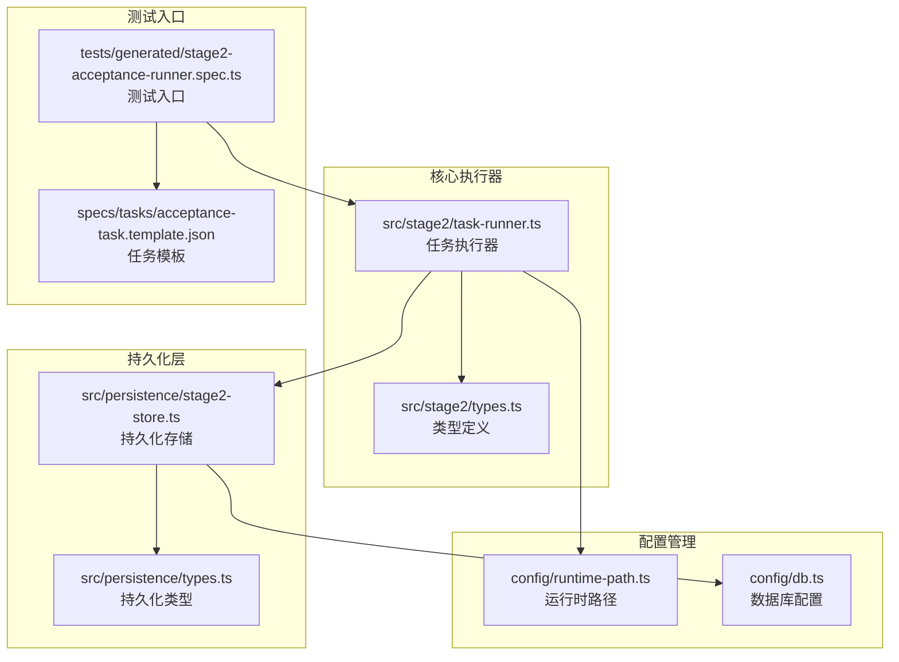

**图表来源**
- [src/stage2/task-runner.ts:1-50](file://src/stage2/task-runner.ts#L1-L50)
- [src/stage2/types.ts:1-50](file://src/stage2/types.ts#L1-L50)
- [src/persistence/stage2-store.ts:1-50](file://src/persistence/stage2-store.ts#L1-L50)

**章节来源**
- [README.md:1-223](file://README.md#L1-L223)
- [src/stage2/task-runner.ts:1-2657](file://src/stage2/task-runner.ts#L1-L2657)

## 核心组件

断言验证机制的核心组件包括：

### 1. 断言执行器 (runAssertion)
这是断言验证的核心入口，负责协调不同类型的断言执行策略：

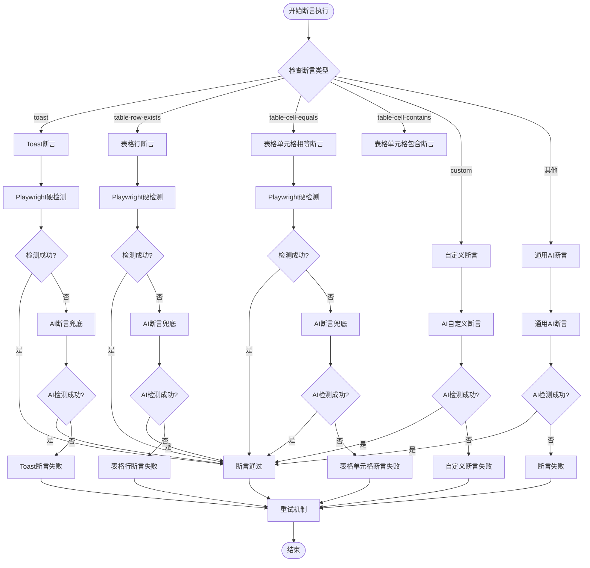

**图表来源**
- [src/stage2/task-runner.ts:1562-1917](file://src/stage2/task-runner.ts#L1562-L1917)

### 2. 验证消息收集器 (collectValidationMessages)
负责从页面中提取验证错误消息：

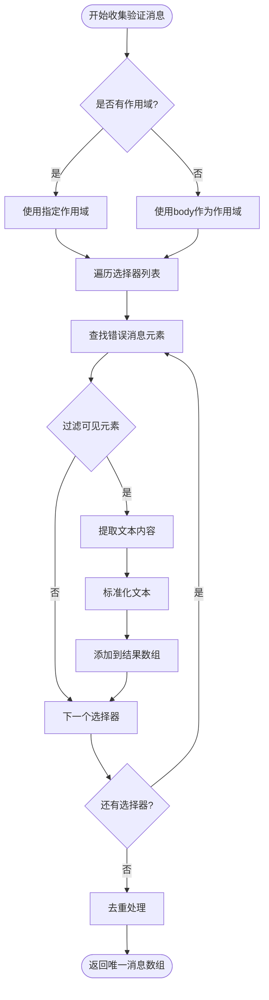

**图表来源**
- [src/stage2/task-runner.ts:338-367](file://src/stage2/task-runner.ts#L338-L367)

### 3. 字段匹配算法 (resolveFieldsByValidationMessages)
将验证消息与表单字段进行关联匹配：

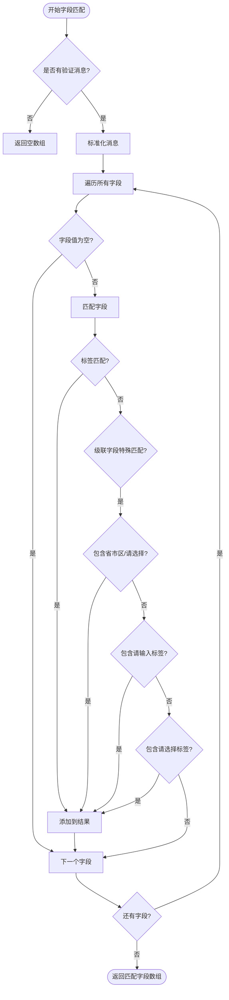

**图表来源**
- [src/stage2/task-runner.ts:369-407](file://src/stage2/task-runner.ts#L369-L407)

**章节来源**
- [src/stage2/task-runner.ts:1562-1917](file://src/stage2/task-runner.ts#L1562-L1917)
- [src/stage2/task-runner.ts:338-407](file://src/stage2/task-runner.ts#L338-L407)

## 架构概览

断言验证机制采用分层架构设计，确保了高内聚低耦合：

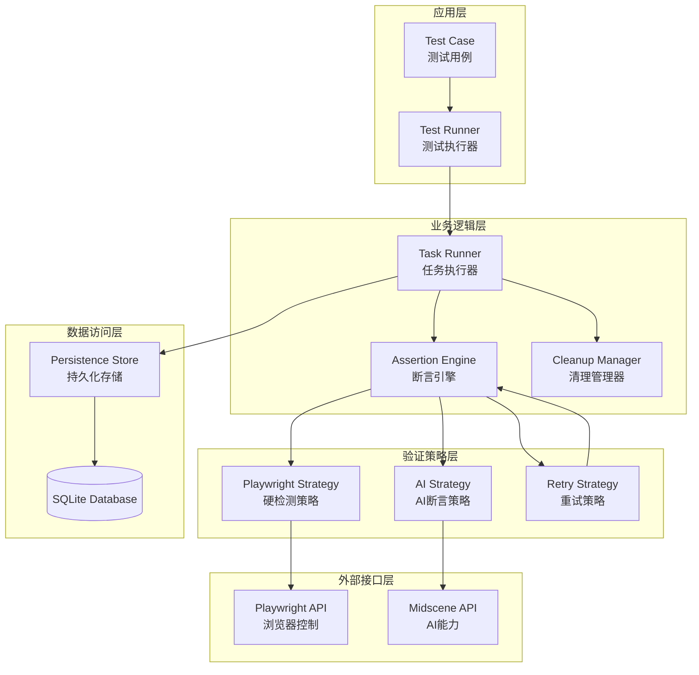

**图表来源**
- [src/stage2/task-runner.ts:2318-2657](file://src/stage2/task-runner.ts#L2318-L2657)
- [src/persistence/stage2-store.ts:74-123](file://src/persistence/stage2-store.ts#L74-L123)

## 详细组件分析

### 断言执行器 (runAssertion)

断言执行器是整个验证机制的核心，它实现了多策略的断言执行流程：

#### 1. Playwright 硬检测优先策略
断言执行器首先尝试使用 Playwright 的原生定位能力进行断言，这种方式具有更高的准确性和性能优势：

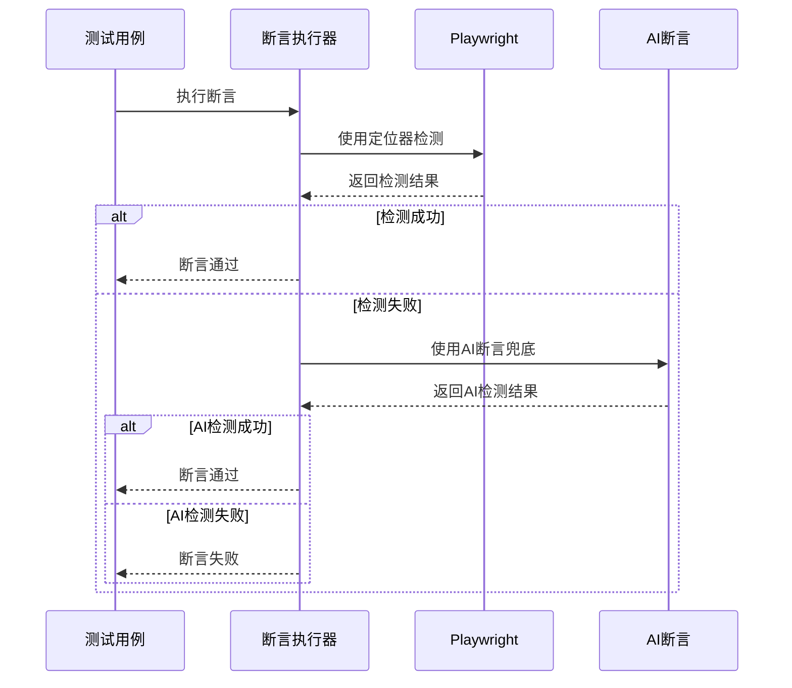

**图表来源**
- [src/stage2/task-runner.ts:1574-1615](file://src/stage2/task-runner.ts#L1574-L1615)
- [src/stage2/task-runner.ts:1644-1667](file://src/stage2/task-runner.ts#L1644-L1667)

#### 2. AI 断言兜底策略
当 Playwright 检测失败时，断言执行器会使用 AI 能力进行断言验证，确保在复杂 UI 场景下的稳定性：

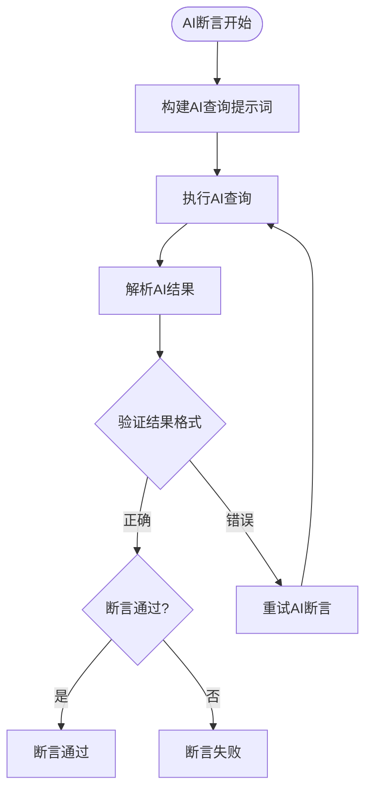

**图表来源**
- [src/stage2/task-runner.ts:1596-1610](file://src/stage2/task-runner.ts#L1596-L1610)
- [src/stage2/task-runner.ts:1739-1760](file://src/stage2/task-runner.ts#L1739-L1760)

#### 3. 重试机制
断言执行器内置了智能重试机制，通过指数退避策略和最大重试次数限制来提高断言的稳定性：

**章节来源**
- [src/stage2/task-runner.ts:1532-1556](file://src/stage2/task-runner.ts#L1532-L1556)
- [src/stage2/task-runner.ts:1562-1917](file://src/stage2/task-runner.ts#L1562-L1917)

### 验证消息收集机制

验证消息收集机制负责从页面中提取所有可见的验证错误消息，并进行标准化处理：

#### 1. 多框架支持的选择器
系统支持多种 UI 框架的错误消息选择器：

| 框架 | 选择器 | 用途 |
|------|--------|------|
| Element UI | `.el-form-item__error` | Element UI 错误提示 |
| Ant Design | `.ant-form-item-explain-error` | Ant Design 错误提示 |
| iView | `.ivu-form-item-error-tip` | iView 错误提示 |

#### 2. 消息标准化处理
收集到的消息会经过多层标准化处理：

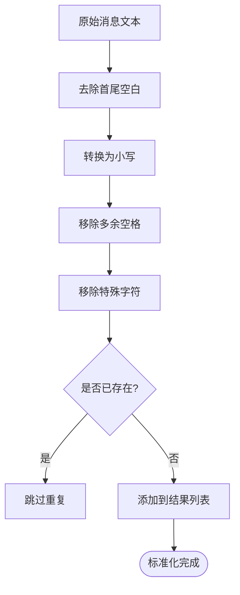

**图表来源**
- [src/stage2/task-runner.ts:1092-1094](file://src/stage2/task-runner.ts#L1092-L1094)
- [src/stage2/task-runner.ts:338-367](file://src/stage2/task-runner.ts#L338-L367)

**章节来源**
- [src/stage2/task-runner.ts:338-367](file://src/stage2/task-runner.ts#L338-L367)

### 字段匹配算法

字段匹配算法是断言验证机制的核心，它能够将验证消息与对应的表单字段进行精确匹配：

#### 1. 匹配规则体系
系统实现了多层次的匹配规则：

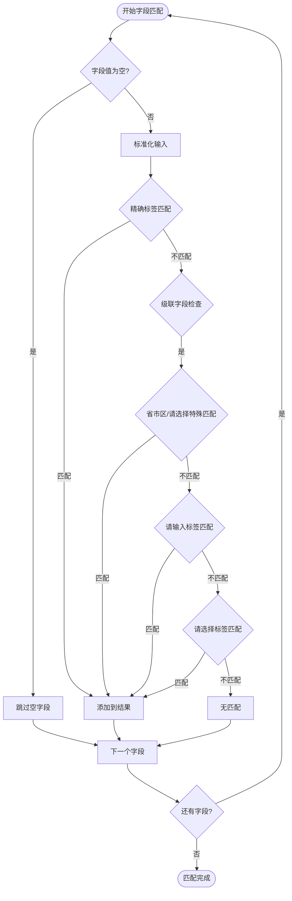

**图表来源**
- [src/stage2/task-runner.ts:369-407](file://src/stage2/task-runner.ts#L369-L407)

#### 2. 特殊字段处理
系统对特殊字段类型提供了专门的匹配逻辑：

| 字段类型 | 匹配策略 | 示例 |
|----------|----------|------|
| 级联选择器 | 省市区/请选择匹配 | `省市区`、`请选择` |
| 输入框 | 请输入标签匹配 | `请输入用户名` |
| 选择器 | 请选择标签匹配 | `请选择性别` |

**章节来源**
- [src/stage2/task-runner.ts:369-407](file://src/stage2/task-runner.ts#L369-L407)

### 不同类型断言的处理策略

#### 1. Toast 断言
Toast 断言是最常用的用户反馈验证方式：

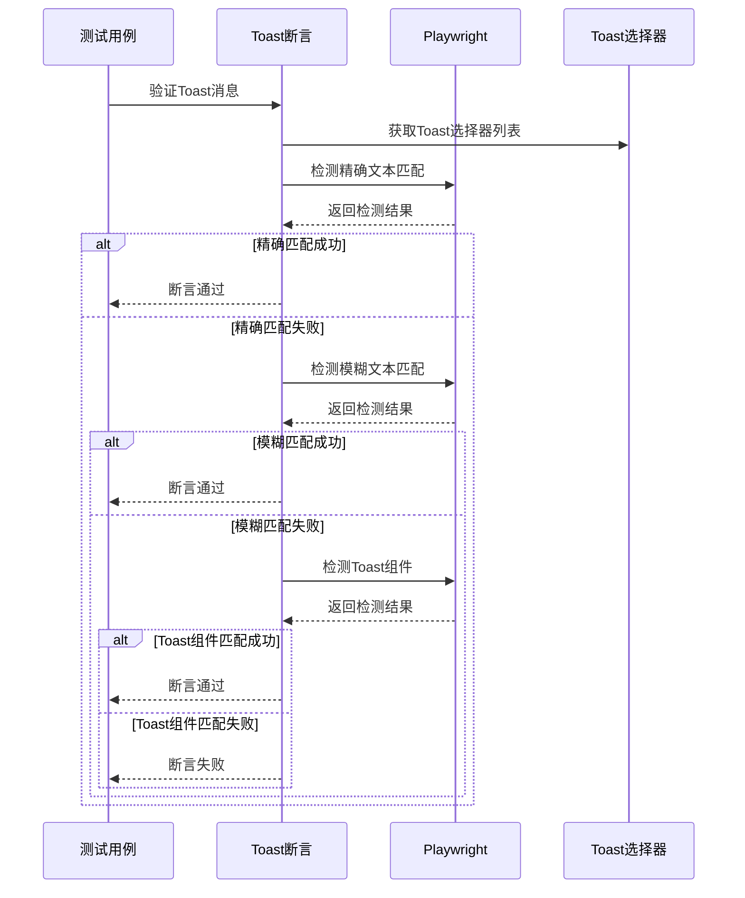

**图表来源**
- [src/stage2/task-runner.ts:1278-1322](file://src/stage2/task-runner.ts#L1278-L1322)

#### 2. 表格行断言
表格行断言支持精确匹配和包含匹配两种模式：

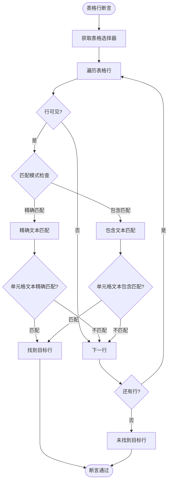

**图表来源**
- [src/stage2/task-runner.ts:1327-1367](file://src/stage2/task-runner.ts#L1327-L1367)

#### 3. 表格单元格断言
表格单元格断言提供了更精细的验证能力：

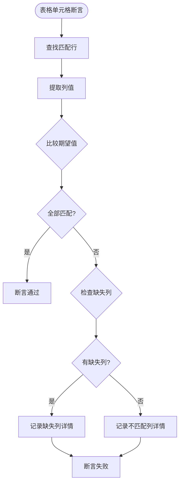

**图表来源**
- [src/stage2/task-runner.ts:1697-1732](file://src/stage2/task-runner.ts#L1697-L1732)

**章节来源**
- [src/stage2/task-runner.ts:1278-1322](file://src/stage2/task-runner.ts#L1278-L1322)
- [src/stage2/task-runner.ts:1327-1367](file://src/stage2/task-runner.ts#L1327-L1367)
- [src/stage2/task-runner.ts:1697-1732](file://src/stage2/task-runner.ts#L1697-L1732)

### 断言结果记录机制

断言验证机制不仅执行断言，还提供了完整的断言结果记录功能：

#### 1. 步骤结果记录
每个断言步骤都会被记录到步骤结果数组中：

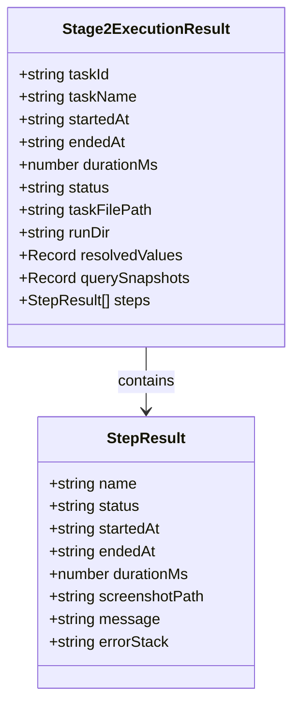

**图表来源**
- [src/stage2/types.ts:156-180](file://src/stage2/types.ts#L156-L180)

#### 2. 持久化存储
断言结果会被持久化存储到 SQLite 数据库中：

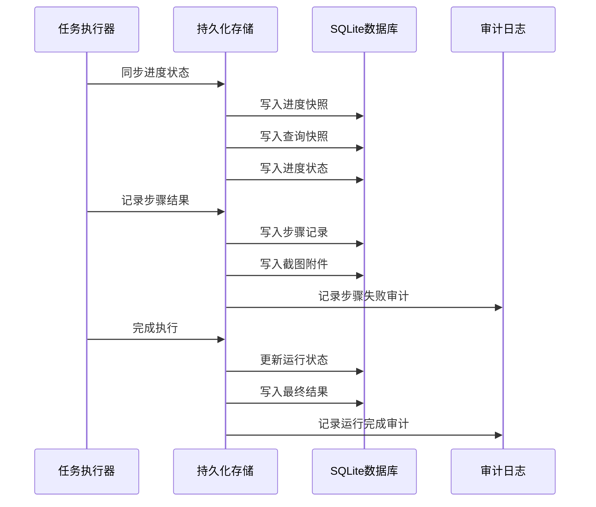

**图表来源**
- [src/persistence/stage2-store.ts:470-493](file://src/persistence/stage2-store.ts#L470-L493)
- [src/persistence/stage2-store.ts:495-590](file://src/persistence/stage2-store.ts#L495-L590)

**章节来源**
- [src/stage2/types.ts:156-180](file://src/stage2/types.ts#L156-L180)
- [src/persistence/stage2-store.ts:470-590](file://src/persistence/stage2-store.ts#L470-L590)

## 依赖关系分析

断言验证机制的依赖关系呈现清晰的层次结构：

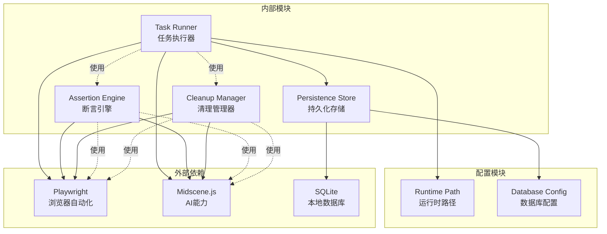

**图表来源**
- [src/stage2/task-runner.ts:1-25](file://src/stage2/task-runner.ts#L1-L25)
- [src/persistence/stage2-store.ts:1-13](file://src/persistence/stage2-store.ts#L1-L13)

**章节来源**
- [src/stage2/task-runner.ts:1-25](file://src/stage2/task-runner.ts#L1-L25)
- [src/persistence/stage2-store.ts:1-13](file://src/persistence/stage2-store.ts#L1-L13)

## 性能考虑

断言验证机制在设计时充分考虑了性能优化：

### 1. 选择器优化
系统针对不同 UI 框架提供了最优的选择器配置，减少了 DOM 查询开销：

- **Toast 选择器**: 10个预定义选择器，覆盖主流 UI 框架
- **表格行选择器**: 6个预定义选择器，支持多种表格组件
- **对话框选择器**: 8个预定义选择器，支持多种模态框组件

### 2. 缓存机制
断言执行器实现了智能缓存机制：

- **选择器缓存**: 预编译的选择器表达式
- **结果缓存**: 重试过程中的中间结果缓存
- **配置缓存**: UI 配置的动态缓存

### 3. 异步处理
断言执行器采用异步非阻塞的设计：

- **并发断言**: 支持多个断言的并发执行
- **超时控制**: 每个断言都有独立的超时控制
- **资源管理**: 自动管理内存和资源释放

## 故障排除指南

### 1. 常见断言失败原因

| 失败类型 | 可能原因 | 解决方案 |
|----------|----------|----------|
| Toast断言失败 | 文本不匹配或组件不可见 | 检查选择器配置，确认消息可见性 |
| 表格行断言失败 | 行数据不存在或匹配模式错误 | 验证数据源，调整匹配模式 |
| 表格单元格断言失败 | 列值提取失败或比较逻辑错误 | 检查列映射配置，验证数据格式 |
| AI断言失败 | 提示词不清晰或模型理解偏差 | 优化提示词，提供更明确的上下文 |

### 2. 调试技巧

#### 断言执行跟踪
系统提供了详细的断言执行日志：

```javascript
// 示例：断言执行日志输出
console.log(`[断言通过] toast="${expectedText}" (Playwright检测, 尝试${pwResult.attempts}次)`);
console.log(`[断言降级] table-cell-equals 使用AI断言`);
console.log(`[断言] 未知类型="${assertion.type}"，使用AI通用断言`);
```

#### 截图辅助调试
断言失败时会自动截取页面截图，便于问题定位：

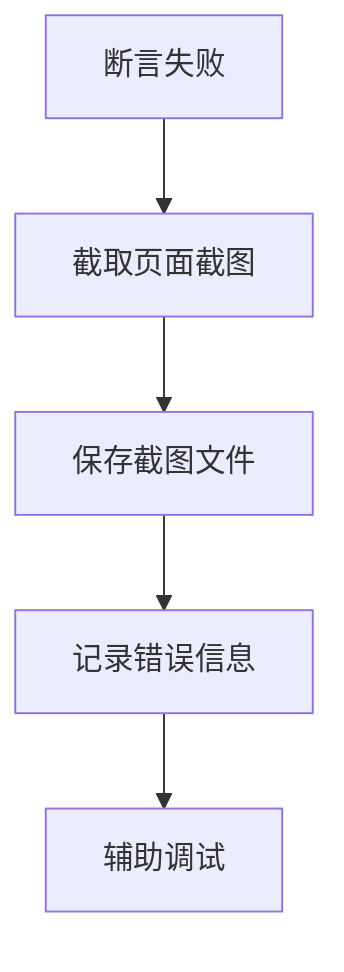

**图表来源**
- [src/stage2/task-runner.ts:2404-2424](file://src/stage2/task-runner.ts#L2404-L2424)

### 3. 性能监控
系统提供了断言执行的性能监控：

- **执行时间统计**: 每个断言的执行耗时
- **重试次数统计**: 断言重试的次数分布
- **成功率统计**: 不同断言类型的成功率

**章节来源**
- [src/stage2/task-runner.ts:2404-2424](file://src/stage2/task-runner.ts#L2404-L2424)

## 结论

HI-TEST 项目的断言验证机制展现了现代自动化测试系统的最佳实践。通过"Playwright 硬检测优先 + AI 断言兜底 + 重试机制"的多层保障策略，系统能够在复杂的 UI 场景下提供稳定可靠的断言验证能力。

### 主要优势

1. **多策略保障**: 通过多种断言策略确保验证的准确性
2. **智能重试**: 智能的重试机制提高了断言的成功率
3. **完整记录**: 详细的断言结果记录便于问题追踪和分析
4. **性能优化**: 针对不同场景的性能优化策略
5. **扩展性强**: 模块化的架构设计便于功能扩展

### 应用场景

该断言验证机制适用于以下场景：

- **复杂 UI 验证**: 支持多种 UI 框架的复杂界面验证
- **AI 驱动测试**: 结合 AI 能力进行智能化测试
- **跨平台测试**: 支持不同平台和浏览器的测试需求
- **数据驱动测试**: 基于数据的动态断言验证

通过持续的优化和完善，该断言验证机制为 HI-TEST 项目提供了强大的质量保障能力，为后续的功能扩展奠定了坚实的基础。