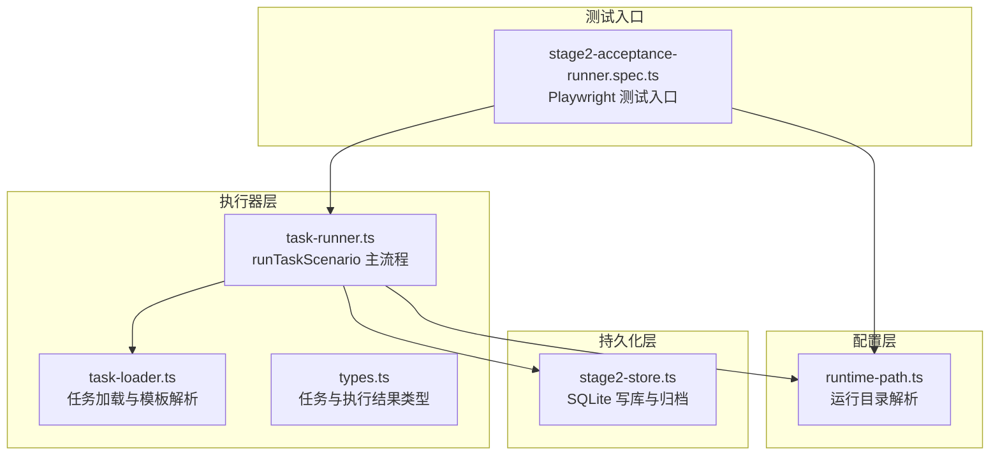
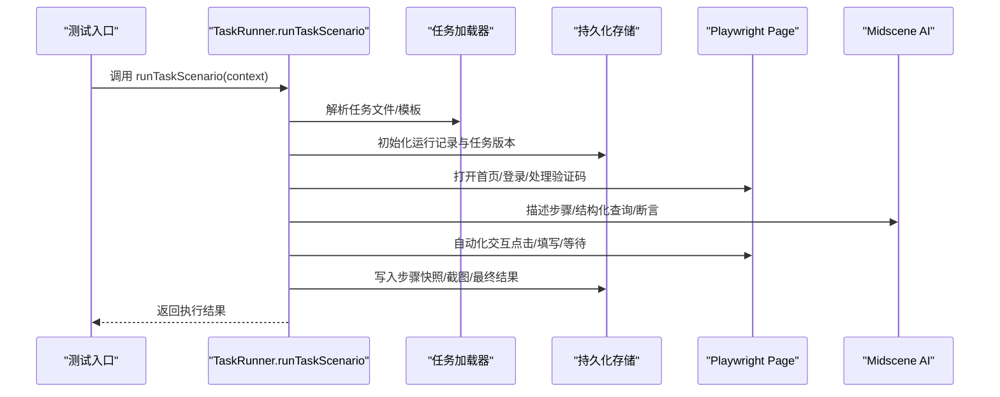
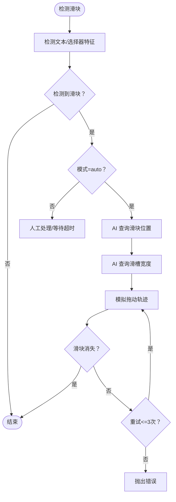
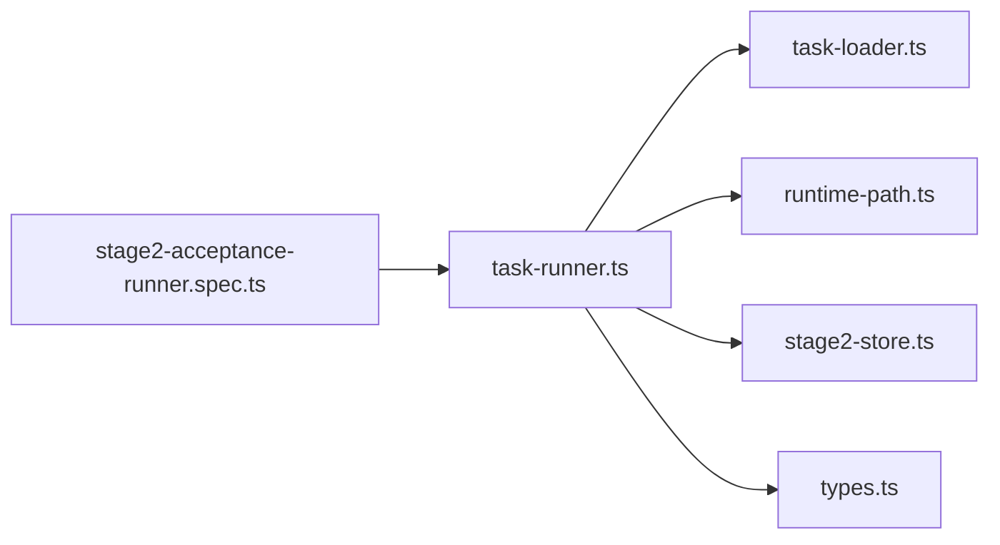

# 核心执行引擎

<cite>
**本文引用的文件**
- [task-runner.ts](file://src/stage2/task-runner.ts)
- [types.ts](file://src/stage2/types.ts)
- [task-loader.ts](file://src/stage2/task-loader.ts)
- [stage2-store.ts](file://src/persistence/stage2-store.ts)
- [runtime-path.ts](file://config/runtime-path.ts)
- [stage2-acceptance-runner.spec.ts](file://tests/generated/stage2-acceptance-runner.spec.ts)
- [README.md](file://README.md)
</cite>

## 目录
1. [简介](#简介)
2. [项目结构](#项目结构)
3. [核心组件](#核心组件)
4. [架构总览](#架构总览)
5. [详细组件分析](#详细组件分析)
6. [依赖关系分析](#依赖关系分析)
7. [性能考量](#性能考量)
8. [故障排查指南](#故障排查指南)
9. [结论](#结论)
10. [附录](#附录)

## 简介
本文件面向“核心执行引擎”的使用者与维护者，系统性阐述 TaskRunner 类（通过 runTaskScenario 导出）的设计架构与实现原理。重点覆盖：
- 任务执行流程与步骤编排
- 页面自动化控制与 AI 集成机制
- 验证码处理系统（滑块验证码自动识别与拖动）
- 动态表单字段解析与填充
- 多步断言验证（Playwright 硬检测优先 + AI 兜底 + 重试）
- 错误处理策略、超时配置与性能优化技巧
- 如何使用 runTaskScenario 方法，关键参数与返回值说明

## 项目结构
项目采用分层与模块化组织：
- src/stage2：第二阶段执行器与类型定义
- src/persistence：数据持久化（SQLite/本地文件）
- config：运行时路径与环境变量解析
- tests：端到端测试入口（调用 runTaskScenario）

图表来源
- [task-runner.ts](file://src/stage2/task-runner.ts)
- [task-loader.ts](file://src/stage2/task-loader.ts)
- [stage2-store.ts](file://src/persistence/stage2-store.ts)
- [runtime-path.ts](file://config/runtime-path.ts)
- [stage2-acceptance-runner.spec.ts](file://tests/generated/stage2-acceptance-runner.spec.ts)

章节来源
- [task-runner.ts](file://src/stage2/task-runner.ts)
- [task-loader.ts](file://src/stage2/task-loader.ts)
- [stage2-store.ts](file://src/persistence/stage2-store.ts)
- [runtime-path.ts](file://config/runtime-path.ts)
- [stage2-acceptance-runner.spec.ts](file://tests/generated/stage2-acceptance-runner.spec.ts)

## 核心组件
- TaskRunner（通过 runTaskScenario 暴露）：负责任务生命周期管理、步骤编排、页面自动化、AI 集成、断言与清理。
- 任务加载器（loadTask/resolveTaskFilePath）：解析任务 JSON，模板变量替换，形状校验。
- 类型系统（AcceptanceTask/TaskAssertion/TaskCleanup 等）：统一任务结构、断言与清理策略。
- 持久化存储（Stage2PersistenceStore）：将运行记录、步骤、快照与产物写入 SQLite 与本地文件。
- 运行时路径（resolveRuntimePath）：统一输出目录与产物路径。

章节来源
- [task-runner.ts](file://src/stage2/task-runner.ts)
- [task-loader.ts](file://src/stage2/task-loader.ts)
- [types.ts](file://src/stage2/types.ts)
- [stage2-store.ts](file://src/persistence/stage2-store.ts)
- [runtime-path.ts](file://config/runtime-path.ts)

## 架构总览
核心执行引擎以“任务 JSON 驱动 + Playwright + Midscene AI”为核心，形成“结构化任务 -> 自动化执行 -> AI 辅助 -> 结果落库”的闭环。

图表来源
- [task-runner.ts](file://src/stage2/task-runner.ts)
- [stage2-acceptance-runner.spec.ts](file://tests/generated/stage2-acceptance-runner.spec.ts)
- [stage2-store.ts](file://src/persistence/stage2-store.ts)

## 详细组件分析

### TaskRunner 设计与实现要点
- 步骤编排与错误处理
  - runStep 包装每个步骤，统一记录开始/结束时间、截图、错误信息与状态。
  - 支持“必需/可跳过”两种模式，软断言（soft=true）失败不中断流程。
- 页面自动化控制
  - 通过 Page API 完成导航、点击、填写、等待、截图等。
  - 对不可见元素或定位失败，回退至 AI 指令。
- AI 集成机制
  - ai：描述步骤并执行交互
  - aiQuery：结构化提取（如表格列值、滑块位置、滑槽宽度）
  - aiAssert：断言验证
  - aiWaitFor：等待条件满足（常规等待不适用时）
- 验证码处理系统
  - 检测滑块验证码，支持 auto/manual/fail/ignore 四种模式。
  - auto 模式：AI 识别滑块位置与滑槽宽度，Playwright 模拟拖动轨迹，最多重试 3 次。
  - manual 模式：等待人工处理，超时可配置。
- 动态表单字段解析与填充
  - 支持 cascader 级联选择（多级联动），自动打开面板、逐级点击选项并校验路径。
  - 支持普通输入框/文本域，基于标签/占位文案/对话框上下文进行定位与填充。
  - 若定位失败，回退至 AI 指令。
- 多步断言验证
  - Playwright 硬检测优先（Toast/表格行/单元格），失败则降级到 AI 断言。
  - 支持 exact/contains 匹配模式，带重试与轮询。
- 数据清理
  - 支持 delete-created/delete-all-matched/custom 策略，可前置搜索、确认弹窗、成功提示与二次校验。
  - 失败可配置 failOnError 中断任务。

章节来源
- [task-runner.ts](file://src/stage2/task-runner.ts)

### 验证码处理系统（滑块验证码自动识别与拖动）
- 检测逻辑
  - 文本特征与选择器特征双通道检测，快速判定是否存在滑块挑战。
- 自动处理流程
  - AI 识别滑块按钮中心点坐标与滑槽宽度
  - Playwright 模拟拖动：15 步缓动轨迹 + 随机抖动，到达目标位置后等待滑块消失
  - 最多重试 3 次，失败抛出明确错误
- 模式与超时
  - 模式：auto/manual/fail/ignore
  - manual 模式下可通过环境变量设置等待超时

图表来源
- [task-runner.ts](file://src/stage2/task-runner.ts)

章节来源
- [task-runner.ts](file://src/stage2/task-runner.ts)

### 动态表单字段解析与填充
- 级联选择（cascader）
  - 打开面板 -> 逐级点击选项 -> 校验显示值路径 -> 失败重试
  - 支持截图记录每一步，便于问题定位
- 普通输入
  - 基于标签/占位文案/对话框上下文定位
  - 定位失败回退至 AI 指令
- 自动修复提交
  - 提交后若弹窗未关闭，收集校验提示并自动补填缺失字段，最多重试 3 次

章节来源
- [task-runner.ts](file://src/stage2/task-runner.ts)

### 多步断言验证
- Toast 断言：Playwright 硬检测优先，失败降级 AI
- 表格行存在断言：exact/contains 两种匹配模式
- 表格单元格断言：列值严格相等/包含匹配，支持结构化解析与模糊映射
- 自定义断言：通过描述性 AI 查询执行断言
- 重试与轮询：统一的重试执行器，降低偶发性不稳定因素影响

章节来源
- [task-runner.ts](file://src/stage2/task-runner.ts)

### 数据清理
- 策略：delete-created（仅本次新增）、delete-all-matched（全量匹配）、custom（自定义）
- 前置搜索、确认弹窗处理、成功提示与二次校验
- 可配置 failOnError 中断任务

章节来源
- [task-runner.ts](file://src/stage2/task-runner.ts)

### runTaskScenario 使用指南
- 入口方法
  - runTaskScenario(runnerContext, options?)：执行完整任务生命周期
- 关键参数
  - runnerContext：包含 page、ai、aiAssert、aiQuery、aiWaitFor
  - options：rawTaskFilePath（可选，覆盖默认任务文件）
- 返回值
  - Stage2ExecutionResult：包含任务 ID/名称、开始/结束时间、耗时、状态、运行目录、解析后的字段值、查询快照、步骤列表等
- 典型用法
  - 在测试入口中调用 runTaskScenario，根据返回状态决定断言通过与否

章节来源
- [task-runner.ts](file://src/stage2/task-runner.ts)
- [stage2-acceptance-runner.spec.ts](file://tests/generated/stage2-acceptance-runner.spec.ts)

## 依赖关系分析
- 组件耦合
  - runTaskScenario 依赖任务加载器、运行时路径、持久化存储
  - 断言与清理模块复用 UI 选择器集合与匹配策略
- 外部依赖
  - Playwright Page API：页面导航、交互、等待
  - Midscene AI：结构化查询、断言、描述性指令
  - Node FS：文件读写、截图保存
  - SQLite：本地持久化

图表来源
- [task-runner.ts](file://src/stage2/task-runner.ts)
- [task-loader.ts](file://src/stage2/task-loader.ts)
- [stage2-store.ts](file://src/persistence/stage2-store.ts)
- [runtime-path.ts](file://config/runtime-path.ts)
- [stage2-acceptance-runner.spec.ts](file://tests/generated/stage2-acceptance-runner.spec.ts)

章节来源
- [task-runner.ts](file://src/stage2/task-runner.ts)
- [task-loader.ts](file://src/stage2/task-loader.ts)
- [stage2-store.ts](file://src/persistence/stage2-store.ts)
- [runtime-path.ts](file://config/runtime-path.ts)
- [stage2-acceptance-runner.spec.ts](file://tests/generated/stage2-acceptance-runner.spec.ts)

## 性能考量
- 步骤级截图与持久化
  - 可通过 runtime.screenshotOnStep 控制是否在每个步骤截图，避免产生过多文件
- 超时与轮询
  - 合理设置 stepTimeoutMs/pageTimeoutMs，避免长时间阻塞
  - 断言轮询间隔与重试次数可调，平衡稳定性与速度
- AI 调用频率
  - 仅在必要时调用 aiQuery/aiAssert，避免过度依赖导致性能下降
- 级联选择与提交重试
  - cascader 与提交失败重试次数有限，避免无限循环
- 数据库写入
  - 进度快照与最终结果写入 SQLite 与文件，注意磁盘 IO 影响

[本节为通用指导，无需特定文件引用]

## 故障排查指南
- 验证码处理失败
  - 检查 STAGE2_CAPTCHA_MODE 与 STAGE2_CAPTCHA_WAIT_TIMEOUT_MS
  - 查看自动处理截图与日志，确认滑块样式与选择器是否匹配
- 表单字段无法定位
  - 检查字段 hints/占位文案是否正确
  - 确认对话框标题与 openButtonText 是否一致
- 断言失败
  - 使用 soft=true 将断言设为软断言，避免中断流程
  - 检查 matchMode/exact/contains 是否符合预期
- 清理失败
  - 检查 searchBeforeCleanup/rowMatchMode/successText/verifyAfterCleanup 配置
  - 若 failOnError=true，清理失败将中断任务

章节来源
- [task-runner.ts](file://src/stage2/task-runner.ts)
- [README.md](file://README.md)

## 结论
核心执行引擎以“结构化任务 + Playwright + Midscene AI”为基础，构建了高鲁棒性的自动化执行框架。通过步骤化编排、AI 辅助定位与断言、完善的错误处理与持久化，能够稳定地完成从登录、表单填写、断言到清理的全流程验收。建议在生产环境中合理配置超时与重试、控制截图数量、谨慎使用 AI，以获得最佳的稳定性与性能。

[本节为总结，无需特定文件引用]

## 附录

### 关键配置与环境变量
- STAGE2_TASK_FILE：任务 JSON 文件路径
- STAGE2_REQUIRE_APPROVAL：是否要求人工审批
- STAGE2_CAPTCHA_MODE：验证码处理模式（auto/manual/fail/ignore）
- STAGE2_CAPTCHA_WAIT_TIMEOUT_MS：人工处理等待超时（毫秒）
- RUNTIME_DIR_PREFIX/ACCEPTANCE_RESULT_DIR：运行产物目录前缀与验收结果目录

章节来源
- [README.md](file://README.md)