# 表单字段处理

<cite>
**本文引用的文件**
- [README.md](file://README.md)
- [package.json](file://package.json)
- [src/stage2/task-runner.ts](file://src/stage2/task-runner.ts)
- [src/stage2/types.ts](file://src/stage2/types.ts)
- [specs/tasks/acceptance-task.template.json](file://specs/tasks/acceptance-task.template.json)
</cite>

## 目录
1. [简介](#简介)
2. [项目结构](#项目结构)
3. [核心组件](#核心组件)
4. [架构概览](#架构概览)
5. [详细组件分析](#详细组件分析)
6. [依赖关系分析](#依赖关系分析)
7. [性能考虑](#性能考虑)
8. [故障排除指南](#故障排除指南)
9. [结论](#结论)
10. [附录](#附录)

## 简介
本文档深入解析了基于 Playwright 和 Midscene.js 的自动化测试项目中的表单字段处理机制。重点涵盖动态表单字段解析、占位符匹配、级联选择器处理等核心功能，并详细说明字段值提取算法、可见性检测、输入框定位策略等实现细节。文档还提供了不同 UI 框架（Element Plus、Ant Design、iView）的兼容性处理和错误恢复机制的具体实现。

该项目基于 Playwright 进行 Web UI 自动化测试，结合 Midscene.js 提供的 AI 定位、提取、断言能力，实现了高度智能化的表单处理流程。

## 项目结构
项目采用模块化架构，主要包含以下关键目录和文件：

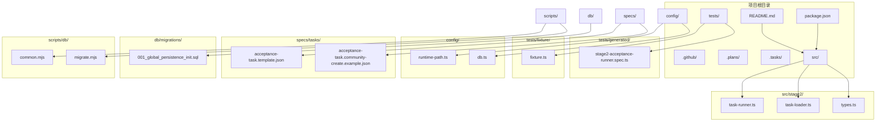

**图表来源**
- [README.md:1-223](file://README.md#L1-L223)
- [package.json:1-26](file://package.json#L1-L26)

**章节来源**
- [README.md:1-223](file://README.md#L1-L223)
- [package.json:1-26](file://package.json#L1-L26)

## 核心组件
表单字段处理系统由多个核心组件构成，每个组件负责特定的功能领域：

### 主要组件架构
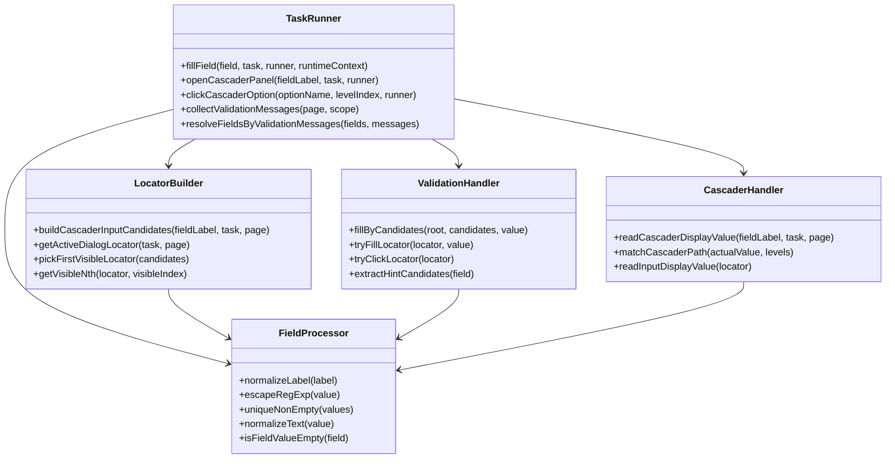

**图表来源**
- [src/stage2/task-runner.ts:897-974](file://src/stage2/task-runner.ts#L897-L974)
- [src/stage2/task-runner.ts:139-163](file://src/stage2/task-runner.ts#L139-L163)
- [src/stage2/task-runner.ts:207-228](file://src/stage2/task-runner.ts#L207-L228)

### 数据模型
系统使用 TypeScript 接口定义表单字段的数据结构：

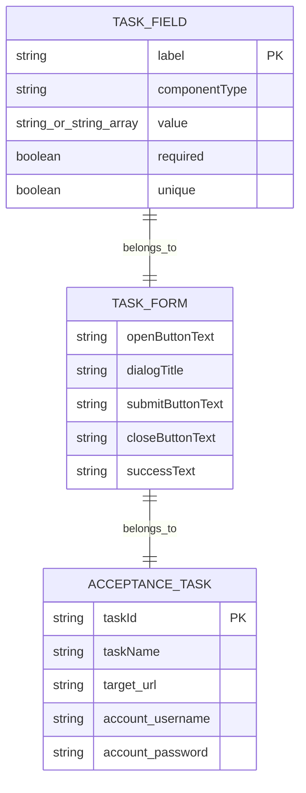

**图表来源**
- [src/stage2/types.ts:23-40](file://src/stage2/types.ts#L23-L40)
- [src/stage2/types.ts:32-40](file://src/stage2/types.ts#L32-L40)
- [src/stage2/types.ts:141-154](file://src/stage2/types.ts#L141-L154)

**章节来源**
- [src/stage2/types.ts:1-180](file://src/stage2/types.ts#L1-L180)

## 架构概览
表单字段处理系统采用分层架构设计，实现了高度模块化的功能组织：

### 整体架构流程
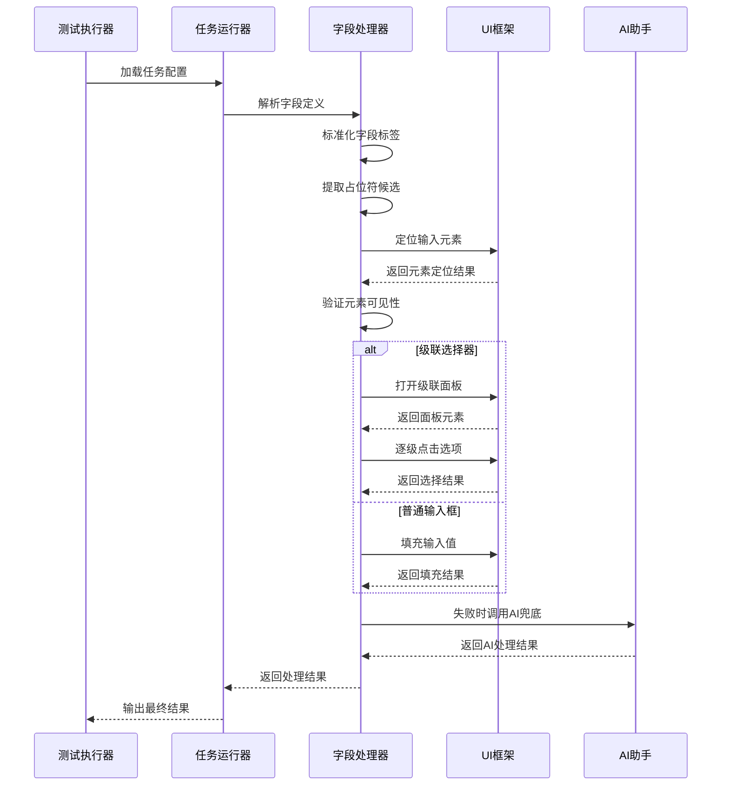

**图表来源**
- [src/stage2/task-runner.ts:897-974](file://src/stage2/task-runner.ts#L897-L974)
- [src/stage2/task-runner.ts:708-724](file://src/stage2/task-runner.ts#L708-L724)

### UI框架兼容性架构
系统通过统一的选择器抽象层实现多 UI 框架兼容：

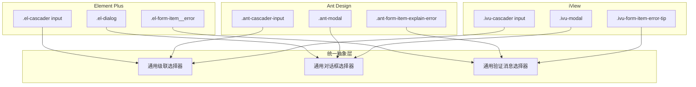

**图表来源**
- [src/stage2/task-runner.ts:207-228](file://src/stage2/task-runner.ts#L207-L228)
- [src/stage2/task-runner.ts:343-347](file://src/stage2/task-runner.ts#L343-L347)

**章节来源**
- [src/stage2/task-runner.ts:185-412](file://src/stage2/task-runner.ts#L185-L412)

## 详细组件分析

### 动态表单字段解析
动态表单字段解析是整个系统的核心功能，负责将任务配置转换为可执行的 UI 操作。

#### 字段标签标准化算法
字段标签标准化采用多阶段处理策略：

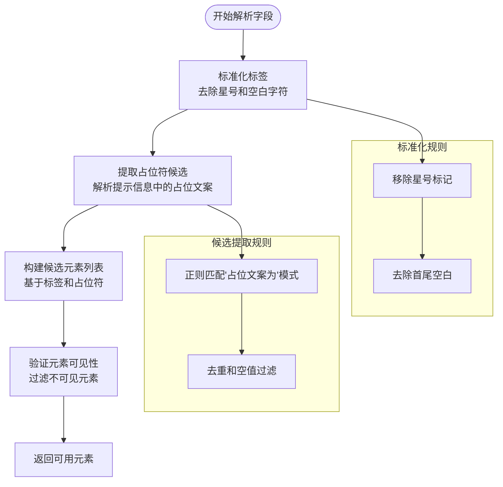

**图表来源**
- [src/stage2/task-runner.ts:143-145](file://src/stage2/task-runner.ts#L143-L145)
- [src/stage2/task-runner.ts:279-290](file://src/stage2/task-runner.ts#L279-L290)
- [src/stage2/task-runner.ts:165-183](file://src/stage2/task-runner.ts#L165-L183)

#### 字段值提取算法
字段值提取算法支持多种数据类型和格式：

**章节来源**
- [src/stage2/task-runner.ts:89-94](file://src/stage2/task-runner.ts#L89-L94)
- [src/stage2/task-runner.ts:131-137](file://src/stage2/task-runner.ts#L131-L137)

### 占位符匹配机制
占位符匹配机制通过多层候选匹配策略确保高成功率：

#### 候选元素匹配策略
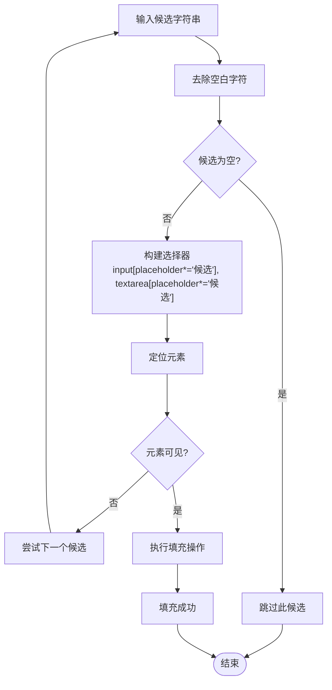

**图表来源**
- [src/stage2/task-runner.ts:259-277](file://src/stage2/task-runner.ts#L259-L277)
- [src/stage2/task-runner.ts:433-451](file://src/stage2/task-runner.ts#L433-L451)

**章节来源**
- [src/stage2/task-runner.ts:259-277](file://src/stage2/task-runner.ts#L259-L277)
- [src/stage2/task-runner.ts:433-451](file://src/stage2/task-runner.ts#L433-L451)

### 级联选择器处理
级联选择器处理是系统中最复杂的组件之一，需要处理多层级的选择逻辑。

#### 级联选择器处理流程
```mermaid
sequenceDiagram
participant User as 用户
participant Runner as 运行器
participant Panel as 级联面板
participant Option as 选项元素
participant Validator as 验证器
User->>Runner : 触发级联选择
Runner->>Runner : 标准化字段标签
Runner->>Panel : 定位级联输入框
Panel-->>Runner : 返回输入框元素
Runner->>Panel : 点击打开面板
Panel-->>Runner : 显示面板
loop 对每一级选项
Runner->>Option : 定位目标选项
Option-->>Runner : 返回选项元素
Runner->>Option : 点击选项
Option-->>Runner : 选项被选中
end
Runner->>Validator : 验证选择结果
Validator-->>Runner : 返回验证结果
alt 验证失败
Runner->>Runner : 重试机制
Runner->>Panel : 关闭面板
Runner->>Panel : 重新打开
end
Runner-->>User : 返回最终结果
```

**图表来源**
- [src/stage2/task-runner.ts:897-974](file://src/stage2/task-runner.ts#L897-L974)
- [src/stage2/task-runner.ts:708-724](file://src/stage2/task-runner.ts#L708-L724)
- [src/stage2/task-runner.ts:726-788](file://src/stage2/task-runner.ts#L726-L788)

#### 级联路径匹配算法
级联路径匹配算法支持灵活的匹配策略：

**章节来源**
- [src/stage2/task-runner.ts:326-336](file://src/stage2/task-runner.ts#L326-L336)
- [src/stage2/task-runner.ts:708-788](file://src/stage2/task-runner.ts#L708-L788)

### 可见性检测机制
可见性检测机制通过多层判断确保元素定位的准确性：

#### 可见性检测策略
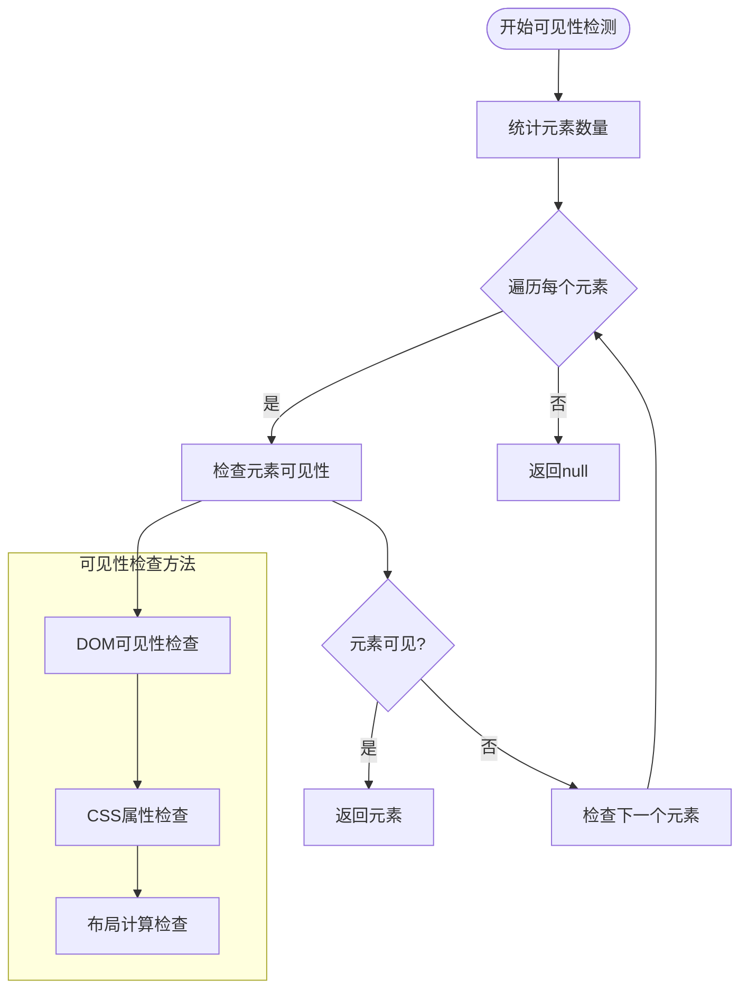

**图表来源**
- [src/stage2/task-runner.ts:185-205](file://src/stage2/task-runner.ts#L185-L205)
- [src/stage2/task-runner.ts:469-481](file://src/stage2/task-runner.ts#L469-L481)

**章节来源**
- [src/stage2/task-runner.ts:185-205](file://src/stage2/task-runner.ts#L185-L205)
- [src/stage2/task-runner.ts:469-481](file://src/stage2/task-runner.ts#L469-L481)

### 输入框定位策略
输入框定位策略采用多维度选择器组合，确保在不同 UI 框架下的兼容性：

#### 定位策略矩阵
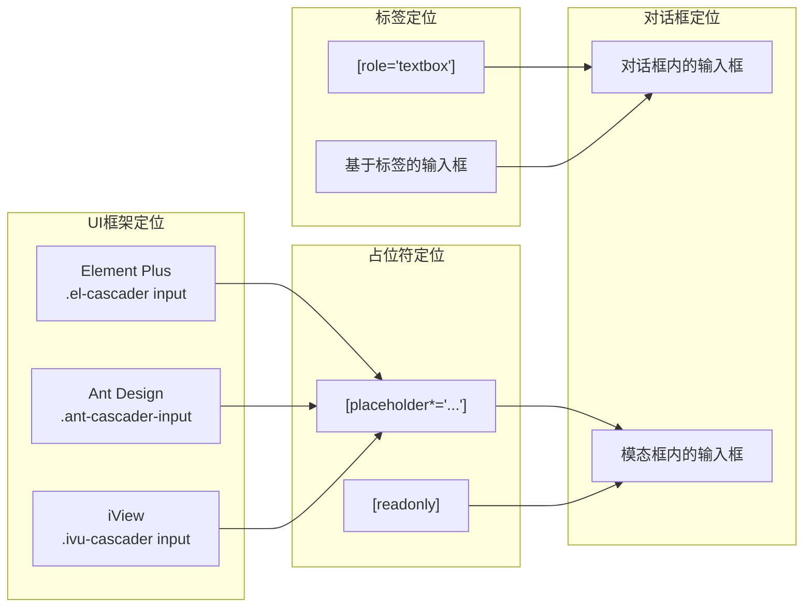

**图表来源**
- [src/stage2/task-runner.ts:207-228](file://src/stage2/task-runner.ts#L207-L228)
- [src/stage2/task-runner.ts:230-257](file://src/stage2/task-runner.ts#L230-L257)

**章节来源**
- [src/stage2/task-runner.ts:207-257](file://src/stage2/task-runner.ts#L207-L257)

### 错误恢复机制
系统实现了多层次的错误恢复机制，确保在各种异常情况下的稳定性：

#### 错误恢复策略
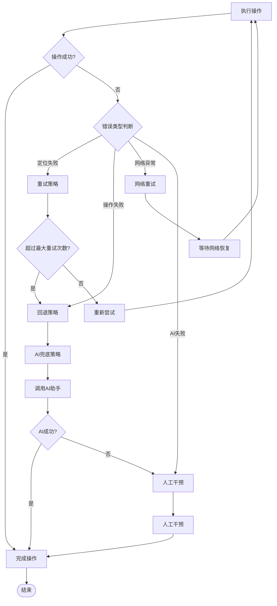

**图表来源**
- [src/stage2/task-runner.ts:971-974](file://src/stage2/task-runner.ts#L971-L974)
- [src/stage2/task-runner.ts:1018-1021](file://src/stage2/task-runner.ts#L1018-L1021)

**章节来源**
- [src/stage2/task-runner.ts:971-974](file://src/stage2/task-runner.ts#L971-L974)
- [src/stage2/task-runner.ts:1018-1021](file://src/stage2/task-runner.ts#L1018-L1021)

## 依赖关系分析
系统依赖关系清晰，各模块职责明确：

### 核心依赖关系
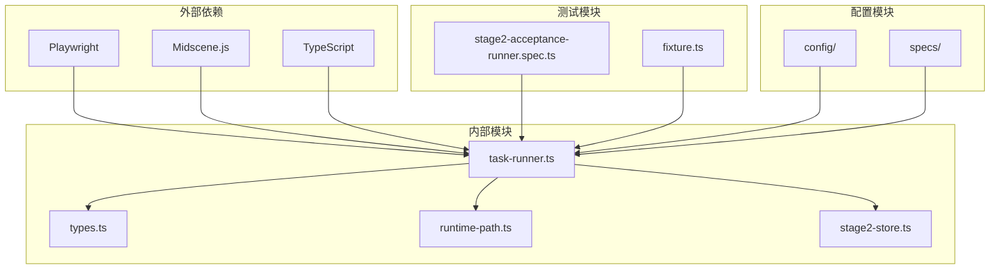

**图表来源**
- [package.json:15-24](file://package.json#L15-L24)
- [src/stage2/task-runner.ts:1-16](file://src/stage2/task-runner.ts#L1-L16)

### UI框架兼容性依赖
系统通过统一的选择器抽象层实现多 UI 框架兼容：

**章节来源**
- [src/stage2/task-runner.ts:1030-1058](file://src/stage2/task-runner.ts#L1030-L1058)

## 性能考虑
系统在设计时充分考虑了性能优化：

### 性能优化策略
1. **异步操作优化**：所有 UI 操作都采用异步模式，避免阻塞主线程
2. **重试机制**：智能重试策略，避免不必要的重复操作
3. **缓存机制**：对常用选择器和元素进行缓存
4. **并发处理**：支持多字段并行处理

### 性能监控指标
- 操作超时控制：默认 5000ms
- 重试间隔：300-500ms
- 最大重试次数：3次
- 轮询间隔：500ms

## 故障排除指南
提供常见问题的诊断和解决方法：

### 常见问题及解决方案

#### 级联选择器无法选择
**问题现象**：级联选择器点击后无法正确选择选项

**诊断步骤**：
1. 检查级联面板是否正确打开
2. 验证选项文本匹配是否准确
3. 确认 UI 框架选择器是否正确

**解决方案**：
- 调整选项文本匹配策略
- 更新 UI 框架选择器
- 增加等待时间

#### 字段定位失败
**问题现象**：无法找到指定的表单字段

**诊断步骤**：
1. 检查字段标签标准化是否正确
2. 验证占位符候选提取是否完整
3. 确认对话框定位是否准确

**解决方案**：
- 添加更多候选匹配规则
- 调整选择器优先级
- 使用 AI 辅助定位

#### 验证消息识别错误
**问题现象**：表单验证消息无法正确识别

**诊断步骤**：
1. 检查验证消息选择器是否覆盖所有 UI 框架
2. 验证消息文本标准化是否正确
3. 确认可见性检测是否准确

**解决方案**：
- 扩展验证消息选择器
- 调整文本匹配算法
- 增加消息类型支持

**章节来源**
- [src/stage2/task-runner.ts:338-407](file://src/stage2/task-runner.ts#L338-L407)
- [src/stage2/task-runner.ts:1018-1021](file://src/stage2/task-runner.ts#L1018-L1021)

## 结论
本表单字段处理系统通过模块化设计和多层兼容性策略，实现了对不同 UI 框架的全面支持。系统的核心优势包括：

1. **高度兼容性**：支持 Element Plus、Ant Design、iView 等主流 UI 框架
2. **智能定位**：通过多层候选匹配和可见性检测确保高成功率
3. **错误恢复**：多层次的错误恢复机制保证系统稳定性
4. **AI 辅助**：集成 Midscene.js 提供智能定位和断言能力
5. **性能优化**：异步操作和智能重试策略提升执行效率

该系统为自动化测试提供了强大的表单处理能力，能够有效应对复杂的 Web 应用场景。

## 附录

### 配置示例
任务配置文件示例展示了如何定义表单字段和 UI 框架兼容性：

**章节来源**
- [specs/tasks/acceptance-task.template.json:46-64](file://specs/tasks/acceptance-task.template.json#L46-L64)

### API 参考
系统提供的核心 API 函数：

1. **fillField**：通用字段填充函数
2. **openCascaderPanel**：级联面板打开函数  
3. **clickCascaderOption**：级联选项点击函数
4. **collectValidationMessages**：验证消息收集函数
5. **resolveFieldsByValidationMessages**：字段解析函数

### 最佳实践
1. **字段定义**：合理使用 `hints` 属性提供额外的定位信息
2. **UI 框架适配**：在 `uiProfile` 中定义特定 UI 框架的选择器
3. **错误处理**：为关键字段设置合理的重试机制
4. **性能优化**：合理设置超时时间和重试次数