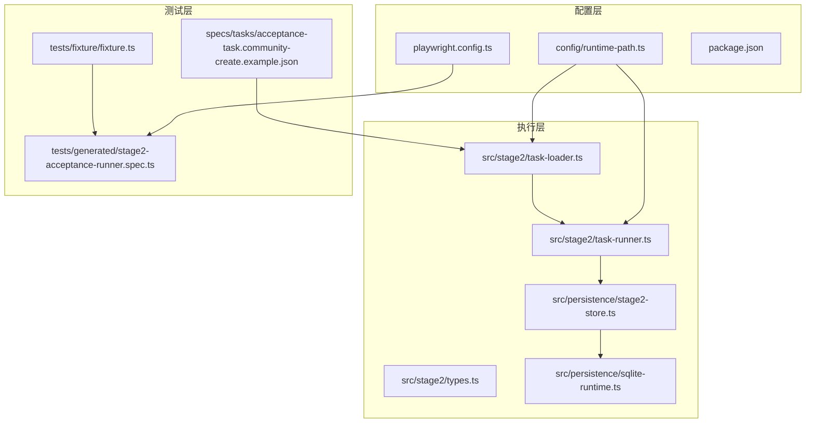
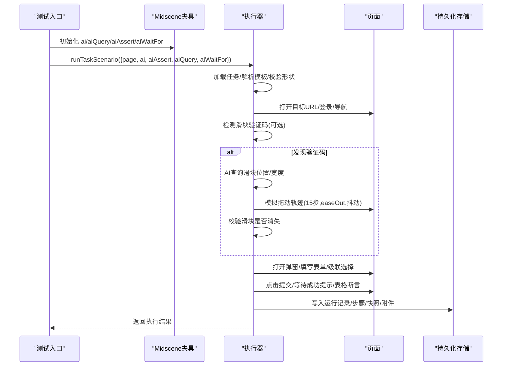
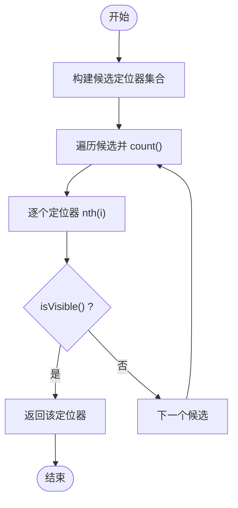
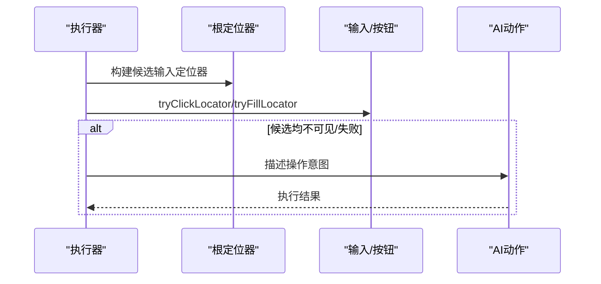
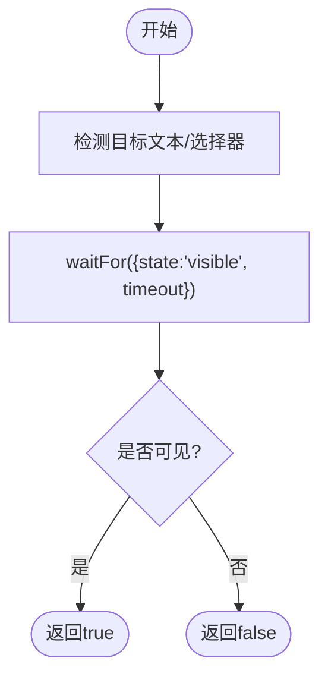
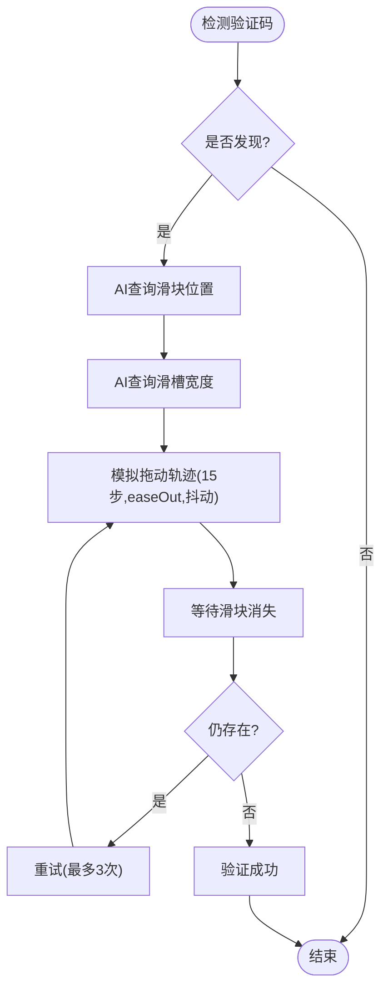
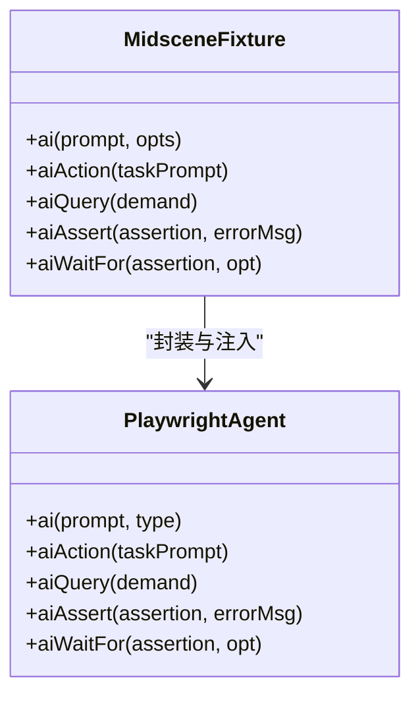
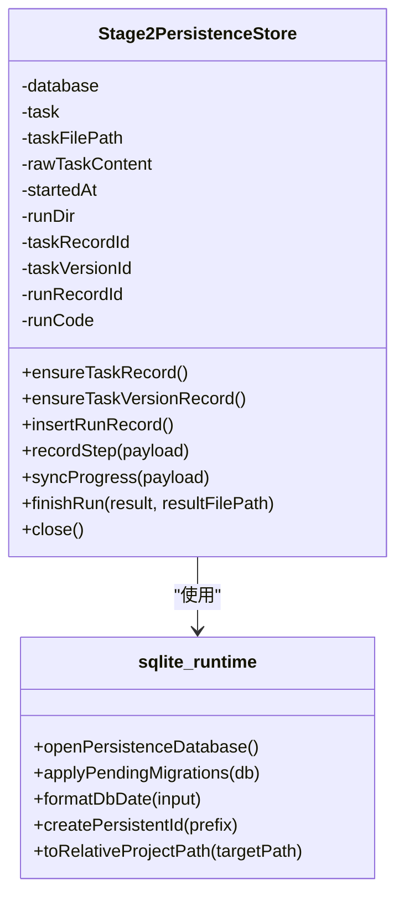
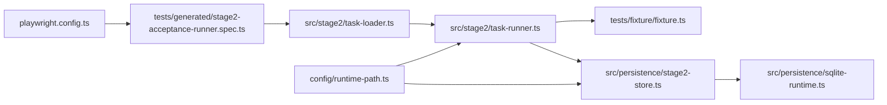

# 页面自动化控制

<cite>
**本文引用的文件**
- [README.md](file://README.md)
- [playwright.config.ts](file://playwright.config.ts)
- [src/stage2/task-runner.ts](file://src/stage2/task-runner.ts)
- [src/stage2/task-loader.ts](file://src/stage2/task-loader.ts)
- [src/stage2/types.ts](file://src/stage2/types.ts)
- [src/persistence/stage2-store.ts](file://src/persistence/stage2-store.ts)
- [src/persistence/sqlite-runtime.ts](file://src/persistence/sqlite-runtime.ts)
- [tests/generated/stage2-acceptance-runner.spec.ts](file://tests/generated/stage2-acceptance-runner.spec.ts)
- [tests/fixture/fixture.ts](file://tests/fixture/fixture.ts)
- [package.json](file://package.json)
- [specs/tasks/acceptance-task.community-create.example.json](file://specs/tasks/acceptance-task.community-create.example.json)
- [config/runtime-path.ts](file://config/runtime-path.ts)
- [specs/basic-operations.md](file://specs/basic-operations.md)
- [specs/login-e2e.md](file://specs/login-e2e.md)
</cite>

## 目录
1. [简介](#简介)
2. [项目结构](#项目结构)
3. [核心组件](#核心组件)
4. [架构总览](#架构总览)
5. [详细组件分析](#详细组件分析)
6. [依赖关系分析](#依赖关系分析)
7. [性能考量](#性能考量)
8. [故障排查指南](#故障排查指南)
9. [结论](#结论)
10. [附录](#附录)

## 简介
本项目基于 Playwright 与 Midscene.js 构建，提供页面自动化控制能力，重点覆盖页面元素定位、交互操作、状态检测与滑块验证码自动处理等核心功能。通过 JSON 任务驱动的第二段执行器，结合 AI 查询与断言、结构化断言、以及可配置的等待与重试机制，形成一套可扩展、可观测、可持久化的自动化测试体系。

## 项目结构
项目采用分层组织方式：
- 配置层：运行时目录、数据库与 Playwright 配置
- 执行层：任务加载、执行器与持久化存储
- 测试层：Playwright + Midscene 夹具与入口测试
- 规范与示例：任务 JSON 模板与测试用例说明

**图表来源**
- [config/runtime-path.ts:1-41](file://config/runtime-path.ts#L1-L41)
- [playwright.config.ts:1-95](file://playwright.config.ts#L1-L95)
- [src/stage2/task-loader.ts:1-91](file://src/stage2/task-loader.ts#L1-L91)
- [src/stage2/task-runner.ts:1-800](file://src/stage2/task-runner.ts#L1-L800)
- [src/stage2/types.ts:1-180](file://src/stage2/types.ts#L1-L180)
- [src/persistence/stage2-store.ts:1-655](file://src/persistence/stage2-store.ts#L1-L655)
- [src/persistence/sqlite-runtime.ts:1-116](file://src/persistence/sqlite-runtime.ts#L1-L116)
- [tests/fixture/fixture.ts:1-100](file://tests/fixture/fixture.ts#L1-L100)
- [tests/generated/stage2-acceptance-runner.spec.ts:1-39](file://tests/generated/stage2-acceptance-runner.spec.ts#L1-L39)
- [specs/tasks/acceptance-task.community-create.example.json:1-229](file://specs/tasks/acceptance-task.community-create.example.json#L1-L229)

**章节来源**
- [README.md:1-223](file://README.md#L1-L223)
- [config/runtime-path.ts:1-41](file://config/runtime-path.ts#L1-L41)
- [playwright.config.ts:1-95](file://playwright.config.ts#L1-L95)
- [src/stage2/task-runner.ts:1-800](file://src/stage2/task-runner.ts#L1-L800)
- [src/stage2/task-loader.ts:1-91](file://src/stage2/task-loader.ts#L1-L91)
- [src/stage2/types.ts:1-180](file://src/stage2/types.ts#L1-L180)
- [src/persistence/stage2-store.ts:1-655](file://src/persistence/stage2-store.ts#L1-L655)
- [src/persistence/sqlite-runtime.ts:1-116](file://src/persistence/sqlite-runtime.ts#L1-L116)
- [tests/fixture/fixture.ts:1-100](file://tests/fixture/fixture.ts#L1-L100)
- [tests/generated/stage2-acceptance-runner.spec.ts:1-39](file://tests/generated/stage2-acceptance-runner.spec.ts#L1-L39)
- [specs/tasks/acceptance-task.community-create.example.json:1-229](file://specs/tasks/acceptance-task.community-create.example.json#L1-L229)

## 核心组件
- 任务加载与解析：从 JSON 文件加载任务，模板变量替换，形状校验
- 执行器：封装元素定位、可见性判断、点击/填充、等待、滑块验证码处理、断言与清理
- Midscene 夹具：提供 AI 动作、查询、断言与等待能力
- 持久化：SQLite 写库，落盘任务、运行、步骤、快照与附件，支持迁移与审计日志
- 配置：运行时目录、Playwright 超时与重试、报告输出

**章节来源**
- [src/stage2/task-loader.ts:79-91](file://src/stage2/task-loader.ts#L79-L91)
- [src/stage2/task-runner.ts:165-205](file://src/stage2/task-runner.ts#L165-L205)
- [src/stage2/task-runner.ts:414-451](file://src/stage2/task-runner.ts#L414-L451)
- [src/stage2/task-runner.ts:483-501](file://src/stage2/task-runner.ts#L483-L501)
- [src/stage2/task-runner.ts:650-706](file://src/stage2/task-runner.ts#L650-L706)
- [tests/fixture/fixture.ts:23-99](file://tests/fixture/fixture.ts#L23-L99)
- [src/persistence/stage2-store.ts:74-123](file://src/persistence/stage2-store.ts#L74-L123)
- [src/persistence/sqlite-runtime.ts:86-114](file://src/persistence/sqlite-runtime.ts#L86-L114)
- [playwright.config.ts:22-48](file://playwright.config.ts#L22-L48)

## 架构总览
系统以“任务 JSON 驱动 + Midscene + Playwright”的方式执行验收流程，核心流程如下：

**图表来源**
- [tests/generated/stage2-acceptance-runner.spec.ts:12-37](file://tests/generated/stage2-acceptance-runner.spec.ts#L12-L37)
- [tests/fixture/fixture.ts:23-99](file://tests/fixture/fixture.ts#L23-L99)
- [src/stage2/task-runner.ts:650-706](file://src/stage2/task-runner.ts#L650-L706)
- [src/stage2/task-runner.ts:561-648](file://src/stage2/task-runner.ts#L561-L648)
- [src/persistence/stage2-store.ts:495-590](file://src/persistence/stage2-store.ts#L495-L590)

## 详细组件分析

### 组件A：元素定位与可见性判断
- 多候选定位：针对级联选择器、弹窗内输入等场景构建候选选择器集合，提升鲁棒性
- 可见性优先：优先选取可见元素，避免隐藏或不可交互元素
- 可见性检测：封装 isVisible 检测与 first().waitFor({state:'visible'}) 等待

**图表来源**
- [src/stage2/task-runner.ts:165-183](file://src/stage2/task-runner.ts#L165-L183)
- [src/stage2/task-runner.ts:469-481](file://src/stage2/task-runner.ts#L469-L481)

**章节来源**
- [src/stage2/task-runner.ts:207-228](file://src/stage2/task-runner.ts#L207-L228)
- [src/stage2/task-runner.ts:230-257](file://src/stage2/task-runner.ts#L230-L257)
- [src/stage2/task-runner.ts:469-481](file://src/stage2/task-runner.ts#L469-L481)

### 组件B：点击与填充操作封装
- 点击封装：tryClickLocator 遍历可见元素并点击，内置超时
- 填充封装：tryFillLocator 对输入/文本域进行填充，内置超时
- 级联选择：打开面板、按层级点击选项，回退到 AI 指令

**图表来源**
- [src/stage2/task-runner.ts:414-431](file://src/stage2/task-runner.ts#L414-L431)
- [src/stage2/task-runner.ts:433-451](file://src/stage2/task-runner.ts#L433-L451)
- [src/stage2/task-runner.ts:708-724](file://src/stage2/task-runner.ts#L708-L724)
- [src/stage2/task-runner.ts:726-788](file://src/stage2/task-runner.ts#L726-L788)

**章节来源**
- [src/stage2/task-runner.ts:414-451](file://src/stage2/task-runner.ts#L414-L451)
- [src/stage2/task-runner.ts:708-788](file://src/stage2/task-runner.ts#L708-L788)

### 组件C：等待机制与状态检测
- 文本可见等待：waitVisibleByText 使用 getByText(first) + waitFor(visible)
- 元素可见检测：isLocatorVisible 遍历定位器并 isVisible
- AI 等待：aiWaitFor 在 Playwright 常规等待不适用时使用

**图表来源**
- [src/stage2/task-runner.ts:453-467](file://src/stage2/task-runner.ts#L453-L467)
- [src/stage2/task-runner.ts:469-481](file://src/stage2/task-runner.ts#L469-L481)
- [tests/fixture/fixture.ts:85-99](file://tests/fixture/fixture.ts#L85-L99)

**章节来源**
- [src/stage2/task-runner.ts:453-467](file://src/stage2/task-runner.ts#L453-L467)
- [src/stage2/task-runner.ts:469-481](file://src/stage2/task-runner.ts#L469-L481)
- [tests/fixture/fixture.ts:85-99](file://tests/fixture/fixture.ts#L85-L99)

### 组件D：滑块验证码自动处理
- 检测：基于文本关键词与选择器组合检测验证码
- AI 查询：使用 aiQuery 获取滑块中心坐标与滑槽宽度
- 模拟拖动：15 步 easeOut 轨迹，随机抖动，逐步逼近目标
- 结果验证：等待滑块消失，最多重试 3 次

**图表来源**
- [src/stage2/task-runner.ts:483-501](file://src/stage2/task-runner.ts#L483-L501)
- [src/stage2/task-runner.ts:510-538](file://src/stage2/task-runner.ts#L510-L538)
- [src/stage2/task-runner.ts:540-559](file://src/stage2/task-runner.ts#L540-L559)
- [src/stage2/task-runner.ts:561-648](file://src/stage2/task-runner.ts#L561-L648)
- [src/stage2/task-runner.ts:650-706](file://src/stage2/task-runner.ts#L650-L706)

**章节来源**
- [src/stage2/task-runner.ts:483-501](file://src/stage2/task-runner.ts#L483-L501)
- [src/stage2/task-runner.ts:510-559](file://src/stage2/task-runner.ts#L510-L559)
- [src/stage2/task-runner.ts:561-648](file://src/stage2/task-runner.ts#L561-L648)
- [src/stage2/task-runner.ts:650-706](file://src/stage2/task-runner.ts#L650-L706)

### 组件E：Midscene AI 能力集成
- ai/aiQuery/aiAssert/aiWaitFor：通过夹具注入，统一缓存与报告
- 类型封装：对 ai 函数增加 type 参数，区分 action/query
- 报告与缓存：设置日志目录、测试组信息、缓存 ID

**图表来源**
- [tests/fixture/fixture.ts:23-99](file://tests/fixture/fixture.ts#L23-L99)

**章节来源**
- [tests/fixture/fixture.ts:23-99](file://tests/fixture/fixture.ts#L23-L99)

### 组件F：持久化与运行记录
- 写库服务：Stage2PersistenceStore 负责任务、版本、运行、步骤、快照、附件与审计日志
- 迁移与连接：sqlite-runtime 提供数据库连接、迁移应用与校验
- 进度与结果：支持阶段性快照与最终结果落库，包含截图附件

**图表来源**
- [src/persistence/stage2-store.ts:74-123](file://src/persistence/stage2-store.ts#L74-L123)
- [src/persistence/stage2-store.ts:495-630](file://src/persistence/stage2-store.ts#L495-L630)
- [src/persistence/sqlite-runtime.ts:73-114](file://src/persistence/sqlite-runtime.ts#L73-L114)

**章节来源**
- [src/persistence/stage2-store.ts:74-123](file://src/persistence/stage2-store.ts#L74-L123)
- [src/persistence/stage2-store.ts:495-630](file://src/persistence/stage2-store.ts#L495-L630)
- [src/persistence/sqlite-runtime.ts:73-114](file://src/persistence/sqlite-runtime.ts#L73-L114)

## 依赖关系分析
- 任务驱动：tests/generated/stage2-acceptance-runner.spec.ts 作为入口，调用 runTaskScenario
- 执行链路：task-loader.ts -> task-runner.ts -> Midscene 夹具 -> Playwright Page
- 存储链路：stage2-store.ts -> sqlite-runtime.ts -> SQLite 文件
- 配置链路：config/runtime-path.ts -> playwright.config.ts -> 运行时目录与报告

**图表来源**
- [tests/generated/stage2-acceptance-runner.spec.ts:12-37](file://tests/generated/stage2-acceptance-runner.spec.ts#L12-L37)
- [src/stage2/task-loader.ts:79-91](file://src/stage2/task-loader.ts#L79-L91)
- [src/stage2/task-runner.ts:1-800](file://src/stage2/task-runner.ts#L1-L800)
- [tests/fixture/fixture.ts:23-99](file://tests/fixture/fixture.ts#L23-L99)
- [src/persistence/stage2-store.ts:1-655](file://src/persistence/stage2-store.ts#L1-L655)
- [src/persistence/sqlite-runtime.ts:1-116](file://src/persistence/sqlite-runtime.ts#L1-L116)
- [playwright.config.ts:1-95](file://playwright.config.ts#L1-L95)
- [config/runtime-path.ts:1-41](file://config/runtime-path.ts#L1-L41)

**章节来源**
- [tests/generated/stage2-acceptance-runner.spec.ts:12-37](file://tests/generated/stage2-acceptance-runner.spec.ts#L12-L37)
- [src/stage2/task-runner.ts:1-800](file://src/stage2/task-runner.ts#L1-L800)
- [src/persistence/stage2-store.ts:1-655](file://src/persistence/stage2-store.ts#L1-L655)
- [playwright.config.ts:1-95](file://playwright.config.ts#L1-L95)
- [config/runtime-path.ts:1-41](file://config/runtime-path.ts#L1-L41)

## 性能考量
- 超时与重试：Playwright 层面的全局超时与重试策略，配合任务级 step/page 超时
- 等待策略：优先使用 Playwright 内置等待（如 waitFor(visible)），必要时使用 AI 等待
- 滑块拖动：15 步轨迹与随机抖动平衡稳定性与真实性
- 数据库写入：批量落库与事务化迁移，避免频繁 IO

**章节来源**
- [playwright.config.ts:22-48](file://playwright.config.ts#L22-L48)
- [src/stage2/task-runner.ts:122-129](file://src/stage2/task-runner.ts#L122-L129)
- [src/stage2/task-runner.ts:561-648](file://src/stage2/task-runner.ts#L561-L648)
- [src/persistence/sqlite-runtime.ts:86-114](file://src/persistence/sqlite-runtime.ts#L86-L114)

## 故障排查指南
- 滑块验证码
  - 现象：页面出现滑块/安全验证
  - 处理：根据 STAGE2_CAPTCHA_MODE 切换自动/人工/失败/忽略
  - 超时：STAGE2_CAPTCHA_WAIT_TIMEOUT_MS 控制人工等待时长
  - 重试：自动模式最多重试 3 次
- 选择器失效
  - 现象：点击/填充失败
  - 排查：使用候选定位器策略、可见性检测、回退到 AI 指令
- 断言失败
  - 现象：toast/table/assertion 不符合预期
  - 排查：检查断言超时与重试配置、软断言设置、UIProfile 选择器优先级
- 数据持久化
  - 现象：写库失败或迁移异常
  - 排查：确认 sqlite 驱动、迁移文件、数据库路径与权限

**章节来源**
- [README.md:56-74](file://README.md#L56-L74)
- [src/stage2/task-runner.ts:35-87](file://src/stage2/task-runner.ts#L35-L87)
- [src/stage2/task-runner.ts:650-706](file://src/stage2/task-runner.ts#L650-L706)
- [src/stage2/task-runner.ts:414-451](file://src/stage2/task-runner.ts#L414-L451)
- [src/stage2/task-runner.ts:708-788](file://src/stage2/task-runner.ts#L708-L788)
- [src/persistence/stage2-store.ts:125-133](file://src/persistence/stage2-store.ts#L125-L133)
- [src/persistence/sqlite-runtime.ts:86-114](file://src/persistence/sqlite-runtime.ts#L86-L114)

## 结论
本项目通过“任务 JSON + Midscene + Playwright”的组合，提供了高可用的页面自动化控制能力。其核心优势在于：
- 可靠的元素定位与可见性检测
- 可配置的等待与重试策略
- 滑块验证码自动处理与回退机制
- 结构化断言与 AI 辅助断言
- 完整的运行与结果持久化

建议在实际使用中：
- 合理配置超时与重试，避免过度等待
- 优先使用 Playwright 硬检测，AI 作为兜底
- 明确 UIProfile 与断言策略，减少幻觉风险
- 关注运行目录与数据库路径，确保产物可追踪

## 附录

### 任务 JSON 示例与字段说明
- 示例任务：社区小区创建验收任务，包含目标、账号、导航、UI Profile、表单、搜索、断言、清理与运行时配置
- 字段要点：uiProfile.tableRowSelectors、uiProfile.toastSelectors、uiProfile.dialogSelectors；断言 matchMode、cleanup.rowMatchMode、cleanup.verifyAfterCleanup

**章节来源**
- [specs/tasks/acceptance-task.community-create.example.json:1-229](file://specs/tasks/acceptance-task.community-create.example.json#L1-L229)
- [src/stage2/types.ts:58-65](file://src/stage2/types.ts#L58-L65)
- [src/stage2/types.ts:78-85](file://src/stage2/types.ts#L78-L85)
- [src/stage2/types.ts:119-122](file://src/stage2/types.ts#L119-L122)

### 运行与产物
- 运行命令：npm scripts 提供 headed/headless 执行入口
- 产物目录：运行结果、HTML 报告、Midscene 报告、SQLite 数据库、验收结果与截图

**章节来源**
- [package.json:6-11](file://package.json#L6-L11)
- [README.md:76-96](file://README.md#L76-L96)
- [config/runtime-path.ts:13-36](file://config/runtime-path.ts#L13-L36)

### 基础操作与登录测试参考
- TodoMVC 基础操作测试计划
- /login 页面端到端测试计划（成功登录与密码错误）

**章节来源**
- [specs/basic-operations.md:1-34](file://specs/basic-operations.md#L1-L34)
- [specs/login-e2e.md:1-152](file://specs/login-e2e.md#L1-L152)