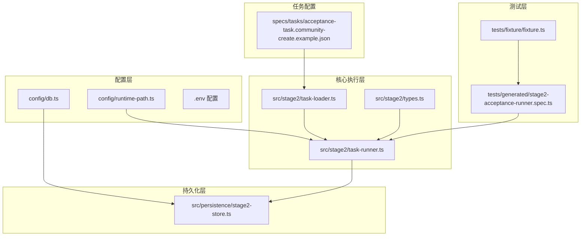
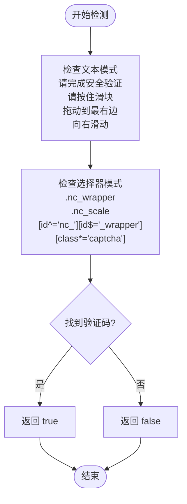
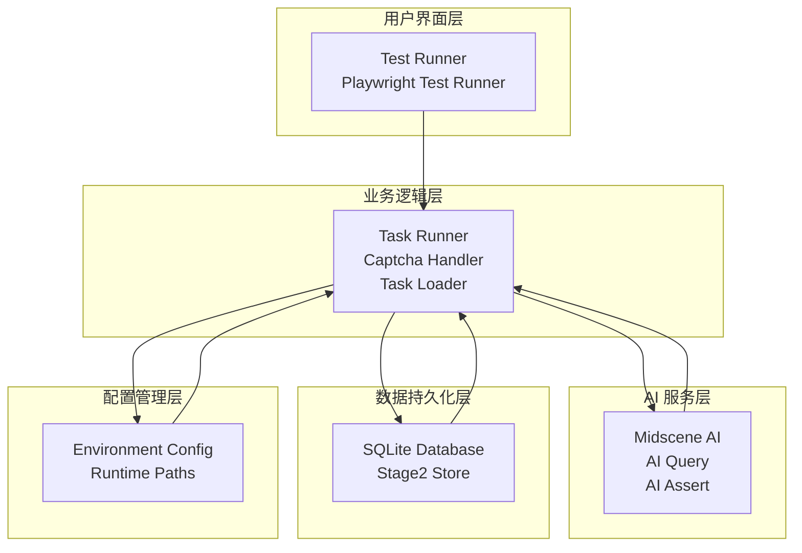
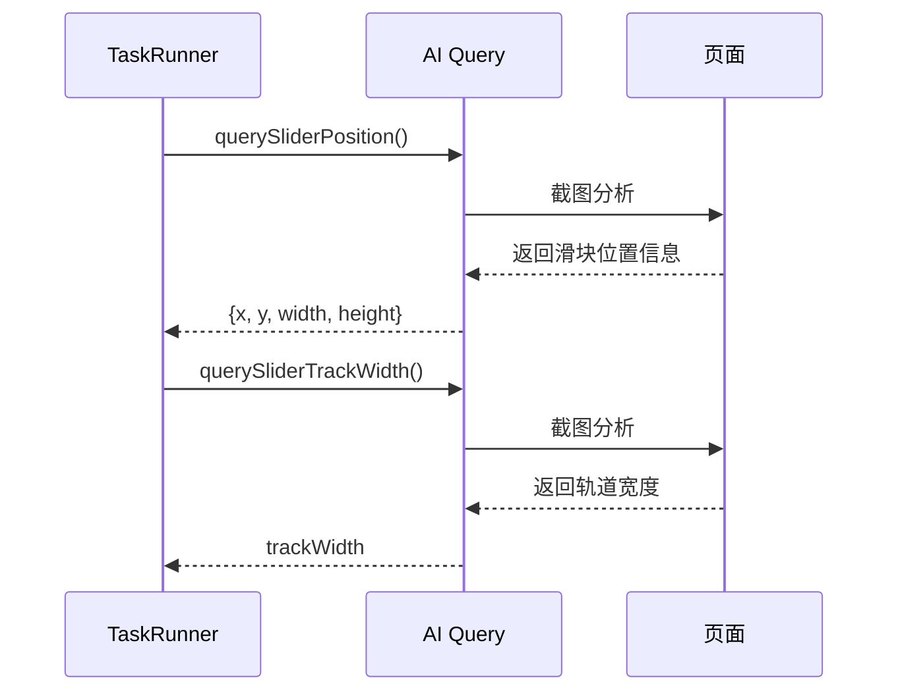
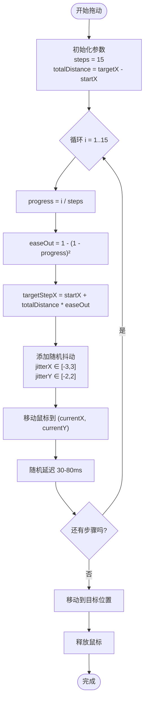
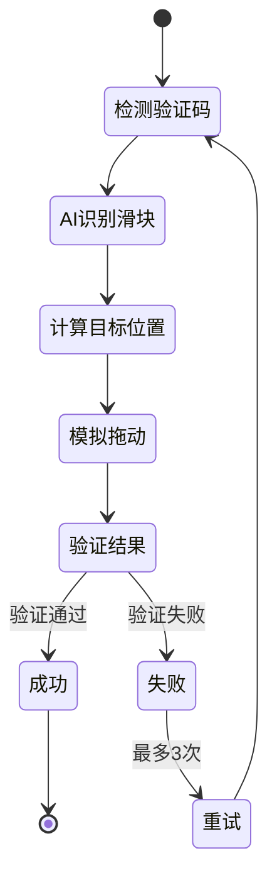
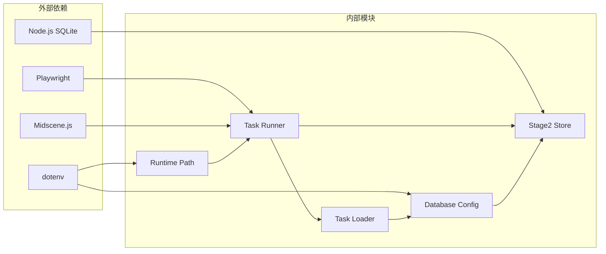

# 验证码处理系统

<cite>
**本文档引用的文件**
- [README.md](file://README.md)
- [package.json](file://package.json)
- [src/stage2/task-runner.ts](file://src/stage2/task-runner.ts)
- [src/stage2/task-loader.ts](file://src/stage2/task-loader.ts)
- [src/stage2/types.ts](file://src/stage2/types.ts)
- [src/persistence/stage2-store.ts](file://src/persistence/stage2-store.ts)
- [config/runtime-path.ts](file://config/runtime-path.ts)
- [config/db.ts](file://config/db.ts)
- [tests/generated/stage2-acceptance-runner.spec.ts](file://tests/generated/stage2-acceptance-runner.spec.ts)
- [tests/fixture/fixture.ts](file://tests/fixture/fixture.ts)
- [specs/tasks/acceptance-task.community-create.example.json](file://specs/tasks/acceptance-task.community-create.example.json)
</cite>

## 目录
1. [简介](#简介)
2. [项目结构](#项目结构)
3. [核心组件](#核心组件)
4. [架构概览](#架构概览)
5. [详细组件分析](#详细组件分析)
6. [依赖关系分析](#依赖关系分析)
7. [性能考虑](#性能考虑)
8. [故障排除指南](#故障排除指南)
9. [结论](#结论)
10. [附录](#附录)

## 简介

验证码处理系统是一个基于 Playwright 和 Midscene.js 构建的 AI 自动化测试项目，专门用于处理滑块验证码的自动识别和拖动机制。该系统提供了三种处理模式（自动模式、人工模式、失败模式、忽略模式），能够智能检测验证码挑战并执行相应的处理策略。

系统的核心功能包括：
- AI 验证码检测算法
- AI 查询接口调用
- 拖动轨迹模拟
- 多种处理模式配置
- 错误处理和重试机制
- 性能优化技巧

## 项目结构

该项目采用模块化的组织结构，主要分为以下几个核心部分：



**图表来源**
- [config/runtime-path.ts:1-41](file://config/runtime-path.ts#L1-L41)
- [src/stage2/task-runner.ts:1-800](file://src/stage2/task-runner.ts#L1-L800)
- [src/persistence/stage2-store.ts:1-655](file://src/persistence/stage2-store.ts#L1-L655)

**章节来源**
- [README.md:1-223](file://README.md#L1-L223)
- [package.json:1-26](file://package.json#L1-L26)

## 核心组件

### 验证码处理引擎

验证码处理系统的核心是 `handleCaptchaChallengeIfNeeded` 函数，它负责检测和处理验证码挑战。该函数支持四种处理模式：

1. **自动模式 (auto)**: 使用 AI 识别验证码并自动拖动
2. **人工模式 (manual)**: 检测到验证码后等待人工处理
3. **失败模式 (fail)**: 检测到验证码时立即失败
4. **忽略模式 (ignore)**: 忽略验证码检测

### AI 验证码检测

系统使用多种策略来检测验证码挑战：



**图表来源**
- [src/stage2/task-runner.ts:483-501](file://src/stage2/task-runner.ts#L483-L501)

### 滑块验证码自动处理

自动处理流程包括 AI 识别、位置计算和轨迹模拟三个主要步骤：

**章节来源**
- [src/stage2/task-runner.ts:561-648](file://src/stage2/task-runner.ts#L561-L648)

## 架构概览

系统采用分层架构设计，各层职责清晰分离：



**图表来源**
- [src/stage2/task-runner.ts:1-800](file://src/stage2/task-runner.ts#L1-L800)
- [src/persistence/stage2-store.ts:1-655](file://src/persistence/stage2-store.ts#L1-L655)

## 详细组件分析

### 验证码检测算法

验证码检测算法采用了双重检测机制：

#### 文本模式检测
系统检查页面中是否包含特定的验证码相关文本：
- "请完成安全验证"
- "请按住滑块"
- "拖动到最右边"
- "向右滑动"

#### 选择器模式检测
系统使用 CSS 选择器来定位验证码元素：
- `.nc_wrapper` - 滑块包装器
- `.nc_scale` - 滑块刻度
- `[id^="nc_"][id$="_wrapper"]` - 以 nc_ 开头和 _wrapper 结尾的元素
- `[class*="captcha"]` - 包含 captcha 的类名

**章节来源**
- [src/stage2/task-runner.ts:42-53](file://src/stage2/task-runner.ts#L42-L53)
- [src/stage2/task-runner.ts:483-501](file://src/stage2/task-runner.ts#L483-L501)

### AI 查询接口调用

系统使用 Midscene.js 的 AI 查询功能来获取验证码的结构化信息：

#### 滑块位置查询


**图表来源**
- [src/stage2/task-runner.ts:510-559](file://src/stage2/task-runner.ts#L510-L559)

#### AI 查询参数
- **检测范围**: 整个页面截图
- **输出格式**: 结构化 JSON 对象
- **错误处理**: 捕获并忽略 AI 查询异常
- **超时控制**: 自动重试机制

**章节来源**
- [src/stage2/task-runner.ts:514-551](file://src/stage2/task-runner.ts#L514-L551)

### 拖动轨迹模拟

系统实现了高度逼真的拖动轨迹模拟，模拟真实用户的行为特征：

#### 缓动函数应用
使用 `easeOut` 缓动函数实现先快后慢的拖动效果：
```
easeOut = 1 - (1 - progress)²
```

#### 轨迹计算


**图表来源**
- [src/stage2/task-runner.ts:597-613](file://src/stage2/task-runner.ts#L597-L613)

#### 关键参数设置
- **步数**: 15 步
- **抖动范围**: X轴 ±3 像素，Y轴 ±2 像素
- **延迟范围**: 30-80 毫秒
- **缓动函数**: easeOut

**章节来源**
- [src/stage2/task-runner.ts:592-613](file://src/stage2/task-runner.ts#L592-L613)

### 处理模式详解

#### 自动模式 (Auto Mode)
自动模式是最复杂的处理方式，包含完整的 AI 识别和拖动流程：



**图表来源**
- [src/stage2/task-runner.ts:668-686](file://src/stage2/task-runner.ts#L668-L686)

#### 人工模式 (Manual Mode)
人工模式提供最长的等待时间，允许用户手动完成验证码：
- **默认等待时间**: 120 秒
- **检查间隔**: 1 秒
- **超时处理**: 抛出明确错误

#### 失败模式 (Fail Mode)
失败模式立即终止执行，防止系统继续运行：
- **行为**: 抛出错误并停止
- **用途**: 调试和测试环境

#### 忽略模式 (Ignore Mode)
忽略模式跳过所有验证码检测：
- **行为**: 不进行任何处理
- **风险**: 可能导致后续步骤失败

**章节来源**
- [src/stage2/task-runner.ts:61-75](file://src/stage2/task-runner.ts#L61-L75)
- [src/stage2/task-runner.ts:688-706](file://src/stage2/task-runner.ts#L688-L706)

## 依赖关系分析

系统的主要依赖关系如下：



**图表来源**
- [package.json:15-24](file://package.json#L15-L24)
- [src/stage2/task-runner.ts:1-8](file://src/stage2/task-runner.ts#L1-L8)

### 核心依赖说明

1. **Playwright**: 提供浏览器自动化和鼠标操作功能
2. **Midscene.js**: 提供 AI 图像识别和结构化查询能力
3. **Node.js SQLite**: 提供本地数据库存储功能
4. **dotenv**: 提供环境变量配置管理

**章节来源**
- [package.json:15-24](file://package.json#L15-L24)

## 性能考虑

### 优化策略

#### 1. AI 查询优化
- **错误处理**: 捕获并忽略 AI 查询异常，避免影响整体执行
- **重试机制**: 自动重试失败的 AI 查询
- **超时控制**: 合理设置查询超时时间

#### 2. 拖动性能优化
- **步数控制**: 15 步拖动平衡了精度和性能
- **延迟优化**: 30-80ms 随机延迟模拟真实用户行为
- **抖动控制**: 限制抖动范围避免过度偏离目标

#### 3. 内存管理
- **资源清理**: 确保鼠标状态正确释放
- **异常处理**: 捕获并处理所有可能的异常情况

#### 4. 配置优化
- **环境变量**: 通过环境变量控制运行参数
- **路径管理**: 统一管理运行时文件路径

**章节来源**
- [src/stage2/task-runner.ts:534-537](file://src/stage2/task-runner.ts#L534-L537)
- [src/stage2/task-runner.ts:638-647](file://src/stage2/task-runner.ts#L638-L647)

## 故障排除指南

### 常见问题及解决方案

#### 1. 验证码检测失败
**症状**: 系统无法检测到验证码
**可能原因**:
- 验证码样式变化
- 文本模式不匹配
- 选择器失效

**解决方案**:
- 更新 `CAPTCHA_TEXT_PATTERNS`
- 更新 `CAPTCHA_SELECTOR_PATTERNS`
- 调整 AI 查询提示词

#### 2. 滑块拖动失败
**症状**: 滑块无法正常拖动或验证失败
**可能原因**:
- 滑块位置计算错误
- 轨迹模拟不准确
- 缓动函数参数不合适

**解决方案**:
- 检查 AI 识别结果
- 调整拖动步数和延迟
- 优化缓动函数参数

#### 3. 性能问题
**症状**: 执行速度过慢
**可能原因**:
- 过多的等待时间
- 频繁的 AI 查询
- 大量的截图操作

**解决方案**:
- 优化等待时间配置
- 减少不必要的 AI 查询
- 实现智能缓存机制

#### 4. 环境配置问题
**症状**: 系统启动失败或配置错误
**可能原因**:
- 环境变量缺失
- 文件路径错误
- 权限问题

**解决方案**:
- 检查 `.env` 文件配置
- 验证文件路径存在性
- 确认文件权限设置

**章节来源**
- [src/stage2/task-runner.ts:683-685](file://src/stage2/task-runner.ts#L683-L685)

### 调试技巧

#### 1. 日志分析
系统提供了详细的日志输出，包括：
- 验证码检测状态
- AI 查询结果
- 拖动过程记录
- 错误信息

#### 2. 截图分析
- **位置截图**: 验证码位置识别
- **轨迹截图**: 拖动轨迹可视化
- **结果截图**: 验证结果确认

#### 3. 性能监控
- **执行时间统计**
- **内存使用监控**
- **网络请求分析**

## 结论

验证码处理系统是一个功能完整、架构清晰的自动化测试解决方案。系统通过 AI 技术实现了验证码的智能识别和处理，提供了灵活的配置选项和强大的错误处理机制。

### 主要优势

1. **智能化处理**: 使用 AI 技术实现验证码的自动识别
2. **多模式支持**: 提供四种不同的处理模式适应不同需求
3. **高可靠性**: 完善的错误处理和重试机制
4. **可扩展性**: 模块化设计便于功能扩展和维护
5. **性能优化**: 多层次的性能优化策略

### 应用场景

- **自动化测试**: CI/CD 流程中的验证码处理
- **数据采集**: 网站数据抓取过程中的验证码绕过
- **系统集成**: 第三方系统的验证码处理集成
- **研究应用**: AI 图像识别和自动化技术研究

## 附录

### 配置参数说明

| 参数名 | 默认值 | 描述 | 取值范围 |
|--------|--------|------|----------|
| STAGE2_CAPTCHA_MODE | auto | 验证码处理模式 | auto/manual/fail/ignore |
| STAGE2_CAPTCHA_WAIT_TIMEOUT_MS | 120000 | 人工模式等待时间(ms) | >0 |
| RUNTIME_DIR_PREFIX | t_runtime/ | 运行时目录前缀 | 任意字符串 |
| PLAYWRIGHT_OUTPUT_DIR | t_runtime/test-results | Playwright输出目录 | 有效路径 |
| MIDSCENE_RUN_DIR | t_runtime/midscene_run | Midscene运行目录 | 有效路径 |

### 代码示例路径

#### 验证码检测流程
- [detectCaptchaChallenge:483-501](file://src/stage2/task-runner.ts#L483-L501)

#### AI 查询实现
- [querySliderPosition:510-538](file://src/stage2/task-runner.ts#L510-L538)
- [querySliderTrackWidth:540-559](file://src/stage2/task-runner.ts#L540-L559)

#### 拖动轨迹模拟
- [autoSolveSliderCaptcha:561-648](file://src/stage2/task-runner.ts#L561-L648)

#### 处理模式配置
- [resolveCaptchaMode:61-75](file://src/stage2/task-runner.ts#L61-L75)
- [handleCaptchaChallengeIfNeeded:650-706](file://src/stage2/task-runner.ts#L650-L706)

### 相关文件

#### 任务配置示例
- [acceptance-task.community-create.example.json:1-229](file://specs/tasks/acceptance-task.community-create.example.json#L1-L229)

#### 测试入口
- [stage2-acceptance-runner.spec.ts:1-39](file://tests/generated/stage2-acceptance-runner.spec.ts#L1-L39)

#### AI 夹具
- [fixture.ts:1-100](file://tests/fixture/fixture.ts#L1-L100)