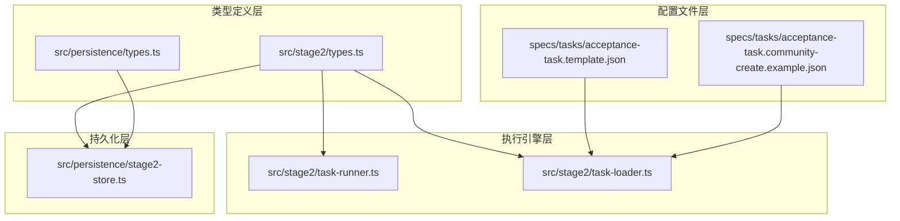
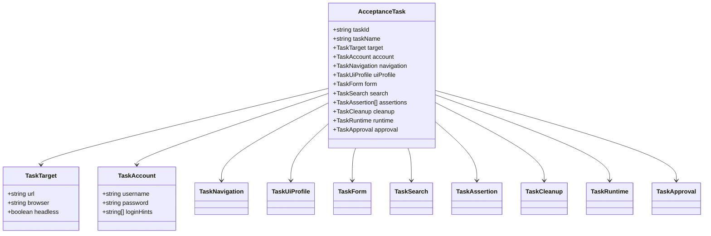
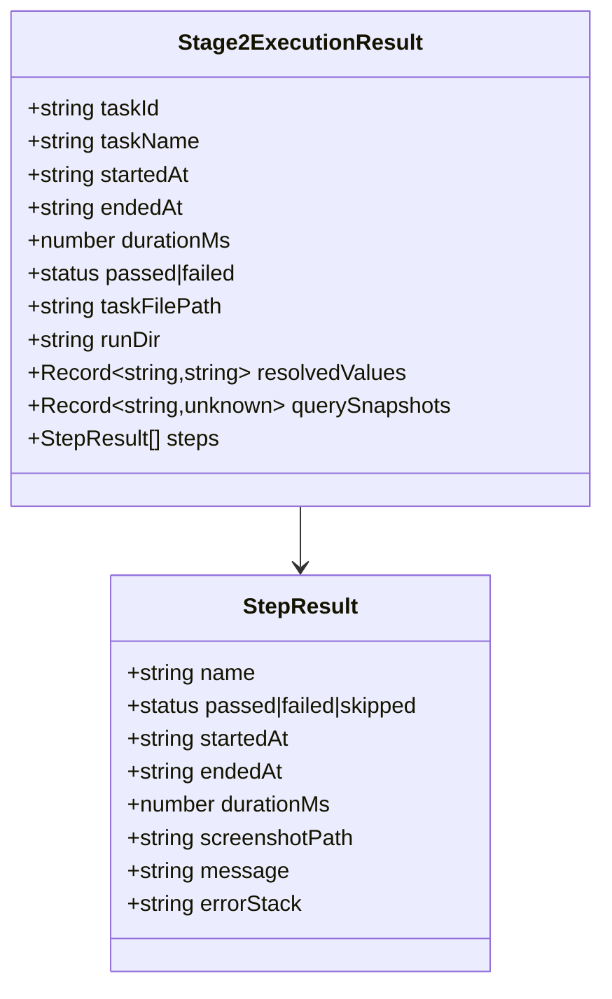
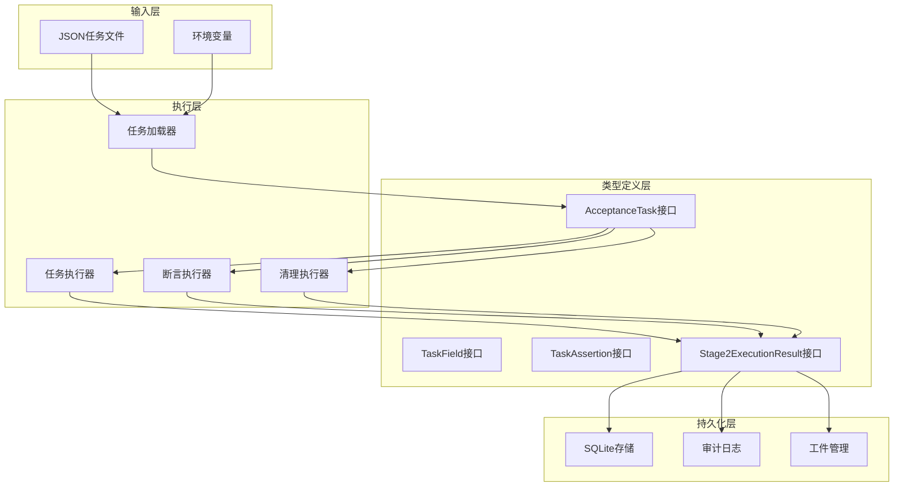
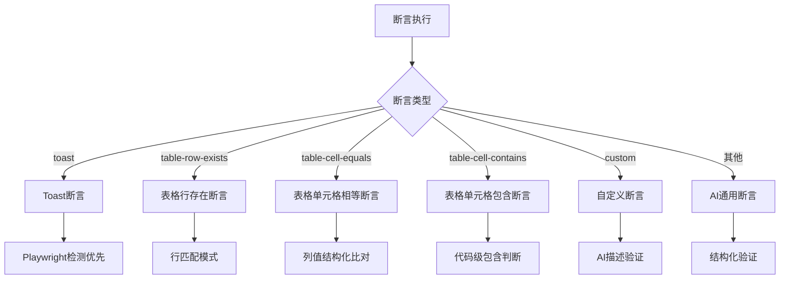
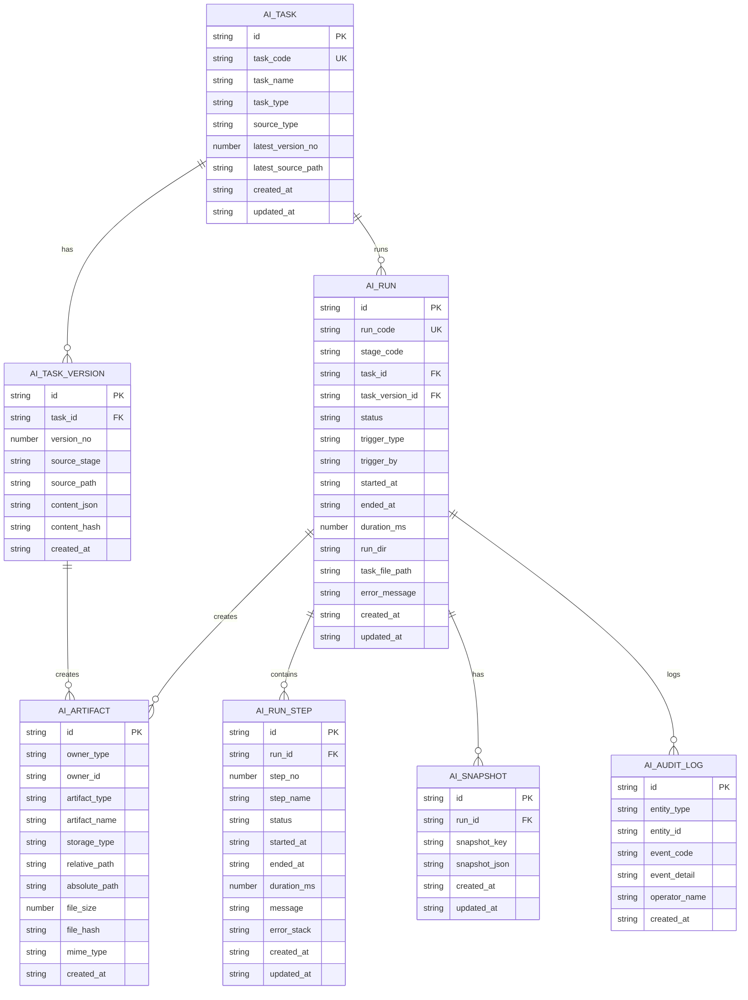
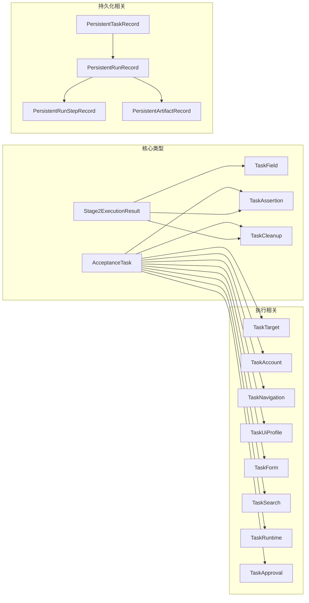

# 类型定义系统

<cite>
**本文档引用的文件**
- [src/stage2/types.ts](file://src/stage2/types.ts)
- [src/persistence/types.ts](file://src/persistence/types.ts)
- [src/stage2/task-runner.ts](file://src/stage2/task-runner.ts)
- [src/stage2/task-loader.ts](file://src/stage2/task-loader.ts)
- [src/persistence/stage2-store.ts](file://src/persistence/stage2-store.ts)
- [specs/tasks/acceptance-task.template.json](file://specs/tasks/acceptance-task.template.json)
- [specs/tasks/acceptance-task.community-create.example.json](file://specs/tasks/acceptance-task.community-create.example.json)
- [.tasks/stage2跨平台通用断言与清理优化实现_2026-03-12.md](file://.tasks/stage2跨平台通用断言与清理优化实现_2026-03-12.md)
- [.plans/第二段数据持久化改造方案_2026-03-12.md](file://.plans/第二段数据持久化改造方案_2026-03-12.md)
</cite>

## 目录
1. [简介](#简介)
2. [项目结构](#项目结构)
3. [核心组件](#核心组件)
4. [架构概览](#架构概览)
5. [详细组件分析](#详细组件分析)
6. [依赖分析](#依赖分析)
7. [性能考虑](#性能考虑)
8. [故障排除指南](#故障排除指南)
9. [结论](#结论)
10. [附录](#附录)

## 简介

本文档详细阐述了 HI-TEST 项目中的类型定义系统，重点分析了核心接口 AcceptanceTask、Stage2ExecutionResult、TaskField、TaskAssertion 等关键类型。该系统采用 TypeScript 接口和类型别名构建，实现了强类型约束和运行时验证，确保验收测试任务的结构化定义和执行过程的可靠性。

系统设计遵循以下原则：
- **类型安全**：通过 TypeScript 的类型系统确保编译时类型检查
- **向后兼容**：在扩展新功能时保持现有任务定义的兼容性
- **跨平台适配**：支持不同前端框架的选择器配置
- **可扩展性**：提供清晰的扩展点和插件机制

## 项目结构

项目采用模块化的文件组织方式，类型定义主要分布在以下位置：

**图表来源**
- [src/stage2/types.ts:1-180](file://src/stage2/types.ts#L1-L180)
- [src/persistence/types.ts:1-125](file://src/persistence/types.ts#L1-L125)

**章节来源**
- [src/stage2/types.ts:1-180](file://src/stage2/types.ts#L1-L180)
- [src/persistence/types.ts:1-125](file://src/persistence/types.ts#L1-L125)

## 核心组件

### AcceptanceTask - 验收任务核心类型

AcceptanceTask 是整个系统的核心接口，定义了完整的验收测试任务结构：

**图表来源**
- [src/stage2/types.ts:141-154](file://src/stage2/types.ts#L141-L154)
- [src/stage2/types.ts:5-15](file://src/stage2/types.ts#L5-L15)

### Stage2ExecutionResult - 执行结果类型

Stage2ExecutionResult 描述了整个执行过程的最终结果：

**图表来源**
- [src/stage2/types.ts:167-179](file://src/stage2/types.ts#L167-L179)
- [src/stage2/types.ts:156-165](file://src/stage2/types.ts#L156-L165)

**章节来源**
- [src/stage2/types.ts:141-179](file://src/stage2/types.ts#L141-L179)

## 架构概览

系统采用分层架构设计，各层职责清晰分离：

**图表来源**
- [src/stage2/task-loader.ts:79-89](file://src/stage2/task-loader.ts#L79-L89)
- [src/stage2/task-runner.ts:2637-2656](file://src/stage2/task-runner.ts#L2637-L2656)

## 详细组件分析

### TaskField - 表单字段类型

TaskField 定义了表单字段的结构，支持多种组件类型：

| 属性名 | 类型 | 必填 | 描述 |
|--------|------|------|------|
| label | string | 是 | 字段标签，用于标识字段 |
| componentType | 'input' \| 'textarea' \| 'cascader' \| string | 是 | 组件类型 |
| value | string \| string[] | 是 | 字段值，支持单值和多值 |
| required | boolean | 否 | 是否必填 |
| unique | boolean | 否 | 是否唯一标识 |
| hints | string[] | 否 | 辅助描述信息 |

**使用场景**：
- 表单填写：支持文本输入、多行文本、级联选择等
- 数据验证：通过 required 和 unique 属性进行数据完整性检查
- UI 适配：通过 hints 提供页面元素识别辅助信息

**约束条件**：
- componentType 必须是预定义的枚举值之一
- value 的类型必须与 componentType 匹配
- unique 字段通常用于数据清理和断言匹配

### TaskAssertion - 断言类型

TaskAssertion 提供了灵活的断言机制，支持多种断言类型：

**图表来源**
- [src/stage2/task-runner.ts:1562-1917](file://src/stage2/task-runner.ts#L1562-L1917)

**断言类型详解**：

1. **Toast 断言**：验证页面提示信息
2. **表格行存在断言**：检查特定数据是否存在于表格中
3. **表格单元格断言**：精确或模糊匹配单元格内容
4. **自定义断言**：基于描述的 AI 验证
5. **通用断言**：未知类型的 AI 结构化验证

**配置参数**：
- `matchMode`: 'exact' \| 'contains' - 匹配模式
- `timeoutMs`: 断言超时时间（默认 15000ms）
- `retryCount`: 重试次数（默认 2次）
- `soft`: 软断言标志，失败不中断流程
- `expectedColumnFromFields`: 列名到字段名映射

### TaskCleanup - 数据清理类型

TaskCleanup 提供了安全的数据清理机制：

| 属性名 | 类型 | 默认值 | 描述 |
|--------|------|--------|------|
| enabled | boolean | true | 是否启用清理功能 |
| strategy | 'delete-created' \| 'delete-all-matched' \| 'custom' \| 'none' | 'delete-created' | 清理策略 |
| matchField | string | - | 用于定位数据的字段名 |
| action | TaskCleanupAction | - | 清理操作配置 |
| searchBeforeCleanup | boolean | false | 清理前是否搜索 |
| rowMatchMode | 'exact' \| 'contains' | 'exact' | 行匹配模式 |
| verifyAfterCleanup | boolean | true | 删除后验证 |
| failOnError | boolean | false | 清理失败是否中断 |

**清理策略**：
- `delete-created`: 删除本次新增数据
- `delete-all-matched`: 删除所有匹配数据
- `custom`: 自定义清理逻辑
- `none`: 不进行清理

**章节来源**
- [src/stage2/types.ts:109-126](file://src/stage2/types.ts#L109-L126)
- [src/stage2/types.ts:90-107](file://src/stage2/types.ts#L90-L107)

### 持久化类型系统

系统使用统一的持久化类型定义，支持阶段间共享：

**图表来源**
- [src/persistence/types.ts:34-123](file://src/persistence/types.ts#L34-L123)

**章节来源**
- [src/persistence/types.ts:1-125](file://src/persistence/types.ts#L1-L125)

## 依赖分析

系统类型之间的依赖关系体现了清晰的层次结构：

**图表来源**
- [src/stage2/types.ts:141-179](file://src/stage2/types.ts#L141-L179)
- [src/persistence/types.ts:34-123](file://src/persistence/types.ts#L34-L123)

**章节来源**
- [src/stage2/types.ts:1-180](file://src/stage2/types.ts#L1-L180)
- [src/persistence/types.ts:1-125](file://src/persistence/types.ts#L1-L125)

## 性能考虑

### 类型检查优化

1. **编译时优化**：TypeScript 在编译时进行类型检查，运行时无额外开销
2. **接口扁平化**：避免深层嵌套的接口定义，减少类型检查复杂度
3. **联合类型限制**：使用有限的联合类型替代无限字符串类型

### 运行时性能

1. **内存使用**：合理使用 Record 类型存储动态数据
2. **序列化开销**：控制 JSON 序列化的深度和广度
3. **缓存策略**：对重复计算的结果进行缓存

## 故障排除指南

### 常见类型错误

1. **字段缺失**：确保所有必需字段都已正确设置
2. **类型不匹配**：检查字段值类型与接口定义是否一致
3. **枚举值错误**：验证枚举类型的取值范围

### 调试技巧

1. **类型推导**：利用 IDE 的类型提示功能
2. **编译错误**：仔细阅读编译器提供的错误信息
3. **运行时验证**：在关键位置添加运行时类型检查

**章节来源**
- [src/stage2/task-loader.ts:50-69](file://src/stage2/task-loader.ts#L50-L69)

## 结论

该类型定义系统通过精心设计的接口和类型约束，为验收测试提供了强大的类型安全保障。系统具有以下优势：

1. **强类型约束**：编译时发现大部分类型错误
2. **向后兼容**：扩展新功能时保持现有定义的兼容性
3. **跨平台适配**：支持不同前端框架的选择器配置
4. **可扩展性**：提供清晰的扩展点和插件机制

通过合理的类型设计和严格的约束，系统能够有效防止运行时错误，提高代码质量和维护性。

## 附录

### 扩展新类型的方法

1. **定义新的接口或类型别名**
2. **更新相关依赖关系**
3. **添加必要的运行时验证**
4. **更新文档和示例**

### 向后兼容性考虑

1. **可选字段优先**：新字段应设计为可选
2. **默认值设置**：为新字段提供合理的默认值
3. **渐进式迁移**：提供从旧版本到新版本的迁移路径
4. **弃用策略**：制定明确的弃用和移除策略

**章节来源**
- [.tasks/stage2跨平台通用断言与清理优化实现_2026-03-12.md:13-27](file://.tasks/stage2跨平台通用断言与清理优化实现_2026-03-12.md#L13-L27)
- [.plans/第二段数据持久化改造方案_2026-03-12.md:25-41](file://.plans/第二段数据持久化改造方案_2026-03-12.md#L25-L41)