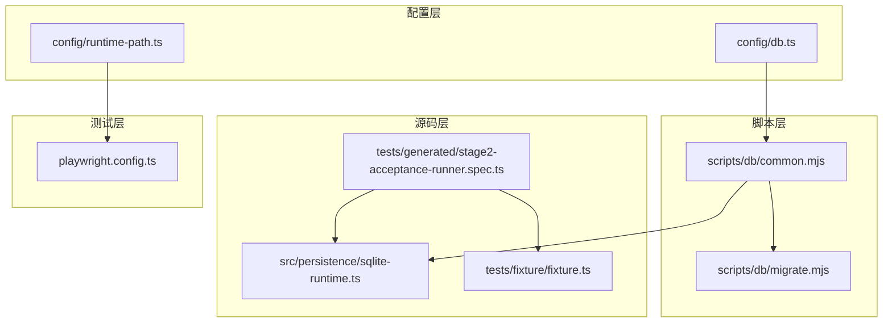
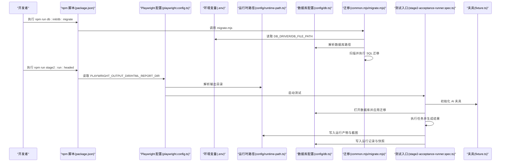
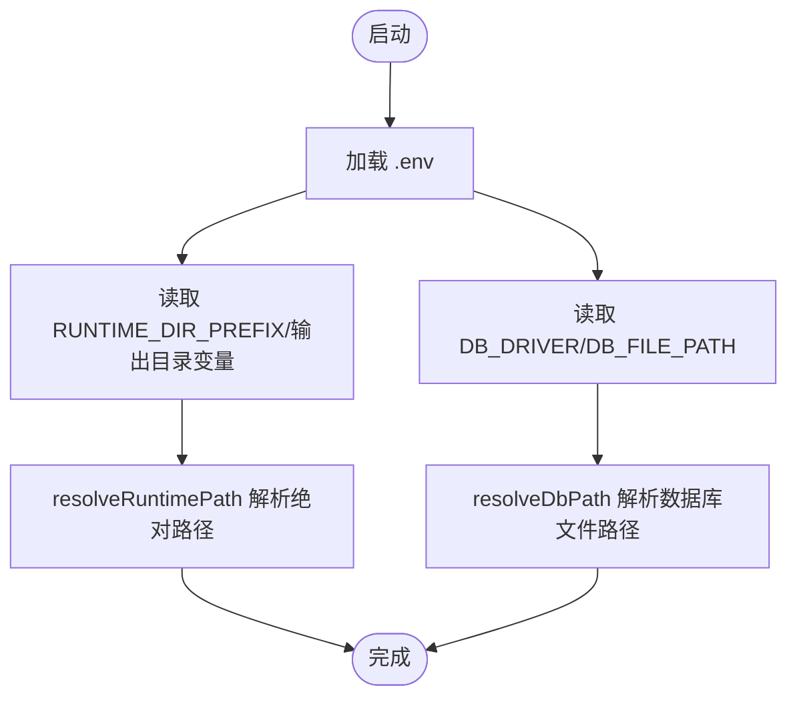
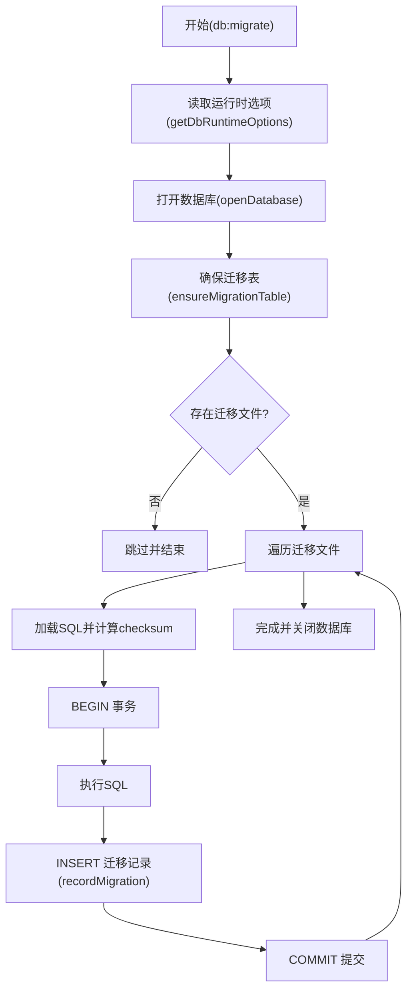
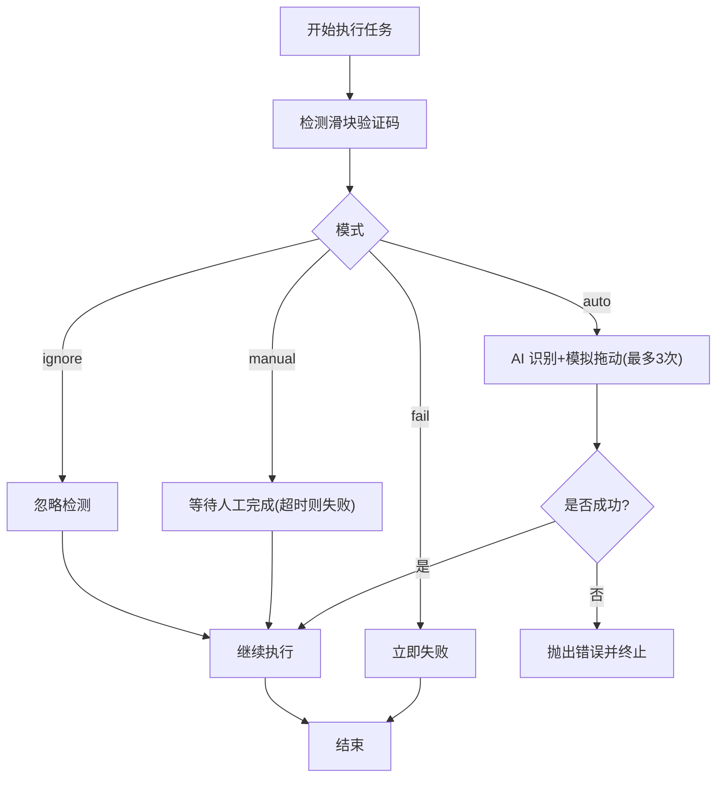
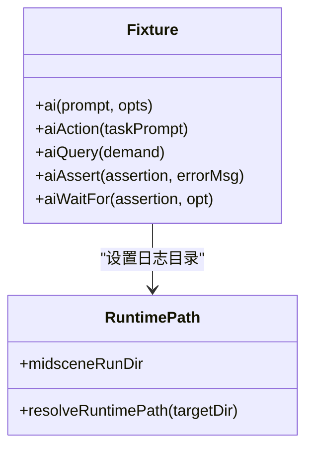
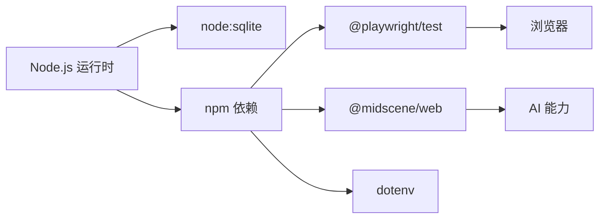

# 开发环境搭建

<cite>
**本文引用的文件**
- [README.md](file://README.md)
- [package.json](file://package.json)
- [playwright.config.ts](file://playwright.config.ts)
- [config/runtime-path.ts](file://config/runtime-path.ts)
- [config/db.ts](file://config/db.ts)
- [scripts/db/common.mjs](file://scripts/db/common.mjs)
- [scripts/db/migrate.mjs](file://scripts/db/migrate.mjs)
- [src/persistence/sqlite-runtime.ts](file://src/persistence/sqlite-runtime.ts)
- [tests/generated/stage2-acceptance-runner.spec.ts](file://tests/generated/stage2-acceptance-runner.spec.ts)
- [tests/fixture/fixture.ts](file://tests/fixture/fixture.ts)
- [AGENTS.md](file://AGENTS.md)
</cite>

## 目录
1. [简介](#简介)
2. [项目结构](#项目结构)
3. [核心组件](#核心组件)
4. [架构概览](#架构概览)
5. [详细组件分析](#详细组件分析)
6. [依赖分析](#依赖分析)
7. [性能考虑](#性能考虑)
8. [故障排查指南](#故障排查指南)
9. [结论](#结论)
10. [附录](#附录)

## 简介
本指南面向首次参与本项目的开发者，提供从零开始搭建本地开发环境的完整流程，涵盖 Node.js 版本要求、依赖安装、环境变量配置、开发工具与 IDE 推荐、调试环境设置、验证方法以及常见问题解决。项目基于 Playwright 与 Midscene.js 构建，支持第二阶段任务执行与滑块验证码自动处理，并通过 SQLite 实现运行期数据持久化。

## 项目结构
项目采用“配置-脚本-源码-测试-规范”的分层组织方式：
- 配置层：运行时路径与数据库配置集中于 config 目录，便于统一管理与扩展
- 脚本层：数据库迁移脚本位于 scripts/db，提供初始化与升级能力
- 源码层：第二阶段执行器与持久化逻辑位于 src 目录
- 测试层：Playwright 测试入口与夹具位于 tests 目录
- 规范层：AGENTS.md 统一命名、配置、日志与目录规范

图表来源
- [config/runtime-path.ts:1-41](file://config/runtime-path.ts#L1-L41)
- [config/db.ts:1-28](file://config/db.ts#L1-L28)
- [scripts/db/common.mjs:1-108](file://scripts/db/common.mjs#L1-L108)
- [scripts/db/migrate.mjs:1-52](file://scripts/db/migrate.mjs#L1-L52)
- [src/persistence/sqlite-runtime.ts:1-116](file://src/persistence/sqlite-runtime.ts#L1-L116)
- [tests/generated/stage2-acceptance-runner.spec.ts:1-39](file://tests/generated/stage2-acceptance-runner.spec.ts#L1-L39)
- [tests/fixture/fixture.ts:1-100](file://tests/fixture/fixture.ts#L1-L100)
- [playwright.config.ts:1-95](file://playwright.config.ts#L1-L95)

章节来源
- [README.md:10-30](file://README.md#L10-L30)
- [package.json:6-11](file://package.json#L6-L11)

## 核心组件
- 运行时路径配置：集中读取并解析 RUNTIME_DIR_PREFIX、PLAYWRIGHT_OUTPUT_DIR、PLAYWRIGHT_HTML_REPORT_DIR、MIDSCENE_RUN_DIR、ACCEPTANCE_RESULT_DIR 等环境变量，统一输出目录收敛至 t_runtime/
- 数据库配置：读取 DB_DRIVER 与 DB_FILE_PATH，支持 SQLite 单文件数据库，提供迁移表与校验机制
- 数据库迁移脚本：扫描 db/migrations 目录，按文件名排序执行 SQL，记录迁移 checksum 与执行时间
- 第二阶段执行器：读取 STAGE2_TASK_FILE，结合 Midscene + Playwright 执行任务，内置滑块验证码自动处理策略
- 测试夹具：封装 ai、aiQuery、aiAssert、aiWaitFor 等 AI 能力，统一日志与缓存目录

章节来源
- [config/runtime-path.ts:8-36](file://config/runtime-path.ts#L8-L36)
- [config/db.ts:10-26](file://config/db.ts#L10-L26)
- [scripts/db/common.mjs:31-41](file://scripts/db/common.mjs#L31-L41)
- [scripts/db/migrate.mjs:15-51](file://scripts/db/migrate.mjs#L15-L51)
- [src/persistence/sqlite-runtime.ts:73-114](file://src/persistence/sqlite-runtime.ts#L73-L114)
- [tests/generated/stage2-acceptance-runner.spec.ts:12-38](file://tests/generated/stage2-acceptance-runner.spec.ts#L12-L38)
- [tests/fixture/fixture.ts:23-99](file://tests/fixture/fixture.ts#L23-L99)

## 架构概览
下图展示从命令行到测试执行再到数据库落库的整体流程，体现环境变量、配置模块与执行器之间的耦合关系。

图表来源
- [package.json:7-11](file://package.json#L7-L11)
- [playwright.config.ts:22-40](file://playwright.config.ts#L22-L40)
- [config/runtime-path.ts:13-36](file://config/runtime-path.ts#L13-L36)
- [config/db.ts:20-26](file://config/db.ts#L20-L26)
- [scripts/db/common.mjs:47-58](file://scripts/db/common.mjs#L47-L58)
- [scripts/db/migrate.mjs:15-51](file://scripts/db/migrate.mjs#L15-L51)
- [tests/generated/stage2-acceptance-runner.spec.ts:12-38](file://tests/generated/stage2-acceptance-runner.spec.ts#L12-L38)
- [tests/fixture/fixture.ts:10-100](file://tests/fixture/fixture.ts#L10-L100)

## 详细组件分析

### 环境变量与配置加载
- 运行时路径：通过 dotenv 加载 .env，读取 RUNTIME_DIR_PREFIX 并派生 PLAYWRIGHT_OUTPUT_DIR、PLAYWRIGHT_HTML_REPORT_DIR、MIDSCENE_RUN_DIR、ACCEPTANCE_RESULT_DIR
- 数据库：读取 DB_DRIVER 与 DB_FILE_PATH，若未设置则回退到默认值；resolveDbPath 统一解析绝对路径
- 迁移选项：getDbRuntimeOptions 返回 dbDriver、dbFilePath、resolvedDbFilePath、migrationsDir

图表来源
- [config/runtime-path.ts:8-40](file://config/runtime-path.ts#L8-L40)
- [config/db.ts:10-26](file://config/db.ts#L10-L26)

章节来源
- [config/runtime-path.ts:8-40](file://config/runtime-path.ts#L8-L40)
- [config/db.ts:10-26](file://config/db.ts#L10-L26)

### 数据库迁移与初始化
- 迁移表：ensureMigrationTable 创建 schema_migrations 表，记录迁移文件名、checksum 与执行时间
- 扫描与执行：listMigrationFiles 过滤 .sql 文件并排序；逐个加载 SQL，计算 checksum，事务执行并记录
- 异常处理：捕获错误后回滚，保证幂等性

图表来源
- [scripts/db/common.mjs:60-106](file://scripts/db/common.mjs#L60-L106)
- [scripts/db/migrate.mjs:15-51](file://scripts/db/migrate.mjs#L15-L51)

章节来源
- [scripts/db/common.mjs:60-106](file://scripts/db/common.mjs#L60-L106)
- [scripts/db/migrate.mjs:15-51](file://scripts/db/migrate.mjs#L15-L51)

### 第二阶段执行器与滑块验证码处理
- 任务执行：从 STAGE2_TASK_FILE 读取任务，调用 runTaskScenario 执行，生成 acceptance-results 与截图
- 滑块验证码：根据 STAGE2_CAPTCHA_MODE 与 STAGE2_CAPTCHA_WAIT_TIMEOUT_MS 决策
  - auto：AI 查询滑块位置与滑槽宽度，模拟真人拖动轨迹，最多重试 3 次
  - manual：检测到验证码后等待人工完成，超时则失败
  - fail：检测到验证码即失败
  - ignore：忽略检测（不建议）

图表来源
- [tests/generated/stage2-acceptance-runner.spec.ts:12-38](file://tests/generated/stage2-acceptance-runner.spec.ts#L12-L38)
- [src/persistence/sqlite-runtime.ts:73-114](file://src/persistence/sqlite-runtime.ts#L73-L114)

章节来源
- [tests/generated/stage2-acceptance-runner.spec.ts:12-38](file://tests/generated/stage2-acceptance-runner.spec.ts#L12-L38)
- [src/persistence/sqlite-runtime.ts:73-114](file://src/persistence/sqlite-runtime.ts#L73-L114)

### 测试夹具与日志目录
- 夹具：为每个测试用例注入 ai、aiAction、aiQuery、aiAssert、aiWaitFor，统一缓存 ID 与分组信息
- 日志：setLogDir 将 Midscene 运行日志、缓存与报告写入 MIDSCENE_RUN_DIR

图表来源
- [tests/fixture/fixture.ts:23-99](file://tests/fixture/fixture.ts#L23-L99)
- [config/runtime-path.ts:28-36](file://config/runtime-path.ts#L28-L36)

章节来源
- [tests/fixture/fixture.ts:23-99](file://tests/fixture/fixture.ts#L23-L99)
- [config/runtime-path.ts:28-36](file://config/runtime-path.ts#L28-L36)

## 依赖分析
- Node.js 运行时：数据库脚本使用 node:sqlite，需启用实验特性标志
- Playwright：测试框架与浏览器安装、报告生成
- Midscene：AI 能力（定位、提取、断言），与 Playwright 集成
- dotenv：加载 .env 环境变量
- 依赖安装：npm install；浏览器安装 npx playwright install

图表来源
- [package.json:15-24](file://package.json#L15-L24)
- [README.md:25-29](file://README.md#L25-L29)

章节来源
- [package.json:15-24](file://package.json#L15-L24)
- [README.md:25-29](file://README.md#L25-L29)

## 性能考虑
- 并行与重试：Playwright 在 CI 上限制并发并在失败时重试，本地开发建议禁用重试以快速反馈
- 输出目录：统一收敛到 t_runtime/，避免磁盘碎片化与查找困难
- 数据库：SQLite 单文件适合本地开发，注意迁移幂等与事务一致性
- AI 操作：尽量使用结构化断言与硬检测，减少 AI 幻觉风险

## 故障排查指南
- 数据库迁移失败
  - 症状：执行 db:migrate 抛出异常
  - 排查：确认 DB_DRIVER 为 sqlite；检查 DB_FILE_PATH 是否可写；查看 schema_migrations 是否存在
  - 参考
    - [scripts/db/common.mjs:47-58](file://scripts/db/common.mjs#L47-L58)
    - [scripts/db/common.mjs:60-69](file://scripts/db/common.mjs#L60-L69)
- 浏览器不可用
  - 症状：Playwright 报告找不到浏览器
  - 处理：执行 npx playwright install
  - 参考
    - [README.md:25-29](file://README.md#L25-L29)
- 滑块验证码导致失败
  - 症状：执行中断或失败
  - 处理：调整 STAGE2_CAPTCHA_MODE 与 STAGE2_CAPTCHA_WAIT_TIMEOUT_MS；必要时改为 manual 模式
  - 参考
    - [README.md:56-75](file://README.md#L56-L75)
    - [tests/generated/stage2-acceptance-runner.spec.ts:27-35](file://tests/generated/stage2-acceptance-runner.spec.ts#L27-L35)
- 输出目录不一致
  - 症状：报告与截图不在预期位置
  - 处理：检查 RUNTIME_DIR_PREFIX 与各输出目录变量；确认 config/runtime-path.ts 生效
  - 参考
    - [config/runtime-path.ts:13-36](file://config/runtime-path.ts#L13-L36)
    - [playwright.config.ts:22-40](file://playwright.config.ts#L22-L40)

章节来源
- [scripts/db/common.mjs:47-58](file://scripts/db/common.mjs#L47-L58)
- [scripts/db/common.mjs:60-69](file://scripts/db/common.mjs#L60-L69)
- [README.md:25-29](file://README.md#L25-L29)
- [README.md:56-75](file://README.md#L56-L75)
- [tests/generated/stage2-acceptance-runner.spec.ts:27-35](file://tests/generated/stage2-acceptance-runner.spec.ts#L27-L35)
- [config/runtime-path.ts:13-36](file://config/runtime-path.ts#L13-L36)
- [playwright.config.ts:22-40](file://playwright.config.ts#L22-L40)

## 结论
通过遵循本指南，您可以快速完成本地开发环境搭建，掌握环境变量配置、数据库初始化、测试执行与调试技巧。建议在本地先执行 db:init/db:migrate，再运行 stage2:run:headed 验证端到端流程，并根据实际需求调整滑块验证码处理策略与输出目录。

## 附录

### 开发环境搭建步骤
- 克隆项目与安装依赖
  - 参考
    - [README.md:12-23](file://README.md#L12-L23)
- 安装浏览器
  - 参考
    - [README.md:25-29](file://README.md#L25-L29)
- 配置 .env
  - 参考
    - [README.md:31-54](file://README.md#L31-L54)
    - [AGENTS.md:22-32](file://AGENTS.md#L22-L32)
- 初始化数据库
  - 参考
    - [README.md:120-130](file://README.md#L120-L130)
    - [scripts/db/migrate.mjs:15-51](file://scripts/db/migrate.mjs#L15-L51)
- 运行测试
  - 参考
    - [README.md:154-164](file://README.md#L154-L164)
    - [package.json:9-11](file://package.json#L9-L11)

章节来源
- [README.md:12-23](file://README.md#L12-L23)
- [README.md:25-29](file://README.md#L25-L29)
- [README.md:31-54](file://README.md#L31-L54)
- [AGENTS.md:22-32](file://AGENTS.md#L22-L32)
- [README.md:120-130](file://README.md#L120-L130)
- [scripts/db/migrate.mjs:15-51](file://scripts/db/migrate.mjs#L15-L51)
- [README.md:154-164](file://README.md#L154-L164)
- [package.json:9-11](file://package.json#L9-L11)

### 开发工具与 IDE 配置建议
- 推荐编辑器：VS Code（支持 TypeScript、Playwright、dotenv 插件）
- 代码规范：遵循 AGENTS.md 的命名与配置规范，统一通过 .env 管理配置与路径
- Git 工作流：提交前执行基础验证，确保输出目录与文档同步更新
- 参考
  - [AGENTS.md:14-32](file://AGENTS.md#L14-L32)
  - [AGENTS.md:48-53](file://AGENTS.md#L48-L53)

章节来源
- [AGENTS.md:14-32](file://AGENTS.md#L14-L32)
- [AGENTS.md:48-53](file://AGENTS.md#L48-L53)