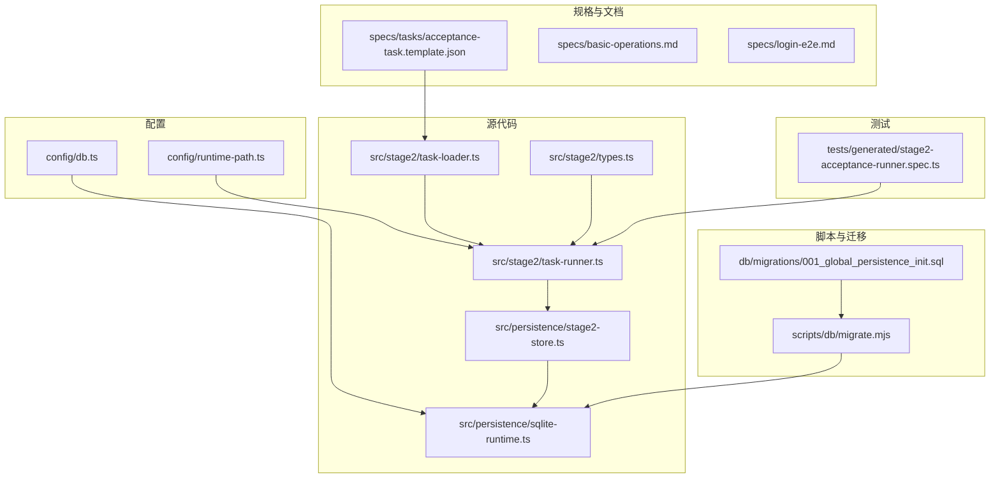
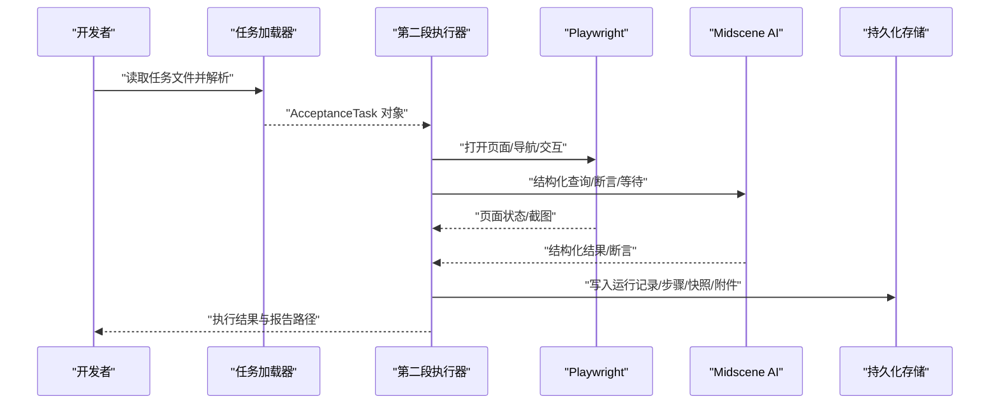
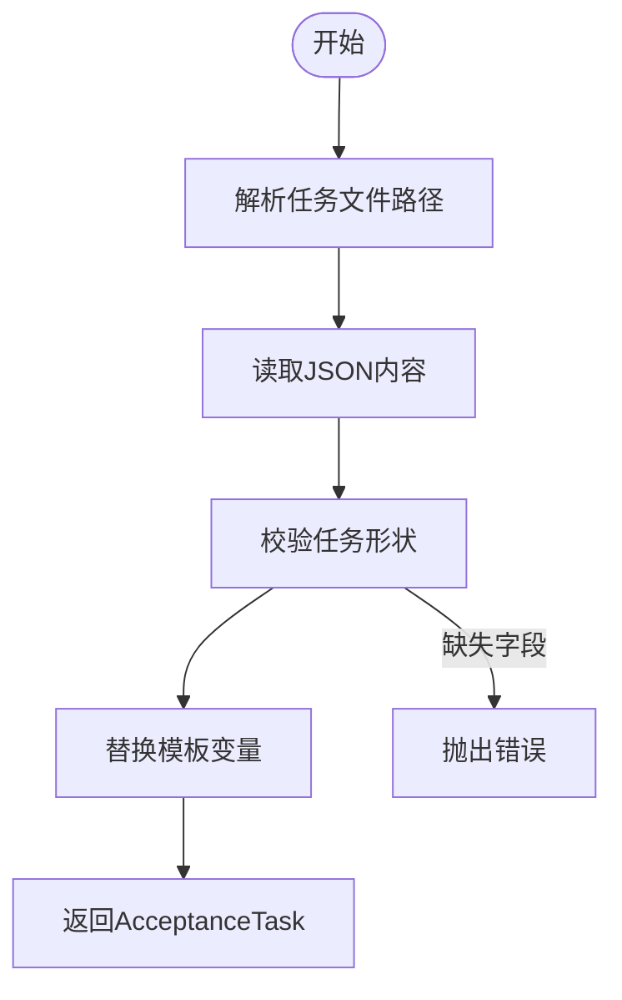
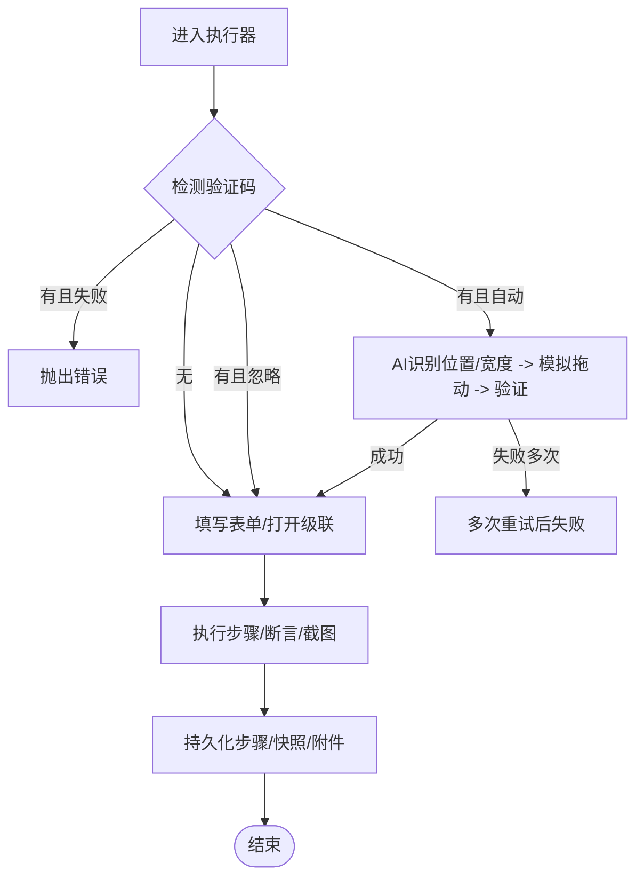
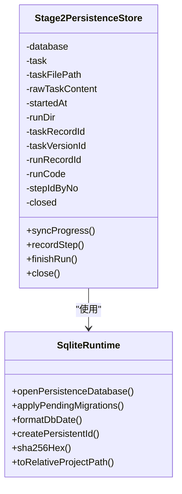
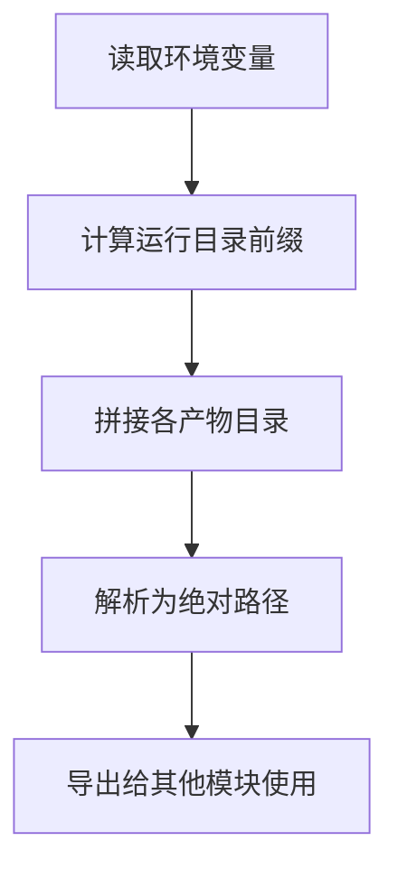
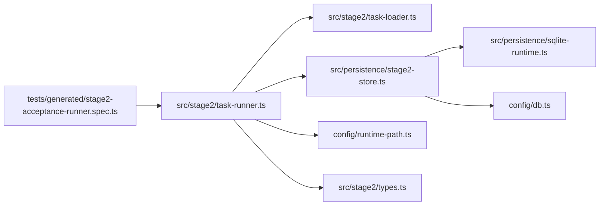

# 开发者指南

<cite>
**本文引用的文件**
- [README.md](file://README.md)
- [package.json](file://package.json)
- [playwright.config.ts](file://playwright.config.ts)
- [src/stage2/task-runner.ts](file://src/stage2/task-runner.ts)
- [src/stage2/task-loader.ts](file://src/stage2/task-loader.ts)
- [src/stage2/types.ts](file://src/stage2/types.ts)
- [src/persistence/stage2-store.ts](file://src/persistence/stage2-store.ts)
- [src/persistence/sqlite-runtime.ts](file://src/persistence/sqlite-runtime.ts)
- [config/runtime-path.ts](file://config/runtime-path.ts)
- [config/db.ts](file://config/db.ts)
- [scripts/db/migrate.mjs](file://scripts/db/migrate.mjs)
- [db/migrations/001_global_persistence_init.sql](file://db/migrations/001_global_persistence_init.sql)
- [tests/generated/stage2-acceptance-runner.spec.ts](file://tests/generated/stage2-acceptance-runner.spec.ts)
- [specs/tasks/acceptance-task.template.json](file://specs/tasks/acceptance-task.template.json)
- [specs/basic-operations.md](file://specs/basic-operations.md)
- [specs/login-e2e.md](file://specs/login-e2e.md)
</cite>

## 目录
1. [简介](#简介)
2. [项目结构](#项目结构)
3. [核心组件](#核心组件)
4. [架构总览](#架构总览)
5. [详细组件分析](#详细组件分析)
6. [依赖关系分析](#依赖关系分析)
7. [性能考虑](#性能考虑)
8. [故障排查指南](#故障排查指南)
9. [结论](#结论)
10. [附录](#附录)

## 简介
本指南面向希望参与开发与维护的工程师，覆盖开发环境搭建、调试技巧、核心模块实现原理、扩展点与自定义方法、最佳实践与代码规范、性能优化建议、测试策略（单元与集成）、常见问题排查以及与其他系统的集成与 API 扩展方法。项目基于 Playwright 与 Midscene.js 构建，提供 AI 驱动的 Web UI 自动化测试与第二段任务执行能力，并内置 SQLite 全局数据持久化底座。

## 项目结构
项目采用按功能域分层的组织方式：
- config：运行时路径与数据库配置
- src：源代码
  - stage2：第二段任务加载、执行与运行期控制
  - persistence：SQLite 数据持久化与迁移
- tests：测试用例与夹具
- specs：任务模板与测试计划文档
- scripts/db：数据库迁移脚本
- db/migrations：SQL 迁移文件
- 根目录：README、package.json、Playwright 配置

图表来源
- [config/runtime-path.ts:1-41](file://config/runtime-path.ts#L1-L41)
- [config/db.ts:1-28](file://config/db.ts#L1-L28)
- [src/stage2/types.ts:1-180](file://src/stage2/types.ts#L1-L180)
- [src/stage2/task-loader.ts:1-91](file://src/stage2/task-loader.ts#L1-L91)
- [src/stage2/task-runner.ts:1-800](file://src/stage2/task-runner.ts#L1-L800)
- [src/persistence/sqlite-runtime.ts:1-116](file://src/persistence/sqlite-runtime.ts#L1-L116)
- [src/persistence/stage2-store.ts:1-655](file://src/persistence/stage2-store.ts#L1-L655)
- [tests/generated/stage2-acceptance-runner.spec.ts:1-39](file://tests/generated/stage2-acceptance-runner.spec.ts#L1-L39)
- [specs/tasks/acceptance-task.template.json:1-141](file://specs/tasks/acceptance-task.template.json#L1-L141)
- [scripts/db/migrate.mjs:1-52](file://scripts/db/migrate.mjs#L1-L52)
- [db/migrations/001_global_persistence_init.sql:1-128](file://db/migrations/001_global_persistence_init.sql#L1-L128)

章节来源
- [README.md:1-223](file://README.md#L1-L223)
- [package.json:1-26](file://package.json#L1-L26)

## 核心组件
- 任务加载与解析：从 JSON 任务文件加载、模板变量替换、形状校验
- 第二段执行器：页面交互、AI 断言与查询、验证码处理、步骤与结果持久化
- 数据持久化：SQLite 迁移、运行记录、步骤、快照、附件与审计日志
- 运行时路径与数据库配置：集中管理输出目录、报告目录、数据库文件路径
- Playwright 配置：报告器、超时、并行度、设备项目等

章节来源
- [src/stage2/task-loader.ts:79-91](file://src/stage2/task-loader.ts#L79-L91)
- [src/stage2/task-runner.ts:650-706](file://src/stage2/task-runner.ts#L650-L706)
- [src/persistence/stage2-store.ts:74-123](file://src/persistence/stage2-store.ts#L74-L123)
- [src/persistence/sqlite-runtime.ts:73-114](file://src/persistence/sqlite-runtime.ts#L73-L114)
- [config/runtime-path.ts:38-41](file://config/runtime-path.ts#L38-L41)
- [config/db.ts:24-27](file://config/db.ts#L24-L27)
- [playwright.config.ts:22-94](file://playwright.config.ts#L22-L94)

## 架构总览
系统围绕“任务 JSON -> 执行器 -> AI/Playwright -> 结果持久化”的主链路构建，同时通过运行时路径与数据库配置实现产物与数据的统一落盘。

图表来源
- [src/stage2/task-loader.ts:79-91](file://src/stage2/task-loader.ts#L79-L91)
- [src/stage2/task-runner.ts:650-706](file://src/stage2/task-runner.ts#L650-L706)
- [src/persistence/stage2-store.ts:495-630](file://src/persistence/stage2-store.ts#L495-L630)

## 详细组件分析

### 组件一：任务加载与解析（task-loader）
职责
- 解析任务文件路径（支持绝对/相对路径与默认值）
- 模板变量替换（NOW_YYYYMMDDHHMMSS、环境变量）
- 形状校验（必需字段检查）

关键点
- 模板替换递归遍历对象/数组/字符串
- 严格校验任务必需字段，缺失时报错
- 支持在运行时注入时间戳令牌

图表来源
- [src/stage2/task-loader.ts:71-91](file://src/stage2/task-loader.ts#L71-L91)

章节来源
- [src/stage2/task-loader.ts:79-91](file://src/stage2/task-loader.ts#L79-L91)

### 组件二：第二段执行器（task-runner）
职责
- 页面导航、表单填写、对话框交互、级联选择
- AI 查询与断言、等待条件
- 验证码挑战检测与处理（自动/人工/失败/忽略）
- 步骤执行、截图、结果汇总与持久化

关键流程
- 验证码处理：检测文本/选择器 -> 自动拖动轨迹（easeOut + 随机抖动）-> 多次重试
- 级联选择：打开面板 -> 按层级点击选项 -> 回填显示值
- 步骤持久化：每步写入 run_step 与附件（screenshot），最终写入 run 与快照

图表来源
- [src/stage2/task-runner.ts:483-501](file://src/stage2/task-runner.ts#L483-L501)
- [src/stage2/task-runner.ts:561-648](file://src/stage2/task-runner.ts#L561-L648)
- [src/stage2/task-runner.ts:708-788](file://src/stage2/task-runner.ts#L708-L788)
- [src/stage2/task-runner.ts:790-806](file://src/stage2/task-runner.ts#L790-L806)

章节来源
- [src/stage2/task-runner.ts:483-706](file://src/stage2/task-runner.ts#L483-L706)
- [src/stage2/task-runner.ts:708-806](file://src/stage2/task-runner.ts#L708-L806)

### 组件三：数据持久化（stage2-store + sqlite-runtime）
职责
- 初始化数据库与迁移
- 写入任务、任务版本、运行、步骤、快照、附件与审计日志
- 提供安全的文件路径转换与哈希校验

关键点
- 迁移表 schema_migrations 记录已执行文件与校验和
- 任务内容掩码处理（password 星号化）后入库
- 进度与最终结果以快照形式落库，附件记录相对/绝对路径与大小

图表来源
- [src/persistence/stage2-store.ts:74-123](file://src/persistence/stage2-store.ts#L74-L123)
- [src/persistence/sqlite-runtime.ts:73-114](file://src/persistence/sqlite-runtime.ts#L73-L114)

章节来源
- [src/persistence/stage2-store.ts:37-48](file://src/persistence/stage2-store.ts#L37-L48)
- [src/persistence/stage2-store.ts:135-261](file://src/persistence/stage2-store.ts#L135-L261)
- [src/persistence/stage2-store.ts:495-630](file://src/persistence/stage2-store.ts#L495-L630)
- [src/persistence/sqlite-runtime.ts:86-114](file://src/persistence/sqlite-runtime.ts#L86-L114)

### 组件四：运行时路径与数据库配置
职责
- 从环境变量读取运行产物目录前缀与各子目录
- 统一解析为绝对路径
- 数据库驱动与文件路径解析

图表来源
- [config/runtime-path.ts:8-41](file://config/runtime-path.ts#L8-L41)
- [config/db.ts:10-27](file://config/db.ts#L10-L27)

章节来源
- [config/runtime-path.ts:8-41](file://config/runtime-path.ts#L8-L41)
- [config/db.ts:10-27](file://config/db.ts#L10-L27)

### 组件五：Playwright 配置
职责
- 设置测试输出目录、HTML 报告目录
- 配置报告器（list/html/@midscene/web/playwright-report）
- 设备项目、超时、并行度、重试策略

章节来源
- [playwright.config.ts:22-94](file://playwright.config.ts#L22-L94)

## 依赖关系分析
- 模块内聚与耦合
  - task-runner 依赖 task-loader、runtime-path、stage2-store、types
  - stage2-store 依赖 sqlite-runtime、runtime-path、db 配置
  - tests 通过夹具注入 AI 能力与页面实例
- 外部依赖
  - Playwright、@midscene/web、dotenv
  - Node SQLite（实验特性）

图表来源
- [tests/generated/stage2-acceptance-runner.spec.ts:1-39](file://tests/generated/stage2-acceptance-runner.spec.ts#L1-L39)
- [src/stage2/task-runner.ts:1-26](file://src/stage2/task-runner.ts#L1-L26)
- [src/stage2/task-loader.ts:1-9](file://src/stage2/task-loader.ts#L1-L9)
- [src/persistence/stage2-store.ts:1-14](file://src/persistence/stage2-store.ts#L1-L14)
- [src/persistence/sqlite-runtime.ts:1-6](file://src/persistence/sqlite-runtime.ts#L1-L6)
- [config/runtime-path.ts:1-4](file://config/runtime-path.ts#L1-L4)
- [config/db.ts:1-4](file://config/db.ts#L1-L4)
- [src/stage2/types.ts:1-5](file://src/stage2/types.ts#L1-L5)

## 性能考虑
- 页面交互与等待
  - 合理设置 stepTimeoutMs/pageTimeoutMs，避免过短导致不稳定，过长影响吞吐
  - 使用可见性检测与结构化查询替代频繁轮询
- 验证码处理
  - 自动模式采用缓动轨迹与抖动模拟人类行为，减少被识别概率
  - 失败重试次数与间隔需平衡稳定性与耗时
- 数据持久化
  - 批量写入与事务（已使用 BEGIN/COMMIT/ROLLBACK）提升写入效率
  - 附件路径与大小记录，避免大文件直接入库
- 报告与产物
  - 控制截图与报告生成频率，避免磁盘 IO 压力过大

## 故障排查指南
- 环境变量与路径
  - 确认 RUNTIME_DIR_PREFIX、PLAYWRIGHT_OUTPUT_DIR、PLAYWRIGHT_HTML_REPORT_DIR、MIDSCENE_RUN_DIR、ACCEPTANCE_RESULT_DIR、DB_FILE_PATH 等已正确设置
  - 使用 resolveRuntimePath 统一解析为绝对路径
- 数据库初始化与迁移
  - 使用 db:init/db:migrate 脚本执行迁移
  - 检查 schema_migrations 是否记录已执行文件
- 任务文件
  - 确认任务 JSON 包含 taskId、taskName、target.url、account.username/password、form.openButtonText/form.submitButtonText、form.fields 等必需字段
  - 模板变量（NOW_YYYYMMDDHHMMSS、环境变量）是否正确替换
- 验证码处理
  - STAGE2_CAPTCHA_MODE：auto/manual/fail/ignore
  - auto 模式失败时，检查页面截图与滑块选择器是否匹配
  - manual 模式下，STAGE2_CAPTCHA_WAIT_TIMEOUT_MS 是否足够
- 执行失败定位
  - 查看最终 result.json 与步骤截图
  - 审计日志与 ai_run_step 的 message/errorStack
- Playwright 报告
  - HTML 报告与 Midscene 报告目录位置
  - trace 仅在首次重试时收集，便于定位问题

章节来源
- [README.md:39-54](file://README.md#L39-L54)
- [README.md:120-130](file://README.md#L120-L130)
- [README.md:154-189](file://README.md#L154-L189)
- [scripts/db/migrate.mjs:15-51](file://scripts/db/migrate.mjs#L15-L51)
- [src/stage2/task-loader.ts:50-69](file://src/stage2/task-loader.ts#L50-L69)
- [src/stage2/task-runner.ts:650-706](file://src/stage2/task-runner.ts#L650-L706)
- [src/persistence/stage2-store.ts:592-630](file://src/persistence/stage2-store.ts#L592-L630)

## 结论
本项目通过“任务 JSON + AI + Playwright”的组合，提供了可扩展的验收测试与第二段执行能力，并以 SQLite 作为全局数据持久化底座，支撑运行记录、步骤明细、快照与附件的统一管理。遵循本文档的开发与测试实践，可高效迭代功能、稳定执行流程并持续优化性能与可观测性。

## 附录

### 开发环境搭建与调试
- 安装依赖与浏览器
  - npm install
  - npx playwright install
- 配置 .env
  - 参考 README 的 .env 示例，设置 OPENAI_API_KEY、OPENAI_BASE_URL、MIDSCENE_MODEL_NAME、RUNTIME_DIR_PREFIX、PLAYWRIGHT_OUTPUT_DIR、PLAYWRIGHT_HTML_REPORT_DIR、MIDSCENE_RUN_DIR、ACCEPTANCE_RESULT_DIR、DB_DRIVER、DB_FILE_PATH、STAGE2_TASK_FILE、STAGE2_REQUIRE_APPROVAL、STAGE2_CAPTCHA_MODE、STAGE2_CAPTCHA_WAIT_TIMEOUT_MS
- 初始化数据库
  - npm run db:init
  - npm run db:migrate
- 运行第二段
  - npm run stage2:run 或 npm run stage2:run:headed
- 运行测试
  - npx playwright test tests/generated/stage2-acceptance-runner.spec.ts --headed

章节来源
- [README.md:10-54](file://README.md#L10-L54)
- [README.md:120-130](file://README.md#L120-L130)
- [README.md:154-179](file://README.md#L154-L179)
- [package.json:6-11](file://package.json#L6-L11)

### 代码规范与最佳实践
- 任务 JSON
  - 使用 acceptance-task.template.json 作为模板，按需填充字段
  - 优先使用 Playwright 硬检测（getByRole/getByLabel/getByTestId）+ 自动重试断言
  - 复杂语义场景优先使用 aiQuery + 代码断言，减少 aiAssert 幻觉风险
  - table-cell-equals/table-cell-contains 降级策略：先尝试 Playwright 表格列值提取，失败再降级到 AI
  - 最终验收建议以 table-row-exists 作为硬门槛；少量关键列使用 soft=true
- 执行器
  - 合理设置 runtime.stepTimeoutMs、runtime.pageTimeoutMs
  - 验证码模式按需选择，auto 模式失败时切换 manual 并增大等待时间
- 持久化
  - 任务版本入库前对 account.password 做掩码处理
  - 附件仅记录路径与大小，不直接保存二进制
- 报告与产物
  - 统一收敛到 t_runtime/ 下，便于归档与检索

章节来源
- [README.md:146-152](file://README.md#L146-L152)
- [README.md:191-201](file://README.md#L191-L201)
- [specs/tasks/acceptance-task.template.json:1-141](file://specs/tasks/acceptance-task.template.json#L1-L141)

### 测试策略与编写方法
- 单元测试
  - 针对 task-loader 的模板替换与形状校验
  - 针对 sqlite-runtime 的迁移与日期格式化
- 集成测试
  - 使用 tests/generated/stage2-acceptance-runner.spec.ts 作为入口
  - 通过夹具注入 page、ai、aiAssert、aiQuery、aiWaitFor
  - 断言最终 result.status 为 passed
- 文档化测试计划
  - 参考 specs/basic-operations.md 与 specs/login-e2e.md 的结构与步骤

章节来源
- [tests/generated/stage2-acceptance-runner.spec.ts:1-39](file://tests/generated/stage2-acceptance-runner.spec.ts#L1-L39)
- [specs/basic-operations.md:1-34](file://specs/basic-operations.md#L1-L34)
- [specs/login-e2e.md:1-152](file://specs/login-e2e.md#L1-L152)

### 扩展点与自定义方法
- 任务字段扩展
  - uiProfile：补充跨平台选择器优先级（表格行、Toast、弹窗）
  - assertions：新增 matchMode、timeoutMs、retryCount、soft 等
  - cleanup：支持 delete-created/delete-all-matched/custom 等策略
- 执行器扩展
  - 新增步骤类型：在 task-runner 中扩展步骤逻辑与断言
  - 验证码处理：自定义检测规则与拖动轨迹
- 持久化扩展
  - 新增快照键与附件类型，完善审计日志
- 集成与 API 扩展
  - 通过 playwright.config.ts 扩展设备项目与报告器
  - 通过 .env 扩展运行时路径与数据库配置

章节来源
- [src/stage2/types.ts:58-126](file://src/stage2/types.ts#L58-L126)
- [src/stage2/task-runner.ts:483-706](file://src/stage2/task-runner.ts#L483-L706)
- [src/persistence/stage2-store.ts:358-468](file://src/persistence/stage2-store.ts#L358-L468)
- [playwright.config.ts:51-86](file://playwright.config.ts#L51-L86)
- [config/runtime-path.ts:13-36](file://config/runtime-path.ts#L13-L36)
- [config/db.ts:20-26](file://config/db.ts#L20-L26)

### 贡献代码流程与规范
- 提交前检查
  - 本地运行 npm run stage2:run:headed 与测试用例
  - 确认数据库迁移通过且产物目录结构符合预期
- 提交流程
  - 基于最新分支创建功能分支
  - 编写清晰的提交信息与变更说明
  - 包含必要的测试与文档更新
- 代码审查
  - 关注任务 JSON 模板一致性、执行器健壮性与持久化完整性
  - 确保 .env 与路径配置的可移植性

章节来源
- [README.md:10-54](file://README.md#L10-L54)
- [README.md:120-130](file://README.md#L120-L130)
- [README.md:154-179](file://README.md#L154-L179)