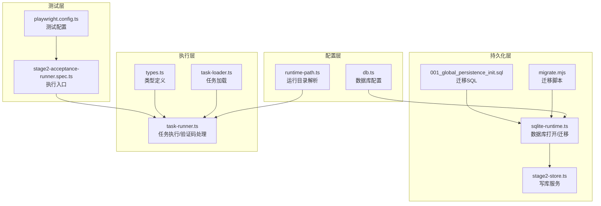
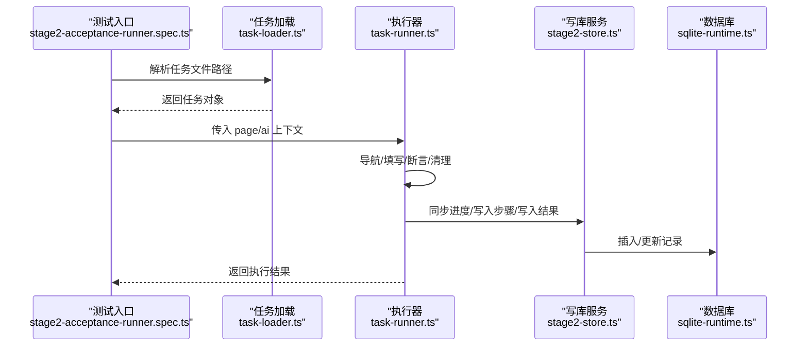
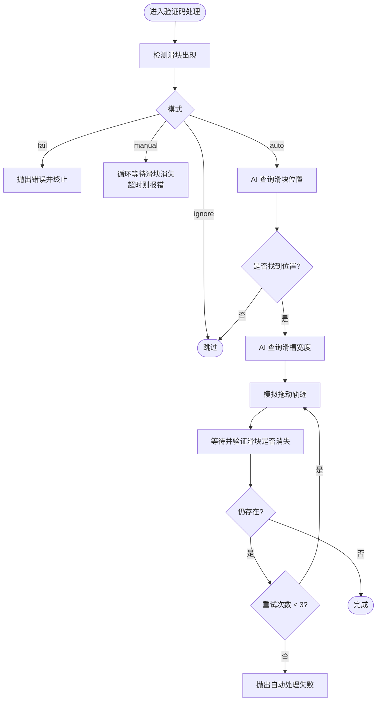
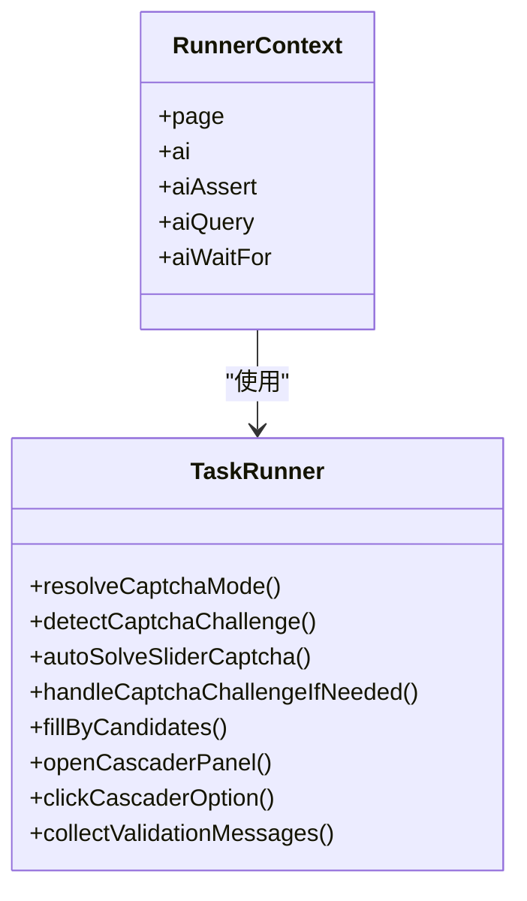
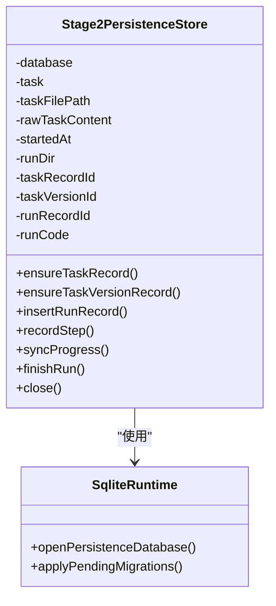
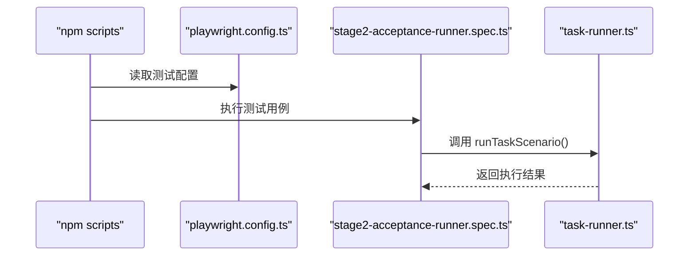
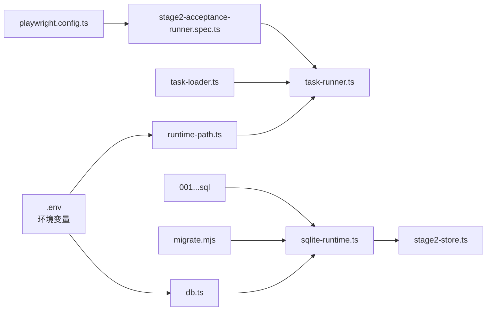

# 性能优化

<cite>
**本文引用的文件**
- [README.md](file://README.md)
- [package.json](file://package.json)
- [playwright.config.ts](file://playwright.config.ts)
- [config/runtime-path.ts](file://config/runtime-path.ts)
- [config/db.ts](file://config/db.ts)
- [src/persistence/sqlite-runtime.ts](file://src/persistence/sqlite-runtime.ts)
- [src/persistence/stage2-store.ts](file://src/persistence/stage2-store.ts)
- [src/stage2/task-runner.ts](file://src/stage2/task-runner.ts)
- [src/stage2/task-loader.ts](file://src/stage2/task-loader.ts)
- [src/stage2/types.ts](file://src/stage2/types.ts)
- [db/migrations/001_global_persistence_init.sql](file://db/migrations/001_global_persistence_init.sql)
- [scripts/db/migrate.mjs](file://scripts/db/migrate.mjs)
- [tests/generated/stage2-acceptance-runner.spec.ts](file://tests/generated/stage2-acceptance-runner.spec.ts)
</cite>

## 目录
1. [引言](#引言)
2. [项目结构](#项目结构)
3. [核心组件](#核心组件)
4. [架构总览](#架构总览)
5. [详细组件分析](#详细组件分析)
6. [依赖关系分析](#依赖关系分析)
7. [性能考量](#性能考量)
8. [故障排查指南](#故障排查指南)
9. [结论](#结论)
10. [附录](#附录)

## 引言
本指南面向本项目的性能优化需求，聚焦于任务执行性能调优、数据库查询优化、网络请求优化、AI 集成性能、验证码处理效率、页面自动化执行速度，以及生产环境的性能监控与指标设置。内容结合仓库现有实现，给出可操作的优化建议与最佳实践。

## 项目结构
项目采用分层结构：
- 配置层：运行目录与数据库路径解析
- 持久化层：SQLite 数据库初始化、迁移与写库
- 执行层：第二段任务加载、运行与结果落库
- 测试层：Playwright + Midscene 集成的端到端执行入口

**图表来源**
- [config/runtime-path.ts:1-41](file://config/runtime-path.ts#L1-L41)
- [config/db.ts:1-28](file://config/db.ts#L1-L28)
- [src/persistence/sqlite-runtime.ts:1-116](file://src/persistence/sqlite-runtime.ts#L1-L116)
- [scripts/db/migrate.mjs:1-52](file://scripts/db/migrate.mjs#L1-L52)
- [src/persistence/stage2-store.ts:1-655](file://src/persistence/stage2-store.ts#L1-L655)
- [db/migrations/001_global_persistence_init.sql:1-128](file://db/migrations/001_global_persistence_init.sql#L1-L128)
- [src/stage2/task-loader.ts:1-91](file://src/stage2/task-loader.ts#L1-L91)
- [src/stage2/task-runner.ts:1-800](file://src/stage2/task-runner.ts#L1-L800)
- [src/stage2/types.ts:1-180](file://src/stage2/types.ts#L1-L180)
- [playwright.config.ts:1-95](file://playwright.config.ts#L1-L95)
- [tests/generated/stage2-acceptance-runner.spec.ts:1-39](file://tests/generated/stage2-acceptance-runner.spec.ts#L1-L39)

**章节来源**
- [README.md:1-223](file://README.md#L1-L223)
- [package.json:1-26](file://package.json#L1-L26)
- [playwright.config.ts:1-95](file://playwright.config.ts#L1-L95)
- [config/runtime-path.ts:1-41](file://config/runtime-path.ts#L1-L41)
- [config/db.ts:1-28](file://config/db.ts#L1-L28)
- [src/persistence/sqlite-runtime.ts:1-116](file://src/persistence/sqlite-runtime.ts#L1-L116)
- [src/persistence/stage2-store.ts:1-655](file://src/persistence/stage2-store.ts#L1-L655)
- [src/stage2/task-runner.ts:1-800](file://src/stage2/task-runner.ts#L1-L800)
- [src/stage2/task-loader.ts:1-91](file://src/stage2/task-loader.ts#L1-L91)
- [src/stage2/types.ts:1-180](file://src/stage2/types.ts#L1-L180)
- [db/migrations/001_global_persistence_init.sql:1-128](file://db/migrations/001_global_persistence_init.sql#L1-L128)
- [scripts/db/migrate.mjs:1-52](file://scripts/db/migrate.mjs#L1-L52)
- [tests/generated/stage2-acceptance-runner.spec.ts:1-39](file://tests/generated/stage2-acceptance-runner.spec.ts#L1-L39)

## 核心组件
- 运行目录与路径解析：集中管理 t_runtime/* 目录与产物输出，便于统一归档与磁盘 IO 优化
- SQLite 数据库：本地单文件数据库，支持迁移与索引，兼顾易用性与可扩展性
- 写库服务：将任务、运行、步骤、快照、附件等结构化信息写入数据库，避免大文件直接入库
- 任务执行器：负责导航、表单填写、断言、清理、验证码处理（滑块）、截图与报告
- 测试配置：Playwright 并行执行、HTML 报告、Midscene 报告集成

**章节来源**
- [README.md:76-120](file://README.md#L76-L120)
- [config/runtime-path.ts:13-41](file://config/runtime-path.ts#L13-L41)
- [src/persistence/sqlite-runtime.ts:73-116](file://src/persistence/sqlite-runtime.ts#L73-L116)
- [src/persistence/stage2-store.ts:74-123](file://src/persistence/stage2-store.ts#L74-L123)
- [src/stage2/task-runner.ts:35-87](file://src/stage2/task-runner.ts#L35-L87)
- [playwright.config.ts:22-95](file://playwright.config.ts#L22-L95)

## 架构总览
整体执行链路：测试入口 -> 任务加载 -> 页面自动化 + AI 断言/查询 -> 进度与结果写库 -> 产物落盘。

**图表来源**
- [tests/generated/stage2-acceptance-runner.spec.ts:12-38](file://tests/generated/stage2-acceptance-runner.spec.ts#L12-L38)
- [src/stage2/task-loader.ts:79-91](file://src/stage2/task-loader.ts#L79-L91)
- [src/stage2/task-runner.ts:1-800](file://src/stage2/task-runner.ts#L1-L800)
- [src/persistence/stage2-store.ts:470-630](file://src/persistence/stage2-store.ts#L470-L630)
- [src/persistence/sqlite-runtime.ts:73-116](file://src/persistence/sqlite-runtime.ts#L73-L116)

## 详细组件分析

### 组件A：验证码处理（滑块）
- 检测策略：基于文本与选择器组合检测
- AI 查询：通过 aiQuery 获取滑块位置与滑槽宽度
- 拖动轨迹：15 步 easeOut 缓动 + 小幅抖动，模拟真实用户
- 失败重试：最多 3 次，失败后抛出明确错误
- 人工兜底：支持 manual/fail/ignore 模式

**图表来源**
- [src/stage2/task-runner.ts:483-706](file://src/stage2/task-runner.ts#L483-L706)
- [src/stage2/task-runner.ts:510-559](file://src/stage2/task-runner.ts#L510-L559)
- [src/stage2/task-runner.ts:561-648](file://src/stage2/task-runner.ts#L561-L648)

**章节来源**
- [README.md:64-75](file://README.md#L64-L75)
- [src/stage2/task-runner.ts:35-87](file://src/stage2/task-runner.ts#L35-L87)
- [src/stage2/task-runner.ts:483-706](file://src/stage2/task-runner.ts#L483-L706)

### 组件B：任务执行器（页面自动化）
- 导航与对话框：可见性检测、多候选定位
- 表单填写：占位提示候选、级联选择器、显示值读取
- 断言与等待：Playwright 硬检测优先，AI 降级
- 截图与报告：按步骤生成截图，产物统一落盘

**图表来源**
- [src/stage2/task-runner.ts:18-26](file://src/stage2/task-runner.ts#L18-L26)
- [src/stage2/task-runner.ts:483-706](file://src/stage2/task-runner.ts#L483-L706)

**章节来源**
- [src/stage2/task-runner.ts:165-205](file://src/stage2/task-runner.ts#L165-L205)
- [src/stage2/task-runner.ts:259-277](file://src/stage2/task-runner.ts#L259-L277)
- [src/stage2/task-runner.ts:338-367](file://src/stage2/task-runner.ts#L338-L367)
- [src/stage2/task-runner.ts:708-788](file://src/stage2/task-runner.ts#L708-L788)

### 组件C：持久化与写库服务
- 数据库打开与迁移：自动创建迁移表、逐个应用 SQL、记录执行时间
- 写库策略：任务/版本/运行/步骤/快照/附件分表存储，附件仅存路径
- 进度与结果：阶段性写入 progress_json 与最终 result_json，失败步骤审计日志

**图表来源**
- [src/persistence/stage2-store.ts:74-123](file://src/persistence/stage2-store.ts#L74-L123)
- [src/persistence/stage2-store.ts:495-630](file://src/persistence/stage2-store.ts#L495-L630)
- [src/persistence/sqlite-runtime.ts:73-116](file://src/persistence/sqlite-runtime.ts#L73-L116)

**章节来源**
- [src/persistence/stage2-store.ts:37-48](file://src/persistence/stage2-store.ts#L37-L48)
- [src/persistence/stage2-store.ts:135-185](file://src/persistence/stage2-store.ts#L135-L185)
- [src/persistence/stage2-store.ts:187-261](file://src/persistence/stage2-store.ts#L187-L261)
- [src/persistence/stage2-store.ts:263-303](file://src/persistence/stage2-store.ts#L263-L303)
- [src/persistence/stage2-store.ts:495-630](file://src/persistence/stage2-store.ts#L495-L630)
- [src/persistence/sqlite-runtime.ts:86-114](file://src/persistence/sqlite-runtime.ts#L86-L114)

### 组件D：测试配置与执行入口
- Playwright 并行执行、HTML 报告、Midscene 报告
- 测试入口设置较长超时，保证复杂场景稳定性
- 任务文件路径解析与模板变量替换

**图表来源**
- [package.json:6-11](file://package.json#L6-L11)
- [playwright.config.ts:22-95](file://playwright.config.ts#L22-L95)
- [tests/generated/stage2-acceptance-runner.spec.ts:12-38](file://tests/generated/stage2-acceptance-runner.spec.ts#L12-L38)
- [src/stage2/task-runner.ts:1-800](file://src/stage2/task-runner.ts#L1-L800)

**章节来源**
- [playwright.config.ts:22-95](file://playwright.config.ts#L22-L95)
- [tests/generated/stage2-acceptance-runner.spec.ts:10-38](file://tests/generated/stage2-acceptance-runner.spec.ts#L10-L38)
- [src/stage2/task-loader.ts:71-91](file://src/stage2/task-loader.ts#L71-L91)

## 依赖关系分析
- 配置依赖：运行目录与数据库路径依赖 .env，确保统一收敛到 t_runtime/*
- 执行依赖：任务加载依赖任务 JSON；执行器依赖 Playwright 与 Midscene；写库依赖 SQLite
- 数据库依赖：迁移脚本与迁移 SQL，索引覆盖常见查询维度

**图表来源**
- [README.md:39-54](file://README.md#L39-L54)
- [config/runtime-path.ts:13-41](file://config/runtime-path.ts#L13-L41)
- [config/db.ts:20-26](file://config/db.ts#L20-L26)
- [src/persistence/sqlite-runtime.ts:73-116](file://src/persistence/sqlite-runtime.ts#L73-L116)
- [scripts/db/migrate.mjs:12-51](file://scripts/db/migrate.mjs#L12-L51)
- [db/migrations/001_global_persistence_init.sql:120-127](file://db/migrations/001_global_persistence_init.sql#L120-L127)
- [src/stage2/task-loader.ts:71-91](file://src/stage2/task-loader.ts#L71-L91)
- [playwright.config.ts:22-95](file://playwright.config.ts#L22-L95)
- [tests/generated/stage2-acceptance-runner.spec.ts:12-38](file://tests/generated/stage2-acceptance-runner.spec.ts#L12-L38)

**章节来源**
- [README.md:39-54](file://README.md#L39-L54)
- [config/runtime-path.ts:13-41](file://config/runtime-path.ts#L13-L41)
- [config/db.ts:20-26](file://config/db.ts#L20-L26)
- [src/persistence/sqlite-runtime.ts:73-116](file://src/persistence/sqlite-runtime.ts#L73-L116)
- [scripts/db/migrate.mjs:12-51](file://scripts/db/migrate.mjs#L12-L51)
- [db/migrations/001_global_persistence_init.sql:120-127](file://db/migrations/001_global_persistence_init.sql#L120-L127)
- [src/stage2/task-loader.ts:71-91](file://src/stage2/task-loader.ts#L71-L91)
- [playwright.config.ts:22-95](file://playwright.config.ts#L22-L95)
- [tests/generated/stage2-acceptance-runner.spec.ts:12-38](file://tests/generated/stage2-acceptance-runner.spec.ts#L12-L38)

## 性能考量

### 任务执行性能调优
- 并行与隔离
  - Playwright 已启用 fullyParallel，CI 环境限制 workers 数量，避免资源争用
  - 建议：在本地开发时开启并行，CI 环境保持串行或单 worker，确保稳定性
- 超时与重试
  - 测试入口设置较长超时，执行器内部对关键步骤设置合理超时
  - 建议：根据页面复杂度与网络状况调整 step/page 超时，避免过短导致误判
- 截图与报告
  - 按步骤截图，产物统一收敛到 t_runtime/*，减少磁盘碎片与 IO 压力
  - 建议：仅在失败或关键节点截图，降低磁盘写入

**章节来源**
- [playwright.config.ts:28-34](file://playwright.config.ts#L28-L34)
- [tests/generated/stage2-acceptance-runner.spec.ts:10](file://tests/generated/stage2-acceptance-runner.spec.ts#L10)
- [src/stage2/types.ts:128-133](file://src/stage2/types.ts#L128-L133)
- [README.md:76-96](file://README.md#L76-L96)

### 数据库查询优化
- 迁移与索引
  - 迁移脚本自动创建 schema_migrations 表与迁移 SQL，确保幂等
  - 预置索引覆盖 ai_run、ai_run_step、ai_artifact、ai_audit_log 常用查询维度
- 写库策略
  - 仅落结构化 JSON 与文件路径，避免大文件二进制存储
  - 分阶段写入进度与最终结果，降低单次事务压力
- 事务与回滚
  - 应用迁移与写库均使用 BEGIN/COMMIT/ROLLBACK，保证一致性

**章节来源**
- [src/persistence/sqlite-runtime.ts:86-114](file://src/persistence/sqlite-runtime.ts#L86-L114)
- [db/migrations/001_global_persistence_init.sql:120-127](file://db/migrations/001_global_persistence_init.sql#L120-L127)
- [src/persistence/stage2-store.ts:470-493](file://src/persistence/stage2-store.ts#L470-L493)
- [src/persistence/stage2-store.ts:592-630](file://src/persistence/stage2-store.ts#L592-L630)
- [scripts/db/migrate.mjs:35-45](file://scripts/db/migrate.mjs#L35-L45)

### 网络请求优化策略
- 模型访问
  - 通过 OPENAI_BASE_URL/MIDSCENE_MODEL_NAME 等环境变量配置模型服务
  - 建议：在 CI 中固定模型与超时，避免动态切换带来的不稳定
- 请求超时与重试
  - 建议：为 AI 接口设置合理超时与最大重试次数，避免长时间阻塞
- 产物上传
  - 附件仅存路径，避免重复上传大文件

**章节来源**
- [README.md:39-54](file://README.md#L39-L54)
- [src/persistence/stage2-store.ts:397-468](file://src/persistence/stage2-store.ts#L397-L468)

### AI 集成性能优化
- 降级策略
  - 优先使用 Playwright 硬检测，AI 断言与查询仅在必要时使用
  - 建议：对表格断言优先尝试结构化解析，失败再降级到 AI
- 提示词与精度
  - 建议：针对滑块识别与拖动轨迹，优化提示词与参数，减少失败重试
- 资源释放
  - 建议：在 AI 查询失败时及时捕获异常并释放资源

**章节来源**
- [README.md:146-153](file://README.md#L146-L153)
- [src/stage2/task-runner.ts:510-559](file://src/stage2/task-runner.ts#L510-L559)
- [src/stage2/task-runner.ts:561-648](file://src/stage2/task-runner.ts#L561-L648)

### 验证码处理效率优化
- 检测与重试
  - 文本与选择器双轨检测，失败最多重试 3 次
  - 建议：根据页面样式微调检测选择器与文本模式
- 自动拖动
  - 15 步 easeOut + 随机抖动，模拟真实轨迹
  - 建议：根据页面响应时间调整等待与延迟

**章节来源**
- [src/stage2/task-runner.ts:483-501](file://src/stage2/task-runner.ts#L483-L501)
- [src/stage2/task-runner.ts:668-686](file://src/stage2/task-runner.ts#L668-L686)
- [src/stage2/task-runner.ts:561-648](file://src/stage2/task-runner.ts#L561-L648)

### 页面自动化执行速度优化
- 定位与可见性
  - 使用 pickFirstVisibleLocator/getVisibleNth 减少无效查找
- 填写与断言
  - 优先使用占位提示候选与结构化解析，减少 AI 查询
- 截图与报告
  - 统一目录与命名，减少磁盘 IO

**章节来源**
- [src/stage2/task-runner.ts:165-205](file://src/stage2/task-runner.ts#L165-L205)
- [src/stage2/task-runner.ts:259-277](file://src/stage2/task-runner.ts#L259-L277)
- [src/stage2/task-runner.ts:338-367](file://src/stage2/task-runner.ts#L338-L367)
- [README.md:76-96](file://README.md#L76-L96)

### 生产环境性能调优与监控指标
- 目录收敛
  - 所有产物收敛到 t_runtime/*，便于运维与容量规划
- 指标建议
  - 任务执行时长、步骤耗时、截图数量、数据库写入耗时、AI 查询耗时
- 监控建议
  - 结合 Playwright HTML 报告与 Midscene 报告，定位瓶颈
  - 对失败率与重试次数建立告警

**章节来源**
- [README.md:76-120](file://README.md#L76-L120)
- [playwright.config.ts:36-40](file://playwright.config.ts#L36-L40)

## 故障排查指南
- 验证码处理失败
  - 检查 STAGE2_CAPTCHA_MODE 与 STAGE2_CAPTCHA_WAIT_TIMEOUT_MS
  - 调整检测选择器与文本模式，或切换为 manual 模式
- 数据库写入异常
  - 查看迁移是否成功，确认 schema_migrations 记录
  - 检查权限与磁盘空间
- 截图与报告缺失
  - 确认运行目录与产物路径配置正确
  - 检查权限与磁盘空间

**章节来源**
- [src/stage2/task-runner.ts:650-706](file://src/stage2/task-runner.ts#L650-L706)
- [scripts/db/migrate.mjs:15-51](file://scripts/db/migrate.mjs#L15-L51)
- [README.md:76-96](file://README.md#L76-L96)

## 结论
本项目在页面自动化与 AI 集成方面具备清晰的执行链路与落库策略。通过并行执行、索引优化、分阶段写库与统一产物目录，可在保证稳定性的同时提升整体性能。建议在生产环境中结合报告与指标进行持续监控，并根据页面与网络环境进一步微调超时与重试策略。

## 附录
- 关键配置项
  - 运行目录：RUNTIME_DIR_PREFIX、PLAYWRIGHT_OUTPUT_DIR、PLAYWRIGHT_HTML_REPORT_DIR、MIDSCENE_RUN_DIR、ACCEPTANCE_RESULT_DIR
  - 数据库：DB_DRIVER、DB_FILE_PATH
  - 验证码：STAGE2_CAPTCHA_MODE、STAGE2_CAPTCHA_WAIT_TIMEOUT_MS
- 命令
  - 初始化数据库：npm run db:init
  - 执行迁移：npm run db:migrate
  - 运行第二段：npm run stage2:run / npm run stage2:run:headed

**章节来源**
- [README.md:39-54](file://README.md#L39-L54)
- [package.json:7-11](file://package.json#L7-L11)