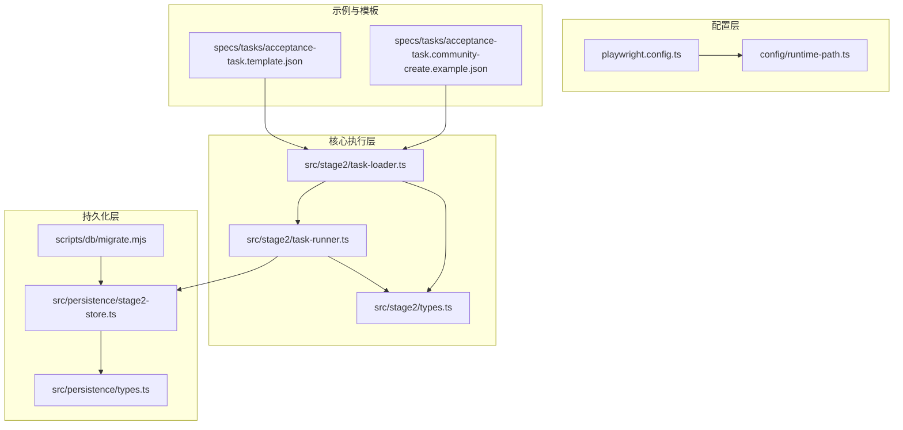
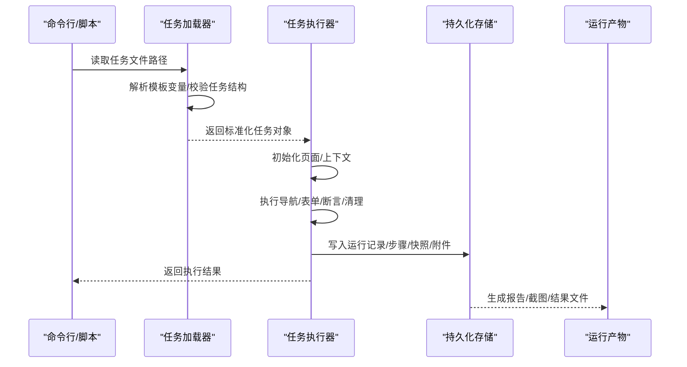
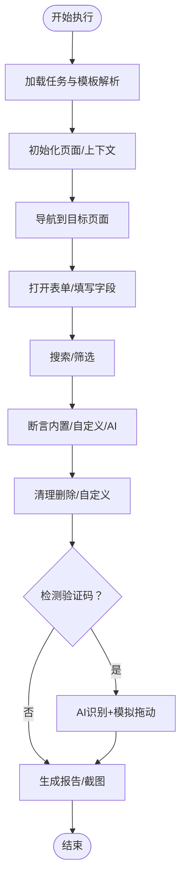
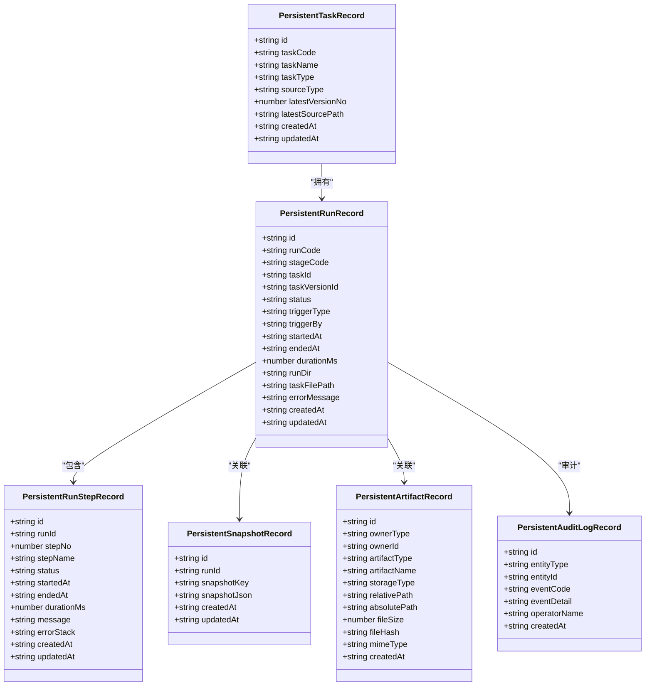
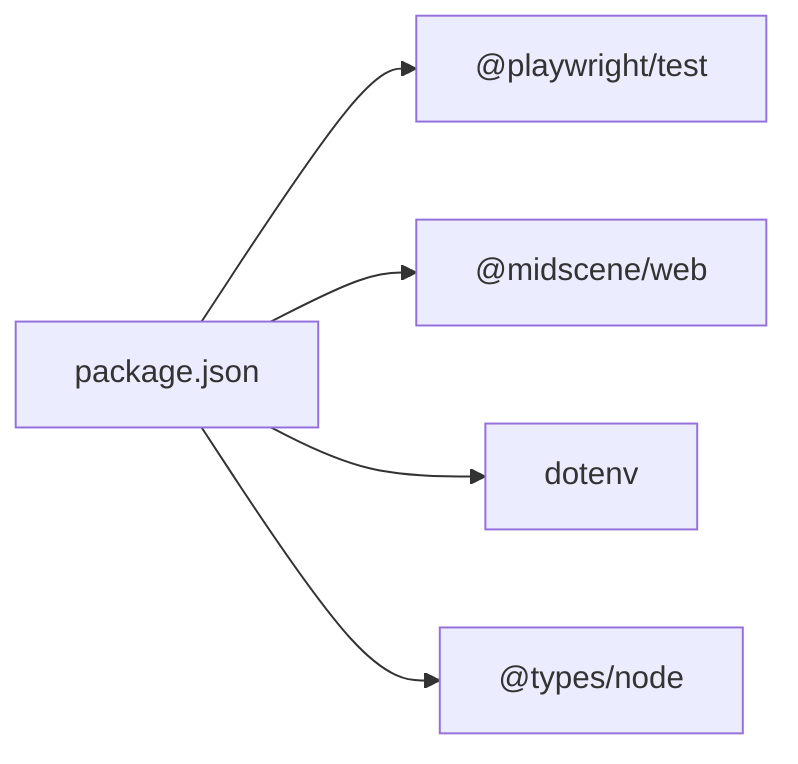

# 扩展开发

<cite>
**本文引用的文件**
- [README.md](file://README.md)
- [package.json](file://package.json)
- [AGENTS.md](file://AGENTS.md)
- [src/stage2/types.ts](file://src/stage2/types.ts)
- [src/stage2/task-runner.ts](file://src/stage2/task-runner.ts)
- [src/stage2/task-loader.ts](file://src/stage2/task-loader.ts)
- [src/persistence/types.ts](file://src/persistence/types.ts)
- [src/persistence/stage2-store.ts](file://src/persistence/stage2-store.ts)
- [config/runtime-path.ts](file://config/runtime-path.ts)
- [playwright.config.ts](file://playwright.config.ts)
- [scripts/db/migrate.mjs](file://scripts/db/migrate.mjs)
- [specs/tasks/acceptance-task.template.json](file://specs/tasks/acceptance-task.template.json)
- [specs/tasks/acceptance-task.community-create.example.json](file://specs/tasks/acceptance-task.community-create.example.json)
</cite>

## 目录
1. [简介](#简介)
2. [项目结构](#项目结构)
3. [核心组件](#核心组件)
4. [架构总览](#架构总览)
5. [详细组件分析](#详细组件分析)
6. [依赖分析](#依赖分析)
7. [性能考虑](#性能考虑)
8. [故障排查指南](#故障排查指南)
9. [结论](#结论)
10. [附录](#附录)

## 简介
本指南面向希望扩展现有自动化测试系统的开发者，围绕以下主题提供系统化的扩展开发方法论与实操建议：
- 如何扩展现有功能、添加新特性与支持自定义断言
- 插件系统设计思路、扩展点识别与自定义组件开发
- 新的任务类型定义与任务 JSON 模型扩展
- AI 模型集成方法与第三方服务集成
- 扩展开发最佳实践、API 设计原则与 backward compatibility 考量
- 贡献代码、提交规范与版本管理策略

本项目基于 Playwright 与 Midscene.js 构建，提供“第二段”JSON 驱动的任务执行器，并内置 SQLite 数据持久化底座与运行产物目录统一管理。

## 项目结构
项目采用按功能域分层的组织方式：
- 核心执行层：第二段任务加载与执行器
- 持久化层：SQLite 数据模型与写库服务
- 配置层：运行产物目录与环境变量解析
- 配置与测试：Playwright 配置与报告
- 示例与模板：任务 JSON 模板与示例

图表来源
- [config/runtime-path.ts:1-41](file://config/runtime-path.ts#L1-L41)
- [playwright.config.ts:1-95](file://playwright.config.ts#L1-L95)
- [src/stage2/task-loader.ts:1-91](file://src/stage2/task-loader.ts#L1-L91)
- [src/stage2/task-runner.ts:1-800](file://src/stage2/task-runner.ts#L1-L800)
- [src/stage2/types.ts:1-180](file://src/stage2/types.ts#L1-L180)
- [src/persistence/types.ts:1-125](file://src/persistence/types.ts#L1-L125)
- [src/persistence/stage2-store.ts:1-655](file://src/persistence/stage2-store.ts#L1-L655)
- [scripts/db/migrate.mjs:1-52](file://scripts/db/migrate.mjs#L1-L52)
- [specs/tasks/acceptance-task.template.json:1-141](file://specs/tasks/acceptance-task.template.json#L1-L141)
- [specs/tasks/acceptance-task.community-create.example.json:1-229](file://specs/tasks/acceptance-task.community-create.example.json#L1-L229)

章节来源
- [README.md:1-223](file://README.md#L1-L223)
- [package.json:1-26](file://package.json#L1-L26)

## 核心组件
- 任务模型与类型定义：统一的任务结构、断言、清理策略等类型，支撑任务 JSON 的强约束与扩展
- 任务加载器：负责解析任务文件、模板变量与校验
- 任务执行器：驱动 Playwright 与 Midscene 能力，执行导航、表单填写、断言与清理
- 持久化存储：将运行记录、步骤、快照与附件写入 SQLite，并提供审计日志
- 运行产物目录：集中管理 Playwright 报告、Midscene 报告、结果与数据库文件

章节来源
- [src/stage2/types.ts:1-180](file://src/stage2/types.ts#L1-L180)
- [src/stage2/task-loader.ts:1-91](file://src/stage2/task-loader.ts#L1-L91)
- [src/stage2/task-runner.ts:1-800](file://src/stage2/task-runner.ts#L1-L800)
- [src/persistence/stage2-store.ts:1-655](file://src/persistence/stage2-store.ts#L1-L655)
- [config/runtime-path.ts:1-41](file://config/runtime-path.ts#L1-L41)

## 架构总览
系统通过“任务 JSON → 加载器 → 执行器 → 持久化”的链路完成端到端执行。执行器内部结合 Playwright 与 Midscene 的 AI 能力，实现智能交互与断言。

图表来源
- [src/stage2/task-loader.ts:79-91](file://src/stage2/task-loader.ts#L79-L91)
- [src/stage2/task-runner.ts:1-800](file://src/stage2/task-runner.ts#L1-L800)
- [src/persistence/stage2-store.ts:69-655](file://src/persistence/stage2-store.ts#L69-L655)

## 详细组件分析

### 任务模型与扩展点
- 任务模型定义了目标站点、账户、导航、UI 配置、表单、搜索、断言、清理、审批与运行时参数等字段
- 断言类型支持多种内置类型，同时提供“自定义”断言描述，便于扩展
- 清理策略支持删除新增、删除全部匹配、自定义 AI 指令等
- UI Profile 提供跨平台选择器优先级列表，便于扩展不同 UI 框架

扩展建议：
- 新增断言类型：在断言类型枚举与执行逻辑中增加分支，或通过“自定义”类型配合描述扩展
- 新增清理动作：在清理动作类型中新增策略，并在执行器中实现对应行为
- 新增 UI 适配：在 UI Profile 中追加选择器优先级，或通过任务级别的覆盖字段

章节来源
- [src/stage2/types.ts:67-126](file://src/stage2/types.ts#L67-L126)
- [src/stage2/types.ts:141-154](file://src/stage2/types.ts#L141-L154)

### 任务加载器与模板解析
- 支持从环境变量解析任务文件路径
- 对任务 JSON 进行形状校验，确保关键字段存在
- 支持模板字符串与环境变量替换，例如时间戳令牌与环境变量注入
- 支持相对路径解析为绝对路径

扩展建议：
- 新增模板令牌：在解析逻辑中增加新的占位符与替换规则
- 新增任务校验规则：在断言形状函数中加入更严格的约束
- 新增任务来源：支持从远程源加载任务并进行缓存与校验

章节来源
- [src/stage2/task-loader.ts:71-91](file://src/stage2/task-loader.ts#L71-L91)

### 任务执行器与 AI 集成
- 执行器封装了 Playwright 与 Midscene 的上下文，提供 AI 操作、查询与断言能力
- 支持滑块验证码自动处理（AI 识别 + Playwright 模拟拖动）
- 支持 UI 适配：通过 UI Profile 与候选选择器提升稳定性
- 支持步骤级截图与超时控制

扩展建议：
- 新增任务步骤：在执行器中新增步骤类型与执行逻辑
- 新增 AI 模型：通过 Midscene 的配置与环境变量接入新模型
- 新增第三方服务：在执行器中注入服务客户端，通过任务 JSON 的扩展字段传递参数

图表来源
- [src/stage2/task-runner.ts:483-706](file://src/stage2/task-runner.ts#L483-L706)

章节来源
- [src/stage2/task-runner.ts:1-800](file://src/stage2/task-runner.ts#L1-L800)

### 持久化存储与数据模型
- 提供统一的数据模型（任务、任务版本、运行、步骤、快照、附件、审计日志）
- 将敏感信息（如密码）在入库前做掩码处理
- 支持运行进度快照、最终结果与附件（截图、报告、结果文件）写库
- 提供迁移脚本与数据库初始化流程

扩展建议：
- 新增实体类型：在数据模型中新增表与字段，并在写库服务中实现 Upsert/Insert
- 新增审计事件：在执行器中插入审计日志，记录关键事件
- 新增附件类型：在附件类型枚举中新增类型，并在写库服务中处理

图表来源
- [src/persistence/types.ts:34-125](file://src/persistence/types.ts#L34-L125)

章节来源
- [src/persistence/types.ts:1-125](file://src/persistence/types.ts#L1-L125)
- [src/persistence/stage2-store.ts:69-655](file://src/persistence/stage2-store.ts#L69-L655)

### 运行产物目录与配置
- 通过环境变量集中管理运行产物目录（Playwright 输出、HTML 报告、Midscene 运行目录、验收结果目录、数据库文件）
- Playwright 配置集中管理 reporter 与输出目录
- 建议新增目录时统一接入环境变量与公共配置模块

扩展建议：
- 新增产物目录：在配置模块中新增常量与解析函数，并在 Playwright 配置中注册
- 新增报告类型：在 reporter 列表中新增自定义 reporter

章节来源
- [config/runtime-path.ts:13-40](file://config/runtime-path.ts#L13-L40)
- [playwright.config.ts:22-95](file://playwright.config.ts#L22-L95)

### 任务 JSON 模板与示例
- 提供完整的任务 JSON 模板与示例，涵盖导航、表单、搜索、断言、清理、审批与运行时参数
- 支持模板变量（如时间戳）与环境变量注入
- 建议扩展时以模板为基准，逐步增加字段与注释

扩展建议：
- 新增字段：在模板中增加字段并在加载器与执行器中实现解析与使用
- 新增断言类型：在模板中新增断言条目并在执行器中实现

章节来源
- [specs/tasks/acceptance-task.template.json:1-141](file://specs/tasks/acceptance-task.template.json#L1-L141)
- [specs/tasks/acceptance-task.community-create.example.json:1-229](file://specs/tasks/acceptance-task.community-create.example.json#L1-L229)

## 依赖分析
- 运行时依赖：Playwright、@midscene/web、dotenv
- 开发依赖：@types/node、@playwright/test
- 数据库：SQLite（通过 node:sqlite）

图表来源
- [package.json:6-25](file://package.json#L6-L25)

章节来源
- [package.json:1-26](file://package.json#L1-L26)

## 性能考虑
- 选择器与可见性检测：优先使用稳定的 Role/Label 选择器，减少模糊匹配
- 截图与报告：按需开启截图与 trace，避免产生大量中间产物
- 超时与重试：合理设置步骤与页面超时，避免长时间阻塞
- 数据库写入：批量写入与幂等 Upsert，减少频繁 IO

## 故障排查指南
- 滑块验证码处理失败：检查检测选择器与 AI 查询提示词，必要时切换为人工模式
- 任务加载失败：检查任务文件路径、模板变量与必填字段
- 持久化写入异常：检查数据库文件路径与权限，确认迁移脚本已执行
- 运行产物缺失：检查环境变量与 Playwright reporter 配置

章节来源
- [src/stage2/task-runner.ts:650-706](file://src/stage2/task-runner.ts#L650-L706)
- [src/stage2/task-loader.ts:79-91](file://src/stage2/task-loader.ts#L79-L91)
- [scripts/db/migrate.mjs:15-51](file://scripts/db/migrate.mjs#L15-L51)

## 结论
通过明确的扩展点与清晰的职责划分，系统可在不破坏 backward compatibility 的前提下平滑演进。建议在扩展时遵循“配置优先、模板先行、类型约束、幂等写库”的原则，确保可维护性与可观测性。

## 附录

### 扩展开发最佳实践
- 配置优先：所有路径与开关统一通过环境变量与公共配置模块管理
- 模板先行：新增任务能力时先完善模板与示例，再实现执行器逻辑
- 类型约束：通过 TypeScript 类型定义约束任务 JSON，减少运行期错误
- 幂等写库：持久化操作应具备幂等性与错误隔离，保证数据一致性
- 可观测性：为关键路径增加日志与审计事件，便于问题定位

章节来源
- [AGENTS.md:22-61](file://AGENTS.md#L22-L61)

### API 设计原则
- 向后兼容：新增字段与类型时保留默认值，避免破坏既有任务
- 明确边界：执行器只处理任务执行，持久化与配置分离
- 可测试性：为关键逻辑提供可注入的依赖与可替换的实现

### 版本管理与贡献规范
- 版本策略：遵循语义化版本，重大变更发布主版本
- 提交规范：使用简明的提交信息，说明变更目的与影响范围
- 文档同步：变更配置、目录或流程时同步更新 README 与规范文件

章节来源
- [README.md:202-223](file://README.md#L202-L223)
- [AGENTS.md:48-61](file://AGENTS.md#L48-L61)