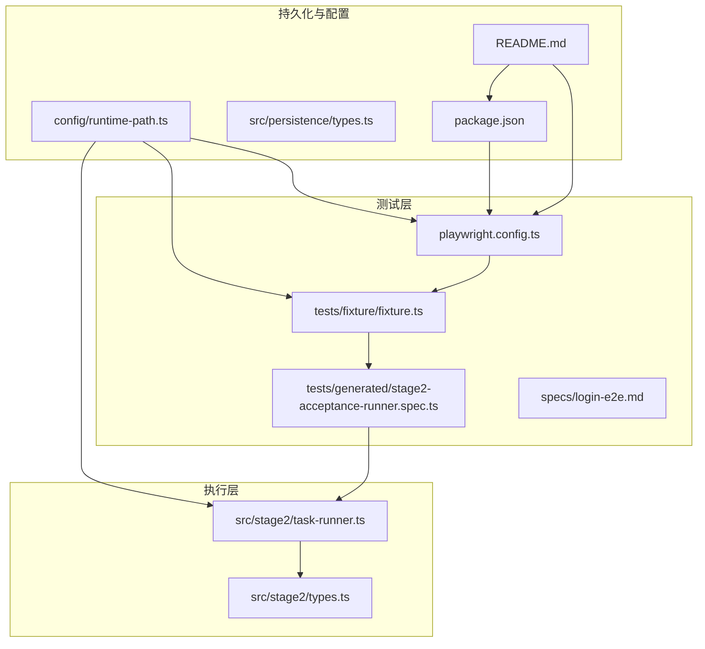
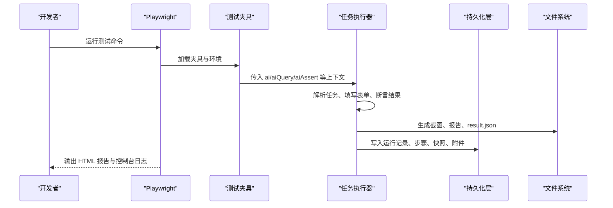
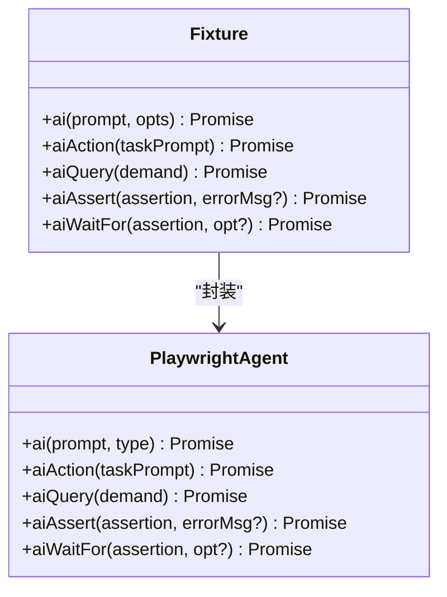
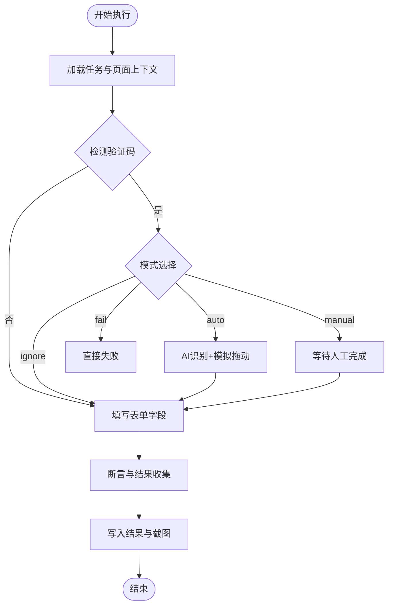
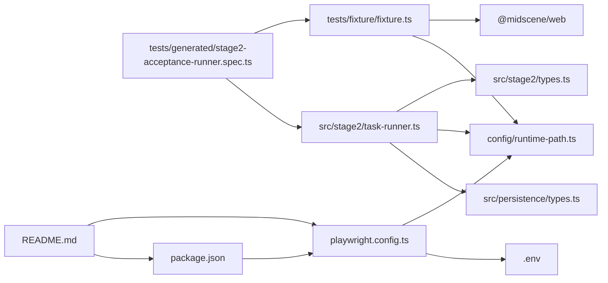

# 调试和测试

<cite>
**本文引用的文件**
- [playwright.config.ts](file://playwright.config.ts)
- [package.json](file://package.json)
- [tests/fixture/fixture.ts](file://tests/fixture/fixture.ts)
- [tests/generated/stage2-acceptance-runner.spec.ts](file://tests/generated/stage2-acceptance-runner.spec.ts)
- [specs/login-e2e.md](file://specs/login-e2e.md)
- [src/stage2/task-runner.ts](file://src/stage2/task-runner.ts)
- [src/stage2/types.ts](file://src/stage2/types.ts)
- [src/persistence/types.ts](file://src/persistence/types.ts)
- [config/runtime-path.ts](file://config/runtime-path.ts)
- [README.md](file://README.md)
</cite>

## 目录
1. [简介](#简介)
2. [项目结构](#项目结构)
3. [核心组件](#核心组件)
4. [架构总览](#架构总览)
5. [详细组件分析](#详细组件分析)
6. [依赖关系分析](#依赖关系分析)
7. [性能考虑](#性能考虑)
8. [故障排查指南](#故障排查指南)
9. [结论](#结论)
10. [附录](#附录)

## 简介
本指南面向使用 Playwright 与 Midscene 的自动化测试团队，覆盖单元测试、集成测试与端到端测试（E2E）的实施策略，提供调试技巧、断点设置、日志分析方法，以及测试夹具配置、测试数据管理、性能测试策略与常见问题排查。项目采用 JSON 驱动的任务执行器，结合 AI 能力实现智能断言与交互，支持滑块验证码自动处理与运行产物统一归档。

## 项目结构
项目围绕 Playwright 测试框架与 Midscene AI 能力构建，测试产物与运行目录通过环境变量集中管理，便于在本地与 CI 环境复用。

**图表来源**
- [playwright.config.ts:1-95](file://playwright.config.ts#L1-L95)
- [tests/fixture/fixture.ts:1-100](file://tests/fixture/fixture.ts#L1-L100)
- [tests/generated/stage2-acceptance-runner.spec.ts:1-39](file://tests/generated/stage2-acceptance-runner.spec.ts#L1-L39)
- [src/stage2/task-runner.ts:1-800](file://src/stage2/task-runner.ts#L1-L800)
- [src/stage2/types.ts:1-180](file://src/stage2/types.ts#L1-L180)
- [config/runtime-path.ts:1-41](file://config/runtime-path.ts#L1-L41)
- [README.md:1-223](file://README.md#L1-L223)
- [package.json:1-26](file://package.json#L1-L26)

**章节来源**
- [playwright.config.ts:1-95](file://playwright.config.ts#L1-L95)
- [config/runtime-path.ts:1-41](file://config/runtime-path.ts#L1-L41)
- [README.md:1-223](file://README.md#L1-L223)

## 核心组件
- Playwright 配置与报告：集中管理输出目录、HTML 报告、追踪与并行策略，支持 CI 与本地差异。
- 测试夹具（Fixture）：封装 Midscene Agent，提供 ai、aiAction、aiQuery、aiAssert、aiWaitFor 等能力，统一日志目录。
- 任务执行器：从 JSON 任务加载并执行，内置滑块验证码自动处理、截图与结果持久化。
- 运行目录与环境变量：通过 .env 与 runtime-path.ts 统一管理 t_runtime/ 下的产物目录。
- E2E 测试计划：提供登录页端到端测试场景与运行说明。

**章节来源**
- [playwright.config.ts:22-48](file://playwright.config.ts#L22-L48)
- [tests/fixture/fixture.ts:10-100](file://tests/fixture/fixture.ts#L10-L100)
- [src/stage2/task-runner.ts:111-130](file://src/stage2/task-runner.ts#L111-L130)
- [config/runtime-path.ts:18-36](file://config/runtime-path.ts#L18-L36)
- [specs/login-e2e.md:1-152](file://specs/login-e2e.md#L1-L152)

## 架构总览
测试体系由“配置—夹具—执行—持久化—产物”构成，AI 能力贯穿断言与交互，运行产物统一归档至 t_runtime/。

**图表来源**
- [playwright.config.ts:36-40](file://playwright.config.ts#L36-L40)
- [tests/fixture/fixture.ts:23-99](file://tests/fixture/fixture.ts#L23-L99)
- [src/stage2/task-runner.ts:111-130](file://src/stage2/task-runner.ts#L111-L130)
- [src/persistence/types.ts:34-113](file://src/persistence/types.ts#L34-L113)
- [README.md:162-189](file://README.md#L162-L189)

## 详细组件分析

### Playwright 配置与运行
- 并行与重试：本地完全并行，CI 仅单 worker 并启用重试，提升稳定性。
- 报告器：list、HTML（可配置输出目录）、第三方报告器组合。
- 追踪：首次重试时开启，便于定位失败原因。
- 项目设备：默认 Chromium，可扩展 Firefox/Webkit/移动设备。
- 本地服务：预留 webServer 配置，便于在测试前启动应用。

**章节来源**
- [playwright.config.ts:22-95](file://playwright.config.ts#L22-L95)
- [README.md:154-164](file://README.md#L154-L164)

### 测试夹具（Fixture）
- 统一日志目录：通过 setLogDir 设置 Midscene 日志输出路径。
- AI 能力封装：ai、aiAction、aiQuery、aiAssert、aiWaitFor，均携带 testId、cacheId、分组信息，便于报告与回溯。
- 缓存 ID 规范化：去除非法字符，保证跨平台一致性。

**图表来源**
- [tests/fixture/fixture.ts:23-99](file://tests/fixture/fixture.ts#L23-L99)

**章节来源**
- [tests/fixture/fixture.ts:10-100](file://tests/fixture/fixture.ts#L10-L100)

### 任务执行器（Stage2）
- 运行目录与截图：按任务 ID 与时间戳创建目录，自动创建 screenshots 子目录。
- 超时与页面等待：支持按步骤与页面级别设置超时。
- 表单与断言：提供字段解析、级联选择器、验证消息收集、断言匹配等能力。
- 滑块验证码处理：支持 auto/manual/fail/ignore 四种模式，自动模式通过 AI 查询位置并模拟拖动轨迹。
- 结果持久化：将运行结果、步骤、截图、报告写入文件系统，并写入数据库（ai_run、ai_run_step、ai_artifact 等）。

**图表来源**
- [src/stage2/task-runner.ts:650-706](file://src/stage2/task-runner.ts#L650-L706)
- [src/stage2/task-runner.ts:111-130](file://src/stage2/task-runner.ts#L111-L130)
- [src/persistence/types.ts:57-89](file://src/persistence/types.ts#L57-L89)

**章节来源**
- [src/stage2/task-runner.ts:111-130](file://src/stage2/task-runner.ts#L111-L130)
- [src/stage2/task-runner.ts:650-706](file://src/stage2/task-runner.ts#L650-L706)
- [src/persistence/types.ts:34-113](file://src/persistence/types.ts#L34-L113)

### 运行目录与产物
- 目录约定：通过 RUNTIME_DIR_PREFIX、PLAYWRIGHT_OUTPUT_DIR、PLAYWRIGHT_HTML_REPORT_DIR、MIDSCENE_RUN_DIR、ACCEPTANCE_RESULT_DIR 统一管理。
- 产物位置：Playwright 报告、Midscene 报告、第二段结果与截图、数据库文件等。
- 初始化：提供 db:init 与 db:migrate 脚本，配合 SQLite 驱动。

**章节来源**
- [config/runtime-path.ts:18-36](file://config/runtime-path.ts#L18-L36)
- [README.md:76-96](file://README.md#L76-L96)
- [README.md:120-131](file://README.md#L120-L131)

### 端到端测试（E2E）示例：登录页
- 测试计划：包含成功登录与密码错误两个场景，强调断言与导航验证。
- 环境变量：BASE_URL、TEST_USERNAME、TEST_PASSWORD、TEST_INVALID_PASSWORD。
- 运行方式：支持单文件运行与全量套件运行，可配置 webServer 以在测试前启动应用。

**章节来源**
- [specs/login-e2e.md:1-152](file://specs/login-e2e.md#L1-L152)

## 依赖关系分析
- 配置依赖：playwright.config.ts 依赖 runtime-path.ts 提供的输出目录；依赖 .env 注入环境变量。
- 夹具依赖：fixture.ts 依赖 @midscene/web 的 PlaywrightAgent 与 setLogDir。
- 执行器依赖：task-runner.ts 依赖 types.ts 的任务模型、runtime-path.ts 的运行目录、persistence/types.ts 的持久化模型。
- 包管理：package.json 提供测试脚本与依赖，包括 @playwright/test、@midscene/web、dotenv。

**图表来源**
- [playwright.config.ts:1-95](file://playwright.config.ts#L1-L95)
- [config/runtime-path.ts:1-41](file://config/runtime-path.ts#L1-L41)
- [tests/fixture/fixture.ts:1-100](file://tests/fixture/fixture.ts#L1-L100)
- [tests/generated/stage2-acceptance-runner.spec.ts:1-39](file://tests/generated/stage2-acceptance-runner.spec.ts#L1-L39)
- [src/stage2/task-runner.ts:1-800](file://src/stage2/task-runner.ts#L1-L800)
- [src/stage2/types.ts:1-180](file://src/stage2/types.ts#L1-L180)
- [src/persistence/types.ts:1-125](file://src/persistence/types.ts#L1-L125)
- [README.md:1-223](file://README.md#L1-L223)
- [package.json:1-26](file://package.json#L1-L26)

**章节来源**
- [playwright.config.ts:1-95](file://playwright.config.ts#L1-L95)
- [tests/fixture/fixture.ts:1-100](file://tests/fixture/fixture.ts#L1-L100)
- [src/stage2/task-runner.ts:1-800](file://src/stage2/task-runner.ts#L1-L800)
- [config/runtime-path.ts:1-41](file://config/runtime-path.ts#L1-L41)
- [README.md:1-223](file://README.md#L1-L223)
- [package.json:1-26](file://package.json#L1-L26)

## 性能考虑
- 并行与重试：本地完全并行，CI 单 worker 并重试，平衡速度与稳定性。
- 超时与等待：合理设置 step/page 超时，避免过长等待；在断言中使用自动重试与软断言降低波动。
- 追踪与报告：仅在首次重试开启 trace，避免无谓开销；HTML 报告便于快速定位失败。
- 滑块处理：auto 模式通过 AI 识别与模拟拖动，减少人工干预；失败时可切换 manual 模式。
- 产物归档：统一目录与命名，便于后续分析与清理。

**章节来源**
- [playwright.config.ts:26-34](file://playwright.config.ts#L26-L34)
- [playwright.config.ts:46-48](file://playwright.config.ts#L46-L48)
- [README.md:64-74](file://README.md#L64-L74)

## 故障排查指南

### 调试技巧与断点设置
- 使用 --headed 与 --slow-mo 运行，观察页面交互细节。
- 在夹具中设置断点，检查 ai/aiQuery/aiAssert 的输入与输出。
- 利用 trace viewer 查看失败步骤的交互序列与页面状态。
- 对于滑块验证码，切换 STAGE2_CAPTCHA_MODE=manual 查看页面样式，必要时调整检测选择器。

**章节来源**
- [specs/login-e2e.md:30-46](file://specs/login-e2e.md#L30-L46)
- [README.md:154-164](file://README.md#L154-L164)
- [src/stage2/task-runner.ts:650-706](file://src/stage2/task-runner.ts#L650-L706)

### 日志分析方法
- Midscene 日志：通过 setLogDir 指定目录，关注 report/dump/tmp/cache 子目录。
- Playwright 报告：HTML 报告包含截图、视频与 trace，便于回放失败步骤。
- 控制台日志：结合断言失败信息与截图路径定位问题。

**章节来源**
- [tests/fixture/fixture.ts:10](file://tests/fixture/fixture.ts#L10)
- [README.md:162-164](file://README.md#L162-L164)

### 测试夹具配置与测试数据管理
- 环境变量：BASE_URL、TEST_USERNAME、TEST_PASSWORD、TEST_INVALID_PASSWORD 等。
- 运行目录：通过 .env 与 runtime-path.ts 统一管理，避免硬编码。
- 任务数据：通过 STAGE2_TASK_FILE 指向 JSON 任务文件，支持多平台 UI Profile 与断言策略。

**章节来源**
- [specs/login-e2e.md:24-28](file://specs/login-e2e.md#L24-L28)
- [config/runtime-path.ts:18-36](file://config/runtime-path.ts#L18-L36)
- [README.md:49-54](file://README.md#L49-L54)

### 常见问题与解决
- 选择器失效：检查页面 DOM 变更，更新选择器或使用 aiQuery 提取结构化数据。
- 验证码阻塞：根据场景调整 CAPTCHA_MODE 与等待时间，必要时人工处理。
- 断言不稳定：使用软断言与自动重试，减少波动；对复杂断言采用 aiQuery + 代码断言。
- 报告缺失：确认 reporter 配置与输出目录权限，确保 HTML 报告生成。

**章节来源**
- [README.md:146-153](file://README.md#L146-L153)
- [src/stage2/task-runner.ts:650-706](file://src/stage2/task-runner.ts#L650-L706)
- [playwright.config.ts:36-40](file://playwright.config.ts#L36-L40)

## 结论
本项目以 Playwright 与 Midscene 为核心，构建了可扩展的测试体系：统一的运行目录、完善的夹具封装、智能断言与交互、滑块验证码自动处理，以及结构化的产物与持久化。通过合理的配置与调试策略，能够高效地完成单元、集成与端到端测试，并在 CI 环境中稳定运行。

## 附录

### 测试类型与实施建议
- 单元测试：针对 task-runner.ts 中的独立函数（如 pickFirstVisibleLocator、tryFillLocator、detectCaptchaChallenge 等）编写小而精的断言，使用模拟页面与夹具上下文。
- 集成测试：以 JSON 任务为输入，验证从表单填写到断言的完整链路，关注截图与报告生成。
- 端到端测试：使用 login-e2e.md 的场景与环境变量，验证真实用户登录流程与错误处理。

**章节来源**
- [specs/login-e2e.md:1-152](file://specs/login-e2e.md#L1-L152)
- [src/stage2/task-runner.ts:165-183](file://src/stage2/task-runner.ts#L165-L183)
- [src/stage2/task-runner.ts:433-451](file://src/stage2/task-runner.ts#L433-L451)
- [src/stage2/task-runner.ts:483-501](file://src/stage2/task-runner.ts#L483-L501)

### 测试脚本与命令
- 运行第二段任务：npm run stage2:run 或 npm run stage2:run:headed
- 运行登录测试：npx playwright test tests/login.spec.ts -c playwright.config.ts
- 初始化数据库：npm run db:init

**章节来源**
- [package.json:6-11](file://package.json#L6-L11)
- [README.md:154-172](file://README.md#L154-L172)