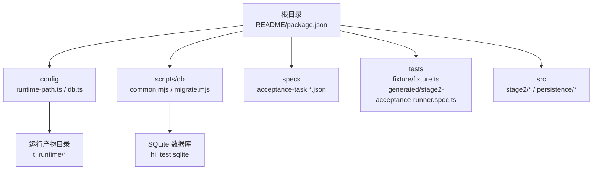
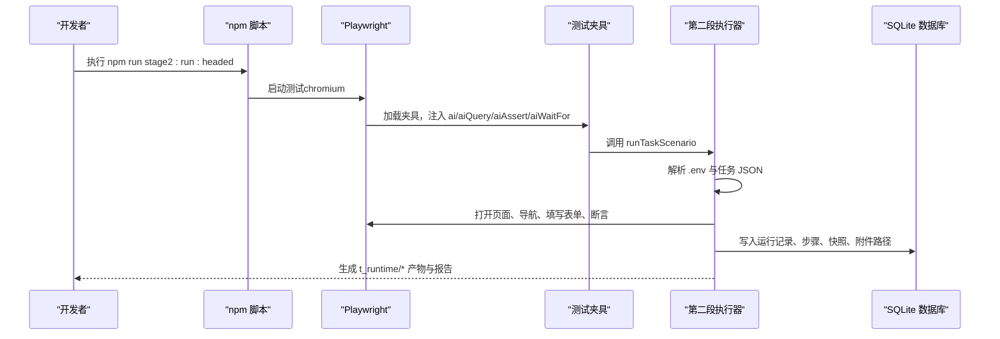
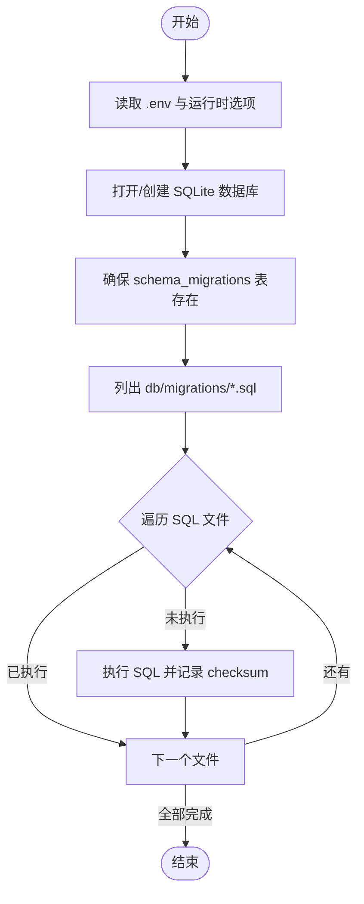
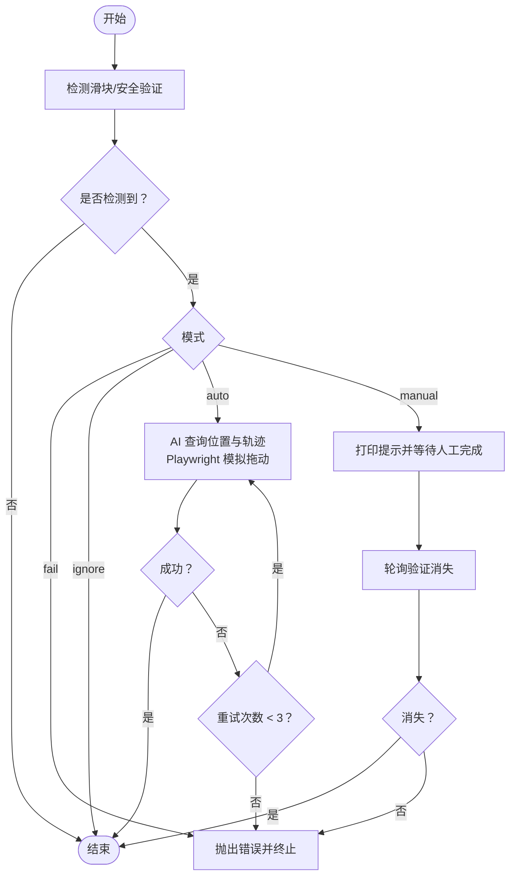
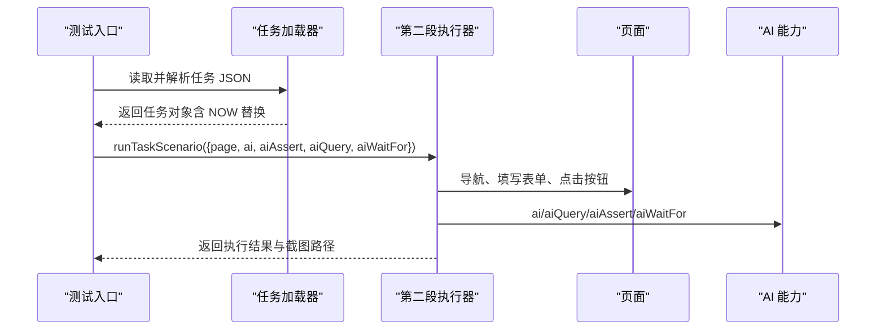
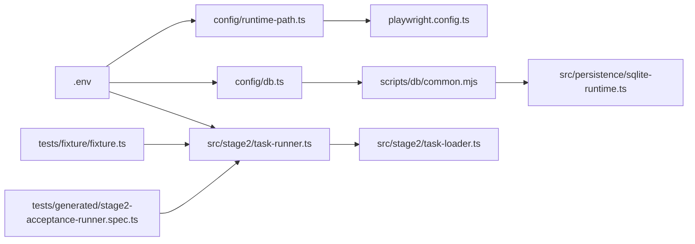

# 快速开始

<cite>
**本文引用的文件**
- [README.md](file://README.md)
- [package.json](file://package.json)
- [playwright.config.ts](file://playwright.config.ts)
- [config/runtime-path.ts](file://config/runtime-path.ts)
- [config/db.ts](file://config/db.ts)
- [scripts/db/common.mjs](file://scripts/db/common.mjs)
- [scripts/db/migrate.mjs](file://scripts/db/migrate.mjs)
- [src/persistence/sqlite-runtime.ts](file://src/persistence/sqlite-runtime.ts)
- [src/stage2/task-runner.ts](file://src/stage2/task-runner.ts)
- [src/stage2/task-loader.ts](file://src/stage2/task-loader.ts)
- [src/stage2/types.ts](file://src/stage2/types.ts)
- [specs/tasks/acceptance-task.community-create.example.json](file://specs/tasks/acceptance-task.community-create.example.json)
- [tests/fixture/fixture.ts](file://tests/fixture/fixture.ts)
- [tests/generated/stage2-acceptance-runner.spec.ts](file://tests/generated/stage2-acceptance-runner.spec.ts)
</cite>

## 目录
1. [简介](#简介)
2. [项目结构](#项目结构)
3. [核心组件](#核心组件)
4. [架构总览](#架构总览)
5. [详细组件解析](#详细组件解析)
6. [依赖关系分析](#依赖关系分析)
7. [性能注意事项](#性能注意事项)
8. [故障排查指南](#故障排查指南)
9. [结论](#结论)
10. [附录](#附录)

## 简介
本指南面向首次接触 HI-TEST 项目的用户，帮助你在最短时间内完成环境准备、依赖安装、浏览器安装、环境变量配置，并成功运行第一个测试案例。项目基于 Playwright 与 Midscene.js 实现 AI 驱动的 Web UI 自动化测试，支持滑块验证码自动处理、结构化断言与结果持久化。

## 项目结构
项目采用“功能分层 + 配置集中”的组织方式：
- 根目录包含安装与运行说明、包管理与脚本、Playwright 配置、数据库迁移脚本与配置等。
- config 目录集中管理运行时目录与数据库配置，统一从 .env 读取。
- scripts/db 提供数据库初始化与迁移脚本。
- specs 存放任务 JSON 示例，tests 存放测试夹具与入口。
- src 包含第二段执行器、持久化层与类型定义。

图表来源
- [README.md:10-130](file://README.md#L10-L130)
- [config/runtime-path.ts:13-36](file://config/runtime-path.ts#L13-L36)
- [config/db.ts:20-26](file://config/db.ts#L20-L26)
- [scripts/db/common.mjs:31-41](file://scripts/db/common.mjs#L31-L41)

章节来源
- [README.md:10-130](file://README.md#L10-L130)
- [package.json:6-11](file://package.json#L6-L11)

## 核心组件
- 运行时目录与环境变量：通过 config/runtime-path.ts 从 .env 读取 RUNTIME_DIR_PREFIX、PLAYWRIGHT_OUTPUT_DIR、PLAYWRIGHT_HTML_REPORT_DIR、MIDSCENE_RUN_DIR、ACCEPTANCE_RESULT_DIR 等，统一收敛到 t_runtime/。
- 数据库配置：config/db.ts 读取 DB_DRIVER 与 DB_FILE_PATH，当前默认 sqlite，数据库文件位于 t_runtime/db/hi_test.sqlite。
- 数据库迁移：scripts/db/common.mjs 与 scripts/db/migrate.mjs 提供迁移表创建、SQL 文件扫描、逐个应用与校验。
- 第二段执行器：src/stage2/task-runner.ts 负责加载任务 JSON、执行步骤、处理滑块验证码、截图与结果写入、持久化运行记录。
- 测试夹具：tests/fixture/fixture.ts 注入 ai/aiQuery/aiAssert/aiWaitFor 等 AI 能力，并设置 Midscene 日志目录。
- 测试入口：tests/generated/stage2-acceptance-runner.spec.ts 调用 runTaskScenario 执行任务并断言结果。

章节来源
- [config/runtime-path.ts:8-36](file://config/runtime-path.ts#L8-L36)
- [config/db.ts:10-26](file://config/db.ts#L10-L26)
- [scripts/db/common.mjs:12-41](file://scripts/db/common.mjs#L12-L41)
- [scripts/db/migrate.mjs:15-51](file://scripts/db/migrate.mjs#L15-L51)
- [src/stage2/task-runner.ts:61-87](file://src/stage2/task-runner.ts#L61-L87)
- [tests/fixture/fixture.ts:10-100](file://tests/fixture/fixture.ts#L10-L100)
- [tests/generated/stage2-acceptance-runner.spec.ts:12-38](file://tests/generated/stage2-acceptance-runner.spec.ts#L12-L38)

## 架构总览
下图展示从命令行到浏览器、AI 能力与数据库写入的整体流程。

图表来源
- [package.json:9-10](file://package.json#L9-L10)
- [playwright.config.ts:22-40](file://playwright.config.ts#L22-L40)
- [tests/fixture/fixture.ts:23-99](file://tests/fixture/fixture.ts#L23-L99)
- [src/stage2/task-runner.ts:111-120](file://src/stage2/task-runner.ts#L111-L120)
- [src/persistence/sqlite-runtime.ts:73-84](file://src/persistence/sqlite-runtime.ts#L73-L84)

## 详细组件解析

### 环境要求与安装步骤
- Node.js 版本：项目使用 Node 生态与 Playwright，建议使用长期支持版本（LTS）。
- 浏览器依赖：首次运行前需安装 Playwright 浏览器内核。
- 依赖安装：使用 npm install 安装项目依赖。
- .env 配置：复制示例并按需修改 OPENAI_*、MIDSCENE_*、数据库与运行目录等参数。
- 初始化数据库：执行 npm run db:init 或 npm run db:migrate 完成迁移。

章节来源
- [README.md:10-30](file://README.md#L10-L30)
- [README.md:120-130](file://README.md#L120-L130)
- [package.json:6-11](file://package.json#L6-L11)

### .env 关键参数说明
- AI 模型与接口
  - OPENAI_API_KEY：AI 接口密钥
  - OPENAI_BASE_URL：AI 接口地址
  - MIDSCENE_MODEL_NAME：使用的模型名称
- 运行目录
  - RUNTIME_DIR_PREFIX：统一运行产物前缀（默认 t_runtime/）
  - PLAYWRIGHT_OUTPUT_DIR：Playwright 执行产物目录
  - PLAYWRIGHT_HTML_REPORT_DIR：HTML 报告目录
  - MIDSCENE_RUN_DIR：Midscene 运行日志/缓存/报告根目录
  - ACCEPTANCE_RESULT_DIR：第二段结构化结果目录
- 数据库
  - DB_DRIVER：数据库驱动（当前仅支持 sqlite）
  - DB_FILE_PATH：数据库文件路径（默认 t_runtime/db/hi_test.sqlite）
- 任务执行
  - STAGE2_TASK_FILE：默认任务 JSON 文件路径
  - STAGE2_REQUIRE_APPROVAL：是否需要审批（布尔）
  - STAGE2_CAPTCHA_MODE：滑块验证码处理模式（auto/manual/fail/ignore）
  - STAGE2_CAPTCHA_WAIT_TIMEOUT_MS：人工处理等待超时（毫秒）

章节来源
- [README.md:39-54](file://README.md#L39-L54)
- [README.md:56-62](file://README.md#L56-L62)
- [config/runtime-path.ts:13-36](file://config/runtime-path.ts#L13-L36)
- [config/db.ts:20-26](file://config/db.ts#L20-L26)
- [src/stage2/task-runner.ts:61-87](file://src/stage2/task-runner.ts#L61-L87)

### 数据库初始化与迁移
- 初始化：npm run db:init 创建迁移表并应用所有未执行的迁移。
- 迁移：npm run db:migrate 与 migrate.mjs 逻辑一致，逐个执行 SQL 文件并记录 checksum。
- SQLite 运行：openPersistenceDatabase 在启用外键约束的同时确保数据库文件存在。

图表来源
- [scripts/db/migrate.mjs:15-51](file://scripts/db/migrate.mjs#L15-L51)
- [src/persistence/sqlite-runtime.ts:43-114](file://src/persistence/sqlite-runtime.ts#L43-L114)
- [scripts/db/common.mjs:31-41](file://scripts/db/common.mjs#L31-L41)

章节来源
- [scripts/db/migrate.mjs:15-51](file://scripts/db/migrate.mjs#L15-L51)
- [src/persistence/sqlite-runtime.ts:73-84](file://src/persistence/sqlite-runtime.ts#L73-L84)

### 滑块验证码自动处理
- 检测：通过文本关键词与选择器组合检测滑块/安全验证。
- 自动处理：AI 查询滑块位置与滑槽宽度，Playwright 模拟真人拖动轨迹（15 步、easeOut、随机抖动），最多重试 3 次。
- 人工兜底：若自动失败或配置为 manual，则等待人工完成并在超时时间内轮询验证消失。

图表来源
- [src/stage2/task-runner.ts:483-501](file://src/stage2/task-runner.ts#L483-L501)
- [src/stage2/task-runner.ts:561-648](file://src/stage2/task-runner.ts#L561-L648)
- [src/stage2/task-runner.ts:650-706](file://src/stage2/task-runner.ts#L650-L706)

章节来源
- [README.md:64-75](file://README.md#L64-L75)
- [src/stage2/task-runner.ts:61-87](file://src/stage2/task-runner.ts#L61-L87)

### 任务 JSON 与执行入口
- 任务 JSON：specs/tasks/acceptance-task.community-create.example.json 描述目标页面、账户、表单字段、断言与清理策略。
- 执行入口：tests/generated/stage2-acceptance-runner.spec.ts 通过夹具注入 AI 能力，调用 runTaskScenario 执行任务。
- 任务加载：src/stage2/task-loader.ts 支持 ${NOW_YYYYMMDDHHMMSS} 模板替换与环境变量替换。

图表来源
- [specs/tasks/acceptance-task.community-create.example.json:1-229](file://specs/tasks/acceptance-task.community-create.example.json#L1-L229)
- [tests/generated/stage2-acceptance-runner.spec.ts:12-38](file://tests/generated/stage2-acceptance-runner.spec.ts#L12-L38)
- [src/stage2/task-loader.ts:8-31](file://src/stage2/task-loader.ts#L8-L31)
- [src/stage2/task-runner.ts:111-120](file://src/stage2/task-runner.ts#L111-L120)

章节来源
- [specs/tasks/acceptance-task.community-create.example.json:1-229](file://specs/tasks/acceptance-task.community-create.example.json#L1-L229)
- [tests/generated/stage2-acceptance-runner.spec.ts:12-38](file://tests/generated/stage2-acceptance-runner.spec.ts#L12-L38)
- [src/stage2/task-loader.ts:8-31](file://src/stage2/task-loader.ts#L8-L31)

## 依赖关系分析
- 配置集中化：config/runtime-path.ts 与 config/db.ts 统一从 .env 读取，避免散落硬编码。
- 运行时目录：playwright.config.ts 使用 runtime-path.ts 中的输出目录与报告目录。
- 数据库：scripts/db/common.mjs 与 src/persistence/sqlite-runtime.ts 共同保证迁移与运行时数据库一致性。
- 执行链路：tests/fixture/fixture.ts 注入 AI 能力，tests/generated/stage2-acceptance-runner.spec.ts 调用 src/stage2/task-runner.ts 执行任务。

图表来源
- [config/runtime-path.ts:8-36](file://config/runtime-path.ts#L8-L36)
- [config/db.ts:10-26](file://config/db.ts#L10-L26)
- [playwright.config.ts:22-40](file://playwright.config.ts#L22-L40)
- [scripts/db/common.mjs:31-41](file://scripts/db/common.mjs#L31-L41)
- [src/persistence/sqlite-runtime.ts:73-84](file://src/persistence/sqlite-runtime.ts#L73-L84)
- [src/stage2/task-runner.ts:61-87](file://src/stage2/task-runner.ts#L61-L87)
- [src/stage2/task-loader.ts:8-31](file://src/stage2/task-loader.ts#L8-L31)
- [tests/fixture/fixture.ts:23-99](file://tests/fixture/fixture.ts#L23-L99)
- [tests/generated/stage2-acceptance-runner.spec.ts:12-38](file://tests/generated/stage2-acceptance-runner.spec.ts#L12-L38)

章节来源
- [config/runtime-path.ts:8-36](file://config/runtime-path.ts#L8-L36)
- [config/db.ts:10-26](file://config/db.ts#L10-L26)
- [playwright.config.ts:22-40](file://playwright.config.ts#L22-L40)
- [scripts/db/common.mjs:31-41](file://scripts/db/common.mjs#L31-L41)
- [src/persistence/sqlite-runtime.ts:73-84](file://src/persistence/sqlite-runtime.ts#L73-L84)
- [src/stage2/task-runner.ts:61-87](file://src/stage2/task-runner.ts#L61-L87)
- [src/stage2/task-loader.ts:8-31](file://src/stage2/task-loader.ts#L8-L31)
- [tests/fixture/fixture.ts:23-99](file://tests/fixture/fixture.ts#L23-L99)
- [tests/generated/stage2-acceptance-runner.spec.ts:12-38](file://tests/generated/stage2-acceptance-runner.spec.ts#L12-L38)

## 性能注意事项
- 并行与超时：Playwright 配置了并行与重试策略，合理设置任务超时与页面超时可提升稳定性。
- 截图与报告：开启截图与 Midscene 报告有助于定位问题，但会增加磁盘 IO，建议在调试阶段开启。
- 数据库写入：迁移与运行记录写入 SQLite 时启用外键约束，避免脏数据；批量写入时注意事务边界。

## 故障排查指南
- 无法找到 .env 或变量未生效
  - 确认 .env 文件位于项目根目录，且被 dotenv 正确加载。
  - 检查 config/runtime-path.ts 与 config/db.ts 是否正确读取变量。
- 浏览器未安装
  - 执行 npx playwright install 安装所需浏览器内核。
- 数据库初始化失败
  - 确认 DB_DRIVER 为 sqlite，DB_FILE_PATH 路径可写。
  - 使用 npm run db:init 或 npm run db:migrate，观察控制台输出的迁移状态。
- 滑块验证码导致失败
  - 若为 auto 模式，检查 AI 对滑块位置与轨迹的识别；必要时切换为 manual 并增大等待时间。
  - 若为 fail 模式，遇到验证码将直接失败。
- 任务执行报错
  - 查看 t_runtime/acceptance-results 下的 result.json 与截图，定位失败步骤。
  - 使用 --headed 模式便于观察页面交互。

章节来源
- [playwright.config.ts:8-9](file://playwright.config.ts#L8-L9)
- [README.md:25-29](file://README.md#L25-L29)
- [README.md:120-130](file://README.md#L120-L130)
- [src/stage2/task-runner.ts:650-706](file://src/stage2/task-runner.ts#L650-L706)
- [tests/generated/stage2-acceptance-runner.spec.ts:27-36](file://tests/generated/stage2-acceptance-runner.spec.ts#L27-L36)

## 结论
通过本指南，你已完成环境准备、依赖安装、浏览器安装与 .env 配置，并成功运行了第一个第二段任务案例。建议在正式环境中：
- 将 .env 参数纳入版本管理（如 .env.example），并按团队规范维护。
- 使用 headless 模式进行 CI/CD，结合报告与数据库持久化进行回归分析。
- 针对不同平台补充 uiProfile 的选择器优先级，提升跨平台兼容性。

## 附录

### 快速开始清单
- 克隆仓库并安装依赖
- 安装浏览器内核
- 配置 .env（AI、运行目录、数据库、任务文件）
- 初始化数据库
- 运行测试入口（headed 模式便于调试）
- 查看报告与结果

章节来源
- [README.md:10-130](file://README.md#L10-L130)
- [package.json:6-11](file://package.json#L6-L11)
- [tests/generated/stage2-acceptance-runner.spec.ts:12-38](file://tests/generated/stage2-acceptance-runner.spec.ts#L12-L38)