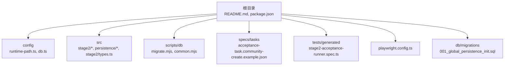
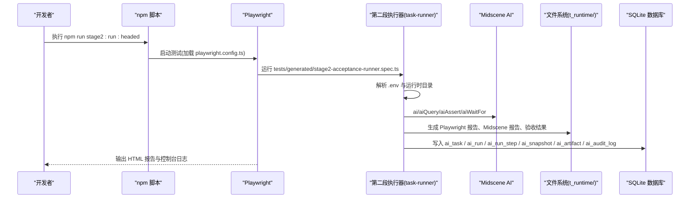
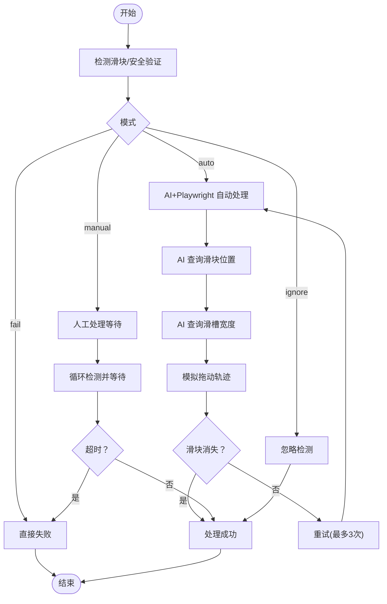
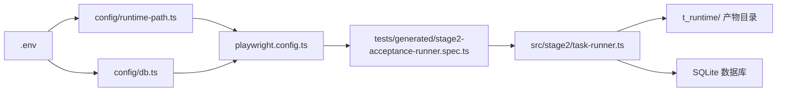

# 快速开始

<cite>
**本文引用的文件**
- [README.md](file://README.md)
- [package.json](file://package.json)
- [playwright.config.ts](file://playwright.config.ts)
- [config/runtime-path.ts](file://config/runtime-path.ts)
- [config/db.ts](file://config/db.ts)
- [src/stage2/task-runner.ts](file://src/stage2/task-runner.ts)
- [src/stage2/types.ts](file://src/stage2/types.ts)
- [src/persistence/sqlite-runtime.ts](file://src/persistence/sqlite-runtime.ts)
- [scripts/db/migrate.mjs](file://scripts/db/migrate.mjs)
- [db/migrations/001_global_persistence_init.sql](file://db/migrations/001_global_persistence_init.sql)
- [specs/tasks/acceptance-task.community-create.example.json](file://specs/tasks/acceptance-task.community-create.example.json)
- [tests/generated/stage2-acceptance-runner.spec.ts](file://tests/generated/stage2-acceptance-runner.spec.ts)
- [AGENTS.md](file://AGENTS.md)
</cite>

## 目录
1. [简介](#简介)
2. [项目结构](#项目结构)
3. [核心组件](#核心组件)
4. [架构总览](#架构总览)
5. [详细组件解析](#详细组件解析)
6. [依赖关系分析](#依赖关系分析)
7. [性能与运行特性](#性能与运行特性)
8. [故障排查指南](#故障排查指南)
9. [结论](#结论)
10. [附录](#附录)

## 简介
本指南面向首次接触 HI-TEST 项目的开发者，帮助你在本地快速完成环境准备、依赖安装、浏览器驱动安装、环境变量配置，并成功运行第一个测试任务（第二段执行器）。你将学会：
- 如何克隆仓库并安装 Node.js 依赖
- 如何安装 Playwright 浏览器驱动
- 如何配置 .env 环境变量（API 密钥、模型、运行目录等）
- 如何初始化数据库
- 如何运行第二段任务并查看结果
- 常见初始化问题与解决方案

## 项目结构
项目采用“功能分层 + 配置集中”的组织方式：
- 根目录包含 README、package.json、Playwright 配置、任务示例与测试入口
- config 子目录集中管理运行时目录与数据库路径
- src 子目录包含第二段执行器、持久化层与类型定义
- scripts/db 提供数据库迁移与初始化脚本
- specs/tasks 提供可直接运行的任务 JSON 示例
- tests/generated 提供 Playwright 测试入口

图表来源
- [README.md:1-223](file://README.md#L1-L223)
- [package.json:1-26](file://package.json#L1-L26)
- [playwright.config.ts:1-95](file://playwright.config.ts#L1-L95)
- [config/runtime-path.ts:1-41](file://config/runtime-path.ts#L1-L41)
- [config/db.ts:1-28](file://config/db.ts#L1-L28)
- [src/stage2/types.ts:1-180](file://src/stage2/types.ts#L1-L180)
- [src/persistence/sqlite-runtime.ts:1-116](file://src/persistence/sqlite-runtime.ts#L1-L116)
- [scripts/db/migrate.mjs:1-52](file://scripts/db/migrate.mjs#L1-L52)
- [db/migrations/001_global_persistence_init.sql:1-128](file://db/migrations/001_global_persistence_init.sql#L1-L128)
- [specs/tasks/acceptance-task.community-create.example.json:1-229](file://specs/tasks/acceptance-task.community-create.example.json#L1-L229)
- [tests/generated/stage2-acceptance-runner.spec.ts:1-39](file://tests/generated/stage2-acceptance-runner.spec.ts#L1-L39)

章节来源
- [README.md:10-223](file://README.md#L10-L223)
- [package.json:1-26](file://package.json#L1-L26)
- [playwright.config.ts:1-95](file://playwright.config.ts#L1-L95)

## 核心组件
- 运行时目录与环境变量：通过 config/runtime-path.ts 与 .env 统一管理 t_runtime/ 下的产物目录（Playwright 输出、HTML 报告、Midscene 运行日志、验收结果、数据库文件等）
- 数据库与迁移：通过 config/db.ts 读取 DB_DRIVER 与 DB_FILE_PATH，使用 scripts/db/migrate.mjs 执行 db/migrations/* 中的 SQL
- 第二段执行器：src/stage2/task-runner.ts 读取任务 JSON，结合 Midscene AI 能力与 Playwright 执行，产出验收结果与数据库记录
- 测试入口：tests/generated/stage2-acceptance-runner.spec.ts 作为 Playwright 测试入口，调用第二段执行器
- 任务示例：specs/tasks/acceptance-task.community-create.example.json 提供可直接运行的验收任务

章节来源
- [config/runtime-path.ts:1-41](file://config/runtime-path.ts#L1-L41)
- [config/db.ts:1-28](file://config/db.ts#L1-L28)
- [src/stage2/task-runner.ts:1-800](file://src/stage2/task-runner.ts#L1-L800)
- [tests/generated/stage2-acceptance-runner.spec.ts:1-39](file://tests/generated/stage2-acceptance-runner.spec.ts#L1-L39)
- [specs/tasks/acceptance-task.community-create.example.json:1-229](file://specs/tasks/acceptance-task.community-create.example.json#L1-L229)

## 架构总览
下图展示了从命令行到最终产物与数据库写入的整体流程。

图表来源
- [package.json:6-11](file://package.json#L6-L11)
- [playwright.config.ts:1-95](file://playwright.config.ts#L1-L95)
- [tests/generated/stage2-acceptance-runner.spec.ts:1-39](file://tests/generated/stage2-acceptance-runner.spec.ts#L1-L39)
- [src/stage2/task-runner.ts:1-800](file://src/stage2/task-runner.ts#L1-L800)
- [src/persistence/sqlite-runtime.ts:73-114](file://src/persistence/sqlite-runtime.ts#L73-L114)
- [db/migrations/001_global_persistence_init.sql:1-128](file://db/migrations/001_global_persistence_init.sql#L1-L128)

## 详细组件解析

### 环境准备与依赖安装
- 克隆仓库
  - 使用 Git 克隆项目到本地
- 安装 Node.js 依赖
  - 在项目根目录执行安装命令
- 安装浏览器驱动
  - 使用 Playwright 安装所需浏览器驱动

章节来源
- [README.md:12-29](file://README.md#L12-L29)
- [package.json:1-26](file://package.json#L1-L26)

### 浏览器驱动安装
- 使用 npx playwright install 安装浏览器驱动
- 该步骤会在首次运行 Playwright 测试前完成

章节来源
- [README.md:25-29](file://README.md#L25-L29)

### .env 环境变量配置
- 关键变量说明
  - OPENAI_API_KEY：AI 模型密钥
  - OPENAI_BASE_URL：模型服务地址
  - MIDSCENE_MODEL_NAME：使用的模型名称
  - RUNTIME_DIR_PREFIX：运行产物根目录前缀（默认 t_runtime/）
  - PLAYWRIGHT_OUTPUT_DIR：Playwright 执行产物目录
  - PLAYWRIGHT_HTML_REPORT_DIR：Playwright HTML 报告目录
  - MIDSCENE_RUN_DIR：Midscene 运行日志、缓存、报告根目录
  - ACCEPTANCE_RESULT_DIR：第二段结构化结果目录（包含 result.json、步骤截图）
  - DB_DRIVER：数据库驱动（当前默认 sqlite）
  - DB_FILE_PATH：SQLite 文件路径
  - STAGE2_TASK_FILE：第二段任务 JSON 文件路径
  - STAGE2_REQUIRE_APPROVAL：是否需要审批（布尔）
  - STAGE2_CAPTCHA_MODE：滑块验证码处理模式（auto/manual/fail/ignore）
  - STAGE2_CAPTCHA_WAIT_TIMEOUT_MS：人工处理等待超时（毫秒）

- 模式说明
  - auto：AI 自动处理滑块验证码
  - manual：检测到验证码后等待人工完成
  - fail：检测到验证码即失败
  - ignore：忽略验证码检测（不建议）

章节来源
- [README.md:31-62](file://README.md#L31-L62)
- [README.md:64-75](file://README.md#L64-L75)
- [config/runtime-path.ts:13-36](file://config/runtime-path.ts#L13-L36)
- [config/db.ts:20-26](file://config/db.ts#L20-L26)

### 数据库初始化与迁移
- 初始化数据库
  - 执行 npm run db:init 或 npm run db:migrate
- 迁移脚本
  - scripts/db/migrate.mjs 会扫描 db/migrations 下的 SQL 文件并执行
- 表结构
  - ai_task、ai_task_version、ai_run、ai_run_step、ai_snapshot、ai_artifact、ai_audit_log

章节来源
- [README.md:120-130](file://README.md#L120-L130)
- [scripts/db/migrate.mjs:1-52](file://scripts/db/migrate.mjs#L1-52)
- [db/migrations/001_global_persistence_init.sql:1-128](file://db/migrations/001_global_persistence_init.sql#L1-L128)
- [src/persistence/sqlite-runtime.ts:73-114](file://src/persistence/sqlite-runtime.ts#L73-L114)

### 运行第二段任务（JSON 驱动）
- 运行入口
  - tests/generated/stage2-acceptance-runner.spec.ts
- 执行器
  - src/stage2/task-runner.ts 读取任务 JSON，执行导航、表单填写、断言与清理
- 产物目录
  - Playwright 报告：t_runtime/playwright-report/
  - Midscene 报告：t_runtime/midscene_run/report/
  - 第二段结果：t_runtime/acceptance-results/<taskId>/<timestamp>/result.json
  - 步骤截图：t_runtime/acceptance-results/<taskId>/<timestamp>/screenshots/

章节来源
- [README.md:132-190](file://README.md#L132-L190)
- [tests/generated/stage2-acceptance-runner.spec.ts:1-39](file://tests/generated/stage2-acceptance-runner.spec.ts#L1-L39)
- [src/stage2/task-runner.ts:1-800](file://src/stage2/task-runner.ts#L1-L800)

### 任务 JSON 结构与字段
- 任务结构概览
  - target：目标 URL、浏览器、headless
  - account：用户名、密码、登录提示
  - navigation：首页就绪文本、菜单路径、菜单提示
  - uiProfile：表格行选择器、Toast 选择器、弹窗选择器
  - form：打开按钮、弹窗标题、提交/关闭按钮、成功提示、字段列表
  - search：搜索输入、关键字来源字段、触发/重置按钮、结果表标题、期望列、分页
  - assertions：断言列表（toast/table-row-exists/table-cell-equals/table-cell-contains 等）
  - cleanup：清理策略（启用、策略、匹配字段、动作、匹配模式、清理后校验等）
  - runtime：步骤超时、页面超时、每步截图、开启 trace
  - approval：审批状态

章节来源
- [src/stage2/types.ts:1-180](file://src/stage2/types.ts#L1-L180)
- [specs/tasks/acceptance-task.community-create.example.json:1-229](file://specs/tasks/acceptance-task.community-create.example.json#L1-L229)

### 滑块验证码自动处理流程
- 检测逻辑
  - 文本关键词与选择器模式检测
- 自动处理
  - AI 查询滑块位置与滑槽宽度
  - Playwright 模拟拖动轨迹（先快后慢、带抖动）
  - 最多重试 3 次
- 人工兜底
  - manual 模式下等待指定超时，超时则失败

图表来源
- [src/stage2/task-runner.ts:483-706](file://src/stage2/task-runner.ts#L483-L706)

## 依赖关系分析
- 配置集中化
  - config/runtime-path.ts 与 config/db.ts 从 .env 读取变量，统一管理运行时目录与数据库路径
- 测试配置
  - playwright.config.ts 加载 .env 并配置 Playwright 输出目录、报告器与项目设备
- 执行链路
  - tests/generated/stage2-acceptance-runner.spec.ts -> src/stage2/task-runner.ts -> Midscene AI + Playwright -> 产物目录与数据库

图表来源
- [config/runtime-path.ts:1-41](file://config/runtime-path.ts#L1-L41)
- [config/db.ts:1-28](file://config/db.ts#L1-L28)
- [playwright.config.ts:1-95](file://playwright.config.ts#L1-L95)
- [tests/generated/stage2-acceptance-runner.spec.ts:1-39](file://tests/generated/stage2-acceptance-runner.spec.ts#L1-L39)
- [src/stage2/task-runner.ts:1-800](file://src/stage2/task-runner.ts#L1-L800)

章节来源
- [config/runtime-path.ts:1-41](file://config/runtime-path.ts#L1-L41)
- [config/db.ts:1-28](file://config/db.ts#L1-L28)
- [playwright.config.ts:1-95](file://playwright.config.ts#L1-L95)
- [tests/generated/stage2-acceptance-runner.spec.ts:1-39](file://tests/generated/stage2-acceptance-runner.spec.ts#L1-L39)
- [src/stage2/task-runner.ts:1-800](file://src/stage2/task-runner.ts#L1-L800)

## 性能与运行特性
- 并行与重试
  - Playwright 配置启用完全并行与 CI 环境下的重试策略
- 超时与重试断言
  - 第二段执行器支持步骤与页面超时、断言重试
- 产物与日志
  - 统一收敛到 t_runtime/，便于归档与 CI 上传

章节来源
- [playwright.config.ts:25-34](file://playwright.config.ts#L25-L34)
- [src/stage2/task-runner.ts:122-129](file://src/stage2/task-runner.ts#L122-L129)
- [README.md:76-96](file://README.md#L76-L96)

## 故障排查指南
- 无法安装浏览器驱动
  - 确认网络可达，重新执行安装命令
- 任务执行失败
  - 查看 t_runtime/acceptance-results/<taskId>/<timestamp>/result.json 与截图
  - 检查 .env 中 STAGE2_CAPTCHA_MODE 与 STAGE2_CAPTCHA_WAIT_TIMEOUT_MS 设置
- 数据库未初始化
  - 执行 npm run db:init 或 npm run db:migrate
- 产物目录不生效
  - 检查 RUNTIME_DIR_PREFIX 与各目录变量是否正确
- 模型密钥无效
  - 确认 OPENAI_API_KEY 与 OPENAI_BASE_URL 配置正确

章节来源
- [README.md:154-190](file://README.md#L154-L190)
- [README.md:120-130](file://README.md#L120-L130)
- [config/runtime-path.ts:13-36](file://config/runtime-path.ts#L13-L36)
- [config/db.ts:20-26](file://config/db.ts#L20-L26)

## 结论
通过本指南，你已经完成了环境准备、依赖安装、浏览器驱动安装、.env 配置、数据库初始化，并成功运行了第一个第二段任务。建议在首次运行后，对照 t_runtime/ 下的产物与数据库记录，进一步熟悉配置与执行流程。

## 附录

### 命令行清单与预期输出
- 克隆与安装
  - git clone 仓库地址
  - cd 项目目录
  - npm install
  - npx playwright install
- 初始化数据库
  - npm run db:init
  - npm run db:migrate
- 运行第二段任务
  - npm run stage2:run:headed
- 查看结果
  - Playwright HTML 报告：t_runtime/playwright-report/
  - Midscene 报告：t_runtime/midscene_run/report/
  - 第二段结果：t_runtime/acceptance-results/<taskId>/<timestamp>/result.json
  - 步骤截图：t_runtime/acceptance-results/<taskId>/<timestamp>/screenshots/

章节来源
- [README.md:12-29](file://README.md#L12-L29)
- [README.md:120-130](file://README.md#L120-L130)
- [README.md:154-190](file://README.md#L154-L190)
- [package.json:6-11](file://package.json#L6-L11)