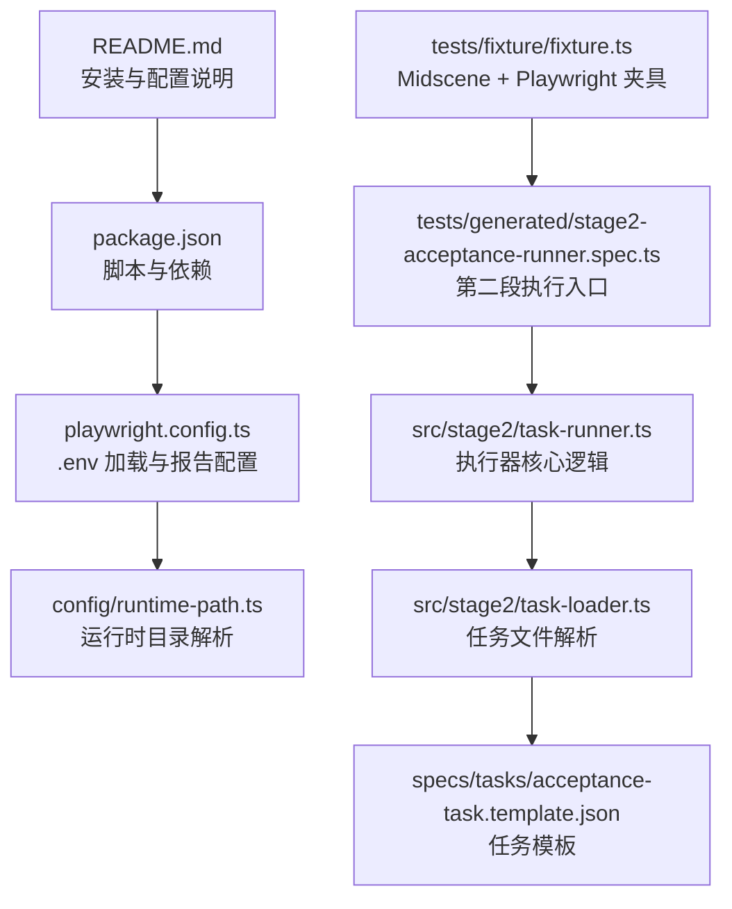
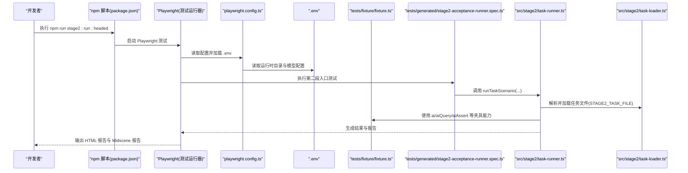
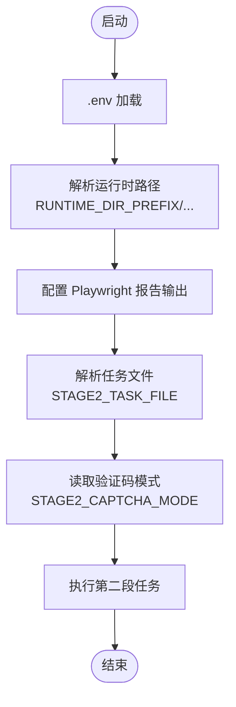
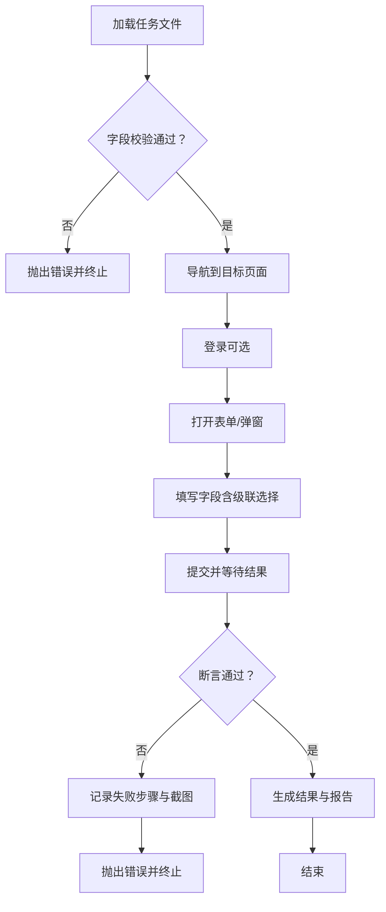
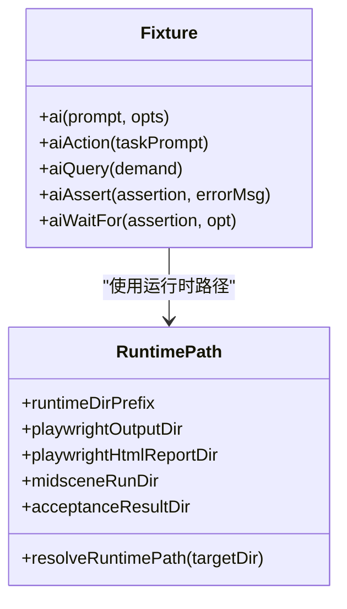
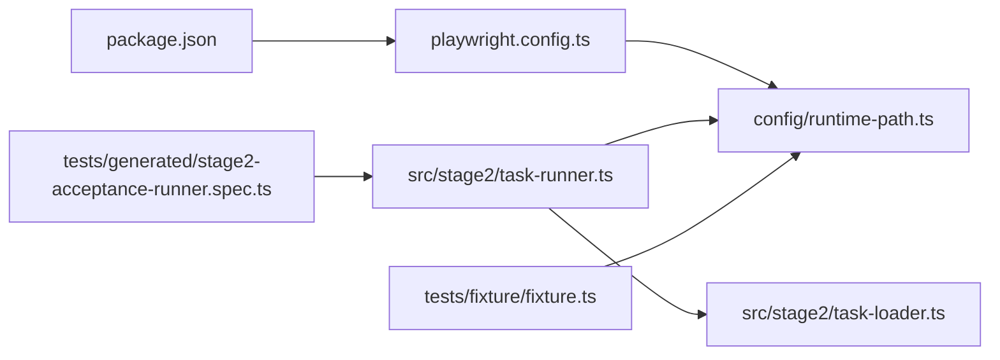

# 快速开始

<cite>
**本文引用的文件**
- [README.md](file://README.md)
- [package.json](file://package.json)
- [playwright.config.ts](file://playwright.config.ts)
- [config/runtime-path.ts](file://config/runtime-path.ts)
- [specs/tasks/acceptance-task.template.json](file://specs/tasks/acceptance-task.template.json)
- [tests/generated/stage2-acceptance-runner.spec.ts](file://tests/generated/stage2-acceptance-runner.spec.ts)
- [tests/fixture/fixture.ts](file://tests/fixture/fixture.ts)
- [src/stage2/task-runner.ts](file://src/stage2/task-runner.ts)
- [src/stage2/types.ts](file://src/stage2/types.ts)
- [src/stage2/task-loader.ts](file://src/stage2/task-loader.ts)
- [specs/basic-operations.md](file://specs/basic-operations.md)
- [specs/login-e2e.md](file://specs/login-e2e.md)
- [AGENTS.md](file://AGENTS.md)
</cite>

## 目录
1. [简介](#简介)
2. [项目结构](#项目结构)
3. [核心组件](#核心组件)
4. [架构总览](#架构总览)
5. [详细组件分析](#详细组件分析)
6. [依赖关系分析](#依赖关系分析)
7. [性能注意事项](#性能注意事项)
8. [故障排查指南](#故障排查指南)
9. [结论](#结论)
10. [附录](#附录)

## 简介
本指南面向首次接触 HI-TEST 项目的用户，帮助你在约 15 分钟内完成环境准备、项目克隆、依赖安装与浏览器安装，并成功运行第一个测试案例。文档重点覆盖：
- 环境准备与安装步骤
- .env 环境变量配置（OpenAI API 密钥、模型、运行时路径等）
- 基本测试运行命令与参数说明
- 常见初始化问题与验证步骤
- 实际命令行示例与预期输出指引

## 项目结构
该项目采用“测试 + 夹具 + 执行器”的分层组织方式，核心目录与文件职责如下：
- config/runtime-path.ts：集中解析运行时目录与路径，统一由 .env 控制
- playwright.config.ts：Playwright 测试配置，加载 .env 并配置报告输出
- tests/fixture/fixture.ts：Midscene + Playwright 公共夹具，提供 ai、aiQuery、aiAssert 等能力
- tests/generated/stage2-acceptance-runner.spec.ts：第二段执行入口，读取 JSON 任务并驱动自动化
- src/stage2/task-runner.ts：第二段执行器核心逻辑（任务执行、滑块验证码处理、截图与报告）
- src/stage2/task-loader.ts：任务文件解析与模板变量替换
- specs/tasks/acceptance-task.template.json：任务 JSON 模板，定义目标页面、账号、表单、断言等
- package.json：脚本与依赖定义（包含 stage2 运行脚本）

**图表来源**
- [README.md](file://README.md#L10-L123)
- [package.json](file://package.json#L6-L8)
- [playwright.config.ts](file://playwright.config.ts#L1-L95)
- [config/runtime-path.ts](file://config/runtime-path.ts#L1-L41)
- [tests/fixture/fixture.ts](file://tests/fixture/fixture.ts#L1-L100)
- [tests/generated/stage2-acceptance-runner.spec.ts](file://tests/generated/stage2-acceptance-runner.spec.ts#L1-L39)
- [src/stage2/task-runner.ts](file://src/stage2/task-runner.ts#L1-L120)
- [src/stage2/task-loader.ts](file://src/stage2/task-loader.ts#L1-L91)
- [specs/tasks/acceptance-task.template.json](file://specs/tasks/acceptance-task.template.json#L1-L85)

**章节来源**
- [README.md](file://README.md#L10-L123)
- [package.json](file://package.json#L6-L8)
- [playwright.config.ts](file://playwright.config.ts#L1-L95)
- [config/runtime-path.ts](file://config/runtime-path.ts#L1-L41)
- [tests/fixture/fixture.ts](file://tests/fixture/fixture.ts#L1-L100)
- [tests/generated/stage2-acceptance-runner.spec.ts](file://tests/generated/stage2-acceptance-runner.spec.ts#L1-L39)
- [src/stage2/task-runner.ts](file://src/stage2/task-runner.ts#L1-L120)
- [src/stage2/task-loader.ts](file://src/stage2/task-loader.ts#L1-L91)
- [specs/tasks/acceptance-task.template.json](file://specs/tasks/acceptance-task.template.json#L1-L85)

## 核心组件
- 运行时路径解析：通过 config/runtime-path.ts 从 .env 读取 RUNTIME_DIR_PREFIX，并派生 PLAYWRIGHT_OUTPUT_DIR、PLAYWRIGHT_HTML_REPORT_DIR、MIDSCENE_RUN_DIR、ACCEPTANCE_RESULT_DIR 等目录
- Playwright 配置：playwright.config.ts 加载 .env，设置输出目录、报告器、并行策略等
- 夹具（fixture）：tests/fixture/fixture.ts 提供 ai、aiQuery、aiAssert、aiWaitFor 等 AI 能力，统一 Midscene 日志目录
- 第二段执行入口：tests/generated/stage2-acceptance-runner.spec.ts 调用 src/stage2/task-runner.ts 执行 JSON 任务
- 任务加载与模板替换：src/stage2/task-loader.ts 解析 STAGE2_TASK_FILE，支持 ${ENV_VAR} 与 NOW_YYYYMMDDHHMMSS 占位符
- 任务模型：src/stage2/types.ts 定义 AcceptanceTask 结构，涵盖目标、账号、导航、表单、搜索、断言、清理、运行时等字段

**章节来源**
- [config/runtime-path.ts](file://config/runtime-path.ts#L1-L41)
- [playwright.config.ts](file://playwright.config.ts#L1-L95)
- [tests/fixture/fixture.ts](file://tests/fixture/fixture.ts#L1-L100)
- [tests/generated/stage2-acceptance-runner.spec.ts](file://tests/generated/stage2-acceptance-runner.spec.ts#L1-L39)
- [src/stage2/task-runner.ts](file://src/stage2/task-runner.ts#L1-L120)
- [src/stage2/task-loader.ts](file://src/stage2/task-loader.ts#L1-L91)
- [src/stage2/types.ts](file://src/stage2/types.ts#L1-L125)

## 架构总览
下面的序列图展示了从运行命令到生成报告的完整流程，映射到实际源码文件：

**图表来源**
- [package.json](file://package.json#L6-L8)
- [playwright.config.ts](file://playwright.config.ts#L1-L95)
- [tests/generated/stage2-acceptance-runner.spec.ts](file://tests/generated/stage2-acceptance-runner.spec.ts#L1-L39)
- [src/stage2/task-runner.ts](file://src/stage2/task-runner.ts#L1-L120)
- [src/stage2/task-loader.ts](file://src/stage2/task-loader.ts#L1-L91)
- [tests/fixture/fixture.ts](file://tests/fixture/fixture.ts#L1-L100)

## 详细组件分析

### 环境变量与 .env 配置
- 必填项
  - OPENAI_API_KEY：AI 推理所需的密钥
  - OPENAI_BASE_URL：模型兼容接口地址（如阿里百炼）
  - MIDSCENE_MODEL_NAME：模型名称（如 qwen3-vl-plus）
- 运行时路径（统一由 .env 管理，收敛到 t_runtime/）
  - RUNTIME_DIR_PREFIX：运行产物根目录前缀
  - PLAYWRIGHT_OUTPUT_DIR：Playwright 执行产物目录
  - PLAYWRIGHT_HTML_REPORT_DIR：HTML 报告目录
  - MIDSCENE_RUN_DIR：Midscene 运行日志/缓存/报告根目录
  - ACCEPTANCE_RESULT_DIR：第二段结构化结果目录
- 任务与执行控制
  - STAGE2_TASK_FILE：默认指向社区创建示例任务文件
  - STAGE2_REQUIRE_APPROVAL：是否需要审批（布尔）
  - STAGE2_CAPTCHA_MODE：滑块验证码处理模式（auto/manual/fail/ignore）
  - STAGE2_CAPTCHA_WAIT_TIMEOUT_MS：人工处理等待超时（毫秒）

**图表来源**
- [README.md](file://README.md#L31-L52)
- [config/runtime-path.ts](file://config/runtime-path.ts#L1-L41)
- [playwright.config.ts](file://playwright.config.ts#L1-L95)
- [src/stage2/task-loader.ts](file://src/stage2/task-loader.ts#L71-L77)
- [src/stage2/task-runner.ts](file://src/stage2/task-runner.ts#L58-L84)

**章节来源**
- [README.md](file://README.md#L31-L52)
- [config/runtime-path.ts](file://config/runtime-path.ts#L1-L41)
- [playwright.config.ts](file://playwright.config.ts#L1-L95)
- [src/stage2/task-loader.ts](file://src/stage2/task-loader.ts#L71-L77)
- [src/stage2/task-runner.ts](file://src/stage2/task-runner.ts#L58-L84)

### 第二段执行器（JSON 驱动）
- 任务加载：从 STAGE2_TASK_FILE 读取 JSON，替换模板变量（${ENV_VAR}、NOW_YYYYMMDDHHMMSS），并校验必填字段
- 执行流程：导航、登录、打开表单、填写字段、提交、断言、截图与报告
- 滑块验证码处理：支持 auto/manual/fail/ignore 四种模式，auto 模式下通过 AI 查询滑块位置与滑槽宽度，再用 Playwright 模拟真人拖动轨迹
- 结果输出：生成 acceptance-results/<taskId>/<timestamp>/result.json、partial.json 与 screenshots/

**图表来源**
- [src/stage2/task-loader.ts](file://src/stage2/task-loader.ts#L79-L89)
- [src/stage2/task-runner.ts](file://src/stage2/task-runner.ts#L1-L120)
- [src/stage2/task-runner.ts](file://src/stage2/task-runner.ts#L558-L703)
- [tests/generated/stage2-acceptance-runner.spec.ts](file://tests/generated/stage2-acceptance-runner.spec.ts#L12-L37)

**章节来源**
- [src/stage2/task-loader.ts](file://src/stage2/task-loader.ts#L79-L89)
- [src/stage2/task-runner.ts](file://src/stage2/task-runner.ts#L1-L120)
- [src/stage2/task-runner.ts](file://src/stage2/task-runner.ts#L558-L703)
- [tests/generated/stage2-acceptance-runner.spec.ts](file://tests/generated/stage2-acceptance-runner.spec.ts#L12-L37)

### 夹具（AI 能力封装）
- 提供 ai、aiAction、aiQuery、aiAssert、aiWaitFor 等方法，统一 Midscene 日志目录与缓存标识
- 为每个测试用例生成唯一的 cacheId，避免并发冲突
- 通过 setLogDir 将 Midscene 日志写入 config/runtime-path.ts 解析出的 midsceneRunDir

**图表来源**
- [tests/fixture/fixture.ts](file://tests/fixture/fixture.ts#L23-L99)
- [config/runtime-path.ts](file://config/runtime-path.ts#L1-L41)

**章节来源**
- [tests/fixture/fixture.ts](file://tests/fixture/fixture.ts#L1-L100)
- [config/runtime-path.ts](file://config/runtime-path.ts#L1-L41)

### 任务 JSON 模型与模板
- AcceptanceTask 定义了任务的完整结构：目标页面、账号、导航、表单、搜索、断言、清理、运行时等
- acceptance-task.template.json 提供可直接使用的模板，包含占位符与注释，便于快速填充
- 支持 ${TEST_USERNAME}、${TEST_PASSWORD} 等环境变量注入，以及 NOW_YYYYMMDDHHMMSS 时间戳注入

**章节来源**
- [src/stage2/types.ts](file://src/stage2/types.ts#L86-L98)
- [specs/tasks/acceptance-task.template.json](file://specs/tasks/acceptance-task.template.json#L1-L85)
- [src/stage2/task-loader.ts](file://src/stage2/task-loader.ts#L19-L48)

## 依赖关系分析
- package.json 定义了两个 stage2 运行脚本：无头与有头模式
- playwright.config.ts 依赖 dotenv 读取 .env，并将运行时目录传递给运行时路径模块
- 第二段执行入口 tests/generated/stage2-acceptance-runner.spec.ts 依赖 task-runner.ts 与夹具 fixture.ts
- task-runner.ts 依赖 task-loader.ts 与 config/runtime-path.ts

**图表来源**
- [package.json](file://package.json#L6-L8)
- [playwright.config.ts](file://playwright.config.ts#L1-L95)
- [config/runtime-path.ts](file://config/runtime-path.ts#L1-L41)
- [tests/generated/stage2-acceptance-runner.spec.ts](file://tests/generated/stage2-acceptance-runner.spec.ts#L1-L39)
- [src/stage2/task-runner.ts](file://src/stage2/task-runner.ts#L1-L120)
- [src/stage2/task-loader.ts](file://src/stage2/task-loader.ts#L1-L91)
- [tests/fixture/fixture.ts](file://tests/fixture/fixture.ts#L1-L100)

**章节来源**
- [package.json](file://package.json#L6-L8)
- [playwright.config.ts](file://playwright.config.ts#L1-L95)
- [config/runtime-path.ts](file://config/runtime-path.ts#L1-L41)
- [tests/generated/stage2-acceptance-runner.spec.ts](file://tests/generated/stage2-acceptance-runner.spec.ts#L1-L39)
- [src/stage2/task-runner.ts](file://src/stage2/task-runner.ts#L1-L120)
- [src/stage2/task-loader.ts](file://src/stage2/task-loader.ts#L1-L91)
- [tests/fixture/fixture.ts](file://tests/fixture/fixture.ts#L1-L100)

## 性能注意事项
- 并行与重试：playwright.config.ts 默认启用完全并行与 CI 下重试，有助于提升整体吞吐
- 超时设置：任务与页面超时可按需调整，避免过短导致误判
- 截图与追踪：开启每步截图与追踪会增加 IO，建议在调试阶段使用，生产执行可按需关闭
- 滑块自动处理：auto 模式会进行多次尝试与截图分析，建议在稳定的网络与页面环境下使用

[本节为通用指导，无需特定文件引用]

## 故障排查指南
- 无法加载 .env 或路径不生效
  - 确认 .env 文件位于项目根目录，且键名与 README.md 描述一致
  - 查看 playwright.config.ts 是否正确加载 dotenv
  - 使用 config/runtime-path.ts 的 resolveRuntimePath 辅助定位最终绝对路径
- 任务文件找不到或字段缺失
  - 检查 STAGE2_TASK_FILE 指向的路径是否存在
  - 确认任务 JSON 包含 taskId、taskName、target.url、account.username/password、form.openButtonText/form.submitButtonText、form.fields 等必填字段
- 滑块验证码导致执行中断
  - 如需人工处理，将 STAGE2_CAPTCHA_MODE 设为 manual，并适当增大 STAGE2_CAPTCHA_WAIT_TIMEOUT_MS
  - 如需自动处理，确保页面截图可被 Midscene 正确识别，必要时调整检测选择器
- 报告与产物目录不符合预期
  - 统一通过 .env 的 RUNTIME_DIR_PREFIX 与各子目录变量控制，避免硬编码
  - 参考 AGENTS.md 的目录规范与日志规范

**章节来源**
- [playwright.config.ts](file://playwright.config.ts#L1-L95)
- [config/runtime-path.ts](file://config/runtime-path.ts#L1-L41)
- [src/stage2/task-loader.ts](file://src/stage2/task-loader.ts#L50-L69)
- [src/stage2/task-runner.ts](file://src/stage2/task-runner.ts#L58-L84)
- [AGENTS.md](file://AGENTS.md#L22-L46)

## 结论
按照本指南完成环境准备与 .env 配置后，你可以在 15 分钟内成功运行第一个第二段任务案例。建议先以有头模式执行，便于观察页面交互与滑块处理效果；完成后可切换为无头模式提升效率。

[本节为总结性内容，无需特定文件引用]

## 附录

### 快速开始步骤与命令
- 克隆项目
  - git clone <项目地址>
- 安装依赖
  - cd <项目目录>
  - npm install
- 安装浏览器
  - npx playwright install
- 配置 .env
  - 参考 README.md 的 .env 示例，填写 OPENAI_API_KEY、OPENAI_BASE_URL、MIDSCENE_MODEL_NAME、RUNTIME_DIR_PREFIX 等
- 运行测试
  - 有头模式：npm run stage2:run:headed
  - 无头模式：npm run stage2:run
- 查看结果
  - Playwright HTML 报告：t_runtime/playwright-report/
  - Midscene 报告：t_runtime/midscene_run/report/
  - 第二段结果：t_runtime/acceptance-results/<taskId>/<timestamp>/

**章节来源**
- [README.md](file://README.md#L12-L123)
- [package.json](file://package.json#L6-L8)
- [playwright.config.ts](file://playwright.config.ts#L1-L95)

### 常用命令与参数说明
- npm run stage2:run
  - 以无头模式运行第二段任务
- npm run stage2:run:headed
  - 以有头模式运行第二段任务
- Playwright CLI（可选）
  - npx playwright test --headed tests/generated/stage2-acceptance-runner.spec.ts
- 参数说明
  - --headed：以可视化模式运行，便于调试
  - --project=chromium：指定浏览器设备

**章节来源**
- [package.json](file://package.json#L6-L8)
- [README.md](file://README.md#L106-L110)

### 验证步骤
- 确认 .env 已正确加载并解析到运行时目录
- 确认 npx playwright install 已成功安装浏览器
- 确认任务文件存在且字段完整
- 确认执行后生成 t_runtime/ 下的报告与结果目录
- 如遇滑块验证码，按需调整 STAGE2_CAPTCHA_MODE 与等待时间

**章节来源**
- [README.md](file://README.md#L74-L116)
- [src/stage2/task-loader.ts](file://src/stage2/task-loader.ts#L71-L77)
- [src/stage2/task-runner.ts](file://src/stage2/task-runner.ts#L647-L703)