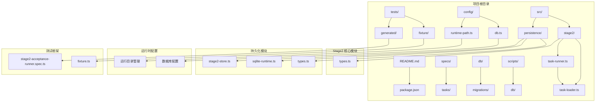
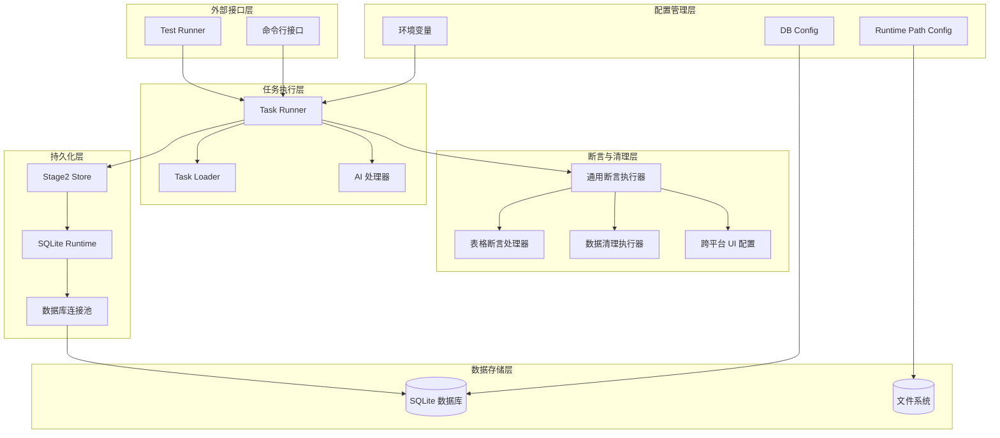
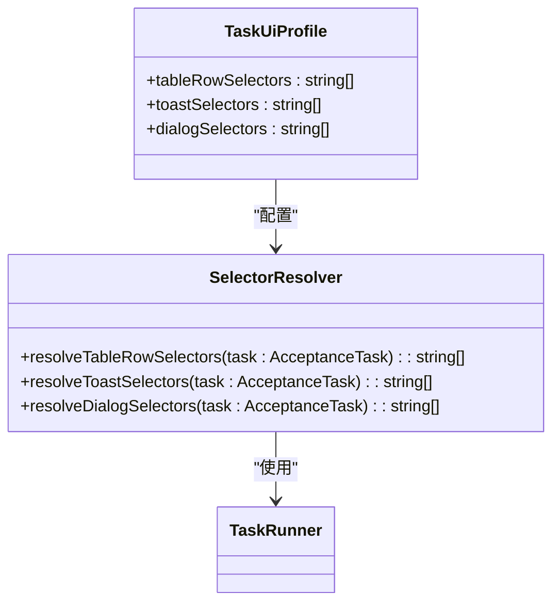
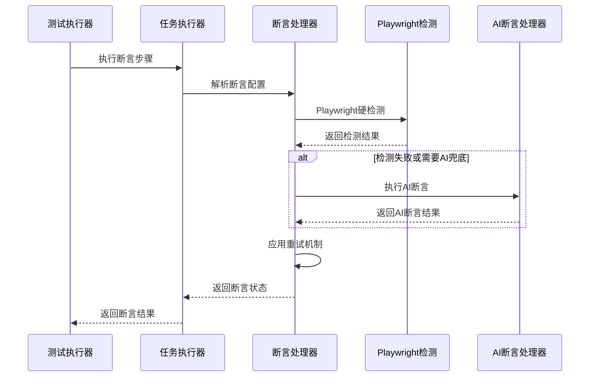
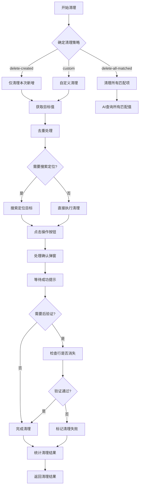
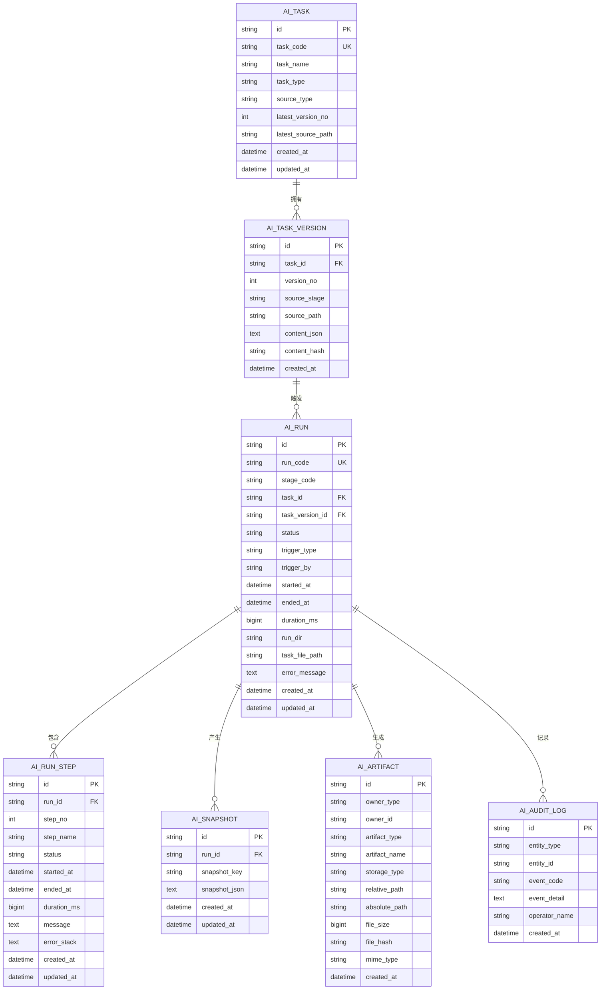
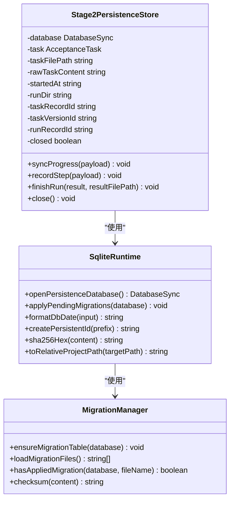
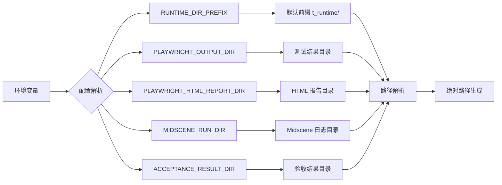
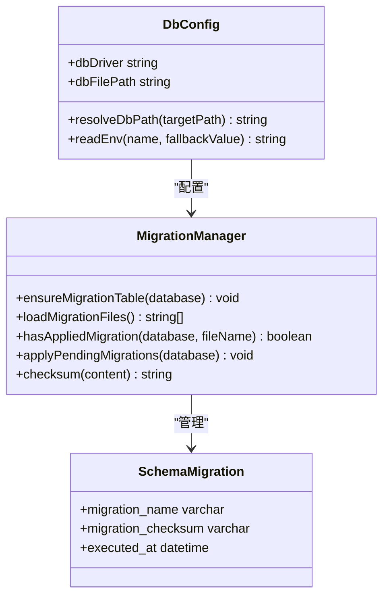
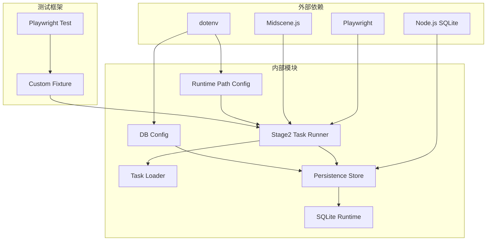

# Stage2 执行引擎增强

<cite>
**本文档引用的文件**
- [README.md](file://README.md)
- [package.json](file://package.json)
- [src/stage2/task-runner.ts](file://src/stage2/task-runner.ts)
- [src/stage2/task-loader.ts](file://src/stage2/task-loader.ts)
- [src/stage2/types.ts](file://src/stage2/types.ts)
- [src/persistence/stage2-store.ts](file://src/persistence/stage2-store.ts)
- [src/persistence/sqlite-runtime.ts](file://src/persistence/sqlite-runtime.ts)
- [src/persistence/types.ts](file://src/persistence/types.ts)
- [config/runtime-path.ts](file://config/runtime-path.ts)
- [config/db.ts](file://config/db.ts)
- [db/migrations/001_global_persistence_init.sql](file://db/migrations/001_global_persistence_init.sql)
- [tests/generated/stage2-acceptance-runner.spec.ts](file://tests/generated/stage2-acceptance-runner.spec.ts)
- [tests/fixture/fixture.ts](file://tests/fixture/fixture.ts)
- [specs/tasks/acceptance-task.template.json](file://specs/tasks/acceptance-task.template.json)
- [scripts/db/migrate.mjs](file://scripts/db/migrate.mjs)
- [.tasks/stage2跨平台通用断言与清理优化实现_2026-03-12.md](file://.tasks/stage2跨平台通用断言与清理优化实现_2026-03-12.md)
</cite>

## 更新摘要
**变更内容**
- 新增跨平台通用 UI 配置支持（TaskUiProfile）
- 增强断言类型与匹配模式（matchMode、expectedColumnFromFields）
- 优化数据清理策略与验证机制
- 改进表格断言的结构化比对与错误诊断
- 增强清理操作的精确匹配与后验证机制

## 目录
1. [简介](#简介)
2. [项目结构](#项目结构)
3. [核心组件](#核心组件)
4. [架构概览](#架构概览)
5. [详细组件分析](#详细组件分析)
6. [依赖关系分析](#依赖关系分析)
7. [性能考虑](#性能考虑)
8. [故障排除指南](#故障排除指南)
9. [结论](#结论)

## 简介

Stage2 执行引擎增强项目是一个基于 Playwright 和 Midscene.js 的 AI 自动化测试系统。该项目专注于第二阶段的验收测试执行，通过 JSON 任务驱动的方式实现跨平台的 UI 自动化测试。

**更新** 项目现已实现跨平台断言与清理优化，新增通用 UI 配置、断言类型增强、清理策略改进等技术细节，显著提升了多平台场景下的断言稳定性与数据清理安全性。

项目的主要特点包括：
- 基于 JSON 任务的声明式测试执行
- 集成 AI 能力进行智能 UI 操作和断言
- 全局数据持久化底座，支持 SQLite 和 MySQL 兼容
- 滑块验证码自动处理机制
- **新增** 跨平台通用配置支持（TaskUiProfile）
- **新增** 增强的断言类型与匹配模式
- **新增** 优化的数据清理策略与验证机制
- 完整的测试结果追踪和报告生成

## 项目结构

**图表来源**
- [package.json](file://package.json#L1-L26)
- [src/stage2/task-runner.ts](file://src/stage2/task-runner.ts#L1-L50)
- [src/persistence/stage2-store.ts](file://src/persistence/stage2-store.ts#L1-L50)

**章节来源**
- [README.md](file://README.md#L1-L223)
- [package.json](file://package.json#L1-L26)

## 核心组件

### 任务执行器 (Task Runner)

任务执行器是 Stage2 的核心组件，负责解析 JSON 任务并执行相应的 UI 操作。主要功能包括：

- **滑块验证码处理**：自动检测和处理各种类型的滑块验证码
- **表单填充**：支持多种组件类型的智能表单填充
- **断言执行**：执行硬检测和 AI 断言，支持多种断言类型
- **清理操作**：自动清理测试产生的数据，支持精确匹配与后验证
- **错误处理**：完善的异常捕获和错误恢复机制

**更新** 新增跨平台通用 UI 配置支持，断言类型扩展为 toast、table-row-exists、table-cell-equals、table-cell-contains、custom 等多种类型。

### 任务加载器 (Task Loader)

任务加载器负责从 JSON 文件加载和解析测试任务，提供模板变量替换和任务结构验证功能。

### 持久化存储 (Stage2 Persistence Store)

新的持久化存储模块提供了完整的数据持久化能力，支持以下功能：

- **任务记录管理**：跟踪任务的创建和版本历史
- **运行记录跟踪**：记录每次执行的状态和结果
- **步骤详细记录**：详细记录每个执行步骤的状态
- **快照数据存储**：存储中间结果和调试信息
- **附件管理**：管理截图、报告等文件附件

**章节来源**
- [src/stage2/task-runner.ts](file://src/stage2/task-runner.ts#L1-L100)
- [src/stage2/task-loader.ts](file://src/stage2/task-loader.ts#L1-L91)
- [src/persistence/stage2-store.ts](file://src/persistence/stage2-store.ts#L1-L100)

## 架构概览

**图表来源**
- [src/stage2/task-runner.ts](file://src/stage2/task-runner.ts#L1-L80)
- [src/persistence/stage2-store.ts](file://src/persistence/stage2-store.ts#L1-L80)
- [config/runtime-path.ts](file://config/runtime-path.ts#L1-L41)

## 详细组件分析

### 任务执行器详细分析

任务执行器实现了复杂的 UI 自动化逻辑，包含以下关键功能模块：

#### 跨平台通用 UI 配置

**新增** TaskUiProfile 提供了跨平台的 UI 组件选择器配置：

**图表来源**
- [src/stage2/types.ts](file://src/stage2/types.ts#L58-L65)
- [src/stage2/task-runner.ts](file://src/stage2/task-runner.ts#L1071-L1090)

#### 增强的断言执行机制

**更新** 断言系统现已支持多种断言类型和匹配模式：

**图表来源**
- [src/stage2/task-runner.ts](file://src/stage2/task-runner.ts#L1562-L1917)

#### 优化的数据清理策略

**更新** 数据清理系统增加了精确匹配和后验证机制：

**图表来源**
- [src/stage2/task-runner.ts](file://src/stage2/task-runner.ts#L2218-L2316)

**章节来源**
- [src/stage2/task-runner.ts](file://src/stage2/task-runner.ts#L1-L2657)

### 持久化存储系统分析

持久化存储系统提供了完整的数据持久化能力，支持多层级的数据管理和追踪：

#### 数据模型设计

**图表来源**
- [db/migrations/001_global_persistence_init.sql](file://db/migrations/001_global_persistence_init.sql#L1-L128)
- [src/persistence/types.ts](file://src/persistence/types.ts#L34-L125)

#### 存储策略实现

**图表来源**
- [src/persistence/stage2-store.ts](file://src/persistence/stage2-store.ts#L74-L123)
- [src/persistence/sqlite-runtime.ts](file://src/persistence/sqlite-runtime.ts#L73-L114)

**章节来源**
- [src/persistence/stage2-store.ts](file://src/persistence/stage2-store.ts#L1-L655)
- [src/persistence/sqlite-runtime.ts](file://src/persistence/sqlite-runtime.ts#L1-L116)

### 配置管理系统

配置管理系统提供了灵活的运行时配置管理，支持环境变量和文件系统的配置组合：

#### 运行时路径配置

**图表来源**
- [config/runtime-path.ts](file://config/runtime-path.ts#L8-L40)

#### 数据库配置管理

**图表来源**
- [config/db.ts](file://config/db.ts#L15-L27)
- [src/persistence/sqlite-runtime.ts](file://src/persistence/sqlite-runtime.ts#L43-L114)

**章节来源**
- [config/runtime-path.ts](file://config/runtime-path.ts#L1-L41)
- [config/db.ts](file://config/db.ts#L1-L28)

## 依赖关系分析

**图表来源**
- [package.json](file://package.json#L15-L24)
- [src/stage2/task-runner.ts](file://src/stage2/task-runner.ts#L1-L20)

### 关键依赖特性

1. **技术栈依赖**：项目严格依赖 Playwright 和 Midscene.js 提供的自动化和 AI 能力
2. **配置管理**：通过 dotenv 实现环境变量管理，支持灵活的部署配置
3. **数据库抽象**：SQLite 运行时提供数据库抽象层，便于未来迁移到 MySQL
4. **测试集成**：与 Playwright Test 框架深度集成，提供完整的测试生命周期管理

**章节来源**
- [package.json](file://package.json#L15-L24)
- [src/stage2/task-runner.ts](file://src/stage2/task-runner.ts#L1-L20)

## 性能考虑

### 执行性能优化

1. **异步操作优化**：所有网络请求和文件操作都采用异步非阻塞模式
2. **缓存机制**：AI 处理结果和页面元素状态都有适当的缓存策略
3. **资源管理**：数据库连接和文件句柄都有明确的生命周期管理
4. **内存优化**：大对象和临时数据及时释放，避免内存泄漏

### 数据持久化性能

1. **批量写入**：支持批量插入和更新操作，减少数据库往返
2. **索引优化**：关键查询字段都有适当的索引支持
3. **事务管理**：重要操作使用事务保证数据一致性
4. **文件系统优化**：文件路径采用相对路径存储，减少磁盘占用

### 断言与清理性能优化

**新增** 优化的断言执行策略：
- Playwright 硬检测优先，AI 断言作为兜底
- 增量重试机制，避免不必要的重复检测
- 结构化断言缓存，减少重复计算
- 清理操作的精确匹配减少无效操作

## 故障排除指南

### 常见问题诊断

#### 滑块验证码处理失败

**症状**：滑块自动处理多次失败，任务中断

**解决方案**：
1. 检查 `STAGE2_CAPTCHA_MODE` 环境变量配置
2. 验证滑块检测选择器是否正确
3. 查看 AI 查询结果的准确性
4. 调整 `STAGE2_CAPTCHA_WAIT_TIMEOUT_MS` 参数

#### 数据库连接问题

**症状**：持久化操作失败，数据库无法连接

**解决方案**：
1. 检查 `DB_FILE_PATH` 环境变量设置
2. 验证数据库文件权限
3. 确认 SQLite 驱动版本兼容性
4. 检查磁盘空间和文件系统完整性

#### 任务文件加载失败

**症状**：任务 JSON 文件无法正确加载或解析

**解决方案**：
1. 验证任务文件路径和权限
2. 检查 JSON 格式正确性
3. 确认模板变量替换是否正常
4. 验证任务结构完整性

#### 跨平台断言失败

**新增** 跨平台断言失败的诊断：

**症状**：断言在不同平台表现不一致

**解决方案**：
1. 检查 `uiProfile` 配置是否正确
2. 验证平台特定的选择器配置
3. 确认 `matchMode` 设置是否合适
4. 查看断言失败的详细诊断信息

#### 数据清理失败

**新增** 数据清理失败的诊断：

**症状**：清理操作执行后目标数据仍然存在

**解决方案**：
1. 检查 `rowMatchMode` 是否设置为 `exact`
2. 验证 `verifyAfterCleanup` 是否启用
3. 确认清理按钮的选择器是否正确
4. 查看清理操作的详细日志和错误信息

**章节来源**
- [src/stage2/task-runner.ts](file://src/stage2/task-runner.ts#L650-L706)
- [src/persistence/stage2-store.ts](file://src/persistence/stage2-store.ts#L632-L641)

## 结论

Stage2 执行引擎增强项目成功实现了基于 JSON 任务驱动的 AI 自动化测试系统。项目的主要成就包括：

1. **完整的执行引擎**：实现了从任务加载到执行完成的完整流程
2. **智能验证码处理**：提供了滑块验证码的自动处理能力
3. **强大的持久化系统**：建立了支持 SQLite 和 MySQL 兼容的数据持久化底座
4. **跨平台适配**：通过通用配置支持多个 Web 平台
5. **完善的监控追踪**：提供了完整的执行结果记录和报告生成功能
6. **断言系统优化**：新增跨平台通用 UI 配置、增强断言类型与匹配模式
7. **清理策略改进**：优化数据清理的精确匹配与后验证机制

**更新** 本次更新特别增强了跨平台断言与清理优化，通过 TaskUiProfile 提供了统一的 UI 组件选择器配置，通过增强的断言类型支持更精确的页面状态验证，通过优化的清理策略确保测试数据的准确清理。

项目的架构设计合理，模块职责清晰，具有良好的扩展性和维护性。通过引入 AI 能力、数据持久化机制以及跨平台优化，显著提升了自动化测试的智能化水平、可追溯性和稳定性。

未来可以进一步优化的方向包括：
- 增强错误恢复机制
- 扩展更多 UI 组件的智能处理能力
- 优化性能监控和指标收集
- 增加更多的断言类型和验证策略
- 进一步优化跨平台适配能力