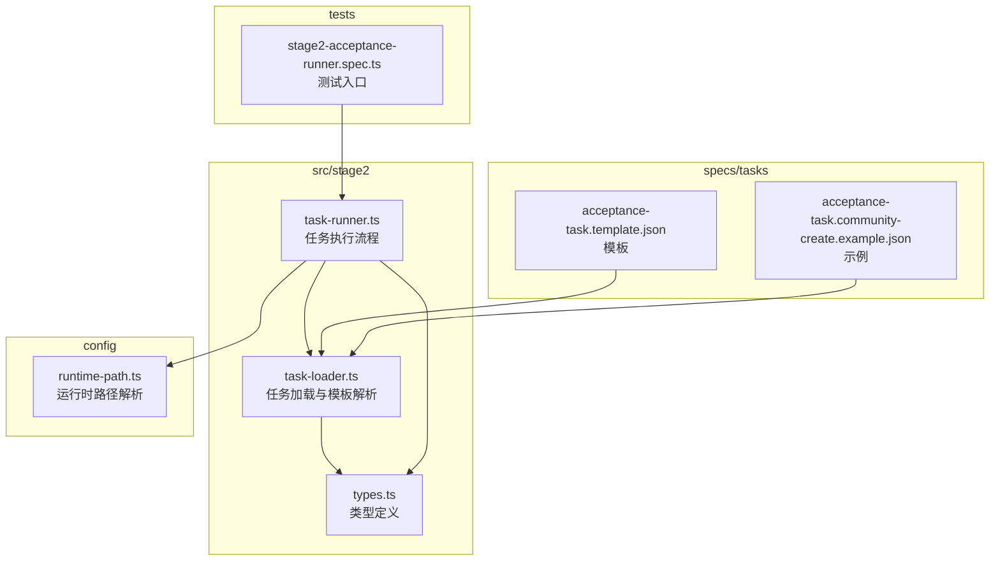
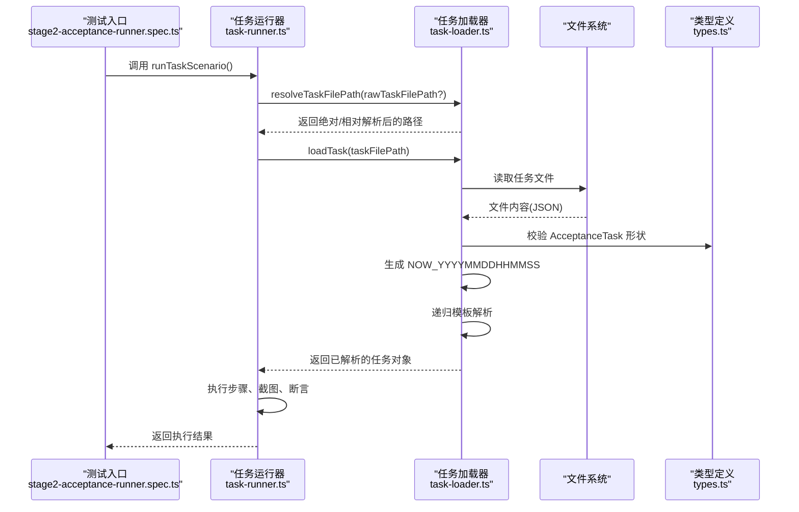
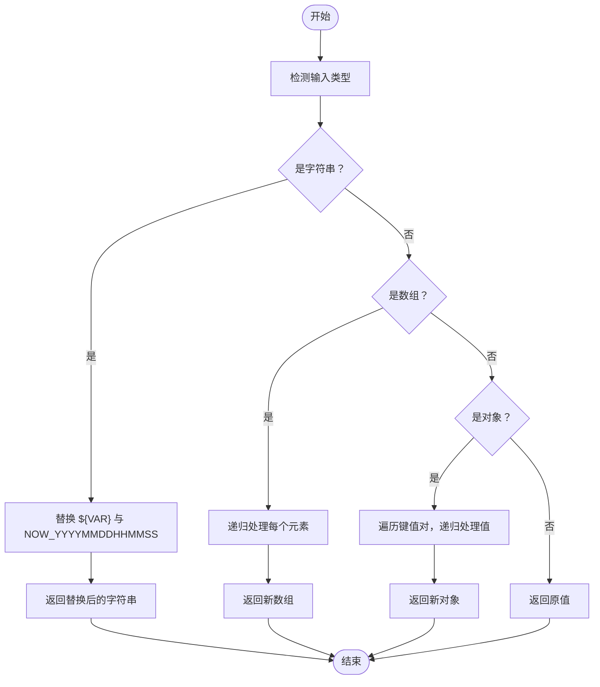
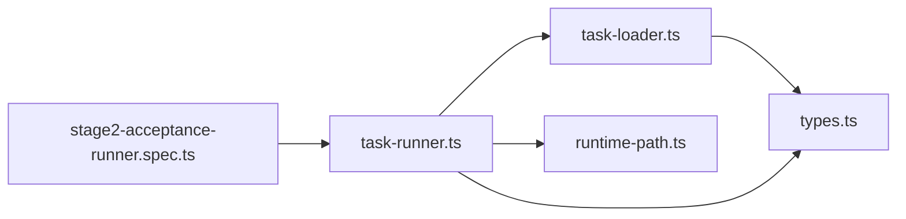

# 任务加载器

<cite>
**本文引用的文件**
- [src/stage2/task-loader.ts](file://src/stage2/task-loader.ts)
- [src/stage2/task-runner.ts](file://src/stage2/task-runner.ts)
- [src/stage2/types.ts](file://src/stage2/types.ts)
- [specs/tasks/acceptance-task.template.json](file://specs/tasks/acceptance-task.template.json)
- [specs/tasks/acceptance-task.community-create.example.json](file://specs/tasks/acceptance-task.community-create.example.json)
- [config/runtime-path.ts](file://config/runtime-path.ts)
- [tests/generated/stage2-acceptance-runner.spec.ts](file://tests/generated/stage2-acceptance-runner.spec.ts)
- [README.md](file://README.md)
- [package.json](file://package.json)
</cite>

## 目录
1. [简介](#简介)
2. [项目结构](#项目结构)
3. [核心组件](#核心组件)
4. [架构总览](#架构总览)
5. [详细组件分析](#详细组件分析)
6. [依赖关系分析](#依赖关系分析)
7. [性能考量](#性能考量)
8. [故障排查指南](#故障排查指南)
9. [结论](#结论)
10. [附录](#附录)

## 简介
本技术文档围绕 HI-TEST 的“任务加载器”进行深入解析，覆盖以下主题：
- 任务文件加载机制：文件路径解析、默认任务文件配置、绝对/相对路径处理
- 任务模板解析系统：环境变量替换、时间戳模板处理（NOW_YYYYMMDDHHMMSS）、递归模板解析算法
- 任务数据验证机制：必需字段检查、类型断言与错误处理策略
- 任务文件格式规范：AcceptanceTask 接口定义、字段约束与数据类型要求
- 实际代码示例：如何正确编写与使用任务模板
- 加载器扩展性设计：如何添加新的模板变量与验证规则

## 项目结构
该仓库采用分层与功能模块化组织：
- src/stage2：第二阶段执行器与类型定义，包含任务加载器、任务运行器与类型声明
- specs/tasks：任务模板与示例任务文件
- config：运行时路径解析与环境变量读取
- tests：端到端测试入口与夹具
- 根目录：README、package.json、Playwright 配置等

图表来源
- [src/stage2/task-loader.ts](file://src/stage2/task-loader.ts#L1-L91)
- [src/stage2/task-runner.ts](file://src/stage2/task-runner.ts#L1-L1344)
- [src/stage2/types.ts](file://src/stage2/types.ts#L1-L125)
- [specs/tasks/acceptance-task.template.json](file://specs/tasks/acceptance-task.template.json#L1-L85)
- [specs/tasks/acceptance-task.community-create.example.json](file://specs/tasks/acceptance-task.community-create.example.json#L1-L184)
- [config/runtime-path.ts](file://config/runtime-path.ts#L1-L41)
- [tests/generated/stage2-acceptance-runner.spec.ts](file://tests/generated/stage2-acceptance-runner.spec.ts#L1-L39)

章节来源
- [README.md](file://README.md#L1-L144)
- [package.json](file://package.json#L1-L24)

## 核心组件
- 任务加载器（task-loader.ts）
  - 负责任务文件路径解析、读取与解析、模板变量替换、任务形状校验
- 任务运行器（task-runner.ts）
  - 负责执行任务流程、截图与进度写盘、断言与错误处理
- 类型定义（types.ts）
  - 定义 AcceptanceTask 及其子结构（TaskTarget、TaskAccount、TaskForm、TaskField、TaskSearch、TaskAssertion、TaskRuntime、TaskApproval 等）
- 任务模板与示例（specs/tasks）
  - 提供可直接使用的模板与示例，演示字段与模板变量用法
- 运行时路径解析（config/runtime-path.ts）
  - 统一读取环境变量并解析运行产物目录

章节来源
- [src/stage2/task-loader.ts](file://src/stage2/task-loader.ts#L1-L91)
- [src/stage2/task-runner.ts](file://src/stage2/task-runner.ts#L1-L1344)
- [src/stage2/types.ts](file://src/stage2/types.ts#L1-L125)
- [specs/tasks/acceptance-task.template.json](file://specs/tasks/acceptance-task.template.json#L1-L85)
- [specs/tasks/acceptance-task.community-create.example.json](file://specs/tasks/acceptance-task.community-create.example.json#L1-L184)
- [config/runtime-path.ts](file://config/runtime-path.ts#L1-L41)

## 架构总览
任务加载器与运行器的协作流程如下：
- 测试入口通过 runTaskScenario 启动
- runTaskScenario 解析任务文件路径并加载任务
- loadTask 读取 JSON 并进行形状校验
- 模板解析阶段对字符串、数组、对象进行递归替换
- 运行器按步骤执行，记录截图与进度文件，最终输出结果

图表来源
- [tests/generated/stage2-acceptance-runner.spec.ts](file://tests/generated/stage2-acceptance-runner.spec.ts#L1-L39)
- [src/stage2/task-runner.ts](file://src/stage2/task-runner.ts#L1062-L1344)
- [src/stage2/task-loader.ts](file://src/stage2/task-loader.ts#L71-L89)
- [src/stage2/types.ts](file://src/stage2/types.ts#L86-L98)

## 详细组件分析

### 任务文件加载机制
- 默认任务文件路径
  - 默认值指向社区示例任务文件，便于直接运行
- 路径解析策略
  - 支持通过参数传入、环境变量覆盖或使用默认值
  - 若为相对路径，使用当前工作目录解析为绝对路径
- 文件存在性与读取
  - 存在性检查失败则抛出明确错误
  - 读取为 UTF-8 文本并解析为 JSON 对象
- 任务形状校验
  - 必需字段：taskId、taskName、target.url、account.username/password、form.openButtonText、form.submitButtonText、form.fields
  - 缺一即报错，错误信息包含任务文件路径，便于定位问题

章节来源
- [src/stage2/task-loader.ts](file://src/stage2/task-loader.ts#L5-L77)
- [src/stage2/task-loader.ts](file://src/stage2/task-loader.ts#L79-L89)

### 任务模板解析系统
- 时间戳模板
  - 固定令牌：NOW_YYYYMMDDHHMMSS
  - 生成格式：YYYYMMDDHHMMSS（8 位日期+4 位时间）
- 环境变量替换
  - 以 ${VAR} 形式匹配，优先使用环境变量值
  - 未设置时返回空字符串
- 递归模板解析算法
  - 对字符串、数组、对象分别处理
  - 字符串：执行正则替换与环境变量/时间戳替换
  - 数组：递归处理每个元素
  - 对象：递归处理每个键值对
  - 其他类型：原样返回
- 示例
  - 示例任务中使用了 ${NOW_YYYYMMDDHHMMSS} 作为字段值，用于避免重复数据

图表来源
- [src/stage2/task-loader.ts](file://src/stage2/task-loader.ts#L19-L48)

章节来源
- [src/stage2/task-loader.ts](file://src/stage2/task-loader.ts#L8-L17)
- [src/stage2/task-loader.ts](file://src/stage2/task-loader.ts#L19-L48)
- [specs/tasks/acceptance-task.community-create.example.json](file://specs/tasks/acceptance-task.community-create.example.json#L45-L63)

### 任务数据验证机制
- 必需字段检查
  - taskId、taskName、target.url、account.username、account.password、form.openButtonText、form.submitButtonText、form.fields
- 类型断言与错误处理
  - 使用断言函数确保任务对象满足 AcceptanceTask 结构
  - 任何缺失字段都会抛出错误，错误消息包含任务文件路径
- 执行期容错
  - 运行器在执行每一步时捕获异常，记录截图、消息与堆栈，并决定是否跳过或失败

章节来源
- [src/stage2/task-loader.ts](file://src/stage2/task-loader.ts#L50-L69)
- [src/stage2/task-runner.ts](file://src/stage2/task-runner.ts#L1110-L1155)

### 任务文件格式规范（AcceptanceTask）
- 接口定义要点
  - taskId、taskName：字符串
  - target：包含 url、browser、headless
  - account：包含 username、password、loginHints[]
  - navigation：可选，包含 homeReadyText、menuPath[]、menuHints[]
  - form：必填，包含 openButtonText、dialogTitle、submitButtonText、closeButtonText、successText、notes[]、fields[]
  - search：可选，包含 inputLabel、extraInputLabels[]、keywordFromField、triggerButtonText、resetButtonText、resultTableTitle、notes[]、expectedColumns[]、rowActionButtons[]、pagination{ pageSizeText、summaryPattern }
  - assertions[]：可选，每项包含 type、expectedText、matchField、expectedColumns[]、column、expectedFromField
  - cleanup：可选，enabled、strategy、notes
  - runtime：可选，stepTimeoutMs、pageTimeoutMs、screenshotOnStep、trace
  - approval：可选，approved、approvedBy、approvedAt
- 字段约束与数据类型
  - 字符串：如 url、username、password、openButtonText、submitButtonText、dialogTitle、successText、closeButtonText、notes[]、expectedColumns[]、rowActionButtons[]、summaryPattern、strategy、approvedBy、approvedAt
  - 数组：如 loginHints[]、menuPath[]、fields[]、extraInputLabels[]、expectedColumns[]、rowActionButtons[]
  - 对象：如 pagination、account、target、navigation、search、runtime、approval
  - 可选字段：除 form.fields 外，其余字段均为可选
- 示例参考
  - 模板文件与示例文件展示了字段布局与典型用法

章节来源
- [src/stage2/types.ts](file://src/stage2/types.ts#L5-L98)
- [specs/tasks/acceptance-task.template.json](file://specs/tasks/acceptance-task.template.json#L1-L85)
- [specs/tasks/acceptance-task.community-create.example.json](file://specs/tasks/acceptance-task.community-create.example.json#L1-L184)

### 实际代码示例（如何正确编写与使用任务模板）
- 使用环境变量
  - 在任务文件中使用 ${ENV_VAR} 即可注入环境变量值
  - 未设置时将被替换为空字符串
- 使用时间戳模板
  - 在字段值中使用 NOW_YYYYMMDDHHMMSS，加载时会被替换为当前时间戳
  - 示例见示例任务文件中的字段值
- 路径解析与运行
  - 通过测试入口调用 runTaskScenario，内部会解析任务文件路径并加载任务
  - 运行器会按步骤执行，生成截图与结果文件

章节来源
- [specs/tasks/acceptance-task.template.json](file://specs/tasks/acceptance-task.template.json#L10-L11)
- [specs/tasks/acceptance-task.community-create.example.json](file://specs/tasks/acceptance-task.community-create.example.json#L45-L63)
- [tests/generated/stage2-acceptance-runner.spec.ts](file://tests/generated/stage2-acceptance-runner.spec.ts#L1-L39)
- [src/stage2/task-runner.ts](file://src/stage2/task-runner.ts#L1062-L1067)

### 加载器扩展性设计
- 新增模板变量
  - 在模板解析函数中增加新的令牌匹配逻辑
  - 保持递归解析不变，即可支持任意深度嵌套
- 新增验证规则
  - 在断言函数中扩展对新字段的校验
  - 保持错误消息包含任务文件路径，便于定位
- 运行时路径扩展
  - 通过 config/runtime-path.ts 读取环境变量并解析路径
  - 可扩展更多运行产物目录的统一管理

章节来源
- [src/stage2/task-loader.ts](file://src/stage2/task-loader.ts#L19-L48)
- [src/stage2/task-loader.ts](file://src/stage2/task-loader.ts#L50-L69)
- [config/runtime-path.ts](file://config/runtime-path.ts#L1-L41)

## 依赖关系分析
- 组件耦合
  - task-runner 依赖 task-loader 与 types.ts
  - task-loader 依赖 types.ts 与 Node 内置模块（fs、path）
  - 运行时路径解析独立于任务加载器，通过 config/runtime-path.ts 注入
- 外部依赖
  - Playwright 与 Midscene 插件用于页面交互与 AI 能力
  - dotenv 用于读取 .env 中的环境变量

图表来源
- [src/stage2/task-runner.ts](file://src/stage2/task-runner.ts#L1-L1344)
- [src/stage2/task-loader.ts](file://src/stage2/task-loader.ts#L1-L91)
- [src/stage2/types.ts](file://src/stage2/types.ts#L1-L125)
- [config/runtime-path.ts](file://config/runtime-path.ts#L1-L41)
- [tests/generated/stage2-acceptance-runner.spec.ts](file://tests/generated/stage2-acceptance-runner.spec.ts#L1-L39)

章节来源
- [package.json](file://package.json#L1-L24)

## 性能考量
- 模板解析复杂度
  - 递归解析对字符串、数组、对象的时间复杂度为 O(n)，n 为节点总数
  - 正则替换与环境变量查找为线性扫描，整体开销可控
- 文件读取与解析
  - 仅在启动阶段读取一次任务文件，避免重复 IO
- 截图与进度写盘
  - 仅在开启截图时写盘，减少 I/O 压力
- 超时控制
  - 支持 stepTimeoutMs 与 pageTimeoutMs，避免长时间阻塞

[本节为通用性能讨论，无需特定文件引用]

## 故障排查指南
- 任务文件不存在
  - 现象：抛出“任务文件不存在”错误
  - 处理：检查路径解析结果与文件是否存在
- 缺少必需字段
  - 现象：抛出“缺少某字段”错误
  - 处理：对照 AcceptanceTask 接口补齐缺失字段
- 环境变量未设置
  - 现象：模板中 ${VAR} 被替换为空字符串
  - 处理：在 .env 中设置所需变量
- 滑块验证码问题
  - 现象：自动模式失败或人工模式超时
  - 处理：调整 STAGE2_CAPTCHA_MODE 与 STAGE2_CAPTCHA_WAIT_TIMEOUT_MS，或检查页面截图确认滑块样式

章节来源
- [src/stage2/task-loader.ts](file://src/stage2/task-loader.ts#L80-L82)
- [src/stage2/task-loader.ts](file://src/stage2/task-loader.ts#L50-L69)
- [src/stage2/task-runner.ts](file://src/stage2/task-runner.ts#L647-L703)
- [README.md](file://README.md#L54-L61)

## 结论
任务加载器通过清晰的路径解析、稳健的模板解析与严格的任务形状校验，为第二阶段执行提供了可靠的基础。配合运行器的步骤化执行与断言机制，能够稳定地完成端到端验收任务。通过扩展模板变量与验证规则，可进一步提升系统的灵活性与可维护性。

[本节为总结性内容，无需特定文件引用]

## 附录
- 运行命令
  - npm run stage2:run 或 npm run stage2:run:headed
- 关键环境变量
  - STAGE2_TASK_FILE：任务文件路径
  - STAGE2_REQUIRE_APPROVAL：是否要求审批
  - STAGE2_CAPTCHA_MODE：滑块验证码处理模式
  - STAGE2_CAPTCHA_WAIT_TIMEOUT_MS：人工处理等待时长
  - RUNTIME_DIR_PREFIX、PLAYWRIGHT_OUTPUT_DIR、PLAYWRIGHT_HTML_REPORT_DIR、MIDSCENE_RUN_DIR、ACCEPTANCE_RESULT_DIR：运行产物目录

章节来源
- [README.md](file://README.md#L48-L52)
- [package.json](file://package.json#L6-L9)