# 任务执行器

<cite>
**本文引用的文件**
- [README.md](file://README.md)
- [package.json](file://package.json)
- [playwright.config.ts](file://playwright.config.ts)
- [src/stage2/task-runner.ts](file://src/stage2/task-runner.ts)
- [src/stage2/task-loader.ts](file://src/stage2/task-loader.ts)
- [src/stage2/types.ts](file://src/stage2/types.ts)
- [tests/generated/stage2-acceptance-runner.spec.ts](file://tests/generated/stage2-acceptance-runner.spec.ts)
- [tests/fixture/fixture.ts](file://tests/fixture/fixture.ts)
- [specs/tasks/acceptance-task.template.json](file://specs/tasks/acceptance-task.template.json)
- [config/runtime-path.ts](file://config/runtime-path.ts)
- [AGENTS.md](file://AGENTS.md)
- [.tasks/AI自主代理验收系统开发改造方案_2026-03-11.md](file://.tasks/AI自主代理验收系统开发改造方案_2026-03-11.md)
- [.tasks/stage2跨平台通用断言与清理优化实现_2026-03-12.md](file://.tasks/stage2跨平台通用断言与清理优化实现_2026-03-12.md)
</cite>

## 目录
1. [简介](#简介)
2. [项目结构](#项目结构)
3. [核心组件](#核心组件)
4. [架构总览](#架构总览)
5. [详细组件分析](#详细组件分析)
6. [依赖关系分析](#依赖关系分析)
7. [性能考量](#性能考量)
8. [故障排查指南](#故障排查指南)
9. [结论](#结论)
10. [附录](#附录)

## 简介
本项目基于 Playwright 与 Midscene.js 构建的 AI 自动化测试执行器，面向"任务驱动"的验收场景，提供从任务 JSON 解析、步骤编排、AI 与 Playwright 协作、验证码处理、表单填充、断言与结果汇总的完整执行链路。执行器支持多种验证码处理模式（自动、人工、失败即停、忽略），并针对级联选择器、弹窗表单、列表查询等常见 UI 场景提供稳健的适配策略。**新增的跨平台UI配置系统**提供通用的选择器配置，**增强的断言匹配逻辑**支持精确和包含两种匹配模式，**改进的数据清理功能**提供更安全的清理策略和验证机制。**新增的断言执行引擎**提供 Playwright 硬检测 + AI 兜底 + 重试机制，**数据清理框架**支持删除创建数据、删除所有匹配记录、自定义 AI 操作，**增强的任务配置选项**包括断言超时、重试次数、软断言标志等。

## 项目结构
- 配置与运行时路径：通过环境变量集中管理运行产物目录，统一收敛至 t_runtime/。
- 任务输入：JSON 任务模板与示例，定义目标系统、账号、导航、表单字段、断言与运行时参数。
- 执行入口：Playwright 测试用例通过夹具注入 Midscene 能力，调用第二段执行器。
- 执行器：负责任务加载、步骤编排、AI/Playwright 协作、验证码处理、表单与列表处理、断言与结果写盘。
- **跨平台UI配置系统**：通过 TaskUiProfile 提供表格行、Toast、弹窗等选择器的平台适配。

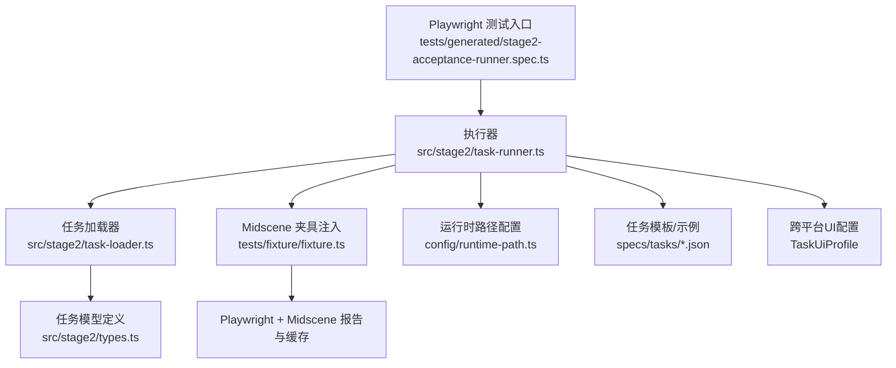

**图表来源**
- [tests/generated/stage2-acceptance-runner.spec.ts](file://tests/generated/stage2-acceptance-runner.spec.ts#L18-L37)
- [src/stage2/task-runner.ts](file://src/stage2/task-runner.ts#L1977-L2285)
- [src/stage2/task-loader.ts](file://src/stage2/task-loader.ts#L79-L91)
- [tests/fixture/fixture.ts](file://tests/fixture/fixture.ts#L23-L99)
- [config/runtime-path.ts](file://config/runtime-path.ts#L38-L41)
- [specs/tasks/acceptance-task.template.json](file://specs/tasks/acceptance-task.template.json#L1-L129)

**章节来源**
- [README.md](file://README.md#L1-L162)
- [package.json](file://package.json#L1-L24)
- [playwright.config.ts](file://playwright.config.ts#L1-L95)

## 核心组件
- 任务加载器：解析任务文件、模板变量替换、校验任务结构。
- 执行器：按步骤执行，封装验证码处理、表单填充、列表查询、断言与结果写盘。
- 夹具：为测试注入 ai/aiQuery/aiAssert/aiWaitFor 等 Midscene 能力，并设置缓存与报告目录。
- 运行时路径：集中管理 t_runtime/ 下的产物目录，支持通过环境变量覆盖。
- 任务模型：定义 AcceptanceTask、StepResult、Stage2ExecutionResult 等数据结构。
- **跨平台UI配置系统**：通过 TaskUiProfile 提供表格行、Toast、弹窗等选择器的平台适配，支持多框架兼容。
- **增强断言匹配逻辑**：支持精确匹配（exact）和包含匹配（contains）两种模式，提升断言准确性。
- **改进数据清理功能**：提供目标值去重、精确匹配、删除后行消失校验等安全机制。
- **断言执行引擎**：提供 Playwright 硬检测 + AI 兜底 + 重试机制的通用断言执行器。
- **数据清理框架**：支持删除创建数据、删除所有匹配记录、自定义 AI 操作的通用清理流程。

**章节来源**
- [src/stage2/task-loader.ts](file://src/stage2/task-loader.ts#L79-L91)
- [src/stage2/task-runner.ts](file://src/stage2/task-runner.ts#L1977-L2285)
- [tests/fixture/fixture.ts](file://tests/fixture/fixture.ts#L23-L99)
- [config/runtime-path.ts](file://config/runtime-path.ts#L38-L41)
- [src/stage2/types.ts](file://src/stage2/types.ts#L58-L126)

## 架构总览
执行器采用"任务驱动 + 步骤编排 + AI/Playwright 协作"的架构。整体流程：
- 加载任务并解析模板变量
- 打开目标页面并登录
- 处理安全验证（滑块验证码）
- 导航菜单、打开弹窗、填写表单、提交并校验
- 搜索列表并提取结构化数据
- **执行断言（Playwright硬检测 + AI兜底 + 重试机制，支持精确/包含匹配）**
- **执行数据清理（删除创建数据/所有匹配记录/自定义操作，支持安全校验）**
- 生成步骤结果与最终执行结果，写入 JSON 文件

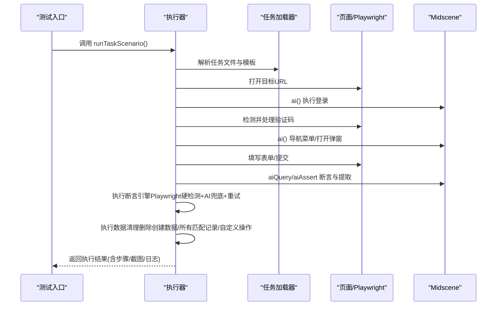

**图表来源**
- [tests/generated/stage2-acceptance-runner.spec.ts](file://tests/generated/stage2-acceptance-runner.spec.ts#L18-L37)
- [src/stage2/task-runner.ts](file://src/stage2/task-runner.ts#L1977-L2285)
- [src/stage2/task-loader.ts](file://src/stage2/task-loader.ts#L79-L91)
- [tests/fixture/fixture.ts](file://tests/fixture/fixture.ts#L23-L99)

## 详细组件分析

### 任务加载与模板解析
- 任务文件路径解析：支持绝对路径或相对路径，优先读取环境变量 STAGE2_TASK_FILE。
- 模板变量替换：支持 ${NOW_YYYYMMDDHHMMSS} 与环境变量占位符，递归替换对象/数组。
- 任务结构校验：断言 taskId、taskName、target.url、账号、表单按钮与字段等关键字段存在。

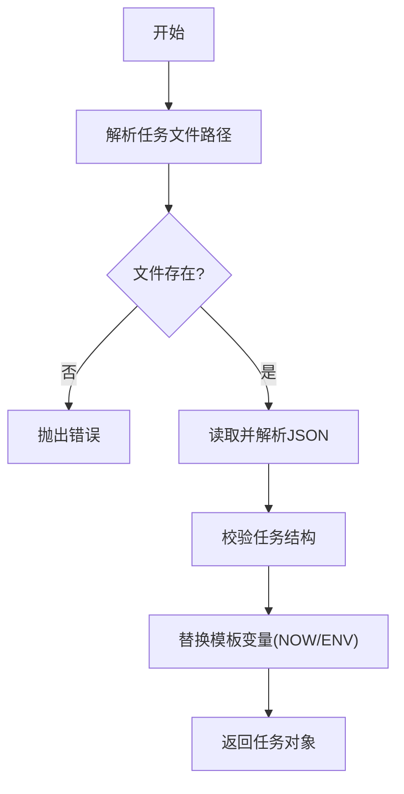

**图表来源**
- [src/stage2/task-loader.ts](file://src/stage2/task-loader.ts#L71-L91)

**章节来源**
- [src/stage2/task-loader.ts](file://src/stage2/task-loader.ts#L71-L91)
- [specs/tasks/acceptance-task.template.json](file://specs/tasks/acceptance-task.template.json#L1-L129)

### 执行器与步骤编排
- 人工审批门禁：当 STAGE2_REQUIRE_APPROVAL=true 且任务未审批时拒绝执行。
- 步骤执行框架：runStep 包装每一步，自动记录耗时、截图、错误信息，并支持可选步骤（失败不阻断）。
- 执行结果写盘：阶段性写入 result.partial.json，最终写入 result.json，包含步骤、截图、查询快照等。

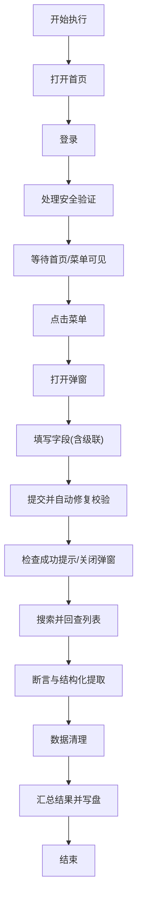

**图表来源**
- [src/stage2/task-runner.ts](file://src/stage2/task-runner.ts#L1977-L2285)

**章节来源**
- [src/stage2/task-runner.ts](file://src/stage2/task-runner.ts#L1977-L2285)

### 验证码处理流程（滑块）
- 检测策略：基于文本关键词与常见选择器匹配，判断是否存在滑块/安全验证。
- 处理模式：
  - auto：AI 查询滑块位置与滑槽宽度，Playwright 模拟真人拖动轨迹（15步、easeOut、随机抖动），最多重试3次。
  - manual：检测到验证码后，进入人工处理等待，超时则失败。
  - fail：检测到验证码直接失败。
  - ignore：忽略验证码检测（不建议）。
- 结果验证：拖动后等待滑块消失，若仍存在则判定失败。

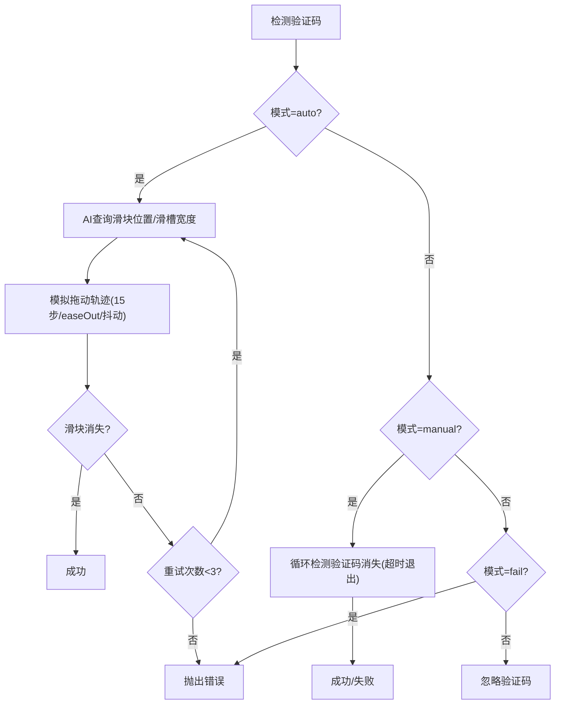

**图表来源**
- [src/stage2/task-runner.ts](file://src/stage2/task-runner.ts#L649-L705)
- [README.md](file://README.md#L54-L72)

**章节来源**
- [src/stage2/task-runner.ts](file://src/stage2/task-runner.ts#L649-L705)
- [README.md](file://README.md#L54-L72)

### 表单处理系统
- 字段类型支持：input、textarea、cascader（以及其他字符串类型）。
- 级联选择器处理：
  - 打开面板：优先使用可见输入框，否则通过 AI 描述点击打开。
  - 逐级点击选项：支持多框架（Element/ Antd/ Ivy）面板选择器，精确/模糊匹配。
  - 路径校验：读取显示值并与期望路径比较，不一致则清空并重试，最多3次。
  - 截图记录：每步截图便于回溯。
- 普通字段填充：
  - 优先通过 Role/Placeholder 精确匹配，其次在弹窗/页面范围内按提示候选填充。
  - 若均失败，通过 AI 描述进行交互。
- 提交与自动修复：
  - 点击提交按钮，若弹窗仍开则收集校验消息，定位必填字段并自动补全，最多重试3次。
  - 若仍无法关闭弹窗，抛出错误并附带最终校验消息。

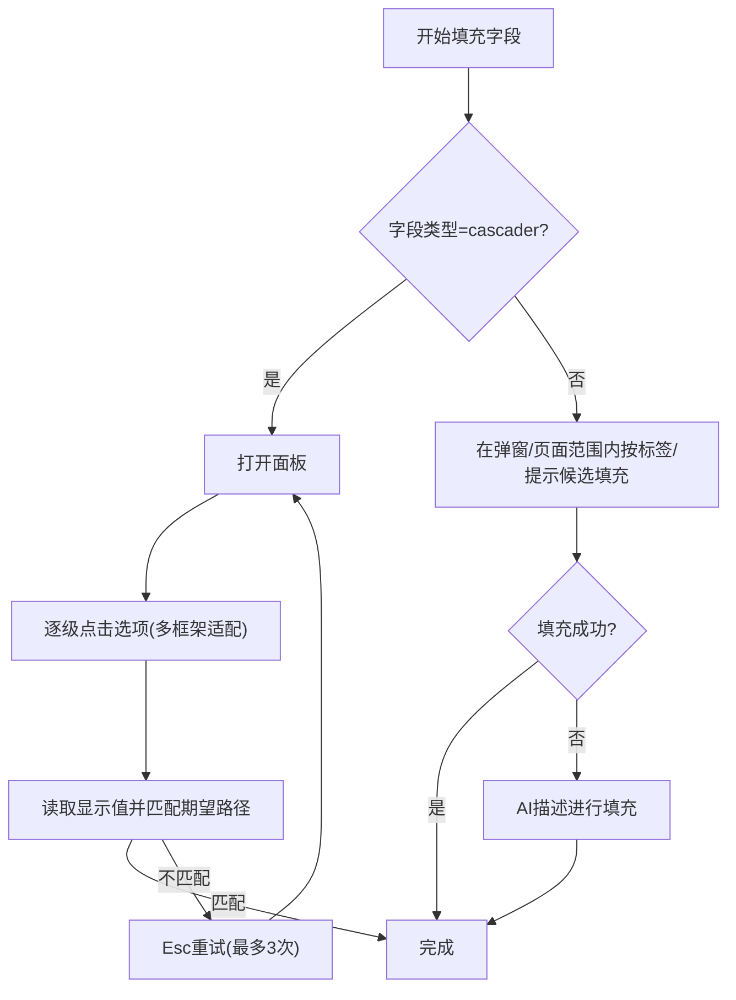

**图表来源**
- [src/stage2/task-runner.ts](file://src/stage2/task-runner.ts#L707-L787)
- [src/stage2/task-runner.ts](file://src/stage2/task-runner.ts#L1002-L1020)

**章节来源**
- [src/stage2/task-runner.ts](file://src/stage2/task-runner.ts#L707-L787)
- [src/stage2/task-runner.ts](file://src/stage2/task-runner.ts#L1002-L1020)

### 跨平台UI配置系统（新增）
- **TaskUiProfile 配置对象**：提供表格行、Toast、弹窗等选择器的平台适配，支持多框架兼容。
- **表格行选择器**：支持 table tbody tr、.el-table__body tr、.ant-table-tbody tr、.ivu-table-tbody tr、[role="row"] 等多种选择器。
- **Toast选择器**：支持 .el-message、.ant-message、.ivu-message、.ivu-notice、[role="alert"] 等消息提示选择器。
- **弹窗选择器**：支持 div[role="dialog"]、.el-dialog__wrapper、.ant-modal-wrap、.ivu-modal-wrap 等弹窗容器。
- **选择器优先级**：用户自定义的选择器优先级高于默认选择器，确保跨平台兼容性。

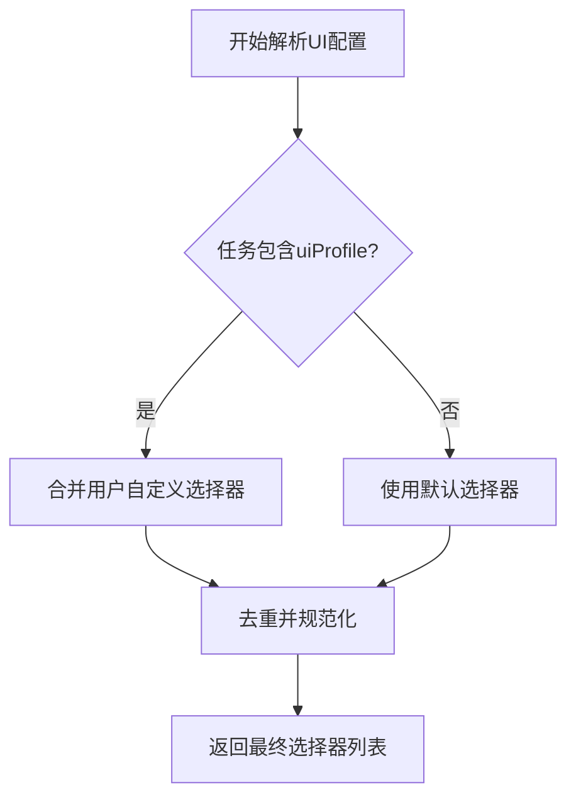

**图表来源**
- [src/stage2/types.ts](file://src/stage2/types.ts#L58-L65)
- [src/stage2/task-runner.ts](file://src/stage2/task-runner.ts#L1070-L1075)

**章节来源**
- [src/stage2/types.ts](file://src/stage2/types.ts#L58-L65)
- [src/stage2/task-runner.ts](file://src/stage2/task-runner.ts#L1070-L1075)
- [specs/tasks/acceptance-task.template.json](file://specs/tasks/acceptance-task.template.json#L29-L45)

### 增强断言匹配逻辑（新增）
- **行匹配模式**：支持精确匹配（exact）和包含匹配（contains）两种模式。
- **精确匹配（exact）**：严格匹配单元格文本或行文本，适用于唯一标识符。
- **包含匹配（contains）**：检查文本包含关系，适用于模糊匹配场景。
- **匹配模式解析**：通过 resolveRowMatchMode 统一解析 matchMode 配置。
- **断言类型支持**：
  - toast：检查页面提示信息（Toast/通知等）
  - table-row-exists：检查表格中是否存在指定行（支持精确/包含匹配）
  - table-cell-equals：检查表格单元格值完全相等（结构化列值比对）
  - table-cell-contains：检查表格单元格包含指定内容（基于返回cellValue做代码级包含判断）
  - custom：自定义描述断言，由 AI 根据描述验证页面状态

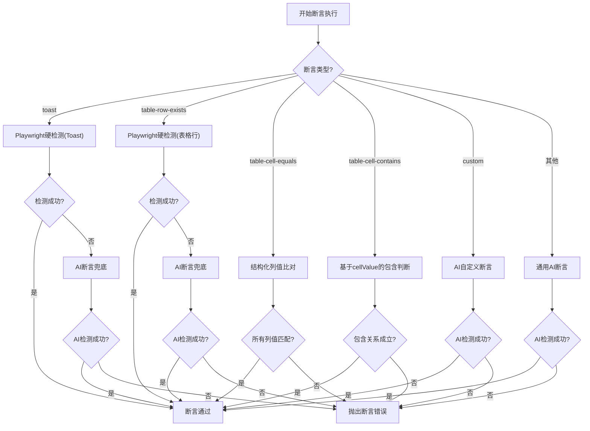

**图表来源**
- [src/stage2/task-runner.ts](file://src/stage2/task-runner.ts#L1318-L1576)
- [src/stage2/task-runner.ts](file://src/stage2/task-runner.ts#L1127-L1151)

**章节来源**
- [src/stage2/task-runner.ts](file://src/stage2/task-runner.ts#L1318-L1576)
- [src/stage2/task-runner.ts](file://src/stage2/task-runner.ts#L1127-L1151)
- [src/stage2/types.ts](file://src/stage2/types.ts#L67-L88)

### 数据清理框架（新增）
- **策略支持**：
  - delete-created：删除本次新增的数据
  - delete-all-matched：删除所有匹配的数据（通过 AI 查询当前列表）
  - custom：自定义清理操作，使用 AI 指令执行
- **清理流程**：
  1. 确定待清理目标值（基于 matchField 或 AI 查询）
  2. 搜索定位（可选，通过 AI 或 Playwright）
  3. 执行清理操作（删除按钮点击 + 确认弹窗处理 + 成功提示验证）
  4. 后续验证（可选，检查目标行是否仍存在）
- **操作类型**：
  - delete：标准删除操作，支持行操作按钮、确认弹窗、成功提示
  - custom：自定义 AI 指令，支持占位符替换
- **配置选项**：
  - searchBeforeCleanup：清理前是否先搜索定位
  - rowMatchMode：行匹配模式（exact/contains）
  - verifyAfterCleanup：删除后是否验证目标行已消失
  - failOnError：清理失败是否中断任务

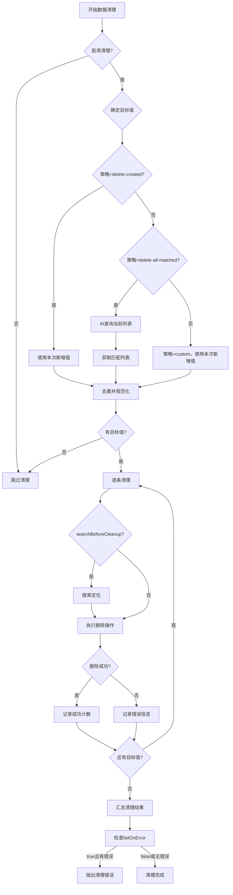

**图表来源**
- [src/stage2/task-runner.ts](file://src/stage2/task-runner.ts#L1877-L1975)

**章节来源**
- [src/stage2/task-runner.ts](file://src/stage2/task-runner.ts#L1877-L1975)
- [src/stage2/types.ts](file://src/stage2/types.ts#L90-L126)

### AI 集成执行模式
- 能力注入：通过夹具注入 ai/aiQuery/aiAssert/aiWaitFor，统一缓存与报告目录。
- 执行策略：
  - ai()：执行动作型指令（登录、点击、输入、滚动等）。
  - aiQuery()：提取结构化数据（如列表前10行小区名称）。
  - aiAssert()：执行断言（如 toast 出现、表格行存在、单元格包含/等于）。
  - aiWaitFor()：等待页面出现特定文本。
- 报告与缓存：Midscene 报告目录统一收敛到 t_runtime/midscene_run。

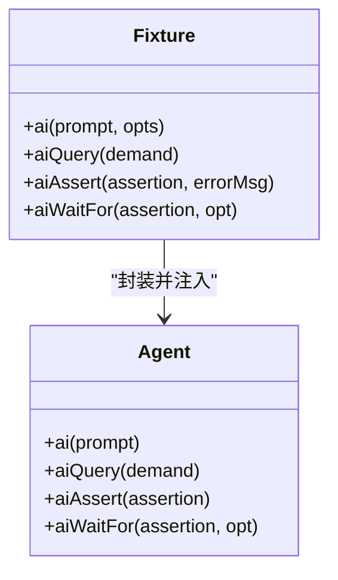

**图表来源**
- [tests/fixture/fixture.ts](file://tests/fixture/fixture.ts#L23-L99)

**章节来源**
- [tests/fixture/fixture.ts](file://tests/fixture/fixture.ts#L23-L99)
- [.tasks/AI自主代理验收系统开发改造方案_2026-03-11.md](file://.tasks/AI自主代理验收系统开发改造方案_2026-03-11.md#L47-L116)

### 执行结果生成机制
- 步骤结果：StepResult 记录名称、状态、开始/结束时间、耗时、截图路径、错误信息与堆栈。
- 执行结果：Stage2ExecutionResult 包含任务元信息、运行目录、解析后的字段值、查询快照、步骤列表。
- 写盘策略：执行中定期写入 result.partial.json，最终写入 result.json；截图按步骤生成。

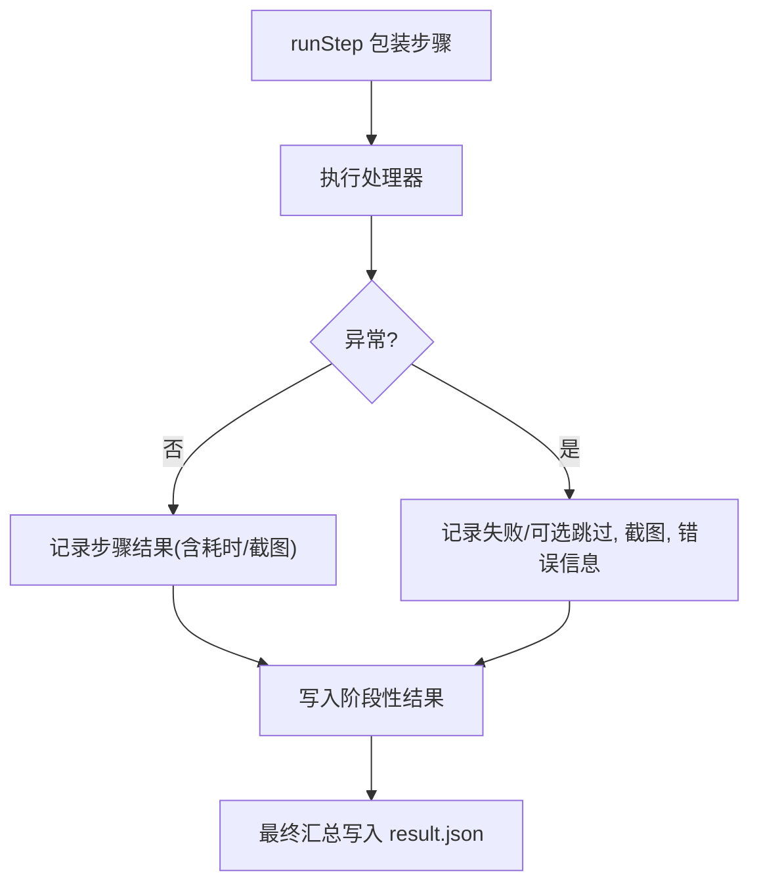

**图表来源**
- [src/stage2/task-runner.ts](file://src/stage2/task-runner.ts#L2025-L2070)
- [src/stage2/task-runner.ts](file://src/stage2/task-runner.ts#L2268-L2285)

**章节来源**
- [src/stage2/task-runner.ts](file://src/stage2/task-runner.ts#L2025-L2070)
- [src/stage2/task-runner.ts](file://src/stage2/task-runner.ts#L2268-L2285)

### 执行器 API 说明
- 入口函数：runTaskScenario(context, options?)
  - 参数
    - context: 包含 page、ai、aiAssert、aiQuery、aiWaitFor 的运行上下文
    - options: 可选 rawTaskFilePath 覆盖任务文件路径
  - 返回：Stage2ExecutionResult
- 任务文件与模板
  - 任务文件路径：优先读取 STAGE2_TASK_FILE，否则使用默认路径
  - 模板变量：NOW_YYYYMMDDHHMMSS 与环境变量占位符
- 运行时配置
  - STAGE2_REQUIRE_APPROVAL：是否启用人工审批门禁
  - STAGE2_CAPTCHA_MODE：验证码处理模式（auto/manual/fail/ignore）
  - STAGE2_CAPTCHA_WAIT_TIMEOUT_MS：人工模式等待超时（毫秒）
- **跨平台UI配置**（新增）
  - uiProfile.tableRowSelectors：表格行选择器优先级列表
  - uiProfile.toastSelectors：Toast选择器优先级列表
  - uiProfile.dialogSelectors：弹窗选择器优先级列表
- **断言配置**（新增）
  - timeoutMs：断言超时时间（毫秒），默认 15000
  - retryCount：断言重试次数，默认 2
  - soft：是否为软断言（失败不中断流程），默认 false
  - matchMode：行匹配模式（exact/contains），默认 exact
- **数据清理配置**（新增）
  - enabled：是否启用清理
  - strategy：清理策略（delete-created/delete-all-matched/custom/none）
  - matchField：用于定位待删除数据的字段
  - searchBeforeCleanup：清理前是否先搜索定位
  - rowMatchMode：行匹配模式（exact/contains），默认 exact
  - verifyAfterCleanup：删除后是否验证目标行已消失
  - failOnError：清理失败是否中断任务

**章节来源**
- [src/stage2/task-runner.ts](file://src/stage2/task-runner.ts#L1977-L1980)
- [src/stage2/task-loader.ts](file://src/stage2/task-loader.ts#L71-L89)
- [README.md](file://README.md#L39-L61)
- [src/stage2/types.ts](file://src/stage2/types.ts#L58-L126)

## 依赖关系分析
- 测试配置：Playwright 配置集中管理输出目录、报告与 workers，Midscene 报告集成。
- 运行时路径：通过 config/runtime-path.ts 读取环境变量并解析绝对路径。
- 任务模型：types.ts 定义 AcceptanceTask、StepResult、Stage2ExecutionResult 等核心类型。
- 执行入口：tests/generated/stage2-acceptance-runner.spec.ts 作为单一入口，调用执行器并断言结果。
- **跨平台适配**：通过 TaskUiProfile 和选择器解析函数实现多框架兼容。

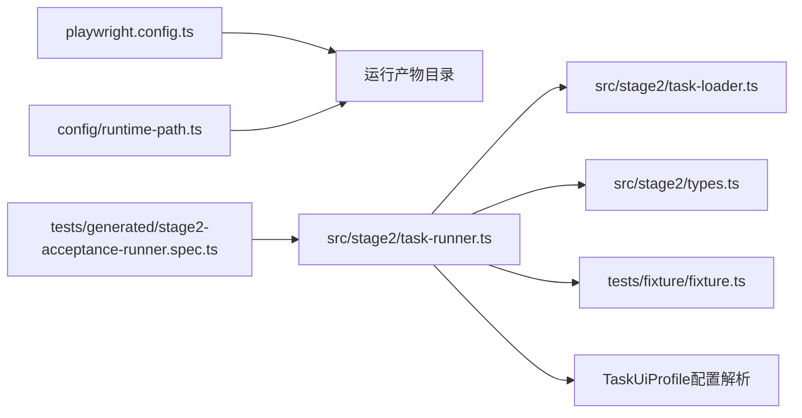

**图表来源**
- [playwright.config.ts](file://playwright.config.ts#L22-L40)
- [config/runtime-path.ts](file://config/runtime-path.ts#L38-L41)
- [tests/generated/stage2-acceptance-runner.spec.ts](file://tests/generated/stage2-acceptance-runner.spec.ts#L18-L37)
- [src/stage2/task-runner.ts](file://src/stage2/task-runner.ts#L1977-L2285)
- [src/stage2/task-loader.ts](file://src/stage2/task-loader.ts#L79-L91)
- [src/stage2/types.ts](file://src/stage2/types.ts#L141-L180)
- [tests/fixture/fixture.ts](file://tests/fixture/fixture.ts#L23-L99)

**章节来源**
- [playwright.config.ts](file://playwright.config.ts#L22-L40)
- [config/runtime-path.ts](file://config/runtime-path.ts#L38-L41)
- [tests/generated/stage2-acceptance-runner.spec.ts](file://tests/generated/stage2-acceptance-runner.spec.ts#L18-L37)

## 性能考量
- 并行与重试：Playwright 在 CI 上启用重试，本地禁用，减少不稳定因素导致的失败。
- 超时与等待：步骤超时与页面加载超时可配置，避免长时间卡死；验证码等待可调。
- 截图与报告：按需开启步骤截图，避免过多 I/O；Midscene 报告与 Playwright HTML 报告并存，便于快速定位问题。
- 缓存与稳定性：Midscene 提供缓存能力，建议对高频定位目标启用缓存，同时保留兜底策略。
- **跨平台适配性能**：通过 TaskUiProfile 的选择器优先级机制，减少不必要的元素查找，提升断言和清理性能。
- **断言性能优化**：断言执行引擎采用"Playwright硬检测优先 + AI兜底"策略，减少不必要的 AI 调用，提高断言效率。
- **清理性能优化**：数据清理框架支持批量清理和智能定位，减少重复搜索和操作。
- **匹配模式优化**：精确匹配（exact）优先于包含匹配（contains），在保证准确性的前提下提升性能。

**章节来源**
- [playwright.config.ts](file://playwright.config.ts#L32-L34)
- [README.md](file://README.md#L74-L92)
- [src/stage2/task-runner.ts](file://src/stage2/task-runner.ts#L1318-L1576)
- [src/stage2/task-runner.ts](file://src/stage2/task-runner.ts#L1877-L1975)
- [README.md](file://README.md#L140-L149)

## 故障排查指南
- 验证码处理失败
  - 现象：自动模式多次尝试后仍失败或人工模式超时。
  - 排查要点：检查滑块检测选择器与文本关键词、AI 查询结果、拖动轨迹参数、等待超时设置。
  - 建议：切换为 manual 模式人工处理，或调整验证码模式。
- 表单填写失败
  - 现象：字段无法填充或级联未生效。
  - 排查要点：确认弹窗可见、候选标签/提示是否匹配、级联面板层级与选项文本、最大重试次数。
  - 建议：补充 hints、使用 AI 描述兜底、检查页面框架差异。
- 提交后弹窗未关闭
  - 现象：提交后弹窗仍存在，触发自动修复循环。
  - 排查要点：查看最终校验消息，确认必填字段与唯一性。
  - 建议：补齐缺失字段、调整字段值或提示文案。
- **跨平台UI配置问题**（新增）
  - 现象：断言或清理在某些平台失效。
  - 排查要点：检查 uiProfile 中的选择器配置、默认选择器列表、选择器优先级。
  - 建议：为特定平台添加自定义选择器，确保覆盖主要框架。
- **断言匹配失败**（新增）
  - 现象：断言在不同平台表现不一致。
  - 排查要点：检查 matchMode 配置、行匹配模式、包含匹配的文本标准化。
  - 建议：在需要精确匹配的场景使用 exact，在模糊匹配场景使用 contains。
- **数据清理失败**（新增）
  - 现象：清理操作执行失败或目标数据未删除。
  - 排查要点：检查清理策略、目标值匹配、确认弹窗处理、成功提示验证、failOnError配置。
  - 建议：启用 searchBeforeCleanup、调整 rowMatchMode、检查确认弹窗标题和按钮文案。
- 执行结果未生成
  - 现象：找不到 result.json 或 partial.json。
  - 排查要点：确认运行目录权限、环境变量 RUNTIME_DIR_PREFIX/ACCEPTANCE_RESULT_DIR 设置、写盘逻辑是否被异常中断。
  - 建议：检查中间步骤截图与错误信息，确认写盘文件路径。

**章节来源**
- [src/stage2/task-runner.ts](file://src/stage2/task-runner.ts#L649-L705)
- [src/stage2/task-runner.ts](file://src/stage2/task-runner.ts#L1002-L1020)
- [src/stage2/task-runner.ts](file://src/stage2/task-runner.ts#L1318-L1576)
- [src/stage2/task-runner.ts](file://src/stage2/task-runner.ts#L1877-L1975)
- [README.md](file://README.md#L74-L92)

## 结论
该执行器以"任务驱动 + 步骤原子化 + AI/Playwright 协作"为核心，围绕登录、导航、弹窗表单、列表回查与断言构建了可复用的执行框架。**新增的跨平台UI配置系统**提供了灵活的选择器适配机制，**增强的断言匹配逻辑**支持精确和包含两种匹配模式，**改进的数据清理功能**提供了更安全的清理策略和验证机制。**新增的断言执行引擎**提供了可靠的 Playwright硬检测 + AI兜底 + 重试机制，**数据清理框架**支持灵活的清理策略和智能定位，**增强的任务配置选项**包括断言超时、重试次数、软断言标志等，满足验收场景的稳定性与可追溯性需求。建议在后续迭代中进一步完善唯一数据生成、失败补偿与前端可视化展示。

## 附录

### 环境变量与运行产物
- 运行产物目录统一收敛至 t_runtime/，可通过环境变量覆盖：
  - RUNTIME_DIR_PREFIX：运行目录前缀
  - PLAYWRIGHT_OUTPUT_DIR：Playwright 执行产物目录
  - PLAYWRIGHT_HTML_REPORT_DIR：Playwright HTML 报告目录
  - MIDSCENE_RUN_DIR：Midscene 运行日志、缓存、报告根目录
  - ACCEPTANCE_RESULT_DIR：第二段结构化结果目录
- 验证码相关：
  - STAGE2_CAPTCHA_MODE：auto/manual/fail/ignore
  - STAGE2_CAPTCHA_WAIT_TIMEOUT_MS：人工模式等待超时（毫秒）
- 任务与审批：
  - STAGE2_TASK_FILE：任务文件路径
  - STAGE2_REQUIRE_APPROVAL：是否启用人工审批门禁
- **跨平台UI配置**（新增）
  - uiProfile.tableRowSelectors：表格行选择器优先级列表
  - uiProfile.toastSelectors：Toast选择器优先级列表
  - uiProfile.dialogSelectors：弹窗选择器优先级列表
- **断言配置**（新增）
  - 断言超时时间：timeoutMs（毫秒），默认 15000
  - 断言重试次数：retryCount，默认 2
  - 软断言标志：soft，默认 false
  - 行匹配模式：matchMode（exact/contains），默认 exact
- **数据清理配置**（新增）
  - 清理启用：enabled，默认 false
  - 清理策略：strategy（delete-created/delete-all-matched/custom/none），默认 none
  - 匹配字段：matchField
  - 清理前搜索：searchBeforeCleanup，默认 true
  - 行匹配模式：rowMatchMode（exact/contains），默认 exact
  - 删除后验证：verifyAfterCleanup，默认 true
  - 失败中断：failOnError，默认 false

**章节来源**
- [README.md](file://README.md#L39-L61)
- [README.md](file://README.md#L74-L92)
- [README.md](file://README.md#L140-L149)
- [config/runtime-path.ts](file://config/runtime-path.ts#L13-L36)
- [src/stage2/types.ts](file://src/stage2/types.ts#L58-L126)

### 跨平台UI配置最佳实践（新增）
- **表格行匹配**：优先使用精确匹配（exact），在特殊场景下考虑包含匹配（contains）
- **Toast断言**：建议使用精确匹配，避免误判
- **弹窗清理**：确保确认弹窗标题和按钮文案的准确性
- **选择器优先级**：用户自定义选择器应覆盖主要框架，确保跨平台兼容性
- **匹配模式选择**：在需要唯一标识符时使用 exact，在模糊匹配场景使用 contains

**章节来源**
- [specs/tasks/acceptance-task.template.json](file://specs/tasks/acceptance-task.template.json#L29-L45)
- [specs/tasks/acceptance-task.template.json](file://specs/tasks/acceptance-task.template.json#L84-L88)
- [specs/tasks/acceptance-task.template.json](file://specs/tasks/acceptance-task.template.json#L100)