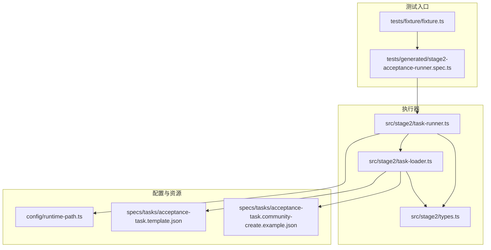
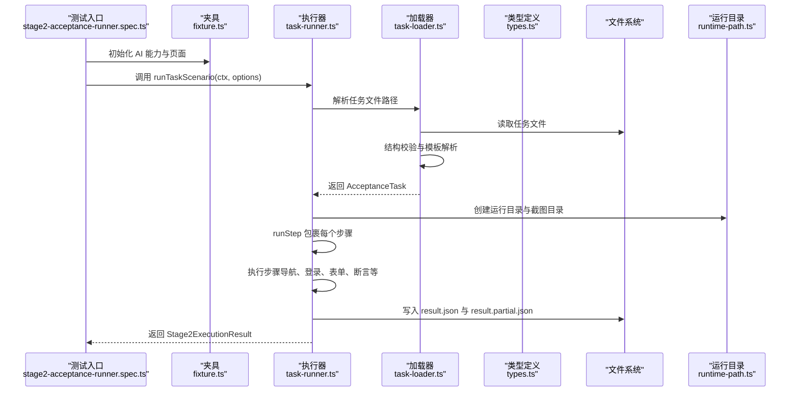
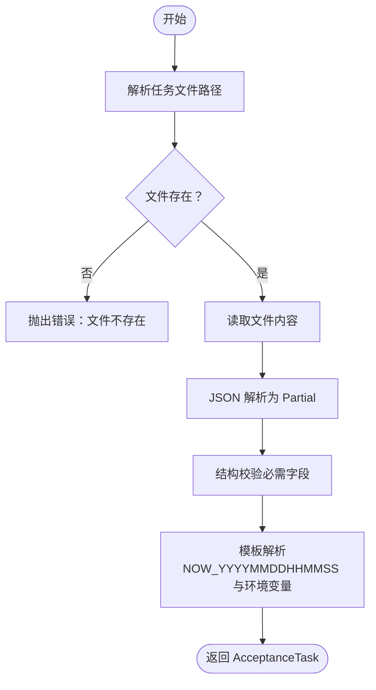
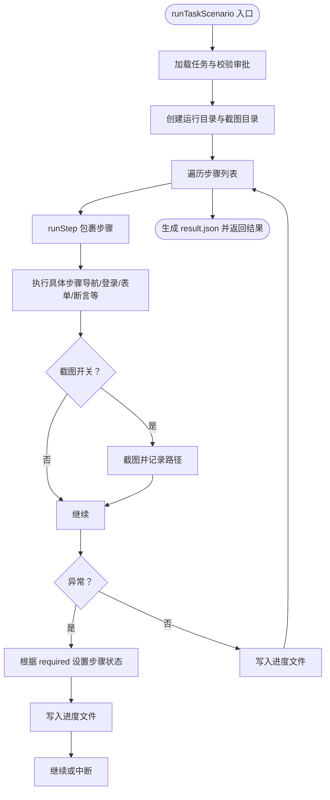
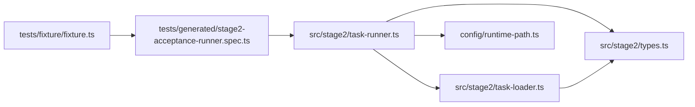

# 执行器系统

<cite>
**本文引用的文件**
- [src/stage2/task-loader.ts](file://src/stage2/task-loader.ts)
- [src/stage2/task-runner.ts](file://src/stage2/task-runner.ts)
- [src/stage2/types.ts](file://src/stage2/types.ts)
- [config/runtime-path.ts](file://config/runtime-path.ts)
- [specs/tasks/acceptance-task.template.json](file://specs/tasks/acceptance-task.template.json)
- [specs/tasks/acceptance-task.community-create.example.json](file://specs/tasks/acceptance-task.community-create.example.json)
- [tests/generated/stage2-acceptance-runner.spec.ts](file://tests/generated/stage2-acceptance-runner.spec.ts)
- [tests/fixture/fixture.ts](file://tests/fixture/fixture.ts)
- [README.md](file://README.md)
- [package.json](file://package.json)
</cite>

## 目录
1. [简介](#简介)
2. [项目结构](#项目结构)
3. [核心组件](#核心组件)
4. [架构总览](#架构总览)
5. [组件详解](#组件详解)
6. [依赖关系分析](#依赖关系分析)
7. [性能考量](#性能考量)
8. [故障排查指南](#故障排查指南)
9. [结论](#结论)
10. [附录](#附录)

## 简介
本项目是一个基于 Playwright 与 Midscene 的 AI 自动化测试执行器系统，面向“第二段验收”场景，通过 JSON 任务驱动，结合 AI 能力与 Playwright 控件定位，完成端到端的业务流程自动化执行。系统包含任务加载器与任务执行器两大模块，前者负责任务文件的加载、模板变量解析与结构校验，后者负责执行流程编排、异常处理、截图与结果持久化。

## 项目结构
- 核心源码位于 src/stage2，包含任务加载器、任务执行器与类型定义
- 配置与运行目录由 config/runtime-path.ts 统一解析
- 示例任务模板位于 specs/tasks
- 测试入口位于 tests/generated，夹具 tests/fixture 将 Midscene AI 能力注入到 Playwright 测试上下文
- README 提供安装、配置与运行说明

图表来源
- [tests/generated/stage2-acceptance-runner.spec.ts](file://tests/generated/stage2-acceptance-runner.spec.ts#L1-L39)
- [tests/fixture/fixture.ts](file://tests/fixture/fixture.ts#L1-L100)
- [src/stage2/task-runner.ts](file://src/stage2/task-runner.ts#L1-L1344)
- [src/stage2/task-loader.ts](file://src/stage2/task-loader.ts#L1-L91)
- [src/stage2/types.ts](file://src/stage2/types.ts#L1-L125)
- [config/runtime-path.ts](file://config/runtime-path.ts#L1-L41)
- [specs/tasks/acceptance-task.template.json](file://specs/tasks/acceptance-task.template.json#L1-L85)
- [specs/tasks/acceptance-task.community-create.example.json](file://specs/tasks/acceptance-task.community-create.example.json#L1-L184)

章节来源
- [README.md](file://README.md#L1-L144)
- [package.json](file://package.json#L1-L24)

## 核心组件
- 任务加载器（TaskLoader）
  - 解析任务文件路径，支持绝对/相对路径与环境变量覆盖
  - 读取 JSON 并进行结构校验（必需字段）
  - 支持模板变量解析（NOW_YYYYMMDDHHMMSS、环境变量占位符）
- 任务执行器（TaskRunner）
  - 以 runTaskScenario 为入口，组织完整执行流程
  - 步骤级运行与异常处理，支持可选步骤与失败跳过
  - 截图与进度文件写入，生成最终执行结果
  - 滑块验证码处理（自动/人工/失败/忽略）
  - 表单填充、级联选择、提交与二次修复、断言等
- 类型定义（Types）
  - 定义 AcceptanceTask、TaskForm、TaskField、TaskAssertion、StepResult、Stage2ExecutionResult 等核心数据模型

章节来源
- [src/stage2/task-loader.ts](file://src/stage2/task-loader.ts#L1-L91)
- [src/stage2/task-runner.ts](file://src/stage2/task-runner.ts#L1-L1344)
- [src/stage2/types.ts](file://src/stage2/types.ts#L1-L125)

## 架构总览
执行器采用“JSON 任务驱动 + AI + Playwright”的分层架构：
- 任务层：JSON 任务描述业务流程与期望
- 加载层：校验与模板解析，输出强类型任务对象
- 执行层：按步骤编排，结合 AI 语义理解与 Playwright 控件定位
- 输出层：结果文件、截图、进度文件与报告目录

图表来源
- [tests/generated/stage2-acceptance-runner.spec.ts](file://tests/generated/stage2-acceptance-runner.spec.ts#L1-L39)
- [tests/fixture/fixture.ts](file://tests/fixture/fixture.ts#L1-L100)
- [src/stage2/task-runner.ts](file://src/stage2/task-runner.ts#L1062-L1344)
- [src/stage2/task-loader.ts](file://src/stage2/task-loader.ts#L71-L91)
- [config/runtime-path.ts](file://config/runtime-path.ts#L38-L41)

## 组件详解

### 任务加载器（TaskLoader）
职责与流程
- 任务文件路径解析：优先使用传入路径，其次读取环境变量，最后使用默认路径
- 文件存在性校验与读取
- 结构校验：确保 taskId、taskName、target.url、account.username/password、form.openButtonText、form.submitButtonText、form.fields 存在
- 模板解析：支持 NOW_YYYYMMDDHHMMSS 时间戳与环境变量占位符（${VAR}）
- 返回强类型 AcceptanceTask

图表来源
- [src/stage2/task-loader.ts](file://src/stage2/task-loader.ts#L71-L91)
- [src/stage2/task-loader.ts](file://src/stage2/task-loader.ts#L79-L89)

章节来源
- [src/stage2/task-loader.ts](file://src/stage2/task-loader.ts#L1-L91)

### 任务执行器（TaskRunner）
职责与流程
- 入口 runTaskScenario：加载任务、创建运行目录、初始化步骤与进度文件
- runStep：封装步骤执行，记录开始/结束时间、耗时、截图、消息与堆栈；支持 required 选项控制失败是否中断
- 执行步骤编排：打开首页、登录、处理安全验证、等待首页/菜单、打开弹窗、填写字段、提交与二次修复、关闭弹窗、搜索与断言、提取快照
- 滑块验证码处理：支持 auto/manual/fail/ignore 四种模式，自动模式通过 AI 查询滑块位置与轨迹宽度，使用 Playwright 模拟拖动
- 断言：内置多种断言类型（toast、table-row-exists、table-cell-equals、table-cell-contains），未知类型回退到通用断言
- 结果输出：生成 result.json 与阶段性 result.partial.json，包含步骤、截图路径、解析后的字段值与查询快照

图表来源
- [src/stage2/task-runner.ts](file://src/stage2/task-runner.ts#L1062-L1344)
- [src/stage2/task-runner.ts](file://src/stage2/task-runner.ts#L1110-L1155)

章节来源
- [src/stage2/task-runner.ts](file://src/stage2/task-runner.ts#L1-L1344)

### 执行流程控制机制
- 步骤依赖与顺序
  - 首页打开 -> 登录 -> 安全验证 -> 首页/菜单等待 -> 菜单点击 -> 打开弹窗 -> 弹窗可见 -> 字段填写 -> 提交与二次修复 -> 关闭弹窗 -> 搜索与断言 -> 提取快照
- 条件判断
  - 导航阶段：根据 homeReadyText 与 menuPath 动态等待与点击
  - 表单阶段：根据 componentType 与 hints 选择不同填充策略；级联字段逐级点击并校验路径
  - 断言阶段：根据断言类型选择 AI 等价断言
- 循环与重试
  - 提交阶段最大重试次数，遇到弹窗校验提示时自动回填缺失字段并再次提交
  - 自动滑块处理最多重试 3 次
- 可选步骤
  - 首页加载等待与提交提示等设置 required:false，失败不影响整体结果

章节来源
- [src/stage2/task-runner.ts](file://src/stage2/task-runner.ts#L1157-L1320)

### 执行器 API 说明
- 公共接口
  - runTaskScenario(context, options?): Promise<Stage2ExecutionResult>
    - 参数
      - context: 包含 page、ai、aiAssert、aiQuery、aiWaitFor 的 RunnerContext
      - options?: { rawTaskFilePath?: string }
    - 返回值: Stage2ExecutionResult
- 关键配置
  - 环境变量
    - STAGE2_TASK_FILE：任务文件路径（默认示例）
    - STAGE2_REQUIRE_APPROVAL：是否要求审批（true/false）
    - STAGE2_CAPTCHA_MODE：验证码处理模式（auto/manual/fail/ignore）
    - STAGE2_CAPTCHA_WAIT_TIMEOUT_MS：人工处理等待时长（毫秒）
  - 运行时目录
    - 由 config/runtime-path.ts 解析，统一收敛到 RUNTIME_DIR_PREFIX 下

章节来源
- [src/stage2/task-runner.ts](file://src/stage2/task-runner.ts#L1062-L1073)
- [README.md](file://README.md#L39-L58)
- [config/runtime-path.ts](file://config/runtime-path.ts#L1-L41)

### 执行器扩展开发指南
- 新增执行步骤
  - 在 runTaskScenario 中新增 runStep 包裹的步骤逻辑
  - 如需 UI 交互，优先使用 AI 描述步骤，必要时使用 Playwright 定位器
  - 对关键步骤开启截图（screenshotOnStep）
- 自定义处理逻辑
  - 表单字段：根据 componentType 与 hints 扩展填充策略
  - 级联选择：复用 openCascaderPanel 与 clickCascaderOption，并增加校验
  - 断言：新增断言类型时，完善 runAssertion 的分支与回退策略
- 验证码处理
  - 自动模式：扩展 AI 查询与拖动轨迹策略
  - 人工模式：调整等待时长与提示信息
- 任务文件扩展
  - 在 AcceptanceTask 中新增字段，配合类型定义与加载器校验
  - 使用模板变量（NOW_YYYYMMDDHHMMSS）与环境变量占位符

章节来源
- [src/stage2/task-runner.ts](file://src/stage2/task-runner.ts#L1062-L1344)
- [src/stage2/types.ts](file://src/stage2/types.ts#L86-L98)

## 依赖关系分析
- 模块耦合
  - task-runner 依赖 task-loader、types、runtime-path
  - 测试入口依赖夹具与执行器
  - 夹具提供 AI 能力注入，与执行器解耦
- 外部依赖
  - Playwright：页面自动化与定位
  - Midscene：AI 能力（ai/aiQuery/aiAssert/aiWaitFor）

图表来源
- [tests/generated/stage2-acceptance-runner.spec.ts](file://tests/generated/stage2-acceptance-runner.spec.ts#L1-L39)
- [tests/fixture/fixture.ts](file://tests/fixture/fixture.ts#L1-L100)
- [src/stage2/task-runner.ts](file://src/stage2/task-runner.ts#L1-L1344)
- [src/stage2/task-loader.ts](file://src/stage2/task-loader.ts#L1-L91)
- [src/stage2/types.ts](file://src/stage2/types.ts#L1-L125)
- [config/runtime-path.ts](file://config/runtime-path.ts#L1-L41)

章节来源
- [package.json](file://package.json#L1-L24)

## 性能考量
- 截图与磁盘 IO
  - 建议仅在关键步骤开启截图（screenshotOnStep），避免过多全屏截图
  - 合理设置 stepTimeoutMs 与 pageTimeoutMs，避免长时间等待
- 页面等待策略
  - 优先使用可见性等待与 AI 等待，减少固定超时
  - 对弹窗与列表使用精确选择器，降低匹配成本
- AI 查询与拖动
  - 自动滑块处理采用有限重试与缓动轨迹，平衡成功率与性能
- 目录与缓存
  - 统一运行目录，便于清理与归档

## 故障排查指南
- 任务文件相关
  - 缺少必需字段：检查 taskId、taskName、target.url、account.username/password、form.openButtonText、form.submitButtonText、form.fields
  - 模板变量未解析：确认环境变量与 NOW_YYYYMMDDHHMMSS 占位符使用正确
- 执行失败
  - 查看 result.json 与 screenshots 目录，定位失败步骤与截图
  - 失败步骤信息包含 message 与 errorStack，用于快速定位
- 首页/菜单等待
  - 调整 homeReadyText 与 menuPath，或增大 stepTimeoutMs
- 表单填写
  - 级联字段失败：检查省市区路径与弹窗可见性；必要时增加重试与截图
  - 文本框未找到：使用 hints 与占位文案增强匹配
- 提交与断言
  - 提交失败：系统会自动收集校验提示并回填缺失字段；仍失败时检查断言类型与期望值
- 验证码处理
  - 自动模式失败：检查滑块检测选择器与 AI 查询稳定性；切换为 manual 模式
  - 人工模式超时：增大 STAGE2_CAPTCHA_WAIT_TIMEOUT_MS

章节来源
- [src/stage2/task-runner.ts](file://src/stage2/task-runner.ts#L1132-L1148)
- [src/stage2/task-runner.ts](file://src/stage2/task-runner.ts#L647-L703)
- [README.md](file://README.md#L54-L72)

## 结论
该执行器系统通过清晰的分层设计与强类型的 JSON 任务驱动，实现了从登录到断言的完整验收流程自动化。其核心优势在于：
- 易扩展：通过 runStep 与 AI 能力，可快速扩展新步骤与处理逻辑
- 可观测：每步截图、进度文件与详细错误信息，便于问题定位
- 可配置：丰富的环境变量与运行时参数，满足不同场景需求
建议在生产环境中结合 CI/CD 与报告归档，进一步提升稳定性与可维护性。

## 附录
- 示例任务文件
  - acceptance-task.template.json：通用模板
  - acceptance-task.community-create.example.json：社区创建示例
- 运行命令
  - npm run stage2:run 或 npm run stage2:run:headed
- 目录约定
  - 运行产物统一收敛至 t_runtime/ 下，可通过环境变量配置

章节来源
- [specs/tasks/acceptance-task.template.json](file://specs/tasks/acceptance-task.template.json#L1-L85)
- [specs/tasks/acceptance-task.community-create.example.json](file://specs/tasks/acceptance-task.community-create.example.json#L1-L184)
- [README.md](file://README.md#L106-L131)
- [package.json](file://package.json#L6-L9)