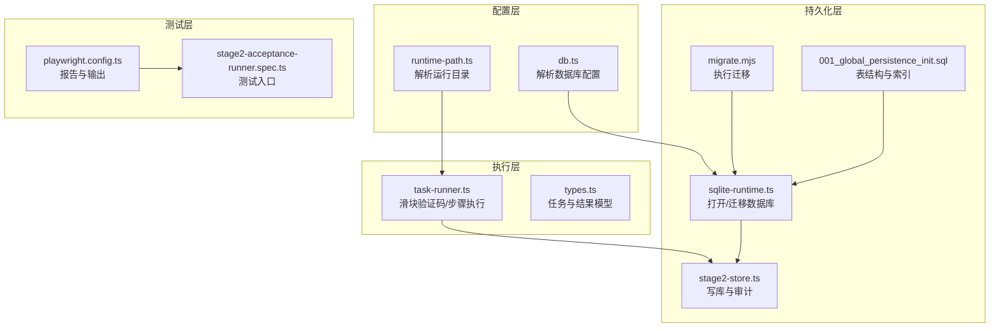
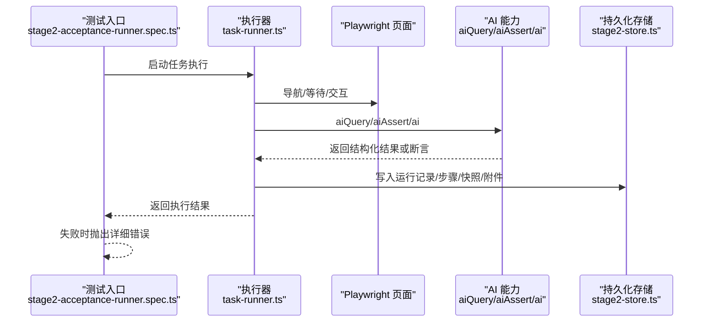
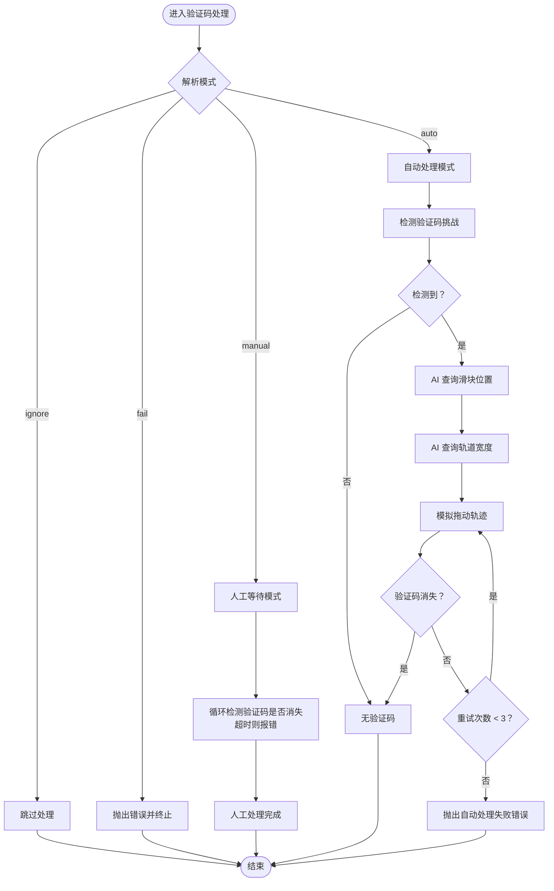
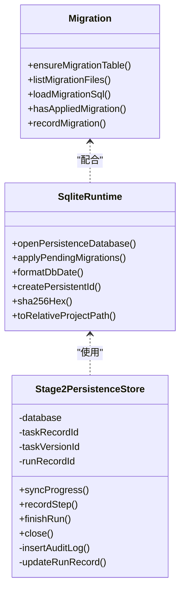
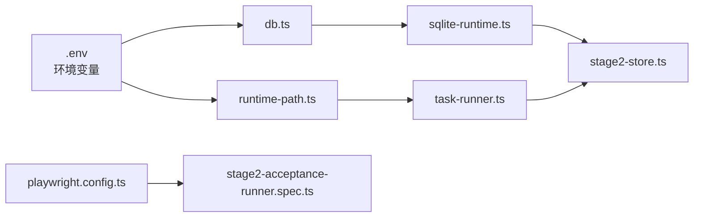

# 故障排除

<cite>
**本文引用的文件**
- [README.md](file://README.md)
- [package.json](file://package.json)
- [playwright.config.ts](file://playwright.config.ts)
- [config/runtime-path.ts](file://config/runtime-path.ts)
- [config/db.ts](file://config/db.ts)
- [src/persistence/sqlite-runtime.ts](file://src/persistence/sqlite-runtime.ts)
- [src/persistence/stage2-store.ts](file://src/persistence/stage2-store.ts)
- [scripts/db/common.mjs](file://scripts/db/common.mjs)
- [scripts/db/migrate.mjs](file://scripts/db/migrate.mjs)
- [db/migrations/001_global_persistence_init.sql](file://db/migrations/001_global_persistence_init.sql)
- [src/stage2/task-runner.ts](file://src/stage2/task-runner.ts)
- [src/stage2/types.ts](file://src/stage2/types.ts)
- [tests/generated/stage2-acceptance-runner.spec.ts](file://tests/generated/stage2-acceptance-runner.spec.ts)
</cite>

## 目录
1. [简介](#简介)
2. [项目结构](#项目结构)
3. [核心组件](#核心组件)
4. [架构总览](#架构总览)
5. [详细组件分析](#详细组件分析)
6. [依赖关系分析](#依赖关系分析)
7. [性能考虑](#性能考虑)
8. [故障排除指南](#故障排除指南)
9. [结论](#结论)
10. [附录](#附录)

## 简介
本指南面向运维与开发人员，聚焦 HI-TEST 项目在自动化验收执行过程中的常见问题与系统化排障方法。重点覆盖以下方面：
- 验证码处理失败（滑块验证码自动/人工/失败/忽略模式）
- AI 能力调用错误（aiQuery/aiAssert/ai 等）
- 数据库连接与迁移问题（SQLite 单文件）
- 日志分析、错误追踪与性能分析
- 调试工具使用（浏览器开发者工具、日志查看器、数据库客户端）
- 性能问题识别与优化（内存、网络、执行效率）
- 错误恢复与容错配置
- 监控指标与阈值建议
- 社区支持与问题反馈渠道

## 项目结构
项目采用分层组织：配置层（环境变量与运行目录）、持久化层（SQLite 与迁移）、执行层（第二段任务执行器与 AI/Playwright 集成）、测试层（Playwright 测试入口）。

**图表来源**
- [config/runtime-path.ts:1-41](file://config/runtime-path.ts#L1-L41)
- [config/db.ts:1-28](file://config/db.ts#L1-L28)
- [src/persistence/sqlite-runtime.ts:73-114](file://src/persistence/sqlite-runtime.ts#L73-L114)
- [scripts/db/migrate.mjs:1-52](file://scripts/db/migrate.mjs#L1-L52)
- [db/migrations/001_global_persistence_init.sql:1-128](file://db/migrations/001_global_persistence_init.sql#L1-L128)
- [src/persistence/stage2-store.ts:74-123](file://src/persistence/stage2-store.ts#L74-L123)
- [src/stage2/task-runner.ts:483-706](file://src/stage2/task-runner.ts#L483-L706)
- [src/stage2/types.ts:141-180](file://src/stage2/types.ts#L141-L180)
- [playwright.config.ts:22-95](file://playwright.config.ts#L22-L95)
- [tests/generated/stage2-acceptance-runner.spec.ts:1-39](file://tests/generated/stage2-acceptance-runner.spec.ts#L1-L39)

**章节来源**
- [README.md:1-223](file://README.md#L1-L223)
- [package.json:1-26](file://package.json#L1-L26)
- [playwright.config.ts:1-95](file://playwright.config.ts#L1-L95)
- [config/runtime-path.ts:1-41](file://config/runtime-path.ts#L1-L41)
- [config/db.ts:1-28](file://config/db.ts#L1-L28)
- [src/persistence/sqlite-runtime.ts:1-116](file://src/persistence/sqlite-runtime.ts#L1-L116)
- [src/persistence/stage2-store.ts:1-655](file://src/persistence/stage2-store.ts#L1-L655)
- [scripts/db/common.mjs:1-106](file://scripts/db/common.mjs#L1-L106)
- [scripts/db/migrate.mjs:1-52](file://scripts/db/migrate.mjs#L1-L52)
- [db/migrations/001_global_persistence_init.sql:1-128](file://db/migrations/001_global_persistence_init.sql#L1-L128)
- [src/stage2/task-runner.ts:1-800](file://src/stage2/task-runner.ts#L1-L800)
- [src/stage2/types.ts:1-180](file://src/stage2/types.ts#L1-L180)
- [tests/generated/stage2-acceptance-runner.spec.ts:1-39](file://tests/generated/stage2-acceptance-runner.spec.ts#L1-L39)

## 核心组件
- 运行目录与产物管理：通过环境变量集中控制 t_runtime/* 下的产物目录（Playwright 报告、Midscene 报告、结果与数据库文件）。
- 数据库与迁移：默认 SQLite 单文件，提供迁移脚本与表结构，支持外键约束与索引。
- 第二段执行器：负责任务加载、步骤执行、断言、截图与结果写库，并内置滑块验证码处理逻辑。
- 测试框架：Playwright 配置输出目录与 HTML 报告，测试入口负责失败时抛出详细错误信息。

**章节来源**
- [README.md:76-120](file://README.md#L76-L120)
- [config/runtime-path.ts:13-40](file://config/runtime-path.ts#L13-L40)
- [config/db.ts:20-26](file://config/db.ts#L20-L26)
- [src/persistence/sqlite-runtime.ts:73-114](file://src/persistence/sqlite-runtime.ts#L73-L114)
- [db/migrations/001_global_persistence_init.sql:1-128](file://db/migrations/001_global_persistence_init.sql#L1-L128)
- [src/stage2/task-runner.ts:483-706](file://src/stage2/task-runner.ts#L483-L706)
- [playwright.config.ts:22-40](file://playwright.config.ts#L22-L40)
- [tests/generated/stage2-acceptance-runner.spec.ts:12-37](file://tests/generated/stage2-acceptance-runner.spec.ts#L12-L37)

## 架构总览
系统围绕“任务 JSON -> 执行器 -> AI/Playwright -> 截图/报告 -> 写库”的闭环工作流展开。关键链路包括：
- 任务加载与上下文构建
- 页面交互与断言（含 AI 能力）
- 验证码挑战检测与处理（自动/人工/失败/忽略）
- 运行记录、步骤明细、快照与附件写库
- Playwright 报告与 Midscene 报告输出

**图表来源**
- [tests/generated/stage2-acceptance-runner.spec.ts:12-37](file://tests/generated/stage2-acceptance-runner.spec.ts#L12-L37)
- [src/stage2/task-runner.ts:1-200](file://src/stage2/task-runner.ts#L1-L200)
- [src/persistence/stage2-store.ts:470-630](file://src/persistence/stage2-store.ts#L470-L630)

## 详细组件分析

### 组件A：滑块验证码处理
- 模式解析：支持 auto/manual/fail/ignore 四种模式，分别对应自动处理、人工处理、失败终止、忽略检测。
- 检测策略：基于文本关键字与选择器组合检测页面是否存在验证码挑战。
- 自动处理：通过 AI 查询滑块位置与轨道宽度，模拟真人拖动轨迹（先快后慢、带抖动），最多重试 3 次。
- 人工兜底：在 manual 模式下，按超时阈值轮询验证码消失，超时则报错。

**图表来源**
- [src/stage2/task-runner.ts:61-75](file://src/stage2/task-runner.ts#L61-L75)
- [src/stage2/task-runner.ts:483-501](file://src/stage2/task-runner.ts#L483-L501)
- [src/stage2/task-runner.ts:561-648](file://src/stage2/task-runner.ts#L561-L648)
- [src/stage2/task-runner.ts:650-706](file://src/stage2/task-runner.ts#L650-L706)

**章节来源**
- [README.md:56-74](file://README.md#L56-L74)
- [src/stage2/task-runner.ts:483-706](file://src/stage2/task-runner.ts#L483-L706)

### 组件B：数据库与迁移
- 驱动与路径：默认 sqlite，路径由运行目录与 DB_FILE_PATH 组合解析。
- 打开数据库：启用外键约束，确保参照完整性。
- 迁移机制：schema_migrations 记录已执行迁移，逐个 SQL 文件执行并校验 checksum，失败回滚。
- 写库服务：统一写入 ai_task、ai_task_version、ai_run、ai_run_step、ai_snapshot、ai_artifact、ai_audit_log。

**图表来源**
- [src/persistence/sqlite-runtime.ts:73-114](file://src/persistence/sqlite-runtime.ts#L73-L114)
- [src/persistence/stage2-store.ts:74-123](file://src/persistence/stage2-store.ts#L74-L123)
- [scripts/db/common.mjs:47-106](file://scripts/db/common.mjs#L47-L106)
- [scripts/db/migrate.mjs:15-51](file://scripts/db/migrate.mjs#L15-L51)
- [db/migrations/001_global_persistence_init.sql:1-128](file://db/migrations/001_global_persistence_init.sql#L1-L128)

**章节来源**
- [config/db.ts:20-26](file://config/db.ts#L20-L26)
- [src/persistence/sqlite-runtime.ts:73-114](file://src/persistence/sqlite-runtime.ts#L73-L114)
- [src/persistence/stage2-store.ts:125-133](file://src/persistence/stage2-store.ts#L125-L133)
- [scripts/db/common.mjs:31-106](file://scripts/db/common.mjs#L31-L106)
- [scripts/db/migrate.mjs:15-51](file://scripts/db/migrate.mjs#L15-L51)
- [db/migrations/001_global_persistence_init.sql:1-128](file://db/migrations/001_global_persistence_init.sql#L1-L128)

### 组件C：测试入口与错误传播
- 测试入口设置整体超时与报告输出，失败时汇总最后失败步骤名称、消息与截图路径，便于快速定位。
- 执行器返回结果包含步骤明细与运行目录，便于定位产物与数据库记录。

**章节来源**
- [tests/generated/stage2-acceptance-runner.spec.ts:10-37](file://tests/generated/stage2-acceptance-runner.spec.ts#L10-L37)
- [src/stage2/types.ts:167-180](file://src/stage2/types.ts#L167-L180)

## 依赖关系分析
- 配置层依赖环境变量，运行目录与数据库路径均受其影响。
- 执行器依赖 Playwright 页面对象与 AI 能力接口，同时写库依赖 SQLite 运行时与迁移脚本。
- 测试层通过 Playwright 配置控制报告输出与追踪。

**图表来源**
- [config/runtime-path.ts:8-16](file://config/runtime-path.ts#L8-L16)
- [config/db.ts:10-22](file://config/db.ts#L10-L22)
- [src/stage2/task-runner.ts:1-20](file://src/stage2/task-runner.ts#L1-L20)
- [src/persistence/sqlite-runtime.ts:1-10](file://src/persistence/sqlite-runtime.ts#L1-L10)
- [src/persistence/stage2-store.ts:1-13](file://src/persistence/stage2-store.ts#L1-L13)
- [playwright.config.ts:4-6](file://playwright.config.ts#L4-L6)
- [tests/generated/stage2-acceptance-runner.spec.ts:1-3](file://tests/generated/stage2-acceptance-runner.spec.ts#L1-L3)

**章节来源**
- [README.md:39-54](file://README.md#L39-L54)
- [config/runtime-path.ts:8-16](file://config/runtime-path.ts#L8-L16)
- [config/db.ts:10-22](file://config/db.ts#L10-L22)
- [playwright.config.ts:22-40](file://playwright.config.ts#L22-L40)

## 性能考虑
- 内存与执行效率
  - 任务步骤尽量使用 Playwright 硬检测（如 getByRole/getByLabel），必要时再降级到 AI 结构化断言，避免过度依赖 AI。
  - 对表格断言优先尝试 Playwright 提取与代码比对，失败再降级到 AI，减少幻觉与耗时。
  - 控制截图与报告规模，仅在必要步骤开启截图，避免产生大量中间文件。
- 网络与外部依赖
  - AI 模型调用存在网络延迟与限流风险，建议在本地或内网部署时合理设置超时与重试策略。
  - 迁移与数据库写入为本地 IO，注意磁盘空间与并发写入导致的锁竞争。
- 运行时参数
  - 适当增大页面与步骤超时，避免因瞬时卡顿导致误判。
  - 在 CI 环境启用重试与并行度平衡，本地开发启用 headless 或 headed 模式按需切换。

[本节为通用指导，无需具体文件引用]

## 故障排除指南

### 一、验证码处理失败
- 现象
  - 自动模式多次尝试后仍失败；人工模式超时未完成。
- 排查步骤
  - 检查验证码检测模式与等待超时配置，必要时切换为 manual 并延长等待时间。
  - 查看 Midscene 报告与截图，确认滑块样式与选择器是否匹配。
  - 若自动失败，尝试增加重试次数或调整滑块检测选择器。
- 解决方案
  - 将 STAGE2_CAPTCHA_MODE 设为 manual 并调大 STAGE2_CAPTCHA_WAIT_TIMEOUT_MS。
  - 如需更强鲁棒性，将模式设为 fail 以便快速暴露问题。
- 参考实现
  - 模式解析与等待逻辑、自动处理与重试、人工等待轮询与超时。

**章节来源**
- [README.md:56-74](file://README.md#L56-L74)
- [src/stage2/task-runner.ts:61-75](file://src/stage2/task-runner.ts#L61-L75)
- [src/stage2/task-runner.ts:650-706](file://src/stage2/task-runner.ts#L650-L706)
- [src/stage2/task-runner.ts:561-648](file://src/stage2/task-runner.ts#L561-L648)

### 二、AI 能力调用错误
- 现象
  - aiQuery/aiAssert/ai 返回空或报错；断言失败但页面状态正常。
- 排查步骤
  - 检查模型配置（OPENAI_API_KEY、BASE_URL、MODEL_NAME）与网络连通性。
  - 查看 Midscene 报告与截图，确认页面元素是否被 AI 正确识别。
  - 降低断言复杂度，先用 Playwright 硬检测，再用 AI 辅助。
- 解决方案
  - 优化提示词与上下文，必要时拆分断言步骤。
  - 对不稳定断言使用软断言（soft=true）并记录快照，便于事后复盘。
- 参考实现
  - 断言执行与降级策略、AI 通用断言回退。

**章节来源**
- [README.md:35-47](file://README.md#L35-L47)
- [src/stage2/task-runner.ts:1873-1917](file://src/stage2/task-runner.ts#L1873-L1917)

### 三、数据库连接与迁移问题
- 现象
  - 初始化/迁移时报错；数据库文件无法打开；迁移重复执行或失败。
- 排查步骤
  - 确认 DB_DRIVER 为 sqlite，DB_FILE_PATH 指向正确路径。
  - 检查 t_runtime/db/hi_test.sqlite 是否存在且可写。
  - 查看 schema_migrations 是否存在，迁移文件是否已执行。
- 解决方案
  - 使用 npm run db:init 或 npm run db:migrate 重新初始化/迁移。
  - 如需修复迁移，删除 schema_migrations 中对应条目后重试。
- 参考实现
  - 数据库打开与外键约束、迁移执行与回滚、写库与审计。

**章节来源**
- [config/db.ts:20-26](file://config/db.ts#L20-L26)
- [src/persistence/sqlite-runtime.ts:73-114](file://src/persistence/sqlite-runtime.ts#L73-L114)
- [scripts/db/common.mjs:47-106](file://scripts/db/common.mjs#L47-L106)
- [scripts/db/migrate.mjs:15-51](file://scripts/db/migrate.mjs#L15-L51)
- [db/migrations/001_global_persistence_init.sql:44-57](file://db/migrations/001_global_persistence_init.sql#L44-L57)
- [src/persistence/stage2-store.ts:305-356](file://src/persistence/stage2-store.ts#L305-L356)

### 四、日志分析与错误追踪
- 日志来源
  - 控制台输出（滑块处理、AI 查询、数据库写库等）。
  - Playwright HTML 报告与 Midscene 报告。
  - 失败测试入口会输出最后失败步骤名称、消息与截图路径。
- 追踪要点
  - 以“最后失败步骤”为线索，结合截图与报告定位页面状态。
  - 关注数据库写库记录（ai_run、ai_run_step、ai_audit_log）中的事件与错误信息。
- 参考实现
  - 失败信息聚合与抛出、写库审计日志。

**章节来源**
- [tests/generated/stage2-acceptance-runner.spec.ts:27-36](file://tests/generated/stage2-acceptance-runner.spec.ts#L27-L36)
- [src/persistence/stage2-store.ts:305-356](file://src/persistence/stage2-store.ts#L305-L356)

### 五、调试工具使用
- 浏览器开发者工具
  - 在 headed 模式下观察页面元素、网络请求与控制台错误。
- 日志查看器
  - 查看 t_runtime/* 下的报告与日志，定位执行阶段与错误点。
- 数据库客户端
  - 使用 SQLite 客户端连接 hi_test.sqlite，查询 ai_run、ai_run_step、ai_audit_log 等表核对执行状态与错误详情。

**章节来源**
- [README.md:154-189](file://README.md#L154-L189)
- [playwright.config.ts:36-40](file://playwright.config.ts#L36-L40)

### 六、性能问题识别与优化
- 内存泄漏
  - 避免在循环中累积大对象；及时释放截图与报告文件句柄。
- 网络延迟
  - 为 AI 请求设置合理超时与重试；在本地部署模型以降低延迟。
- 执行效率
  - 减少不必要的截图与报告；优先使用 Playwright 硬检测；合并相似步骤。

**章节来源**
- [README.md:146-152](file://README.md#L146-L152)

### 七、错误恢复与容错机制
- 验证码容错
  - auto：自动处理失败时可重试；manual：延长等待时间；fail：快速失败；ignore：忽略检测（不建议）。
- 断言容错
  - 使用软断言（soft=true）与降级策略，避免单点失败阻塞全流程。
- 数据库容错
  - 写库采用事务与回滚保护；失败时记录审计日志，便于回溯。

**章节来源**
- [README.md:56-74](file://README.md#L56-L74)
- [src/stage2/task-runner.ts:650-706](file://src/stage2/task-runner.ts#L650-L706)
- [src/stage2/task-runner.ts:1873-1917](file://src/stage2/task-runner.ts#L1873-L1917)
- [src/persistence/stage2-store.ts:125-133](file://src/persistence/stage2-store.ts#L125-L133)

### 八、监控指标与阈值建议
- 执行时长
  - ai_run.duration_ms：单次任务总耗时；超过阈值需优化步骤或外部依赖。
- 步骤失败率
  - ai_run_step.status 分布：失败率过高需检查断言与页面稳定性。
- 数据库写入耗时
  - 写库事务耗时与磁盘 IO；关注 schema_migrations 与大文件写入。
- 报告与截图大小
  - ai_artifact.file_size：过大可能影响 IO 与存储成本。

**章节来源**
- [db/migrations/001_global_persistence_init.sql:32-57](file://db/migrations/001_global_persistence_init.sql#L32-L57)
- [db/migrations/001_global_persistence_init.sql:59-77](file://db/migrations/001_global_persistence_init.sql#L59-L77)
- [db/migrations/001_global_persistence_init.sql:93-107](file://db/migrations/001_global_persistence_init.sql#L93-L107)
- [src/persistence/stage2-store.ts:592-630](file://src/persistence/stage2-store.ts#L592-L630)

### 九、社区支持与问题反馈
- 项目文档与示例：参见 README 与任务模板。
- GitHub 工作流与 Chat 模式：可参考仓库中相关配置与示例，用于系统化调试与修复。

**章节来源**
- [README.md:1-223](file://README.md#L1-L223)

## 结论
通过系统化的配置管理、完善的数据库与迁移机制、可扩展的执行器与 AI 能力集成，以及清晰的日志与报告体系，HI-TEST 能够在复杂 Web 平台环境下稳定执行验收任务。建议在生产环境中：
- 明确验证码处理策略与超时阈值
- 优化断言策略，减少对 AI 的依赖
- 建立数据库监控与备份机制
- 使用报告与审计日志进行持续改进

[本节为总结性内容，无需具体文件引用]

## 附录

### A. 常用命令与产物路径
- 初始化/迁移数据库：npm run db:init | db:migrate
- 运行第二段：npm run stage2:run | stage2:run:headed
- 产物目录：t_runtime 下的 test-results、playwright-report、midscene_run、acceptance-results、db

**章节来源**
- [package.json:6-11](file://package.json#L6-L11)
- [README.md:120-189](file://README.md#L120-L189)

### B. 关键环境变量
- DB_DRIVER、DB_FILE_PATH：数据库驱动与文件路径
- RUNTIME_DIR_PREFIX、PLAYWRIGHT_OUTPUT_DIR、PLAYWRIGHT_HTML_REPORT_DIR、MIDSCENE_RUN_DIR、ACCEPTANCE_RESULT_DIR：运行目录与产物路径
- STAGE2_CAPTCHA_MODE、STAGE2_CAPTCHA_WAIT_TIMEOUT_MS：验证码处理模式与等待超时
- OPENAI_API_KEY、OPENAI_BASE_URL、MIDSCENE_MODEL_NAME：AI 模型接入参数

**章节来源**
- [README.md:39-54](file://README.md#L39-L54)
- [config/runtime-path.ts:13-36](file://config/runtime-path.ts#L13-L36)
- [config/db.ts:20-26](file://config/db.ts#L20-L26)