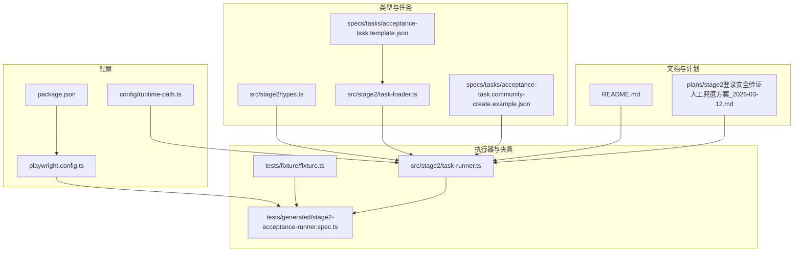
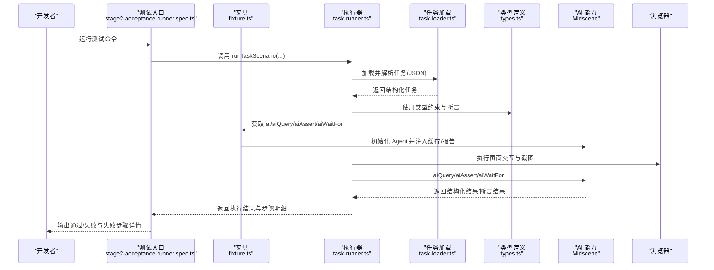
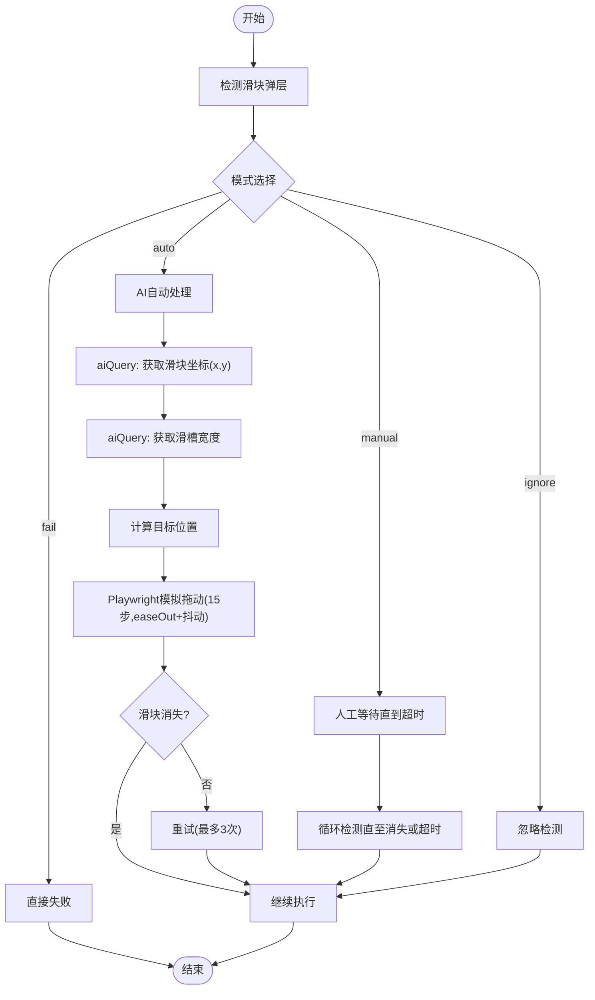
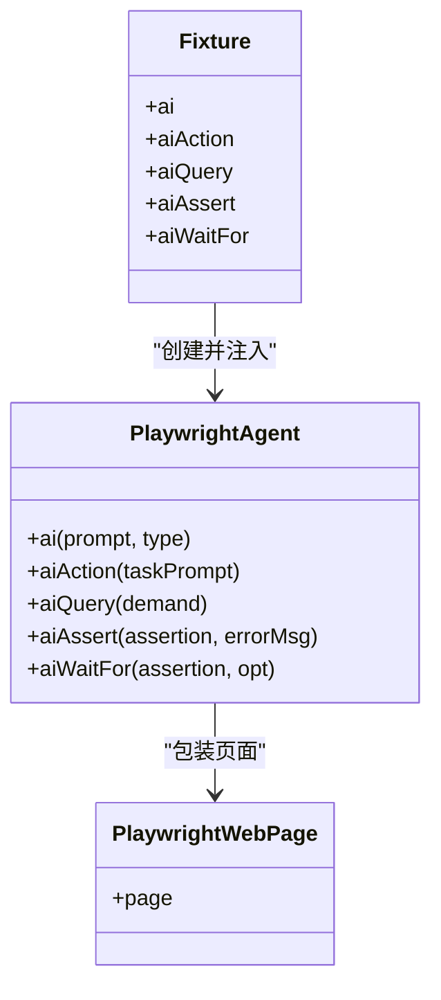
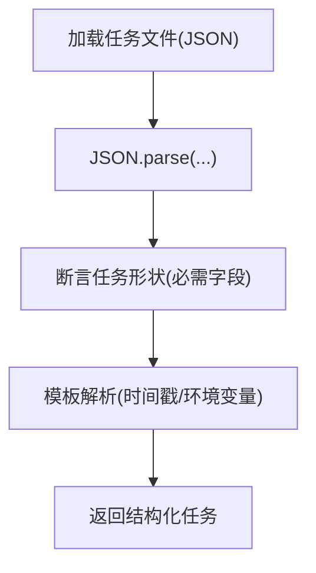
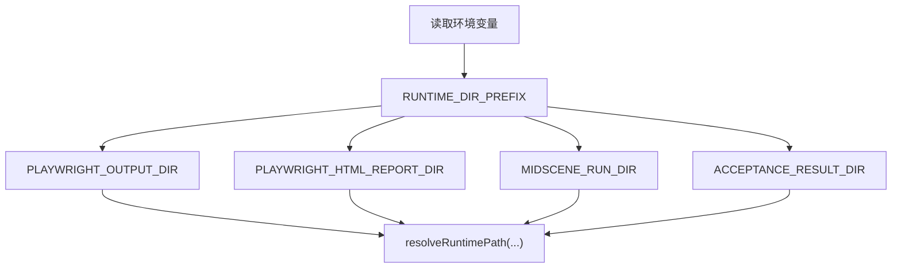
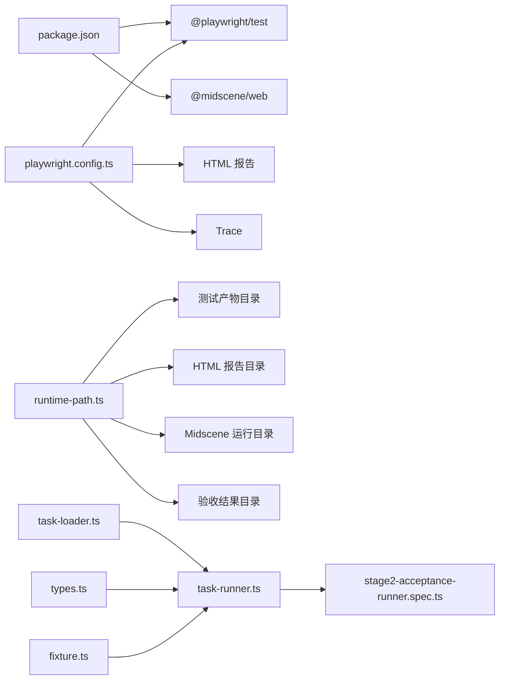

# AI 断言验证

<cite>
**本文引用的文件**
- [README.md](file://README.md)
- [package.json](file://package.json)
- [playwright.config.ts](file://playwright.config.ts)
- [config/runtime-path.ts](file://config/runtime-path.ts)
- [src/stage2/types.ts](file://src/stage2/types.ts)
- [src/stage2/task-loader.ts](file://src/stage2/task-loader.ts)
- [src/stage2/task-runner.ts](file://src/stage2/task-runner.ts)
- [tests/fixture/fixture.ts](file://tests/fixture/fixture.ts)
- [tests/generated/stage2-acceptance-runner.spec.ts](file://tests/generated/stage2-acceptance-runner.spec.ts)
- [specs/tasks/acceptance-task.community-create.example.json](file://specs/tasks/acceptance-task.community-create.example.json)
- [specs/tasks/acceptance-task.template.json](file://specs/tasks/acceptance-task.template.json)
- [.plans/stage2登录安全验证人工兜底方案_2026-03-12.md](file://.plans/stage2登录安全验证人工兜底方案_2026-03-12.md)
</cite>

## 目录
1. [简介](#简介)
2. [项目结构](#项目结构)
3. [核心组件](#核心组件)
4. [架构总览](#架构总览)
5. [详细组件分析](#详细组件分析)
6. [依赖关系分析](#依赖关系分析)
7. [性能考虑](#性能考虑)
8. [故障排除指南](#故障排除指南)
9. [结论](#结论)
10. [附录](#附录)

## 简介
本指南面向构建与维护基于 AI 的断言验证系统的开发者，围绕以下主题提供系统化的排障方法与最佳实践：
- 语义理解偏差的诊断与修复：提示词优化、上下文增强、多轮对话处理
- 阈值设置不当的调整策略：相似度阈值优化、置信度判断、动态阈值计算
- 多模态数据融合问题：文本图像对齐、特征向量组合、权重分配
- 断言失败的分析技巧：错误分类、失败模式识别、根因分析
- 性能优化：批量处理、缓存策略、并发控制
- 断言配置示例与常见问题解决步骤

本项目以 Playwright 与 Midscene.js 为基础，提供“AI 描述步骤并执行交互”“AI 提取结构化数据”“AI 断言”的能力，并通过 JSON 任务驱动第二段执行器，内置滑块验证码自动处理与人工兜底方案。

## 项目结构
项目采用“配置 + 类型 + 执行器 + 夹具 + 测试入口 + 示例任务”的分层组织方式，便于扩展与维护。

图表来源
- [config/runtime-path.ts](file://config/runtime-path.ts#L1-L41)
- [playwright.config.ts](file://playwright.config.ts#L1-L95)
- [src/stage2/types.ts](file://src/stage2/types.ts#L1-L125)
- [src/stage2/task-loader.ts](file://src/stage2/task-loader.ts#L1-L91)
- [src/stage2/task-runner.ts](file://src/stage2/task-runner.ts#L1-L800)
- [tests/fixture/fixture.ts](file://tests/fixture/fixture.ts#L1-L100)
- [tests/generated/stage2-acceptance-runner.spec.ts](file://tests/generated/stage2-acceptance-runner.spec.ts#L1-L39)
- [specs/tasks/acceptance-task.community-create.example.json](file://specs/tasks/acceptance-task.community-create.example.json#L1-L184)
- [specs/tasks/acceptance-task.template.json](file://specs/tasks/acceptance-task.template.json#L1-L85)
- [README.md](file://README.md#L1-L144)
- [.plans/stage2登录安全验证人工兜底方案_2026-03-12.md](file://.plans/stage2登录安全验证人工兜底方案_2026-03-12.md#L1-L57)

章节来源
- [README.md](file://README.md#L1-L144)
- [package.json](file://package.json#L1-L24)
- [playwright.config.ts](file://playwright.config.ts#L1-L95)
- [config/runtime-path.ts](file://config/runtime-path.ts#L1-L41)

## 核心组件
- 运行时路径解析：集中管理 t_runtime 目录族（测试产物、HTML 报告、Midscene 运行日志、验收结果），支持通过环境变量覆盖。
- 任务加载与模板解析：从 JSON 任务文件加载并解析模板字符串（如时间戳占位符），校验任务结构完整性。
- 第二段执行器：封装页面交互、AI 查询与断言、滑块验证码处理、步骤截图与结果记录。
- Playwright + Midscene 夹具：为测试提供 ai/aiQuery/aiAssert/aiWaitFor 等 AI 能力，并启用缓存与报告。
- 测试入口：以 JSON 任务驱动执行器，失败时输出最后失败步骤的详细信息与截图路径。

章节来源
- [config/runtime-path.ts](file://config/runtime-path.ts#L1-L41)
- [src/stage2/task-loader.ts](file://src/stage2/task-loader.ts#L1-L91)
- [src/stage2/task-runner.ts](file://src/stage2/task-runner.ts#L1-L800)
- [tests/fixture/fixture.ts](file://tests/fixture/fixture.ts#L1-L100)
- [tests/generated/stage2-acceptance-runner.spec.ts](file://tests/generated/stage2-acceptance-runner.spec.ts#L1-L39)

## 架构总览
系统以“配置 → 类型 → 任务 → 执行器 → 夹具 → 测试入口”的链路工作，AI 能力通过 Midscene 注入到 Playwright 测试中，形成“结构化提示 + 结构化断言”的闭环。

图表来源
- [tests/generated/stage2-acceptance-runner.spec.ts](file://tests/generated/stage2-acceptance-runner.spec.ts#L1-L39)
- [tests/fixture/fixture.ts](file://tests/fixture/fixture.ts#L1-L100)
- [src/stage2/task-runner.ts](file://src/stage2/task-runner.ts#L1-L800)
- [src/stage2/task-loader.ts](file://src/stage2/task-loader.ts#L1-L91)
- [src/stage2/types.ts](file://src/stage2/types.ts#L1-L125)

## 详细组件分析

### 组件一：滑块验证码自动处理（AI + Playwright）
该组件负责在登录或后续步骤中检测阻塞性安全验证，并提供自动拖动与人工兜底两种模式。

图表来源
- [src/stage2/task-runner.ts](file://src/stage2/task-runner.ts#L480-L703)
- [.plans/stage2登录安全验证人工兜底方案_2026-03-12.md](file://.plans/stage2登录安全验证人工兜底方案_2026-03-12.md#L1-L57)

章节来源
- [src/stage2/task-runner.ts](file://src/stage2/task-runner.ts#L480-L703)
- [.plans/stage2登录安全验证人工兜底方案_2026-03-12.md](file://.plans/stage2登录安全验证人工兜底方案_2026-03-12.md#L1-L57)

### 组件二：AI 断言与查询（aiAssert/aiQuery）
夹具将 Midscene Agent 注入到测试中，提供 ai/aiQuery/aiAssert/aiWaitFor 能力，并启用缓存与报告生成，便于定位断言失败与调试。

图表来源
- [tests/fixture/fixture.ts](file://tests/fixture/fixture.ts#L1-L100)

章节来源
- [tests/fixture/fixture.ts](file://tests/fixture/fixture.ts#L1-L100)

### 组件三：任务加载与模板解析
任务加载器负责：
- 解析任务文件路径（支持绝对/相对路径与默认值）
- 模板字符串替换（如时间戳占位符）
- 严格校验任务结构（缺失字段直接报错）

图表来源
- [src/stage2/task-loader.ts](file://src/stage2/task-loader.ts#L71-L91)

章节来源
- [src/stage2/task-loader.ts](file://src/stage2/task-loader.ts#L1-L91)

### 组件四：运行时路径与产物目录
运行时路径解析集中管理 t_runtime 下的各类目录，支持通过环境变量覆盖，保证产物目录统一收敛。

图表来源
- [config/runtime-path.ts](file://config/runtime-path.ts#L8-L40)

章节来源
- [config/runtime-path.ts](file://config/runtime-path.ts#L1-L41)

## 依赖关系分析
- 测试框架：Playwright（测试执行、报告、追踪）
- AI 能力：Midscene.js（AI 查询、断言、等待、报告）
- 配置与运行：dotenv（环境变量）、运行时路径解析
- 任务驱动：JSON 任务文件 + 类型约束 + 执行器

图表来源
- [package.json](file://package.json#L1-L24)
- [playwright.config.ts](file://playwright.config.ts#L1-L95)
- [config/runtime-path.ts](file://config/runtime-path.ts#L1-L41)
- [src/stage2/task-loader.ts](file://src/stage2/task-loader.ts#L1-L91)
- [src/stage2/task-runner.ts](file://src/stage2/task-runner.ts#L1-L800)
- [src/stage2/types.ts](file://src/stage2/types.ts#L1-L125)
- [tests/fixture/fixture.ts](file://tests/fixture/fixture.ts#L1-L100)
- [tests/generated/stage2-acceptance-runner.spec.ts](file://tests/generated/stage2-acceptance-runner.spec.ts#L1-L39)

章节来源
- [package.json](file://package.json#L1-L24)
- [playwright.config.ts](file://playwright.config.ts#L1-L95)
- [config/runtime-path.ts](file://config/runtime-path.ts#L1-L41)

## 性能考虑
- 并发与重试
  - Playwright 配置支持并行测试与按 CI 环境调整 workers，建议在本地禁用并行以提升稳定性，CI 环境适度开启。
  - 重试策略仅在 CI 环境启用，减少偶发失败影响。
- 超时与等待
  - 任务运行器提供 step/page 超时配置与滑块等待超时控制，建议结合业务页面复杂度合理设置。
- 缓存与报告
  - 夹具启用 Midscene Agent 的缓存与报告生成，有助于减少重复请求与问题定位。
- 截图与追踪
  - 运行时可开启每步截图与 trace，便于失败分析，但会增加 IO 与存储开销。

章节来源
- [playwright.config.ts](file://playwright.config.ts#L22-L95)
- [tests/fixture/fixture.ts](file://tests/fixture/fixture.ts#L23-L99)
- [src/stage2/task-runner.ts](file://src/stage2/task-runner.ts#L119-L126)
- [.plans/stage2登录安全验证人工兜底方案_2026-03-12.md](file://.plans/stage2登录安全验证人工兜底方案_2026-03-12.md#L1-L57)

## 故障排除指南

### 一、语义理解偏差的诊断与修复
- 症状
  - AI 查询/断言无法准确提取结构化数据或做出正确判断
- 诊断步骤
  - 明确上下文边界：在提示词中限定作用域（如“在弹窗‘XXX’中”“在表格中”）
  - 强化关键词与结构化输出要求：要求返回固定键名与格式
  - 多轮对话：先查询再断言，逐步缩小范围
  - 对比正反例：构造“应该/不应该”的样例，帮助模型学习边界
- 修复建议
  - 为 aiQuery/aiAssert 提供更清晰的“角色 + 任务 + 输出格式”提示
  - 在任务模板中补充“字段所在区域的辅助描述”“占位文案”等上下文
  - 使用“先查询后断言”的顺序，避免一次性复杂推理导致偏差

章节来源
- [src/stage2/task-runner.ts](file://src/stage2/task-runner.ts#L507-L556)
- [specs/tasks/acceptance-task.community-create.example.json](file://specs/tasks/acceptance-task.community-create.example.json#L48-L78)
- [specs/tasks/acceptance-task.template.json](file://specs/tasks/acceptance-task.template.json#L12-L44)

### 二、阈值设置不当的调整策略
- 症状
  - 断言频繁误判或漏判；相似度阈值过高导致敏感度不足，过低导致噪声过多
- 调整策略
  - 相似度阈值优化：以“召回率/精确率”为目标，结合业务容忍度进行网格搜索
  - 置信度判断：引入置信度阈值过滤低置信度结果，必要时二次校验
  - 动态阈值计算：基于历史命中率与误报率动态调整，或按页面复杂度分层设置
- 实践建议
  - 在任务运行器中为 aiQuery/aiAssert 增加可配置的阈值参数（如相似度、置信度）
  - 为不同页面/组件设定差异化阈值，避免一刀切

章节来源
- [src/stage2/task-runner.ts](file://src/stage2/task-runner.ts#L507-L556)
- [src/stage2/types.ts](file://src/stage2/types.ts#L58-L65)

### 三、多模态数据融合问题
- 症状
  - 文本与图像对齐不准确；特征向量组合权重不合理；断言结果不稳定
- 解决方案
  - 文本图像对齐：在提示词中强制要求返回坐标/区域信息，确保文本与视觉锚点一致
  - 特征向量组合：对文本嵌入与视觉特征进行加权融合（如加权求和/注意力聚合）
  - 权重分配：以业务指标（如命中率、误报率）为反馈信号，迭代优化权重
- 实践建议
  - 在 aiQuery 中显式要求返回“位置/区域/置信度”，便于后续融合
  - 为不同模态设置独立阈值与权重，再进行融合层决策

章节来源
- [src/stage2/task-runner.ts](file://src/stage2/task-runner.ts#L507-L556)
- [tests/fixture/fixture.ts](file://tests/fixture/fixture.ts#L57-L98)

### 四、断言失败的分析技巧
- 错误分类
  - 选择器/定位失败：页面结构变化或选择器不匹配
  - 语义理解失败：提示词不够明确或上下文不足
  - 时序问题：元素尚未出现或状态未稳定
  - 阈值问题：相似度/置信度过高或过低
- 失败模式识别
  - 观察最后失败步骤：测试入口会输出失败步骤名称、消息与截图路径
  - 查看 Midscene 报告与 Playwright HTML 报告，定位具体页面与交互点
- 根因分析
  - 逐步回放：从失败步骤向前回溯，确认前置步骤是否成功
  - 模板变量：检查任务模板中的时间戳/环境变量是否正确解析
  - 滑块验证码：确认模式配置与等待超时是否合理

章节来源
- [tests/generated/stage2-acceptance-runner.spec.ts](file://tests/generated/stage2-acceptance-runner.spec.ts#L27-L36)
- [README.md](file://README.md#L74-L116)
- [src/stage2/task-runner.ts](file://src/stage2/task-runner.ts#L647-L703)

### 五、性能优化
- 批量处理
  - 合理合并多次交互为一次动作序列，减少页面往返
  - 对多个断言进行批量化执行，避免重复截图与查询
- 缓存策略
  - 利用夹具的缓存 ID 与缓存目录，避免重复 AI 请求
  - 对稳定不变的查询结果进行本地缓存与版本化管理
- 并发控制
  - 本地开发禁用并行，CI 环境按需启用 workers
  - 对共享资源（如登录态、全局弹层）进行串行化处理

章节来源
- [tests/fixture/fixture.ts](file://tests/fixture/fixture.ts#L23-L99)
- [playwright.config.ts](file://playwright.config.ts#L22-L95)

### 六、断言配置示例与常见问题
- 断言配置示例
  - 表格断言：在任务 JSON 中声明断言类型与匹配字段，如“toast”“table-row-exists”“table-cell-equals”“table-cell-contains”
  - 运行时配置：在 runtime 字段中设置 step/page 超时、截图开关与 trace
- 常见问题与解决步骤
  - 任务文件缺失字段：确保 taskId、taskName、target.url、account、form 等关键字段齐全
  - 滑块验证码自动失败：检查 AI 图像识别提示词、拖动轨迹参数与重试次数；必要时切换为 manual 模式
  - 截图与报告不可见：确认运行产物目录与环境变量配置，查看 t_runtime 下对应子目录

章节来源
- [specs/tasks/acceptance-task.community-create.example.json](file://specs/tasks/acceptance-task.community-create.example.json#L140-L182)
- [specs/tasks/acceptance-task.template.json](file://specs/tasks/acceptance-task.template.json#L58-L83)
- [src/stage2/task-loader.ts](file://src/stage2/task-loader.ts#L50-L69)
- [README.md](file://README.md#L74-L131)

## 结论
本指南从系统架构、核心组件、性能优化与故障排除四个维度，提供了针对 AI 断言验证的实操方法与最佳实践。通过明确的提示词设计、合理的阈值策略、稳健的多模态融合与完善的性能控制，可显著提升断言的准确性与稳定性。建议在实际项目中：
- 将断言失败分析流程标准化，沉淀失败模式与修复清单
- 建立阈值与权重的灰度发布与回滚机制
- 强化任务模板的上下文描述，降低语义理解偏差
- 结合缓存与并发策略，在保证稳定性的同时提升吞吐

## 附录
- 环境变量与运行产物
  - 运行产物目录由 .env 与 runtime-path.ts 统一管理，建议在 CI 与本地保持一致
- 任务文件模板
  - 使用 template.json 作为起点，按需填充字段与断言
- 滑块验证码处理
  - 默认自动模式，失败可回退至人工等待或 fail/ignore 模式

章节来源
- [README.md](file://README.md#L31-L91)
- [config/runtime-path.ts](file://config/runtime-path.ts#L8-L40)
- [specs/tasks/acceptance-task.template.json](file://specs/tasks/acceptance-task.template.json#L1-L85)
- [.plans/stage2登录安全验证人工兜底方案_2026-03-12.md](file://.plans/stage2登录安全验证人工兜底方案_2026-03-12.md#L1-L57)