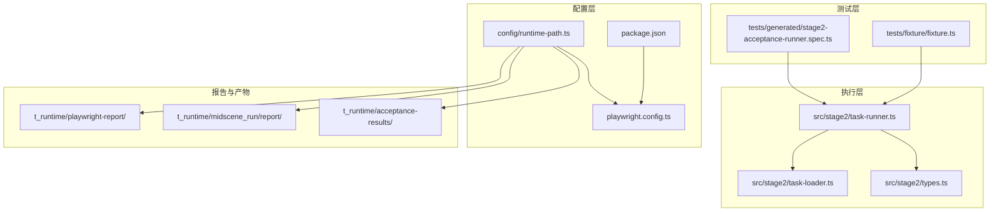
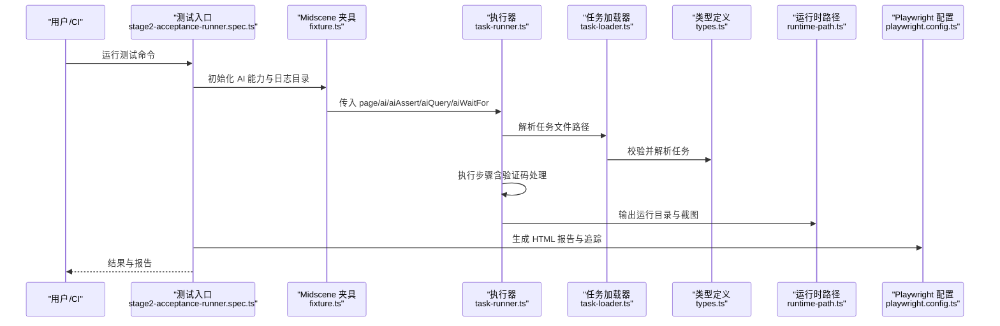
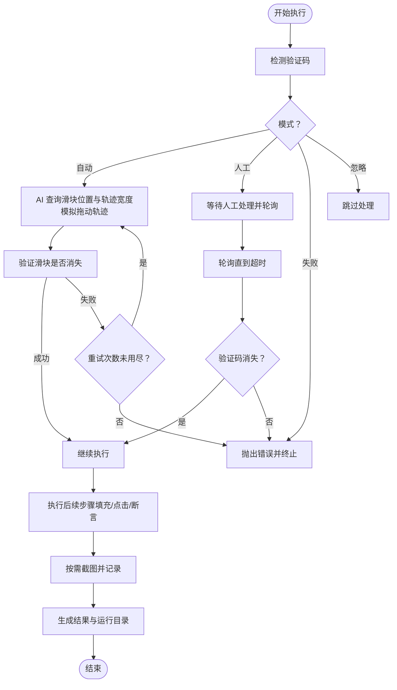
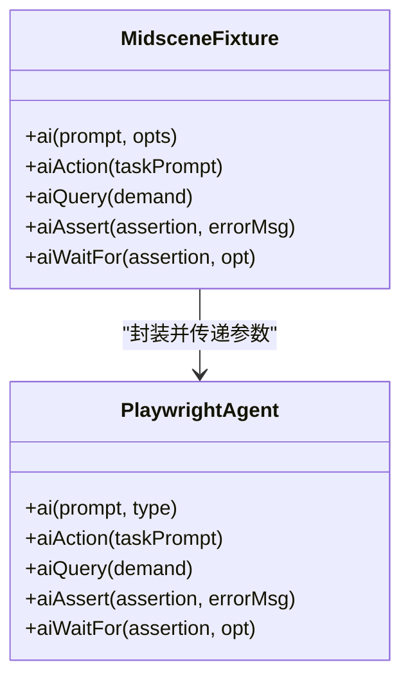
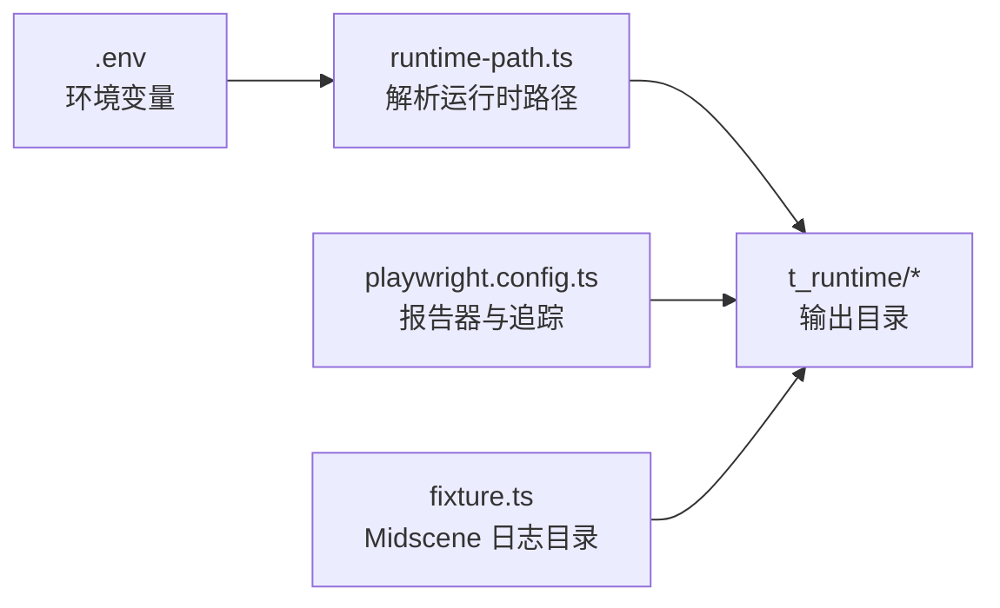
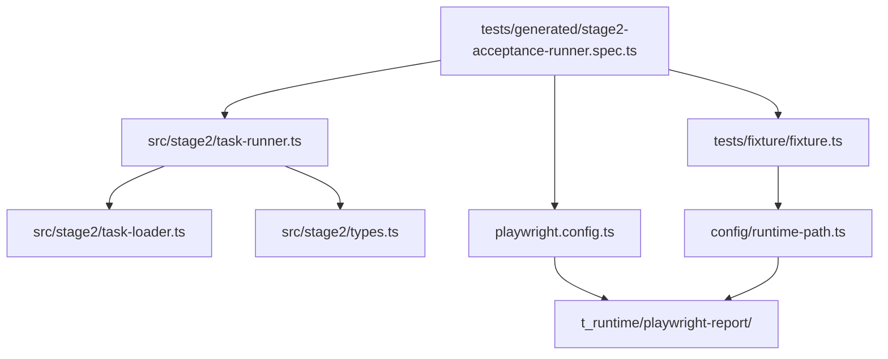

# AI 日志监控

<cite>
**本文引用的文件**
- [README.md](file://README.md)
- [package.json](file://package.json)
- [playwright.config.ts](file://playwright.config.ts)
- [config/runtime-path.ts](file://config/runtime-path.ts)
- [src/stage2/types.ts](file://src/stage2/types.ts)
- [src/stage2/task-runner.ts](file://src/stage2/task-runner.ts)
- [src/stage2/task-loader.ts](file://src/stage2/task-loader.ts)
- [tests/generated/stage2-acceptance-runner.spec.ts](file://tests/generated/stage2-acceptance-runner.spec.ts)
- [tests/fixture/fixture.ts](file://tests/fixture/fixture.ts)
- [.tasks/AI自主代理验收系统开发改造方案_2026-03-11.md](file://.tasks/AI自主代理验收系统开发改造方案_2026-03-11.md)
- [specs/basic-operations.md](file://specs/basic-operations.md)
- [specs/login-e2e.md](file://specs/login-e2e.md)
</cite>

## 目录
1. [简介](#简介)
2. [项目结构](#项目结构)
3. [核心组件](#核心组件)
4. [架构总览](#架构总览)
5. [详细组件分析](#详细组件分析)
6. [依赖关系分析](#依赖关系分析)
7. [性能考量](#性能考量)
8. [故障排除指南](#故障排除指南)
9. [结论](#结论)
10. [附录](#附录)

## 简介
本指南面向使用 Playwright 与 Midscene 的 AI 自动化测试项目，围绕“AI 日志监控”的主题，提供一套可落地的故障排除与运维实践，涵盖：
- 日志级别与关键信息提取
- 异常模式识别与定位
- 性能监控（执行时间、资源使用、吞吐量）
- 日志聚合与分析（格式标准化、索引与查询优化）
- 实时监控与告警（阈值、规则、通知）
- 日志清理与归档（保留周期、存储优化、备份）
- 监控仪表板与预警机制配置建议

本项目已内置运行产物目录与报告输出，便于统一采集日志与截图，为后续日志监控体系打下基础。

## 项目结构
该项目采用“测试框架 + AI 能力 + 统一运行目录”的组织方式：
- 测试层：Playwright 测试与 Midscene 夹具
- 执行层：第二段任务执行器（JSON 驱动）
- 配置层：运行时路径解析与环境变量
- 报告层：Playwright HTML 报告与 Midscene 报告

图表来源
- [tests/generated/stage2-acceptance-runner.spec.ts](file://tests/generated/stage2-acceptance-runner.spec.ts#L1-L39)
- [tests/fixture/fixture.ts](file://tests/fixture/fixture.ts#L1-L100)
- [src/stage2/task-runner.ts](file://src/stage2/task-runner.ts#L1-L120)
- [src/stage2/task-loader.ts](file://src/stage2/task-loader.ts#L1-L91)
- [src/stage2/types.ts](file://src/stage2/types.ts#L1-L125)
- [config/runtime-path.ts](file://config/runtime-path.ts#L1-L41)
- [playwright.config.ts](file://playwright.config.ts#L1-L95)
- [package.json](file://package.json#L1-L24)

章节来源
- [README.md](file://README.md#L74-L131)
- [config/runtime-path.ts](file://config/runtime-path.ts#L1-L41)
- [playwright.config.ts](file://playwright.config.ts#L22-L48)

## 核心组件
- 运行产物目录统一管理：通过环境变量与运行时路径解析，集中输出测试结果、HTML 报告、Midscene 报告与截图。
- 第二段执行器：负责加载任务、执行步骤、处理验证码、截图与结果记录。
- Midscene 夹具：封装 AI 能力（动作、查询、断言、等待），并设置日志目录。
- Playwright 配置：定义超时、并行、重试、报告器与追踪策略。

章节来源
- [README.md](file://README.md#L74-L131)
- [config/runtime-path.ts](file://config/runtime-path.ts#L18-L36)
- [tests/fixture/fixture.ts](file://tests/fixture/fixture.ts#L10-L100)
- [src/stage2/task-runner.ts](file://src/stage2/task-runner.ts#L58-L84)
- [playwright.config.ts](file://playwright.config.ts#L22-L48)

## 架构总览
下图展示了从测试入口到执行器、再到报告与日志输出的整体流程。

图表来源
- [tests/generated/stage2-acceptance-runner.spec.ts](file://tests/generated/stage2-acceptance-runner.spec.ts#L10-L37)
- [tests/fixture/fixture.ts](file://tests/fixture/fixture.ts#L23-L98)
- [src/stage2/task-runner.ts](file://src/stage2/task-runner.ts#L647-L703)
- [src/stage2/task-loader.ts](file://src/stage2/task-loader.ts#L71-L89)
- [src/stage2/types.ts](file://src/stage2/types.ts#L86-L98)
- [config/runtime-path.ts](file://config/runtime-path.ts#L38-L40)
- [playwright.config.ts](file://playwright.config.ts#L36-L40)

## 详细组件分析

### 组件A：第二段执行器（task-runner）
职责与关键点：
- 验证码处理：支持自动、人工、失败、忽略四种模式，具备重试与超时控制。
- 步骤执行与截图：每个步骤记录开始/结束时间、耗时、截图路径与错误信息。
- 运行目录：按任务 ID 与时间戳生成唯一运行目录，统一存放结果与截图。
- AI 查询与断言：通过 Midscene 能力进行结构化提取与断言。

图表来源
- [src/stage2/task-runner.ts](file://src/stage2/task-runner.ts#L58-L84)
- [src/stage2/task-runner.ts](file://src/stage2/task-runner.ts#L558-L645)
- [src/stage2/task-runner.ts](file://src/stage2/task-runner.ts#L647-L703)
- [src/stage2/types.ts](file://src/stage2/types.ts#L100-L123)

章节来源
- [src/stage2/task-runner.ts](file://src/stage2/task-runner.ts#L58-L84)
- [src/stage2/task-runner.ts](file://src/stage2/task-runner.ts#L558-L645)
- [src/stage2/task-runner.ts](file://src/stage2/task-runner.ts#L647-L703)
- [src/stage2/types.ts](file://src/stage2/types.ts#L100-L123)

### 组件B：Midscene 夹具（fixture）
职责与关键点：
- 设置 Midscene 日志目录，确保报告与缓存落盘到统一路径。
- 封装 ai/aiAction/aiQuery/aiAssert/aiWaitFor，统一缓存 ID 与分组信息，便于日志聚合与检索。

图表来源
- [tests/fixture/fixture.ts](file://tests/fixture/fixture.ts#L23-L98)

章节来源
- [tests/fixture/fixture.ts](file://tests/fixture/fixture.ts#L10-L100)

### 组件C：运行时路径与报告配置（runtime-path 与 playwright.config）
职责与关键点：
- 运行时路径：通过环境变量统一管理 t_runtime 下的子目录，便于集中采集与归档。
- Playwright 配置：定义输出目录、报告器（list/html/@midscene/web/playwright-report）、追踪策略与超时。

图表来源
- [config/runtime-path.ts](file://config/runtime-path.ts#L18-L36)
- [playwright.config.ts](file://playwright.config.ts#L36-L40)
- [tests/fixture/fixture.ts](file://tests/fixture/fixture.ts#L10-L10)

章节来源
- [config/runtime-path.ts](file://config/runtime-path.ts#L1-L41)
- [playwright.config.ts](file://playwright.config.ts#L22-L48)
- [tests/fixture/fixture.ts](file://tests/fixture/fixture.ts#L10-L10)

## 依赖关系分析
- 测试入口依赖执行器与夹具；执行器依赖任务加载器与类型定义；夹具依赖运行时路径与 Midscene SDK。
- Playwright 配置影响报告生成与追踪；运行时路径影响日志与截图的落盘位置。

图表来源
- [tests/generated/stage2-acceptance-runner.spec.ts](file://tests/generated/stage2-acceptance-runner.spec.ts#L1-L39)
- [tests/fixture/fixture.ts](file://tests/fixture/fixture.ts#L1-L100)
- [src/stage2/task-runner.ts](file://src/stage2/task-runner.ts#L1-L31)
- [src/stage2/task-loader.ts](file://src/stage2/task-loader.ts#L1-L91)
- [src/stage2/types.ts](file://src/stage2/types.ts#L1-L125)
- [config/runtime-path.ts](file://config/runtime-path.ts#L1-L41)
- [playwright.config.ts](file://playwright.config.ts#L1-L95)

章节来源
- [tests/generated/stage2-acceptance-runner.spec.ts](file://tests/generated/stage2-acceptance-runner.spec.ts#L1-L39)
- [playwright.config.ts](file://playwright.config.ts#L22-L48)

## 性能考量
- 执行时间统计：利用步骤结果中的开始/结束时间与耗时字段，结合任务总耗时，形成端到端性能基线。
- 资源使用监控：建议在 CI 环境中采集系统 CPU/内存/磁盘 IO 指标，与测试执行时间关联分析。
- 吞吐量分析：统计每小时/天的任务执行数量与成功率，识别高峰期与瓶颈。
- 报告与追踪：开启 Playwright 追踪与 Midscene 报告，有助于定位卡顿与异常步骤。

章节来源
- [src/stage2/types.ts](file://src/stage2/types.ts#L100-L123)
- [playwright.config.ts](file://playwright.config.ts#L47-L47)

## 故障排除指南

### 日志级别与关键信息提取
- 日志级别建议：
  - 调试：AI 查询/断言细节、页面元素可见性判断
  - 信息：步骤开始/结束、验证码处理状态
  - 警告：人工模式等待超时、自动模式重试
  - 错误：验证码失败、AI 查询异常、截图失败
- 关键信息提取：
  - 步骤耗时与截图路径：用于定位慢步骤与失败截图
  - 失败步骤详情：名称、消息、截图路径
  - Midscene 报告与 Playwright HTML 报告：用于回溯与复现

章节来源
- [src/stage2/types.ts](file://src/stage2/types.ts#L100-L123)
- [tests/generated/stage2-acceptance-runner.spec.ts](file://tests/generated/stage2-acceptance-runner.spec.ts#L27-L36)
- [README.md](file://README.md#L112-L131)

### 异常模式识别
- 验证码异常：
  - 自动模式多次失败：检查滑块检测选择器与轨迹参数
  - 人工模式超时：检查等待时长与页面稳定性
- AI 查询异常：
  - 返回结构不符合预期：检查提示词与页面元素变化
- 截图失败：
  - 步骤未触发或页面未渲染：检查步骤顺序与等待策略

章节来源
- [src/stage2/task-runner.ts](file://src/stage2/task-runner.ts#L558-L645)
- [src/stage2/task-runner.ts](file://src/stage2/task-runner.ts#L647-L703)

### 性能监控工具使用
- 执行时间统计：使用步骤耗时与任务总耗时构建基线
- 资源使用监控：在 CI 中采集系统指标并与测试时间关联
- 吞吐量分析：统计任务执行数量与成功率，识别异常波动

章节来源
- [src/stage2/types.ts](file://src/stage2/types.ts#L100-L123)
- [specs/basic-operations.md](file://specs/basic-operations.md#L119-L124)

### 日志聚合与分析配置
- 日志格式标准化：
  - 统一时间戳、任务 ID、步骤名称、耗时、状态、截图路径
- 索引建立：
  - 以任务 ID、步骤名称、状态、耗时为维度建立索引
- 查询优化：
  - 常用过滤条件（状态=failed、耗时>阈值）建立二级索引
- 存储优化：
  - 将截图与报告按任务 ID 归档，定期清理短期产物

章节来源
- [README.md](file://README.md#L74-L131)
- [config/runtime-path.ts](file://config/runtime-path.ts#L18-L36)

### 实时监控与告警
- 阈值设定：
  - 步骤耗时阈值、任务总耗时阈值、失败率阈值
- 告警规则：
  - 连续失败、超时、异常波动
- 通知机制：
  - CI 集成告警通道（邮件/IM/机器人）

章节来源
- [specs/login-e2e.md](file://specs/login-e2e.md#L119-L124)

### 日志清理与归档
- 保留周期：短期产物（如截图）保留7天，报告保留30天
- 存储优化：压缩归档、去重、冷热分层
- 备份方案：CI 产物上传至对象存储，定期备份

章节来源
- [README.md](file://README.md#L74-L131)

### 监控仪表板与预警机制
- 仪表板建议指标：
  - 任务成功率、平均/95分位耗时、失败分布、截图数量
- 预警机制：
  - 基于阈值与趋势的告警，结合报告链接与截图直达

章节来源
- [README.md](file://README.md#L112-L131)
- [specs/login-e2e.md](file://specs/login-e2e.md#L119-L124)

## 结论
本项目已具备统一的运行产物目录与报告输出，为 AI 日志监控提供了良好的基础。通过标准化日志格式、建立索引与查询、配置实时告警与清理归档策略，可逐步建立起完善的 AI 系统监控体系，提升故障定位效率与系统稳定性。

## 附录

### 环境变量与运行产物对照
- 运行目录前缀：由环境变量统一管理
- Playwright 输出目录：测试产物
- Playwright HTML 报告目录：HTML 报告
- Midscene 运行目录：AI 报告与缓存
- 接收结果目录：第二段执行结果与截图

章节来源
- [README.md](file://README.md#L39-L52)
- [README.md](file://README.md#L74-L131)
- [config/runtime-path.ts](file://config/runtime-path.ts#L18-L36)