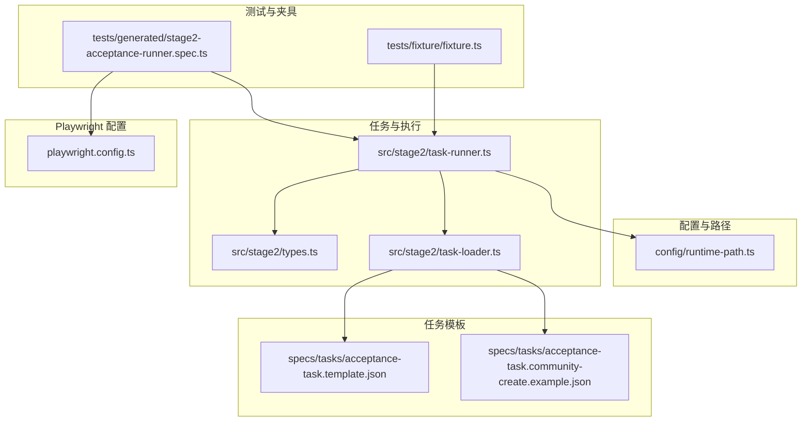
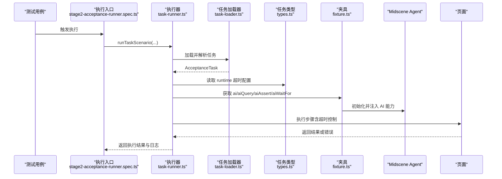
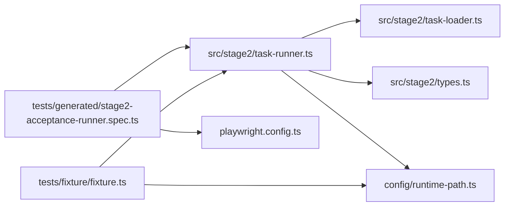

# AI 调用超时

<cite>
**本文引用的文件**
- [README.md](file://README.md)
- [package.json](file://package.json)
- [playwright.config.ts](file://playwright.config.ts)
- [config/runtime-path.ts](file://config/runtime-path.ts)
- [.tasks/AI自主代理验收系统开发改造方案_2026-03-11.md](file://.tasks/AI自主代理验收系统开发改造方案_2026-03-11.md)
- [specs/tasks/acceptance-task.template.json](file://specs/tasks/acceptance-task.template.json)
- [specs/tasks/acceptance-task.community-create.example.json](file://specs/tasks/acceptance-task.community-create.example.json)
- [src/stage2/types.ts](file://src/stage2/types.ts)
- [src/stage2/task-runner.ts](file://src/stage2/task-runner.ts)
- [src/stage2/task-loader.ts](file://src/stage2/task-loader.ts)
- [tests/generated/stage2-acceptance-runner.spec.ts](file://tests/generated/stage2-acceptance-runner.spec.ts)
- [tests/fixture/fixture.ts](file://tests/fixture/fixture.ts)
</cite>

## 目录
1. [简介](#简介)
2. [项目结构](#项目结构)
3. [核心组件](#核心组件)
4. [架构总览](#架构总览)
5. [组件详解](#组件详解)
6. [依赖关系分析](#依赖关系分析)
7. [性能与超时优化](#性能与超时优化)
8. [故障排除指南](#故障排除指南)
9. [结论](#结论)
10. [附录](#附录)

## 简介
本指南聚焦于“AI 调用超时”问题，结合仓库中的 Playwright + Midscene.js 执行链路，系统化地给出诊断方法、参数调优策略、网络与连接稳定性方案、服务端负载应对策略、监控与告警配置以及可操作的故障排除步骤。读者可据此优化 AI 自动化测试在真实环境下的稳定性和性能。

## 项目结构
该仓库围绕“任务驱动 + AI 执行”的第二段执行器构建，核心文件与职责如下：
- 配置与运行时路径：集中于 config/runtime-path.ts，统一管理运行产物目录
- 任务模型与运行器：src/stage2/types.ts 定义任务结构，task-runner.ts 实现步骤执行与超时控制
- 任务加载与模板：src/stage2/task-loader.ts 加载与解析任务 JSON，specs/tasks 提供模板与示例
- 测试入口与夹具：tests/generated/stage2-acceptance-runner.spec.ts 作为执行入口，tests/fixture/fixture.ts 注入 AI 能力
- Playwright 配置：playwright.config.ts 统一测试超时、重试、报告等全局设置
- 文档与方案：README.md 与 .tasks/AI自主代理验收系统开发改造方案_2026-03-11.md 提供背景、现状与建议

图表来源
- [config/runtime-path.ts](file://config/runtime-path.ts#L1-L41)
- [src/stage2/types.ts](file://src/stage2/types.ts#L1-L125)
- [src/stage2/task-loader.ts](file://src/stage2/task-loader.ts#L1-L91)
- [src/stage2/task-runner.ts](file://src/stage2/task-runner.ts#L1-L1344)
- [tests/generated/stage2-acceptance-runner.spec.ts](file://tests/generated/stage2-acceptance-runner.spec.ts#L1-L39)
- [tests/fixture/fixture.ts](file://tests/fixture/fixture.ts#L1-L100)
- [playwright.config.ts](file://playwright.config.ts#L1-L95)
- [specs/tasks/acceptance-task.template.json](file://specs/tasks/acceptance-task.template.json#L1-L85)
- [specs/tasks/acceptance-task.community-create.example.json](file://specs/tasks/acceptance-task.community-create.example.json#L1-L184)

章节来源
- [README.md](file://README.md#L1-L144)
- [playwright.config.ts](file://playwright.config.ts#L1-L95)
- [config/runtime-path.ts](file://config/runtime-path.ts#L1-L41)

## 核心组件
- 任务模型与运行时超时
  - 任务结构定义包含 runtime 字段，支持 stepTimeoutMs 与 pageTimeoutMs，用于控制步骤与页面级超时
- 任务加载器
  - 解析任务 JSON，支持环境变量与时间戳占位符替换
- 执行器
  - 按步骤执行，内置超时包装与失败处理，支持截图与日志落盘
- 测试夹具与 AI 能力注入
  - 通过夹具注入 ai、aiQuery、aiAssert、aiWaitFor，并启用 Midscene Agent 与缓存
- Playwright 配置
  - 全局 timeout、retries、workers、reporter 等，影响整体执行稳定性与可观测性

章节来源
- [src/stage2/types.ts](file://src/stage2/types.ts#L73-L78)
- [src/stage2/task-loader.ts](file://src/stage2/task-loader.ts#L79-L89)
- [src/stage2/task-runner.ts](file://src/stage2/task-runner.ts#L1158-L1172)
- [tests/fixture/fixture.ts](file://tests/fixture/fixture.ts#L23-L99)
- [playwright.config.ts](file://playwright.config.ts#L22-L48)

## 架构总览
AI 调用超时问题贯穿“任务加载 → 执行器步骤 → Midscene AI 能力 → 页面交互”。整体链路如下：

图表来源
- [tests/generated/stage2-acceptance-runner.spec.ts](file://tests/generated/stage2-acceptance-runner.spec.ts#L12-L37)
- [src/stage2/task-runner.ts](file://src/stage2/task-runner.ts#L1158-L1172)
- [src/stage2/task-loader.ts](file://src/stage2/task-loader.ts#L79-L89)
- [src/stage2/types.ts](file://src/stage2/types.ts#L73-L78)
- [tests/fixture/fixture.ts](file://tests/fixture/fixture.ts#L23-L99)

## 组件详解

### 任务模型与运行时超时
- runtime 字段
  - stepTimeoutMs：单步执行超时（默认示例为 30000ms）
  - pageTimeoutMs：页面级导航/加载超时（默认示例为 60000ms）
- 作用
  - 为页面 goto、元素交互、AI 查询/断言等关键步骤提供可控的超时边界
- 配置位置
  - 示例任务 JSON 的 runtime 段落

章节来源
- [src/stage2/types.ts](file://src/stage2/types.ts#L73-L78)
- [specs/tasks/acceptance-task.template.json](file://specs/tasks/acceptance-task.template.json#L78-L83)
- [specs/tasks/acceptance-task.community-create.example.json](file://specs/tasks/acceptance-task.community-create.example.json#L177-L182)

### 任务加载与模板
- 加载流程
  - 解析任务文件路径，读取 JSON，断言必要字段，替换模板占位符（NOW_YYYYMMDDHHMMSS、环境变量）
- 价值
  - 统一任务输入格式，便于复用与扩展

章节来源
- [src/stage2/task-loader.ts](file://src/stage2/task-loader.ts#L71-L89)
- [.tasks/AI自主代理验收系统开发改造方案_2026-03-11.md](file://.tasks/AI自主代理验收系统开发改造方案_2026-03-11.md#L193-L230)

### 执行器与超时控制
- 步骤执行
  - runStep 包裹每一步，记录开始/结束时间、状态、截图路径与错误堆栈
- 页面导航超时
  - page.goto 使用 withPageTimeout(task.runtime?.pageTimeoutMs) 应用页面级超时
- AI 能力调用
  - ai、aiQuery、aiAssert、aiWaitFor 均受各自内部超时与重试策略影响
- 失败处理
  - 必填步骤失败会抛出错误；非必填步骤失败仅记录并继续

章节来源
- [src/stage2/task-runner.ts](file://src/stage2/task-runner.ts#L1139-L1172)
- [src/stage2/task-runner.ts](file://src/stage2/task-runner.ts#L1020-L1060)

### 测试夹具与 AI 能力
- 夹具注入
  - ai、aiAction、aiQuery、aiAssert、aiWaitFor 通过 Midscene Agent 注入
- 缓存与报告
  - 启用缓存 ID 与组信息，生成 Midscene 报告，便于定位 AI 调用问题

章节来源
- [tests/fixture/fixture.ts](file://tests/fixture/fixture.ts#L23-L99)
- [config/runtime-path.ts](file://config/runtime-path.ts#L28-L36)

### Playwright 全局配置
- 全局 timeout、retries、workers、reporter
  - 影响整体执行稳定性与失败重试策略
- 测试入口超时
  - 执行入口设置较长超时，避免因外部环境导致的误判

章节来源
- [playwright.config.ts](file://playwright.config.ts#L22-L48)
- [tests/generated/stage2-acceptance-runner.spec.ts](file://tests/generated/stage2-acceptance-runner.spec.ts#L10-L10)

## 依赖关系分析
- 执行器依赖任务模型与加载器，同时依赖夹具提供的 AI 能力
- 夹具依赖 Midscene Agent 与运行时路径配置
- Playwright 配置影响测试入口与整体稳定性

图表来源
- [tests/generated/stage2-acceptance-runner.spec.ts](file://tests/generated/stage2-acceptance-runner.spec.ts#L1-L39)
- [src/stage2/task-runner.ts](file://src/stage2/task-runner.ts#L1-L1344)
- [src/stage2/task-loader.ts](file://src/stage2/task-loader.ts#L1-L91)
- [src/stage2/types.ts](file://src/stage2/types.ts#L1-L125)
- [config/runtime-path.ts](file://config/runtime-path.ts#L1-L41)
- [playwright.config.ts](file://playwright.config.ts#L1-L95)
- [tests/fixture/fixture.ts](file://tests/fixture/fixture.ts#L1-L100)

章节来源
- [tests/generated/stage2-acceptance-runner.spec.ts](file://tests/generated/stage2-acceptance-runner.spec.ts#L1-L39)
- [src/stage2/task-runner.ts](file://src/stage2/task-runner.ts#L1-L1344)
- [src/stage2/task-loader.ts](file://src/stage2/task-loader.ts#L1-L91)
- [src/stage2/types.ts](file://src/stage2/types.ts#L1-L125)
- [config/runtime-path.ts](file://config/runtime-path.ts#L1-L41)
- [playwright.config.ts](file://playwright.config.ts#L1-L95)
- [tests/fixture/fixture.ts](file://tests/fixture/fixture.ts#L1-L100)

## 性能与超时优化
- 基础超时设置
  - 页面级超时：pageTimeoutMs（建议与网络状况匹配，避免过短导致误判）
  - 步骤级超时：stepTimeoutMs（建议按步骤复杂度分级设置）
- 重试与退避
  - Playwright 层面：retries 控制失败重试次数
  - 执行器层面：对易波动步骤（如 AI 查询/断言）可增加局部重试与退避
- 连接与网络
  - 合理设置连接超时与重试间隔，避免瞬时抖动放大
- 服务端负载
  - 对高延迟 API 增加超时上限与排队/降级策略
- 监控与可观测性
  - 记录每步耗时、截图路径、错误堆栈，便于定位瓶颈

章节来源
- [src/stage2/types.ts](file://src/stage2/types.ts#L73-L78)
- [playwright.config.ts](file://playwright.config.ts#L31-L32)
- [tests/generated/stage2-acceptance-runner.spec.ts](file://tests/generated/stage2-acceptance-runner.spec.ts#L10-L10)

## 故障排除指南

### 一、请求超时的诊断方法
- 现象
  - 页面 goto 超时、AI 查询/断言超时、元素交互超时
- 诊断步骤
  1) 检查任务 runtime 配置（stepTimeoutMs/pageTimeoutMs）
  2) 查看执行结果中的每步 durationMs 与截图路径
  3) 确认 Midscene 报告与 Playwright HTML 报告
  4) 核对网络环境与目标站点可用性
- 参考位置
  - 任务 runtime 字段与示例任务 JSON
  - 执行器步骤记录与截图路径

章节来源
- [src/stage2/types.ts](file://src/stage2/types.ts#L73-L78)
- [specs/tasks/acceptance-task.community-create.example.json](file://specs/tasks/acceptance-task.community-create.example.json#L177-L182)
- [src/stage2/task-runner.ts](file://src/stage2/task-runner.ts#L1139-L1172)

### 二、网络延迟测量与服务器响应时间分析
- 建议做法
  - 在本地/CI 环境分别测量页面加载与 AI 调用耗时
  - 对高延迟 API 引入分段超时与熔断
- 参考位置
  - 执行器记录每步耗时与截图路径，便于对比分析

章节来源
- [src/stage2/task-runner.ts](file://src/stage2/task-runner.ts#L1139-L1172)

### 三、API 限流检查
- 建议做法
  - 识别限流信号（HTTP 状态、响应头、错误信息）
  - 为 AI 调用增加指数退避与重试
- 参考位置
  - 夹具注入的 AI 能力与 Midscene Agent 行为

章节来源
- [tests/fixture/fixture.ts](file://tests/fixture/fixture.ts#L23-L99)

### 四、超时参数调整策略
- 基础超时设置
  - pageTimeoutMs：页面导航/加载超时
  - stepTimeoutMs：单步执行超时
- 重试间隔配置
  - Playwright retries：全局重试次数
  - 执行器内对关键步骤增加局部重试
- 最大重试次数
  - 根据任务复杂度与网络稳定性设定上限

章节来源
- [src/stage2/types.ts](file://src/stage2/types.ts#L73-L78)
- [playwright.config.ts](file://playwright.config.ts#L31-L32)
- [src/stage2/task-runner.ts](file://src/stage2/task-runner.ts#L1139-L1172)

### 五、网络连接不稳定问题的解决方案
- 连接池管理
  - 保持浏览器实例稳定，避免频繁重启
- 心跳检测
  - 在关键步骤前进行轻量探测（如可见性检查）
- 断线重连机制
  - 对页面加载失败进行有限重试与回退策略

章节来源
- [src/stage2/task-runner.ts](file://src/stage2/task-runner.ts#L450-L464)
- [src/stage2/task-runner.ts](file://src/stage2/task-runner.ts#L1158-L1172)

### 六、服务端负载过重的处理方法
- 请求排队
  - 对高延迟 API 增加队列与限速
- 优先级调度
  - 将关键步骤与非关键步骤分离
- 降级策略
  - 在超时或限流时启用简化断言或旁路逻辑

章节来源
- [.tasks/AI自主代理验收系统开发改造方案_2026-03-11.md](file://.tasks/AI自主代理验收系统开发改造方案_2026-03-11.md#L78-L116)

### 七、超时监控与告警配置
- 性能指标收集
  - 每步 durationMs、截图路径、错误堆栈
- 异常检测
  - 对连续超时与错误进行阈值报警
- 自动恢复机制
  - 失败重试、回退策略与资源回收

章节来源
- [src/stage2/task-runner.ts](file://src/stage2/task-runner.ts#L1139-L1172)
- [README.md](file://README.md#L106-L116)

### 八、具体配置示例与故障排除步骤
- 配置示例
  - 任务 JSON 的 runtime 段落（stepTimeoutMs/pageTimeoutMs）
  - Playwright 全局 timeout 与 retries
- 故障排除步骤
  1) 检查任务 runtime 配置
  2) 查看执行结果中的每步耗时与截图
  3) 核对 Midscene 报告与 Playwright HTML 报告
  4) 调整超时参数并重试
  5) 如仍失败，启用更长超时与重试策略

章节来源
- [specs/tasks/acceptance-task.template.json](file://specs/tasks/acceptance-task.template.json#L78-L83)
- [specs/tasks/acceptance-task.community-create.example.json](file://specs/tasks/acceptance-task.community-create.example.json#L177-L182)
- [playwright.config.ts](file://playwright.config.ts#L22-L48)
- [tests/generated/stage2-acceptance-runner.spec.ts](file://tests/generated/stage2-acceptance-runner.spec.ts#L10-L10)
- [src/stage2/task-runner.ts](file://src/stage2/task-runner.ts#L1139-L1172)

## 结论
通过任务模型的运行时超时配置、执行器的步骤级超时与失败处理、夹具注入的 AI 能力与报告体系，以及 Playwright 的全局配置，本项目形成了可诊断、可调优、可监控的 AI 调用超时治理闭环。建议在真实环境中结合网络与服务端状况，分层次地调整超时与重试策略，并持续收集性能指标以优化稳定性与吞吐。

## 附录
- 相关文件与位置
  - 任务模型与运行时超时：[src/stage2/types.ts](file://src/stage2/types.ts#L73-L78)
  - 任务加载与模板：[src/stage2/task-loader.ts](file://src/stage2/task-loader.ts#L71-L89)，[specs/tasks/acceptance-task.template.json](file://specs/tasks/acceptance-task.template.json#L1-L85)，[specs/tasks/acceptance-task.community-create.example.json](file://specs/tasks/acceptance-task.community-create.example.json#L1-L184)
  - 执行器与超时控制：[src/stage2/task-runner.ts](file://src/stage2/task-runner.ts#L1139-L1172)
  - 测试夹具与 AI 能力：[tests/fixture/fixture.ts](file://tests/fixture/fixture.ts#L23-L99)
  - Playwright 配置：[playwright.config.ts](file://playwright.config.ts#L22-L48)
  - 运行产物目录：[config/runtime-path.ts](file://config/runtime-path.ts#L18-L36)
  - 执行入口：[tests/generated/stage2-acceptance-runner.spec.ts](file://tests/generated/stage2-acceptance-runner.spec.ts#L1-L39)
  - 方案与建议：[README.md](file://README.md#L1-L144)，[.tasks/AI自主代理验收系统开发改造方案_2026-03-11.md](file://.tasks/AI自主代理验收系统开发改造方案_2026-03-11.md#L1-L463)