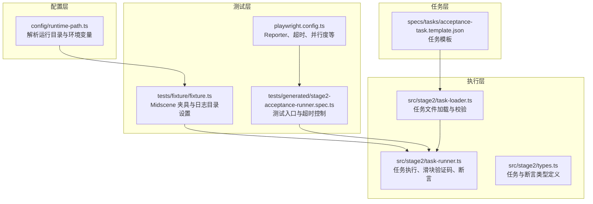
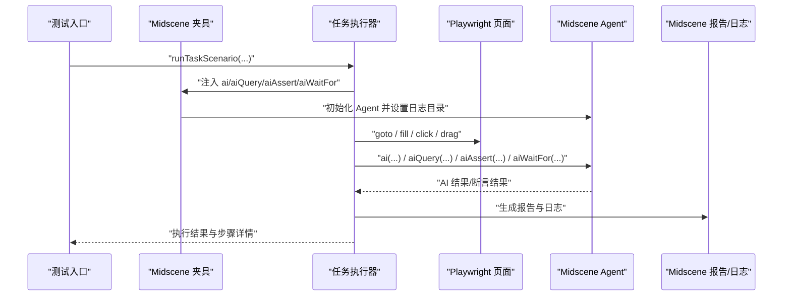
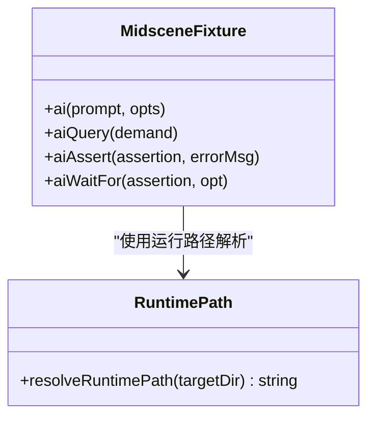
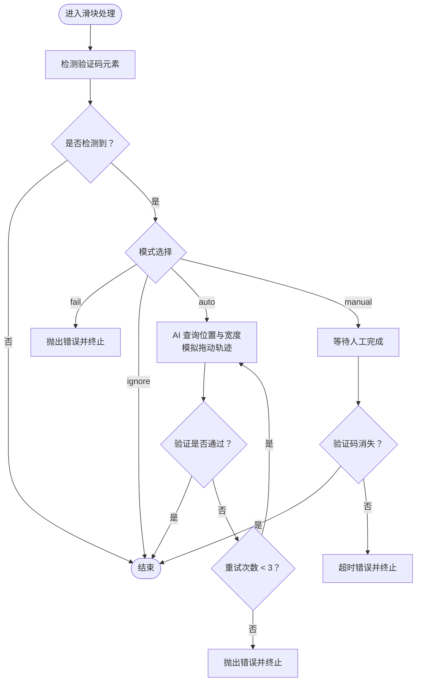
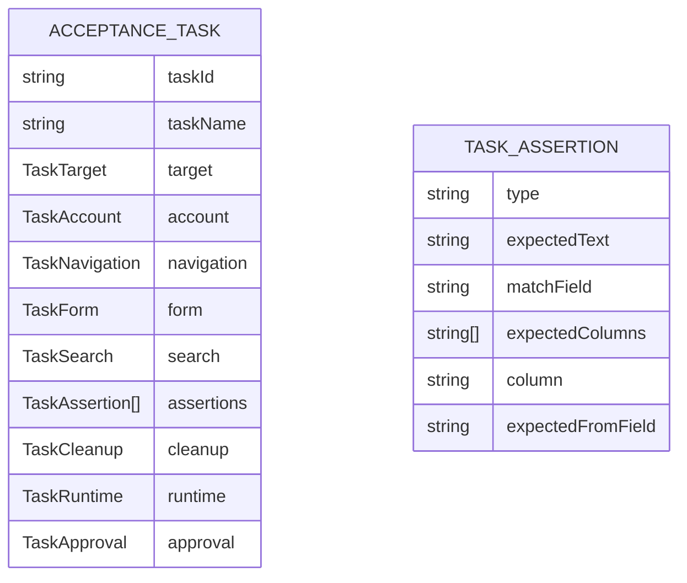
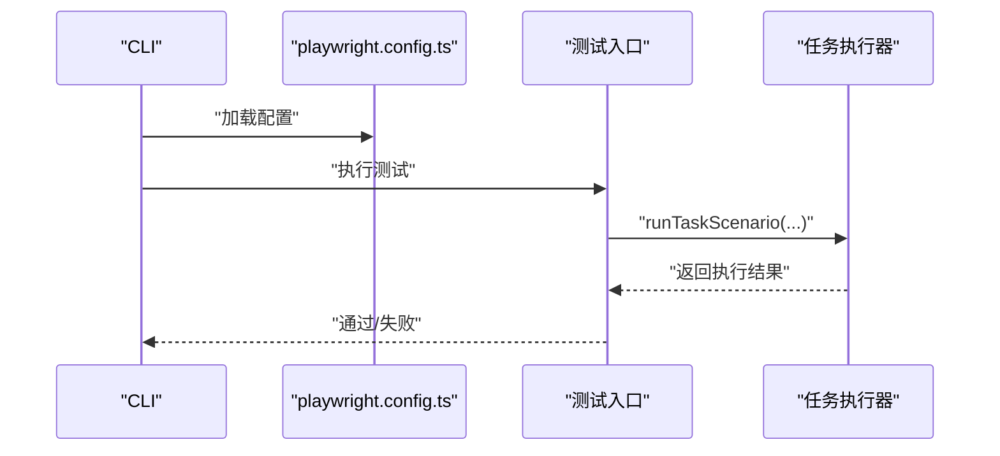
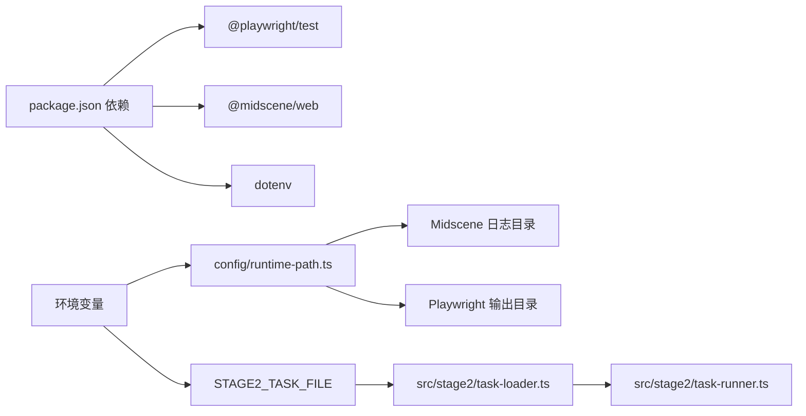

# AI 集成问题

<cite>
**本文引用的文件**
- [README.md](file://README.md)
- [package.json](file://package.json)
- [playwright.config.ts](file://playwright.config.ts)
- [config/runtime-path.ts](file://config/runtime-path.ts)
- [src/stage2/task-runner.ts](file://src/stage2/task-runner.ts)
- [src/stage2/types.ts](file://src/stage2/types.ts)
- [src/stage2/task-loader.ts](file://src/stage2/task-loader.ts)
- [tests/generated/stage2-acceptance-runner.spec.ts](file://tests/generated/stage2-acceptance-runner.spec.ts)
- [tests/fixture/fixture.ts](file://tests/fixture/fixture.ts)
- [specs/tasks/acceptance-task.template.json](file://specs/tasks/acceptance-task.template.json)
</cite>

## 目录
1. [简介](#简介)
2. [项目结构](#项目结构)
3. [核心组件](#核心组件)
4. [架构总览](#架构总览)
5. [详细组件分析](#详细组件分析)
6. [依赖关系分析](#依赖关系分析)
7. [性能考量](#性能考量)
8. [故障排除指南](#故障排除指南)
9. [结论](#结论)
10. [附录](#附录)

## 简介
本指南面向使用 Midscene + Playwright 的 AI 自动化测试项目，聚焦于 AI 集成常见问题的诊断与修复，涵盖以下主题：
- Midscene 模型配置错误（API 密钥、服务端点、模型名称）的定位与修复
- 图像处理失败（截图质量、格式转换、内存溢出）的排查技巧
- AI 断言不匹配（语义理解偏差、阈值设置、多模态融合）的分析方法
- 能力调用超时与失败的优化策略（重试、超时参数、网络稳定性）
- 日志与性能监控工具的使用，帮助快速定位问题

## 项目结构
该项目基于 Playwright 与 Midscene.js 构建，采用分层组织：
- 配置层：环境变量与运行目录解析
- 测试层：Playwright 测试入口与 Midscene 夹具
- 执行层：第二段任务执行器与断言逻辑
- 任务层：JSON 任务模板与加载器

图表来源
- [config/runtime-path.ts](file://config/runtime-path.ts#L1-L41)
- [tests/fixture/fixture.ts](file://tests/fixture/fixture.ts#L1-L100)
- [tests/generated/stage2-acceptance-runner.spec.ts](file://tests/generated/stage2-acceptance-runner.spec.ts#L1-L39)
- [playwright.config.ts](file://playwright.config.ts#L1-L95)
- [src/stage2/task-runner.ts](file://src/stage2/task-runner.ts#L1-L1344)
- [src/stage2/types.ts](file://src/stage2/types.ts#L1-L125)
- [src/stage2/task-loader.ts](file://src/stage2/task-loader.ts#L1-L91)
- [specs/tasks/acceptance-task.template.json](file://specs/tasks/acceptance-task.template.json#L1-L85)

章节来源
- [README.md](file://README.md#L1-L144)
- [package.json](file://package.json#L1-L24)
- [playwright.config.ts](file://playwright.config.ts#L1-L95)
- [config/runtime-path.ts](file://config/runtime-path.ts#L1-L41)

## 核心组件
- Midscene 夹具与日志目录：在测试夹具中初始化 Midscene Agent，并设置日志输出目录，便于后续分析。
- 任务执行器：负责导航、登录、滑块验证码处理、表单填写、断言与结果写入。
- 任务加载器：解析任务 JSON，进行模板变量替换与结构校验。
- 测试入口：设置测试超时、注入 AI 能力并执行任务场景。
- 运行目录与环境变量：集中管理 t_runtime 下的产物目录，便于定位日志与截图。

章节来源
- [tests/fixture/fixture.ts](file://tests/fixture/fixture.ts#L1-L100)
- [src/stage2/task-runner.ts](file://src/stage2/task-runner.ts#L1-L1344)
- [src/stage2/task-loader.ts](file://src/stage2/task-loader.ts#L1-L91)
- [tests/generated/stage2-acceptance-runner.spec.ts](file://tests/generated/stage2-acceptance-runner.spec.ts#L1-L39)
- [config/runtime-path.ts](file://config/runtime-path.ts#L1-L41)

## 架构总览
AI 集成流程以 Midscene 的 ai/aiQuery/aiAssert/aiWaitFor 能力为核心，结合 Playwright 的页面自动化能力，形成“AI 视觉理解 + UI 行为”的闭环。

图表来源
- [tests/generated/stage2-acceptance-runner.spec.ts](file://tests/generated/stage2-acceptance-runner.spec.ts#L1-L39)
- [tests/fixture/fixture.ts](file://tests/fixture/fixture.ts#L1-L100)
- [src/stage2/task-runner.ts](file://src/stage2/task-runner.ts#L1-L1344)

## 详细组件分析

### 组件一：Midscene 夹具与日志目录
- 设置日志目录：通过运行路径解析模块设置 Midscene 日志目录，确保报告与缓存落盘到 t_runtime 下。
- 能力封装：对 ai/aiQuery/aiAssert/aiWaitFor 进行统一包装，支持 action/query 类型与等待选项。
- 缓存 ID 清洗：避免非法字符影响缓存与报告生成。

图表来源
- [tests/fixture/fixture.ts](file://tests/fixture/fixture.ts#L1-L100)
- [config/runtime-path.ts](file://config/runtime-path.ts#L1-L41)

章节来源
- [tests/fixture/fixture.ts](file://tests/fixture/fixture.ts#L1-L100)
- [config/runtime-path.ts](file://config/runtime-path.ts#L1-L41)

### 组件二：任务执行器（滑块验证码与断言）
- 滑块验证码处理：检测页面是否存在验证码元素，若为自动模式则通过 AI 查询滑块位置与滑槽宽度，再用 Playwright 模拟拖动轨迹，最多重试三次。
- 断言执行：根据断言类型（toast、table-row-exists、table-cell-equals、table-cell-contains）分别调用 aiWaitFor 或 aiAssert。
- 步骤记录：每个步骤记录开始/结束时间、耗时、截图路径与错误堆栈，便于回溯。

图表来源
- [src/stage2/task-runner.ts](file://src/stage2/task-runner.ts#L480-L703)

章节来源
- [src/stage2/task-runner.ts](file://src/stage2/task-runner.ts#L480-L703)
- [src/stage2/task-runner.ts](file://src/stage2/task-runner.ts#L1020-L1060)

### 组件三：任务加载器与类型定义
- 任务加载：解析任务 JSON 文件，进行结构校验（必须字段），并对模板字符串进行环境变量与时间戳替换。
- 类型约束：通过 TypeScript 接口定义任务结构、断言类型与执行结果，降低运行期错误概率。

图表来源
- [src/stage2/types.ts](file://src/stage2/types.ts#L1-L125)
- [src/stage2/task-loader.ts](file://src/stage2/task-loader.ts#L50-L69)

章节来源
- [src/stage2/task-loader.ts](file://src/stage2/task-loader.ts#L1-L91)
- [src/stage2/types.ts](file://src/stage2/types.ts#L1-L125)

### 组件四：测试入口与 Playwright 配置
- 测试入口：设置较长的测试超时，注入 AI 能力并执行任务场景，失败时汇总最后失败步骤与截图路径。
- Playwright 配置：统一输出目录、HTML 报告目录、Midscene 报告插件、并行度与重试策略。

图表来源
- [tests/generated/stage2-acceptance-runner.spec.ts](file://tests/generated/stage2-acceptance-runner.spec.ts#L1-L39)
- [playwright.config.ts](file://playwright.config.ts#L1-L95)

章节来源
- [tests/generated/stage2-acceptance-runner.spec.ts](file://tests/generated/stage2-acceptance-runner.spec.ts#L1-L39)
- [playwright.config.ts](file://playwright.config.ts#L1-L95)

## 依赖关系分析
- 运行时依赖：@playwright/test、@midscene/web、dotenv
- 任务驱动：通过环境变量 STAGE2_TASK_FILE 指定任务 JSON 路径
- 日志与产物：Midscene 报告与缓存、Playwright 报告、第二段结果与截图统一收敛到 t_runtime

图表来源
- [package.json](file://package.json#L1-L24)
- [config/runtime-path.ts](file://config/runtime-path.ts#L1-L41)
- [src/stage2/task-loader.ts](file://src/stage2/task-loader.ts#L71-L77)

章节来源
- [package.json](file://package.json#L1-L24)
- [config/runtime-path.ts](file://config/runtime-path.ts#L1-L41)
- [src/stage2/task-loader.ts](file://src/stage2/task-loader.ts#L71-L77)

## 性能考量
- 超时与重试
  - Playwright 测试超时：测试入口设置较长超时，避免短时波动导致误判
  - 滑块自动处理：最多重试三次，每次失败后短暂等待
  - 断言等待：aiWaitFor 用于等待可见文本出现，减少轮询开销
- 并行与资源
  - Playwright 支持并行测试，CI 环境下限制 worker 数量
  - Midscene 报告与缓存写盘集中在 t_runtime，避免磁盘争用
- 截图与追踪
  - 可选每步截图与 trace，便于定位问题但会增加 IO 成本

章节来源
- [tests/generated/stage2-acceptance-runner.spec.ts](file://tests/generated/stage2-acceptance-runner.spec.ts#L10-L10)
- [playwright.config.ts](file://playwright.config.ts#L25-L34)
- [src/stage2/task-runner.ts](file://src/stage2/task-runner.ts#L667-L679)

## 故障排除指南

### 一、Midscene 模型配置错误
- 症状
  - AI 查询/断言报错或返回空结果
  - 服务端点无法访问或返回鉴权失败
- 诊断步骤
  - 检查环境变量是否正确加载：OPENAI_API_KEY、OPENAI_BASE_URL、MIDSCENE_MODEL_NAME
  - 确认服务端点与模型名称与 Midscene 文档一致
  - 查看 Midscene 日志目录下的报告与缓存，定位具体请求与响应
- 修复建议
  - 在 .env 中补齐缺失项，确保服务端点与模型名称匹配
  - 若为阿里百炼等平台，参考官方文档配置兼容模式端点
  - 重启测试以应用新配置

章节来源
- [README.md](file://README.md#L39-L52)
- [tests/fixture/fixture.ts](file://tests/fixture/fixture.ts#L10-L10)
- [config/runtime-path.ts](file://config/runtime-path.ts#L28-L36)

### 二、图像处理失败（截图质量/格式/内存）
- 症状
  - AI 查询返回“无法识别”或“图像模糊”
  - 执行器在截图/拖动时抛出异常
- 诊断步骤
  - 检查截图目录（t_runtime/acceptance-results/<taskId>/<timestamp>/screenshots/）是否生成
  - 确认页面渲染完成后再截图（等待 DOMContentLoaded 或显式等待）
  - 观察 Midscene 报告中的截图与 AI 解析结果
- 修复建议
  - 在关键步骤后添加等待，确保页面稳定
  - 调整截图时机与区域，避免动态遮挡
  - 若内存不足，减少并发或禁用不必要的截图与 trace

章节来源
- [README.md](file://README.md#L74-L91)
- [src/stage2/task-runner.ts](file://src/stage2/task-runner.ts#L1139-L1155)

### 三、AI 断言不匹配（语义/阈值/多模态）
- 症状
  - 断言失败但预期文本存在
  - 不同断言类型组合导致误判
- 诊断步骤
  - 查看断言类型与期望值是否与页面实际一致
  - 对比 aiQuery 的结构化结果与 aiAssert 的断言提示
  - 检查任务 JSON 中断言字段（如 matchField、expectedColumns）是否正确
- 修复建议
  - 明确断言类型与期望文本，必要时拆分为多个断言
  - 使用 aiWaitFor 等待目标出现后再断言
  - 对多列断言，逐列验证以缩小范围

章节来源
- [src/stage2/task-runner.ts](file://src/stage2/task-runner.ts#L1020-L1060)
- [specs/tasks/acceptance-task.template.json](file://specs/tasks/acceptance-task.template.json#L58-L67)

### 四、能力调用超时与失败（重试/超时/网络）
- 症状
  - aiQuery/aiAssert/aiWaitFor 超时
  - 网络不稳定导致请求失败
- 诊断步骤
  - 查看测试超时设置与任务运行超时（runtime.stepTimeoutMs/pageTimeoutMs）
  - 检查 Midscene 报告中的请求耗时与错误码
  - 在 CI 环境下观察重试策略（CI 仅启用有限重试）
- 修复建议
  - 合理增大 stepTimeoutMs/pageTimeoutMs
  - 对易失败步骤增加重试与退避
  - 稳定网络环境，必要时更换就近服务端点

章节来源
- [playwright.config.ts](file://playwright.config.ts#L25-L34)
- [src/stage2/task-runner.ts](file://src/stage2/task-runner.ts#L1159-L1161)
- [specs/tasks/acceptance-task.template.json](file://specs/tasks/acceptance-task.template.json#L78-L83)

### 五、日志与性能监控
- 日志位置
  - Playwright HTML 报告：t_runtime/playwright-report/
  - Midscene 报告与缓存：t_runtime/midscene_run/report/ 与 t_runtime/midscene_run/cache/
  - 第二段结果与截图：t_runtime/acceptance-results/<taskId>/<timestamp>/
- 监控要点
  - 关注步骤耗时与截图数量，定位瓶颈
  - 检查断言失败步骤的截图与 AI 解析结果
  - 在 CI 中开启重试，观察失败率趋势

章节来源
- [README.md](file://README.md#L74-L116)
- [config/runtime-path.ts](file://config/runtime-path.ts#L18-L36)

## 结论
本项目通过 Midscene + Playwright 实现了“AI 视觉理解 + UI 自动化”的一体化测试方案。针对常见问题，建议优先检查环境变量与服务端点配置、优化截图时机与断言策略、合理设置超时与重试，并充分利用 t_runtime 下的日志与报告进行问题定位。通过以上方法，可显著提升 AI 集成的稳定性与可维护性。

## 附录
- 任务模板字段说明：见任务模板文件，包含目标地址、账户信息、导航、表单、搜索、断言、清理与运行时参数等。
- 运行命令：使用 npm scripts 启动第二段执行，或直接通过 Playwright CLI 指定测试入口。

章节来源
- [specs/tasks/acceptance-task.template.json](file://specs/tasks/acceptance-task.template.json#L1-L85)
- [README.md](file://README.md#L106-L123)