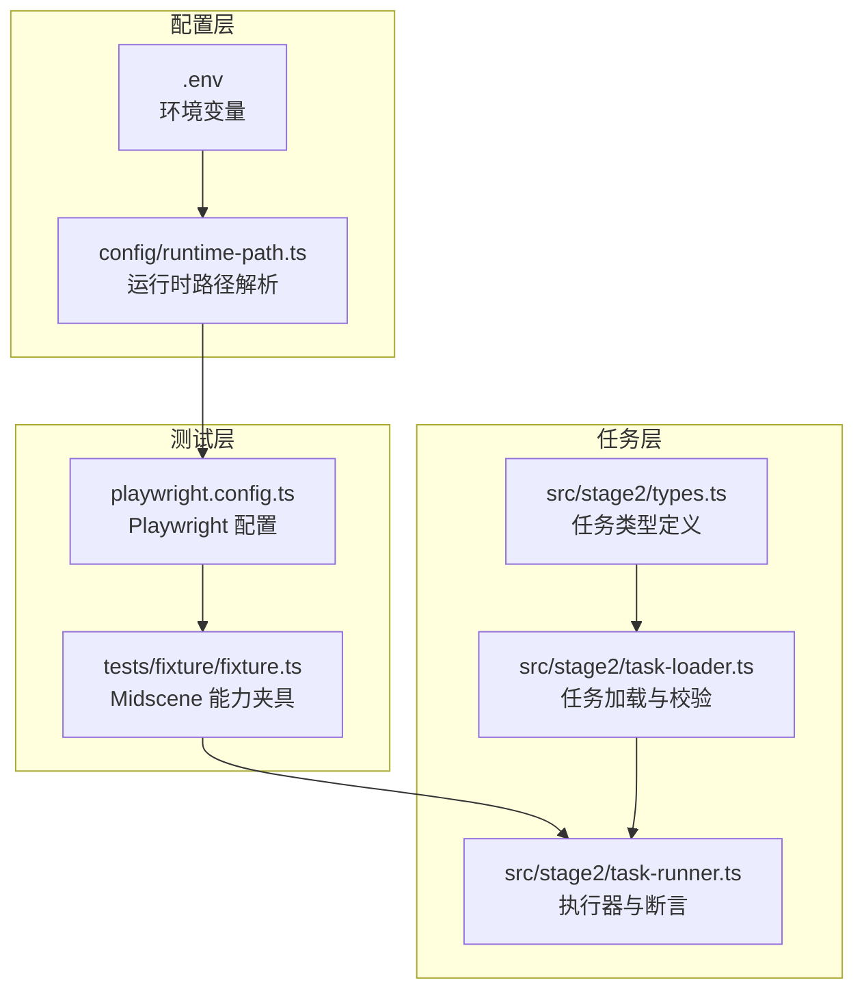
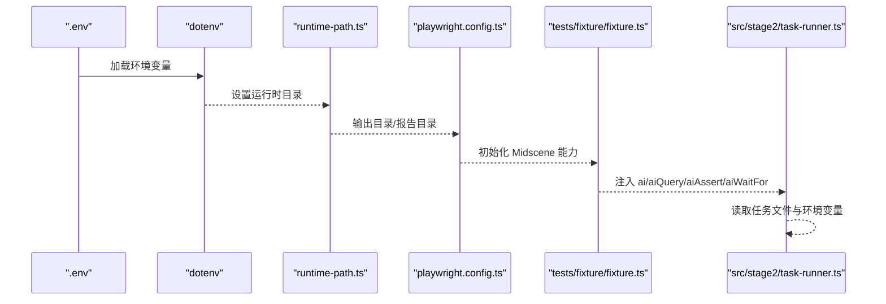
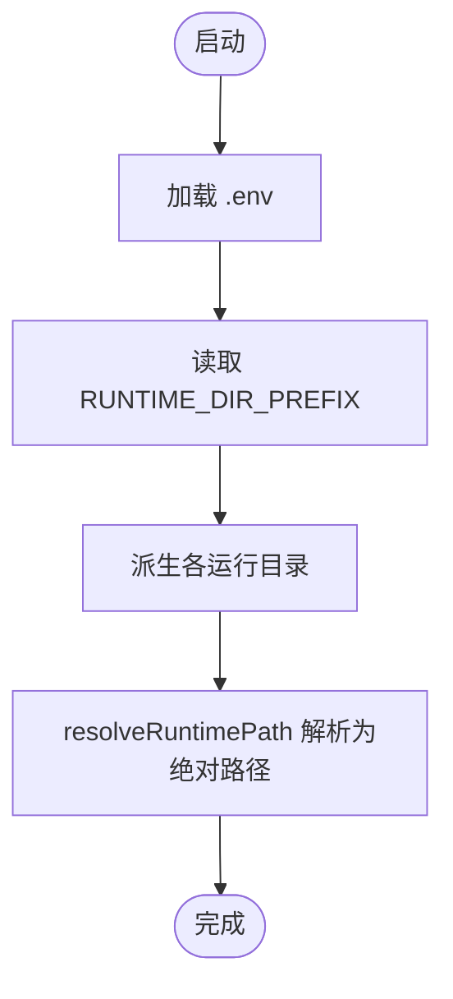
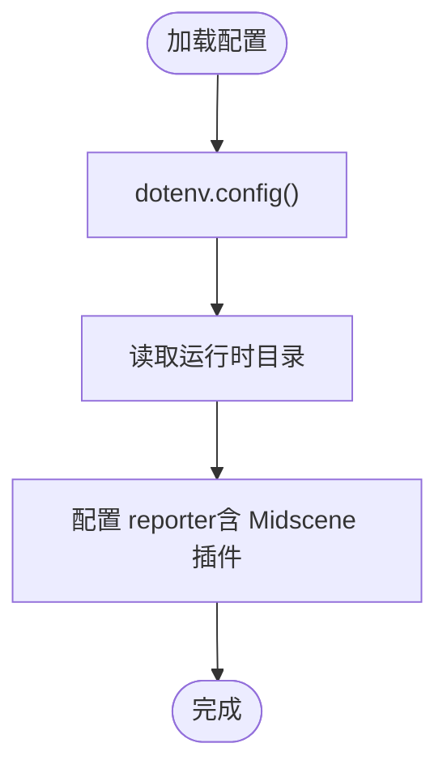
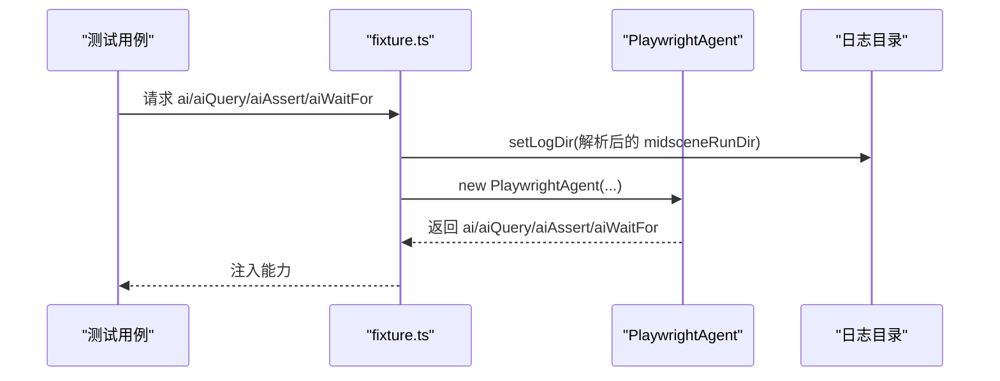
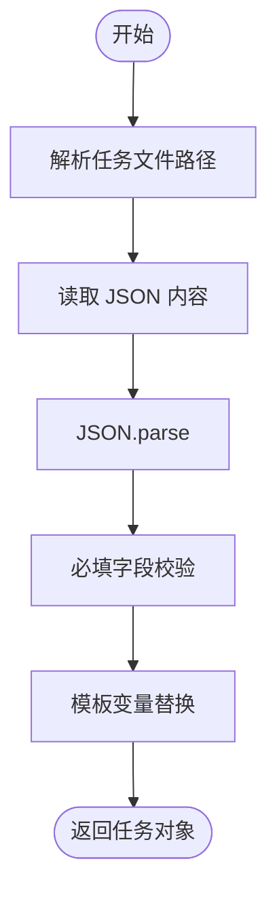
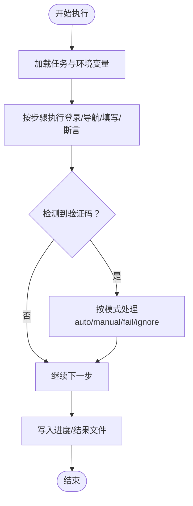
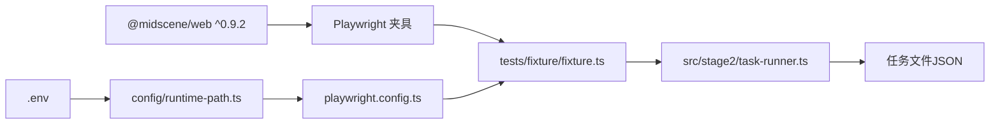

# Midscene 模型配置

<cite>
**本文引用的文件**
- [README.md](file://README.md)
- [package.json](file://package.json)
- [playwright.config.ts](file://playwright.config.ts)
- [config/runtime-path.ts](file://config/runtime-path.ts)
- [tests/fixture/fixture.ts](file://tests/fixture/fixture.ts)
- [src/stage2/types.ts](file://src/stage2/types.ts)
- [src/stage2/task-runner.ts](file://src/stage2/task-runner.ts)
- [src/stage2/task-loader.ts](file://src/stage2/task-loader.ts)
- [.tasks/AI自主代理验收系统开发改造方案_2026-03-11.md](file://.tasks/AI自主代理验收系统开发改造方案_2026-03-11.md)
</cite>

## 目录
1. [简介](#简介)
2. [项目结构](#项目结构)
3. [核心组件](#核心组件)
4. [架构总览](#架构总览)
5. [详细组件分析](#详细组件分析)
6. [依赖关系分析](#依赖关系分析)
7. [性能考量](#性能考量)
8. [故障排除指南](#故障排除指南)
9. [结论](#结论)
10. [附录](#附录)

## 简介
本指南聚焦于 Midscene 模型配置相关的常见问题与排障方法，覆盖以下主题：
- API 密钥验证失败的诊断：环境变量配置检查、密钥格式与权限范围确认
- 模型名称匹配错误排查：支持模型列表、版本兼容性、可用性验证
- 服务端点配置问题：网络连通性、代理、SSL 证书
- 配置文件格式错误修复：JSON 校验、必填字段、默认值处理
- 配置加载失败调试：日志分析、错误堆栈、环境变量冲突

本项目基于 Playwright 与 Midscene.js 构建，通过环境变量驱动 Midscene 的运行参数与行为。

## 项目结构
项目采用“功能模块 + 配置 + 测试夹具”的组织方式：
- 配置层：通过 dotenv 加载环境变量，并在运行时解析为路径与行为参数
- 测试层：以 Playwright 测试入口为入口，注入 Midscene 能力夹具
- 任务层：通过 JSON 任务文件驱动第二段执行器，实现可配置的自动化流程

图表来源
- [config/runtime-path.ts](file://config/runtime-path.ts#L1-L41)
- [playwright.config.ts](file://playwright.config.ts#L1-L95)
- [tests/fixture/fixture.ts](file://tests/fixture/fixture.ts#L1-L100)
- [src/stage2/types.ts](file://src/stage2/types.ts#L1-L125)
- [src/stage2/task-loader.ts](file://src/stage2/task-loader.ts#L1-L91)
- [src/stage2/task-runner.ts](file://src/stage2/task-runner.ts#L1-L1344)

章节来源
- [README.md](file://README.md#L1-L144)
- [package.json](file://package.json#L1-L24)
- [playwright.config.ts](file://playwright.config.ts#L1-L95)
- [config/runtime-path.ts](file://config/runtime-path.ts#L1-L41)

## 核心组件
- 环境变量与路径解析：通过 dotenv 加载 .env，读取运行时目录与 Midscene 日志目录
- Playwright 配置：加载 .env，设置输出目录、HTML 报告目录、Midscene 报告插件
- Midscene 夹具：初始化 PlaywrightAgent，注入 ai/aiQuery/aiAssert/aiWaitFor 等能力
- 任务加载器：解析任务文件路径、模板变量替换、必填字段校验
- 执行器：按步骤执行登录、菜单导航、表单填写、断言与结果落盘

章节来源
- [config/runtime-path.ts](file://config/runtime-path.ts#L1-L41)
- [playwright.config.ts](file://playwright.config.ts#L1-L95)
- [tests/fixture/fixture.ts](file://tests/fixture/fixture.ts#L1-L100)
- [src/stage2/task-loader.ts](file://src/stage2/task-loader.ts#L1-L91)
- [src/stage2/task-runner.ts](file://src/stage2/task-runner.ts#L1062-L1344)

## 架构总览
下图展示从环境变量到 Midscene 执行的关键路径与交互：

图表来源
- [config/runtime-path.ts](file://config/runtime-path.ts#L1-L41)
- [playwright.config.ts](file://playwright.config.ts#L1-L95)
- [tests/fixture/fixture.ts](file://tests/fixture/fixture.ts#L1-L100)
- [src/stage2/task-runner.ts](file://src/stage2/task-runner.ts#L1062-L1344)

## 详细组件分析

### 组件一：环境变量与路径解析（config/runtime-path.ts）
- 功能要点
  - 读取 RUNTIME_DIR_PREFIX 并派生 PLAYWRIGHT_OUTPUT_DIR、PLAYWRIGHT_HTML_REPORT_DIR、MIDSCENE_RUN_DIR、ACCEPTANCE_RESULT_DIR
  - 提供 resolveRuntimePath 将相对路径解析为绝对路径
- 关键行为
  - 若未设置某变量，则使用默认前缀拼接的子目录
  - 通过 process.env 读取，支持 .env 文件注入

图表来源
- [config/runtime-path.ts](file://config/runtime-path.ts#L1-L41)

章节来源
- [config/runtime-path.ts](file://config/runtime-path.ts#L1-L41)

### 组件二：Playwright 配置（playwright.config.ts）
- 功能要点
  - 加载 .env，设置输出目录、HTML 报告目录、Midscene 报告插件
  - 并行测试、重试策略、trace 等通用配置
- 关键行为
  - reporter 包含 html 与 @midscene/web/playwright-report 插件
  - outputDir 由 runtime-path.ts 提供

图表来源
- [playwright.config.ts](file://playwright.config.ts#L1-L95)

章节来源
- [playwright.config.ts](file://playwright.config.ts#L1-L95)

### 组件三：Midscene 夹具（tests/fixture/fixture.ts）
- 功能要点
  - 初始化 Midscene 日志目录（setLogDir）
  - 创建 PlaywrightAgent，注入 ai/aiQuery/aiAssert/aiWaitFor
  - 为每个测试用例生成安全的缓存 ID 与分组信息
- 关键行为
  - 使用 resolveRuntimePath 与 midsceneRunDir 控制日志与报告存储位置

图表来源
- [tests/fixture/fixture.ts](file://tests/fixture/fixture.ts#L1-L100)

章节来源
- [tests/fixture/fixture.ts](file://tests/fixture/fixture.ts#L1-L100)

### 组件四：任务加载与校验（src/stage2/task-loader.ts）
- 功能要点
  - 解析任务文件路径（支持绝对/相对路径）
  - 模板变量替换：支持 ${NOW_YYYYMMDDHHMMSS} 与 ${ENV_VAR}
  - 必填字段断言：taskId、taskName、target.url、account、form 等
- 关键行为
  - JSON 解析后进行形状校验，缺失字段直接抛错
  - 模板字符串替换后返回最终任务对象

图表来源
- [src/stage2/task-loader.ts](file://src/stage2/task-loader.ts#L1-L91)

章节来源
- [src/stage2/task-loader.ts](file://src/stage2/task-loader.ts#L1-L91)

### 组件五：执行器与断言（src/stage2/task-runner.ts）
- 功能要点
  - 读取 STAGE2_REQUIRE_APPROVAL、STAGE2_TASK_FILE 等环境变量
  - 按步骤执行：打开首页、登录、处理安全验证、菜单导航、表单填写、断言、结果落盘
  - 失败时生成截图、记录错误消息与堆栈
- 关键行为
  - handleCaptchaChallengeIfNeeded：根据 STAGE2_CAPTCHA_MODE 与 STAGE2_CAPTCHA_WAIT_TIMEOUT_MS 处理滑块验证码
  - runAssertion：根据断言类型执行 aiWaitFor 或 aiAssert

图表来源
- [src/stage2/task-runner.ts](file://src/stage2/task-runner.ts#L1062-L1344)

章节来源
- [src/stage2/task-runner.ts](file://src/stage2/task-runner.ts#L1062-L1344)

## 依赖关系分析
- Midscene 版本与依赖
  - 项目依赖 @midscene/web ^0.9.2，该版本包含 @midscene/core、@midscene/shared 等
  - 与 Playwright 的集成通过夹具注入 ai/aiQuery/aiAssert/aiWaitFor
- 环境变量与配置耦合
  - 运行时目录由 config/runtime-path.ts 读取 .env 注入的变量
  - Playwright 配置依赖 runtime-path.ts 的输出目录与报告目录
  - 执行器读取 STAGE2_* 系列环境变量控制行为

图表来源
- [package.json](file://package.json#L1-L24)
- [tests/fixture/fixture.ts](file://tests/fixture/fixture.ts#L1-L100)
- [src/stage2/task-runner.ts](file://src/stage2/task-runner.ts#L1062-L1344)
- [config/runtime-path.ts](file://config/runtime-path.ts#L1-L41)
- [playwright.config.ts](file://playwright.config.ts#L1-L95)

章节来源
- [package.json](file://package.json#L1-L24)
- [playwright.config.ts](file://playwright.config.ts#L1-L95)
- [config/runtime-path.ts](file://config/runtime-path.ts#L1-L41)
- [tests/fixture/fixture.ts](file://tests/fixture/fixture.ts#L1-L100)
- [src/stage2/task-runner.ts](file://src/stage2/task-runner.ts#L1062-L1344)

## 性能考量
- 并行与重试
  - Playwright 配置启用 fullyParallel 与 CI 环境下的 retries，有助于提升吞吐但需关注资源占用
- 截图与报告
  - 执行器可按步骤截图，便于定位问题但会增加磁盘 IO
- 超时与等待
  - 页面与步骤超时可通过任务 runtime 字段与环境变量控制，避免长时间阻塞

[本节为通用指导，无需列出章节来源]

## 故障排除指南

### API 密钥验证失败
- 症状
  - Midscene 调用失败，返回鉴权错误或模型不可用
- 诊断步骤
  - 环境变量配置检查
    - 确认 .env 中存在 OPENAI_API_KEY、OPENAI_BASE_URL 等必要变量
    - 确认变量名大小写与 Midscene 官方模型配置文档一致
  - 密钥格式验证
    - 确认密钥未被多余空格包裹，必要时 trim 后使用
  - 权限范围确认
    - 确认密钥具备访问目标模型的权限
    - 如使用第三方平台（如阿里云百炼），确认服务端点与模型名称匹配
- 参考依据
  - README 中提供了 .env 示例与模型接入文档链接
  - Midscene 官方文档与版本说明需保持一致

章节来源
- [README.md](file://README.md#L31-L52)
- [.tasks/AI自主代理验收系统开发改造方案_2026-03-11.md](file://.tasks/AI自主代理验收系统开发改造方案_2026-03-11.md#L40-L56)

### 模型名称匹配错误
- 症状
  - 执行器报错提示模型不可用或名称不匹配
- 排查步骤
  - 支持的模型列表
    - 参考 README 中的模型接入文档链接，核对当前使用的模型名称
  - 版本兼容性检查
    - 确认 @midscene/web 版本与官方文档一致，避免因版本差异导致的配置不兼容
  - 模型可用性验证
    - 在本地或 CI 环境中单独发起一次 API 调用，验证模型可用性
- 参考依据
  - README 提供模型接入文档链接
  - package.json 显示 @midscene/web 版本

章节来源
- [README.md](file://README.md#L35-L37)
- [package.json](file://package.json#L13-L22)
- [.tasks/AI自主代理验收系统开发改造方案_2026-03-11.md](file://.tasks/AI自主代理验收系统开发改造方案_2026-03-11.md#L277-L289)

### 服务端点配置问题
- 症状
  - 网络超时、连接失败、SSL 证书错误
- 解决方案
  - 网络连接测试
    - 在执行环境中使用 curl 或浏览器访问 OPENAI_BASE_URL，确认可达性
  - 代理设置检查
    - 确认系统/IDE 的代理设置与 .env 中的端点一致
  - SSL 证书验证
    - 如使用自签名证书，确认信任链正确或更新 CA 证书
- 参考依据
  - README 中提供默认端点示例，用于比对

章节来源
- [README.md](file://README.md#L39-L42)

### 配置文件格式错误
- 症状
  - 任务 JSON 解析失败、字段缺失、类型不匹配
- 修复方法
  - JSON 格式验证
    - 使用在线 JSON 校验工具或编辑器插件检查语法
  - 必填字段检查
    - 确保包含 taskId、taskName、target.url、account.username/password、form.openButtonText/form.submitButtonText、form.fields 等
  - 默认值处理
    - 对可选字段提供合理默认值，避免运行时报错
- 参考依据
  - 任务加载器对必填字段进行断言，缺失字段会抛错

章节来源
- [src/stage2/task-loader.ts](file://src/stage2/task-loader.ts#L50-L69)

### 配置加载失败调试
- 症状
  - 任务文件不存在、模板变量未替换、环境变量冲突
- 调试技巧
  - 日志分析
    - 查看 Midscene 日志目录（由 runtime-path.ts 解析）与 Playwright HTML 报告
  - 错误堆栈跟踪
    - 执行器在失败时会记录 message 与 errorStack，结合截图定位问题
  - 环境变量冲突检测
    - 确认 .env 与 CI/本地环境变量未重复定义同一键
- 参考依据
  - 执行器在 runStep 捕获异常时写入 message 与 errorStack
  - Midscene 日志目录由夹具 setLogDir 设置

章节来源
- [src/stage2/task-runner.ts](file://src/stage2/task-runner.ts#L1132-L1149)
- [tests/fixture/fixture.ts](file://tests/fixture/fixture.ts#L10-L10)

## 结论
- Midscene 模型配置问题通常源于环境变量不一致、模型名称不匹配、端点不可达或配置文件格式错误
- 建议遵循“先校验环境变量与端点，再核对模型与版本，最后检查配置文件”的顺序
- 通过 Playwright 与 Midscene 的日志、截图与错误堆栈，可快速定位问题根因

[本节为总结性内容，无需列出章节来源]

## 附录

### 环境变量与运行目录对照
- RUNTIME_DIR_PREFIX：运行时根目录前缀
- PLAYWRIGHT_OUTPUT_DIR：Playwright 执行产物目录
- PLAYWRIGHT_HTML_REPORT_DIR：Playwright HTML 报告目录
- MIDSCENE_RUN_DIR：Midscene 运行日志、缓存、报告根目录
- ACCEPTANCE_RESULT_DIR：第二段结果目录
- STAGE2_TASK_FILE：任务 JSON 文件路径
- STAGE2_REQUIRE_APPROVAL：是否要求审批后执行
- STAGE2_CAPTCHA_MODE：验证码处理模式（auto/manual/fail/ignore）
- STAGE2_CAPTCHA_WAIT_TIMEOUT_MS：人工处理等待时长（毫秒）

章节来源
- [README.md](file://README.md#L39-L52)
- [config/runtime-path.ts](file://config/runtime-path.ts#L6-L36)
- [src/stage2/task-runner.ts](file://src/stage2/task-runner.ts#L58-L84)