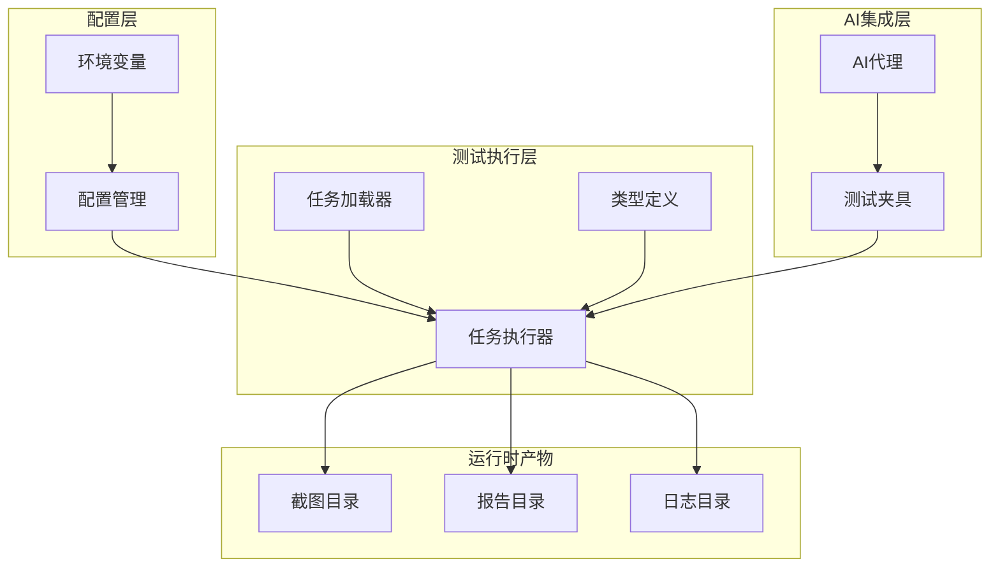
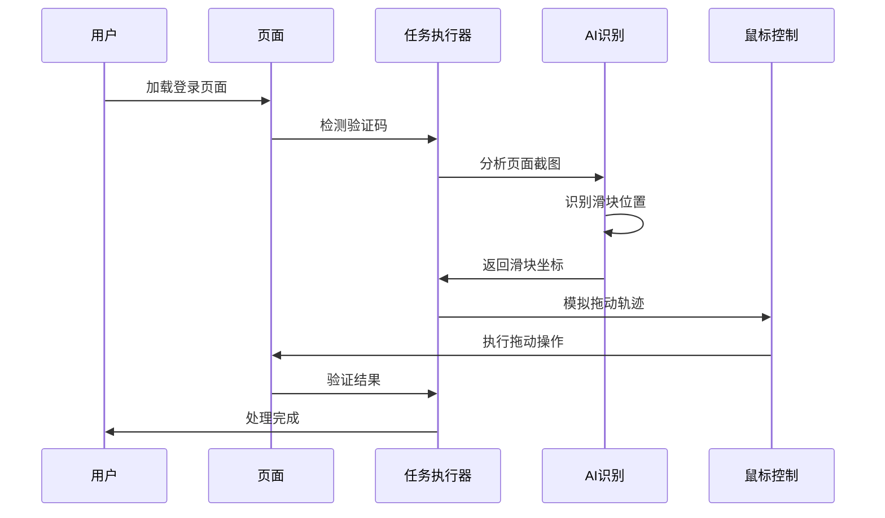
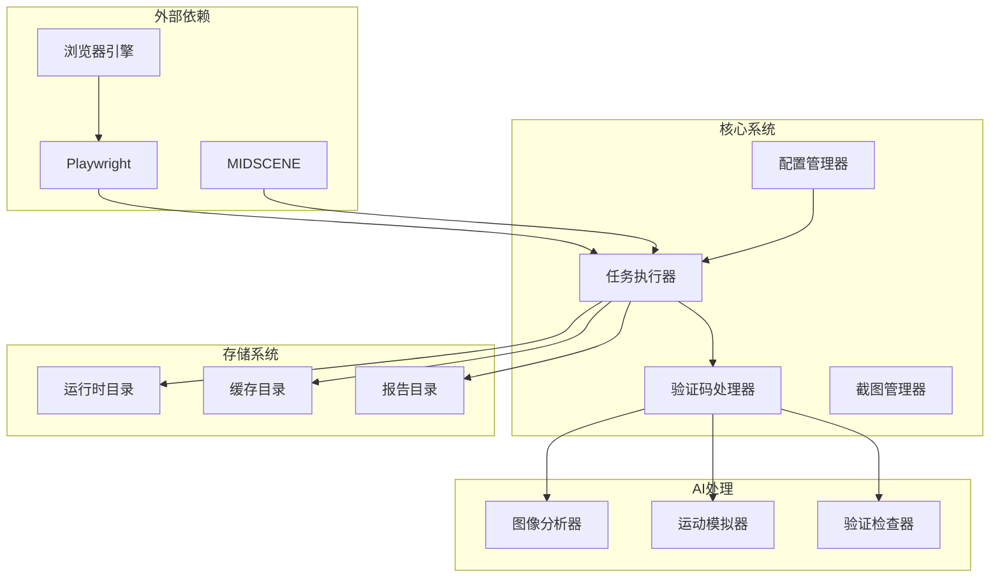
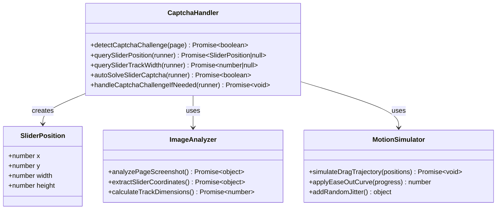
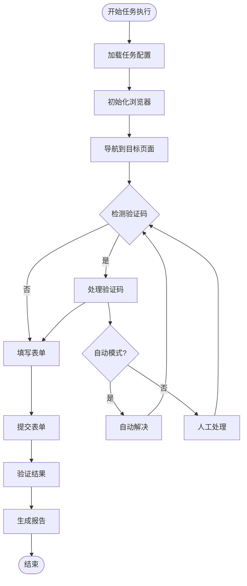
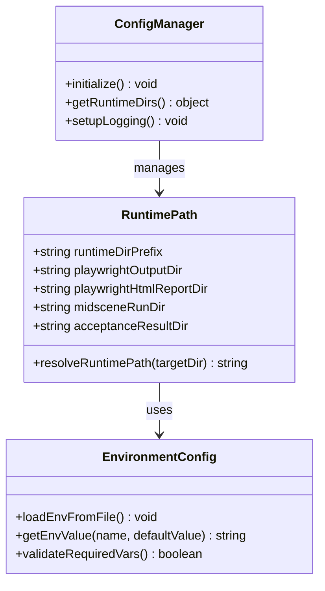
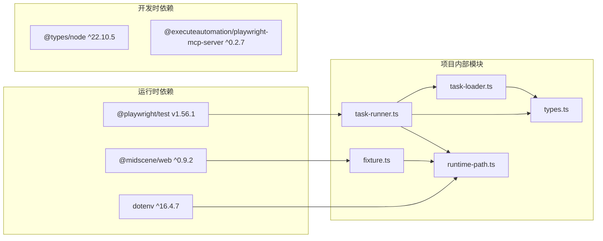

# 图像处理问题

<cite>
**本文引用的文件**
- [README.md](file://README.md)
- [package.json](file://package.json)
- [playwright.config.ts](file://playwright.config.ts)
- [config/runtime-path.ts](file://config/runtime-path.ts)
- [src/stage2/task-runner.ts](file://src/stage2/task-runner.ts)
- [src/stage2/task-loader.ts](file://src/stage2/task-loader.ts)
- [src/stage2/types.ts](file://src/stage2/types.ts)
- [tests/generated/stage2-acceptance-runner.spec.ts](file://tests/generated/stage2-acceptance-runner.spec.ts)
- [tests/fixture/fixture.ts](file://tests/fixture/fixture.ts)
- [specs/tasks/acceptance-task.community-create.example.json](file://specs/tasks/acceptance-task.community-create.example.json)
</cite>

## 目录
1. [简介](#简介)
2. [项目结构](#项目结构)
3. [核心组件](#核心组件)
4. [架构概览](#架构概览)
5. [详细组件分析](#详细组件分析)
6. [依赖关系分析](#依赖关系分析)
7. [性能考虑](#性能考虑)
8. [故障排除指南](#故障排除指南)
9. [结论](#结论)

## 简介

本指南专注于基于 Playwright 和 Midscene.js 的 AI 自动化测试项目中的图像处理问题。该项目实现了滑块验证码的自动识别和处理，涉及截图质量、图像格式转换、内存管理、图像识别精度等多个方面。本文档提供了专业的故障排除方法，帮助开发者快速定位和解决图像处理相关问题。

## 项目结构

该项目采用模块化架构，主要包含以下核心模块：



**图表来源**
- [config/runtime-path.ts](file://config/runtime-path.ts#L1-L41)
- [src/stage2/task-runner.ts](file://src/stage2/task-runner.ts#L1-L1344)
- [tests/fixture/fixture.ts](file://tests/fixture/fixture.ts#L1-L100)

**章节来源**
- [README.md](file://README.md#L1-L144)
- [package.json](file://package.json#L1-L24)

## 核心组件

### 滑块验证码处理系统

项目的核心功能是自动处理滑块验证码，这涉及到复杂的图像处理和计算机视觉技术：



**图表来源**
- [src/stage2/task-runner.ts](file://src/stage2/task-runner.ts#L558-L645)

### 环境配置管理系统

系统通过环境变量统一管理运行时配置：

| 配置项 | 默认值 | 描述 |
|--------|--------|------|
| RUNTIME_DIR_PREFIX | t_runtime/ | 运行时目录前缀 |
| PLAYWRIGHT_OUTPUT_DIR | t_runtime/test-results | Playwright输出目录 |
| PLAYWRIGHT_HTML_REPORT_DIR | t_runtime/playwright-report | HTML报告目录 |
| MIDSCENE_RUN_DIR | t_runtime/midscene_run | Midscene运行目录 |
| ACCEPTANCE_RESULT_DIR | t_runtime/acceptance-results | 接受测试结果目录 |

**章节来源**
- [config/runtime-path.ts](file://config/runtime-path.ts#L1-L41)
- [README.md](file://README.md#L39-L52)

## 架构概览



**图表来源**
- [src/stage2/task-runner.ts](file://src/stage2/task-runner.ts#L1-L1344)
- [tests/fixture/fixture.ts](file://tests/fixture/fixture.ts#L1-L100)

## 详细组件分析

### 滑块验证码识别组件

验证码识别是整个系统中最复杂的图像处理模块：



**图表来源**
- [src/stage2/task-runner.ts](file://src/stage2/task-runner.ts#L480-L703)

### 任务执行器组件

任务执行器负责协调整个自动化流程：



**图表来源**
- [src/stage2/task-runner.ts](file://src/stage2/task-runner.ts#L1-L1344)

**章节来源**
- [src/stage2/task-runner.ts](file://src/stage2/task-runner.ts#L1-L1344)

### 环境配置组件

配置管理系统提供了灵活的环境变量管理：



**图表来源**
- [config/runtime-path.ts](file://config/runtime-path.ts#L1-L41)

**章节来源**
- [config/runtime-path.ts](file://config/runtime-path.ts#L1-L41)

## 依赖关系分析



**图表来源**
- [package.json](file://package.json#L13-L22)
- [src/stage2/task-runner.ts](file://src/stage2/task-runner.ts#L1-L14)

**章节来源**
- [package.json](file://package.json#L1-L24)

## 性能考虑

### 内存管理策略

系统采用了多层内存管理策略来避免内存溢出：

1. **分层清理机制**：每个测试步骤结束后自动清理临时资源
2. **缓存控制**：合理设置AI查询缓存，避免无限增长
3. **异步处理**：使用Promise链式调用，避免阻塞主线程
4. **超时控制**：为每个操作设置合理的超时时间

### 性能监控指标

| 指标类型 | 监控方法 | 阈值建议 |
|----------|----------|----------|
| 内存使用 | process.memoryUsage() | < 500MB |
| 页面加载 | page.waitForLoadState() | < 30s |
| AI响应 | aiQuery()超时 | < 10s |
| 截图处理 | 截图大小限制 | < 10MB |
| 拖动操作 | 拖动时间 | < 5s |

## 故障排除指南

### 截图质量失败诊断

#### 1. 分辨率设置检查

**问题症状**：AI识别失败，滑块位置不准确

**诊断步骤**：
1. 检查浏览器窗口尺寸配置
2. 验证页面缩放比例
3. 确认DPI设置

**解决方案**：
- 设置固定窗口尺寸：`page.setViewportSize({ width: 1920, height: 1080 })`
- 禁用页面缩放：`page.emulateMedia({ viewport: { deviceScaleFactor: 1 } })`
- 强制刷新页面：`await page.reload({ waitUntil: 'domcontentloaded' })`

#### 2. 图像格式转换问题

**问题症状**：截图无法被AI正确解析

**诊断步骤**：
1. 检查截图格式一致性
2. 验证图像完整性
3. 确认色彩空间设置

**解决方案**：
- 统一使用PNG格式进行截图
- 禁用硬件加速：`--disable-gpu`
- 添加图像完整性检查

#### 3. 压缩参数调整

**问题症状**：图像质量下降，识别精度降低

**诊断步骤**：
1. 检查截图质量参数
2. 验证压缩级别设置
3. 确认图像尺寸限制

**解决方案**：
- 调整截图质量：`quality: 100`
- 禁用压缩：`omitBackground: false`
- 增加内存限制：`--js-flags=--max-old-space-size=4096`

### 图像格式不支持问题

#### 1. 格式兼容性检查

**问题症状**：AI查询返回格式错误

**诊断步骤**：
1. 检查AI查询返回的数据格式
2. 验证JSON解析结果
3. 确认字段完整性

**解决方案**：
```typescript
// 确保AI查询返回正确的数据结构
const result = await runner.aiQuery<{
  found: boolean;
  x?: number;
  y?: number;
  width?: number;
  height?: number;
}>('分析滑块位置');

if (!result || !result.found) {
  throw new Error('AI未能检测到滑块位置');
}

// 验证必需字段
if (result.x === undefined || result.y === undefined) {
  throw new Error('滑块坐标不完整');
}
```

#### 2. 转换工具使用

**问题症状**：图像格式转换失败

**诊断步骤**：
1. 检查图像转换库版本
2. 验证转换参数设置
3. 确认输出格式兼容性

**解决方案**：
- 使用标准化的图像处理流程
- 添加格式转换回退机制
- 实施错误重试策略

#### 3. 编码器配置

**问题症状**：编码过程异常中断

**诊断步骤**：
1. 检查编码器状态
2. 验证编码参数
3. 确认内存使用情况

**解决方案**：
- 设置合适的编码质量参数
- 实施编码进度监控
- 添加编码失败处理

### 内存溢出问题处理

#### 1. 图像大小限制

**问题症状**：执行过程中内存使用过高

**诊断步骤**：
1. 监控内存使用趋势
2. 检查截图文件大小
3. 验证缓存使用情况

**解决方案**：
```typescript
// 实施内存使用监控
function monitorMemoryUsage() {
  const usage = process.memoryUsage();
  console.log(`RSS: ${usage.rss / 1024 / 1024} MB`);
  console.log(`Heap Used: ${usage.heapUsed / 1024 / 1024} MB`);
  
  if (usage.heapUsed > 400 * 1024 * 1024) { // 400MB
    console.warn('内存使用过高，触发垃圾回收');
    global.gc();
  }
}

// 设置内存限制
process.env.NODE_OPTIONS = '--max-old-space-size=4096';
```

#### 2. 内存使用监控

**问题症状**：内存泄漏导致进程崩溃

**诊断步骤**：
1. 启用内存分析工具
2. 监控对象生命周期
3. 检查事件监听器泄漏

**解决方案**：
- 实施定期垃圾回收
- 清理未使用的事件监听器
- 优化大型对象的生命周期管理

#### 3. 垃圾回收优化

**问题症状**：频繁GC导致性能下降

**诊断步骤**：
1. 分析GC频率和持续时间
2. 检查大对象分配
3. 验证内存碎片情况

**解决方案**：
- 调整V8垃圾回收参数
- 实施对象池模式
- 优化内存分配策略

### 图像识别精度低下分析

#### 1. 对比度调整

**问题症状**：AI识别准确率低

**诊断步骤**：
1. 检查图像对比度
2. 验证亮度设置
3. 确认颜色饱和度

**解决方案**：
```typescript
// 实施图像预处理
async function preprocessImage(imageBuffer: Buffer): Promise<Buffer> {
  // 调整对比度
  const contrastAdjusted = adjustContrast(imageBuffer, 1.2);
  
  // 增强锐度
  const sharpened = enhanceSharpness(contrastAdjusted);
  
  // 转换为灰度图
  const grayscale = convertToGrayscale(sharpened);
  
  return grayscale;
}

// 预处理函数
function adjustContrast(buffer: Buffer, factor: number): Buffer {
  // 实现对比度调整算法
  return buffer;
}

function enhanceSharpness(buffer: Buffer): Buffer {
  // 实现锐化算法
  return buffer;
}

function convertToGrayscale(buffer: Buffer): Buffer {
  // 实现灰度转换
  return buffer;
}
```

#### 2. 噪声过滤

**问题症状**：图像中有噪声干扰识别

**诊断步骤**：
1. 分析噪声类型
2. 检查图像质量
3. 验证滤波效果

**解决方案**：
```typescript
// 实施噪声过滤
async function filterNoise(imageBuffer: Buffer): Promise<Buffer> {
  // 应用高斯滤波
  const gaussianFiltered = applyGaussianFilter(imageBuffer);
  
  // 应用中值滤波
  const medianFiltered = applyMedianFilter(gaussianFiltered);
  
  // 应用双边滤波
  const bilateralFiltered = applyBilateralFilter(medianFiltered);
  
  return bilateralFiltered;
}

function applyGaussianFilter(buffer: Buffer): Buffer {
  // 实现高斯滤波
  return buffer;
}

function applyMedianFilter(buffer: Buffer): Buffer {
  // 实现中值滤波
  return buffer;
}

function applyBilateralFilter(buffer: Buffer): Buffer {
  // 实现双边滤波
  return buffer;
}
```

#### 3. 预处理增强

**问题症状**：识别结果不稳定

**诊断步骤**：
1. 检查预处理流程
2. 验证增强算法效果
3. 确认参数设置

**解决方案**：
```typescript
// 实施综合预处理
async function enhanceImage(imageBuffer: Buffer): Promise<Buffer> {
  // 多级预处理
  let processed = imageBuffer;
  
  // 步骤1: 噪声过滤
  processed = await filterNoise(processed);
  
  // 步骤2: 对比度增强
  processed = await preprocessImage(processed);
  
  // 步骤3: 几何校正
  processed = await correctGeometry(processed);
  
  // 步骤4: 颜色平衡
  processed = await balanceColors(processed);
  
  return processed;
}

function correctGeometry(buffer: Buffer): Buffer {
  // 实现几何校正
  return buffer;
}

function balanceColors(buffer: Buffer): Buffer {
  // 实现颜色平衡
  return buffer;
}
```

### 图像传输失败调试

#### 1. 网络稳定性检查

**问题症状**：AI服务连接失败

**诊断步骤**：
1. 检查网络连接状态
2. 验证DNS解析
3. 确认防火墙设置

**解决方案**：
```typescript
// 实施网络连接监控
class NetworkMonitor {
  private connectionStatus: boolean = true;
  private retryCount: number = 0;
  
  async checkConnection(url: string): Promise<boolean> {
    try {
      const response = await fetch(url, { 
        method: 'HEAD',
        timeout: 5000
      });
      return response.ok;
    } catch (error) {
      return false;
    }
  }
  
  async retryWithBackoff(operation: Function, maxRetries: number = 3): Promise<any> {
    for (let i = 0; i < maxRetries; i++) {
      try {
        return await operation();
      } catch (error) {
        if (i === maxRetries - 1) throw error;
        
        const delay = Math.pow(2, i) * 1000; // 指数退避
        await new Promise(resolve => setTimeout(resolve, delay));
      }
    }
  }
}
```

#### 2. 超时参数调整

**问题症状**：请求超时导致失败

**诊断步骤**：
1. 检查当前超时设置
2. 分析网络延迟
3. 验证服务器响应时间

**解决方案**：
```typescript
// 配置超时参数
const TIMEOUT_CONFIG = {
  AI_QUERY_TIMEOUT: 30000,    // 30秒
  PAGE_LOAD_TIMEOUT: 60000,   // 60秒
  CAPTCHA_WAIT_TIMEOUT: 120000, // 120秒
  MOUSE_OPERATION_TIMEOUT: 10000, // 10秒
};

// 动态调整超时
function adjustTimeout(operation: string): number {
  switch (operation) {
    case 'aiQuery':
      return TIMEOUT_CONFIG.AI_QUERY_TIMEOUT;
    case 'pageLoad':
      return TIMEOUT_CONFIG.PAGE_LOAD_TIMEOUT;
    case 'captchaWait':
      return TIMEOUT_CONFIG.CAPTCHA_WAIT_TIMEOUT;
    case 'mouseOperation':
      return TIMEOUT_CONFIG.MOUSE_OPERATION_TIMEOUT;
    default:
      return 30000;
  }
}
```

#### 3. 重试机制配置

**问题症状**：偶发性失败影响成功率

**诊断步骤**：
1. 分析失败模式
2. 检查重试策略
3. 验证指数退避

**解决方案**：
```typescript
// 实施智能重试机制
class RetryManager {
  private maxRetries: number;
  private baseDelay: number;
  private maxDelay: number;
  
  constructor(maxRetries: number = 3, baseDelay: number = 1000, maxDelay: number = 30000) {
    this.maxRetries = maxRetries;
    this.baseDelay = baseDelay;
    this.maxDelay = maxDelay;
  }
  
  async executeWithRetry<T>(operation: () => Promise<T>): Promise<T> {
    let lastError: Error;
    
    for (let i = 0; i < this.maxRetries; i++) {
      try {
        return await operation();
      } catch (error) {
        lastError = error as Error;
        
        if (i < this.maxRetries - 1) {
          const delay = Math.min(
            this.baseDelay * Math.pow(2, i),
            this.maxDelay
          );
          
          console.log(`第 ${i + 1} 次尝试失败，${delay}ms 后重试`);
          await new Promise(resolve => setTimeout(resolve, delay));
        }
      }
    }
    
    throw lastError;
  }
}
```

### 错误代码和解决步骤

#### 常见错误代码对照表

| 错误代码 | 错误类型 | 描述 | 解决步骤 |
|----------|----------|------|----------|
| CAPTCHA_NOT_FOUND | 识别错误 | 无法检测到滑块验证码 | 检查页面截图，调整AI查询参数 |
| CAPTCHA_PROCESS_FAILED | 处理错误 | 滑块拖动失败 | 检查鼠标控制，增加重试次数 |
| MEMORY_EXCEEDED | 内存错误 | 内存使用超过限制 | 增加内存限制，优化图像处理 |
| IMAGE_FORMAT_ERROR | 格式错误 | 图像格式不支持 | 转换为PNG格式，检查编码器 |
| NETWORK_TIMEOUT | 网络错误 | AI服务连接超时 | 检查网络连接，调整超时参数 |
| CACHE_MISS | 缓存错误 | AI查询缓存失效 | 清理缓存，重新初始化AI代理 |

#### 具体解决步骤

**步骤1：问题诊断**
1. 查看错误日志中的具体错误代码
2. 检查相关配置参数
3. 验证环境变量设置

**步骤2：临时解决方案**
1. 应用紧急修复措施
2. 调整相关参数
3. 重启相关服务

**步骤3：永久修复**
1. 分析根本原因
2. 实施代码修复
3. 更新配置文件

**步骤4：验证效果**
1. 重新运行测试
2. 监控系统状态
3. 更新文档记录

**章节来源**
- [src/stage2/task-runner.ts](file://src/stage2/task-runner.ts#L647-L703)
- [tests/fixture/fixture.ts](file://tests/fixture/fixture.ts#L1-L100)

## 结论

本指南提供了基于Playwright和Midscene.js的AI自动化测试项目中图像处理问题的完整故障排除方案。通过系统性的诊断方法、针对性的解决方案和预防性措施，可以有效提升系统的稳定性和可靠性。

关键要点包括：
- 建立完善的监控体系
- 实施多层次的容错机制
- 优化资源配置和内存管理
- 建立标准化的故障处理流程

建议团队定期回顾和更新这些最佳实践，以适应不断变化的技术环境和业务需求。