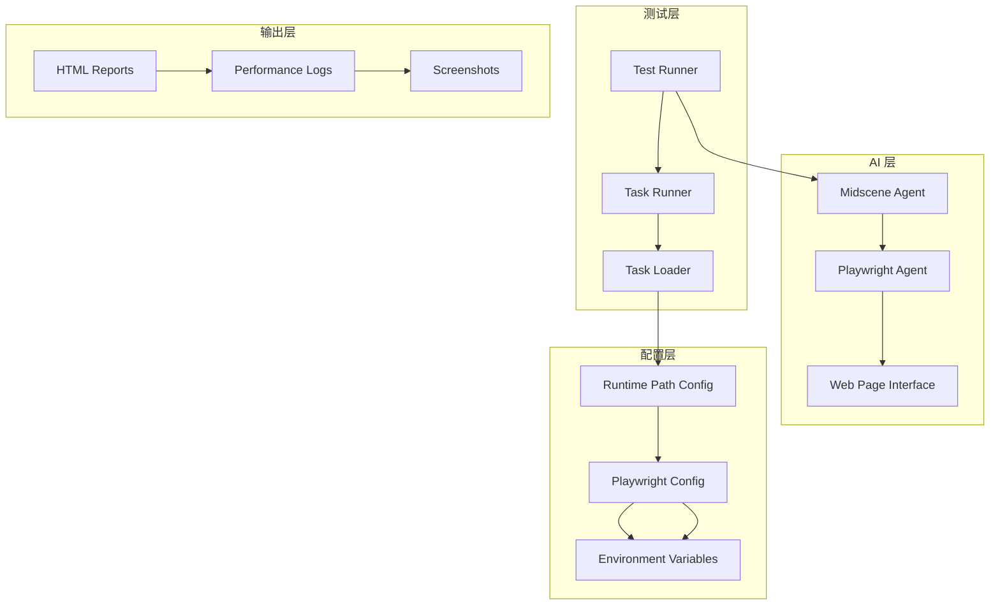
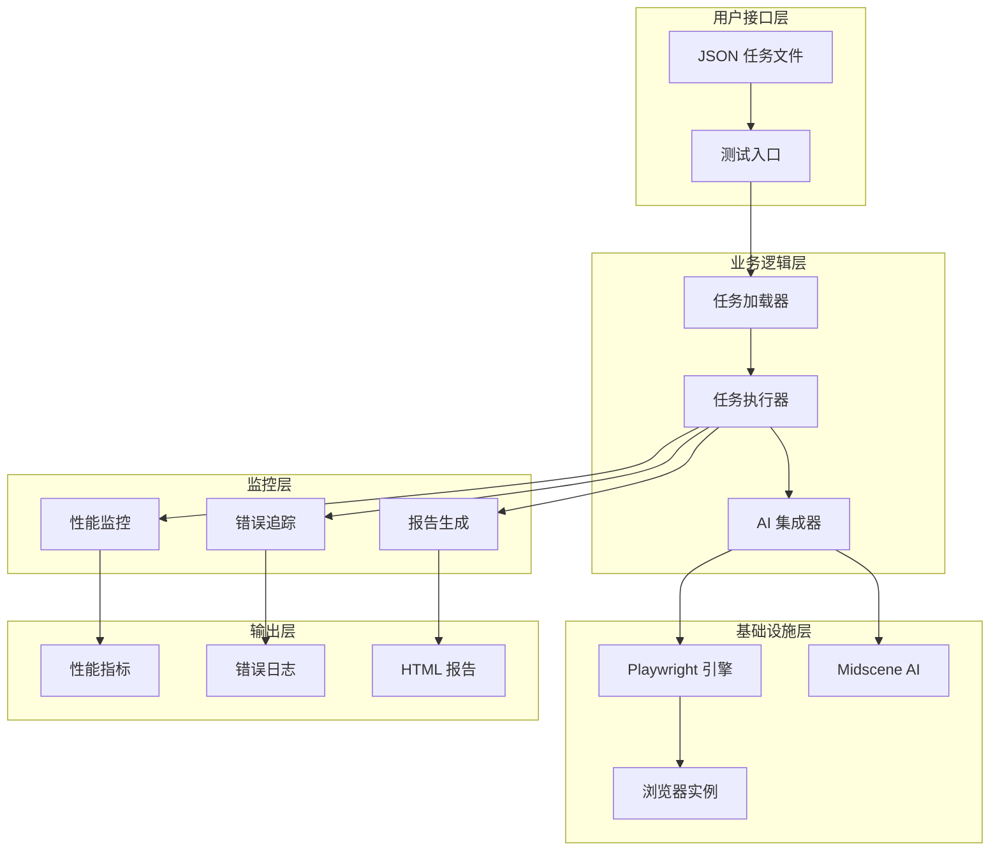
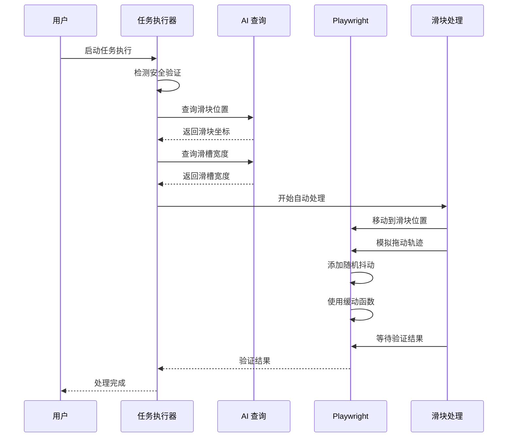
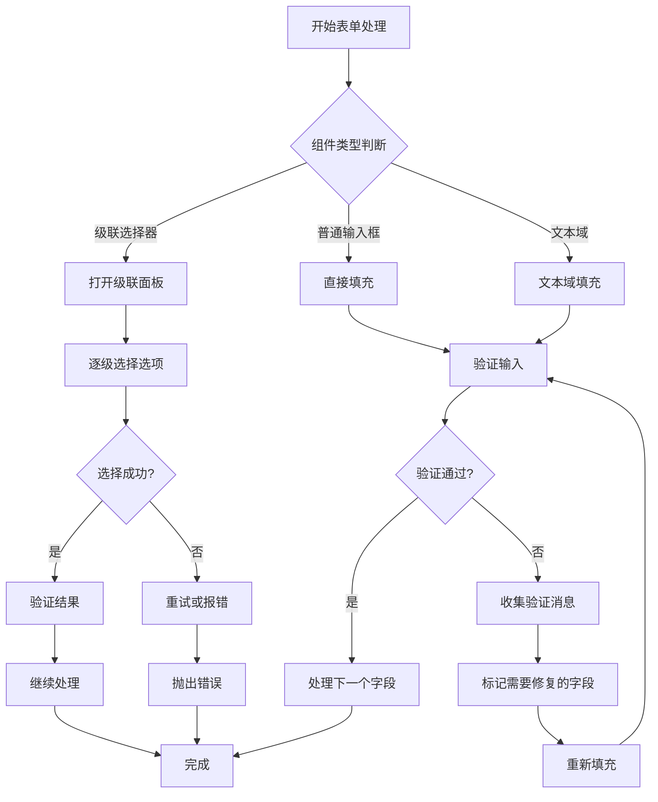
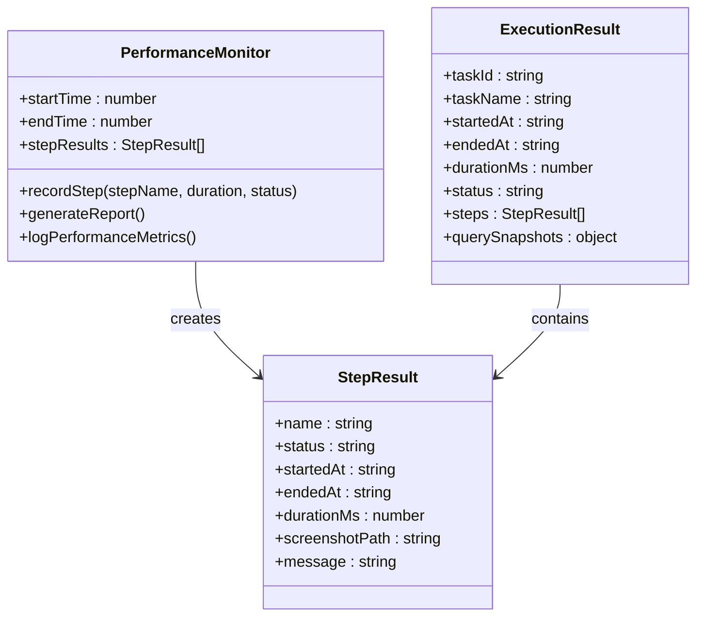
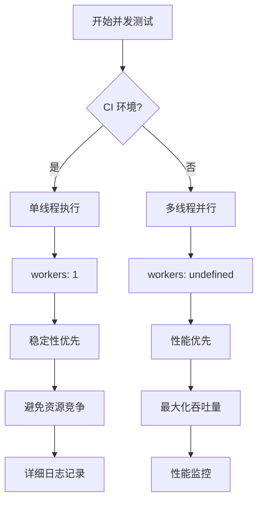

# 性能问题分析

<cite>
**本文引用的文件**
- [README.md](file://README.md)
- [package.json](file://package.json)
- [playwright.config.ts](file://playwright.config.ts)
- [src/stage2/task-runner.ts](file://src/stage2/task-runner.ts)
- [src/stage2/task-loader.ts](file://src/stage2/task-loader.ts)
- [src/stage2/types.ts](file://src/stage2/types.ts)
- [config/runtime-path.ts](file://config/runtime-path.ts)
- [tests/generated/stage2-acceptance-runner.spec.ts](file://tests/generated/stage2-acceptance-runner.spec.ts)
- [tests/fixture/fixture.ts](file://tests/fixture/fixture.ts)
</cite>

## 目录
1. [简介](#简介)
2. [项目结构](#项目结构)
3. [核心组件](#核心组件)
4. [架构概览](#架构概览)
5. [详细组件分析](#详细组件分析)
6. [依赖关系分析](#依赖关系分析)
7. [性能考虑因素](#性能考虑因素)
8. [故障排除指南](#故障排除指南)
9. [结论](#结论)

## 简介

本指南专注于基于 Playwright 和 Midscene.js 的 AI 自动化测试项目的性能问题分析与优化。该项目通过 AI 能力实现智能的页面元素定位、数据提取和断言验证，支持滑块验证码的自动处理，并提供了完整的性能监控和调试工具链。

项目采用模块化设计，主要包含以下核心功能：
- 基于 JSON 的任务驱动执行器
- AI 辅助的页面交互和数据提取
- 智能的元素定位和验证机制
- 完整的性能监控和报告系统
- 支持多种浏览器环境的并发测试

## 项目结构

项目采用清晰的分层架构，主要分为以下几个层次：



**图表来源**
- [src/stage2/task-runner.ts](file://src/stage2/task-runner.ts#L1-L50)
- [src/stage2/task-loader.ts](file://src/stage2/task-loader.ts#L1-L30)
- [config/runtime-path.ts](file://config/runtime-path.ts#L1-L41)

**章节来源**
- [README.md](file://README.md#L1-L144)
- [package.json](file://package.json#L1-L24)

## 核心组件

### 任务执行器 (Task Runner)

任务执行器是整个系统的核心，负责协调各个组件完成端到端的自动化测试流程。其主要职责包括：

- **任务解析和加载**：从 JSON 文件中读取任务配置并进行模板变量替换
- **页面导航和交互**：通过 AI 能力和传统定位策略相结合的方式与页面交互
- **表单填充和验证**：智能处理各种表单组件，包括级联选择器
- **断言执行**：支持多种断言类型，包括 toast 提示、表格数据等
- **性能监控**：记录每个步骤的执行时间和状态

### AI 集成层

系统集成了 Midscene.js 的 AI 能力，提供以下核心功能：

- **智能元素定位**：通过自然语言描述定位页面元素
- **数据提取**：从页面中提取结构化数据
- **断言验证**：基于 AI 的智能断言执行
- **交互指导**：为复杂的页面操作提供智能指导

### 配置管理系统

通过环境变量和配置文件实现灵活的运行时配置：

- **运行时目录管理**：统一管理所有输出文件的存储位置
- **浏览器配置**：支持多种浏览器环境的配置
- **性能参数调优**：提供详细的性能相关参数设置

**章节来源**
- [src/stage2/task-runner.ts](file://src/stage2/task-runner.ts#L1062-L1344)
- [src/stage2/types.ts](file://src/stage2/types.ts#L86-L125)

## 架构概览

系统采用分层架构设计，各层之间职责明确，耦合度低：



**图表来源**
- [tests/generated/stage2-acceptance-runner.spec.ts](file://tests/generated/stage2-acceptance-runner.spec.ts#L1-L39)
- [src/stage2/task-runner.ts](file://src/stage2/task-runner.ts#L1062-L1155)
- [tests/fixture/fixture.ts](file://tests/fixture/fixture.ts#L23-L99)

## 详细组件分析

### 滑块验证码自动处理组件

该组件专门处理常见的滑块验证码挑战，实现了智能的 AI + Playwright 协作模式：



**图表来源**
- [src/stage2/task-runner.ts](file://src/stage2/task-runner.ts#L558-L645)

该组件的关键优化点包括：
- **AI 查询优化**：通过精确的提示词减少 AI 处理时间
- **拖动轨迹模拟**：使用物理上合理的缓动函数和随机抖动
- **重试机制**：最多 3 次自动处理尝试，失败后降级处理
- **错误恢复**：确保鼠标状态正确释放，避免后续操作异常

### 表单填充和验证组件

系统实现了智能的表单处理机制，支持多种表单组件类型：



**图表来源**
- [src/stage2/task-runner.ts](file://src/stage2/task-runner.ts#L894-L971)

**章节来源**
- [src/stage2/task-runner.ts](file://src/stage2/task-runner.ts#L480-L703)

### 性能监控和报告组件

系统内置了完整的性能监控机制，提供详细的执行统计和调试信息：



**图表来源**
- [src/stage2/task-runner.ts](file://src/stage2/task-runner.ts#L1086-L1155)
- [src/stage2/types.ts](file://src/stage2/types.ts#L100-L125)

**章节来源**
- [src/stage2/task-runner.ts](file://src/stage2/task-runner.ts#L1062-L1344)

## 依赖关系分析

系统采用模块化的依赖管理，各组件之间的关系清晰明确：

```mermaid
graph LR
subgraph "外部依赖"
A[@playwright/test] --> B[测试框架]
C[@midscene/web] --> D[AI 能力]
E[dotenv] --> F[环境变量]
end
subgraph "内部模块"
G[task-runner] --> H[task-loader]
G --> I[runtime-path]
G --> J[types]
H --> I
K[fixture] --> L[Midscene Agent]
L --> M[Playwright Agent]
M --> N[Web Page Interface]
end
subgraph "配置"
O[playwright.config] --> P[测试配置]
Q[package.json] --> R[脚本命令]
end
A --> G
C --> L
E --> O
F --> Q
```

**图表来源**
- [package.json](file://package.json#L13-L22)
- [playwright.config.ts](file://playwright.config.ts#L1-L95)
- [src/stage2/task-runner.ts](file://src/stage2/task-runner.ts#L1-L14)

**章节来源**
- [package.json](file://package.json#L1-L24)
- [playwright.config.ts](file://playwright.config.ts#L1-L95)

## 性能考虑因素

### 页面加载优化策略

系统在页面加载方面采用了多项优化措施：

1. **智能等待策略**：根据不同场景选择合适的等待条件
2. **超时参数化**：允许通过配置文件调整超时时间
3. **预加载检查**：在关键操作前进行页面状态检查
4. **资源清理**：及时释放不需要的资源和内存

### 元素查找加速技术

为了提高元素查找效率，系统实现了以下优化：

- **多策略定位**：结合角色、文本、选择器等多种定位方式
- **可见性优先**：优先查找可见元素，避免无效操作
- **缓存机制**：对常用元素进行缓存，减少重复查找
- **智能回退**：当首选策略失败时快速切换到备选方案

### AI 处理时间优化

针对 AI 处理的性能优化包括：

- **精确提示词设计**：减少 AI 处理歧义和重试
- **批量处理**：合理安排 AI 请求的批次大小
- **缓存利用**：复用之前的 AI 结果和中间状态
- **异步处理**：避免阻塞主线程的操作

### 内存使用优化

系统在内存管理方面采取了以下措施：

- **及时释放**：操作完成后立即释放临时对象
- **资源池管理**：复用浏览器实例和连接
- **垃圾回收**：定期触发垃圾回收机制
- **监控告警**：实时监控内存使用情况

**章节来源**
- [src/stage2/task-runner.ts](file://src/stage2/task-runner.ts#L117-L126)
- [src/stage2/task-runner.ts](file://src/stage2/task-runner.ts#L1110-L1155)

## 故障排除指南

### 常见性能问题诊断

#### 页面加载缓慢

**症状表现**：
- 页面长时间处于加载状态
- 元素定位超时
- 整体执行时间异常延长

**诊断步骤**：
1. 检查网络连接和服务器响应时间
2. 分析页面资源加载情况
3. 监控浏览器内存使用情况
4. 查看网络请求的耗时分布

**解决方案**：
- 优化页面资源加载顺序
- 实施懒加载策略
- 减少不必要的网络请求
- 使用 CDN 加速静态资源

#### 元素查找失败

**症状表现**：
- 定位不到目标元素
- 元素存在但不可见
- 动态元素加载延迟

**诊断步骤**：
1. 检查元素选择器的有效性
2. 验证页面状态和加载完成度
3. 分析元素的可见性和可用性
4. 确认页面结构变化

**解决方案**：
- 使用更稳定的定位策略
- 实施重试机制
- 优化等待条件
- 调整超时参数

#### AI 处理异常

**症状表现**：
- AI 查询结果不准确
- 处理时间过长
- 重复的错误重试

**诊断步骤**：
1. 检查提示词的清晰度和准确性
2. 分析 AI 模型的响应质量
3. 监控 API 调用频率和配额
4. 验证输入数据的格式正确性

**解决方案**：
- 优化提示词设计
- 实施结果缓存
- 调整重试策略
- 监控 API 使用情况

### 并发执行和资源管理

系统支持多种并发执行模式，需要合理配置以获得最佳性能：



**图表来源**
- [playwright.config.ts](file://playwright.config.ts#L34-L34)

**章节来源**
- [playwright.config.ts](file://playwright.config.ts#L28-L34)

### 大数据量处理策略

对于需要处理大量数据的场景，系统提供了以下优化策略：

1. **分批处理**：将大数据集分割成小批次处理
2. **增量加载**：只加载当前需要的数据
3. **结果缓存**：缓存计算结果避免重复处理
4. **流式处理**：支持流式数据的实时处理

### 性能监控和基准测试

系统内置了完善的性能监控机制：

- **执行时间统计**：记录每个步骤的执行时间
- **内存使用监控**：实时跟踪内存使用情况
- **错误率统计**：统计各类错误的发生频率
- **报告生成**：自动生成详细的性能报告

**章节来源**
- [src/stage2/task-runner.ts](file://src/stage2/task-runner.ts#L1086-L1106)
- [tests/generated/stage2-acceptance-runner.spec.ts](file://tests/generated/stage2-acceptance-runner.spec.ts#L10-L10)

## 结论

本项目通过精心设计的架构和多项性能优化策略，为 AI 驱动的自动化测试提供了高效可靠的解决方案。关键的性能优化包括：

1. **智能的元素定位策略**：结合多种定位方式提高查找效率
2. **AI 处理优化**：通过精确的提示词和缓存机制提升 AI 性能
3. **并发执行管理**：灵活的并发策略适应不同环境需求
4. **完整的监控体系**：提供详细的性能指标和调试信息

通过遵循本文提供的诊断方法和优化策略，开发者可以有效识别和解决系统中的性能瓶颈，进一步提升自动化测试的效率和可靠性。建议在实际部署中根据具体场景调整相关参数，并建立持续的性能监控机制。