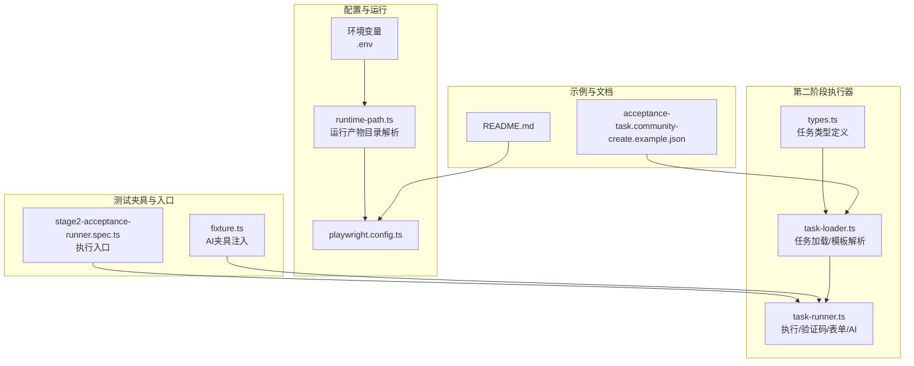
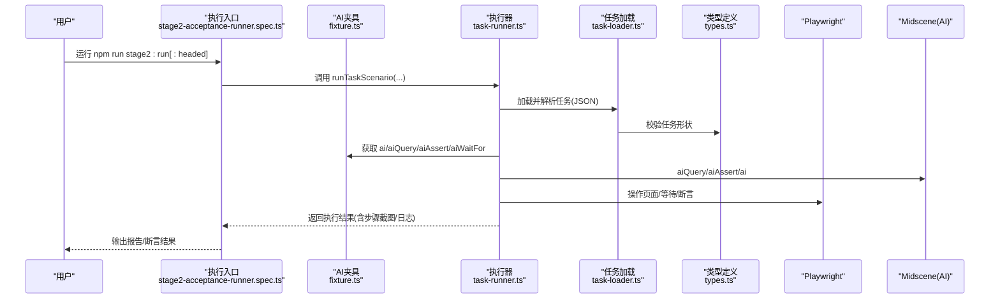
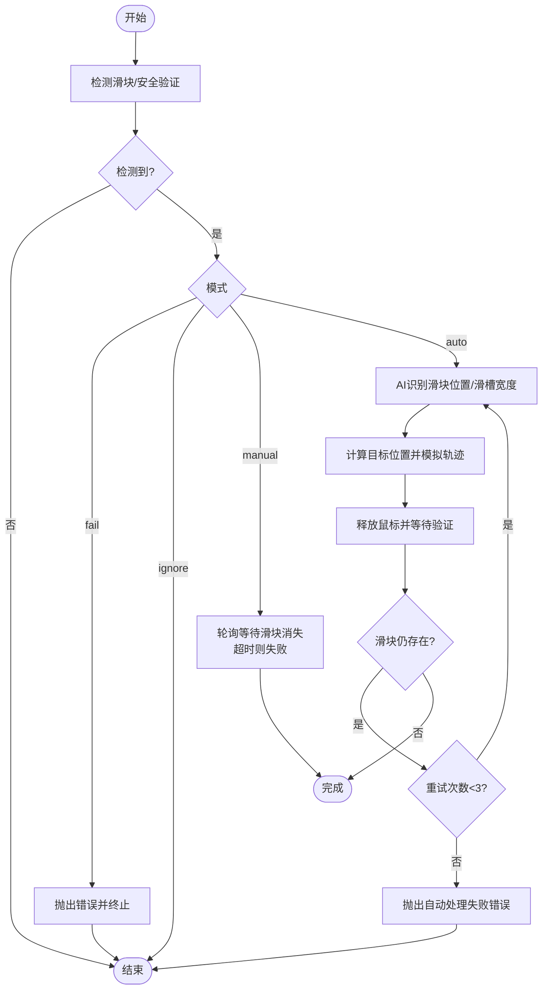
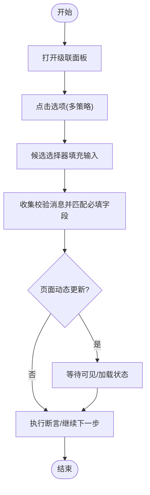
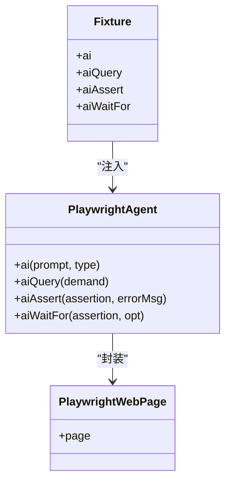
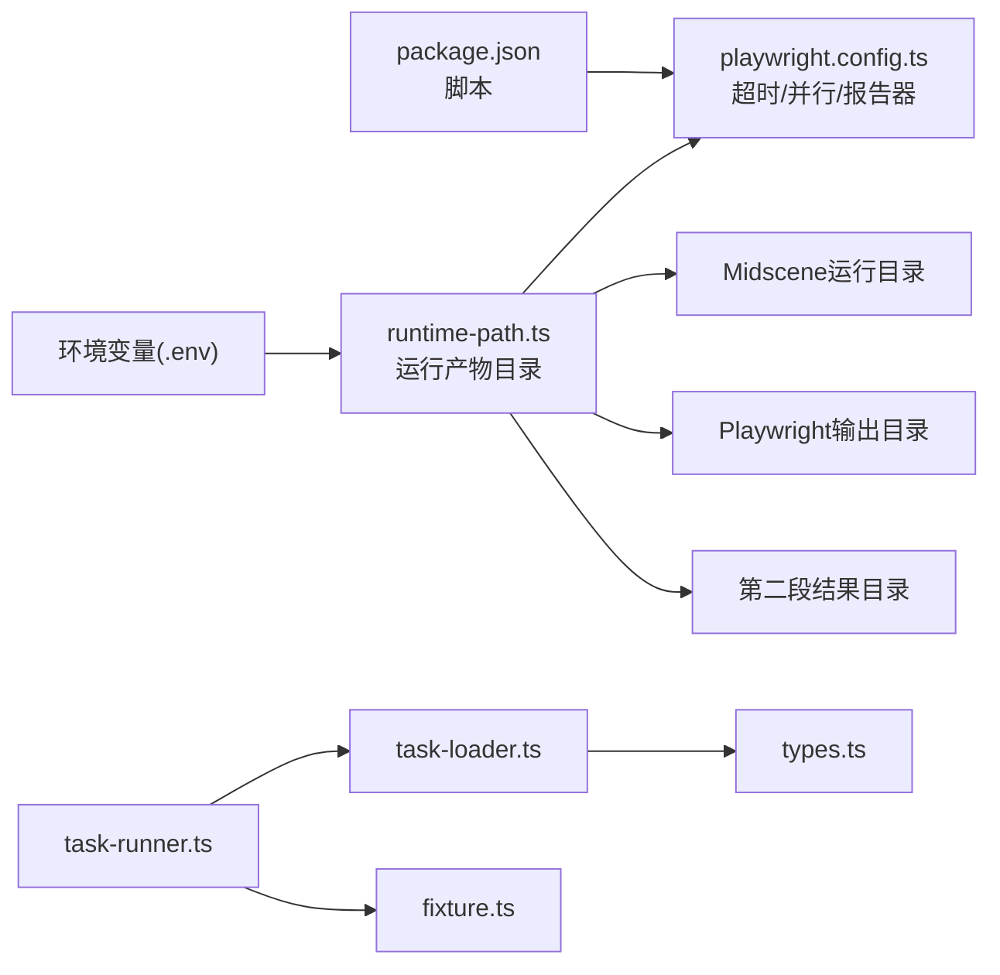

# 故障排除

<cite>
**本文引用的文件**
- [README.md](file://README.md)
- [package.json](file://package.json)
- [playwright.config.ts](file://playwright.config.ts)
- [config/runtime-path.ts](file://config/runtime-path.ts)
- [src/stage2/types.ts](file://src/stage2/types.ts)
- [src/stage2/task-loader.ts](file://src/stage2/task-loader.ts)
- [src/stage2/task-runner.ts](file://src/stage2/task-runner.ts)
- [tests/fixture/fixture.ts](file://tests/fixture/fixture.ts)
- [tests/generated/stage2-acceptance-runner.spec.ts](file://tests/generated/stage2-acceptance-runner.spec.ts)
- [specs/tasks/acceptance-task.community-create.example.json](file://specs/tasks/acceptance-task.community-create.example.json)
- [.github/chatmodes/🎭 healer.chatmode.md](file://.github/chatmodes/🎭 healer.chatmode.md)
</cite>

## 目录
1. [简介](#简介)
2. [项目结构](#项目结构)
3. [核心组件](#核心组件)
4. [架构总览](#架构总览)
5. [详细组件分析](#详细组件分析)
6. [依赖关系分析](#依赖关系分析)
7. [性能考虑](#性能考虑)
8. [故障排除指南](#故障排除指南)
9. [结论](#结论)
10. [附录](#附录)

## 简介
本指南面向使用 HI-TEST 项目的开发者与测试工程师，聚焦于常见问题的系统性排查与修复，覆盖环境配置、依赖安装、浏览器启动、验证码处理、表单处理、AI 集成、性能优化与日志调试等方面。文档同时提供可操作的定位步骤、可视化流程图与最佳实践，帮助快速恢复稳定执行。

## 项目结构
- 核心运行时与配置
  - 运行产物目录由环境变量集中管理，统一收敛至 t_runtime/ 下，便于定位与清理。
  - Playwright 配置集中于 playwright.config.ts，包含超时、并行度、报告器与设备配置。
- 第二阶段执行器
  - 任务加载与解析：src/stage2/task-loader.ts 负责任务文件加载、模板变量替换与形状校验。
  - 任务执行与 AI 集成：src/stage2/task-runner.ts 提供滑块验证码处理、表单填写、断言与步骤截图等能力。
  - 类型定义：src/stage2/types.ts 定义了 AcceptanceTask、TaskForm、TaskField 等核心数据模型。
- 测试夹具与入口
  - tests/fixture/fixture.ts 注入 AI 能力（ai、aiQuery、aiAssert、aiWaitFor），并设置 Midscene 日志目录。
  - tests/generated/stage2-acceptance-runner.spec.ts 作为 JSON 任务驱动的执行入口。
- 示例任务与文档
  - specs/tasks/acceptance-task.community-create.example.json 提供可直接使用的任务模板。
  - README.md 提供安装、配置与运行说明，以及验证码自动处理策略。

**图表来源**
- [playwright.config.ts](file://playwright.config.ts#L1-L95)
- [config/runtime-path.ts](file://config/runtime-path.ts#L1-L41)
- [src/stage2/task-loader.ts](file://src/stage2/task-loader.ts#L1-L91)
- [src/stage2/task-runner.ts](file://src/stage2/task-runner.ts#L1-L1344)
- [src/stage2/types.ts](file://src/stage2/types.ts#L1-L125)
- [tests/fixture/fixture.ts](file://tests/fixture/fixture.ts#L1-L100)
- [tests/generated/stage2-acceptance-runner.spec.ts](file://tests/generated/stage2-acceptance-runner.spec.ts#L1-L39)
- [specs/tasks/acceptance-task.community-create.example.json](file://specs/tasks/acceptance-task.community-create.example.json#L1-L184)
- [README.md](file://README.md#L1-L144)

**章节来源**
- [README.md](file://README.md#L1-L144)
- [playwright.config.ts](file://playwright.config.ts#L1-L95)
- [config/runtime-path.ts](file://config/runtime-path.ts#L1-L41)

## 核心组件
- 任务加载与解析
  - 解析任务文件路径、模板变量替换（NOW_YYYYMMDDHHMMSS、环境变量）、形状校验与错误提示。
- 执行器与 AI 集成
  - 统一的 RunnerContext，封装 page 与 AI 能力（ai、aiQuery、aiAssert、aiWaitFor）。
  - 滑块验证码自动处理：AI 识别滑块位置与滑槽宽度，模拟真人拖动轨迹，最多重试 3 次。
  - 表单处理：级联选择器打开与选项点击、候选选择器填充、可见性与定位容错。
  - 断言与验证：收集表单校验消息、匹配必填字段、等待元素可见与加载状态。
- 测试夹具
  - 为每个测试用例注入 AI Agent，设置缓存 ID、分组信息与报告生成开关。
- 运行产物与报告
  - Playwright 报告、Midscene 报告、第二段结果与步骤截图统一收敛到 t_runtime/ 下。

**章节来源**
- [src/stage2/task-loader.ts](file://src/stage2/task-loader.ts#L1-L91)
- [src/stage2/task-runner.ts](file://src/stage2/task-runner.ts#L1-L1344)
- [src/stage2/types.ts](file://src/stage2/types.ts#L1-L125)
- [tests/fixture/fixture.ts](file://tests/fixture/fixture.ts#L1-L100)
- [README.md](file://README.md#L74-L132)

## 架构总览
下图展示了从任务 JSON 到最终结果的执行链路，以及 AI 与 Playwright 的协作点。

**图表来源**
- [tests/generated/stage2-acceptance-runner.spec.ts](file://tests/generated/stage2-acceptance-runner.spec.ts#L1-L39)
- [tests/fixture/fixture.ts](file://tests/fixture/fixture.ts#L1-L100)
- [src/stage2/task-runner.ts](file://src/stage2/task-runner.ts#L1-L1344)
- [src/stage2/task-loader.ts](file://src/stage2/task-loader.ts#L1-L91)
- [src/stage2/types.ts](file://src/stage2/types.ts#L1-L125)

## 详细组件分析

### 组件A：滑块验证码处理（AI + Playwright）
- 检测策略
  - 文案关键词检测与常见选择器检测双通道，提高鲁棒性。
- 自动处理流程
  - AI 识别滑块中心点与滑槽宽度 → 计算目标位置 → 模拟真人轨迹（15 步、easeOut、随机抖动）→ 释放鼠标 → 等待并验证滑块消失。
  - 最多重试 3 次，失败时抛出明确错误并给出建议。
- 人工兜底与失败策略
  - manual 模式：在超时时间内轮询检测，超时则失败。
  - fail 模式：检测即失败。
  - ignore 模式：跳过检测（不推荐）。

**图表来源**
- [src/stage2/task-runner.ts](file://src/stage2/task-runner.ts#L480-L703)

**章节来源**
- [src/stage2/task-runner.ts](file://src/stage2/task-runner.ts#L480-L703)
- [README.md](file://README.md#L54-L72)

### 组件B：表单处理与断言（元素定位、输入验证、动态更新）
- 级联选择器处理
  - 打开面板：优先可见输入框点击，否则通过 AI 描述进行交互。
  - 选项点击：多选择器与 role 菜单项兼容，支持精确文本与过滤文本两种定位策略。
- 输入与填充
  - 候选占位文案匹配、可见性优先、超时控制与容错。
- 动态更新与校验
  - 收集各类 UI 校验消息（Element Plus、Ant Design、iView 等），匹配必填字段并高亮提示。
  - 等待元素可见、等待加载状态，避免竞态。

**图表来源**
- [src/stage2/task-runner.ts](file://src/stage2/task-runner.ts#L705-L803)
- [src/stage2/task-runner.ts](file://src/stage2/task-runner.ts#L256-L404)

**章节来源**
- [src/stage2/task-runner.ts](file://src/stage2/task-runner.ts#L256-L404)
- [src/stage2/task-runner.ts](file://src/stage2/task-runner.ts#L705-L803)

### 组件C：AI 集成与断言（模型配置、图像处理、断言不匹配）
- 夹具注入
  - 为每个测试用例创建独立的 AI Agent，设置 testId、cacheId、分组信息与报告生成。
- 断言与等待
  - aiAssert 支持传入错误信息，aiWaitFor 支持超时与轮询策略。
- 常见问题
  - 模型配置错误：检查 OPENAI_API_KEY、OPENAI_BASE_URL、MIDSCENE_MODEL_NAME。
  - 图像处理失败：确认截图可用、AI 查询 prompt 清晰、网络连通。
  - 断言不匹配：核对期望文案、字段映射、表格列顺序。

**图表来源**
- [tests/fixture/fixture.ts](file://tests/fixture/fixture.ts#L23-L99)

**章节来源**
- [tests/fixture/fixture.ts](file://tests/fixture/fixture.ts#L1-L100)

## 依赖关系分析
- 运行时目录
  - RUNTIME_DIR_PREFIX 统一前缀，PLAYWRIGHT_OUTPUT_DIR、PLAYWRIGHT_HTML_REPORT_DIR、MIDSCENE_RUN_DIR、ACCEPTANCE_RESULT_DIR 由 runtime-path.ts 解析。
- 配置与脚本
  - package.json 定义 stage2:run 与 stage2:run:headed 两个脚本，分别无头与有头模式。
  - playwright.config.ts 设置超时、并行、报告器（HTML 与 Midscene 报告）。
- 任务与类型
  - task-loader.ts 依赖 types.ts 的 AcceptanceTask 结构，确保任务文件完整性与一致性。

**图表来源**
- [package.json](file://package.json#L1-L24)
- [playwright.config.ts](file://playwright.config.ts#L1-L95)
- [config/runtime-path.ts](file://config/runtime-path.ts#L1-L41)
- [src/stage2/task-loader.ts](file://src/stage2/task-loader.ts#L1-L91)
- [src/stage2/types.ts](file://src/stage2/types.ts#L1-L125)
- [src/stage2/task-runner.ts](file://src/stage2/task-runner.ts#L1-L1344)
- [tests/fixture/fixture.ts](file://tests/fixture/fixture.ts#L1-L100)

**章节来源**
- [package.json](file://package.json#L1-L24)
- [playwright.config.ts](file://playwright.config.ts#L1-L95)
- [config/runtime-path.ts](file://config/runtime-path.ts#L1-L41)
- [src/stage2/task-loader.ts](file://src/stage2/task-loader.ts#L1-L91)
- [src/stage2/types.ts](file://src/stage2/types.ts#L1-L125)

## 性能考虑
- 并行与超时
  - CI 环境启用 retries，非 CI 关闭 retries；workers 根据 CI 状态调整，避免过度并行导致资源争用。
  - Playwright 默认超时 90 秒，可根据任务复杂度在任务 runtime 字段中调整 stepTimeoutMs/pageTimeoutMs。
- 拖动轨迹与等待
  - 自动滑块拖动采用 15 步、随机抖动与随机间隔，平衡稳定性与速度；必要时可减少步数或缩短等待。
- 截图与报告
  - 启用 screenshotOnStep 与 trace 有助于定位问题，但会增加 IO 与存储压力；建议在调试阶段开启，稳定后关闭或按需开启。

**章节来源**
- [playwright.config.ts](file://playwright.config.ts#L22-L48)
- [src/stage2/task-runner.ts](file://src/stage2/task-runner.ts#L589-L610)
- [specs/tasks/acceptance-task.community-create.example.json](file://specs/tasks/acceptance-task.community-create.example.json#L177-L182)

## 故障排除指南

### 环境配置问题
- 症状
  - 运行报错找不到 .env 或目录不生效。
- 排查步骤
  - 确认 .env 文件存在且包含必要键（OPENAI_API_KEY、OPENAI_BASE_URL、MIDSCENE_MODEL_NAME、RUNTIME_DIR_PREFIX、PLAYWRIGHT_OUTPUT_DIR、PLAYWRIGHT_HTML_REPORT_DIR、MIDSCENE_RUN_DIR、ACCEPTANCE_RESULT_DIR、STAGE2_TASK_FILE、STAGE2_REQUIRE_APPROVAL、STAGE2_CAPTCHA_MODE、STAGE2_CAPTCHA_WAIT_TIMEOUT_MS）。
  - 确认 config/runtime-path.ts 已读取 .env 并解析为绝对路径。
  - 确认 package.json 中的脚本指向正确的测试入口。
- 相关文件
  - [README.md](file://README.md#L39-L52)
  - [config/runtime-path.ts](file://config/runtime-path.ts#L1-L41)
  - [package.json](file://package.json#L6-L9)

**章节来源**
- [README.md](file://README.md#L39-L52)
- [config/runtime-path.ts](file://config/runtime-path.ts#L1-L41)
- [package.json](file://package.json#L6-L9)

### 依赖安装失败
- 症状
  - npm install 报错或 npx playwright install 失败。
- 排查步骤
  - 清理缓存并重装：删除 node_modules 与 package-lock.json 后重新安装。
  - 确认网络可访问 npm registry 与浏览器二进制下载源。
  - 按 README 步骤执行 npx playwright install 安装浏览器。
- 相关文件
  - [README.md](file://README.md#L18-L29)

**章节来源**
- [README.md](file://README.md#L18-L29)

### 浏览器启动异常
- 症状
  - 无法启动 Chromium 或报浏览器不可用。
- 排查步骤
  - 执行 npx playwright install 安装浏览器。
  - 在 playwright.config.ts 中确认 devices 配置与浏览器通道设置。
  - 使用 --headed 参数在本地验证 UI 行为。
- 相关文件
  - [README.md](file://README.md#L25-L29)
  - [playwright.config.ts](file://playwright.config.ts#L51-L86)
  - [package.json](file://package.json#L7-L8)

**章节来源**
- [README.md](file://README.md#L25-L29)
- [playwright.config.ts](file://playwright.config.ts#L51-L86)
- [package.json](file://package.json#L7-L8)

### 验证码处理失败
- 症状
  - 自动模式滑块拖动失败、人工模式等待超时、滑块仍存在。
- 排查步骤
  - 检查 STAGE2_CAPTCHA_MODE 与 STAGE2_CAPTCHA_WAIT_TIMEOUT_MS 设置。
  - 自动模式失败时，查看 Midscene 报告与截图，确认 AI 是否正确识别滑块位置与滑槽宽度。
  - 若滑块样式变化，扩展 CAPTCHA_TEXT_PATTERNS 与 CAPTCHA_SELECTOR_PATTERNS。
  - 降低重试次数或延长等待时间以适配目标站点。
- 相关文件
  - [README.md](file://README.md#L54-L72)
  - [src/stage2/task-runner.ts](file://src/stage2/task-runner.ts#L480-L703)

**章节来源**
- [README.md](file://README.md#L54-L72)
- [src/stage2/task-runner.ts](file://src/stage2/task-runner.ts#L480-L703)

### 表单处理异常
- 症状
  - 级联选择器点击无效、输入框填充失败、校验消息不匹配。
- 排查步骤
  - 确认任务 JSON 中 form 字段的 openButtonText、submitButtonText、dialogTitle 等关键文案。
  - 检查字段 hints 与占位文案，确保候选选择器能命中。
  - 对于级联选择器，优先使用可见输入框点击，再降级到 AI 描述。
  - 收集并核对校验消息，匹配必填字段标签或“请输入/请选择”类提示。
- 相关文件
  - [specs/tasks/acceptance-task.community-create.example.json](file://specs/tasks/acceptance-task.community-create.example.json#L29-L102)
  - [src/stage2/task-runner.ts](file://src/stage2/task-runner.ts#L705-L803)
  - [src/stage2/task-runner.ts](file://src/stage2/task-runner.ts#L335-L404)

**章节来源**
- [specs/tasks/acceptance-task.community-create.example.json](file://specs/tasks/acceptance-task.community-create.example.json#L29-L102)
- [src/stage2/task-runner.ts](file://src/stage2/task-runner.ts#L705-L803)
- [src/stage2/task-runner.ts](file://src/stage2/task-runner.ts#L335-L404)

### AI 集成问题
- 症状
  - 模型配置错误、图像处理失败、断言不匹配。
- 排查步骤
  - 检查 OPENAI_API_KEY、OPENAI_BASE_URL、MIDSCENE_MODEL_NAME 是否正确。
  - 确认 Midscene 日志目录由 runtime-path.ts 解析并写入权限正常。
  - 核对 aiQuery/aiAssert 的 prompt 与期望文案，确保字段映射一致。
  - 在 tests/fixture/fixture.ts 中确认 AI Agent 初始化参数与报告开关。
- 相关文件
  - [README.md](file://README.md#L35-L47)
  - [config/runtime-path.ts](file://config/runtime-path.ts#L1-L41)
  - [tests/fixture/fixture.ts](file://tests/fixture/fixture.ts#L1-L100)

**章节来源**
- [README.md](file://README.md#L35-L47)
- [config/runtime-path.ts](file://config/runtime-path.ts#L1-L41)
- [tests/fixture/fixture.ts](file://tests/fixture/fixture.ts#L1-L100)

### 性能问题与瓶颈识别
- 症状
  - 执行时间过长、CPU/IO 占用高、截图过多导致磁盘压力大。
- 排查步骤
  - 调整 playwright.config.ts 的 retries、workers 与 trace 策略。
  - 在任务 runtime 中设置合理的 stepTimeoutMs/pageTimeoutMs。
  - 控制 screenshotOnStep 的使用范围，仅在关键步骤开启。
  - 分析 Midscene 报告与 Playwright HTML 报告中的耗时步骤，定位热点。
- 相关文件
  - [playwright.config.ts](file://playwright.config.ts#L22-L48)
  - [specs/tasks/acceptance-task.community-create.example.json](file://specs/tasks/acceptance-task.community-create.example.json#L177-L182)

**章节来源**
- [playwright.config.ts](file://playwright.config.ts#L22-L48)
- [specs/tasks/acceptance-task.community-create.example.json](file://specs/tasks/acceptance-task.community-create.example.json#L177-L182)

### 日志分析与调试工具
- 日志与报告
  - Playwright HTML 报告：t_runtime/playwright-report/
  - Midscene 报告：t_runtime/midscene_run/report/
  - 第二段结果：t_runtime/acceptance-results/<taskId>/<timestamp>/result.json
  - 步骤截图：t_runtime/acceptance-results/<taskId>/<timestamp>/screenshots/
- 调试建议
  - 使用 --headed 查看真实交互过程。
  - 在 tests/fixture/fixture.ts 中启用更详细的日志与报告。
  - 使用 .github/chatmodes/🎭 healer.chatmode.md 中的工具进行定位与修复。
- 相关文件
  - [README.md](file://README.md#L112-L131)
  - [tests/fixture/fixture.ts](file://tests/fixture/fixture.ts#L1-L100)
  - [.github/chatmodes/🎭 healer.chatmode.md](file://.github/chatmodes/🎭 healer.chatmode.md#L1-L44)

**章节来源**
- [README.md](file://README.md#L112-L131)
- [tests/fixture/fixture.ts](file://tests/fixture/fixture.ts#L1-L100)
- [.github/chatmodes/🎭 healer.chatmode.md](file://.github/chatmodes/🎭 healer.chatmode.md#L1-L44)

## 结论
通过统一的运行产物目录、完善的 AI 与 Playwright 集成、健壮的验证码与表单处理流程，以及清晰的日志与报告体系，HI-TEST 能够在复杂 UI 场景下稳定执行验收任务。遇到问题时，建议按“环境配置 → 依赖安装 → 浏览器启动 → 验证码处理 → 表单处理 → AI 集成 → 性能优化 → 日志分析”的顺序逐项排查，并结合报告与截图快速定位根因。

## 附录
- 任务模板与运行入口
  - 示例任务：specs/tasks/acceptance-task.community-create.example.json
  - 执行入口：tests/generated/stage2-acceptance-runner.spec.ts
- 常用命令
  - npm run stage2:run / npm run stage2:run:headed
  - npx playwright test tests/generated/stage2-acceptance-runner.spec.ts --project=chromium [--headed]
- 社区与支持
  - 参考 .github/chatmodes/🎭 healer.chatmode.md 中的工具与流程，进行系统化调试与修复。

**章节来源**
- [specs/tasks/acceptance-task.community-create.example.json](file://specs/tasks/acceptance-task.community-create.example.json#L1-L184)
- [tests/generated/stage2-acceptance-runner.spec.ts](file://tests/generated/stage2-acceptance-runner.spec.ts#L1-L39)
- [.github/chatmodes/🎭 healer.chatmode.md](file://.github/chatmodes/🎭 healer.chatmode.md#L1-L44)