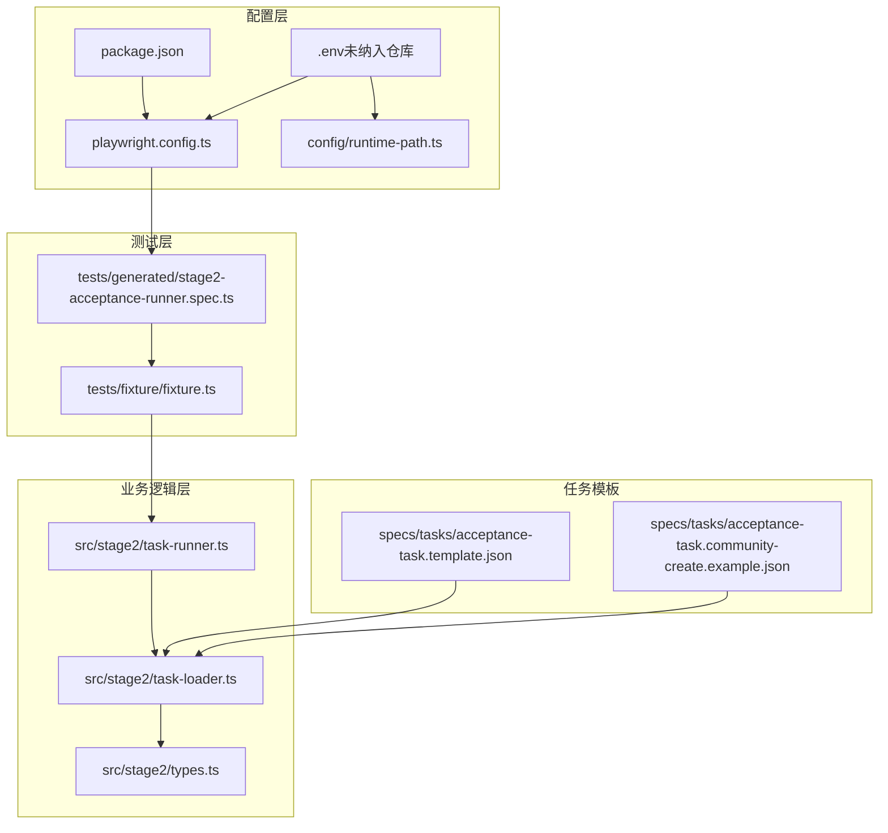
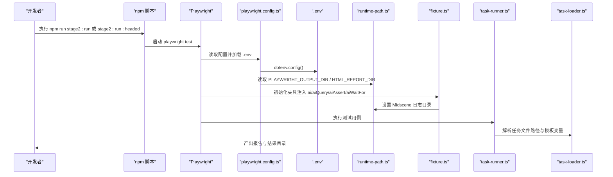
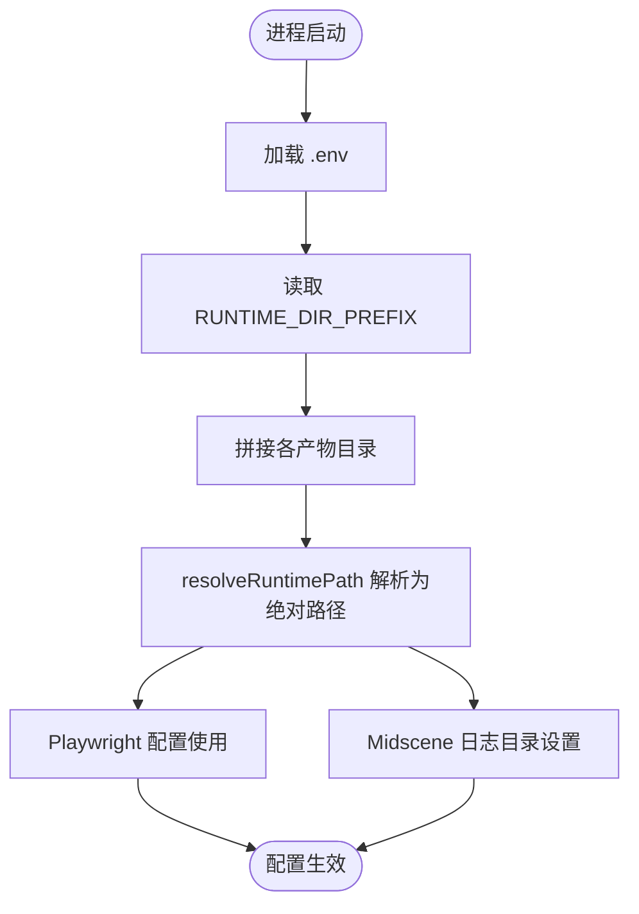
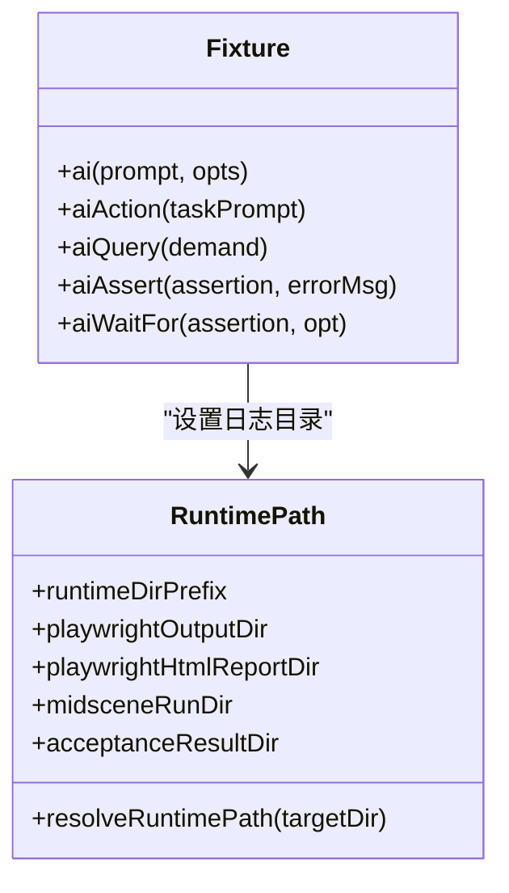
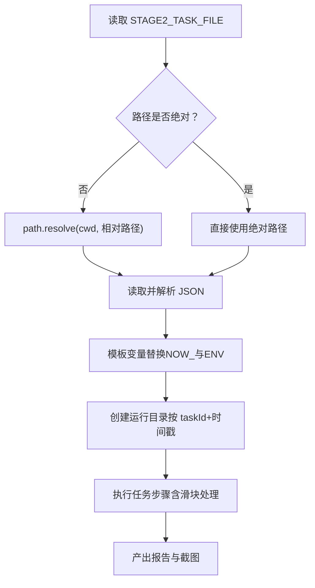
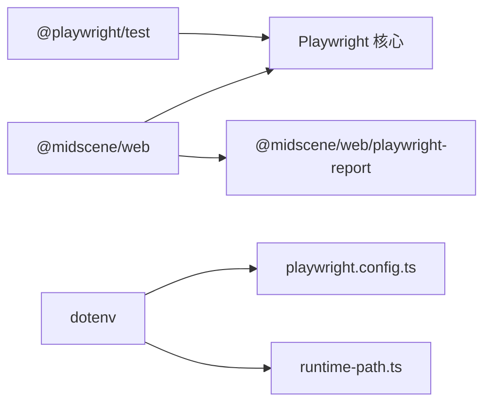

# 环境配置问题

<cite>
**本文引用的文件**
- [package.json](file://package.json)
- [playwright.config.ts](file://playwright.config.ts)
- [config/runtime-path.ts](file://config/runtime-path.ts)
- [README.md](file://README.md)
- [.gitignore](file://.gitignore)
- [tests/generated/stage2-acceptance-runner.spec.ts](file://tests/generated/stage2-acceptance-runner.spec.ts)
- [tests/fixture/fixture.ts](file://tests/fixture/fixture.ts)
- [src/stage2/task-runner.ts](file://src/stage2/task-runner.ts)
- [src/stage2/task-loader.ts](file://src/stage2/task-loader.ts)
- [src/stage2/types.ts](file://src/stage2/types.ts)
- [specs/tasks/acceptance-task.template.json](file://specs/tasks/acceptance-task.template.json)
- [specs/tasks/acceptance-task.community-create.example.json](file://specs/tasks/acceptance-task.community-create.example.json)
</cite>

## 目录
1. [简介](#简介)
2. [项目结构](#项目结构)
3. [核心组件](#核心组件)
4. [架构总览](#架构总览)
5. [详细组件分析](#详细组件分析)
6. [依赖关系分析](#依赖关系分析)
7. [性能考量](#性能考量)
8. [故障排除指南](#故障排除指南)
9. [结论](#结论)
10. [附录](#附录)

## 简介
本指南聚焦于本项目的环境配置问题，覆盖以下方面：
- Node.js 版本兼容性与 npm 依赖安装失败的排查
- Playwright 浏览器安装异常的处理
- .env 环境变量配置错误的诊断与修复（含 API 密钥、模型名称、运行目录等）
- 依赖版本冲突（尤其是 @playwright/test 与 @midscene/web 的兼容性）
- 运行时权限与网络问题（代理与防火墙）
- 环境变量验证工具与配置检查清单

## 项目结构
该项目围绕 Playwright + Midscene 的端到端自动化测试体系构建，包含测试入口、夹具、运行时路径解析、任务加载与执行、以及示例任务模板。

图表来源
- [package.json](file://package.json#L1-L24)
- [playwright.config.ts](file://playwright.config.ts#L1-L95)
- [config/runtime-path.ts](file://config/runtime-path.ts#L1-L41)
- [tests/generated/stage2-acceptance-runner.spec.ts](file://tests/generated/stage2-acceptance-runner.spec.ts#L1-L39)
- [tests/fixture/fixture.ts](file://tests/fixture/fixture.ts#L1-L100)
- [src/stage2/task-runner.ts](file://src/stage2/task-runner.ts#L1-L800)
- [src/stage2/task-loader.ts](file://src/stage2/task-loader.ts#L1-L89)
- [src/stage2/types.ts](file://src/stage2/types.ts#L1-L125)
- [specs/tasks/acceptance-task.template.json](file://specs/tasks/acceptance-task.template.json#L1-L85)
- [specs/tasks/acceptance-task.community-create.example.json](file://specs/tasks/acceptance-task.community-create.example.json#L1-L184)

章节来源
- [package.json](file://package.json#L1-L24)
- [README.md](file://README.md#L1-L144)

## 核心组件
- 依赖与脚本：通过 package.json 管理 Playwright、Midscene、Node 类型与 dotenv 等依赖，并提供 stage2 测试脚本。
- Playwright 配置：playwright.config.ts 加载 .env 并配置输出目录、报告器、并行度、超时等。
- 运行时路径：config/runtime-path.ts 从 .env 读取运行目录前缀与各产物目录，统一收敛到 t_runtime。
- 测试夹具：tests/fixture/fixture.ts 注入 AI 能力（ai、aiQuery、aiAssert、aiWaitFor），并设置 Midscene 日志目录。
- 任务加载与执行：src/stage2/task-loader.ts 解析任务文件路径与模板变量；task-runner.ts 实现滑块验证码处理、表单填写、断言等。
- 示例任务：template 与 community-create 示例展示如何配置任务、字段、断言与运行参数。

章节来源
- [package.json](file://package.json#L6-L22)
- [playwright.config.ts](file://playwright.config.ts#L8-L40)
- [config/runtime-path.ts](file://config/runtime-path.ts#L8-L40)
- [tests/fixture/fixture.ts](file://tests/fixture/fixture.ts#L10-L100)
- [src/stage2/task-loader.ts](file://src/stage2/task-loader.ts#L71-L89)
- [src/stage2/task-runner.ts](file://src/stage2/task-runner.ts#L58-L84)

## 架构总览
下面的序列图展示了从命令行到浏览器执行的关键流程，以及环境变量与运行目录如何贯穿其中。

图表来源
- [playwright.config.ts](file://playwright.config.ts#L8-L40)
- [config/runtime-path.ts](file://config/runtime-path.ts#L8-L40)
- [tests/fixture/fixture.ts](file://tests/fixture/fixture.ts#L10-L100)
- [src/stage2/task-runner.ts](file://src/stage2/task-runner.ts#L1-L120)
- [src/stage2/task-loader.ts](file://src/stage2/task-loader.ts#L71-L89)

## 详细组件分析

### 组件一：环境变量与运行目录
- .env 加载：Playwright 配置与运行时路径均通过 dotenv 加载，确保变量在进程启动时可用。
- 运行目录前缀：默认收敛到 t_runtime/，可通过 RUNTIME_DIR_PREFIX 覆盖。
- 产物目录：PLAYWRIGHT_OUTPUT_DIR、PLAYWRIGHT_HTML_REPORT_DIR、MIDSCENE_RUN_DIR、ACCEPTANCE_RESULT_DIR 均受 .env 控制。
- 路径解析：resolveRuntimePath 将相对路径解析为绝对路径，避免跨平台差异。

图表来源
- [playwright.config.ts](file://playwright.config.ts#L8-L40)
- [config/runtime-path.ts](file://config/runtime-path.ts#L8-L40)

章节来源
- [playwright.config.ts](file://playwright.config.ts#L8-L40)
- [config/runtime-path.ts](file://config/runtime-path.ts#L8-L40)
- [.gitignore](file://.gitignore#L3)

### 组件二：测试夹具与 Midscene 集成
- 夹具扩展：基于 @midscene/web 的 Playwright 夹具，注入 ai、aiQuery、aiAssert、aiWaitFor 等 AI 能力。
- 日志目录：setLogDir 依据运行时路径设置 Midscene 报告与缓存目录。
- 测试用例：stage2 接口通过夹具执行任务场景，失败时抛出明确错误并附带截图路径与结果文件定位。

图表来源
- [tests/fixture/fixture.ts](file://tests/fixture/fixture.ts#L23-L99)
- [config/runtime-path.ts](file://config/runtime-path.ts#L13-L40)

章节来源
- [tests/fixture/fixture.ts](file://tests/fixture/fixture.ts#L10-L100)
- [config/runtime-path.ts](file://config/runtime-path.ts#L13-L40)

### 组件三：任务加载与执行（含滑块验证码处理）
- 任务文件解析：支持绝对/相对路径，相对路径以 cwd 为基础解析；模板变量支持 NOW_YYYYMMDDHHMMSS 与任意环境变量。
- 滑块验证码处理：根据 STAGE2_CAPTCHA_MODE 与 STAGE2_CAPTCHA_WAIT_TIMEOUT_MS 决策，支持自动识别与拖动、人工等待、失败或忽略。
- 结果目录：按 taskId 与时间戳生成唯一运行目录，保存截图、报告与中间结果。

图表来源
- [src/stage2/task-loader.ts](file://src/stage2/task-loader.ts#L71-L89)
- [src/stage2/task-runner.ts](file://src/stage2/task-runner.ts#L108-L126)

章节来源
- [src/stage2/task-loader.ts](file://src/stage2/task-loader.ts#L71-L89)
- [src/stage2/task-runner.ts](file://src/stage2/task-runner.ts#L108-L126)

## 依赖关系分析
- 关键依赖
  - @playwright/test：测试框架与浏览器驱动
  - @midscene/web：AI 能力与报告器集成
  - dotenv：.env 加载
  - @types/node：Node 类型声明
- 版本兼容性要点
  - @playwright/test 与 @midscene/web 的兼容性取决于其内部对 Playwright 版本的要求。建议优先核对两者官方文档的版本矩阵，必要时锁定版本以避免破坏性变更。
  - Node.js 版本：dotenv 的引擎要求为 >=12；建议使用 LTS 版本以获得最佳稳定性。

图表来源
- [package.json](file://package.json#L13-L22)
- [playwright.config.ts](file://playwright.config.ts#L2-L9)
- [config/runtime-path.ts](file://config/runtime-path.ts#L2-L4)

章节来源
- [package.json](file://package.json#L13-L22)

## 性能考量
- 并行与工作线程：CI 环境下禁用并行，减少资源竞争；本地开发启用并行提升效率。
- 超时与重试：合理设置测试超时与重试次数，平衡稳定性与速度。
- 产物目录：集中到 t_runtime，便于清理与归档，避免磁盘碎片化。

章节来源
- [playwright.config.ts](file://playwright.config.ts#L26-L34)

## 故障排除指南

### 一、Node.js 版本兼容性问题
- 症状
  - 安装阶段报错，提示 Node 版本过低
  - 运行时报错找不到模块或语法不支持
- 排查步骤
  - 确认 Node.js 版本满足 dotenv 的最低要求（>=12），建议使用 LTS 版本
  - 清理缓存后重装依赖：删除 node_modules 与 package-lock.json，重新执行安装
  - 若使用 nvm/pnpm/yarn，请确保当前 shell 的 Node 版本与期望一致
- 修复建议
  - 升级到推荐的 LTS 版本
  - 在 CI 中固定 Node 版本，避免环境漂移

章节来源
- [package.json](file://package.json#L20-L22)
- [README.md](file://README.md#L18-L30)

### 二、npm 依赖安装失败
- 症状
  - 安装过程中出现网络超时、包下载失败、权限不足
- 排查步骤
  - 检查网络与代理：若使用公司代理，配置 npm registry 与代理
  - 清理缓存：npm cache clean --force
  - 删除 node_modules 与 package-lock.json 后重试
  - 使用镜像源（如 cnpm、npmmirror）加速下载
- 修复建议
  - 配置 .npmrc 或使用 nrm 切换镜像源
  - 在 CI 中预热缓存，减少重复下载

章节来源
- [README.md](file://README.md#L18-L30)

### 三、Playwright 浏览器安装异常
- 症状
  - npx playwright install 失败，提示无法下载或解压浏览器
- 排查步骤
  - 确认网络连通性与代理设置
  - 清理 Playwright 缓存目录（默认在用户目录下的缓存区）
  - 检查磁盘空间与权限
  - 尝试指定浏览器安装：npx playwright install chromium
- 修复建议
  - 在 CI 中提前安装浏览器，或使用带缓存的镜像
  - 如需离线环境，准备离线安装包并配置自定义下载源

章节来源
- [README.md](file://README.md#L25-L30)

### 四、.env 环境变量配置错误
- 常见问题
  - OPENAI_API_KEY 未设置或为空
  - OPENAI_BASE_URL 与模型提供商不匹配
  - RUNTIME_DIR_PREFIX、PLAYWRIGHT_OUTPUT_DIR、PLAYWRIGHT_HTML_REPORT_DIR、MIDSCENE_RUN_DIR、ACCEPTANCE_RESULT_DIR 路径不正确或无写权限
  - STAGE2_TASK_FILE 路径不存在或不可读
  - STAGE2_CAPTCHA_MODE 值非法
- 诊断方法
  - 在启动前打印 process.env 关键变量，确认已加载
  - 使用相对路径时，确认是相对于项目根目录
  - 检查路径是否存在且具备写权限
- 修复建议
  - 补充 .env 文件并确保未被 .gitignore 忽略
  - 使用绝对路径或确保相对路径解析正确
  - 为敏感信息使用受控的密钥管理工具

章节来源
- [playwright.config.ts](file://playwright.config.ts#L8-L40)
- [config/runtime-path.ts](file://config/runtime-path.ts#L8-L40)
- [README.md](file://README.md#L39-L52)

### 五、依赖版本冲突（@playwright/test 与 @midscene/web）
- 症状
  - 运行时报错：Playwright 版本不兼容、夹具缺失、报告器不可用
- 排查步骤
  - 查看两者的官方文档，确认兼容的 Playwright 版本范围
  - 锁定版本：在 package.json 中固定 @playwright/test 与 @midscene/web 的版本
  - 清理 node_modules 后重新安装
- 修复建议
  - 优先采用官方推荐的组合版本
  - 在 CI 中使用固定版本，避免上游更新导致的破坏性变更

章节来源
- [package.json](file://package.json#L13-L22)

### 六、运行时权限与网络问题
- 权限问题
  - t_runtime 目录无写权限，导致报告与截图无法生成
  - 任务文件路径无读权限
- 网络问题
  - API 密钥访问受限，或模型提供商接口不可达
  - 代理/防火墙阻断请求
- 排查与修复
  - 为 t_runtime 及其子目录授予写权限
  - 在 .env 中配置正确的 API 密钥与基础 URL
  - 配置系统代理或企业防火墙白名单
  - 在 CI 中预置代理与证书

章节来源
- [config/runtime-path.ts](file://config/runtime-path.ts#L38-L40)
- [README.md](file://README.md#L39-L52)

### 七、环境变量验证工具与配置检查清单
- 验证工具建议
  - 启动前打印关键环境变量（如 OPENAI_*、RUNTIME_*、STAGE2_*）
  - 使用脚本检查目录可写性与任务文件可读性
- 检查清单
  - Node.js 版本满足要求
  - .env 已加载且变量完整
  - 运行目录存在且可写
  - 任务文件路径正确且可读
  - Playwright 浏览器已安装
  - API 密钥与模型名称配置正确
  - 代理/防火墙允许访问模型提供商接口

章节来源
- [playwright.config.ts](file://playwright.config.ts#L8-L40)
- [config/runtime-path.ts](file://config/runtime-path.ts#L38-L40)
- [README.md](file://README.md#L39-L52)

## 结论
本项目的环境配置关键在于：
- 正确加载 .env 并将其映射到 Playwright 与 Midscene 的运行目录
- 确保 Node.js 与 npm 的版本与网络环境稳定
- 明确依赖版本兼容性，避免运行期破坏性变更
- 对权限与网络进行前置检查，保障可重复性与可维护性

遵循本指南的排障流程与检查清单，可显著降低环境配置问题的发生率与定位成本。

## 附录
- 常用命令
  - 安装依赖：npm install
  - 安装浏览器：npx playwright install
  - 运行测试（无头）：npm run stage2:run
  - 运行测试（有头）：npm run stage2:run:headed
- 目录约定
  - t_runtime：统一运行产物目录（测试结果、报告、Midscene 日志、验收结果）

章节来源
- [README.md](file://README.md#L106-L132)