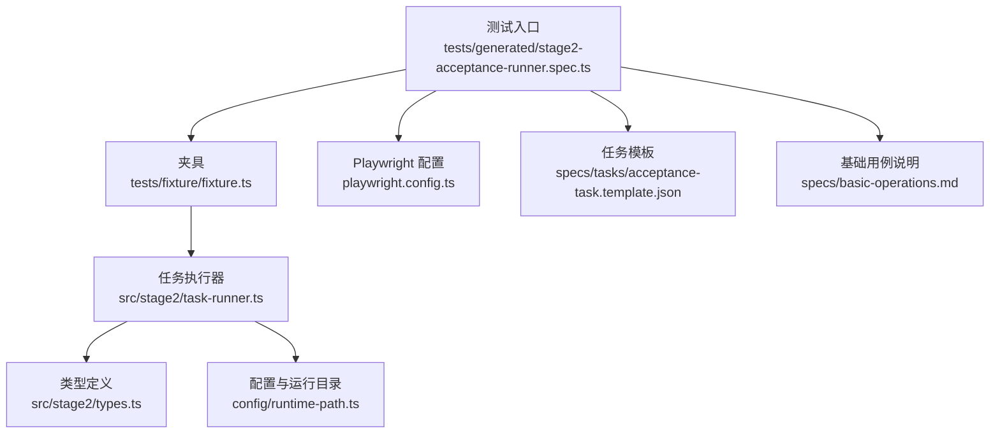
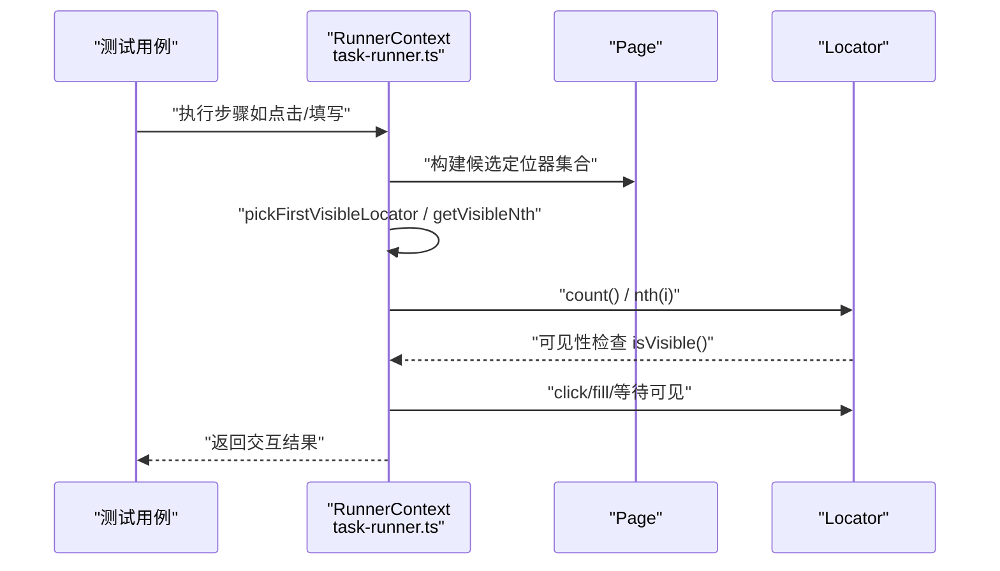
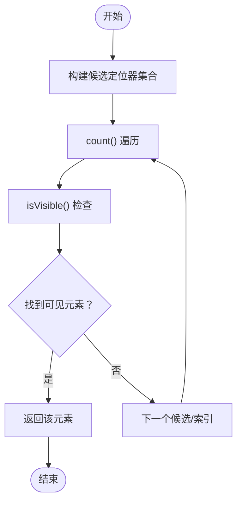
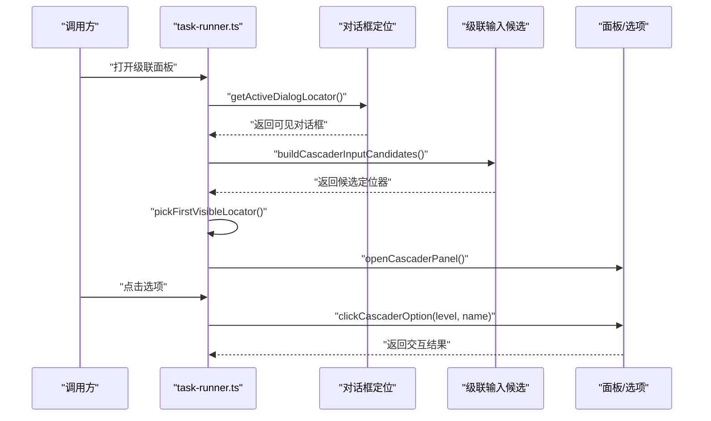
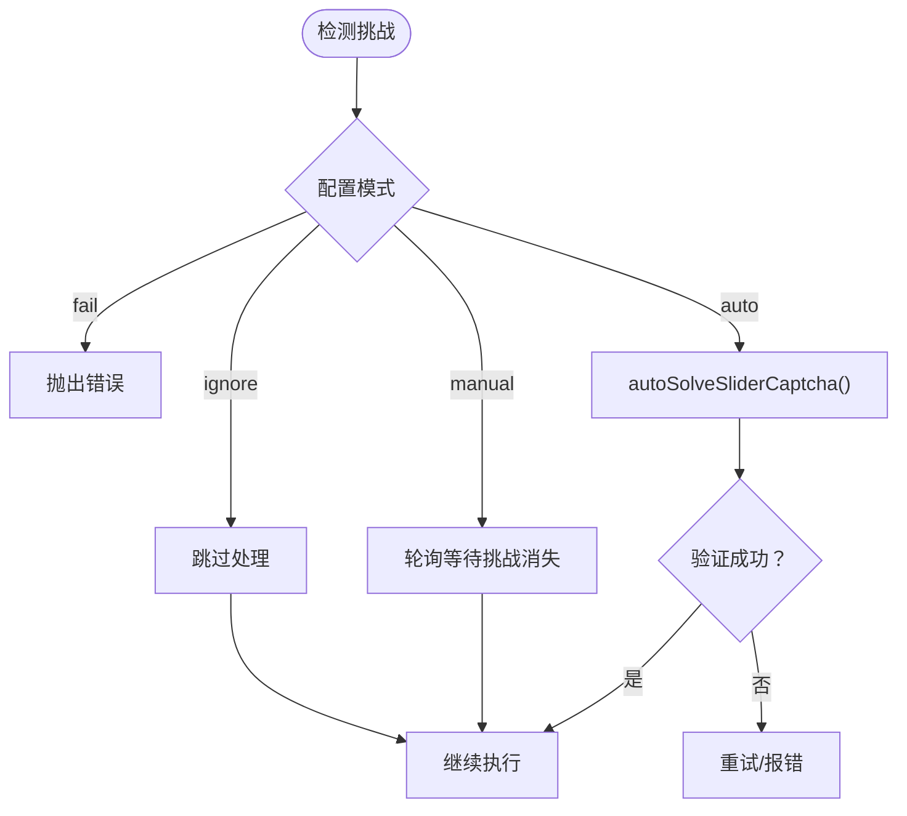
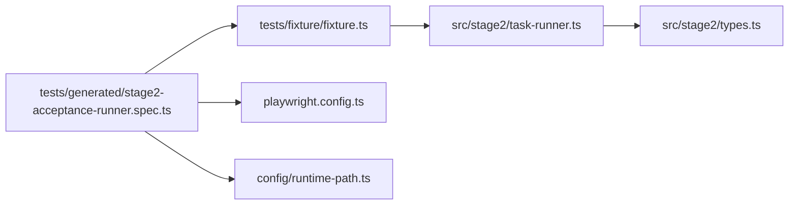

# 元素定位失败

<cite>
**本文引用的文件**
- [README.md](file://README.md)
- [package.json](file://package.json)
- [playwright.config.ts](file://playwright.config.ts)
- [config/runtime-path.ts](file://config/runtime-path.ts)
- [src/stage2/types.ts](file://src/stage2/types.ts)
- [src/stage2/task-runner.ts](file://src/stage2/task-runner.ts)
- [tests/generated/stage2-acceptance-runner.spec.ts](file://tests/generated/stage2-acceptance-runner.spec.ts)
- [tests/fixture/fixture.ts](file://tests/fixture/fixture.ts)
- [specs/basic-operations.md](file://specs/basic-operations.md)
- [specs/tasks/acceptance-task.template.json](file://specs/tasks/acceptance-task.template.json)
</cite>

## 目录
1. [简介](#简介)
2. [项目结构](#项目结构)
3. [核心组件](#核心组件)
4. [架构总览](#架构总览)
5. [详细组件分析](#详细组件分析)
6. [依赖关系分析](#依赖关系分析)
7. [性能考量](#性能考量)
8. [故障排除指南](#故障排除指南)
9. [结论](#结论)
10. [附录](#附录)

## 简介
本指南聚焦“元素定位失败”的常见问题与系统化排查方法，结合仓库中的可见性辅助函数与AI驱动的交互能力，提供针对以下场景的诊断与修复路径：
- 选择器失效：CSS选择器过时、动态ID变化、类名冲突
- 动态元素加载：异步渲染、AJAX延迟、动画过渡期间不可见
- iframe内容访问：跨域限制、frame切换策略、iframe内元素定位技巧
- 可见性检查：使用 pickFirstVisibleLocator、getVisibleNth 等辅助函数
- 调试与日志：利用报告、截图、跟踪与AI查询能力快速定位根因

## 项目结构
该仓库围绕“第二阶段任务执行器”组织，核心测试入口通过 JSON 任务驱动 Midscene + Playwright 执行，定位与可见性逻辑集中在任务执行器模块中。

图表来源
- [tests/generated/stage2-acceptance-runner.spec.ts](file://tests/generated/stage2-acceptance-runner.spec.ts#L1-L39)
- [tests/fixture/fixture.ts](file://tests/fixture/fixture.ts#L1-L100)
- [src/stage2/task-runner.ts](file://src/stage2/task-runner.ts#L1-L120)
- [src/stage2/types.ts](file://src/stage2/types.ts#L1-L125)
- [config/runtime-path.ts](file://config/runtime-path.ts#L1-L41)
- [playwright.config.ts](file://playwright.config.ts#L1-L95)
- [specs/tasks/acceptance-task.template.json](file://specs/tasks/acceptance-task.template.json#L1-L85)
- [specs/basic-operations.md](file://specs/basic-operations.md#L1-L34)

章节来源
- [README.md](file://README.md#L1-L144)
- [package.json](file://package.json#L1-L24)
- [playwright.config.ts](file://playwright.config.ts#L1-L95)
- [config/runtime-path.ts](file://config/runtime-path.ts#L1-L41)
- [src/stage2/types.ts](file://src/stage2/types.ts#L1-L125)
- [src/stage2/task-runner.ts](file://src/stage2/task-runner.ts#L1-L120)
- [tests/generated/stage2-acceptance-runner.spec.ts](file://tests/generated/stage2-acceptance-runner.spec.ts#L1-L39)
- [tests/fixture/fixture.ts](file://tests/fixture/fixture.ts#L1-L100)
- [specs/basic-operations.md](file://specs/basic-operations.md#L1-L34)
- [specs/tasks/acceptance-task.template.json](file://specs/tasks/acceptance-task.template.json#L1-L85)

## 核心组件
- 可见性辅助函数
  - pickFirstVisibleLocator：在候选定位器集合中寻找第一个可见元素
  - getVisibleNth：按可见序号获取第 N 个可见元素
  - tryClickLocator / tryFillLocator：对可见元素进行点击/填充
  - isLocatorVisible / waitVisibleByText：判断可见与等待可见
- 对话框与级联选择
  - getActiveDialogLocator：定位当前可见对话框
  - buildCascaderInputCandidates / openCascaderPanel / clickCascaderOption：级联面板交互
- 安全验证（滑块验证码）
  - detectCaptchaChallenge / autoSolveSliderCaptcha / handleCaptchaChallengeIfNeeded：挑战检测与处理
- 夹具与AI能力
  - tests/fixture/fixture.ts：封装 ai、aiQuery、aiAssert、aiWaitFor，并注入到测试用例

章节来源
- [src/stage2/task-runner.ts](file://src/stage2/task-runner.ts#L162-L202)
- [src/stage2/task-runner.ts](file://src/stage2/task-runner.ts#L411-L448)
- [src/stage2/task-runner.ts](file://src/stage2/task-runner.ts#L466-L464)
- [src/stage2/task-runner.ts](file://src/stage2/task-runner.ts#L227-L254)
- [src/stage2/task-runner.ts](file://src/stage2/task-runner.ts#L204-L225)
- [src/stage2/task-runner.ts](file://src/stage2/task-runner.ts#L705-L785)
- [src/stage2/task-runner.ts](file://src/stage2/task-runner.ts#L480-L703)
- [tests/fixture/fixture.ts](file://tests/fixture/fixture.ts#L23-L99)

## 架构总览
下面的序列图展示了“可见性优先”的元素交互流程，体现 pickFirstVisibleLocator、getVisibleNth 等函数在定位与交互中的作用。

图表来源
- [src/stage2/task-runner.ts](file://src/stage2/task-runner.ts#L162-L202)
- [src/stage2/task-runner.ts](file://src/stage2/task-runner.ts#L411-L448)
- [src/stage2/task-runner.ts](file://src/stage2/task-runner.ts#L450-L464)

## 详细组件分析

### 组件A：可见性辅助函数与定位策略
- pickFirstVisibleLocator
  - 输入：多个候选定位器数组
  - 行为：遍历每个定位器，逐项检查可见性，返回首个可见元素
  - 适用：当同一语义存在多套选择器（如不同UI框架的级联输入）时，优先命中可见项
- getVisibleNth
  - 输入：单一定位器与可见序号
  - 行为：统计可见元素数量，按可见序号返回对应元素
  - 适用：列表/面板中存在隐藏项时，按“可见顺序”索引
- tryClickLocator / tryFillLocator
  - 输入：定位器
  - 行为：对可见元素执行点击/填充，失败时返回 false
  - 适用：避免直接对不可见元素操作引发异常
- isLocatorVisible / waitVisibleByText
  - 输入：定位器或文本
  - 行为：判断可见或等待可见
  - 适用：异步渲染/动画过渡期间的显式等待

图表来源
- [src/stage2/task-runner.ts](file://src/stage2/task-runner.ts#L162-L202)
- [src/stage2/task-runner.ts](file://src/stage2/task-runner.ts#L411-L448)
- [src/stage2/task-runner.ts](file://src/stage2/task-runner.ts#L466-L464)

章节来源
- [src/stage2/task-runner.ts](file://src/stage2/task-runner.ts#L162-L202)
- [src/stage2/task-runner.ts](file://src/stage2/task-runner.ts#L411-L448)
- [src/stage2/task-runner.ts](file://src/stage2/task-runner.ts#L450-L464)

### 组件B：对话框与级联面板交互
- getActiveDialogLocator：定位当前可见对话框容器
- buildCascaderInputCandidates：基于字段标签与对话框标题构建级联输入候选
- openCascaderPanel / clickCascaderOption：打开面板并按层级与选项名点击
- fillByCandidates：按占位文案候选进行填充

图表来源
- [src/stage2/task-runner.ts](file://src/stage2/task-runner.ts#L227-L254)
- [src/stage2/task-runner.ts](file://src/stage2/task-runner.ts#L204-L225)
- [src/stage2/task-runner.ts](file://src/stage2/task-runner.ts#L705-L785)

章节来源
- [src/stage2/task-runner.ts](file://src/stage2/task-runner.ts#L227-L254)
- [src/stage2/task-runner.ts](file://src/stage2/task-runner.ts#L204-L225)
- [src/stage2/task-runner.ts](file://src/stage2/task-runner.ts#L705-L785)

### 组件C：滑块验证码挑战处理
- detectCaptchaChallenge：检测文本/选择器模式匹配的验证码挑战
- autoSolveSliderCaptcha：AI查询位置与轨道宽度，模拟拖动轨迹
- handleCaptchaChallengeIfNeeded：根据配置（auto/manual/fail/ignore）处理挑战

图表来源
- [src/stage2/task-runner.ts](file://src/stage2/task-runner.ts#L480-L703)
- [src/stage2/task-runner.ts](file://src/stage2/task-runner.ts#L558-L645)

章节来源
- [src/stage2/task-runner.ts](file://src/stage2/task-runner.ts#L480-L703)
- [src/stage2/task-runner.ts](file://src/stage2/task-runner.ts#L558-L645)

## 依赖关系分析
- 测试入口依赖夹具提供的 AI 能力与页面对象
- 任务执行器依赖 Playwright 的 Locator API 与可见性判断
- 配置层统一管理运行产物目录，便于定位失败后的截图与报告

图表来源
- [tests/generated/stage2-acceptance-runner.spec.ts](file://tests/generated/stage2-acceptance-runner.spec.ts#L1-L39)
- [tests/fixture/fixture.ts](file://tests/fixture/fixture.ts#L1-L100)
- [src/stage2/task-runner.ts](file://src/stage2/task-runner.ts#L1-L120)
- [src/stage2/types.ts](file://src/stage2/types.ts#L1-L125)
- [playwright.config.ts](file://playwright.config.ts#L1-L95)
- [config/runtime-path.ts](file://config/runtime-path.ts#L1-L41)

章节来源
- [tests/generated/stage2-acceptance-runner.spec.ts](file://tests/generated/stage2-acceptance-runner.spec.ts#L1-L39)
- [tests/fixture/fixture.ts](file://tests/fixture/fixture.ts#L1-L100)
- [src/stage2/task-runner.ts](file://src/stage2/task-runner.ts#L1-L120)
- [src/stage2/types.ts](file://src/stage2/types.ts#L1-L125)
- [playwright.config.ts](file://playwright.config.ts#L1-L95)
- [config/runtime-path.ts](file://config/runtime-path.ts#L1-L41)

## 性能考量
- 可见性检查的复杂度
  - pickFirstVisibleLocator：对每个候选定位器执行 count() 与 isVisible() 循环，时间复杂度 O(K×M)，K 为候选数，M 为每组元素可见项
  - getVisibleNth：线性扫描可见元素并计数，时间复杂度 O(N)，N 为元素总数
- 建议
  - 尽量缩小候选范围（如限定对话框上下文）
  - 合理设置超时与重试次数，避免无谓等待
  - 在异步场景中优先使用 waitVisibleByText 或显式等待，减少轮询

[本节为通用指导，无需列出具体文件来源]

## 故障排除指南

### 一、选择器失效的常见原因与修复
- CSS选择器过时
  - 现象：定位器返回空或不稳定
  - 诊断：使用夹具中的 aiQuery 对页面截图进行结构化分析，确认目标元素是否存在
  - 修复：优先使用语义更强的选择器（如 role/name），或在对话框上下文中限定范围
  - 参考实现：[src/stage2/task-runner.ts](file://src/stage2/task-runner.ts#L204-L225)
- 动态ID变化
  - 现象：ID随刷新变化导致定位失败
  - 诊断：通过 aiQuery 提取元素属性，观察ID是否变化
  - 修复：改用基于文本、占位符、role/name等稳定属性
  - 参考实现：[src/stage2/task-runner.ts](file://src/stage2/task-runner.ts#L256-L274)
- 类名冲突
  - 现象：同一页面存在多个同名类，定位器误命中
  - 诊断：在 getActiveDialogLocator 中限定对话框容器，缩小匹配范围
  - 修复：组合更精确的选择器（如父容器 + 子元素）
  - 参考实现：[src/stage2/task-runner.ts](file://src/stage2/task-runner.ts#L227-L254)

章节来源
- [src/stage2/task-runner.ts](file://src/stage2/task-runner.ts#L204-L225)
- [src/stage2/task-runner.ts](file://src/stage2/task-runner.ts#L256-L274)
- [src/stage2/task-runner.ts](file://src/stage2/task-runner.ts#L227-L254)

### 二、动态元素加载导致的定位失败
- 异步渲染/AJAX延迟/动画过渡不可见
  - 现象：元素出现前点击/填充报错
  - 诊断：使用 waitVisibleByText 等显式等待；或在交互前调用 isLocatorVisible
  - 修复：在关键步骤前加入等待或可见性检查
  - 参考实现：[src/stage2/task-runner.ts](file://src/stage2/task-runner.ts#L450-L464), [src/stage2/task-runner.ts](file://src/stage2/task-runner.ts#L466-L478)
- 级联面板/下拉菜单的可见性
  - 现象：面板打开后仍无法点击选项
  - 诊断：使用 getVisibleNth 获取可见层级菜单，再按文本过滤点击
  - 修复：分层定位（levelIndex）+ 文本精确匹配
  - 参考实现：[src/stage2/task-runner.ts](file://src/stage2/task-runner.ts#L723-L785)

章节来源
- [src/stage2/task-runner.ts](file://src/stage2/task-runner.ts#L450-L464)
- [src/stage2/task-runner.ts](file://src/stage2/task-runner.ts#L466-L478)
- [src/stage2/task-runner.ts](file://src/stage2/task-runner.ts#L723-L785)

### 三、iframe内容访问异常
- 跨域限制
  - 现象：iframe 内容无法访问或报跨域错误
  - 诊断：确认目标页面与 iframe 源是否同源；若不同源，需在服务端允许嵌入或改用同源方案
  - 修复：在测试中避免跨域 iframe，或通过后端代理解决
  - 参考实现：本仓库未直接涉及 iframe 访问逻辑，但可借鉴可见性检查思路在切换 frame 后进行可见性校验
- frame切换策略
  - 现象：进入 iframe 后无法定位元素
  - 诊断：先切换至目标 frame，再在 frame 上下文执行定位
  - 修复：在定位前切换 frame，再使用 pickFirstVisibleLocator/getVisibleNth
- iframe内元素定位技巧
  - 建议：在 frame 上下文中使用更稳定的 role/name 选择器，避免类名/ID变化

[本节为通用指导，无需列出具体文件来源]

### 四、使用 pickFirstVisibleLocator 与 getVisibleNth 的实践
- pickFirstVisibleLocator
  - 场景：多套候选选择器（如不同UI框架的级联输入）
  - 步骤：构建候选数组 → 遍历 → 可见性检查 → 返回首个可见元素
  - 参考实现：[src/stage2/task-runner.ts](file://src/stage2/task-runner.ts#L162-L180)
- getVisibleNth
  - 场景：列表/面板中存在隐藏项，需按“可见顺序”取第 N 个
  - 步骤：count() → 可见计数 → 按序返回
  - 参考实现：[src/stage2/task-runner.ts](file://src/stage2/task-runner.ts#L182-L202)

章节来源
- [src/stage2/task-runner.ts](file://src/stage2/task-runner.ts#L162-L180)
- [src/stage2/task-runner.ts](file://src/stage2/task-runner.ts#L182-L202)

### 五、调试工具与日志分析
- 运行产物与报告
  - Playwright HTML 报告与截图：位于 t_runtime/playwright-report/ 与 acceptance-results/
  - Midscene 报告：位于 t_runtime/midscene_run/report/
  - 参考配置：[README.md](file://README.md#L74-L116), [config/runtime-path.ts](file://config/runtime-path.ts#L18-L36)
- 截图与跟踪
  - 在失败步骤中可查看截图路径，结合报告定位问题
  - 参考实现：[tests/generated/stage2-acceptance-runner.spec.ts](file://tests/generated/stage2-acceptance-runner.spec.ts#L28-L36)
- AI辅助定位
  - 使用 aiQuery 对页面截图进行结构化分析，确认元素是否存在与可见性
  - 参考实现：[tests/fixture/fixture.ts](file://tests/fixture/fixture.ts#L57-L69)
- 关键环境变量
  - STAGE2_CAPTCHA_MODE / STAGE2_CAPTCHA_WAIT_TIMEOUT_MS：影响验证码挑战处理行为
  - 参考实现：[src/stage2/task-runner.ts](file://src/stage2/task-runner.ts#L58-L84)

章节来源
- [README.md](file://README.md#L74-L116)
- [config/runtime-path.ts](file://config/runtime-path.ts#L18-L36)
- [tests/generated/stage2-acceptance-runner.spec.ts](file://tests/generated/stage2-acceptance-runner.spec.ts#L28-L36)
- [tests/fixture/fixture.ts](file://tests/fixture/fixture.ts#L57-L69)
- [src/stage2/task-runner.ts](file://src/stage2/task-runner.ts#L58-L84)

## 结论
- 元素定位失败的核心在于“可见性优先”。优先采用 pickFirstVisibleLocator、getVisibleNth 等策略，结合显式等待与AI查询，可显著提升稳定性
- 对于动态/异步场景，应避免直接依赖静态选择器，转而使用语义化属性与上下文限定
- 验证码挑战与iframe跨域等边界情况需通过配置与策略化处理，配合截图与报告进行根因定位

[本节为总结，无需列出具体文件来源]

## 附录
- 任务模板字段说明（用于定位与断言）
  - 参考：[specs/tasks/acceptance-task.template.json](file://specs/tasks/acceptance-task.template.json#L1-L85)
- 基础操作用例（用于理解交互流程）
  - 参考：[specs/basic-operations.md](file://specs/basic-operations.md#L1-L34)

[本节为概览，无需列出具体文件来源]