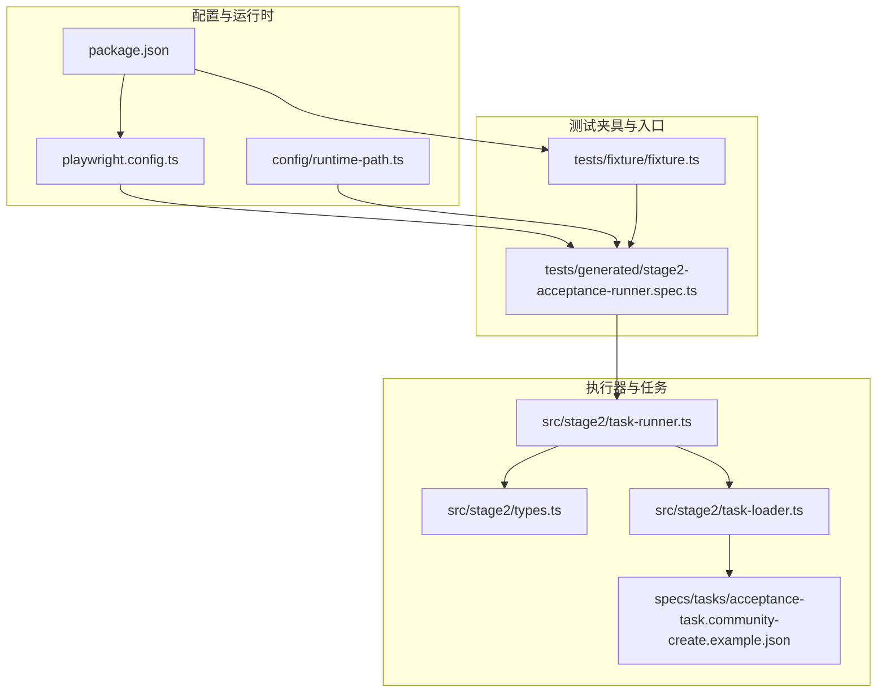
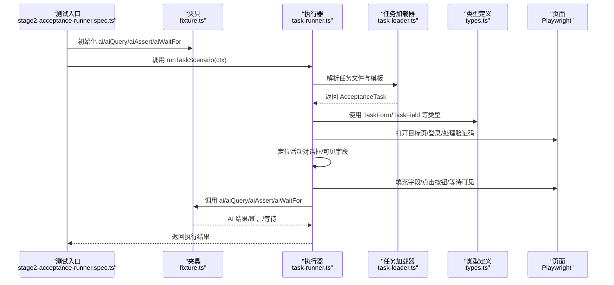
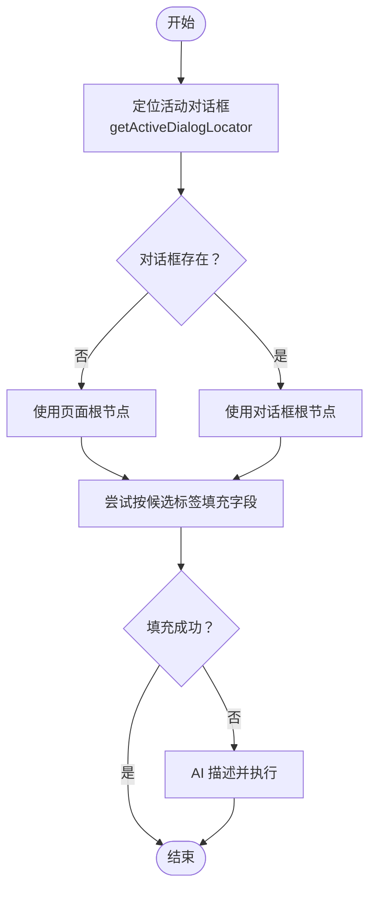
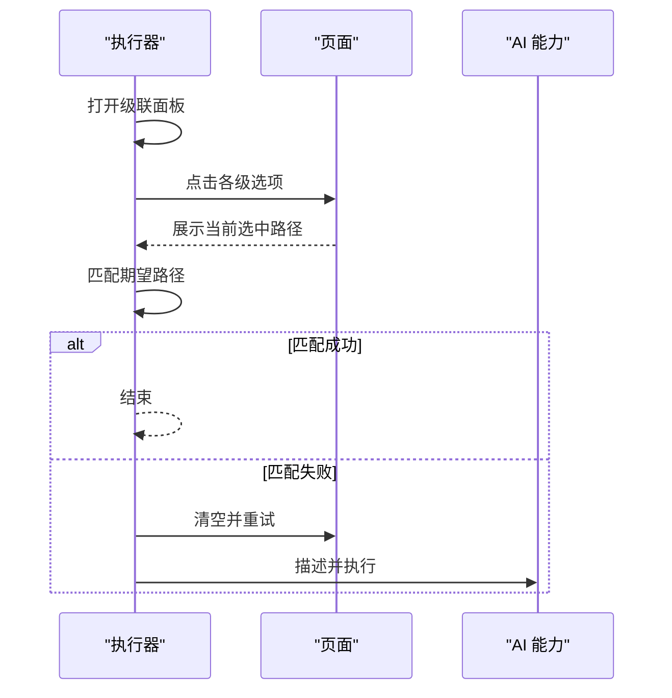
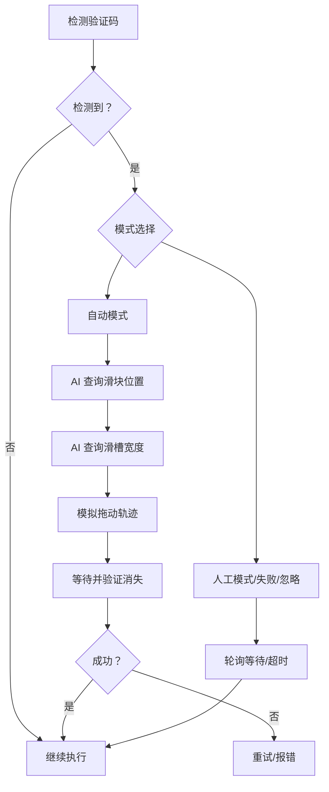
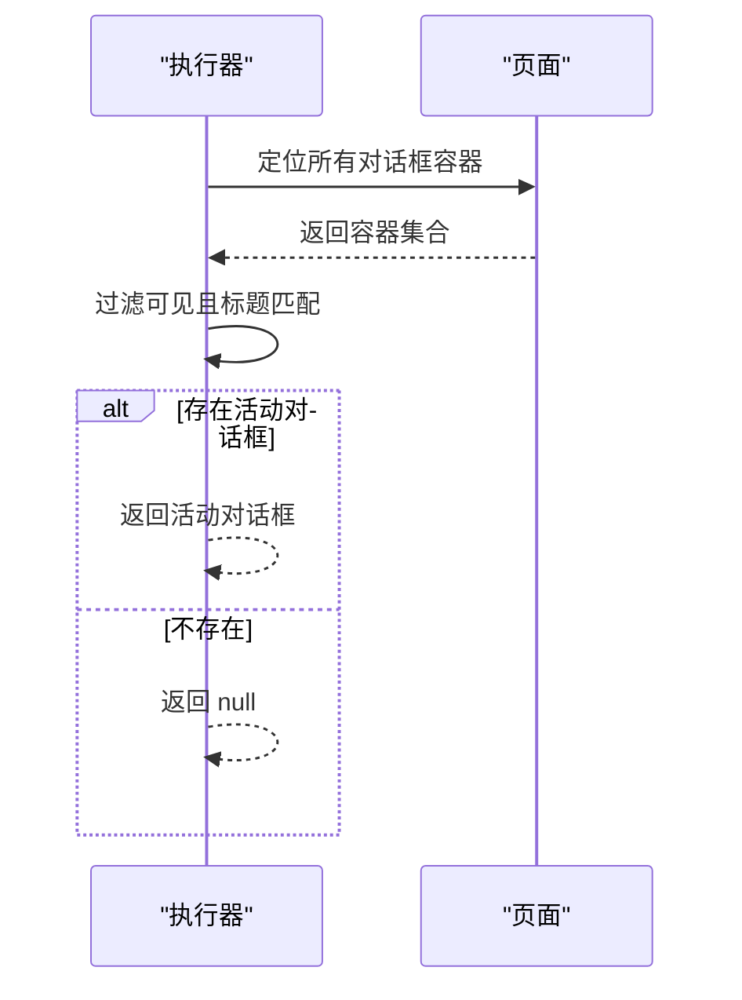
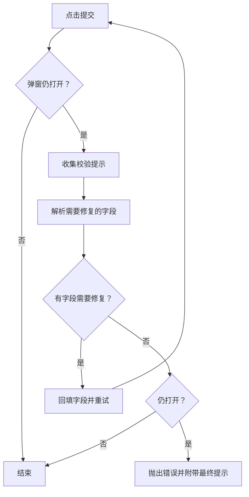
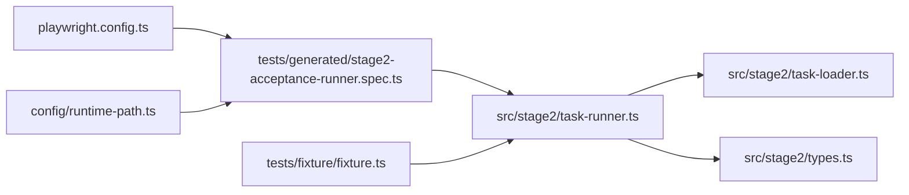

# 动态表单适配

<cite>
**本文引用的文件**
- [README.md](file://README.md)
- [package.json](file://package.json)
- [playwright.config.ts](file://playwright.config.ts)
- [config/runtime-path.ts](file://config/runtime-path.ts)
- [tests/fixture/fixture.ts](file://tests/fixture/fixture.ts)
- [tests/generated/stage2-acceptance-runner.spec.ts](file://tests/generated/stage2-acceptance-runner.spec.ts)
- [src/stage2/types.ts](file://src/stage2/types.ts)
- [src/stage2/task-loader.ts](file://src/stage2/task-loader.ts)
- [src/stage2/task-runner.ts](file://src/stage2/task-runner.ts)
- [specs/tasks/acceptance-task.community-create.example.json](file://specs/tasks/acceptance-task.community-create.example.json)
- [specs/basic-operations.md](file://specs/basic-operations.md)
- [specs/login-e2e.md](file://specs/login-e2e.md)
</cite>

## 目录
1. [简介](#简介)
2. [项目结构](#项目结构)
3. [核心组件](#核心组件)
4. [架构总览](#架构总览)
5. [组件详解](#组件详解)
6. [依赖关系分析](#依赖关系分析)
7. [性能考量](#性能考量)
8. [故障排除指南](#故障排除指南)
9. [结论](#结论)
10. [附录](#附录)

## 简介
本指南聚焦于“动态表单适配”的综合故障排除，围绕以下主题展开：
- 表单字段变化检测：条件显示逻辑、字段可见性控制、动态增删字段
- 条件显示逻辑调试：if-else 条件判断、业务规则触发、用户权限影响
- 异步数据绑定问题：远程数据加载、计算属性更新、事件响应处理
- 关键函数在动态表单中的应用：getActiveDialogLocator、isDialogVisible
- 表单状态检测、字段等待策略、动态内容处理的最佳实践与示例路径

本项目基于 Playwright 与 Midscene.js，采用 JSON 任务驱动的第二段执行器，覆盖登录页滑块验证码处理、动态表单填写、提交与断言等全流程。

## 项目结构
项目采用分层组织，核心集中在 stage2 执行器与测试夹具，配合运行时路径与配置文件，形成可扩展的自动化执行框架。

图表来源
- [playwright.config.ts](file://playwright.config.ts#L1-L95)
- [config/runtime-path.ts](file://config/runtime-path.ts#L1-L41)
- [tests/fixture/fixture.ts](file://tests/fixture/fixture.ts#L1-L100)
- [tests/generated/stage2-acceptance-runner.spec.ts](file://tests/generated/stage2-acceptance-runner.spec.ts#L1-L39)
- [src/stage2/types.ts](file://src/stage2/types.ts#L1-L125)
- [src/stage2/task-loader.ts](file://src/stage2/task-loader.ts#L1-L91)
- [src/stage2/task-runner.ts](file://src/stage2/task-runner.ts#L1-L1344)
- [specs/tasks/acceptance-task.community-create.example.json](file://specs/tasks/acceptance-task.community-create.example.json#L1-L184)

章节来源
- [README.md](file://README.md#L1-L144)
- [playwright.config.ts](file://playwright.config.ts#L1-L95)
- [config/runtime-path.ts](file://config/runtime-path.ts#L1-L41)
- [tests/fixture/fixture.ts](file://tests/fixture/fixture.ts#L1-L100)
- [tests/generated/stage2-acceptance-runner.spec.ts](file://tests/generated/stage2-acceptance-runner.spec.ts#L1-L39)
- [src/stage2/types.ts](file://src/stage2/types.ts#L1-L125)
- [src/stage2/task-loader.ts](file://src/stage2/task-loader.ts#L1-L91)
- [src/stage2/task-runner.ts](file://src/stage2/task-runner.ts#L1-L1344)
- [specs/tasks/acceptance-task.community-create.example.json](file://specs/tasks/acceptance-task.community-create.example.json#L1-L184)

## 核心组件
- 类型定义：定义任务、表单字段、断言等结构，支撑任务解析与执行
- 任务加载器：解析任务文件、模板变量替换、形状校验
- 执行器：封装页面交互、AI 协作、对话框定位、字段填充、提交与断言
- 夹具与入口：提供 AI 能力与页面上下文，驱动执行器运行

章节来源
- [src/stage2/types.ts](file://src/stage2/types.ts#L1-L125)
- [src/stage2/task-loader.ts](file://src/stage2/task-loader.ts#L1-L91)
- [src/stage2/task-runner.ts](file://src/stage2/task-runner.ts#L1-L1344)
- [tests/fixture/fixture.ts](file://tests/fixture/fixture.ts#L1-L100)
- [tests/generated/stage2-acceptance-runner.spec.ts](file://tests/generated/stage2-acceptance-runner.spec.ts#L1-L39)

## 架构总览
下图展示了从测试入口到执行器、再到页面交互与 AI 协作的整体流程。

图表来源
- [tests/generated/stage2-acceptance-runner.spec.ts](file://tests/generated/stage2-acceptance-runner.spec.ts#L1-L39)
- [tests/fixture/fixture.ts](file://tests/fixture/fixture.ts#L1-L100)
- [src/stage2/task-runner.ts](file://src/stage2/task-runner.ts#L1062-L1344)
- [src/stage2/task-loader.ts](file://src/stage2/task-loader.ts#L79-L91)
- [src/stage2/types.ts](file://src/stage2/types.ts#L86-L98)

## 组件详解

### 动态表单字段变化检测与可见性控制
- 活动对话框定位：getActiveDialogLocator 通过容器集合与标题匹配，返回当前可见的活动对话框
- 对话框可见性：isDialogVisible 基于活动对话框定位结果判断弹窗是否打开
- 字段可见性：pickFirstVisibleLocator/getVisibleNth 通过 count/isVisible 逐项筛选可见元素
- 等待可见：waitVisibleByText 基于文本等待元素可见，支持超时控制

图表来源
- [src/stage2/task-runner.ts](file://src/stage2/task-runner.ts#L227-L254)
- [src/stage2/task-runner.ts](file://src/stage2/task-runner.ts#L406-L409)
- [src/stage2/task-runner.ts](file://src/stage2/task-runner.ts#L162-L180)
- [src/stage2/task-runner.ts](file://src/stage2/task-runner.ts#L450-L464)
- [src/stage2/task-runner.ts](file://src/stage2/task-runner.ts#L943-L971)

章节来源
- [src/stage2/task-runner.ts](file://src/stage2/task-runner.ts#L227-L254)
- [src/stage2/task-runner.ts](file://src/stage2/task-runner.ts#L406-L409)
- [src/stage2/task-runner.ts](file://src/stage2/task-runner.ts#L162-L180)
- [src/stage2/task-runner.ts](file://src/stage2/task-runner.ts#L450-L464)
- [src/stage2/task-runner.ts](file://src/stage2/task-runner.ts#L943-L971)

### 条件显示逻辑与动态增删字段
- 级联选择器：openCascaderPanel/clickCascaderOption 打开面板并逐级点击选项，支持截图记录每一步
- 级联路径匹配：matchCascaderPath 支持包含式匹配与去除分隔符后的近似匹配
- 动态字段回填：submitFormWithAutoFix 在提交后收集校验提示，解析出需要修复的字段并循环回填

图表来源
- [src/stage2/task-runner.ts](file://src/stage2/task-runner.ts#L705-L721)
- [src/stage2/task-runner.ts](file://src/stage2/task-runner.ts#L723-L785)
- [src/stage2/task-runner.ts](file://src/stage2/task-runner.ts#L323-L333)
- [src/stage2/task-runner.ts](file://src/stage2/task-runner.ts#L973-L1018)

章节来源
- [src/stage2/task-runner.ts](file://src/stage2/task-runner.ts#L705-L721)
- [src/stage2/task-runner.ts](file://src/stage2/task-runner.ts#L723-L785)
- [src/stage2/task-runner.ts](file://src/stage2/task-runner.ts#L323-L333)
- [src/stage2/task-runner.ts](file://src/stage2/task-runner.ts#L973-L1018)

### 异步数据绑定与事件响应
- 滑块验证码自动处理：detectCaptchaChallenge/querySliderPosition/querySliderTrackWidth/autoSolveSliderCaptcha
- 页面加载与稳定：waitForLoadState/domcontentloaded 后续延时
- 事件响应：键盘 Escape 清理、按钮点击、输入填充、等待可见

图表来源
- [src/stage2/task-runner.ts](file://src/stage2/task-runner.ts#L480-L498)
- [src/stage2/task-runner.ts](file://src/stage2/task-runner.ts#L507-L556)
- [src/stage2/task-runner.ts](file://src/stage2/task-runner.ts#L558-L645)
- [src/stage2/task-runner.ts](file://src/stage2/task-runner.ts#L647-L703)

章节来源
- [src/stage2/task-runner.ts](file://src/stage2/task-runner.ts#L480-L498)
- [src/stage2/task-runner.ts](file://src/stage2/task-runner.ts#L507-L556)
- [src/stage2/task-runner.ts](file://src/stage2/task-runner.ts#L558-L645)
- [src/stage2/task-runner.ts](file://src/stage2/task-runner.ts#L647-L703)

### getActiveDialogLocator 与 isDialogVisible 的应用
- getActiveDialogLocator：在多个对话框容器中筛选可见且标题匹配的活动对话框，作为后续字段填充与断言的根上下文
- isDialogVisible：基于活动对话框定位结果判断弹窗是否仍处于打开状态，用于提交后二次校验与关闭弹窗

图表来源
- [src/stage2/task-runner.ts](file://src/stage2/task-runner.ts#L227-L254)
- [src/stage2/task-runner.ts](file://src/stage2/task-runner.ts#L406-L409)

章节来源
- [src/stage2/task-runner.ts](file://src/stage2/task-runner.ts#L227-L254)
- [src/stage2/task-runner.ts](file://src/stage2/task-runner.ts#L406-L409)

### 表单状态检测与字段等待策略
- 等待可见：waitVisibleByText 基于文本等待元素可见，支持超时
- 可见性探测：isLocatorVisible/pickFirstVisibleLocator/getVisibleNth
- 校验提示收集：collectValidationMessages/resolveFieldsByValidationMessages
- 提交自动修复：submitFormWithAutoFix 在弹窗未关闭时循环回填并再次提交

图表来源
- [src/stage2/task-runner.ts](file://src/stage2/task-runner.ts#L973-L1018)
- [src/stage2/task-runner.ts](file://src/stage2/task-runner.ts#L335-L364)
- [src/stage2/task-runner.ts](file://src/stage2/task-runner.ts#L366-L404)

章节来源
- [src/stage2/task-runner.ts](file://src/stage2/task-runner.ts#L973-L1018)
- [src/stage2/task-runner.ts](file://src/stage2/task-runner.ts#L335-L364)
- [src/stage2/task-runner.ts](file://src/stage2/task-runner.ts#L366-L404)

### 动态内容处理与最佳实践
- 任务驱动：通过 JSON 任务文件定义表单字段、断言与运行时参数，支持模板变量替换
- AI 协作：在无法直接定位或填充时，使用 AI 描述并执行，提升健壮性
- 截图与进度：每个步骤可选截图，阶段性写入 partial.json，便于问题定位
- 超时与重试：为步骤、页面加载与验证码处理设置合理超时与重试策略

章节来源
- [src/stage2/task-loader.ts](file://src/stage2/task-loader.ts#L79-L91)
- [src/stage2/task-runner.ts](file://src/stage2/task-runner.ts#L1062-L1344)
- [specs/tasks/acceptance-task.community-create.example.json](file://specs/tasks/acceptance-task.community-create.example.json#L1-L184)

## 依赖关系分析
- 执行器依赖类型定义与任务加载器，结合夹具提供的 AI 能力与页面上下文
- 配置文件与运行时路径决定输出目录与报告生成
- 测试入口负责组装上下文并调用执行器

图表来源
- [tests/generated/stage2-acceptance-runner.spec.ts](file://tests/generated/stage2-acceptance-runner.spec.ts#L1-L39)
- [tests/fixture/fixture.ts](file://tests/fixture/fixture.ts#L1-L100)
- [src/stage2/task-runner.ts](file://src/stage2/task-runner.ts#L1-L1344)
- [src/stage2/task-loader.ts](file://src/stage2/task-loader.ts#L1-L91)
- [src/stage2/types.ts](file://src/stage2/types.ts#L1-L125)
- [playwright.config.ts](file://playwright.config.ts#L1-L95)
- [config/runtime-path.ts](file://config/runtime-path.ts#L1-L41)

章节来源
- [tests/generated/stage2-acceptance-runner.spec.ts](file://tests/generated/stage2-acceptance-runner.spec.ts#L1-L39)
- [tests/fixture/fixture.ts](file://tests/fixture/fixture.ts#L1-L100)
- [src/stage2/task-runner.ts](file://src/stage2/task-runner.ts#L1-L1344)
- [src/stage2/task-loader.ts](file://src/stage2/task-loader.ts#L1-L91)
- [src/stage2/types.ts](file://src/stage2/types.ts#L1-L125)
- [playwright.config.ts](file://playwright.config.ts#L1-L95)
- [config/runtime-path.ts](file://config/runtime-path.ts#L1-L41)

## 性能考量
- 合理设置 stepTimeoutMs/pageTimeoutMs，避免过短导致误判，过长导致执行缓慢
- 在复杂级联选择或验证码处理时，适当增加等待与重试次数
- 控制截图频率，仅在必要步骤开启截图，减少 IO 压力
- 使用可见性探测与文本等待替代固定延时，提高稳定性与效率

## 故障排除指南

### 一、条件显示逻辑与字段可见性
- 症状：字段不可见或无法定位
  - 排查要点：确认活动对话框是否正确识别；使用 getActiveDialogLocator/isDialogVisible 验证弹窗状态；通过 pickFirstVisibleLocator/getVisibleNth 检查可见性
  - 示例路径：
    - [src/stage2/task-runner.ts](file://src/stage2/task-runner.ts#L227-L254)
    - [src/stage2/task-runner.ts](file://src/stage2/task-runner.ts#L406-L409)
    - [src/stage2/task-runner.ts](file://src/stage2/task-runner.ts#L162-L180)
- 症状：级联字段未成功选中
  - 排查要点：核对期望路径与实际显示值的匹配策略；确认面板打开与选项点击顺序；必要时启用截图记录每一步
  - 示例路径：
    - [src/stage2/task-runner.ts](file://src/stage2/task-runner.ts#L705-L721)
    - [src/stage2/task-runner.ts](file://src/stage2/task-runner.ts#L723-L785)
    - [src/stage2/task-runner.ts](file://src/stage2/task-runner.ts#L323-L333)

### 二、异步数据绑定与事件响应
- 症状：提交后弹窗未关闭或提示不一致
  - 排查要点：使用 collectValidationMessages/resolveFieldsByValidationMessages 解析错误字段并回填；确认 isDialogVisible 与提交按钮候选文本
  - 示例路径：
    - [src/stage2/task-runner.ts](file://src/stage2/task-runner.ts#L335-L364)
    - [src/stage2/task-runner.ts](file://src/stage2/task-runner.ts#L366-L404)
    - [src/stage2/task-runner.ts](file://src/stage2/task-runner.ts#L973-L1018)
- 症状：滑块验证码导致阻塞
  - 排查要点：根据 STAGE2_CAPTCHA_MODE 选择自动/人工/失败/忽略；自动模式下检查 AI 查询结果与拖动轨迹；人工模式下调整等待超时
  - 示例路径：
    - [src/stage2/task-runner.ts](file://src/stage2/task-runner.ts#L558-L645)
    - [src/stage2/task-runner.ts](file://src/stage2/task-runner.ts#L647-L703)

### 三、表单状态检测与等待策略
- 症状：等待超时或误判
  - 排查要点：使用 waitVisibleByText 等待可见；为步骤与页面加载设置合理超时；在提交后二次校验弹窗状态
  - 示例路径：
    - [src/stage2/task-runner.ts](file://src/stage2/task-runner.ts#L450-L464)
    - [src/stage2/task-runner.ts](file://src/stage2/task-runner.ts#L1170-L1202)
    - [src/stage2/task-runner.ts](file://src/stage2/task-runner.ts#L1219-L1230)

### 四、动态内容处理与最佳实践
- 症状：字段值未生效或显示异常
  - 排查要点：确认字段值解析与显示转换；在级联场景中使用 readCascaderDisplayValue 验证最终值；必要时回退到 AI 描述
  - 示例路径：
    - [src/stage2/task-runner.ts](file://src/stage2/task-runner.ts#L289-L307)
    - [src/stage2/task-runner.ts](file://src/stage2/task-runner.ts#L907-L941)
    - [src/stage2/task-runner.ts](file://src/stage2/task-runner.ts#L964-L971)
- 症状：任务文件缺失关键字段或模板变量未替换
  - 排查要点：使用 assertTaskShape 校验；检查模板字符串与 NOW_YYYYMMDDHHMMSS 等变量替换
  - 示例路径：
    - [src/stage2/task-loader.ts](file://src/stage2/task-loader.ts#L50-L69)
    - [src/stage2/task-loader.ts](file://src/stage2/task-loader.ts#L19-L31)

## 结论
本指南围绕动态表单适配的关键环节，提供了从定位策略、可见性检测、异步绑定到 AI 协作的系统化排障思路。通过 getActiveDialogLocator 与 isDialogVisible 等函数，结合 waitVisibleByText、collectValidationMessages 等工具，能够有效应对条件显示、动态增删与异步数据加载带来的挑战。建议在实际项目中：
- 明确超时与重试策略
- 合理使用截图与进度文件
- 在关键路径引入 AI 描述兜底
- 严格校验任务文件结构与模板变量

## 附录
- 运行与报告
  - 运行第二段任务：参见 [README.md](file://README.md#L117-L131)
  - Playwright 报告与 Midscene 报告目录：参见 [README.md](file://README.md#L74-L91)
- 基础操作与登录测试参考
  - TodoMVC 基础操作测试计划：参见 [specs/basic-operations.md](file://specs/basic-operations.md#L1-L34)
  - 登录页面 E2E 测试计划：参见 [specs/login-e2e.md](file://specs/login-e2e.md#L1-L152)