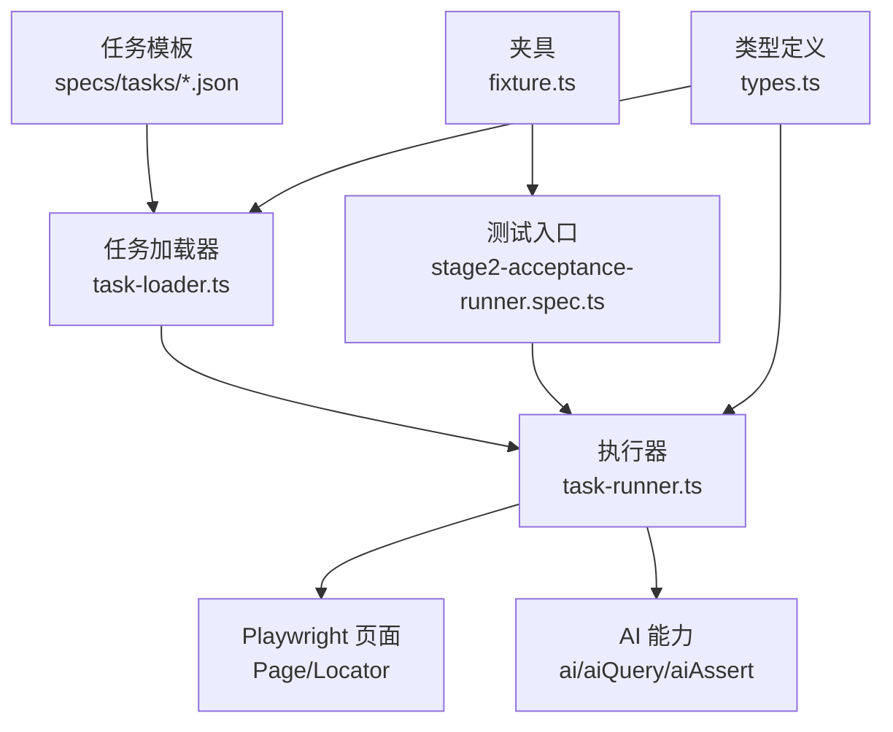
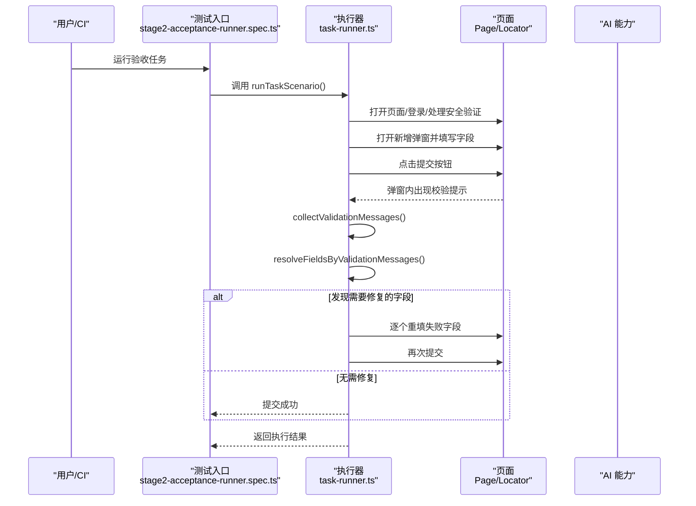
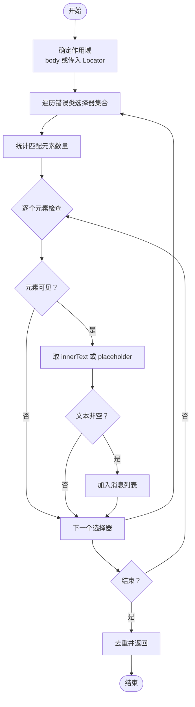
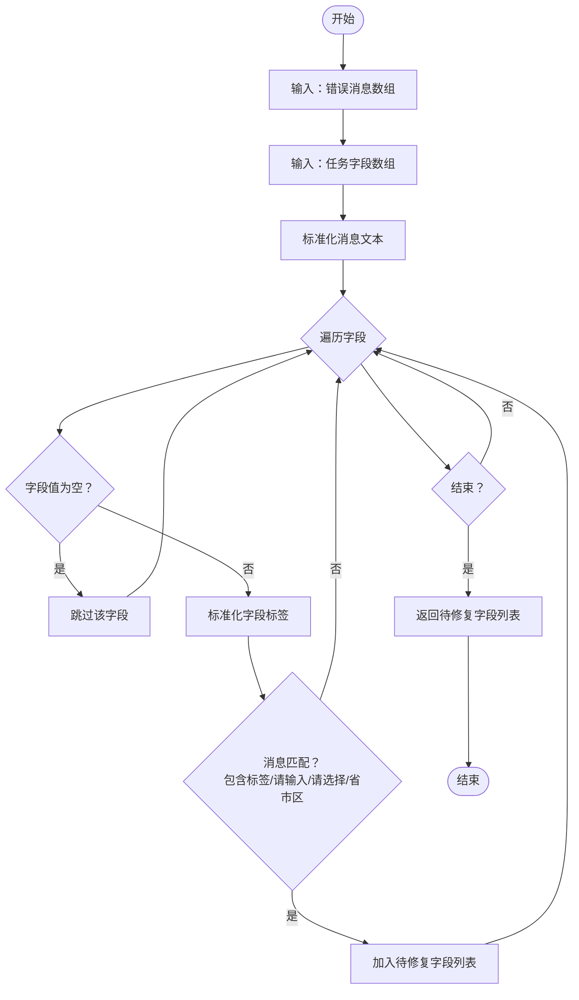
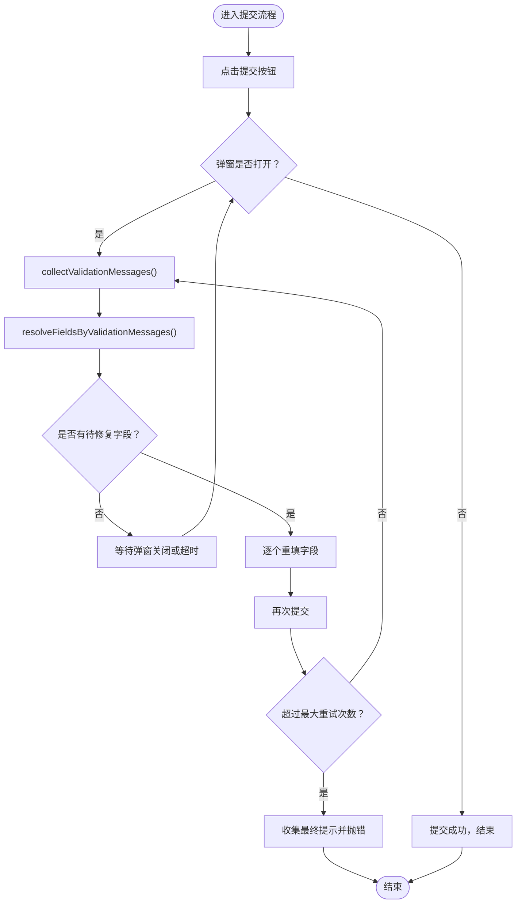
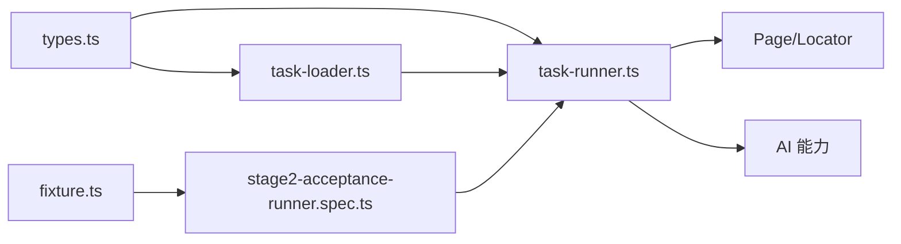

# 数据验证错误

<cite>
**本文引用的文件**
- [README.md](file://README.md)
- [package.json](file://package.json)
- [src/stage2/types.ts](file://src/stage2/types.ts)
- [src/stage2/task-loader.ts](file://src/stage2/task-loader.ts)
- [src/stage2/task-runner.ts](file://src/stage2/task-runner.ts)
- [tests/generated/stage2-acceptance-runner.spec.ts](file://tests/generated/stage2-acceptance-runner.spec.ts)
- [tests/fixture/fixture.ts](file://tests/fixture/fixture.ts)
- [specs/tasks/acceptance-task.community-create.example.json](file://specs/tasks/acceptance-task.community-create.example.json)
- [specs/tasks/acceptance-task.template.json](file://specs/tasks/acceptance-task.template.json)
</cite>

## 目录
1. [简介](#简介)
2. [项目结构](#项目结构)
3. [核心组件](#核心组件)
4. [架构总览](#架构总览)
5. [详细组件分析](#详细组件分析)
6. [依赖关系分析](#依赖关系分析)
7. [性能考量](#性能考量)
8. [故障排除指南](#故障排除指南)
9. [结论](#结论)
10. [附录](#附录)

## 简介
本指南聚焦于“数据验证错误”的综合故障排除，围绕以下关键能力展开：
- 必填字段检查失败的诊断与修复：字段标签匹配、空值检测、隐藏字段验证
- 格式验证失败的排查：日期、邮箱、手机号、身份证等格式规则与错误提示
- 值范围限制问题：数值范围、字符长度、下拉选项等
- 自动化修复流程：collectValidationMessages 与 resolveFieldsByValidationMessages 的工作原理与使用方法
- 错误消息分析与字段映射：如何快速定位具体字段与原因

该能力由第二段执行器在提交表单阶段自动采集校验提示，并基于任务字段定义进行智能匹配，自动重填失败字段，从而提升自动化验收的稳定性。

## 项目结构
该项目采用“任务驱动 + AI + Playwright”的验收执行框架，核心结构如下：
- 任务定义与模板：specs/tasks/*.json
- 执行器：src/stage2/task-runner.ts
- 类型定义：src/stage2/types.ts
- 任务加载与校验：src/stage2/task-loader.ts
- 测试入口与夹具：tests/generated/stage2-acceptance-runner.spec.ts、tests/fixture/fixture.ts
- 项目说明与运行指引：README.md、package.json

图表来源
- [src/stage2/task-runner.ts](file://src/stage2/task-runner.ts#L1062-L1344)
- [src/stage2/task-loader.ts](file://src/stage2/task-loader.ts#L79-L89)
- [specs/tasks/acceptance-task.community-create.example.json](file://specs/tasks/acceptance-task.community-create.example.json#L1-L184)
- [tests/generated/stage2-acceptance-runner.spec.ts](file://tests/generated/stage2-acceptance-runner.spec.ts#L1-L39)
- [tests/fixture/fixture.ts](file://tests/fixture/fixture.ts#L1-L100)
- [src/stage2/types.ts](file://src/stage2/types.ts#L1-L125)

章节来源
- [README.md](file://README.md#L1-L144)
- [package.json](file://package.json#L1-L24)

## 核心组件
- 任务模型与字段定义：TaskField、TaskForm 等，用于描述表单字段、标签、必填、组件类型、提示等
- 任务加载与校验：解析任务文件、模板变量替换、必要字段校验
- 表单填写与提交：自动定位输入控件、填写值、提交并处理弹窗
- 验证消息采集与字段映射：收集错误提示、匹配到具体字段并自动重填
- 执行与断言：步骤化执行、截图记录、AI断言与查询

章节来源
- [src/stage2/types.ts](file://src/stage2/types.ts#L23-L40)
- [src/stage2/task-loader.ts](file://src/stage2/task-loader.ts#L50-L89)
- [src/stage2/task-runner.ts](file://src/stage2/task-runner.ts#L894-L971)
- [src/stage2/task-runner.ts](file://src/stage2/task-runner.ts#L973-L1018)

## 架构总览
提交表单阶段的验证自动修复流程如下：

图表来源
- [src/stage2/task-runner.ts](file://src/stage2/task-runner.ts#L973-L1018)
- [src/stage2/task-runner.ts](file://src/stage2/task-runner.ts#L335-L404)
- [tests/generated/stage2-acceptance-runner.spec.ts](file://tests/generated/stage2-acceptance-runner.spec.ts#L12-L37)

## 详细组件分析

### 组件一：验证消息采集 collectValidationMessages
职责
- 在页面或指定作用域内收集可见的错误提示文本
- 支持主流 UI 组件库的错误类选择器（Element Plus、Ant Design、iView）

工作流程
- 以 body 为根或传入的 Locator 作为作用域
- 遍历多个错误类选择器，过滤不可见元素
- 优先取 innerText，若为空则回退到 placeholder 属性
- 去重并返回非空字符串数组

图表来源
- [src/stage2/task-runner.ts](file://src/stage2/task-runner.ts#L335-L364)

章节来源
- [src/stage2/task-runner.ts](file://src/stage2/task-runner.ts#L335-L364)

### 组件二：字段映射 resolveFieldsByValidationMessages
职责
- 将收集到的错误消息映射回任务中的具体字段
- 用于自动修复：仅对需要重填的字段进行二次填充

匹配规则
- 字段标签标准化（去除星号、空白、统一大小写）
- 若消息包含字段标签或“请输入/请选择 + 标签”
- 对级联组件（cascader）特殊处理：匹配“省市区/请选择”等关键词
- 忽略空值字段（避免对未填写的字段进行无效重填）

图表来源
- [src/stage2/task-runner.ts](file://src/stage2/task-runner.ts#L366-L404)

章节来源
- [src/stage2/task-runner.ts](file://src/stage2/task-runner.ts#L366-L404)

### 组件三：提交与自动修复 submitFormWithAutoFix
职责
- 点击提交按钮并处理弹窗
- 循环采集错误消息并映射字段，逐个重填后再次提交
- 最多重试若干次，最终仍失败则抛出错误并附带最终提示

图表来源
- [src/stage2/task-runner.ts](file://src/stage2/task-runner.ts#L973-L1018)

章节来源
- [src/stage2/task-runner.ts](file://src/stage2/task-runner.ts#L973-L1018)

### 组件四：字段值空值检测 isFieldValueEmpty
职责
- 判断字段值是否为空（支持字符串与字符串数组）
- 用于在映射阶段跳过未填写字段，避免无效重填

章节来源
- [src/stage2/task-runner.ts](file://src/stage2/task-runner.ts#L155-L160)

### 组件五：字段填写 fillField
职责
- 根据字段标签、提示、组件类型（含级联 cascader）自动定位并填写
- 级联场景：打开面板、逐级点击选项、校验最终显示值
- 失败时抛出明确错误，包含期望路径与实际值

章节来源
- [src/stage2/task-runner.ts](file://src/stage2/task-runner.ts#L894-L971)

## 依赖关系分析
- 执行器依赖类型定义与任务加载器
- 执行器通过 Playwright 定位器与页面交互
- 执行器通过 AI 能力进行兜底交互与断言
- 测试入口与夹具负责注入 AI 能力与页面上下文

图表来源
- [src/stage2/types.ts](file://src/stage2/types.ts#L1-L125)
- [src/stage2/task-loader.ts](file://src/stage2/task-loader.ts#L1-L91)
- [src/stage2/task-runner.ts](file://src/stage2/task-runner.ts#L1-L1344)
- [tests/generated/stage2-acceptance-runner.spec.ts](file://tests/generated/stage2-acceptance-runner.spec.ts#L1-L39)
- [tests/fixture/fixture.ts](file://tests/fixture/fixture.ts#L1-L100)

章节来源
- [src/stage2/types.ts](file://src/stage2/types.ts#L1-L125)
- [src/stage2/task-loader.ts](file://src/stage2/task-loader.ts#L1-L91)
- [src/stage2/task-runner.ts](file://src/stage2/task-runner.ts#L1-L1344)
- [tests/generated/stage2-acceptance-runner.spec.ts](file://tests/generated/stage2-acceptance-runner.spec.ts#L1-L39)
- [tests/fixture/fixture.ts](file://tests/fixture/fixture.ts#L1-L100)

## 性能考量
- 选择器扫描与可见性判断：collectValidationMessages 会遍历多个选择器并检查可见性，建议在弹窗范围内缩小作用域以减少扫描量
- 重试机制：submitFormWithAutoFix 最多重试若干次，每次提交后等待弹窗状态变化，注意控制 stepTimeoutMs 与 pageTimeoutMs
- 截图与进度文件：每步执行可开启截图与 partial 结果写盘，便于定位问题但会增加 IO 压力

章节来源
- [src/stage2/task-runner.ts](file://src/stage2/task-runner.ts#L335-L364)
- [src/stage2/task-runner.ts](file://src/stage2/task-runner.ts#L973-L1018)
- [specs/tasks/acceptance-task.community-create.example.json](file://specs/tasks/acceptance-task.community-create.example.json#L177-L182)

## 故障排除指南

### 一、必填字段检查失败
常见症状
- 提交后弹窗内出现“请输入X”、“请选择X”等提示
- 系统无法定位到对应字段，导致无法自动重填

诊断步骤
1. 确认字段标签与任务定义一致
   - 字段标签会去除星号并做空白标准化，确保与页面提示一致
   - 参考：[字段标签标准化](file://src/stage2/task-runner.ts#L140-L142)
2. 检查字段值是否为空
   - 空值字段会被跳过，不会参与映射
   - 参考：[空值检测](file://src/stage2/task-runner.ts#L155-L160)
3. 检查占位文案与提示
   - collectValidationMessages 会回退到 placeholder，确保占位文案与任务 hints 一致
   - 参考：[消息采集](file://src/stage2/task-runner.ts#L335-L364)
4. 级联字段特殊处理
   - 匹配“省市区/请选择”等关键词
   - 参考：[字段映射规则](file://src/stage2/task-runner.ts#L385-L390)
5. 隐藏字段与弹窗范围
   - 仅在弹窗内作用域收集错误消息，确保弹窗标题或打开按钮文案正确
   - 参考：[弹窗可见性判断](file://src/stage2/task-runner.ts#L406-L409)

修复建议
- 在任务模板中完善 hints，确保占位文案与页面一致
- 对必填字段设置 required 并提供有效值
- 级联字段提供完整路径数组，确保最终显示值匹配

章节来源
- [src/stage2/task-runner.ts](file://src/stage2/task-runner.ts#L140-L160)
- [src/stage2/task-runner.ts](file://src/stage2/task-runner.ts#L335-L404)
- [specs/tasks/acceptance-task.community-create.example.json](file://specs/tasks/acceptance-task.community-create.example.json#L48-L52)

### 二、格式验证失败
常见症状
- 提交后出现“格式不正确”、“请输入正确的手机号/邮箱/日期/身份证号”等提示

排查技巧
- 日期格式
  - 页面提示中常见的“日期格式不正确”通常与本地化格式有关
  - 建议在任务中使用明确的日期字符串，避免依赖页面默认格式
- 邮箱格式
  - 确认邮箱值符合常规格式，避免拼写错误
- 手机号码
  - 确认值为纯数字且长度符合预期
  - 参考示例任务中的手机号字段
- 身份证号
  - 若页面有校验，确保值满足长度与数字要求

定位方法
- 使用 collectValidationMessages 获取错误消息，结合 resolveFieldsByValidationMessages 定位字段
- 若提示中包含“请输入正确的...”，可直接在任务中调整对应字段值

章节来源
- [specs/tasks/acceptance-task.community-create.example.json](file://specs/tasks/acceptance-task.community-create.example.json#L92-L101)
- [src/stage2/task-runner.ts](file://src/stage2/task-runner.ts#L335-L404)

### 三、值范围限制问题
常见症状
- 出现“长度超出/超出范围/必须大于/小于”等提示

排查技巧
- 字符长度限制
  - 多行/单行输入框通常有最大长度提示（如 0/100、0/255）
  - 确保字段值不超过上限
- 数值范围
  - 若页面有最小/最大值限制，确保输入值在允许范围内
- 下拉选项
  - 确保选择的选项存在于可选项中，避免输入不存在的值

定位方法
- 通过错误消息中的“超出/必须/长度”等关键词，结合字段标签进行匹配
- 若页面同时展示计数器，可在填写后立即核对计数

章节来源
- [specs/tasks/acceptance-task.community-create.example.json](file://specs/tasks/acceptance-task.community-create.example.json#L48-L63)
- [src/stage2/task-runner.ts](file://src/stage2/task-runner.ts#L335-L404)

### 四、collectValidationMessages 与 resolveFieldsByValidationMessages 的使用
使用场景
- 在提交后弹窗内出现错误提示时，自动收集并映射到具体字段，实现“一键修复”

工作流程
- 收集：在页面或弹窗作用域内收集可见错误消息
- 映射：将消息与字段标签进行匹配，得到待修复字段列表
- 重填：逐个字段重填后再次提交

最佳实践
- 在弹窗范围内调用 collectValidationMessages，提高准确性
- 为每个字段提供清晰的 label 与 hints，提升匹配成功率
- 对级联字段提供完整路径，避免因路径不完整导致匹配失败

章节来源
- [src/stage2/task-runner.ts](file://src/stage2/task-runner.ts#L335-L404)
- [src/stage2/task-runner.ts](file://src/stage2/task-runner.ts#L973-L1018)

### 五、错误消息分析与字段映射示例
示例一：必填字段缺失
- 现象：提示“请输入小区名称/请选择省市区”
- 定位：resolveFieldsByValidationMessages 会匹配“请输入 + 标签”或“请选择 + 标签”
- 修复：确保对应字段值非空，且级联字段提供完整路径

示例二：格式不正确
- 现象：提示“请输入正确的手机号”
- 定位：错误消息中包含“正确的”关键词，结合字段标签匹配
- 修复：调整手机号格式，确保为纯数字且长度正确

示例三：长度超限
- 现象：提示“超出最大长度/长度不正确”
- 定位：结合页面计数器与错误消息
- 修复：缩短字段值或优化输入策略

章节来源
- [src/stage2/task-runner.ts](file://src/stage2/task-runner.ts#L366-L404)
- [specs/tasks/acceptance-task.community-create.example.json](file://specs/tasks/acceptance-task.community-create.example.json#L48-L63)

## 结论
通过 collectValidationMessages 与 resolveFieldsByValidationMessages 的组合，系统能够在提交失败时自动定位并修复关键字段，显著降低人工介入成本。建议在任务模板中：
- 明确字段标签与占位文案
- 提供必填字段的有效值
- 为级联字段提供完整路径
- 合理设置超时参数与截图策略

## 附录
- 任务模板参考
  - 示例任务：[acceptance-task.community-create.example.json](file://specs/tasks/acceptance-task.community-create.example.json#L1-L184)
  - 通用模板：[acceptance-task.template.json](file://specs/tasks/acceptance-task.template.json#L1-L85)
- 运行与调试
  - 运行命令与产物目录参见：[README.md](file://README.md#L106-L131)
  - 测试入口与夹具：[stage2-acceptance-runner.spec.ts](file://tests/generated/stage2-acceptance-runner.spec.ts#L1-L39)、[fixture.ts](file://tests/fixture/fixture.ts#L1-L100)