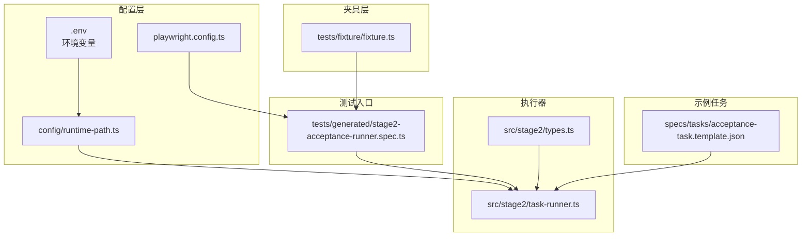
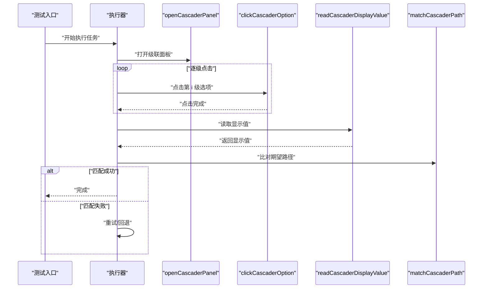
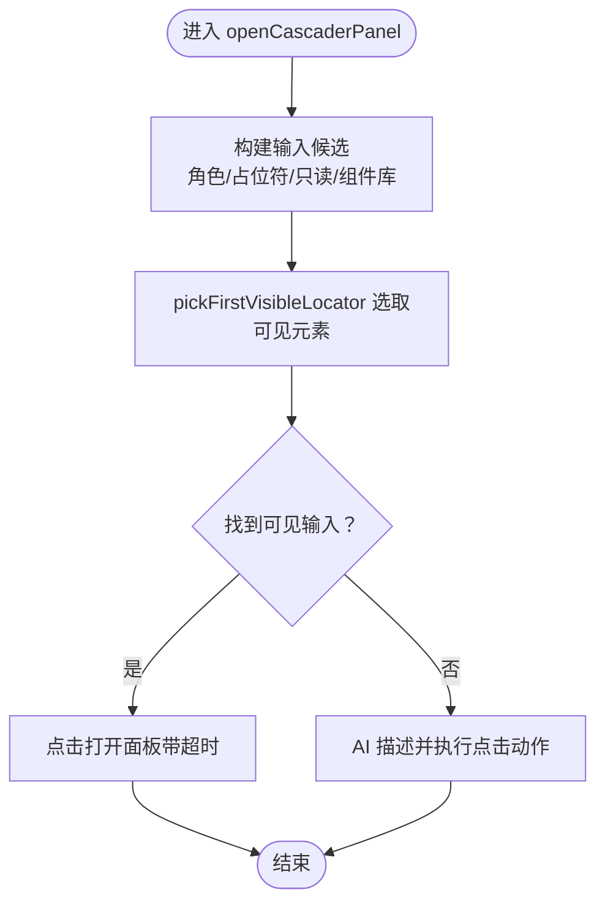
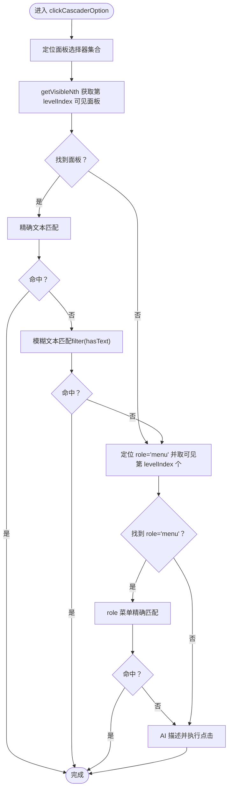
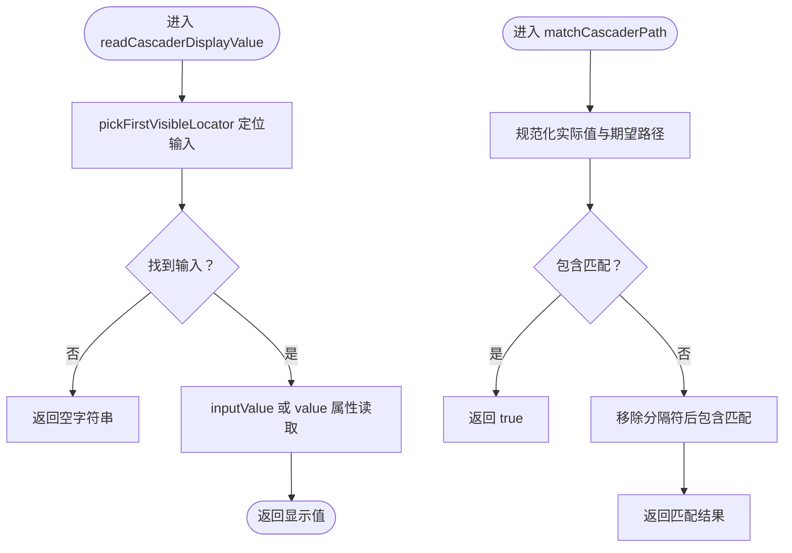
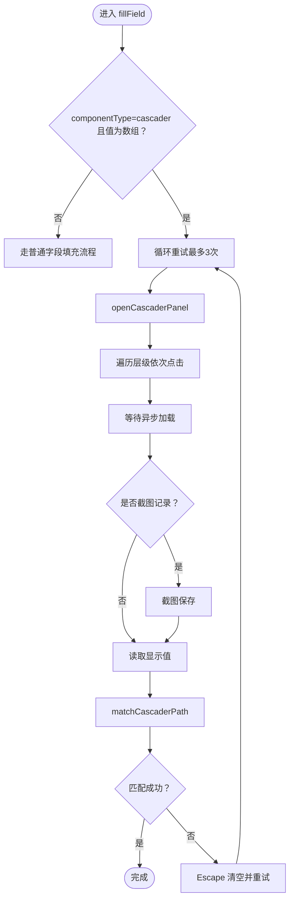
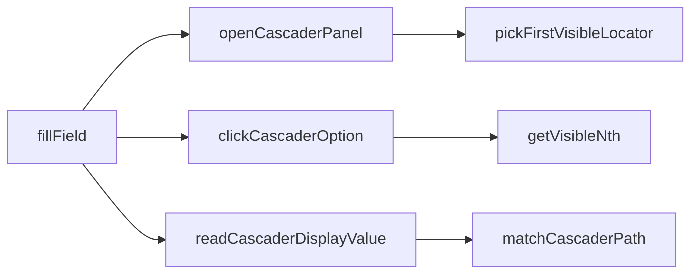

# 级联选择器问题

<cite>
**本文引用的文件**
- [README.md](file://README.md)
- [package.json](file://package.json)
- [playwright.config.ts](file://playwright.config.ts)
- [config/runtime-path.ts](file://config/runtime-path.ts)
- [tests/fixture/fixture.ts](file://tests/fixture/fixture.ts)
- [tests/generated/stage2-acceptance-runner.spec.ts](file://tests/generated/stage2-acceptance-runner.spec.ts)
- [specs/tasks/acceptance-task.template.json](file://specs/tasks/acceptance-task.template.json)
- [src/stage2/types.ts](file://src/stage2/types.ts)
- [src/stage2/task-runner.ts](file://src/stage2/task-runner.ts)
</cite>

## 目录
1. [简介](#简介)
2. [项目结构](#项目结构)
3. [核心组件](#核心组件)
4. [架构总览](#架构总览)
5. [详细组件分析](#详细组件分析)
6. [依赖关系分析](#依赖关系分析)
7. [性能考量](#性能考量)
8. [故障排除指南](#故障排除指南)
9. [结论](#结论)
10. [附录](#附录)

## 简介
本指南聚焦于“级联选择器”的异常处理与调试，覆盖以下关键主题：
- 依赖关系未满足导致的选择器失效：省市区联动、城市区域选择等多级依赖关系的处理方法
- 数据加载延迟问题：异步数据获取、缓存策略、网络延迟等导致的选项缺失
- 选项刷新与更新机制：动态选项添加、过滤搜索、手动输入等场景的调试方法
- openCascaderPanel 与 clickCascaderOption 的使用与常见问题
- 级联面板检测、选项匹配、层级导航的具体流程与调试技巧

本项目基于 Playwright 与 Midscene 的自动化测试框架，通过 JSON 任务驱动执行器完成端到端行为自动化。级联选择器相关逻辑集中在执行器模块中，采用多策略定位面板、逐层点击选项，并在失败时进行重试与回退。

## 项目结构
项目采用分层组织：
- 配置层：环境变量与运行目录管理
- 夹具层：封装 AI 能力与页面交互
- 测试入口：第二段执行器入口
- 执行器：解析任务、填充表单、处理级联选择器等
- 示例任务：JSON 任务模板，用于驱动执行器

**图表来源**
- [config/runtime-path.ts](file://config/runtime-path.ts#L1-L41)
- [playwright.config.ts](file://playwright.config.ts#L1-L95)
- [tests/fixture/fixture.ts](file://tests/fixture/fixture.ts#L1-L100)
- [tests/generated/stage2-acceptance-runner.spec.ts](file://tests/generated/stage2-acceptance-runner.spec.ts#L1-L39)
- [src/stage2/task-runner.ts](file://src/stage2/task-runner.ts#L1-L200)
- [src/stage2/types.ts](file://src/stage2/types.ts#L1-L125)
- [specs/tasks/acceptance-task.template.json](file://specs/tasks/acceptance-task.template.json#L1-L85)

**章节来源**
- [README.md](file://README.md#L1-L144)
- [package.json](file://package.json#L1-L24)
- [playwright.config.ts](file://playwright.config.ts#L1-L95)
- [config/runtime-path.ts](file://config/runtime-path.ts#L1-L41)
- [tests/fixture/fixture.ts](file://tests/fixture/fixture.ts#L1-L100)
- [tests/generated/stage2-acceptance-runner.spec.ts](file://tests/generated/stage2-acceptance-runner.spec.ts#L1-L39)
- [specs/tasks/acceptance-task.template.json](file://specs/tasks/acceptance-task.template.json#L1-L85)
- [src/stage2/types.ts](file://src/stage2/types.ts#L1-L125)
- [src/stage2/task-runner.ts](file://src/stage2/task-runner.ts#L1-L200)

## 核心组件
- 执行器入口：负责加载任务、执行步骤、收集结果与截图
- 级联选择器处理：打开面板、逐层点击选项、读取显示值、路径匹配与重试
- 夹具与 AI：提供 ai/aiQuery/aiAssert/aiWaitFor 能力，支持在无法直接定位时进行自然语言引导
- 运行时路径：集中管理输出目录、报告目录与截图目录

关键职责与对应文件：
- 级联面板打开与选项点击：openCascaderPanel、clickCascaderOption
- 级联路径读取与匹配：readCascaderDisplayValue、matchCascaderPath
- 字段填充与重试：fillField
- 任务模型与类型：AcceptanceTask、TaskField 等

**章节来源**
- [src/stage2/task-runner.ts](file://src/stage2/task-runner.ts#L705-L785)
- [src/stage2/task-runner.ts](file://src/stage2/task-runner.ts#L309-L333)
- [src/stage2/task-runner.ts](file://src/stage2/task-runner.ts#L894-L971)
- [src/stage2/types.ts](file://src/stage2/types.ts#L23-L40)

## 架构总览
下图展示级联选择器在执行器中的调用链路与控制流：

**图表来源**
- [src/stage2/task-runner.ts](file://src/stage2/task-runner.ts#L705-L785)
- [src/stage2/task-runner.ts](file://src/stage2/task-runner.ts#L309-L333)
- [src/stage2/task-runner.ts](file://src/stage2/task-runner.ts#L894-L971)

## 详细组件分析

### openCascaderPanel：级联面板打开
- 功能：根据字段标签与弹窗上下文，优先通过多种选择器定位输入框并点击打开面板；若定位失败，则通过 AI 引导点击
- 关键点：
  - 输入候选构建：结合角色、占位符、只读属性与多组件库选择器
  - 可见性筛选：pickFirstVisibleLocator 保证只对可见元素操作
  - 超时控制：点击操作设置超时，避免卡死
  - 回退策略：定位失败时调用 AI 描述动作并执行

**图表来源**
- [src/stage2/task-runner.ts](file://src/stage2/task-runner.ts#L204-L225)
- [src/stage2/task-runner.ts](file://src/stage2/task-runner.ts#L162-L180)
- [src/stage2/task-runner.ts](file://src/stage2/task-runner.ts#L705-L721)

**章节来源**
- [src/stage2/task-runner.ts](file://src/stage2/task-runner.ts#L204-L225)
- [src/stage2/task-runner.ts](file://src/stage2/task-runner.ts#L162-L180)
- [src/stage2/task-runner.ts](file://src/stage2/task-runner.ts#L705-L721)

### clickCascaderOption：逐级选项点击
- 功能：在指定层级定位面板，尝试精确文本与模糊文本匹配，支持多种菜单节点类型
- 关键点：
  - 多面板选择器适配：Element Plus、Ant Design、iView 等
  - 层级可见性：getVisibleNth 获取第 N 个可见面板
  - 匹配策略：先精确匹配，再模糊匹配，最后回退到 role="menu" 的菜单项
  - 回退策略：若仍失败，调用 AI 描述并执行点击

**图表来源**
- [src/stage2/task-runner.ts](file://src/stage2/task-runner.ts#L723-L785)
- [src/stage2/task-runner.ts](file://src/stage2/task-runner.ts#L182-L202)
- [src/stage2/task-runner.ts](file://src/stage2/task-runner.ts#L758-L767)

**章节来源**
- [src/stage2/task-runner.ts](file://src/stage2/task-runner.ts#L723-L785)
- [src/stage2/task-runner.ts](file://src/stage2/task-runner.ts#L182-L202)
- [src/stage2/task-runner.ts](file://src/stage2/task-runner.ts#L758-L767)

### 级联路径读取与匹配
- 功能：读取级联输入框的显示值，并与期望路径进行匹配
- 关键点：
  - 显示值读取：优先 inputValue，其次 value 属性
  - 路径匹配：支持包含匹配与去除分隔符后的包含匹配

**图表来源**
- [src/stage2/task-runner.ts](file://src/stage2/task-runner.ts#L309-L321)
- [src/stage2/task-runner.ts](file://src/stage2/task-runner.ts#L289-L307)
- [src/stage2/task-runner.ts](file://src/stage2/task-runner.ts#L323-L333)

**章节来源**
- [src/stage2/task-runner.ts](file://src/stage2/task-runner.ts#L309-L321)
- [src/stage2/task-runner.ts](file://src/stage2/task-runner.ts#L289-L307)
- [src/stage2/task-runner.ts](file://src/stage2/task-runner.ts#L323-L333)

### 字段填充与重试（含级联）
- 功能：当字段类型为 cascader 且值为数组时，执行打开面板、逐级点击、读取显示值、路径匹配与重试
- 关键点：
  - 最多重试 3 次
  - 每次点击后等待以让异步数据加载完成
  - 截图记录每一步，便于问题定位
  - 失败时触发回退：Esc 清空并重试

**图表来源**
- [src/stage2/task-runner.ts](file://src/stage2/task-runner.ts#L894-L971)
- [src/stage2/task-runner.ts](file://src/stage2/task-runner.ts#L705-L721)
- [src/stage2/task-runner.ts](file://src/stage2/task-runner.ts#L723-L785)
- [src/stage2/task-runner.ts](file://src/stage2/task-runner.ts#L309-L333)

**章节来源**
- [src/stage2/task-runner.ts](file://src/stage2/task-runner.ts#L894-L971)
- [src/stage2/task-runner.ts](file://src/stage2/task-runner.ts#L705-L721)
- [src/stage2/task-runner.ts](file://src/stage2/task-runner.ts#L723-L785)
- [src/stage2/task-runner.ts](file://src/stage2/task-runner.ts#L309-L333)

## 依赖关系分析
- 组件耦合：
  - openCascaderPanel 依赖输入候选构建与可见性筛选
  - clickCascaderOption 依赖面板选择器集合与层级可见性
  - fillField 串联面板打开、选项点击、显示值读取与路径匹配
- 外部依赖：
  - Playwright 定位器与等待机制
  - Midscene AI 能力用于无法直接定位时的回退
- 潜在环路：
  - 无直接循环依赖，控制流清晰

**图表来源**
- [src/stage2/task-runner.ts](file://src/stage2/task-runner.ts#L894-L971)
- [src/stage2/task-runner.ts](file://src/stage2/task-runner.ts#L705-L785)
- [src/stage2/task-runner.ts](file://src/stage2/task-runner.ts#L309-L333)
- [src/stage2/task-runner.ts](file://src/stage2/task-runner.ts#L162-L202)

**章节来源**
- [src/stage2/task-runner.ts](file://src/stage2/task-runner.ts#L894-L971)
- [src/stage2/task-runner.ts](file://src/stage2/task-runner.ts#L705-L785)
- [src/stage2/task-runner.ts](file://src/stage2/task-runner.ts#L309-L333)
- [src/stage2/task-runner.ts](file://src/stage2/task-runner.ts#L162-L202)

## 性能考量
- 等待与重试：
  - 每次点击后等待以让异步数据加载完成，避免过早读取导致的空值
  - 最多重试 3 次，减少无效等待
- 截图与报告：
  - 在关键步骤截图，有助于快速定位问题
- 选择器优化：
  - 优先使用角色与占位符定位，降低误触概率
  - 多组件库适配，提升稳定性

[本节为通用指导，无需特定文件引用]

## 故障排除指南

### 一、依赖关系未满足导致的选择器失效
- 症状：点击面板后无选项、点击无效或层级不正确
- 排查要点：
  - 面板打开是否成功：确认 openCascaderPanel 是否定位到输入并点击
  - 层级可见性：getVisibleNth 返回的面板是否为可见且正确层级
  - 选项匹配：clickCascaderOption 的精确/模糊匹配是否覆盖目标文本
- 解决建议：
  - 增加层级等待：在点击后增加等待时间，确保异步数据加载
  - 扩展面板选择器：针对具体组件库补充面板选择器
  - 使用 AI 回退：当定位失败时，通过 AI 描述动作并执行

调试技巧：
- 在 fillField 中开启截图记录，观察每一步的面板状态与选项呈现
- 对比期望路径与实际显示值，确认 matchCascaderPath 的匹配逻辑是否符合预期

**章节来源**
- [src/stage2/task-runner.ts](file://src/stage2/task-runner.ts#L705-L721)
- [src/stage2/task-runner.ts](file://src/stage2/task-runner.ts#L182-L202)
- [src/stage2/task-runner.ts](file://src/stage2/task-runner.ts#L723-L785)
- [src/stage2/task-runner.ts](file://src/stage2/task-runner.ts#L894-L971)

### 二、数据加载延迟导致的选项缺失
- 症状：点击后选项为空、显示值为空或路径不匹配
- 排查要点：
  - 等待策略：fillField 中每次点击后与读取显示值前是否有足够等待
  - 异步数据：面板是否在点击后异步加载子级选项
- 解决建议：
  - 增加等待时间：在点击与读取之间插入更长等待
  - 重试机制：利用现有重试逻辑，确保最终稳定
  - 缓存策略：在任务层面避免重复加载相同数据（如外部接口）

调试技巧：
- 使用 readCascaderDisplayValue 读取显示值，确认是否为空
- 对比期望路径与实际显示值，定位是哪一层缺失

**章节来源**
- [src/stage2/task-runner.ts](file://src/stage2/task-runner.ts#L894-L971)
- [src/stage2/task-runner.ts](file://src/stage2/task-runner.ts#L309-L333)

### 三、选项刷新与更新机制
- 症状：动态选项添加、过滤搜索、手动输入后选项不一致
- 排查要点：
  - 动态选项：面板是否在输入变化后重新渲染
  - 过滤搜索：输入关键词后是否触发异步请求并更新选项
  - 手动输入：输入框是否支持输入并触发校验
- 解决建议：
  - 在输入后增加等待与重试，确保面板刷新完成
  - 使用 AI 回退：当无法直接定位时，通过自然语言描述动作
  - 截图记录：保存刷新前后状态，便于对比

调试技巧：
- 在点击前对输入框进行输入与等待，再执行 openCascaderPanel
- 对比刷新前后的显示值，确认路径匹配是否变化

**章节来源**
- [src/stage2/task-runner.ts](file://src/stage2/task-runner.ts#L705-L721)
- [src/stage2/task-runner.ts](file://src/stage2/task-runner.ts#L723-L785)
- [src/stage2/task-runner.ts](file://src/stage2/task-runner.ts#L894-L971)

### 四、openCascaderPanel 与 clickCascaderOption 的使用与常见问题
- 使用方法：
  - openCascaderPanel：传入字段标签与任务对象，内部会尝试定位输入并点击打开面板
  - clickCascaderOption：传入选项名称与层级索引，内部会定位面板并点击对应选项
- 常见问题：
  - 定位不到输入：检查字段标签、弹窗标题与占位符是否匹配
  - 选项不显示：确认面板已打开且层级正确
  - 文本不匹配：区分精确匹配与模糊匹配，必要时使用 AI 回退
- 调试技巧：
  - 在 openCascaderPanel 后截图，确认面板出现
  - 在 clickCascaderOption 后截图，确认选项被选中

**章节来源**
- [src/stage2/task-runner.ts](file://src/stage2/task-runner.ts#L705-L721)
- [src/stage2/task-runner.ts](file://src/stage2/task-runner.ts#L723-L785)

### 五、级联面板检测、选项匹配与层级导航
- 面板检测：
  - 使用 buildCascaderInputCandidates 构建输入候选，结合 pickFirstVisibleLocator 确保可见性
  - 若候选均不可见，使用 AI 描述并执行点击
- 选项匹配：
  - 先精确匹配，再模糊匹配，最后回退到 role='menu' 的菜单项
- 层级导航：
  - 使用 getVisibleNth 获取第 N 个可见面板，确保层级正确
- 截图与回退：
  - 每步截图记录，失败时 Esc 清空并重试

**章节来源**
- [src/stage2/task-runner.ts](file://src/stage2/task-runner.ts#L204-L225)
- [src/stage2/task-runner.ts](file://src/stage2/task-runner.ts#L162-L180)
- [src/stage2/task-runner.ts](file://src/stage2/task-runner.ts#L723-L785)
- [src/stage2/task-runner.ts](file://src/stage2/task-runner.ts#L182-L202)
- [src/stage2/task-runner.ts](file://src/stage2/task-runner.ts#L894-L971)

## 结论
- openCascaderPanel 与 clickCascaderOption 提供了多策略、多层级的级联选择器处理能力
- fillField 将上述能力整合为可重试的完整流程，配合截图与 AI 回退，显著提升稳定性
- 面向复杂场景（异步数据、动态选项、过滤搜索），应重点加强等待与重试策略，并通过截图与日志定位问题

[本节为总结，无需特定文件引用]

## 附录

### A. 运行与产物
- 运行命令与报告目录由环境变量与配置文件统一管理
- Midscene 日志、截图与报告目录集中收敛至 t_runtime/

**章节来源**
- [README.md](file://README.md#L74-L116)
- [config/runtime-path.ts](file://config/runtime-path.ts#L1-L41)
- [playwright.config.ts](file://playwright.config.ts#L36-L40)

### B. 任务模型与字段类型
- AcceptanceTask、TaskField 等类型定义了任务结构与字段类型，其中 cascader 类型字段的值为字符串数组，表示层级路径

**章节来源**
- [src/stage2/types.ts](file://src/stage2/types.ts#L23-L40)
- [src/stage2/types.ts](file://src/stage2/types.ts#L86-L98)

### C. 示例任务模板
- acceptance-task.template.json 提供了任务的基本结构，可用于驱动执行器进行级联选择器测试

**章节来源**
- [specs/tasks/acceptance-task.template.json](file://specs/tasks/acceptance-task.template.json#L1-L85)