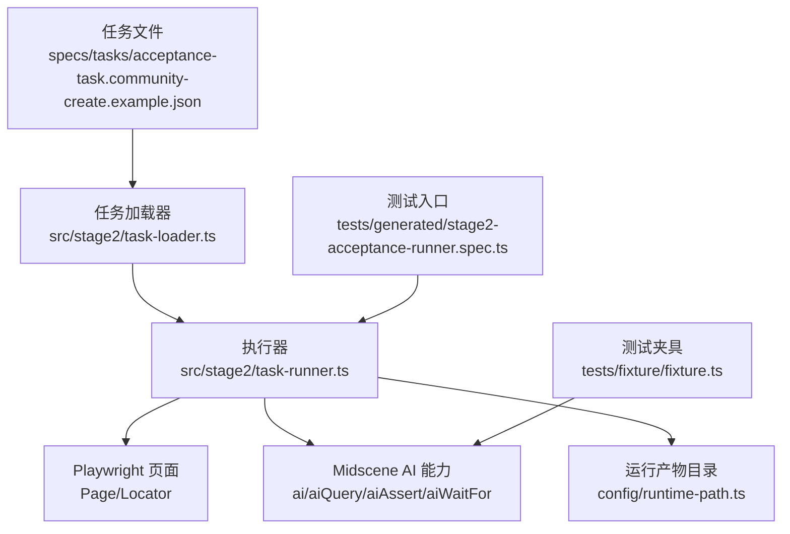
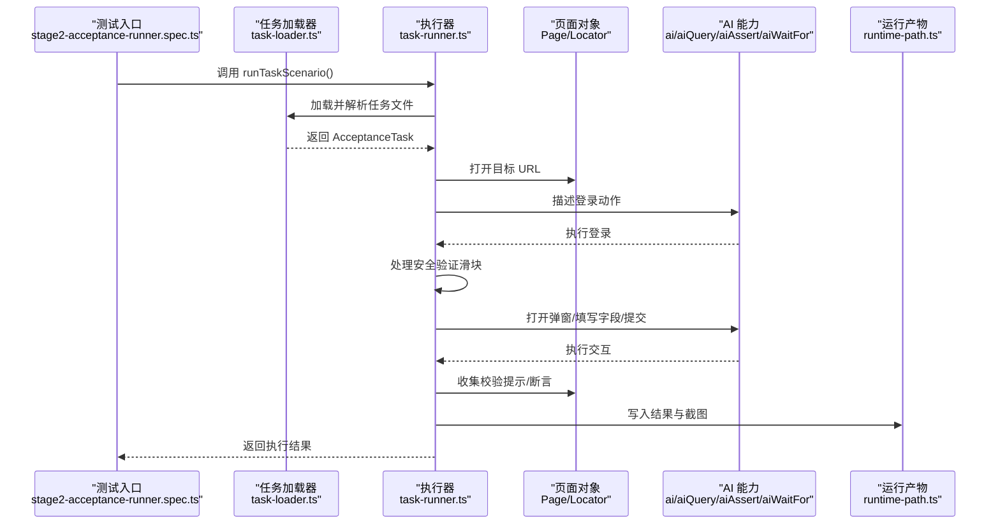
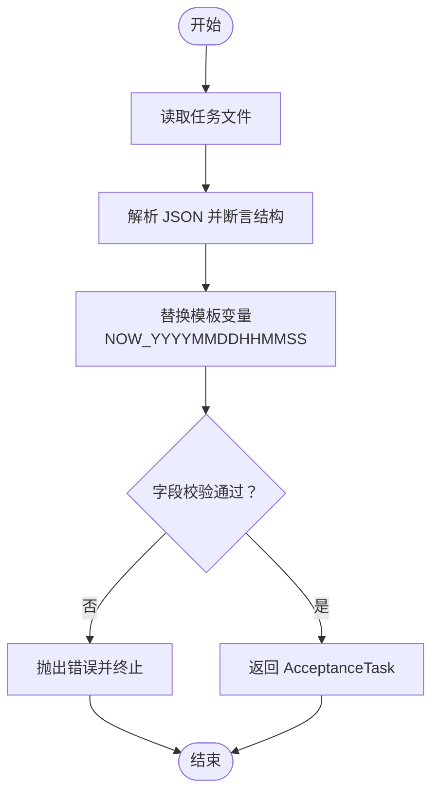
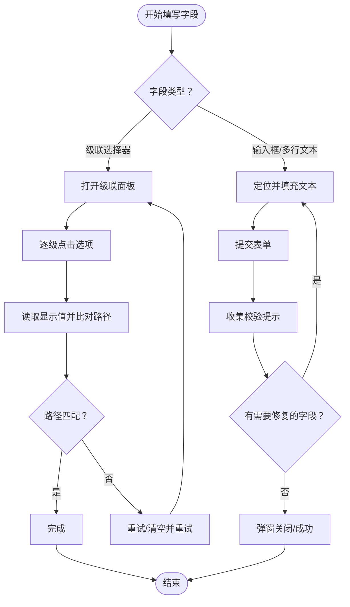
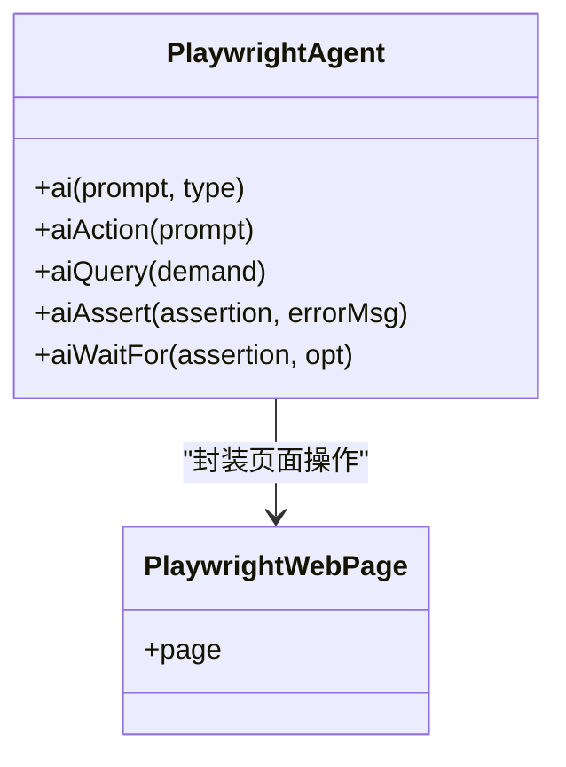
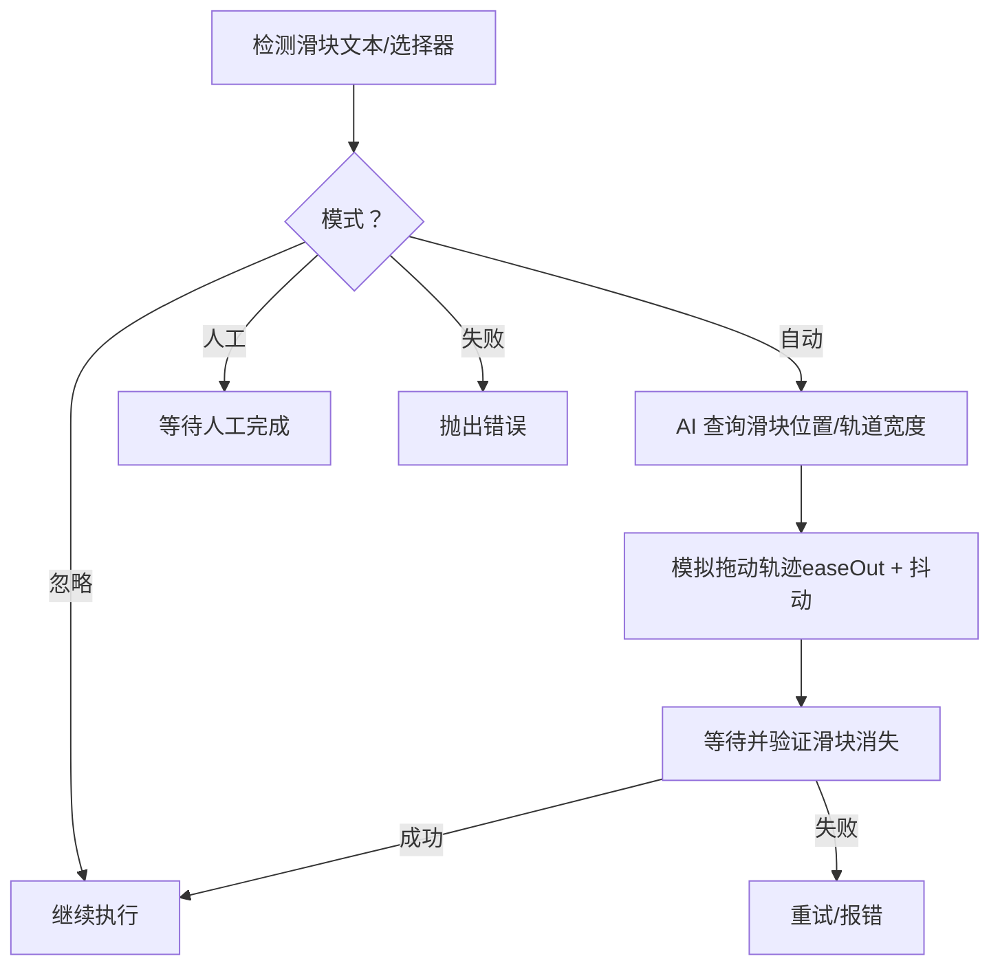
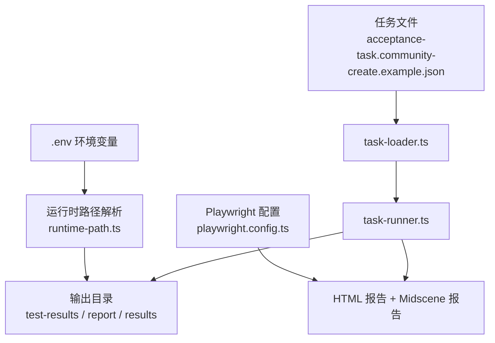

# 表单处理问题

<cite>
**本文引用的文件**
- [README.md](file://README.md)
- [playwright.config.ts](file://playwright.config.ts)
- [package.json](file://package.json)
- [config/runtime-path.ts](file://config/runtime-path.ts)
- [src/stage2/types.ts](file://src/stage2/types.ts)
- [src/stage2/task-runner.ts](file://src/stage2/task-runner.ts)
- [src/stage2/task-loader.ts](file://src/stage2/task-loader.ts)
- [tests/generated/stage2-acceptance-runner.spec.ts](file://tests/generated/stage2-acceptance-runner.spec.ts)
- [tests/fixture/fixture.ts](file://tests/fixture/fixture.ts)
- [specs/tasks/acceptance-task.community-create.example.json](file://specs/tasks/acceptance-task.community-create.example.json)
- [specs/login-e2e.md](file://specs/login-e2e.md)
</cite>

## 目录
1. [简介](#简介)
2. [项目结构](#项目结构)
3. [核心组件](#核心组件)
4. [架构总览](#架构总览)
5. [详细组件分析](#详细组件分析)
6. [依赖分析](#依赖分析)
7. [性能考虑](#性能考虑)
8. [故障排除指南](#故障排除指南)
9. [结论](#结论)
10. [附录](#附录)

## 简介
本指南聚焦于表单处理问题的综合故障排除，结合项目中基于 Playwright 与 Midscene 的自动化测试体系，系统讲解以下主题：
- 元素定位失败的诊断与修复：选择器失效、动态元素加载、iframe 内容访问等
- 输入验证错误的排查：必填字段检查、格式验证失败、值范围限制等
- 级联选择器处理异常：依赖关系未满足、数据加载延迟、选项刷新问题
- 动态表单适配：字段变化检测、条件显示逻辑、异步数据绑定
- 表单提交失败的诊断工具与日志分析：快速定位异常

本指南面向具备基础前端知识的测试工程师与开发者，提供可操作的排障步骤与可视化图示。

## 项目结构
该项目采用“任务驱动 + AI 协作”的端到端测试架构，核心由以下模块组成：
- 任务加载与解析：从 JSON 任务文件加载并解析，支持模板变量替换
- 执行器：按步骤执行页面交互、表单填写、提交与断言
- 夹具与 AI 集成：封装 AI 描述性动作、查询与等待，提升定位与交互鲁棒性
- 运行时产物：截图、报告、中间结果与最终结果文件

图表来源
- [specs/tasks/acceptance-task.community-create.example.json](file://specs/tasks/acceptance-task.community-create.example.json#L1-L184)
- [src/stage2/task-loader.ts](file://src/stage2/task-loader.ts#L79-L89)
- [src/stage2/task-runner.ts](file://src/stage2/task-runner.ts#L1062-L1344)
- [config/runtime-path.ts](file://config/runtime-path.ts#L38-L41)
- [tests/generated/stage2-acceptance-runner.spec.ts](file://tests/generated/stage2-acceptance-runner.spec.ts#L1-L39)
- [tests/fixture/fixture.ts](file://tests/fixture/fixture.ts#L23-L99)

章节来源
- [README.md](file://README.md#L1-L144)
- [playwright.config.ts](file://playwright.config.ts#L1-L95)
- [package.json](file://package.json#L1-L24)

## 核心组件
- 任务模型与类型定义：定义了任务、账户、表单、字段、断言等结构，支撑任务驱动的执行流程
- 任务加载器：负责解析任务文件、校验必要字段、替换模板变量（如时间戳）
- 执行器：实现页面导航、登录、安全验证、弹窗打开、字段填写、提交与断言等步骤
- 夹具与 AI 集成：提供 AI 描述性动作、查询与等待，增强定位与交互的鲁棒性
- 运行时路径：集中管理运行产物输出目录，便于收集截图、报告与中间结果

章节来源
- [src/stage2/types.ts](file://src/stage2/types.ts#L1-L125)
- [src/stage2/task-loader.ts](file://src/stage2/task-loader.ts#L79-L89)
- [src/stage2/task-runner.ts](file://src/stage2/task-runner.ts#L1062-L1344)
- [tests/fixture/fixture.ts](file://tests/fixture/fixture.ts#L23-L99)
- [config/runtime-path.ts](file://config/runtime-path.ts#L38-L41)

## 架构总览
下图展示了从任务文件到页面交互再到断言的整体流程，以及 AI 在定位与交互中的作用。

图表来源
- [tests/generated/stage2-acceptance-runner.spec.ts](file://tests/generated/stage2-acceptance-runner.spec.ts#L18-L37)
- [src/stage2/task-runner.ts](file://src/stage2/task-runner.ts#L1062-L1344)
- [src/stage2/task-loader.ts](file://src/stage2/task-loader.ts#L79-L89)
- [config/runtime-path.ts](file://config/runtime-path.ts#L38-L41)

## 详细组件分析

### 组件一：任务加载与解析
- 职责：读取任务文件，校验必要字段，替换模板变量（如时间戳），返回标准化任务对象
- 关键点：
  - 必要字段校验：任务 ID、任务名、目标 URL、账号信息、表单按钮与字段等
  - 模板替换：支持 NOW_YYYYMMDDHHMMSS 等占位符，便于生成唯一值
  - 绝对/相对路径解析：支持从环境变量或默认路径读取任务文件

图表来源
- [src/stage2/task-loader.ts](file://src/stage2/task-loader.ts#L79-L89)

章节来源
- [src/stage2/task-loader.ts](file://src/stage2/task-loader.ts#L79-L89)
- [specs/tasks/acceptance-task.community-create.example.json](file://specs/tasks/acceptance-task.community-create.example.json#L1-L184)

### 组件二：表单字段填写与提交
- 职责：根据字段类型（输入框、多行文本、级联选择器）进行定位与填充；提交时自动修复校验提示
- 关键点：
  - 字段类型分支：级联选择器需要逐级打开并点击选项
  - 容错策略：多次尝试、截图记录、读取显示值比对
  - 提交自动修复：收集弹窗内校验提示，映射到具体字段并重新填写

图表来源
- [src/stage2/task-runner.ts](file://src/stage2/task-runner.ts#L894-L971)
- [src/stage2/task-runner.ts](file://src/stage2/task-runner.ts#L973-L1018)

章节来源
- [src/stage2/task-runner.ts](file://src/stage2/task-runner.ts#L894-L971)
- [src/stage2/task-runner.ts](file://src/stage2/task-runner.ts#L973-L1018)

### 组件三：AI 驱动的元素定位与交互
- 职责：通过自然语言描述页面元素与交互，降低硬编码选择器的脆弱性
- 关键点：
  - ai：执行动作型描述
  - aiQuery：结构化数据提取
  - aiAssert：断言型描述
  - aiWaitFor：等待型描述
- 适用场景：动态元素、iframe 内容、复杂布局下的定位与交互

图表来源
- [tests/fixture/fixture.ts](file://tests/fixture/fixture.ts#L23-L99)

章节来源
- [tests/fixture/fixture.ts](file://tests/fixture/fixture.ts#L23-L99)

### 组件四：安全验证（滑块验证码）处理
- 职责：检测并处理滑块验证码，支持自动/人工/失败/忽略四种模式
- 关键点：
  - 文本与选择器双重检测
  - AI 查询滑块位置与轨道宽度，模拟真人拖动轨迹
  - 多次重试与超时控制

图表来源
- [src/stage2/task-runner.ts](file://src/stage2/task-runner.ts#L480-L703)
- [src/stage2/task-runner.ts](file://src/stage2/task-runner.ts#L507-L645)

章节来源
- [src/stage2/task-runner.ts](file://src/stage2/task-runner.ts#L480-L703)
- [src/stage2/task-runner.ts](file://src/stage2/task-runner.ts#L507-L645)

## 依赖分析
- 运行时目录统一：通过环境变量集中管理输出目录，便于收集截图与报告
- 测试配置：Playwright 报告器与 Midscene 报告器集成，支持 HTML 报告与 AI 报告
- 任务驱动：JSON 任务文件作为单一事实源，驱动执行器完成端到端流程

图表来源
- [config/runtime-path.ts](file://config/runtime-path.ts#L38-L41)
- [playwright.config.ts](file://playwright.config.ts#L36-L40)
- [specs/tasks/acceptance-task.community-create.example.json](file://specs/tasks/acceptance-task.community-create.example.json#L1-L184)
- [src/stage2/task-loader.ts](file://src/stage2/task-loader.ts#L71-L77)

章节来源
- [config/runtime-path.ts](file://config/runtime-path.ts#L38-L41)
- [playwright.config.ts](file://playwright.config.ts#L36-L40)
- [package.json](file://package.json#L6-L9)

## 性能考虑
- 步骤超时与页面超时：通过任务 runtime 配置 stepTimeoutMs 与 pageTimeoutMs 控制等待时间
- 截图与追踪：按需开启每步截图与 trace，平衡可观测性与性能
- 重试与退避：提交失败时的自动修复与滑块自动处理的多次重试，避免单点失败导致整体耗时

章节来源
- [specs/tasks/acceptance-task.community-create.example.json](file://specs/tasks/acceptance-task.community-create.example.json#L177-L182)
- [src/stage2/task-runner.ts](file://src/stage2/task-runner.ts#L1170-L1172)
- [src/stage2/task-runner.ts](file://src/stage2/task-runner.ts#L667-L679)

## 故障排除指南

### 一、元素定位失败的诊断方法
- 选择器失效
  - 症状：定位不到元素、点击/填充无效
  - 排查要点：
    - 检查页面是否已渲染完成（等待 domcontentloaded 或显式文本可见）
    - 使用更稳定的定位策略：role + name、placeholder、aria-label 等
    - 对动态组件（级联、弹窗）优先使用上下文限定（如弹窗容器）
  - 参考实现：
    - 定位候选与可见性判断：[src/stage2/task-runner.ts](file://src/stage2/task-runner.ts#L162-L202)
    - 填充文本框（role + placeholder 双通道）：[src/stage2/task-runner.ts](file://src/stage2/task-runner.ts#L815-L844)
    - 弹窗内字段定位（限定容器）：[src/stage2/task-runner.ts](file://src/stage2/task-runner.ts#L944-L961)

- 动态元素加载
  - 症状：元素出现较晚，早期定位失败
  - 排查要点：
    - 使用 waitFor(state='visible') 或 waitVisibleByText 等等待策略
    - 对弹窗标题、按钮文案等文本进行等待
  - 参考实现：
    - 等待文本可见：[src/stage2/task-runner.ts](file://src/stage2/task-runner.ts#L450-L464)
    - 等待弹窗标题可见：[src/stage2/task-runner.ts](file://src/stage2/task-runner.ts#L1220-L1229)

- iframe 内容访问
  - 症状：无法在 iframe 中定位元素
  - 排查要点：
    - 切换到正确的 frame 后再进行定位
    - 使用 AI 描述在 iframe 中的交互，降低选择器脆弱性
  - 参考实现：
    - AI 驱动的交互（可扩展到 iframe）：[tests/fixture/fixture.ts](file://tests/fixture/fixture.ts#L23-L99)

- 通用定位策略
  - 使用 AI 描述性动作：当选择器不稳定时，优先使用 ai 描述页面元素与交互
  - 参考实现：
    - AI 描述登录与弹窗打开：[src/stage2/task-runner.ts](file://src/stage2/task-runner.ts#L1163-L1168)
    - AI 描述字段填写：[src/stage2/task-runner.ts](file://src/stage2/task-runner.ts#L968-L970)

章节来源
- [src/stage2/task-runner.ts](file://src/stage2/task-runner.ts#L162-L202)
- [src/stage2/task-runner.ts](file://src/stage2/task-runner.ts#L450-L464)
- [src/stage2/task-runner.ts](file://src/stage2/task-runner.ts#L815-L844)
- [src/stage2/task-runner.ts](file://src/stage2/task-runner.ts#L944-L961)
- [src/stage2/task-runner.ts](file://src/stage2/task-runner.ts#L1163-L1168)
- [tests/fixture/fixture.ts](file://tests/fixture/fixture.ts#L23-L99)

### 二、输入验证错误的排查技巧
- 必填字段检查
  - 症状：提交后弹窗仍打开，出现“请输入/请选择”类提示
  - 排查要点：
    - 收集弹窗内的校验提示，映射到具体字段并重新填写
    - 对必填字段进行二次校验（显示值比对）
  - 参考实现：
    - 收集校验提示：[src/stage2/task-runner.ts](file://src/stage2/task-runner.ts#L335-L364)
    - 解析字段与提示的映射：[src/stage2/task-runner.ts](file://src/stage2/task-runner.ts#L366-L404)
    - 提交自动修复循环：[src/stage2/task-runner.ts](file://src/stage2/task-runner.ts#L973-L1018)

- 格式验证失败
  - 症状：提示“格式不正确”、“手机号格式错误”等
  - 排查要点：
    - 检查字段 hints 中的占位文案与格式要求
    - 使用 AI 描述字段输入，减少选择器耦合
  - 参考实现：
    - 字段提示提取与候选构建：[src/stage2/task-runner.ts](file://src/stage2/task-runner.ts#L276-L287)
    - AI 描述字段输入：[src/stage2/task-runner.ts](file://src/stage2/task-runner.ts#L968-L970)

- 值范围限制
  - 症状：提示“超出长度/范围”
  - 排查要点：
    - 检查占位文案中的长度提示（如“0/100”）
    - 使用唯一值（如时间戳）避免重复与唯一性校验失败
  - 参考实现：
    - 唯一值生成与占位文案提示：[specs/tasks/acceptance-task.community-create.example.json](file://specs/tasks/acceptance-task.community-create.example.json#L45-L51)

章节来源
- [src/stage2/task-runner.ts](file://src/stage2/task-runner.ts#L335-L364)
- [src/stage2/task-runner.ts](file://src/stage2/task-runner.ts#L366-L404)
- [src/stage2/task-runner.ts](file://src/stage2/task-runner.ts#L973-L1018)
- [src/stage2/task-runner.ts](file://src/stage2/task-runner.ts#L276-L287)
- [specs/tasks/acceptance-task.community-create.example.json](file://specs/tasks/acceptance-task.community-create.example.json#L45-L51)

### 三、级联选择器处理异常的解决方案
- 依赖关系未满足
  - 症状：点击下一级时无选项或选项为空
  - 排查要点：
    - 逐级打开并点击父级选项，等待数据加载
    - 对每个层级进行可见性与点击确认
  - 参考实现：
    - 打开级联面板：[src/stage2/task-runner.ts](file://src/stage2/task-runner.ts#L705-L721)
    - 点击级联选项（多选择器回退）：[src/stage2/task-runner.ts](file://src/stage2/task-runner.ts#L723-L785)

- 数据加载延迟
  - 症状：点击后选项未即时出现
  - 排查要点：
    - 在点击后增加短暂等待（如 500ms）
    - 使用截图记录每一步，便于定位延迟点
  - 参考实现：
    - 级联点击后的等待与截图：[src/stage2/task-runner.ts](file://src/stage2/task-runner.ts#L917-L926)

- 选项刷新问题
  - 症状：点击后路径未更新或显示值不匹配
  - 排查要点：
    - 读取显示值并与期望路径进行模糊匹配（支持去除斜杠）
    - 多次重试并清空后重试
  - 参考实现：
    - 读取显示值与路径匹配：[src/stage2/task-runner.ts](file://src/stage2/task-runner.ts#L309-L333)
    - 级联字段重试与报错：[src/stage2/task-runner.ts](file://src/stage2/task-runner.ts#L934-L941)

章节来源
- [src/stage2/task-runner.ts](file://src/stage2/task-runner.ts#L705-L721)
- [src/stage2/task-runner.ts](file://src/stage2/task-runner.ts#L723-L785)
- [src/stage2/task-runner.ts](file://src/stage2/task-runner.ts#L917-L926)
- [src/stage2/task-runner.ts](file://src/stage2/task-runner.ts#L309-L333)
- [src/stage2/task-runner.ts](file://src/stage2/task-runner.ts#L934-L941)

### 四、动态表单适配的调试方法
- 字段变化检测
  - 症状：字段在不同状态下显示/隐藏或禁用
  - 排查要点：
    - 使用 AI 描述“在弹窗中检查字段是否可见/可用”
    - 对弹窗容器进行可见性判断后再定位字段
  - 参考实现：
    - 弹窗可见性检测：[src/stage2/task-runner.ts](file://src/stage2/task-runner.ts#L406-L409)
    - 弹窗内字段定位：[src/stage2/task-runner.ts](file://src/stage2/task-runner.ts#L944-L961)

- 条件显示逻辑
  - 症状：某些字段仅在特定条件下出现
  - 排查要点：
    - 先完成前置字段的填写，再触发条件显示
    - 使用 AI 描述“根据已填字段触发条件显示”
  - 参考实现：
    - AI 描述条件触发：[src/stage2/task-runner.ts](file://src/stage2/task-runner.ts#L1208-L1212)

- 异步数据绑定
  - 症状：字段值来自异步接口，初始为空
  - 排查要点：
    - 在填写前等待数据加载完成（如文本可见或等待一段时间）
    - 使用截图记录关键节点，辅助定位异步时机
  - 参考实现：
    - 等待文本可见与截图：[src/stage2/task-runner.ts](file://src/stage2/task-runner.ts#L1178-L1200)
    - 等待弹窗标题可见：[src/stage2/task-runner.ts](file://src/stage2/task-runner.ts#L1220-L1229)

章节来源
- [src/stage2/task-runner.ts](file://src/stage2/task-runner.ts#L406-L409)
- [src/stage2/task-runner.ts](file://src/stage2/task-runner.ts#L944-L961)
- [src/stage2/task-runner.ts](file://src/stage2/task-runner.ts#L1208-L1212)
- [src/stage2/task-runner.ts](file://src/stage2/task-runner.ts#L1178-L1200)
- [src/stage2/task-runner.ts](file://src/stage2/task-runner.ts#L1220-L1229)

### 五、表单提交失败的诊断工具与日志分析
- 诊断工具
  - 步骤级截图：每步执行后自动截图，便于定位失败点
  - 运行产物：HTML 报告、Midscene 报告、结果 JSON 与 partial 文件
  - 失败定位：测试入口根据最后失败步骤构造错误信息
- 日志分析
  - 失败步骤信息：包含步骤名、消息、截图路径
  - 最终结果文件：包含 resolvedValues、querySnapshots、steps 等
- 参考实现：
  - 步骤截图与失败回写：[src/stage2/task-runner.ts](file://src/stage2/task-runner.ts#L1126-L1155)
  - 最终结果写入：[src/stage2/task-runner.ts](file://src/stage2/task-runner.ts#L1326-L1342)
  - 失败信息构造与抛出：[tests/generated/stage2-acceptance-runner.spec.ts](file://tests/generated/stage2-acceptance-runner.spec.ts#L27-L36)

章节来源
- [src/stage2/task-runner.ts](file://src/stage2/task-runner.ts#L1126-L1155)
- [src/stage2/task-runner.ts](file://src/stage2/task-runner.ts#L1326-L1342)
- [tests/generated/stage2-acceptance-runner.spec.ts](file://tests/generated/stage2-acceptance-runner.spec.ts#L27-L36)

## 结论
本指南基于项目中的任务驱动执行器与 AI 协作能力，提供了针对表单处理常见问题的系统化排障方法。通过：
- 以 AI 描述替代脆弱的选择器
- 以弹窗容器限定定位范围
- 以自动修复循环处理校验提示
- 以截图与报告定位失败点
可显著提升表单自动化测试的稳定性与可维护性。

## 附录
- 任务文件示例：包含表单字段、断言与运行时配置
- 登录端到端测试计划：提供选择器与断言的参考实践

章节来源
- [specs/tasks/acceptance-task.community-create.example.json](file://specs/tasks/acceptance-task.community-create.example.json#L1-L184)
- [specs/login-e2e.md](file://specs/login-e2e.md#L1-L152)