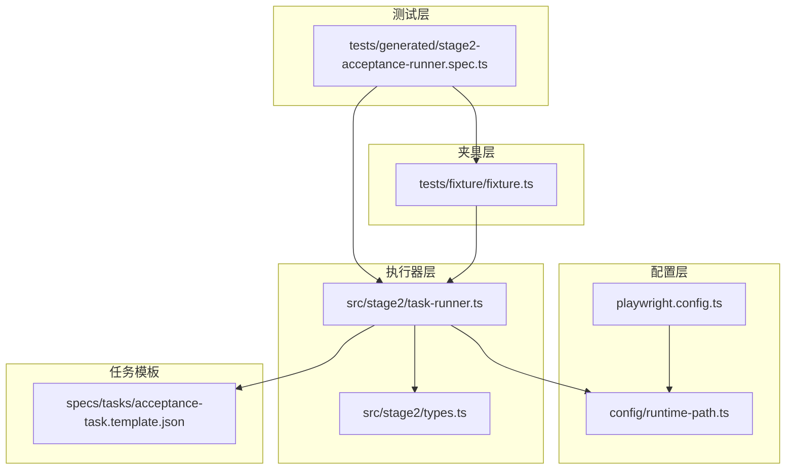
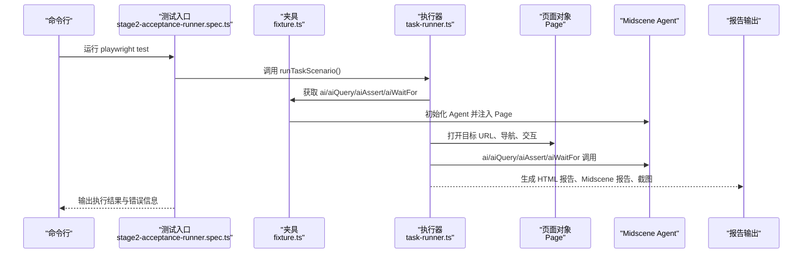
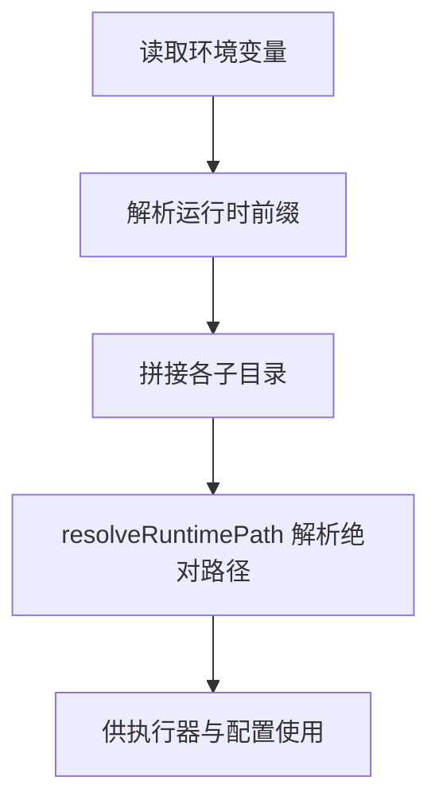
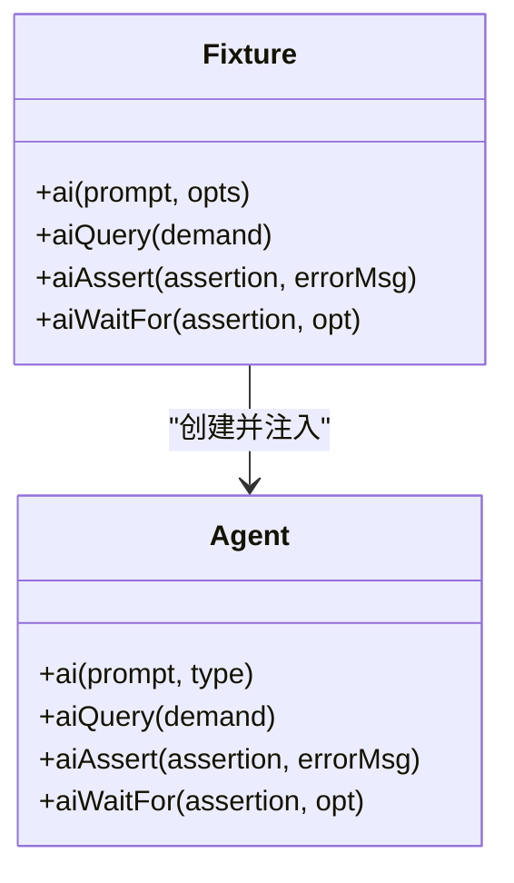
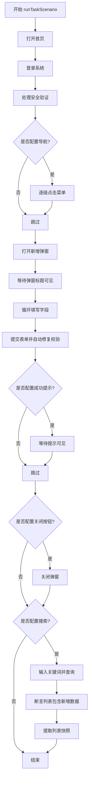
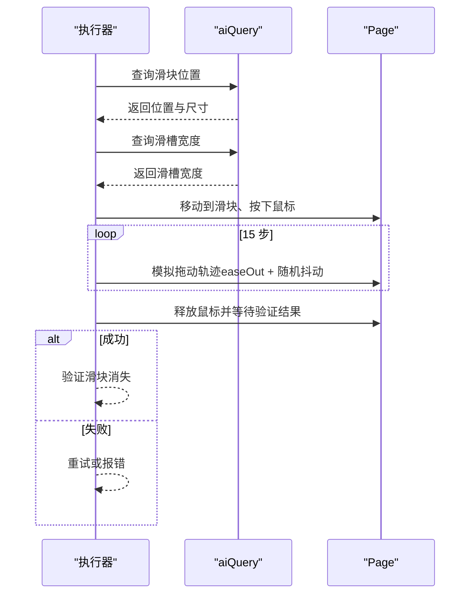
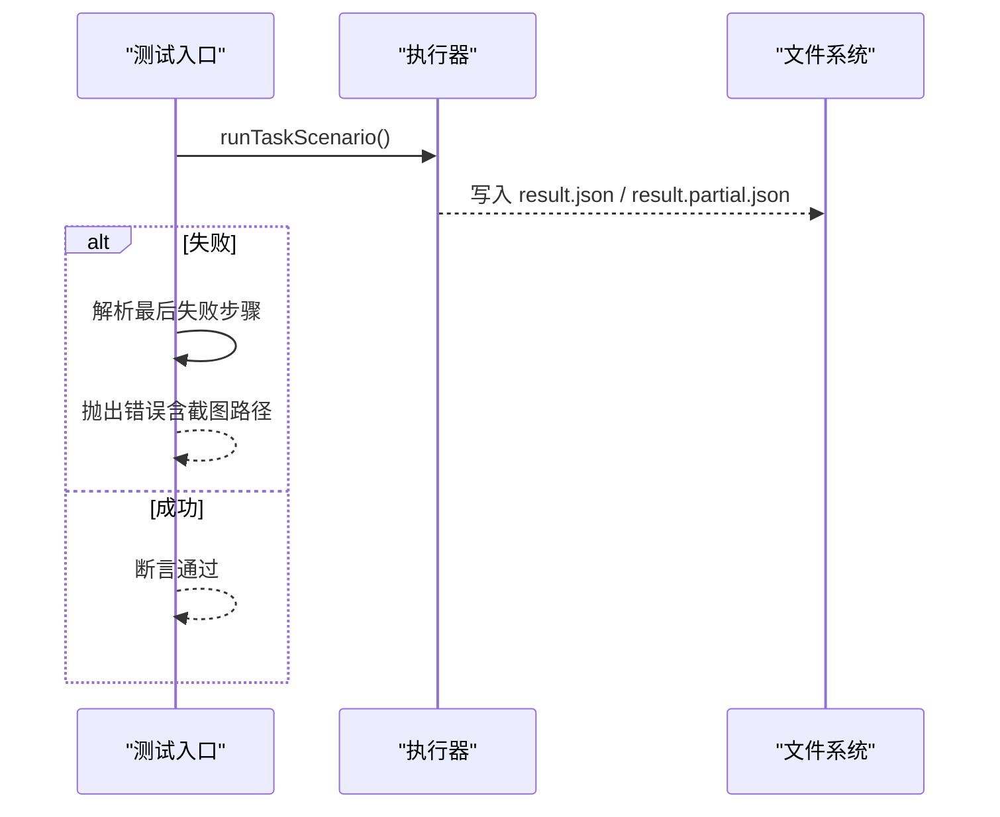
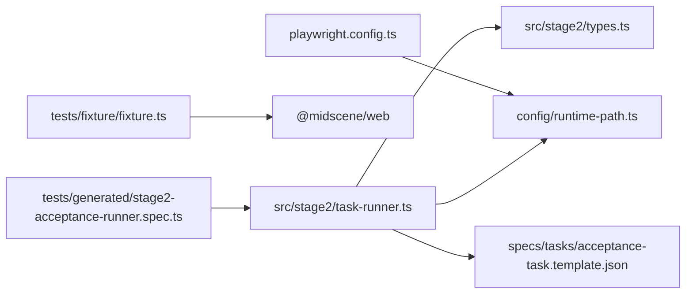

# 调试工具使用

<cite>
**本文引用的文件**
- [README.md](file://README.md)
- [playwright.config.ts](file://playwright.config.ts)
- [package.json](file://package.json)
- [config/runtime-path.ts](file://config/runtime-path.ts)
- [tests/fixture/fixture.ts](file://tests/fixture/fixture.ts)
- [tests/generated/stage2-acceptance-runner.spec.ts](file://tests/generated/stage2-acceptance-runner.spec.ts)
- [src/stage2/task-runner.ts](file://src/stage2/task-runner.ts)
- [src/stage2/types.ts](file://src/stage2/types.ts)
- [specs/tasks/acceptance-task.template.json](file://specs/tasks/acceptance-task.template.json)
</cite>

## 目录
1. [简介](#简介)
2. [项目结构](#项目结构)
3. [核心组件](#核心组件)
4. [架构总览](#架构总览)
5. [详细组件分析](#详细组件分析)
6. [依赖关系分析](#依赖关系分析)
7. [性能考虑](#性能考虑)
8. [故障排查指南](#故障排查指南)
9. [结论](#结论)
10. [附录](#附录)

## 简介
本指南面向使用 Playwright DevTools 与 Midscene 的开发者，围绕以下主题提供系统化的调试实践：
- 元素检查、网络监控、控制台调试
- 日志分析与过滤（执行日志、错误堆栈、性能指标）
- 断点调试与条件断点（页面交互断点、AI 调用断点、表单处理断点）
- 结果文件分析（HTML 报告、截图对比、结构化结果验证）
- 命令行调试与自动化脚本编写

本项目基于 Playwright 与 Midscene.js，支持通过 JSON 任务驱动的第二段执行器，并内置丰富的运行时产物目录与报告输出，便于定位问题与复盘。

## 项目结构
项目采用“配置-夹具-执行器-测试”的分层组织，关键目录与文件如下：
- 配置层：Playwright 配置、运行时路径解析
- 夹具层：Midscene + Playwright 的 AI 能力注入
- 执行器层：第二段任务执行器与断点/截图/断言逻辑
- 测试层：端到端入口与结果校验
- 任务模板：结构化任务 JSON，用于驱动执行器

图表来源
- [playwright.config.ts](file://playwright.config.ts#L1-L95)
- [config/runtime-path.ts](file://config/runtime-path.ts#L1-L41)
- [tests/fixture/fixture.ts](file://tests/fixture/fixture.ts#L1-L100)
- [tests/generated/stage2-acceptance-runner.spec.ts](file://tests/generated/stage2-acceptance-runner.spec.ts#L1-L39)
- [src/stage2/task-runner.ts](file://src/stage2/task-runner.ts#L1-L1344)
- [src/stage2/types.ts](file://src/stage2/types.ts#L1-L125)
- [specs/tasks/acceptance-task.template.json](file://specs/tasks/acceptance-task.template.json#L1-L85)

章节来源
- [README.md](file://README.md#L1-L144)
- [playwright.config.ts](file://playwright.config.ts#L1-L95)
- [config/runtime-path.ts](file://config/runtime-path.ts#L1-L41)
- [tests/fixture/fixture.ts](file://tests/fixture/fixture.ts#L1-L100)
- [tests/generated/stage2-acceptance-runner.spec.ts](file://tests/generated/stage2-acceptance-runner.spec.ts#L1-L39)
- [src/stage2/task-runner.ts](file://src/stage2/task-runner.ts#L1-L1344)
- [src/stage2/types.ts](file://src/stage2/types.ts#L1-L125)
- [specs/tasks/acceptance-task.template.json](file://specs/tasks/acceptance-task.template.json#L1-L85)

## 核心组件
- 运行时路径管理：集中解析环境变量并生成统一的运行产物目录，便于调试时快速定位报告与截图。
- 夹具注入：将 Midscene 的 AI 能力（ai、aiQuery、aiAssert、aiWaitFor）注入到测试上下文，支持自然语言驱动的交互与断言。
- 任务执行器：按步骤执行任务，内置截图、断点、断言与重试机制，生成结构化结果与部分进度文件。
- 测试入口：调用执行器并根据结果抛出错误，便于 Playwright 报告与 HTML 报告展示。

章节来源
- [config/runtime-path.ts](file://config/runtime-path.ts#L1-L41)
- [tests/fixture/fixture.ts](file://tests/fixture/fixture.ts#L1-L100)
- [src/stage2/task-runner.ts](file://src/stage2/task-runner.ts#L1062-L1344)
- [tests/generated/stage2-acceptance-runner.spec.ts](file://tests/generated/stage2-acceptance-runner.spec.ts#L1-L39)

## 架构总览
下图展示了从测试入口到执行器再到 Midscene AI 的调用链路，以及 Playwright 报告与 Midscene 报告的生成路径。

图表来源
- [tests/generated/stage2-acceptance-runner.spec.ts](file://tests/generated/stage2-acceptance-runner.spec.ts#L1-L39)
- [tests/fixture/fixture.ts](file://tests/fixture/fixture.ts#L1-L100)
- [src/stage2/task-runner.ts](file://src/stage2/task-runner.ts#L1062-L1344)
- [playwright.config.ts](file://playwright.config.ts#L36-L40)

章节来源
- [README.md](file://README.md#L106-L131)
- [playwright.config.ts](file://playwright.config.ts#L36-L40)

## 详细组件分析

### 组件一：运行时路径与报告目录
- 运行时目录由环境变量统一管理，包括 Playwright 输出目录、HTML 报告目录、Midscene 运行目录、第二段结果目录等。
- 通过统一前缀与解析函数，保证不同平台与 CI 环境下的稳定性。

图表来源
- [config/runtime-path.ts](file://config/runtime-path.ts#L1-L41)

章节来源
- [README.md](file://README.md#L74-L91)
- [config/runtime-path.ts](file://config/runtime-path.ts#L1-L41)

### 组件二：夹具注入与 AI 能力
- 夹具将 Midscene Agent 注入到测试上下文，提供 ai、aiQuery、aiAssert、aiWaitFor 四类能力。
- 支持生成报告与缓存 ID 清洗，避免非法字符影响日志与报告存储。

图表来源
- [tests/fixture/fixture.ts](file://tests/fixture/fixture.ts#L23-L99)

章节来源
- [tests/fixture/fixture.ts](file://tests/fixture/fixture.ts#L1-L100)

### 组件三：任务执行器与断点/截图/断言
- 执行器按步骤运行，每个步骤记录开始/结束时间、状态、截图路径、错误消息与堆栈。
- 支持截图开关、步骤截图、失败截图、部分进度文件与最终结果文件。
- 内置滑块验证码处理、表单填充、菜单点击、断言等常用场景。

图表来源
- [src/stage2/task-runner.ts](file://src/stage2/task-runner.ts#L1157-L1344)

章节来源
- [src/stage2/task-runner.ts](file://src/stage2/task-runner.ts#L1062-L1344)
- [src/stage2/types.ts](file://src/stage2/types.ts#L100-L125)

### 组件四：滑块验证码自动处理（AI + Playwright）
- 通过 aiQuery 识别滑块位置与滑槽宽度，模拟真人拖动轨迹（先快后慢、带抖动），并重试多次。
- 支持三种模式：自动、人工、失败、忽略，可通过环境变量配置。

图表来源
- [src/stage2/task-runner.ts](file://src/stage2/task-runner.ts#L558-L703)

章节来源
- [README.md](file://README.md#L54-L72)
- [src/stage2/task-runner.ts](file://src/stage2/task-runner.ts#L558-L703)

### 组件五：测试入口与结果校验
- 测试入口调用执行器并收集结果，若失败则提取最后失败步骤的截图路径与消息，便于快速定位问题。
- Playwright 配置启用 HTML 报告与 Midscene 报告，便于可视化分析。

图表来源
- [tests/generated/stage2-acceptance-runner.spec.ts](file://tests/generated/stage2-acceptance-runner.spec.ts#L1-L39)
- [src/stage2/task-runner.ts](file://src/stage2/task-runner.ts#L1321-L1344)

章节来源
- [tests/generated/stage2-acceptance-runner.spec.ts](file://tests/generated/stage2-acceptance-runner.spec.ts#L1-L39)
- [playwright.config.ts](file://playwright.config.ts#L36-L40)

## 依赖关系分析
- 配置依赖：playwright.config.ts 依赖 config/runtime-path.ts 解析运行时目录；同时配置 HTML 报告与 Midscene 报告。
- 夹具依赖：tests/fixture/fixture.ts 依赖 @midscene/web 的 Agent 与 Page 封装。
- 执行器依赖：src/stage2/task-runner.ts 依赖 types.ts 的数据模型、config/runtime-path.ts 的路径解析、以及任务模板 JSON。
- 测试入口依赖：tests/generated/stage2-acceptance-runner.spec.ts 依赖夹具与执行器。

图表来源
- [playwright.config.ts](file://playwright.config.ts#L1-L95)
- [config/runtime-path.ts](file://config/runtime-path.ts#L1-L41)
- [tests/fixture/fixture.ts](file://tests/fixture/fixture.ts#L1-L100)
- [tests/generated/stage2-acceptance-runner.spec.ts](file://tests/generated/stage2-acceptance-runner.spec.ts#L1-L39)
- [src/stage2/task-runner.ts](file://src/stage2/task-runner.ts#L1-L1344)
- [src/stage2/types.ts](file://src/stage2/types.ts#L1-L125)
- [specs/tasks/acceptance-task.template.json](file://specs/tasks/acceptance-task.template.json#L1-L85)

章节来源
- [playwright.config.ts](file://playwright.config.ts#L1-L95)
- [tests/fixture/fixture.ts](file://tests/fixture/fixture.ts#L1-L100)
- [tests/generated/stage2-acceptance-runner.spec.ts](file://tests/generated/stage2-acceptance-runner.spec.ts#L1-L39)
- [src/stage2/task-runner.ts](file://src/stage2/task-runner.ts#L1-L1344)
- [src/stage2/types.ts](file://src/stage2/types.ts#L1-L125)
- [specs/tasks/acceptance-task.template.json](file://specs/tasks/acceptance-task.template.json#L1-L85)

## 性能考虑
- 超时与重试：执行器按步骤记录耗时，支持 step/page 超时配置；滑块自动处理最多重试若干次。
- 截图策略：可按步骤截图，便于快速定位问题；但过多截图会影响性能，建议在调试阶段开启。
- 等待策略：优先使用 aiWaitFor 或显式等待，减少轮询带来的资源消耗。
- 报告生成：HTML 报告与 Midscene 报告会占用磁盘空间，建议在 CI 中按需开启或清理旧产物。

章节来源
- [src/stage2/task-runner.ts](file://src/stage2/task-runner.ts#L1110-L1155)
- [README.md](file://README.md#L74-L91)

## 故障排查指南

### 1. 元素检查与网络监控
- 使用浏览器 DevTools 的 Elements 面板检查元素属性、层级与可见性，结合 Playwright 的定位策略（role、text、placeholder）进行匹配。
- 在 Playwright DevTools 中启用网络面板，观察请求/响应、状态码与耗时，定位接口异常或加载缓慢问题。
- 控制台调试：在关键步骤插入等待或打印，观察页面状态变化；必要时使用 evaluate 获取 DOM 信息。

章节来源
- [playwright.config.ts](file://playwright.config.ts#L46-L48)

### 2. 日志分析与过滤
- 执行日志：执行器在每个步骤记录开始/结束时间、状态、截图路径与错误信息；失败时写入错误堆栈，便于回溯。
- 错误堆栈：测试入口会提取最后失败步骤的消息与截图路径，结合 HTML 报告定位问题。
- 性能指标：通过步骤耗时与截图数量评估性能瓶颈；必要时减少截图或优化等待策略。

章节来源
- [src/stage2/task-runner.ts](file://src/stage2/task-runner.ts#L1110-L1155)
- [tests/generated/stage2-acceptance-runner.spec.ts](file://tests/generated/stage2-acceptance-runner.spec.ts#L27-L36)

### 3. 断点调试与条件断点
- 页面交互断点：在导航、菜单点击、表单填写等关键步骤设置断点，观察页面状态变化与元素可见性。
- AI 调用断点：在 ai/aiQuery/aiAssert/aiWaitFor 调用前后设置断点，检查提示词与返回结果是否符合预期。
- 表单处理断点：在提交表单前设置断点，检查校验提示与字段值映射；若出现弹窗未关闭，可在自动修复循环中逐步断点定位。

章节来源
- [src/stage2/task-runner.ts](file://src/stage2/task-runner.ts#L1157-L1344)

### 4. 结果文件分析
- HTML 报告：位于运行时目录下的 HTML 报告目录，包含视频、截图、日志与步骤详情。
- Midscene 报告：位于 Midscene 运行目录，包含 AI 交互与断言的详细记录。
- 结构化结果：执行器生成 result.json 与 result.partial.json，包含任务元信息、步骤列表、截图路径与查询快照。
- 截图对比：在步骤截图目录中对比失败截图与成功截图，快速定位差异。

章节来源
- [README.md](file://README.md#L112-L131)
- [config/runtime-path.ts](file://config/runtime-path.ts#L18-L36)
- [src/stage2/task-runner.ts](file://src/stage2/task-runner.ts#L1086-L1106)

### 5. 命令行调试与自动化脚本
- 运行命令：使用 npm scripts 启动带界面的执行器，便于观察页面行为与截图。
- 报告查看：执行完成后在运行时目录中查看 HTML 报告与 Midscene 报告。
- 自动化脚本：可编写脚本读取 result.json，解析失败步骤与截图路径，自动打开报告或截图进行对比分析。

章节来源
- [package.json](file://package.json#L6-L9)
- [README.md](file://README.md#L106-L131)

## 结论
本项目通过统一的运行时路径、夹具注入的 AI 能力与结构化的任务执行器，提供了完善的调试与分析能力。结合 Playwright DevTools 的元素检查、网络监控与控制台调试，以及 HTML/Midscene 报告与结构化结果文件，开发者可以高效定位问题、优化性能并建立稳定的自动化调试工作流。

## 附录

### A. 关键环境变量与用途
- RUNTIME_DIR_PREFIX：运行时目录前缀
- PLAYWRIGHT_OUTPUT_DIR：Playwright 执行产物目录
- PLAYWRIGHT_HTML_REPORT_DIR：Playwright HTML 报告目录
- MIDSCENE_RUN_DIR：Midscene 运行日志、缓存、报告根目录
- ACCEPTANCE_RESULT_DIR：第二段结构化结果目录
- STAGE2_TASK_FILE：默认任务 JSON 文件路径
- STAGE2_REQUIRE_APPROVAL：是否要求人工审批
- STAGE2_CAPTCHA_MODE：滑块验证码处理模式（auto/manual/fail/ignore）
- STAGE2_CAPTCHA_WAIT_TIMEOUT_MS：人工处理等待时长（毫秒）

章节来源
- [README.md](file://README.md#L39-L51)
- [config/runtime-path.ts](file://config/runtime-path.ts#L13-L36)

### B. 任务 JSON 字段说明（节选）
- taskId/taskName：任务标识与名称
- target.url：目标地址
- account.username/password：账号信息
- navigation.menuPath/menuHints：菜单路径与提示
- form.openButtonText/dialogTitle/submitButtonText/closeButtonText/successText：弹窗与提交相关文案
- form.fields：字段列表（label、componentType、value、hints）
- search.inputLabel/keywordFromField/triggerButtonText/resultTableTitle/expectedColumns：搜索相关字段
- assertions：断言列表（type、expectedText、matchField、expectedColumns 等）
- runtime.stepTimeoutMs/pageTimeoutMs/screenshotOnStep/trace：运行时参数

章节来源
- [specs/tasks/acceptance-task.template.json](file://specs/tasks/acceptance-task.template.json#L1-L85)
- [src/stage2/types.ts](file://src/stage2/types.ts#L86-L98)