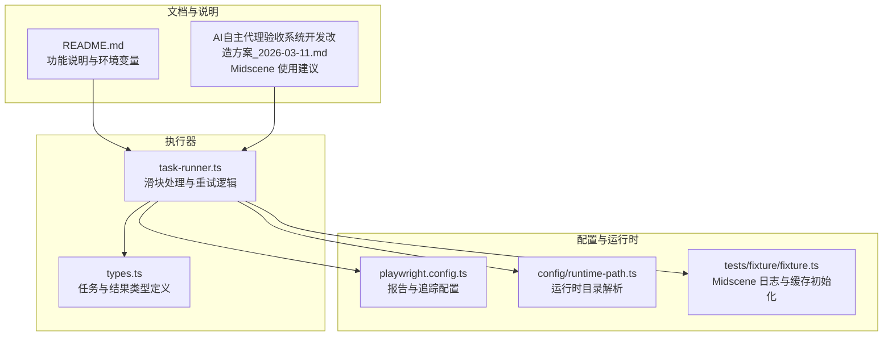
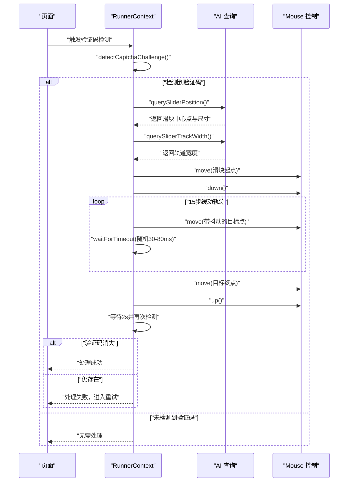
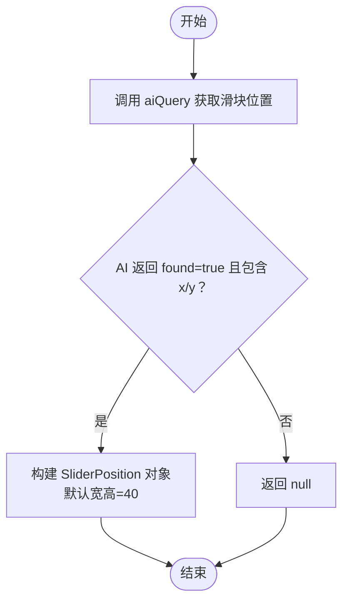
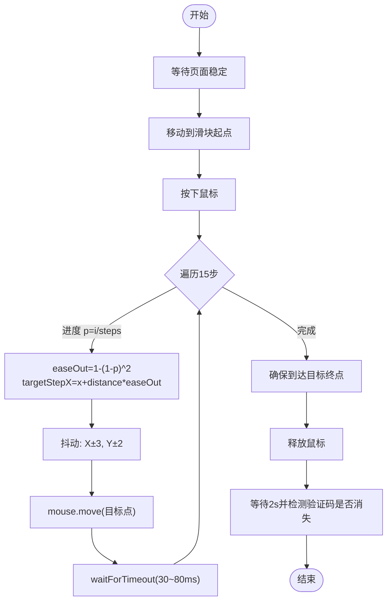
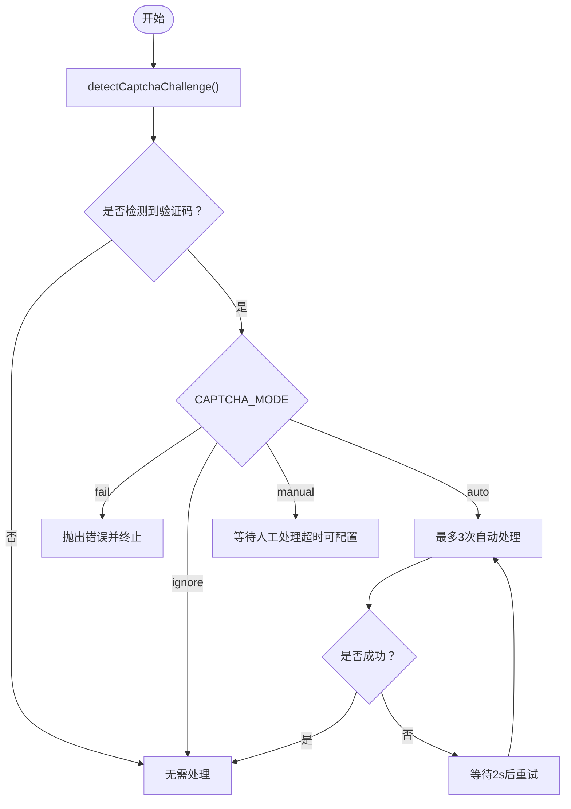
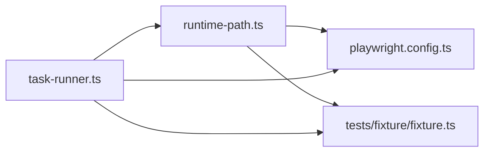

# 自动解码问题

<cite>
**本文引用的文件**
- [README.md](file://README.md)
- [src/stage2/task-runner.ts](file://src/stage2/task-runner.ts)
- [src/stage2/types.ts](file://src/stage2/types.ts)
- [playwright.config.ts](file://playwright.config.ts)
- [config/runtime-path.ts](file://config/runtime-path.ts)
- [tests/fixture/fixture.ts](file://tests/fixture/fixture.ts)
- [.tasks/AI自主代理验收系统开发改造方案_2026-03-11.md](file://.tasks/AI自主代理验收系统开发改造方案_2026-03-11.md)
</cite>

## 目录
1. [简介](#简介)
2. [项目结构](#项目结构)
3. [核心组件](#核心组件)
4. [架构总览](#架构总览)
5. [详细组件分析](#详细组件分析)
6. [依赖关系分析](#依赖关系分析)
7. [性能考量](#性能考量)
8. [故障排除指南](#故障排除指南)
9. [结论](#结论)
10. [附录](#附录)

## 简介
本指南聚焦于滑块验证码自动解码问题，围绕 autoSolveSliderCaptcha 函数的实现原理与常见失败原因进行系统性排查，并给出针对 AI 识别与轨迹模拟的优化建议及调试工具使用方法。读者将学会如何通过日志、截图、报告与重试策略定位问题，提升自动化稳定性。

## 项目结构
该项目基于 Playwright 与 Midscene.js 构建，提供第二段任务执行器与滑块验证码自动处理能力。关键模块包括：
- 任务执行器：负责加载任务、执行步骤、生成结果与报告
- 滑块验证码处理：通过 AI 查询滑块位置与轨道宽度，模拟真人拖动轨迹
- 运行时路径与报告：统一管理 t_runtime 目录下的产物输出
- 配置与环境变量：支持多种 CAPTCHA 处理模式与超时控制

图表来源
- [src/stage2/task-runner.ts](file://src/stage2/task-runner.ts#L1-L200)
- [playwright.config.ts](file://playwright.config.ts#L1-L95)
- [config/runtime-path.ts](file://config/runtime-path.ts#L1-L41)
- [tests/fixture/fixture.ts](file://tests/fixture/fixture.ts#L1-L21)
- [README.md](file://README.md#L1-L144)
- [.tasks/AI自主代理验收系统开发改造方案_2026-03-11.md](file://.tasks/AI自主代理验收系统开发改造方案_2026-03-11.md#L40-L129)

章节来源
- [README.md](file://README.md#L1-L144)
- [src/stage2/task-runner.ts](file://src/stage2/task-runner.ts#L1-L200)
- [playwright.config.ts](file://playwright.config.ts#L1-L95)
- [config/runtime-path.ts](file://config/runtime-path.ts#L1-L41)
- [tests/fixture/fixture.ts](file://tests/fixture/fixture.ts#L1-L21)
- [.tasks/AI自主代理验收系统开发改造方案_2026-03-11.md](file://.tasks/AI自主代理验收系统开发改造方案_2026-03-11.md#L40-L129)

## 核心组件
- 滑块检测与处理入口：detectCaptchaChallenge 与 handleCaptchaChallengeIfNeeded
- AI 识别：querySliderPosition、querySliderTrackWidth
- 自动解码：autoSolveSliderCaptcha
- CAPTCHA 模式与超时：resolveCaptchaMode、resolveCaptchaWaitTimeoutMs
- 类型与结果：AcceptanceTask、Stage2ExecutionResult 等

章节来源
- [src/stage2/task-runner.ts](file://src/stage2/task-runner.ts#L32-L84)
- [src/stage2/task-runner.ts](file://src/stage2/task-runner.ts#L480-L498)
- [src/stage2/task-runner.ts](file://src/stage2/task-runner.ts#L507-L556)
- [src/stage2/task-runner.ts](file://src/stage2/task-runner.ts#L558-L645)
- [src/stage2/task-runner.ts](file://src/stage2/task-runner.ts#L647-L683)
- [src/stage2/types.ts](file://src/stage2/types.ts#L86-L125)

## 架构总览
滑块验证码自动处理的整体流程如下：
- 检测页面是否存在验证码挑战
- 若存在且模式为自动，则通过 AI 查询滑块位置与轨道宽度
- 计算目标位置并模拟真人拖动轨迹（含缓动与抖动）
- 等待验证结果，若失败则重试，直至成功或达到最大重试次数

图表来源
- [src/stage2/task-runner.ts](file://src/stage2/task-runner.ts#L480-L498)
- [src/stage2/task-runner.ts](file://src/stage2/task-runner.ts#L507-L556)
- [src/stage2/task-runner.ts](file://src/stage2/task-runner.ts#L558-L645)

## 详细组件分析

### 组件一：滑块位置与轨道宽度查询（AI 识别）
- querySliderPosition：通过 aiQuery 请求 AI 返回滑块中心点坐标与尺寸；若未返回有效值则忽略错误并返回空
- querySliderTrackWidth：通过 aiQuery 请求 AI 返回滑槽总宽度；若未返回有效值则忽略错误并返回空
- 两者均对 AI 异常进行容错处理，避免因单次识别失败导致整体流程中断

图表来源
- [src/stage2/task-runner.ts](file://src/stage2/task-runner.ts#L507-L535)

章节来源
- [src/stage2/task-runner.ts](file://src/stage2/task-runner.ts#L507-L535)

### 组件二：拖动轨迹模拟（缓动与抖动）
- 目标位置计算：若能获取轨道宽度，则目标为“滑块起点 + 轨道宽度 - 固定偏移”；否则使用固定偏移估算
- 步数与缓动：15 步，使用 easeOut 缓动函数，先快后慢
- 随机抖动：每步添加 X 方向 ±3 像素、Y 方向 ±2 像素的随机抖动
- 时间间隔：每步随机等待 30–80ms，确保轨迹自然
- 收尾：确保最终到达目标点并释放鼠标

图表来源
- [src/stage2/task-runner.ts](file://src/stage2/task-runner.ts#L558-L645)

章节来源
- [src/stage2/task-runner.ts](file://src/stage2/task-runner.ts#L558-L645)

### 组件三：验证码检测与重试
- detectCaptchaChallenge：通过文本与选择器两种方式检测页面是否仍存在验证码
- handleCaptchaChallengeIfNeeded：根据 CAPTCHA_MODE 决策行为；自动模式下最多重试 3 次，每次失败后等待 2 秒

图表来源
- [src/stage2/task-runner.ts](file://src/stage2/task-runner.ts#L480-L498)
- [src/stage2/task-runner.ts](file://src/stage2/task-runner.ts#L647-L683)

章节来源
- [src/stage2/task-runner.ts](file://src/stage2/task-runner.ts#L480-L498)
- [src/stage2/task-runner.ts](file://src/stage2/task-runner.ts#L647-L683)

## 依赖关系分析
- 运行时目录：通过 config/runtime-path.ts 解析 t_runtime 子目录，供 Playwright 与 Midscene 使用
- 报告与追踪：playwright.config.ts 配置 HTML 报告与 Midscene 报告插件，trace 在首次重试时开启
- Midscene 初始化：tests/fixture/fixture.ts 设置日志目录，保证 AI 运行日志与缓存可被收集

图表来源
- [config/runtime-path.ts](file://config/runtime-path.ts#L1-L41)
- [playwright.config.ts](file://playwright.config.ts#L1-L95)
- [tests/fixture/fixture.ts](file://tests/fixture/fixture.ts#L1-L21)
- [src/stage2/task-runner.ts](file://src/stage2/task-runner.ts#L1-L200)

章节来源
- [config/runtime-path.ts](file://config/runtime-path.ts#L1-L41)
- [playwright.config.ts](file://playwright.config.ts#L1-L95)
- [tests/fixture/fixture.ts](file://tests/fixture/fixture.ts#L1-L21)
- [src/stage2/task-runner.ts](file://src/stage2/task-runner.ts#L1-L200)

## 性能考量
- 拖动步数与缓动：15 步缓动 + 随机抖动在大多数场景下已足够自然；如页面响应较慢，可适当增加步数或延长每步等待时间
- 随机抖动幅度：X±3、Y±2 已能较好模拟人类手部微小抖动；若检测阈值较高，可适度增大抖动范围
- 等待策略：页面稳定等待、鼠标按下/释放等待、最终验证等待均有固定值；可根据目标站点加载特性调整
- 重试策略：自动模式最多 3 次，失败后等待 2 秒；若验证码频繁失败，可考虑降低重试次数以减少总耗时

[本节为通用指导，不直接分析具体文件]

## 故障排除指南

### 一、滑块位置查询失败
- 现象
  - querySliderPosition 返回空，autoSolveSliderCaptcha 提前退出
- 可能原因
  - 页面截图中滑块不清晰或遮挡
  - AI 模型未识别到滑块中心点与尺寸
  - 页面动态加载导致时机过早
- 排查步骤
  - 检查 Midscene 报告与截图，确认滑块可见性与对比度
  - 调整 CAPTCHA 检测文本与选择器，确保 detectCaptchaChallenge 能正确识别验证码出现
  - 增加页面稳定等待时间，或在调用 AI 前手动等待关键元素出现
- 优化建议
  - 提升图像质量：确保页面缩放、分辨率一致；避免模糊与反色
  - 调整 AI Prompt：更明确地要求返回中心点与尺寸
  - 降级策略：若无法获取尺寸，使用默认尺寸（当前代码已提供默认值）

章节来源
- [src/stage2/task-runner.ts](file://src/stage2/task-runner.ts#L507-L535)
- [src/stage2/task-runner.ts](file://src/stage2/task-runner.ts#L480-L498)

### 二、轨道宽度查询失败
- 现象
  - querySliderTrackWidth 返回空，autoSolveSliderCaptcha 使用固定偏移估算目标位置
- 可能原因
  - 页面布局变化导致轨道宽度不可见或被遮挡
  - AI 无法识别轨道宽度
- 排查步骤
  - 查看 Midscene 报告与截图，确认轨道可见性
  - 尝试在 AI Prompt 中强调“返回轨道总宽度（像素）”
- 优化建议
  - 保留固定偏移作为兜底策略（当前代码已实现）
  - 若轨道宽度始终不可用，考虑改为固定步长或基于滑块宽度的比例估算

章节来源
- [src/stage2/task-runner.ts](file://src/stage2/task-runner.ts#L537-L556)
- [src/stage2/task-runner.ts](file://src/stage2/task-runner.ts#L569-L570)

### 三、拖动轨迹计算错误
- 现象
  - 拖动未到达目标点，或轨迹过于生硬
- 可能原因
  - 缓动函数参数不当（如阶数过高导致起步过慢）
  - 随机抖动过大导致偏离目标
  - 步间等待时间过短导致检测敏感
- 排查步骤
  - 检查日志输出的“目标位置”与“当前步进”，确认轨迹是否按预期
  - 使用 Playwright HTML 报告与 Midscene 报告中的截图，观察鼠标移动路径
- 优化建议
  - 调整缓动函数：当前使用 easeOut，若需要更平滑，可尝试更高阶的缓动
  - 调整抖动幅度：X±3、Y±2 已较温和；若检测阈值高，可适度增大
  - 调整步间等待：在 30–80ms 区间内根据站点响应速度微调

章节来源
- [src/stage2/task-runner.ts](file://src/stage2/task-runner.ts#L589-L610)

### 四、鼠标移动模拟不准确
- 现象
  - 拖动过程中鼠标位置与预期不符，或中途卡顿
- 可能原因
  - 页面缩放或分辨率变化导致坐标系偏差
  - 拖动过程中页面元素发生位移
- 排查步骤
  - 确认浏览器窗口大小与缩放比例一致
  - 在拖动前与拖动中分别截图，比对元素相对位置
- 优化建议
  - 固定浏览器窗口尺寸与缩放比例
  - 在拖动前执行一次“移动到起点并等待”以同步坐标

章节来源
- [src/stage2/task-runner.ts](file://src/stage2/task-runner.ts#L581-L583)

### 五、验证码未消失或反复出现
- 现象
  - 拖动完成后仍检测到验证码
- 可能原因
  - 轨道宽度估算不准导致目标点偏移
  - 缓动与抖动导致最终未完全到位
  - 页面加载或动画影响验证结果
- 排查步骤
  - 检查“等待并再次检测”的逻辑是否生效
  - 查看 Midscene 报告中的最终截图，确认滑块是否真正到达终点
- 优化建议
  - 确保最终一步精确到达目标点
  - 增加最终等待时间，确保验证完成
  - 适当提高重试次数或缩短重试间隔

章节来源
- [src/stage2/task-runner.ts](file://src/stage2/task-runner.ts#L622-L624)
- [src/stage2/task-runner.ts](file://src/stage2/task-runner.ts#L667-L679)

### 六、AI 模型与图像质量优化
- 图像质量
  - 保持页面缩放与分辨率一致，避免模糊
  - 确保滑块与轨道在截图中清晰可见
- Prompt 设计
  - 明确要求返回“中心点坐标（x,y）”与“尺寸（width,height）”
  - 对轨道宽度明确要求“总宽度（像素）”
- Midscene 使用建议
  - 参考官方文档与项目内的使用建议，合理拆分步骤、增强等待与兜底策略
  - 结合截图、日志与 trace 进行问题定位

章节来源
- [README.md](file://README.md#L31-L52)
- [.tasks/AI自主代理验收系统开发改造方案_2026-03-11.md](file://.tasks/AI自主代理验收系统开发改造方案_2026-03-11.md#L40-L129)

### 七、拖动过程监控与调试工具
- 日志与截图
  - 查看 t_runtime/acceptance-results 下的步骤截图与 partial 结果
  - 关注滑块自动处理日志中的“目标位置”“当前步进”等关键信息
- 报告与追踪
  - Playwright HTML 报告：查看测试执行与失败节点
  - Midscene 报告：查看 AI 查询与断言结果
  - trace：在首次重试时开启，便于复盘交互细节
- 重试策略
  - 自动模式最多 3 次，失败后等待 2 秒；可根据站点稳定性调整

章节来源
- [README.md](file://README.md#L74-L116)
- [playwright.config.ts](file://playwright.config.ts#L36-L48)
- [src/stage2/task-runner.ts](file://src/stage2/task-runner.ts#L667-L679)

## 结论
滑块验证码自动解码的关键在于：
- 稳健的 AI 识别（位置与轨道宽度）
- 合理的轨迹模拟（缓动、抖动、时间间隔）
- 完善的监控与重试机制

通过本指南提供的排查步骤与优化建议，可在多数场景下显著提升自动解码的成功率与稳定性。

[本节为总结性内容，不直接分析具体文件]

## 附录

### A. CAPTCHA 模式与超时配置
- 模式
  - auto：AI 自动处理滑块
  - manual：检测到验证码后等待人工处理
  - fail：检测到验证码即失败
  - ignore：忽略验证码检测
- 超时
  - manual 模式下的人工处理等待时长（毫秒）

章节来源
- [README.md](file://README.md#L54-L61)
- [src/stage2/task-runner.ts](file://src/stage2/task-runner.ts#L58-L84)

### B. 关键函数与数据结构
- detectCaptchaChallenge：检测验证码出现
- querySliderPosition / querySliderTrackWidth：AI 查询滑块位置与轨道宽度
- autoSolveSliderCaptcha：自动解码主流程
- handleCaptchaChallengeIfNeeded：根据模式处理验证码
- SliderPosition：滑块中心点与尺寸
- AcceptanceTask / Stage2ExecutionResult：任务与执行结果类型

章节来源
- [src/stage2/task-runner.ts](file://src/stage2/task-runner.ts#L480-L498)
- [src/stage2/task-runner.ts](file://src/stage2/task-runner.ts#L507-L556)
- [src/stage2/task-runner.ts](file://src/stage2/task-runner.ts#L558-L645)
- [src/stage2/task-runner.ts](file://src/stage2/task-runner.ts#L647-L683)
- [src/stage2/types.ts](file://src/stage2/types.ts#L500-L505)
- [src/stage2/types.ts](file://src/stage2/types.ts#L86-L125)