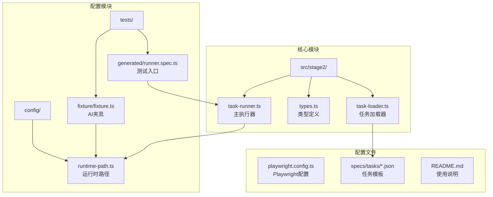
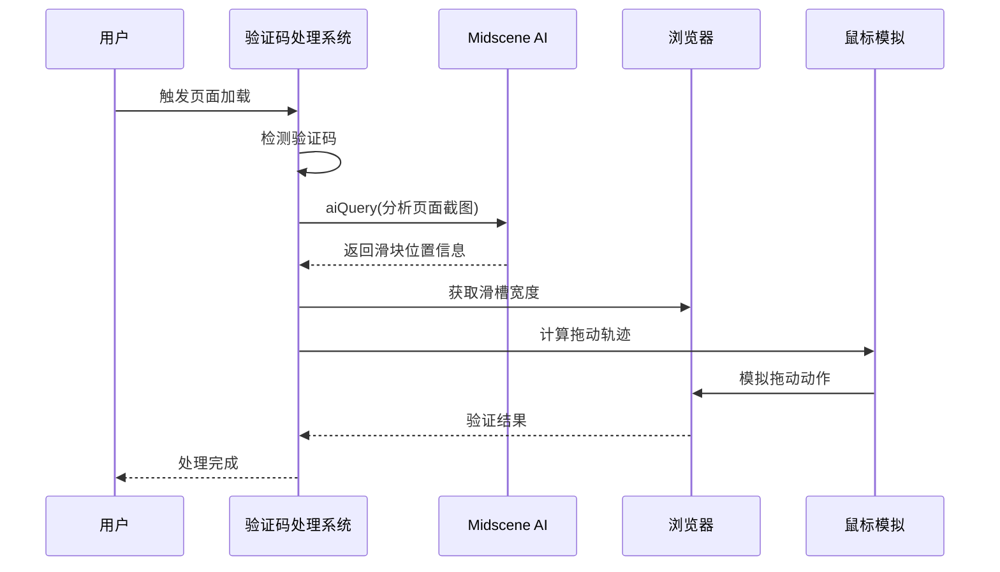
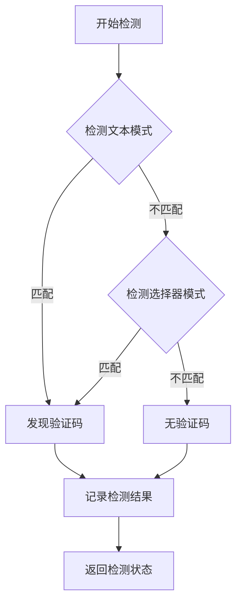
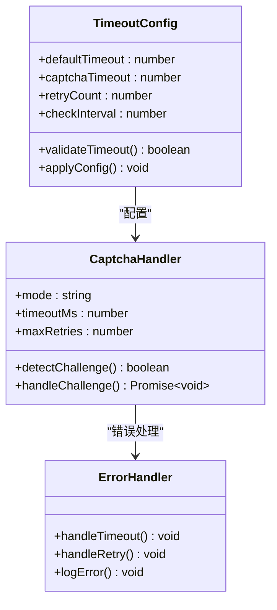
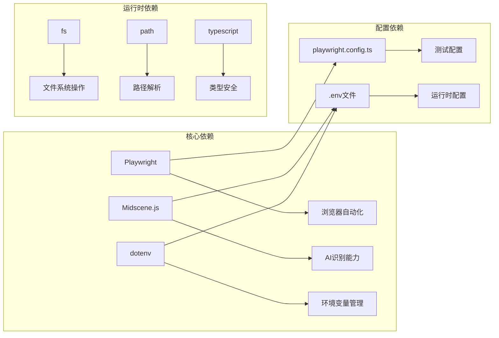
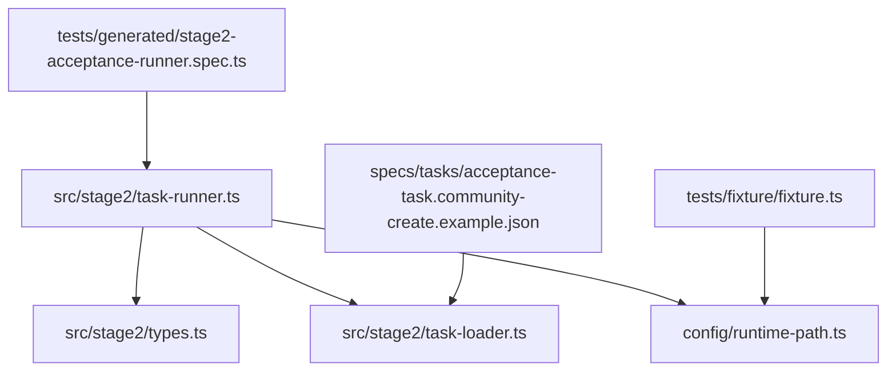

# 验证码处理问题

<cite>
**本文引用的文件**
- [README.md](file://README.md)
- [.plans/stage2登录安全验证人工兜底方案_2026-03-12.md](file://.plans/stage2登录安全验证人工兜底方案_2026-03-12.md)
- [src/stage2/task-runner.ts](file://src/stage2/task-runner.ts)
- [src/stage2/types.ts](file://src/stage2/types.ts)
- [src/stage2/task-loader.ts](file://src/stage2/task-loader.ts)
- [config/runtime-path.ts](file://config/runtime-path.ts)
- [tests/fixture/fixture.ts](file://tests/fixture/fixture.ts)
- [playwright.config.ts](file://playwright.config.ts)
- [tests/generated/stage2-acceptance-runner.spec.ts](file://tests/generated/stage2-acceptance-runner.spec.ts)
- [specs/tasks/acceptance-task.community-create.example.json](file://specs/tasks/acceptance-task.community-create.example.json)
</cite>

## 目录
1. [简介](#简介)
2. [项目结构](#项目结构)
3. [核心组件](#核心组件)
4. [架构概览](#架构概览)
5. [详细组件分析](#详细组件分析)
6. [依赖关系分析](#依赖关系分析)
7. [性能考虑](#性能考虑)
8. [故障排除指南](#故障排除指南)
9. [结论](#结论)
10. [附录](#附录)

## 简介

本指南专注于基于 Playwright 和 Midscene.js 的验证码处理问题专业故障排除。该系统实现了滑块验证码的 AI 自动识别和拖动模拟，包含完整的故障诊断、解决方案和优化策略。系统支持多种验证码类型处理模式，包括自动处理、人工等待、失败终止和忽略模式。

## 项目结构

该项目采用模块化架构设计，主要包含以下核心模块：



**图表来源**
- [src/stage2/task-runner.ts](file://src/stage2/task-runner.ts#L1-L1344)
- [config/runtime-path.ts](file://config/runtime-path.ts#L1-L41)
- [tests/fixture/fixture.ts](file://tests/fixture/fixture.ts#L1-L100)

**章节来源**
- [README.md](file://README.md#L1-L144)
- [src/stage2/task-runner.ts](file://src/stage2/task-runner.ts#L1-L1344)
- [config/runtime-path.ts](file://config/runtime-path.ts#L1-L41)

## 核心组件

### 验证码处理模式系统

系统提供了四种验证码处理模式，每种模式都有特定的适用场景：

| 模式 | 描述 | 适用场景 | 特点 |
|------|------|----------|------|
| auto | AI自动处理滑块验证码 | 生产环境自动化 | 最高效，但需要准确的AI识别 |
| manual | 人工等待处理 | 需要人工监督的场景 | 安全可靠，但效率较低 |
| fail | 检测到即失败 | 严格验证环境 | 防止自动化绕过 |
| ignore | 忽略验证码检测 | 特殊测试场景 | 不推荐使用 |

### AI识别与拖动模拟引擎

系统集成了 Midscene AI 引擎进行验证码识别，使用 Playwright 模拟真实用户拖动行为：



**图表来源**
- [src/stage2/task-runner.ts](file://src/stage2/task-runner.ts#L507-L645)
- [tests/fixture/fixture.ts](file://tests/fixture/fixture.ts#L57-L69)

**章节来源**
- [src/stage2/task-runner.ts](file://src/stage2/task-runner.ts#L32-L72)
- [README.md](file://README.md#L54-L72)

## 架构概览

系统采用分层架构设计，确保验证码处理的可靠性：

```mermaid
graph TB
subgraph "应用层"
A[Test Runner<br/>tests/generated/stage2-acceptance-runner.spec.ts]
B[AI夹具<br/>tests/fixture/fixture.ts]
end
subgraph "业务逻辑层"
C[任务执行器<br/>src/stage2/task-runner.ts]
D[任务加载器<br/>src/stage2/task-loader.ts]
E[类型定义<br/>src/stage2/types.ts]
end
subgraph "AI服务层"
F[Midscene AI引擎<br/>@midscene/web/playwright]
G[Playwright浏览器控制<br/>@playwright/test]
end
subgraph "配置管理层"
H[运行时路径<br/>config/runtime-path.ts]
I[Playwright配置<br/>playwright.config.ts]
J[环境变量<br/>.env文件]
end
A --> C
B --> C
C --> D
C --> E
C --> F
C --> G
H --> I
J --> C
```

**图表来源**
- [tests/generated/stage2-acceptance-runner.spec.ts](file://tests/generated/stage2-acceptance-runner.spec.ts#L1-L39)
- [tests/fixture/fixture.ts](file://tests/fixture/fixture.ts#L1-L100)
- [src/stage2/task-runner.ts](file://src/stage2/task-runner.ts#L1-L1344)
- [config/runtime-path.ts](file://config/runtime-path.ts#L1-L41)

## 详细组件分析

### 验证码检测与识别组件

#### 检测模式匹配

系统通过多种方式检测验证码挑战：



**图表来源**
- [src/stage2/task-runner.ts](file://src/stage2/task-runner.ts#L480-L498)

#### AI识别算法

系统使用 AI 查询接口获取验证码关键参数：

| 参数 | 获取方式 | 用途 |
|------|----------|------|
| 滑块位置 | aiQuery | 确定拖动起点 |
| 滑槽宽度 | aiQuery | 计算拖动距离 |
| 图像质量 | AI分析 | 评估识别准确性 |
| 边界信息 | AI分析 | 验证拖动范围 |

**章节来源**
- [src/stage2/task-runner.ts](file://src/stage2/task-runner.ts#L507-L556)

### 拖动轨迹模拟组件

#### 缓动函数算法

系统采用物理模拟的缓动函数来创建逼真的拖动轨迹：

```mermaid
flowchart TD
A[开始拖动] --> B[计算总距离]
B --> C[设置步数(15步)]
C --> D[初始化进度]
D --> E{进度 < 1?}
E --> |是| F[计算easeOut值]
F --> G[计算目标X坐标]
G --> H[添加随机抖动]
H --> I[移动鼠标]
I --> J[等待随机延迟]
J --> K[进度+1]
K --> E
E --> |否| L[到达终点]
L --> M[释放鼠标]
```

**图表来源**
- [src/stage2/task-runner.ts](file://src/stage2/task-runner.ts#L589-L610)

#### 轨迹点计算精度

拖动轨迹的计算精度直接影响验证码识别的成功率：

| 参数 | 数值 | 说明 |
|------|------|------|
| 步数 | 15步 | 平衡速度与精度 |
| 缓动函数 | easeOut | 模拟真实手速变化 |
| 抖动范围 | ±3像素 | 模拟人手微小抖动 |
| 延迟范围 | 30-80ms | 模拟真实操作间隔 |

**章节来源**
- [src/stage2/task-runner.ts](file://src/stage2/task-runner.ts#L589-L610)

### 超时处理与重试机制

#### 超时配置系统

系统提供了灵活的超时配置选项：



**图表来源**
- [src/stage2/task-runner.ts](file://src/stage2/task-runner.ts#L74-L84)
- [src/stage2/task-runner.ts](file://src/stage2/task-runner.ts#L647-L703)

**章节来源**
- [src/stage2/task-runner.ts](file://src/stage2/task-runner.ts#L74-L84)
- [src/stage2/task-runner.ts](file://src/stage2/task-runner.ts#L647-L703)

## 依赖关系分析

### 外部依赖关系

系统依赖的关键外部组件：



**图表来源**
- [playwright.config.ts](file://playwright.config.ts#L1-L95)
- [tests/fixture/fixture.ts](file://tests/fixture/fixture.ts#L1-L100)

### 内部模块依赖



**图表来源**
- [src/stage2/task-runner.ts](file://src/stage2/task-runner.ts#L1-L1344)
- [src/stage2/types.ts](file://src/stage2/types.ts#L1-L125)
- [src/stage2/task-loader.ts](file://src/stage2/task-loader.ts#L1-L91)

**章节来源**
- [src/stage2/task-runner.ts](file://src/stage2/task-runner.ts#L1-L1344)
- [src/stage2/types.ts](file://src/stage2/types.ts#L1-L125)
- [src/stage2/task-loader.ts](file://src/stage2/task-loader.ts#L1-L91)

## 性能考虑

### AI识别性能优化

系统在保证准确性的同时优化了识别性能：

- **缓存机制**：利用 Midscene 的缓存系统减少重复识别开销
- **智能重试**：失败时自动重试，避免完全失败
- **异步处理**：识别和拖动操作采用异步非阻塞方式

### 拖动模拟性能

拖动模拟采用了多项性能优化技术：

- **步进计算**：15步精确控制，平衡性能与精度
- **随机抖动**：轻微抖动提升真实性，不影响性能
- **动态延迟**：随机延迟模拟真实用户行为

## 故障排除指南

### 滑块验证码识别失败诊断

#### 图像质量问题诊断

**常见症状**：
- AI无法识别滑块位置
- 滑块位置偏移严重
- 滑槽宽度识别错误

**诊断步骤**：
1. 检查页面截图质量
2. 验证AI模型配置
3. 确认浏览器渲染状态

**解决方案**：
- 调整页面缩放比例
- 确保页面完全加载
- 检查网络连接稳定性

#### 遮挡物影响诊断

**常见症状**：
- 滑块部分被遮挡
- 滑槽边界不清晰
- 识别结果不稳定

**诊断步骤**：
1. 检查页面布局变化
2. 验证CSS样式影响
3. 确认JavaScript执行状态

**解决方案**：
- 调整页面滚动位置
- 等待动态元素加载完成
- 使用更精确的选择器

#### 对比度不足诊断

**常见症状**：
- 滑块边缘模糊
- 背景干扰严重
- AI识别置信度低

**诊断步骤**：
1. 检查颜色对比度
2. 验证背景复杂度
3. 确认光照条件

**解决方案**：
- 调整页面显示设置
- 减少页面动态效果
- 优化截图参数

### 拖动轨迹模拟失败诊断

#### 鼠标移动速度异常诊断

**常见症状**：
- 拖动过快或过慢
- 轨迹不够自然
- 验证码识别失败

**诊断步骤**：
1. 检查缓动函数参数
2. 验证随机抖动范围
3. 确认延迟时间分布

**解决方案**：
- 调整步数参数
- 修改抖动范围
- 优化延迟分布

#### 轨迹点计算错误诊断

**常见症状**：
- 起点或终点错误
- 中间点偏移
- 轨迹不平滑

**诊断步骤**：
1. 检查坐标计算逻辑
2. 验证缓动函数实现
3. 确认随机数生成

**解决方案**：
- 重新计算坐标转换
- 修正缓动函数参数
- 优化随机数算法

#### 缓动函数配置问题诊断

**常见症状**：
- 拖动速度不自然
- 起点或终点过快
- 轨迹过于平滑

**诊断步骤**：
1. 检查easeOut函数实现
2. 验证进度计算逻辑
3. 确认目标位置计算

**解决方案**：
- 调整缓动函数参数
- 优化进度插值算法
- 改进目标位置计算

### 验证码超时处理优化

#### 等待时间调整策略

**配置参数**：
- `STAGE2_CAPTCHA_WAIT_TIMEOUT_MS`：人工等待超时时间
- `CAPTCHA_CHECK_INTERVAL_MS`：检测间隔时间
- `DEFAULT_CAPTCHA_WAIT_TIMEOUT_MS`：默认等待时间

**优化建议**：
1. 根据网络环境调整等待时间
2. 考虑验证码复杂度设置超时
3. 监控系统响应时间动态调整

#### 重试机制配置

**重试策略**：
- 最大重试次数：3次
- 重试间隔：2秒
- 失败后降级处理

**配置方法**：
```bash
# 设置验证码处理模式
STAGE2_CAPTCHA_MODE=auto

# 设置等待超时时间（毫秒）
STAGE2_CAPTCHA_WAIT_TIMEOUT_MS=120000

# 设置重试次数
MAX_RETRIES=3
```

#### 人工干预模式切换

**切换时机**：
- AI识别失败时
- 页面布局变化时
- 网络不稳定时

**切换方法**：
```bash
# 切换到人工模式
STAGE2_CAPTCHA_MODE=manual

# 切换到失败模式
STAGE2_CAPTCHA_MODE=fail

# 切换到忽略模式
STAGE2_CAPTCHA_MODE=ignore
```

### 不同验证码类型的处理差异

#### 点选验证码处理

**特点**：
- 需要精确点击位置
- 支持多点选择
- 验证逻辑复杂

**处理策略**：
- 使用AI识别具体位置
- 实现精确坐标计算
- 支持多点连续点击

#### 图形验证码处理

**特点**：
- 需要图像识别
- 支持多种图形
- 验证规则多样

**处理策略**：
- 优化图像预处理
- 实现多算法融合
- 提供人工辅助

### 验证码处理日志分析

#### 日志级别配置

系统提供了详细的日志输出：

| 日志级别 | 输出内容 | 用途 |
|----------|----------|------|
| 信息日志 | 基本操作信息 | 正常运行监控 |
| 警告日志 | 可能的问题 | 异常情况提醒 |
| 错误日志 | 失败原因分析 | 故障诊断 |
| 调试日志 | 详细执行过程 | 开发调试 |

#### 调试工具使用

**常用调试命令**：
```bash
# 启用头部模式运行
npx playwright test --headed tests/generated/stage2-acceptance-runner.spec.ts

# 生成详细报告
npx playwright show-report t_runtime/playwright-report/

# 查看AI识别报告
npx playwright show-report t_runtime/midscene_run/report/
```

**日志分析要点**：
1. 检查验证码检测日志
2. 分析AI识别结果
3. 监控拖动轨迹执行
4. 记录超时和重试情况

**章节来源**
- [src/stage2/task-runner.ts](file://src/stage2/task-runner.ts#L558-L645)
- [README.md](file://README.md#L39-L52)
- [tests/generated/stage2-acceptance-runner.spec.ts](file://tests/generated/stage2-acceptance-runner.spec.ts#L10-L38)

## 结论

本验证码处理系统提供了完整的自动化解决方案，包括：

1. **多模式支持**：满足不同场景需求
2. **智能识别**：基于AI的准确识别
3. **逼真模拟**：真实的拖动轨迹
4. **灵活配置**：可调的参数设置
5. **完整监控**：详细的日志和报告

通过合理的配置和故障排除策略，可以有效解决大部分验证码处理问题，提高自动化测试的稳定性和成功率。

## 附录

### 常用配置参数

| 参数名 | 默认值 | 说明 |
|--------|--------|------|
| STAGE2_CAPTCHA_MODE | auto | 验证码处理模式 |
| STAGE2_CAPTCHA_WAIT_TIMEOUT_MS | 120000 | 等待超时时间(毫秒) |
| MAX_RETRIES | 3 | 最大重试次数 |
| CAPTCHA_CHECK_INTERVAL_MS | 1000 | 检测间隔时间 |

### 快速故障排除清单

- [ ] 检查网络连接稳定性
- [ ] 验证AI模型配置正确性
- [ ] 确认浏览器版本兼容性
- [ ] 检查页面布局变化
- [ ] 验证环境变量设置
- [ ] 查看详细日志信息
- [ ] 调整超时参数设置