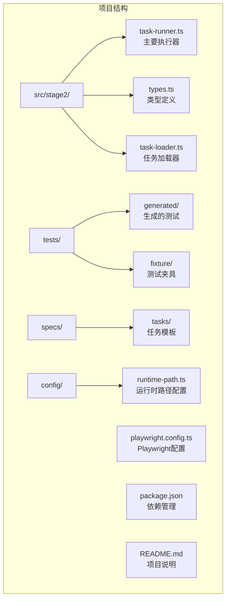
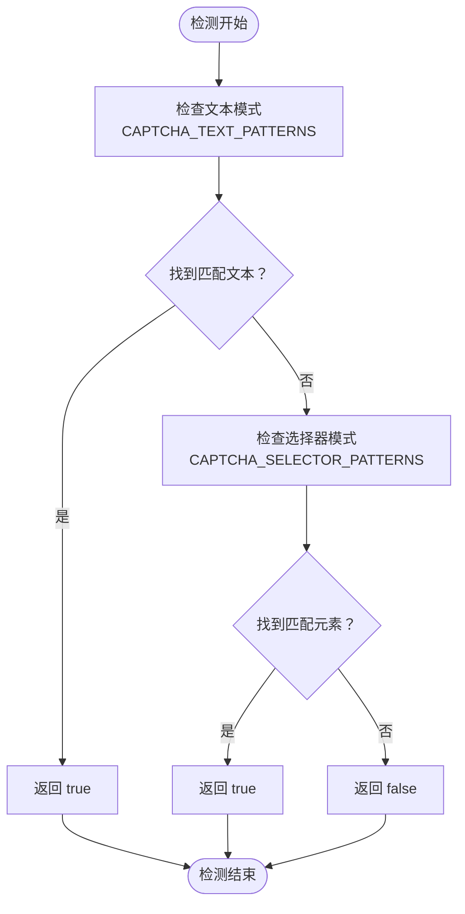
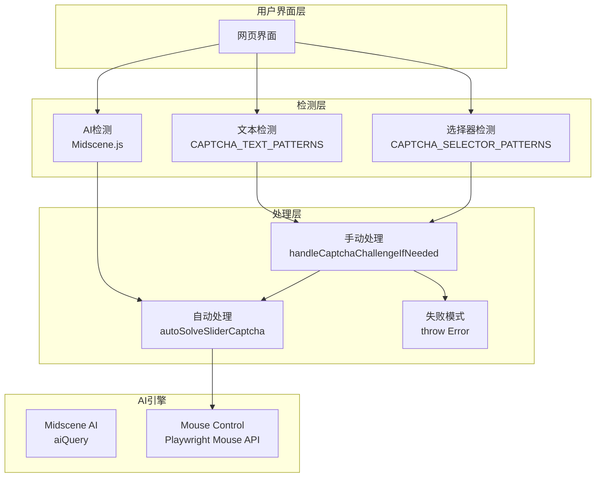
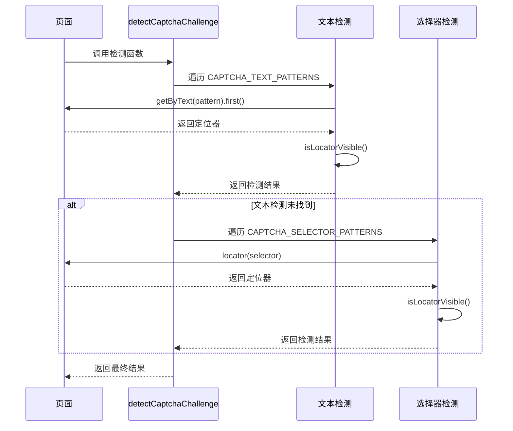
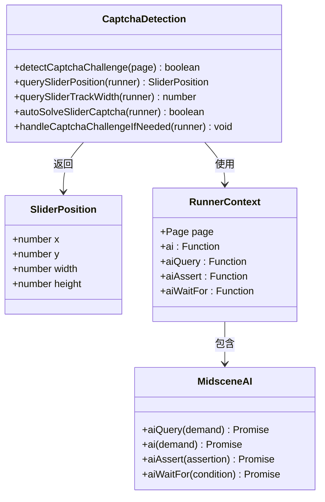
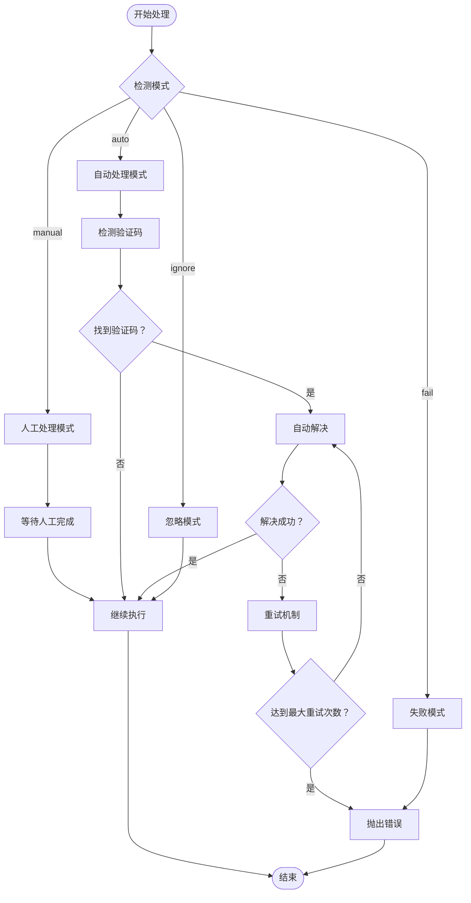
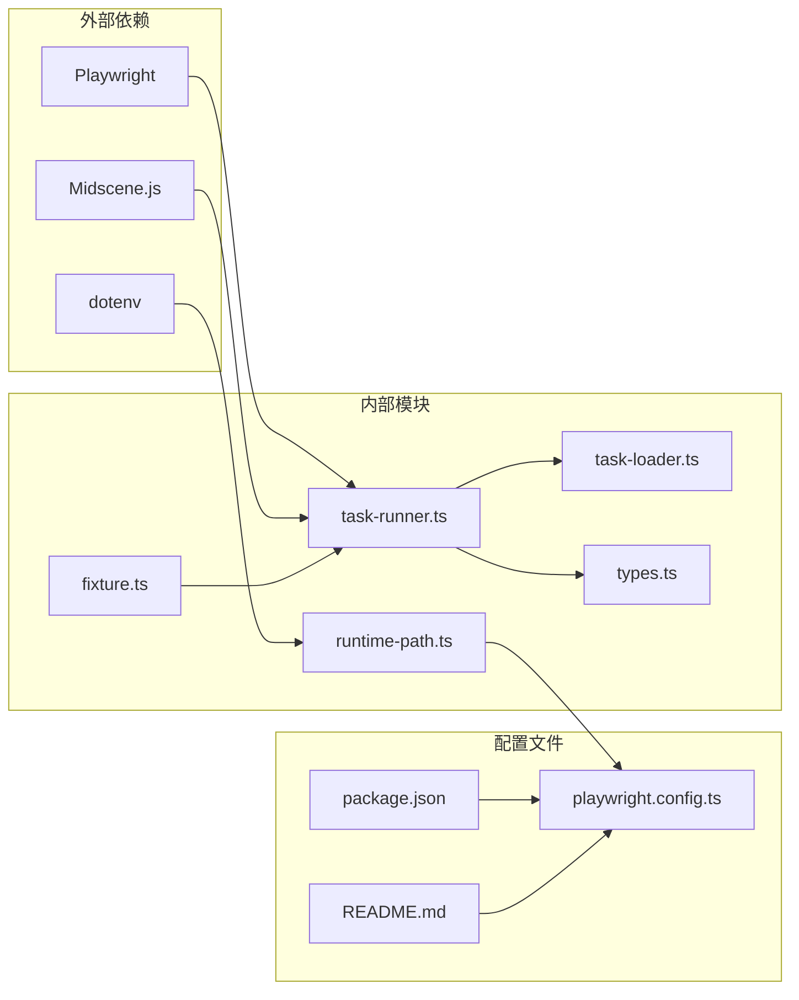
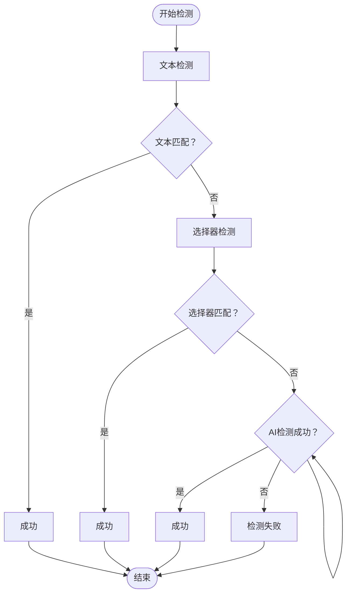

# 验证码检测问题

<cite>
**本文档引用的文件**
- [README.md](file://README.md)
- [package.json](file://package.json)
- [src/stage2/task-runner.ts](file://src/stage2/task-runner.ts)
- [src/stage2/types.ts](file://src/stage2/types.ts)
- [src/stage2/task-loader.ts](file://src/stage2/task-loader.ts)
- [tests/generated/stage2-acceptance-runner.spec.ts](file://tests/generated/stage2-acceptance-runner.spec.ts)
- [tests/fixture/fixture.ts](file://tests/fixture/fixture.ts)
- [config/runtime-path.ts](file://config/runtime-path.ts)
- [playwright.config.ts](file://playwright.config.ts)
- [specs/tasks/acceptance-task.community-create.example.json](file://specs/tasks/acceptance-task.community-create.example.json)
</cite>

## 目录
1. [简介](#简介)
2. [项目结构](#项目结构)
3. [核心组件](#核心组件)
4. [架构概览](#架构概览)
5. [详细组件分析](#详细组件分析)
6. [依赖关系分析](#依赖关系分析)
7. [性能考虑](#性能考虑)
8. [故障排除指南](#故障排除指南)
9. [结论](#结论)

## 简介

本指南专注于基于 Playwright 和 Midscene.js 的滑块验证码检测问题的详细故障排除。该系统实现了智能的验证码检测机制，支持文本模式匹配、选择器匹配以及 AI 辅助检测三种方式。文档深入分析了检测失败的根本原因，提供了配置优化方法和调试技巧，并对比了 AI 辅助检测与传统选择器检测的差异。

## 项目结构

该项目是一个基于 Playwright 和 Midscene.js 的 AI 自动化测试项目，专门用于处理登录页的滑块验证码挑战。



**图表来源**
- [src/stage2/task-runner.ts](file://src/stage2/task-runner.ts#L1-L535)
- [tests/generated/stage2-acceptance-runner.spec.ts](file://tests/generated/stage2-acceptance-runner.spec.ts#L1-L39)
- [config/runtime-path.ts](file://config/runtime-path.ts#L1-L41)

**章节来源**
- [README.md](file://README.md#L1-L144)
- [package.json](file://package.json#L1-L24)

## 核心组件

系统的核心功能围绕验证码检测和处理机制构建，主要包括以下关键组件：

### 验证码检测配置

系统定义了两套检测模式：
- **文本模式匹配**：通过 CAPTCHA_TEXT_PATTERNS 数组中的关键词进行检测
- **选择器模式匹配**：通过 CAPTCHA_SELECTOR_PATTERNS 数组中的 CSS 选择器进行检测

### 检测函数架构



**图表来源**
- [src/stage2/task-runner.ts](file://src/stage2/task-runner.ts#L39-L50)
- [src/stage2/task-runner.ts](file://src/stage2/task-runner.ts#L480-L498)

**章节来源**
- [src/stage2/task-runner.ts](file://src/stage2/task-runner.ts#L39-L50)
- [src/stage2/task-runner.ts](file://src/stage2/task-runner.ts#L480-L498)

## 架构概览

系统采用分层架构设计，结合传统选择器检测和 AI 辅助检测两种方式：



**图表来源**
- [src/stage2/task-runner.ts](file://src/stage2/task-runner.ts#L558-L683)
- [src/stage2/task-runner.ts](file://src/stage2/task-runner.ts#L507-L556)

## 详细组件分析

### 检测函数 `detectCaptchaChallenge`

这是验证码检测的核心函数，实现了双重检测机制：



**图表来源**
- [src/stage2/task-runner.ts](file://src/stage2/task-runner.ts#L480-L498)
- [src/stage2/task-runner.ts](file://src/stage2/task-runner.ts#L466-L478)

#### 检测逻辑分析

检测函数采用"短路"策略，优先使用文本模式检测，如果未找到则使用选择器模式检测。这种设计提高了检测效率和准确性。

**章节来源**
- [src/stage2/task-runner.ts](file://src/stage2/task-runner.ts#L480-L498)

### AI 辅助检测组件

系统集成了 Midscene.js 的 AI 能力，提供更智能的验证码检测：



**图表来源**
- [src/stage2/task-runner.ts](file://src/stage2/task-runner.ts#L500-L535)
- [src/stage2/task-runner.ts](file://src/stage2/task-runner.ts#L558-L683)

**章节来源**
- [src/stage2/task-runner.ts](file://src/stage2/task-runner.ts#L507-L556)
- [src/stage2/task-runner.ts](file://src/stage2/task-runner.ts#L558-L683)

### 验证码处理流程

系统提供了多种验证码处理模式：



**图表来源**
- [src/stage2/task-runner.ts](file://src/stage2/task-runner.ts#L647-L683)

**章节来源**
- [src/stage2/task-runner.ts](file://src/stage2/task-runner.ts#L58-L84)
- [src/stage2/task-runner.ts](file://src/stage2/task-runner.ts#L647-L683)

## 依赖关系分析

系统的关键依赖关系如下：



**图表来源**
- [package.json](file://package.json#L13-L22)
- [playwright.config.ts](file://playwright.config.ts#L1-L94)
- [config/runtime-path.ts](file://config/runtime-path.ts#L1-L41)

**章节来源**
- [package.json](file://package.json#L13-L22)
- [playwright.config.ts](file://playwright.config.ts#L1-L94)

## 性能考虑

系统在性能方面采用了多项优化策略：

### 检测优化
- **短路求值**：文本检测优先，未找到时才进行选择器检测
- **可见性检查**：使用 `isLocatorVisible` 函数确保元素真实可见
- **缓存机制**：Midscene.js 提供的 AI 查询缓存

### 处理优化
- **重试机制**：自动模式下最多重试 3 次
- **超时控制**：可配置的等待超时时间
- **资源清理**：异常情况下确保鼠标状态恢复

## 故障排除指南

### 根本原因分析

#### 文本模式匹配失败

**常见症状**：
- 验证码出现但检测函数返回 false
- 页面包含相关文本但未被识别

**可能原因**：
1. 文本内容与配置不匹配
2. 动态文本内容变化
3. 语言或编码问题
4. 文本位置或格式变化

**解决方案**：
1. 检查 CAPTCHA_TEXT_PATTERNS 配置
2. 添加更多变体文本
3. 调整文本匹配策略

#### 选择器匹配错误

**常见症状**：
- 元素存在但无法定位
- 选择器过于具体导致失效

**可能原因**：
1. 页面结构变化
2. CSS 类名动态生成
3. 选择器语法错误
4. 元素加载时机问题

**解决方案**：
1. 更新 CAPTCHA_SELECTOR_PATTERNS
2. 使用更通用的选择器
3. 添加元素存在性检查

#### 页面元素可见性判断问题

**常见症状**：
- 元素实际可见但检测为不可见
- 动画或过渡效果影响检测

**可能原因**：
1. 元素被其他元素遮挡
2. CSS 显示属性问题
3. JavaScript 动态隐藏
4. 检测时机不当

**解决方案**：
1. 优化 isLocatorVisible 函数
2. 添加等待策略
3. 调整检测时机

### 配置优化方法

#### CAPTCHA_TEXT_PATTERNS 优化

针对不同网站的验证码样式，建议的配置策略：

**中文网站**：
```javascript
const CAPTCHA_TEXT_PATTERNS = [
  '请完成安全验证',
  '请按住滑块',
  '拖动到最右边',
  '向右滑动',
  '拖动滑块',
  '验证完成',
  '验证成功'
];
```

**英文网站**：
```javascript
const CAPTCHA_TEXT_PATTERNS = [
  'Please complete the security verification',
  'Press and hold the slider',
  'Drag to the right',
  'Slide to the right',
  'Verification complete'
];
```

**多语言网站**：
```javascript
const CAPTCHA_TEXT_PATTERNS = [
  '请完成安全验证',
  'Please complete the security verification',
  '完成安全验证',
  'Security verification'
];
```

#### CAPTCHA_SELECTOR_PATTERNS 优化

**通用验证码容器**：
```javascript
const CAPTCHA_SELECTOR_PATTERNS = [
  '.nc_wrapper',
  '.nc_scale',
  '[id^="nc_"][id$="_wrapper"]',
  '[class*="captcha"]',
  '[data-captcha]',
  '.geetest_widget',
  '.touclick-start',
  '.vaptcha_container'
];
```

**特定框架适配**：
```javascript
// Element Plus
'.el-cascader-panel',
'.el-dialog',

// Ant Design
'.ant-modal',
'.ant-cascader',

// Vue 组件
'[data-v-captcha]',
'[data-v-slider]'
```

### 调试技巧

#### 日志分析

**关键日志点**：
1. 检测函数入口和出口
2. 文本匹配结果
3. 选择器匹配结果
4. AI 检测结果
5. 自动处理过程

**调试输出示例**：
```
[滑块自动处理] 开始检测滑块位置...
[滑块自动处理] 未检测到滑块位置
[安全验证] 检测到滑块，使用自动模式处理...
[滑块自动处理] 检测到滑块位置: x=120, y=300
[滑块自动处理] 目标位置: x=420, y=300
[滑块自动处理] 拖动完成，等待验证结果...
```

#### 元素定位验证

**验证步骤**：
1. 在浏览器开发者工具中测试选择器
2. 检查元素的 isVisible 状态
3. 验证元素的层级关系
4. 确认元素的加载时机

**验证命令**：
```javascript
// 在控制台测试
$$('.nc_wrapper')[0].isVisible()
$$('.nc_scale')[0].getBoundingClientRect()
```

#### 可见性判断优化

**改进策略**：
1. 添加元素尺寸检查
2. 验证元素在视口内
3. 检查 CSS transform 属性
4. 处理 iframe 内容

### AI 辅助检测 vs 传统选择器检测

#### AI 辅助检测优势

**适用场景**：
- 复杂的验证码样式
- 动态生成的验证码
- 需要精确位置信息的情况
- 多种验证码类型的混合

**技术特点**：
- 基于图像识别的定位
- 支持复杂的视觉特征
- 自适应不同样式
- 提供精确的坐标信息

#### 传统选择器检测优势

**适用场景**：
- 结构化的静态验证码
- 已知的固定样式
- 性能敏感的应用
- 简单的验证码类型

**技术特点**：
- 快速的 DOM 查询
- 低资源消耗
- 稳定的匹配结果
- 易于维护和调试

#### 混合检测策略最佳实践

**推荐策略**：
1. **优先级设置**：文本检测 > 选择器检测 > AI 检测
2. **降级机制**：一种方法失败时自动尝试其他方法
3. **性能平衡**：根据验证码复杂度选择合适的方法
4. **错误处理**：完善的异常捕获和恢复机制

**实施建议**：


### 具体故障案例分析

#### 案例1：文本匹配失败

**问题描述**：验证码文本为"请拖动滑块完成验证"，但检测失败

**分析**：
- 配置中缺少"拖动"关键词
- 文本内容与配置不完全匹配

**解决方案**：
```javascript
const CAPTCHA_TEXT_PATTERNS = [
  '请完成安全验证',
  '请按住滑块',
  '拖动到最右边',
  '向右滑动',
  '拖动滑块',  // 新增此行
  '请拖动滑块完成验证'  // 或者添加完整文本
];
```

#### 案例2：选择器失效

**问题描述**：验证码容器类名发生变化

**分析**：
- 页面更新导致选择器过时
- 类名动态生成

**解决方案**：
```javascript
const CAPTCHA_SELECTOR_PATTERNS = [
  '.nc_wrapper',
  '.nc_scale',
  '[id^="nc_"][id$="_wrapper"]',
  '[class*="captcha"]',
  '[data-captcha]',  // 新增数据属性选择器
  '.geetest_widget', // 新增第三方验证码支持
  '.touclick-start'  // 新增第三方验证码支持
];
```

#### 案例3：可见性判断问题

**问题描述**：元素存在但检测为不可见

**分析**：
- 元素被其他元素遮挡
- CSS transform 影响可见性
- 动画效果干扰检测

**解决方案**：
```javascript
// 改进的可见性检查
async function improvedIsLocatorVisible(locator: Locator): Promise<boolean> {
  try {
    const count = await locator.count();
    for (let i = 0; i < count; i += 1) {
      const element = locator.nth(i);
      // 检查基本可见性
      if (await element.isVisible()) {
        // 额外检查：元素尺寸和位置
        const boundingRect = await element.boundingBox();
        if (boundingRect && 
            boundingRect.width > 0 && 
            boundingRect.height > 0 &&
            boundingRect.x >= 0 && 
            boundingRect.y >= 0) {
          return true;
        }
      }
    }
  } catch (_error) {
    return false;
  }
  return false;
}
```

## 结论

验证码检测系统通过多层次的检测机制和灵活的配置选项，为不同类型的验证码提供了有效的解决方案。成功的故障排除需要：

1. **系统性分析**：从文本匹配、选择器匹配到 AI 检测的全面排查
2. **配置优化**：根据具体网站特性调整检测规则
3. **调试技巧**：利用日志和可视化工具进行问题定位
4. **混合策略**：结合传统方法和 AI 技术的优势

通过遵循本指南提供的方法和最佳实践，可以有效提高验证码检测的准确性和稳定性，减少自动化测试中的阻塞问题。