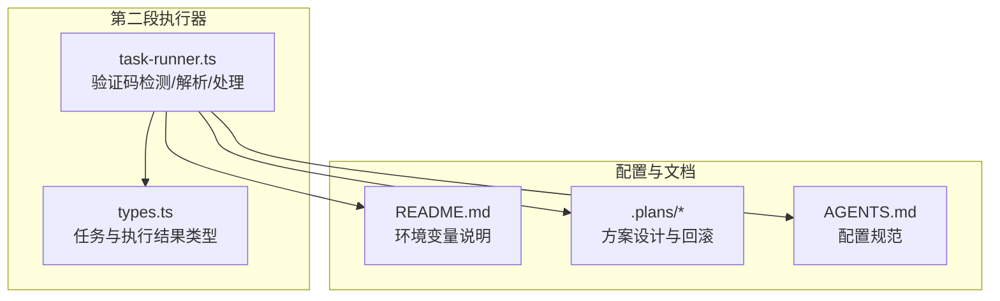
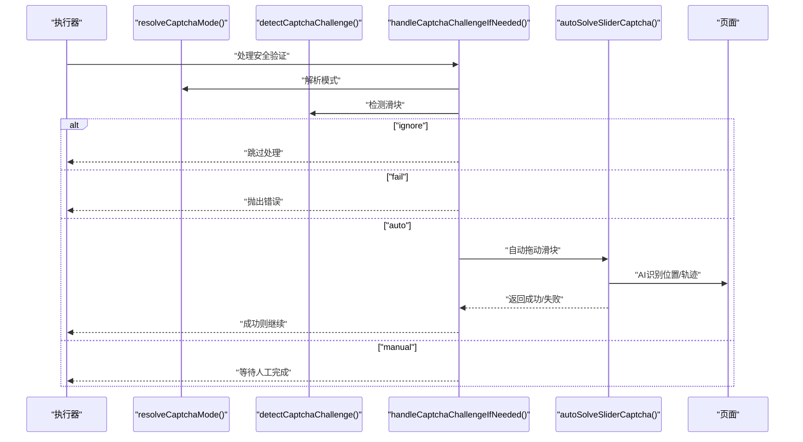
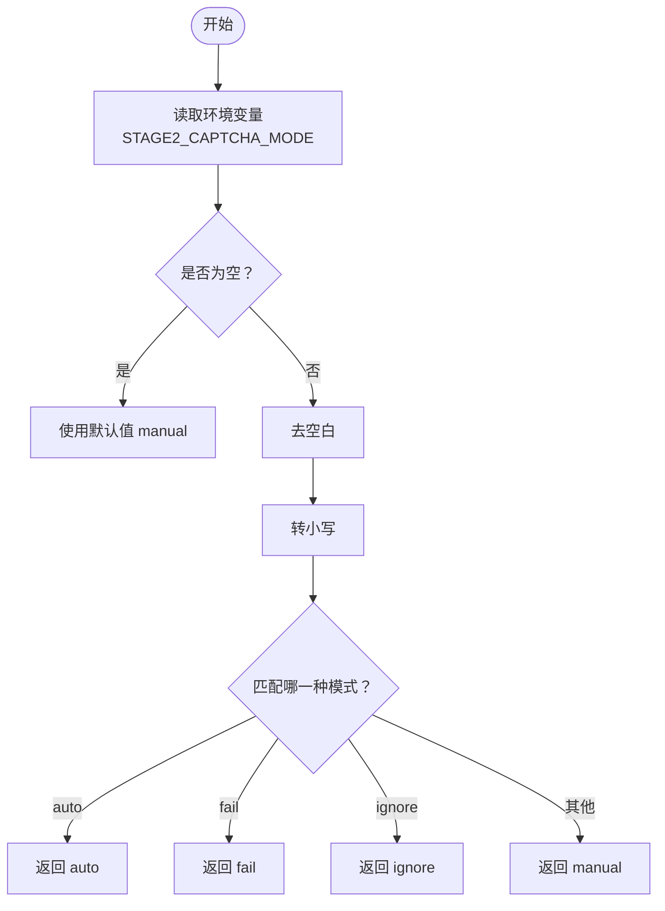
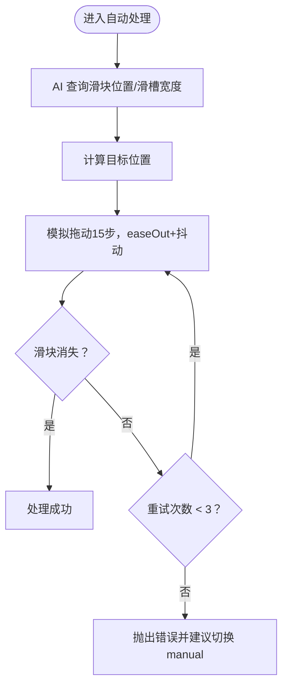
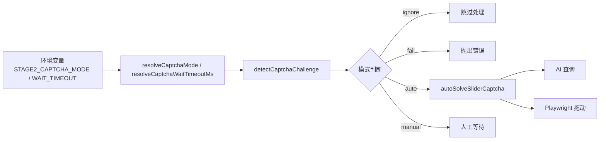

# 验证码模式配置

<cite>
**本文引用的文件**
- [src/stage2/task-runner.ts](file://src/stage2/task-runner.ts)
- [README.md](file://README.md)
- [.plans/stage2登录安全验证人工兜底方案_2026-03-12.md](file://.plans/stage2登录安全验证人工兜底方案_2026-03-12.md)
- [AGENTS.md](file://AGENTS.md)
- [src/stage2/types.ts](file://src/stage2/types.ts)
</cite>

## 目录
1. [简介](#简介)
2. [项目结构](#项目结构)
3. [核心组件](#核心组件)
4. [架构概览](#架构概览)
5. [详细组件分析](#详细组件分析)
6. [依赖关系分析](#依赖关系分析)
7. [性能考量](#性能考量)
8. [故障排查指南](#故障排查指南)
9. [结论](#结论)
10. [附录](#附录)

## 简介
本指南聚焦于第二段执行器中的验证码处理模式配置，围绕 STAGE2_CAPTCHA_MODE 环境变量的四种模式（manual、auto、fail、ignore）进行系统讲解，覆盖其工作原理、限制条件、适用场景、配置解析逻辑、迁移与回滚策略等。目标是帮助团队在不同业务环境下选择并稳定地应用合适的验证码处理策略。

## 项目结构
与验证码模式配置直接相关的代码集中在第二段执行器模块中，主要文件与职责如下：
- src/stage2/task-runner.ts：验证码检测、解析与处理的核心实现，包含 resolveCaptchaMode、detectCaptchaChallenge、handleCaptchaChallengeIfNeeded、autoSolveSliderCaptcha 等关键函数。
- README.md：提供 STAGE2_CAPTCHA_MODE 的官方说明与默认行为。
- .plans/stage2登录安全验证人工兜底方案_2026-03-12.md：方案设计文档，阐述自动处理流程与回滚策略。
- AGENTS.md：配置与运行产物规范，强调通过环境变量集中管理配置。
- src/stage2/types.ts：任务与执行结果的类型定义，便于理解配置对执行流程的影响。

图表来源
- [src/stage2/task-runner.ts](file://src/stage2/task-runner.ts#L1-L1344)
- [README.md](file://README.md#L1-L144)
- [.plans/stage2登录安全验证人工兜底方案_2026-03-12.md](file://.plans/stage2登录安全验证人工兜底方案_2026-03-12.md#L1-L57)
- [AGENTS.md](file://AGENTS.md#L1-L61)
- [src/stage2/types.ts](file://src/stage2/types.ts#L1-L125)

章节来源
- [src/stage2/task-runner.ts](file://src/stage2/task-runner.ts#L1-L1344)
- [README.md](file://README.md#L1-L144)
- [.plans/stage2登录安全验证人工兜底方案_2026-03-12.md](file://.plans/stage2登录安全验证人工兜底方案_2026-03-12.md#L1-L57)
- [AGENTS.md](file://AGENTS.md#L1-L61)
- [src/stage2/types.ts](file://src/stage2/types.ts#L1-L125)

## 核心组件
- 验证码模式常量与默认值
  - 模式常量：manual、auto、fail、ignore
  - 默认模式：manual
  - 等待超时默认值：120000 毫秒
- 解析函数
  - resolveCaptchaMode：解析 STAGE2_CAPTCHA_MODE，进行 trim、toLowerCase 归一化，匹配后返回对应模式，否则回退到 manual
  - resolveCaptchaWaitTimeoutMs：解析 STAGE2_CAPTCHA_WAIT_TIMEOUT_MS，非法或非正数时回退到默认值
- 检测与处理
  - detectCaptchaChallenge：基于文案与选择器检测滑块验证码
  - handleCaptchaChallengeIfNeeded：根据模式执行 fail/ignore/auto/manual 分支
  - autoSolveSliderCaptcha：AI + Playwright 自动拖动滑块，最多重试 3 次

章节来源
- [src/stage2/task-runner.ts](file://src/stage2/task-runner.ts#L32-L84)
- [src/stage2/task-runner.ts](file://src/stage2/task-runner.ts#L58-L72)
- [src/stage2/task-runner.ts](file://src/stage2/task-runner.ts#L74-L84)
- [src/stage2/task-runner.ts](file://src/stage2/task-runner.ts#L480-L498)
- [src/stage2/task-runner.ts](file://src/stage2/task-runner.ts#L647-L703)
- [src/stage2/task-runner.ts](file://src/stage2/task-runner.ts#L558-L645)

## 架构概览
验证码处理在第二段执行器中的调用链如下：任务执行入口 -> 登录后处理安全验证 -> 检测滑块 -> 根据模式分支处理 -> 自动处理或人工等待 -> 继续后续步骤。

图表来源
- [src/stage2/task-runner.ts](file://src/stage2/task-runner.ts#L647-L703)
- [src/stage2/task-runner.ts](file://src/stage2/task-runner.ts#L558-L645)
- [src/stage2/task-runner.ts](file://src/stage2/task-runner.ts#L480-L498)
- [src/stage2/task-runner.ts](file://src/stage2/task-runner.ts#L58-L72)

## 详细组件分析

### STAGE2_CAPTCHA_MODE 模式详解
- manual（默认）
  - 行为：检测到滑块/安全验证后，等待人工完成，超过等待超时则失败
  - 适用场景：稳定性优先、自动化不可靠、需要人工监督
  - 关键参数：STAGE2_CAPTCHA_WAIT_TIMEOUT_MS（默认 120000ms）
- auto（推荐用于可自动化的场景）
  - 行为：AI 识别滑块位置与滑槽宽度，Playwright 模拟真人拖动轨迹，最多重试 3 次
  - 适用场景：滑块样式稳定、页面元素可被 AI 准确识别
  - 关键参数：STAGE2_CAPTCHA_WAIT_TIMEOUT_MS（仅 manual 生效）
- fail
  - 行为：检测到滑块/安全验证立即失败，阻止后续执行
  - 适用场景：严格禁止自动化绕过、需要强制人工介入
- ignore
  - 行为：忽略滑块检测，不进行任何处理
  - 适用场景：明确不需要验证码处理或页面无阻塞性验证码
  - 风险：若页面出现验证码，可能导致后续步骤失败

章节来源
- [README.md](file://README.md#L54-L62)
- [src/stage2/task-runner.ts](file://src/stage2/task-runner.ts#L32-L38)
- [src/stage2/task-runner.ts](file://src/stage2/task-runner.ts#L647-L703)
- [src/stage2/task-runner.ts](file://src/stage2/task-runner.ts#L558-L645)

### resolveCaptchaMode 解析逻辑
- 输入来源：process.env.STAGE2_CAPTCHA_MODE
- 归一化：trim + toLowerCase
- 匹配顺序：auto -> fail -> ignore -> manual
- 默认值：DEFAULT_CAPTCHA_MODE（manual）
- 大小写敏感性：不敏感（统一转为小写）
- 参数验证：未做额外校验，非法值回退到 manual

图表来源
- [src/stage2/task-runner.ts](file://src/stage2/task-runner.ts#L58-L72)

章节来源
- [src/stage2/task-runner.ts](file://src/stage2/task-runner.ts#L58-L72)

### 自动处理流程与限制
- 自动处理流程
  - AI 识别滑块位置与滑槽宽度
  - 计算目标位置
  - Playwright 模拟拖动（15步，easeOut 缓动 + 随机抖动）
  - 检查滑块是否消失，最多重试 3 次
- 限制条件
  - 页面元素需可被 AI 识别（滑块按钮、滑槽宽度）
  - 拖动轨迹需符合人手特征（缓动 + 抖动）
  - 若多次失败，抛出明确错误并建议切换 manual 模式
- 适用性评估
  - 对于样式稳定的滑块验证码效果较好
  - 对于复杂样式或动态变化的验证码，建议使用 manual 模式

图表来源
- [src/stage2/task-runner.ts](file://src/stage2/task-runner.ts#L558-L645)

章节来源
- [src/stage2/task-runner.ts](file://src/stage2/task-runner.ts#L558-L645)

### 人工等待与超时控制
- 仅在 manual 模式生效
- 默认等待时长：120000ms
- 检测周期：1000ms
- 超时后抛出明确错误，包含配置建议

章节来源
- [src/stage2/task-runner.ts](file://src/stage2/task-runner.ts#L37-L38)
- [src/stage2/task-runner.ts](file://src/stage2/task-runner.ts#L686-L703)

### 模式切换与回滚策略
- 切换策略
  - 从 auto 切换到 manual：设置 STAGE2_CAPTCHA_MODE=manual，增大 STAGE2_CAPTCHA_WAIT_TIMEOUT_MS 以适应人工处理节奏
  - 从 manual 切换到 auto：确保页面元素可被 AI 识别，调整滑块检测选择器或样式
  - 从 fail 切换到 manual/auto：移除 fail 限制，改为允许继续执行
  - 从 ignore 切换到其他模式：恢复验证码检测逻辑
- 回滚方案
  - 设置 STAGE2_CAPTCHA_MODE=manual 即可快速回退到人工兜底
  - 如需完全移除逻辑，可移除 task-runner.ts 中新增的安全验证处理相关代码

章节来源
- [.plans/stage2登录安全验证人工兜底方案_2026-03-12.md](file://.plans/stage2登录安全验证人工兜底方案_2026-03-12.md#L50-L52)
- [README.md](file://README.md#L54-L62)

## 依赖关系分析
- 配置依赖
  - STAGE2_CAPTCHA_MODE：决定验证码处理模式
  - STAGE2_CAPTCHA_WAIT_TIMEOUT_MS：仅在 manual 模式下生效
- 检测依赖
  - 文案关键词与选择器：用于识别滑块验证码
  - AI 查询：用于获取滑块位置与滑槽宽度
- 执行依赖
  - Playwright mouse API：模拟拖动轨迹
  - 最多重试次数：3 次

图表来源
- [src/stage2/task-runner.ts](file://src/stage2/task-runner.ts#L58-L84)
- [src/stage2/task-runner.ts](file://src/stage2/task-runner.ts#L480-L498)
- [src/stage2/task-runner.ts](file://src/stage2/task-runner.ts#L647-L703)
- [src/stage2/task-runner.ts](file://src/stage2/task-runner.ts#L558-L645)

章节来源
- [src/stage2/task-runner.ts](file://src/stage2/task-runner.ts#L58-L84)
- [src/stage2/task-runner.ts](file://src/stage2/task-runner.ts#L480-L498)
- [src/stage2/task-runner.ts](file://src/stage2/task-runner.ts#L647-L703)
- [src/stage2/task-runner.ts](file://src/stage2/task-runner.ts#L558-L645)

## 性能考量
- 自动模式
  - AI 查询与拖动操作会带来额外开销，建议在稳定页面上启用
  - 最多重试 3 次，避免长时间阻塞
- 人工模式
  - 默认等待 120000ms，可根据实际业务调整
  - 检测周期 1000ms，平衡响应速度与资源消耗
- ignore 模式
  - 不进行检测与处理，适合确定无验证码的场景

章节来源
- [src/stage2/task-runner.ts](file://src/stage2/task-runner.ts#L37-L38)
- [src/stage2/task-runner.ts](file://src/stage2/task-runner.ts#L647-L703)
- [src/stage2/task-runner.ts](file://src/stage2/task-runner.ts#L558-L645)

## 故障排查指南
- 自动处理失败
  - 现象：多次重试后仍失败
  - 排查要点：页面截图确认滑块样式、调整滑块检测选择器、切换 manual 模式
  - 参考错误信息：包含重试次数与建议
- 人工等待超时
  - 现象：超过等待时间仍未完成
  - 排查要点：增大 STAGE2_CAPTCHA_WAIT_TIMEOUT_MS，检查页面是否出现验证码
- fail 模式触发
  - 现象：检测到验证码立即失败
  - 排查要点：评估是否需要放宽限制或改为 manual/auto
- ignore 模式风险
  - 现象：页面出现验证码但未处理
  - 排查要点：确认页面是否需要验证码处理，必要时切换到其他模式

章节来源
- [src/stage2/task-runner.ts](file://src/stage2/task-runner.ts#L680-L683)
- [src/stage2/task-runner.ts](file://src/stage2/task-runner.ts#L700-L702)
- [src/stage2/task-runner.ts](file://src/stage2/task-runner.ts#L658-L662)

## 结论
- STAGE2_CAPTCHA_MODE 提供了灵活的验证码处理策略，满足不同业务场景的需求
- auto 模式适合稳定页面，manual 模式适合需要人工监督的场景，fail 模式适合严格限制的场景，ignore 模式适合确定无需处理的场景
- 建议在生产环境中优先采用 auto，并结合人工兜底（manual）作为回退策略
- 配置变更应遵循小步修改与可回滚原则，确保变更可控

## 附录
- 最佳实践建议
  - 开发/测试环境：auto（提升效率）
  - 生产环境：auto + manual 回退（兼顾效率与稳定性）
  - 特殊场景：fail（严格限制）、ignore（确定无需处理）
- 配置清单
  - STAGE2_CAPTCHA_MODE：manual、auto、fail、ignore
  - STAGE2_CAPTCHA_WAIT_TIMEOUT_MS：仅 manual 生效（单位 ms）

章节来源
- [README.md](file://README.md#L54-L62)
- [AGENTS.md](file://AGENTS.md#L22-L31)