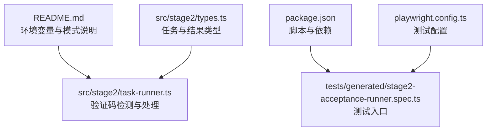
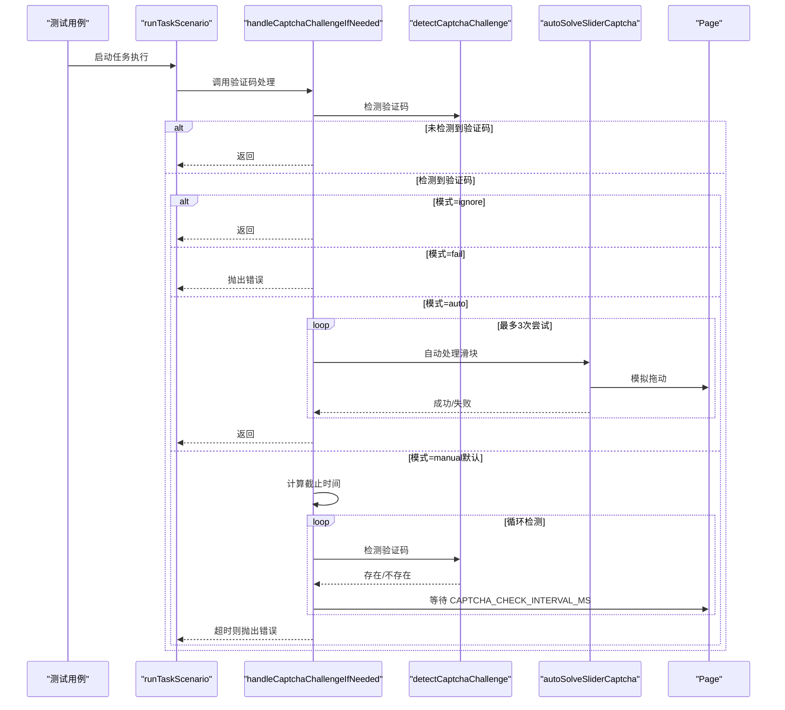
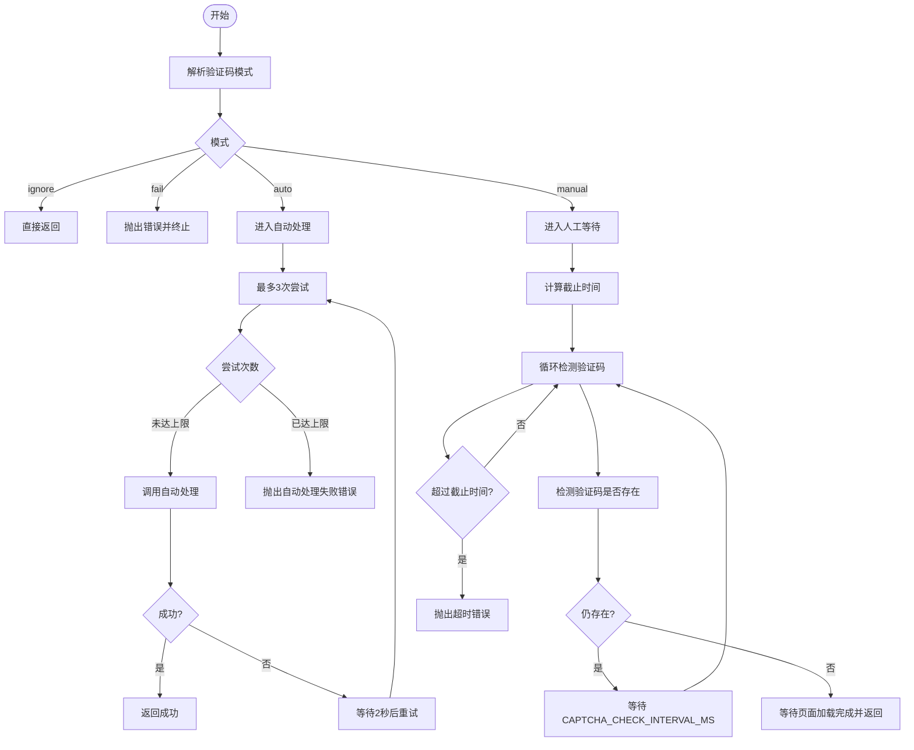
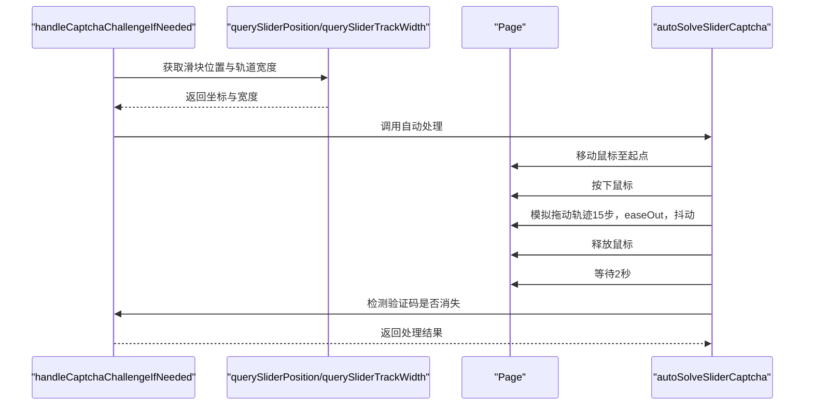
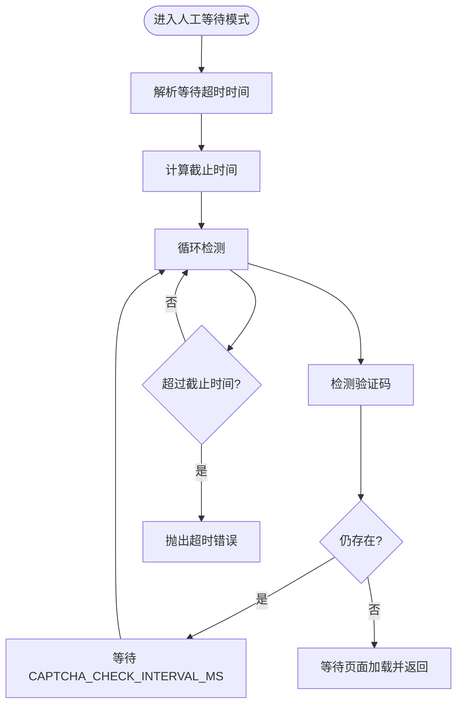
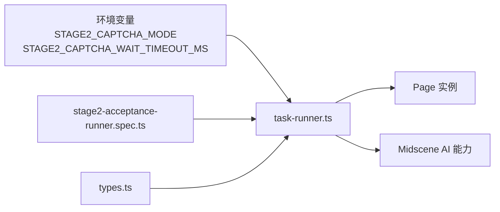

# 验证码超时问题

<cite>
**本文引用的文件**
- [README.md](file://README.md)
- [package.json](file://package.json)
- [src/stage2/task-runner.ts](file://src/stage2/task-runner.ts)
- [src/stage2/types.ts](file://src/stage2/types.ts)
- [tests/generated/stage2-acceptance-runner.spec.ts](file://tests/generated/stage2-acceptance-runner.spec.ts)
- [playwright.config.ts](file://playwright.config.ts)
</cite>

## 目录
1. [简介](#简介)
2. [项目结构](#项目结构)
3. [核心组件](#核心组件)
4. [架构概览](#架构概览)
5. [详细组件分析](#详细组件分析)
6. [依赖关系分析](#依赖关系分析)
7. [性能考量](#性能考量)
8. [故障排除指南](#故障排除指南)
9. [结论](#结论)
10. [附录](#附录)

## 简介
本指南聚焦于验证码超时处理问题，围绕 handleCaptchaChallengeIfNeeded 函数的超时机制进行深入分析，涵盖 resolveCaptchaWaitTimeoutMs 配置、等待循环逻辑、超时阈值设置等，并对比不同验证码模式（manual、auto、fail、ignore）下的行为差异。同时提供超时时间优化策略、重试机制配置、CAPTCHA_CHECK_INTERVAL_MS 间隔设置对性能与准确性的权衡，以及在人工处理模式下的交互优化与用户体验改进建议。

## 项目结构
该项目基于 Playwright 与 Midscene.js 的 AI 自动化测试框架，核心执行器位于 stage2 目录，负责从 JSON 任务驱动 UI 自动化流程，包含验证码检测与处理逻辑。

图表来源
- [README.md](file://README.md#L39-L61)
- [src/stage2/task-runner.ts](file://src/stage2/task-runner.ts#L32-L50)
- [tests/generated/stage2-acceptance-runner.spec.ts](file://tests/generated/stage2-acceptance-runner.spec.ts#L1-L39)
- [playwright.config.ts](file://playwright.config.ts#L22-L48)
- [src/stage2/types.ts](file://src/stage2/types.ts#L86-L98)

章节来源
- [README.md](file://README.md#L1-L144)
- [package.json](file://package.json#L1-L24)
- [src/stage2/task-runner.ts](file://src/stage2/task-runner.ts#L1-L120)
- [tests/generated/stage2-acceptance-runner.spec.ts](file://tests/generated/stage2-acceptance-runner.spec.ts#L1-L39)
- [playwright.config.ts](file://playwright.config.ts#L1-L95)
- [src/stage2/types.ts](file://src/stage2/types.ts#L1-L125)

## 核心组件
- 验证码模式解析与超时配置
  - resolveCaptchaMode：解析 STAGE2_CAPTCHA_MODE，支持 manual、auto、fail、ignore。
  - resolveCaptchaWaitTimeoutMs：解析 STAGE2_CAPTCHA_WAIT_TIMEOUT_MS，提供默认值与边界保护。
- 验证码检测与处理
  - detectCaptchaChallenge：通过文本与选择器模式检测验证码。
  - handleCaptchaChallengeIfNeeded：根据模式执行 fail、ignore、auto 或 manual 处理。
  - autoSolveSliderCaptcha：AI+Playwright 自动拖动滑块验证码。
- 关键常量
  - DEFAULT_CAPTCHA_WAIT_TIMEOUT_MS：默认等待超时时间。
  - CAPTCHA_CHECK_INTERVAL_MS：人工模式下轮询间隔。
  - CAPTCHA_MODE_*：模式常量与默认值。

章节来源
- [src/stage2/task-runner.ts](file://src/stage2/task-runner.ts#L32-L84)
- [src/stage2/task-runner.ts](file://src/stage2/task-runner.ts#L480-L498)
- [src/stage2/task-runner.ts](file://src/stage2/task-runner.ts#L647-L703)
- [src/stage2/task-runner.ts](file://src/stage2/task-runner.ts#L558-L645)
- [README.md](file://README.md#L54-L61)

## 架构概览
验证码处理在任务执行流程中的关键位置，贯穿登录后与菜单导航前的阶段，确保页面安全验证通过后再继续后续步骤。

图表来源
- [src/stage2/task-runner.ts](file://src/stage2/task-runner.ts#L647-L703)
- [src/stage2/task-runner.ts](file://src/stage2/task-runner.ts#L480-L498)
- [src/stage2/task-runner.ts](file://src/stage2/task-runner.ts#L558-L645)

## 详细组件分析

### 组件一：验证码模式与超时配置
- 模式解析
  - 支持 auto、manual、fail、ignore；默认 manual。
  - 对大小写与空白字符进行标准化处理。
- 超时解析
  - 解析 STAGE2_CAPTCHA_WAIT_TIMEOUT_MS，非法或非正数时回退到默认值。
  - 默认等待时间为 DEFAULT_CAPTCHA_WAIT_TIMEOUT_MS。
- 常量与阈值
  - CAPTCHA_CHECK_INTERVAL_MS：人工模式轮询间隔，用于平衡 CPU 占用与检测灵敏度。
  - DEFAULT_CAPTCHA_WAIT_TIMEOUT_MS：默认等待上限，避免无限等待。

图表来源
- [src/stage2/task-runner.ts](file://src/stage2/task-runner.ts#L58-L84)
- [src/stage2/task-runner.ts](file://src/stage2/task-runner.ts#L647-L703)

章节来源
- [src/stage2/task-runner.ts](file://src/stage2/task-runner.ts#L32-L84)
- [src/stage2/task-runner.ts](file://src/stage2/task-runner.ts#L647-L703)

### 组件二：验证码检测与自动处理
- 检测策略
  - 文本模式：匹配常见提示文案。
  - 选择器模式：匹配滑块容器类名与通用验证码标识。
- 自动处理流程
  - AI 查询滑块位置与轨道宽度。
  - 模拟真人拖动轨迹（15步、easeOut 缓动、随机抖动）。
  - 拖动后等待 2 秒并再次检测验证码是否消失。
  - 异常时确保释放鼠标按键，避免状态残留。

图表来源
- [src/stage2/task-runner.ts](file://src/stage2/task-runner.ts#L507-L556)
- [src/stage2/task-runner.ts](file://src/stage2/task-runner.ts#L558-L645)

章节来源
- [src/stage2/task-runner.ts](file://src/stage2/task-runner.ts#L480-L498)
- [src/stage2/task-runner.ts](file://src/stage2/task-runner.ts#L507-L556)
- [src/stage2/task-runner.ts](file://src/stage2/task-runner.ts#L558-L645)

### 组件三：人工模式等待循环与超时控制
- 截止时间计算
  - 使用 resolveCaptchaWaitTimeoutMs 获取超时上限，结合 Date.now() 计算 deadline。
- 等待循环
  - 每次循环检测验证码是否存在，若仍存在则等待 CAPTCHA_CHECK_INTERVAL_MS。
- 超时处理
  - 超过 deadline 仍未消失，抛出明确错误，提示调整等待时间。

图表来源
- [src/stage2/task-runner.ts](file://src/stage2/task-runner.ts#L685-L703)

章节来源
- [src/stage2/task-runner.ts](file://src/stage2/task-runner.ts#L685-L703)

### 组件四：不同验证码模式下的超时处理差异
- manual（默认）
  - 通过 resolveCaptchaWaitTimeoutMs 设置超时上限，使用 CAPTCHA_CHECK_INTERVAL_MS 轮询。
  - 适合人工干预场景，需合理设置超时以平衡等待与稳定性。
- auto
  - 采用固定最多 3 次尝试，每次失败等待 2 秒后重试。
  - 适合滑块样式稳定且 AI 能力可用的场景。
- fail
  - 一旦检测到验证码即刻失败，不进行任何等待或重试。
  - 适合严格禁止验证码阻塞的场景。
- ignore
  - 直接跳过验证码检测与处理。
  - 仅在明确风险可控时使用。

章节来源
- [src/stage2/task-runner.ts](file://src/stage2/task-runner.ts#L58-L72)
- [src/stage2/task-runner.ts](file://src/stage2/task-runner.ts#L647-L703)

## 依赖关系分析
- 环境变量与配置
  - STAGE2_CAPTCHA_MODE、STAGE2_CAPTCHA_WAIT_TIMEOUT_MS 在 README 中有明确说明与默认值。
- 测试与运行时
  - 测试入口 tests/generated/stage2-acceptance-runner.spec.ts 调用 runTaskScenario，后者在关键步骤中调用 handleCaptchaChallengeIfNeeded。
- 类型与结果
  - types.ts 定义了任务与执行结果结构，便于记录步骤与截图，辅助定位验证码问题。

图表来源
- [README.md](file://README.md#L39-L61)
- [tests/generated/stage2-acceptance-runner.spec.ts](file://tests/generated/stage2-acceptance-runner.spec.ts#L1-L39)
- [src/stage2/types.ts](file://src/stage2/types.ts#L86-L98)
- [src/stage2/task-runner.ts](file://src/stage2/task-runner.ts#L1-L120)

章节来源
- [README.md](file://README.md#L39-L61)
- [tests/generated/stage2-acceptance-runner.spec.ts](file://tests/generated/stage2-acceptance-runner.spec.ts#L1-L39)
- [src/stage2/types.ts](file://src/stage2/types.ts#L1-L125)
- [src/stage2/task-runner.ts](file://src/stage2/task-runner.ts#L1-L120)

## 性能考量
- CAPTCHA_CHECK_INTERVAL_MS 的影响
  - 更短间隔：检测更及时，CPU 占用更高，轮询开销更大。
  - 更长间隔：降低 CPU 占用，但可能延长验证码消失后的响应时间。
- 自动处理的重试策略
  - 固定最多 3 次尝试，每次失败等待 2 秒，整体重试耗时约 4–6 秒。
- 页面加载与等待
  - 自动处理后等待 DOM 加载与短暂延时，确保页面稳定后再继续。

章节来源
- [src/stage2/task-runner.ts](file://src/stage2/task-runner.ts#L38-L38)
- [src/stage2/task-runner.ts](file://src/stage2/task-runner.ts#L667-L679)
- [src/stage2/task-runner.ts](file://src/stage2/task-runner.ts#L622-L630)

## 故障排除指南

### 1. 超时时间设置与优化策略
- 默认与可调参数
  - 默认等待时间：DEFAULT_CAPTCHA_WAIT_TIMEOUT_MS（来自源码常量）。
  - 可通过 STAGE2_CAPTCHA_WAIT_TIMEOUT_MS 覆盖默认值。
- 优化建议
  - 手动模式：根据验证码复杂度与网络状况适当提高超时时间，避免误判超时。
  - 自动模式：若滑块样式变化频繁，可增加最大尝试次数或延长每次失败后的等待时间（需修改源码）。
  - 间隔设置：CAPTCHA_CHECK_INTERVAL_MS 建议保持默认值，除非需要更强的实时性或更低的 CPU 占用。

章节来源
- [src/stage2/task-runner.ts](file://src/stage2/task-runner.ts#L37-L38)
- [src/stage2/task-runner.ts](file://src/stage2/task-runner.ts#L74-L84)
- [README.md](file://README.md#L50-L61)

### 2. 不同模式下的超时处理差异
- manual（默认）
  - 通过 deadline 与循环检测实现超时控制，适合人工干预场景。
- auto
  - 固定重试次数与等待时间，适合稳定场景；失败时抛出明确错误，便于回退。
- fail
  - 一旦检测到验证码即刻失败，避免长时间等待。
- ignore
  - 直接跳过，不进行任何等待或检测。

章节来源
- [src/stage2/task-runner.ts](file://src/stage2/task-runner.ts#L647-L703)

### 3. CAPTCHA_CHECK_INTERVAL_MS 对性能与准确性的影响
- 性能方面
  - 较小间隔导致更频繁的轮询，CPU 占用上升；较大间隔降低开销但可能延迟响应。
- 准确性方面
  - 适中的间隔可在及时性与资源占用之间取得平衡；对于验证码消失较慢的场景，可考虑适度增大间隔。

章节来源
- [src/stage2/task-runner.ts](file://src/stage2/task-runner.ts#L38-L38)

### 4. 动态调整超时时间的智能策略
- 基于页面特征的自适应
  - 可根据页面加载状态、网络质量或验证码类型动态调整 CAPTCHA_CHECK_INTERVAL_MS 与等待上限。
- 基于历史成功率的自适应
  - 若自动处理连续失败，可临时提升等待时间或切换到 manual 模式。
- 基于任务上下文的策略
  - 在高风险环节（如登录后）适当延长等待时间，降低误判概率。

（本节为概念性建议，不直接对应具体源码）

### 5. 人工处理模式下的交互优化与用户体验改进
- 明确提示
  - 在检测到验证码时输出清晰的提示信息，告知用户剩余等待时间与操作指引。
- 进度反馈
  - 在等待循环中定期输出进度日志，帮助用户了解当前状态。
- 截图与报告
  - 在关键节点生成截图，便于定位问题与回溯。
- 回滚与降级
  - 提供快速回滚到 manual 模式的选项，必要时移除安全验证处理逻辑。

章节来源
- [src/stage2/task-runner.ts](file://src/stage2/task-runner.ts#L685-L703)
- [.plans/stage2登录安全验证人工兜底方案_2026-03-12.md](file://.plans/stage2登录安全验证人工兜底方案_2026-03-12.md#L50-L57)

### 6. 常见问题与排查步骤
- 现象：验证码未消失导致超时
  - 排查：确认 STAGE2_CAPTCHA_MODE 是否为 manual；检查 STAGE2_CAPTCHA_WAIT_TIMEOUT_MS 是否足够。
  - 处理：适当增大等待时间或切换到 auto 模式。
- 现象：自动处理失败
  - 排查：检查滑块样式是否发生变化；确认 AI 查询是否正常。
  - 处理：调整滑块检测选择器或切换到 manual 模式。
- 现象：性能下降
  - 排查：CAPTCHA_CHECK_INTERVAL_MS 是否过小；自动处理重试次数是否过多。
  - 处理：适当增大间隔或减少重试次数。

章节来源
- [src/stage2/task-runner.ts](file://src/stage2/task-runner.ts#L647-L703)
- [README.md](file://README.md#L54-L72)

## 结论
handleCaptchaChallengeIfNeeded 函数通过模式解析与超时配置实现了灵活的验证码处理策略。manual 模式依赖 resolveCaptchaWaitTimeoutMs 与 CAPTCHA_CHECK_INTERVAL_MS 控制等待与轮询；auto 模式通过固定重试次数与等待时间提升自动化程度；fail 与 ignore 模式分别用于严格限制与风险规避。针对不同场景，建议结合页面特征与历史成功率动态调整超时与间隔，以在性能与准确性之间取得最佳平衡。

## 附录
- 相关配置项
  - STAGE2_CAPTCHA_MODE：验证码处理模式（manual、auto、fail、ignore）。
  - STAGE2_CAPTCHA_WAIT_TIMEOUT_MS：manual 模式下的人工等待超时时间（毫秒）。
- 关键常量
  - DEFAULT_CAPTCHA_WAIT_TIMEOUT_MS：默认等待超时时间。
  - CAPTCHA_CHECK_INTERVAL_MS：人工模式轮询间隔。

章节来源
- [README.md](file://README.md#L50-L61)
- [src/stage2/task-runner.ts](file://src/stage2/task-runner.ts#L37-L38)