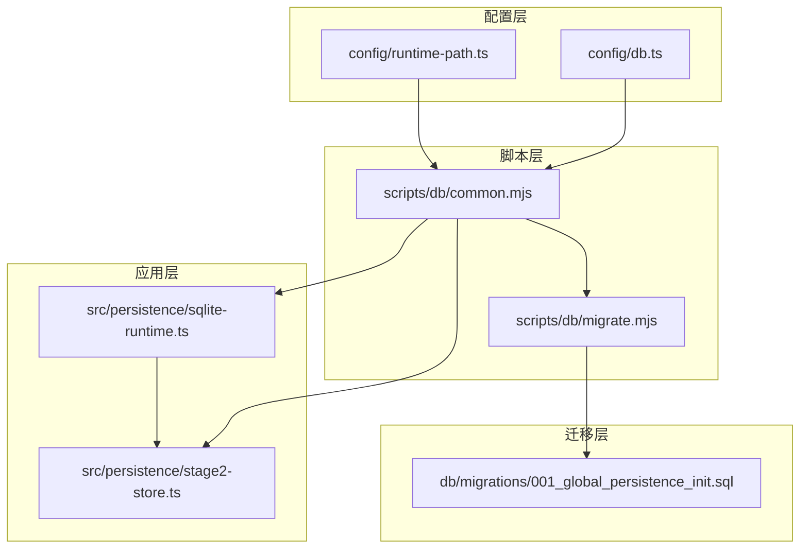
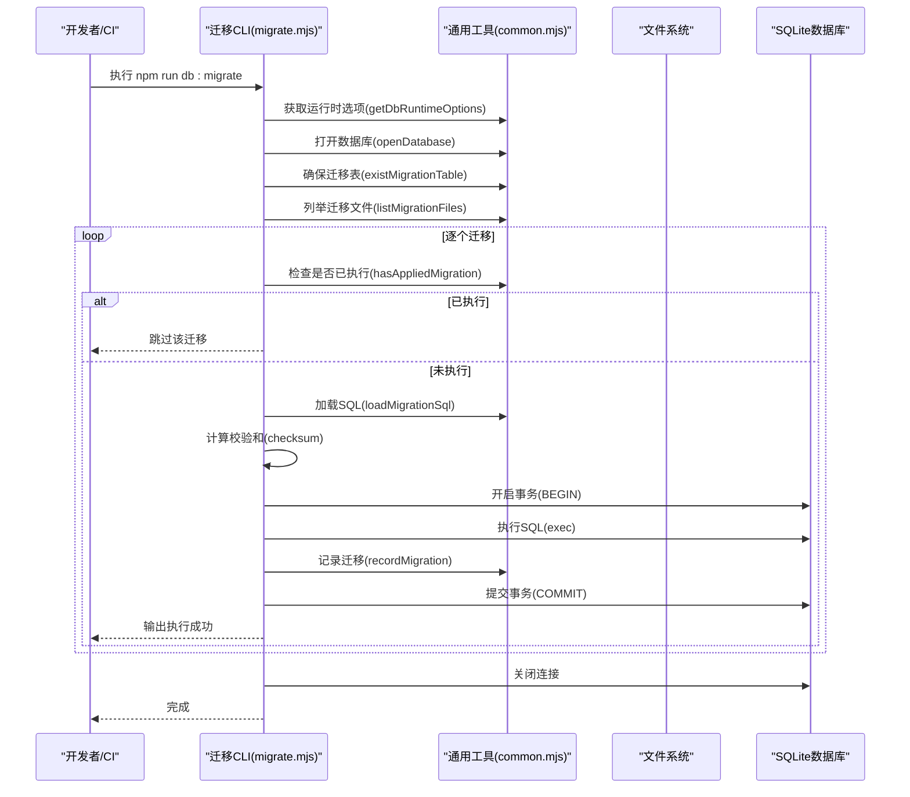
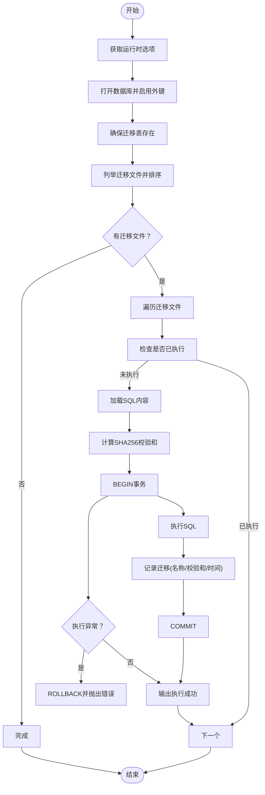
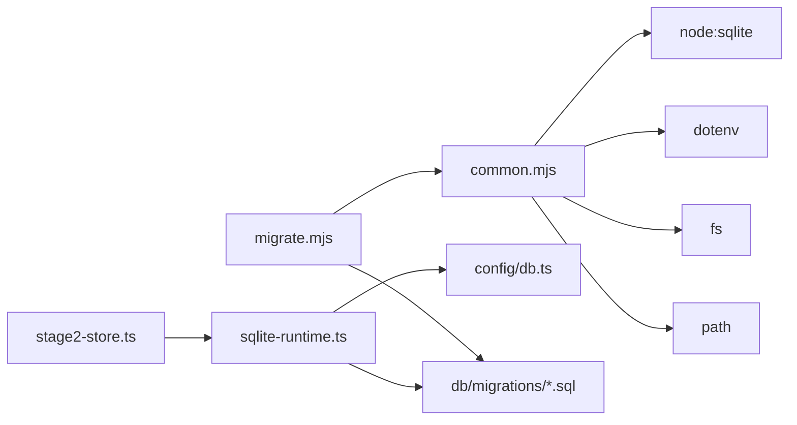

# 数据库迁移和管理

<cite>
**本文引用的文件**
- [config/db.ts](file://config/db.ts)
- [config/runtime-path.ts](file://config/runtime-path.ts)
- [scripts/db/common.mjs](file://scripts/db/common.mjs)
- [scripts/db/migrate.mjs](file://scripts/db/migrate.mjs)
- [db/migrations/001_global_persistence_init.sql](file://db/migrations/001_global_persistence_init.sql)
- [src/persistence/sqlite-runtime.ts](file://src/persistence/sqlite-runtime.ts)
- [src/persistence/stage2-store.ts](file://src/persistence/stage2-store.ts)
- [package.json](file://package.json)
- [README.md](file://README.md)
</cite>

## 目录
1. [简介](#简介)
2. [项目结构](#项目结构)
3. [核心组件](#核心组件)
4. [架构总览](#架构总览)
5. [详细组件分析](#详细组件分析)
6. [依赖关系分析](#依赖关系分析)
7. [性能考量](#性能考量)
8. [故障排查指南](#故障排查指南)
9. [结论](#结论)
10. [附录](#附录)

## 简介
本文件面向数据库迁移与管理，系统性说明本项目的迁移脚本设计原理、版本管理与执行流程，涵盖迁移脚本编写规范、回滚策略、数据保护机制、初始化流程、版本升级与兼容性处理、数据完整性保障与性能优化、调试技巧与故障恢复方案，以及生产环境部署注意事项与最佳实践。项目当前采用 SQLite 作为本地持久化存储，并通过 SQL 迁移脚本进行版本演进，同时保留未来迁移到 MySQL 的兼容性设计。

## 项目结构
项目围绕“配置—脚本—迁移—应用层”四层组织：
- 配置层：数据库驱动与文件路径解析，运行时目录统一管理
- 脚本层：迁移执行与通用工具函数
- 迁移层：SQL 迁移脚本，按顺序编号
- 应用层：业务侧持久化集成，自动应用待执行迁移

图表来源
- [config/db.ts:1-28](file://config/db.ts#L1-L28)
- [config/runtime-path.ts:1-41](file://config/runtime-path.ts#L1-L41)
- [scripts/db/migrate.mjs:1-52](file://scripts/db/migrate.mjs#L1-L52)
- [scripts/db/common.mjs:1-108](file://scripts/db/common.mjs#L1-L108)
- [db/migrations/001_global_persistence_init.sql:1-128](file://db/migrations/001_global_persistence_init.sql#L1-L128)
- [src/persistence/sqlite-runtime.ts:1-116](file://src/persistence/sqlite-runtime.ts#L1-L116)
- [src/persistence/stage2-store.ts:1-200](file://src/persistence/stage2-store.ts#L1-L200)

章节来源
- [config/db.ts:1-28](file://config/db.ts#L1-L28)
- [config/runtime-path.ts:1-41](file://config/runtime-path.ts#L1-L41)
- [scripts/db/common.mjs:1-108](file://scripts/db/common.mjs#L1-L108)
- [scripts/db/migrate.mjs:1-52](file://scripts/db/migrate.mjs#L1-L52)
- [db/migrations/001_global_persistence_init.sql:1-128](file://db/migrations/001_global_persistence_init.sql#L1-L128)
- [src/persistence/sqlite-runtime.ts:1-116](file://src/persistence/sqlite-runtime.ts#L1-L116)
- [src/persistence/stage2-store.ts:1-200](file://src/persistence/stage2-store.ts#L1-L200)

## 核心组件
- 数据库配置与路径解析：集中读取环境变量，解析数据库驱动与文件路径，确保运行时目录存在
- 迁移脚本执行器：扫描迁移目录、去重、逐个执行、记录版本与校验和、事务化保证原子性
- 迁移表：schema_migrations 记录已执行迁移名称、校验和与执行时间
- 应用层集成：业务模块在启动时自动打开数据库并应用待执行迁移
- 迁移脚本：初始建模包含任务、版本、运行、步骤、快照、附件、审计等核心表及索引

章节来源
- [config/db.ts:1-28](file://config/db.ts#L1-L28)
- [scripts/db/common.mjs:31-106](file://scripts/db/common.mjs#L31-L106)
- [scripts/db/migrate.mjs:15-51](file://scripts/db/migrate.mjs#L15-L51)
- [src/persistence/sqlite-runtime.ts:86-114](file://src/persistence/sqlite-runtime.ts#L86-L114)
- [db/migrations/001_global_persistence_init.sql:1-128](file://db/migrations/001_global_persistence_init.sql#L1-L128)

## 架构总览
迁移与持久化架构分为“命令行迁移”和“应用内迁移”两条路径，二者共享同一套迁移表 schema_migrations 与迁移脚本。

图表来源
- [scripts/db/migrate.mjs:12-51](file://scripts/db/migrate.mjs#L12-L51)
- [scripts/db/common.mjs:31-106](file://scripts/db/common.mjs#L31-L106)

章节来源
- [scripts/db/migrate.mjs:1-52](file://scripts/db/migrate.mjs#L1-L52)
- [scripts/db/common.mjs:1-108](file://scripts/db/common.mjs#L1-L108)

## 详细组件分析

### 组件一：迁移脚本执行器（migrate.mjs）
- 功能职责：加载运行时配置、打开数据库、确保迁移表、扫描并执行未应用的迁移、事务化执行与回滚、记录迁移元数据
- 关键流程：
  - 读取运行时选项（驱动、数据库文件路径、迁移目录）
  - 打开数据库并启用外键约束
  - 创建 schema_migrations 表
  - 列举并排序迁移文件
  - 对每个迁移：计算 SQL 校验和，开启事务，执行 SQL，记录迁移，提交；异常则回滚
  - 关闭数据库连接
- 错误处理：捕获执行异常并回滚，确保迁移一致性
- 日志输出：打印驱动、数据库文件、每个迁移执行状态

图表来源
- [scripts/db/migrate.mjs:15-51](file://scripts/db/migrate.mjs#L15-L51)
- [scripts/db/common.mjs:88-106](file://scripts/db/common.mjs#L88-L106)

章节来源
- [scripts/db/migrate.mjs:1-52](file://scripts/db/migrate.mjs#L1-L52)

### 组件二：通用工具（common.mjs）
- 环境变量读取：支持 RUNTIME_DIR_PREFIX、DB_DRIVER、DB_FILE_PATH
- 数据库打开：确保目录存在，实例化 SQLite，启用外键约束
- 迁移表：创建 schema_migrations 表，包含迁移名、校验和、执行时间
- 迁移文件：扫描 db/migrations 目录，过滤 .sql，按字典序排序
- 迁移执行：逐个加载 SQL，计算校验和，插入迁移记录
- 辅助函数：格式化日期、计算 SHA256

章节来源
- [scripts/db/common.mjs:1-108](file://scripts/db/common.mjs#L1-L108)

### 组件三：应用层集成（sqlite-runtime.ts）
- 在业务模块中，打开数据库并调用 applyPendingMigrations，确保启动时完成所有未执行迁移
- 与迁移脚本共享相同的迁移表 schema_migrations 与校验逻辑
- 提供日期格式化、ID 生成、相对路径转换等辅助能力

章节来源
- [src/persistence/sqlite-runtime.ts:1-116](file://src/persistence/sqlite-runtime.ts#L1-L116)

### 组件四：应用持久化存储（stage2-store.ts）
- 在构造函数中打开数据库并应用待执行迁移
- 将任务、版本、运行、步骤、快照、附件、审计等数据写入数据库
- 通过 openPersistenceDatabase 与 applyPendingMigrations 与迁移系统耦合

章节来源
- [src/persistence/stage2-store.ts:101-123](file://src/persistence/stage2-store.ts#L101-L123)
- [src/persistence/stage2-store.ts:1-200](file://src/persistence/stage2-store.ts#L1-L200)

### 组件五：迁移脚本（001_global_persistence_init.sql）
- 建表：ai_task、ai_task_version、ai_run、ai_run_step、ai_snapshot、ai_artifact、ai_audit_log
- 外键约束：多处 ON DELETE 行为（CASCADE、SET NULL），体现数据一致性设计
- 索引：为常用查询字段建立索引，提升查询性能
- 设计原则：表结构按 MySQL 兼容子集设计，便于未来迁移到 MySQL

章节来源
- [db/migrations/001_global_persistence_init.sql:1-128](file://db/migrations/001_global_persistence_init.sql#L1-L128)

### 组件六：配置与路径（config/db.ts、config/runtime-path.ts）
- 数据库驱动与文件路径：DB_DRIVER、DB_FILE_PATH，支持通过环境变量覆盖
- 运行时目录：RUNTIME_DIR_PREFIX 控制 t_runtime/ 下的产物目录，统一管理输出、报告、数据库文件等
- 路径解析：resolveDbPath 统一解析数据库文件绝对路径

章节来源
- [config/db.ts:1-28](file://config/db.ts#L1-L28)
- [config/runtime-path.ts:1-41](file://config/runtime-path.ts#L1-L41)

## 依赖关系分析
- 脚本依赖关系：migrate.mjs 依赖 common.mjs；common.mjs 依赖 dotenv、fs、path、node:sqlite
- 应用依赖关系：stage2-store.ts 依赖 sqlite-runtime.ts；sqlite-runtime.ts 依赖 config/db.ts
- 迁移依赖关系：迁移脚本与应用层均依赖 common.mjs 中的迁移表 schema_migrations 与校验逻辑

图表来源
- [scripts/db/migrate.mjs:1-10](file://scripts/db/migrate.mjs#L1-L10)
- [scripts/db/common.mjs:1-7](file://scripts/db/common.mjs#L1-L7)
- [src/persistence/stage2-store.ts:6-13](file://src/persistence/stage2-store.ts#L6-L13)
- [src/persistence/sqlite-runtime.ts:4-5](file://src/persistence/sqlite-runtime.ts#L4-L5)
- [config/db.ts:1-5](file://config/db.ts#L1-L5)

章节来源
- [scripts/db/migrate.mjs:1-10](file://scripts/db/migrate.mjs#L1-L10)
- [scripts/db/common.mjs:1-7](file://scripts/db/common.mjs#L1-L7)
- [src/persistence/stage2-store.ts:6-13](file://src/persistence/stage2-store.ts#L6-L13)
- [src/persistence/sqlite-runtime.ts:4-5](file://src/persistence/sqlite-runtime.ts#L4-L5)
- [config/db.ts:1-5](file://config/db.ts#L1-L5)

## 性能考量
- 迁移执行：逐个迁移事务化执行，避免部分执行导致的数据不一致；批量迁移时建议控制单次迁移 SQL 的体量，避免长时间锁表
- 查询性能：迁移脚本中为高频查询字段建立索引，有助于提升运行期查询效率
- 外键约束：启用外键约束可保证参照完整性，但可能影响写入性能；在大量写入场景下可考虑临时禁用外键约束（谨慎操作），或拆分写入批次
- 文件系统：数据库文件位于 t_runtime/db/hi_test.sqlite，建议将运行目录挂载到高性能磁盘，避免频繁 IO 影响迁移与运行性能
- 并发访问：SQLite 在并发写入场景下存在锁竞争，建议在 CI 或批处理场景中串行执行迁移，避免多进程同时写库

[本节为通用性能建议，无需特定文件来源]

## 故障排查指南
- 环境变量问题
  - 确认 DB_DRIVER 与 DB_FILE_PATH 设置正确，驱动仅支持 sqlite
  - 确认 RUNTIME_DIR_PREFIX 正确，避免数据库文件路径解析错误
- 权限与路径
  - 确保数据库文件所在目录存在且具备读写权限
  - 若迁移目录不存在，脚本会跳过迁移；请确认 db/migrations 是否存在
- 迁移重复执行
  - schema_migrations 记录已执行迁移；若出现重复执行，检查迁移文件是否被修改导致校验和变化
- 事务回滚
  - 迁移执行异常会触发 ROLLBACK；查看具体错误信息定位 SQL 语法或约束冲突
- 外键约束冲突
  - 迁移或业务写入违反外键约束时会报错；检查关联表数据与约束定义
- 应用层集成
  - 业务模块启动时会自动应用待执行迁移；如未生效，检查 openPersistenceDatabase 与 applyPendingMigrations 的调用链

章节来源
- [scripts/db/common.mjs:47-58](file://scripts/db/common.mjs#L47-L58)
- [scripts/db/common.mjs:88-106](file://scripts/db/common.mjs#L88-L106)
- [src/persistence/sqlite-runtime.ts:73-84](file://src/persistence/sqlite-runtime.ts#L73-L84)
- [src/persistence/stage2-store.ts:101-123](file://src/persistence/stage2-store.ts#L101-L123)

## 结论
本项目采用“SQL 迁移 + 事务化执行 + 迁移表记录”的轻量迁移体系，结合应用层自动迁移集成，实现了从初始化到版本演进的完整闭环。通过外键约束、索引与校验和机制，保障了数据完整性与可追溯性。未来可在此基础上扩展到 MySQL，保持迁移脚本的兼容性与可移植性。

[本节为总结性内容，无需特定文件来源]

## 附录

### 迁移脚本编写规范
- 文件命名：按顺序编号（如 001_、002_），确保字典序即执行顺序
- SQL 设计：遵循 MySQL 兼容子集，避免使用 SQLite 特有语法
- 约束与索引：合理添加外键与索引，兼顾完整性与性能
- 可逆性：尽量在迁移中包含必要的清理逻辑，便于未来回滚（当前实现为单向迁移）

章节来源
- [db/migrations/001_global_persistence_init.sql:1-128](file://db/migrations/001_global_persistence_init.sql#L1-L128)

### 回滚策略与数据保护
- 当前实现为单向迁移，无内置回滚逻辑
- 建议在迁移中包含“DROP/ALTER/UPDATE/DELETE”等必要清理步骤，以便未来扩展回滚
- 通过 schema_migrations 的校验和与执行时间，可追踪每次迁移的变更范围

章节来源
- [scripts/db/common.mjs:97-106](file://scripts/db/common.mjs#L97-L106)

### 数据完整性保证
- 外键约束：启用 PRAGMA foreign_keys = ON；多处 ON DELETE 行为确保级联或置空
- 事务化：每个迁移在 BEGIN/COMMIT 包裹中执行，异常自动 ROLLBACK
- 校验和：迁移文件内容的 SHA256 校验和记录在迁移表，防止重复执行与篡改

章节来源
- [scripts/db/common.mjs:53-57](file://scripts/db/common.mjs#L53-L57)
- [scripts/db/common.mjs:97-106](file://scripts/db/common.mjs#L97-L106)
- [db/migrations/001_global_persistence_init.sql:27-30](file://db/migrations/001_global_persistence_init.sql#L27-L30)

### 版本升级与兼容性处理
- 迁移脚本按顺序编号，新增迁移时使用更高序号
- 表结构按 MySQL 兼容子集设计，便于未来迁移到 MySQL
- 运行时目录统一收敛到 t_runtime/，便于维护与备份

章节来源
- [README.md:97-119](file://README.md#L97-L119)
- [config/runtime-path.ts:13-36](file://config/runtime-path.ts#L13-L36)

### 初始化流程与执行命令
- 初始化数据库与执行迁移：npm run db:init 或 npm run db:migrate
- 迁移脚本入口：scripts/db/migrate.mjs
- 运行时配置：通过 .env 设置 DB_DRIVER、DB_FILE_PATH、RUNTIME_DIR_PREFIX 等

章节来源
- [package.json:6-11](file://package.json#L6-L11)
- [README.md:120-130](file://README.md#L120-L130)

### 生产环境部署注意事项与最佳实践
- 环境隔离：不同环境（dev/staging/prod）使用独立的 DB_FILE_PATH，避免交叉污染
- 权限控制：数据库文件所在目录仅授予必要用户读写权限
- 备份策略：定期备份 t_runtime/db/hi_test.sqlite，迁移前后可做快照
- 并发控制：CI/CD 中串行执行迁移，避免多进程同时写库
- 监控与日志：关注迁移执行日志，异常时及时回滚并修复
- 可观测性：利用 schema_migrations 的执行时间与校验和，快速定位问题迁移

章节来源
- [config/db.ts:20-26](file://config/db.ts#L20-L26)
- [scripts/db/migrate.mjs:22-24](file://scripts/db/migrate.mjs#L22-L24)