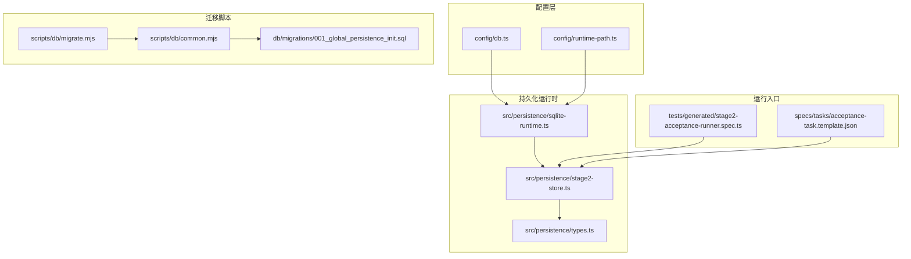
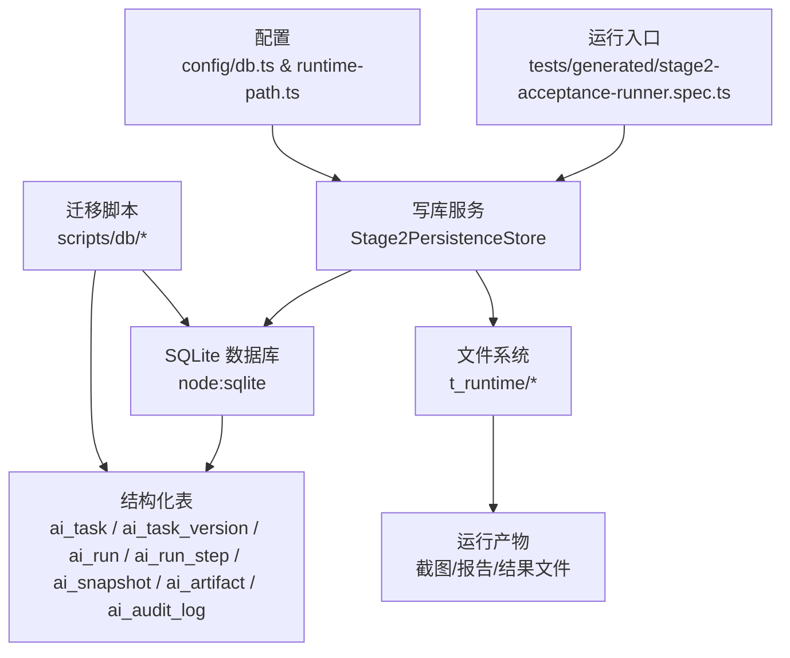
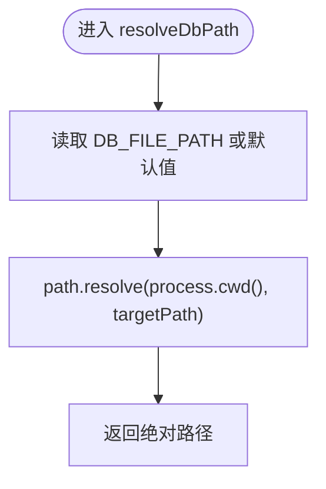
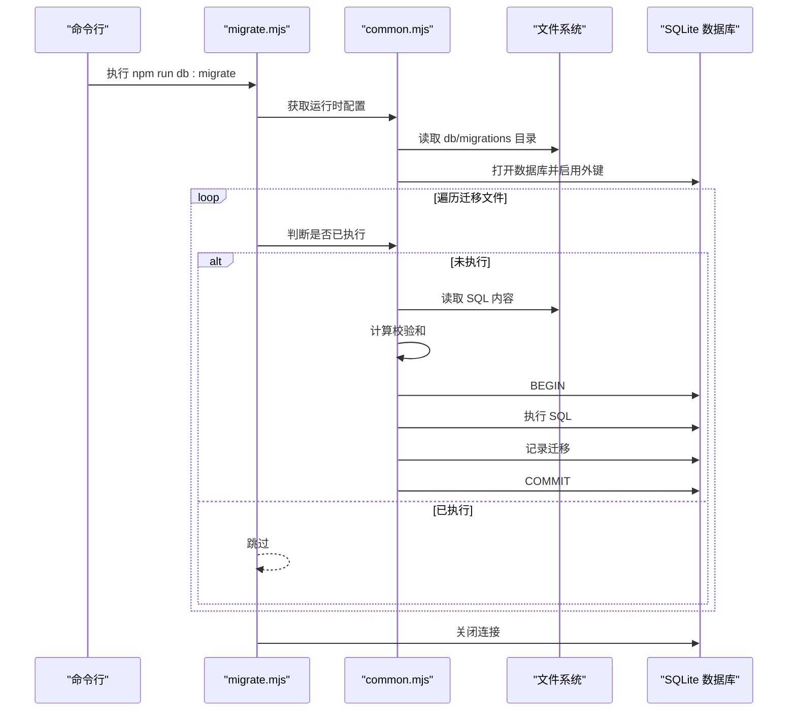
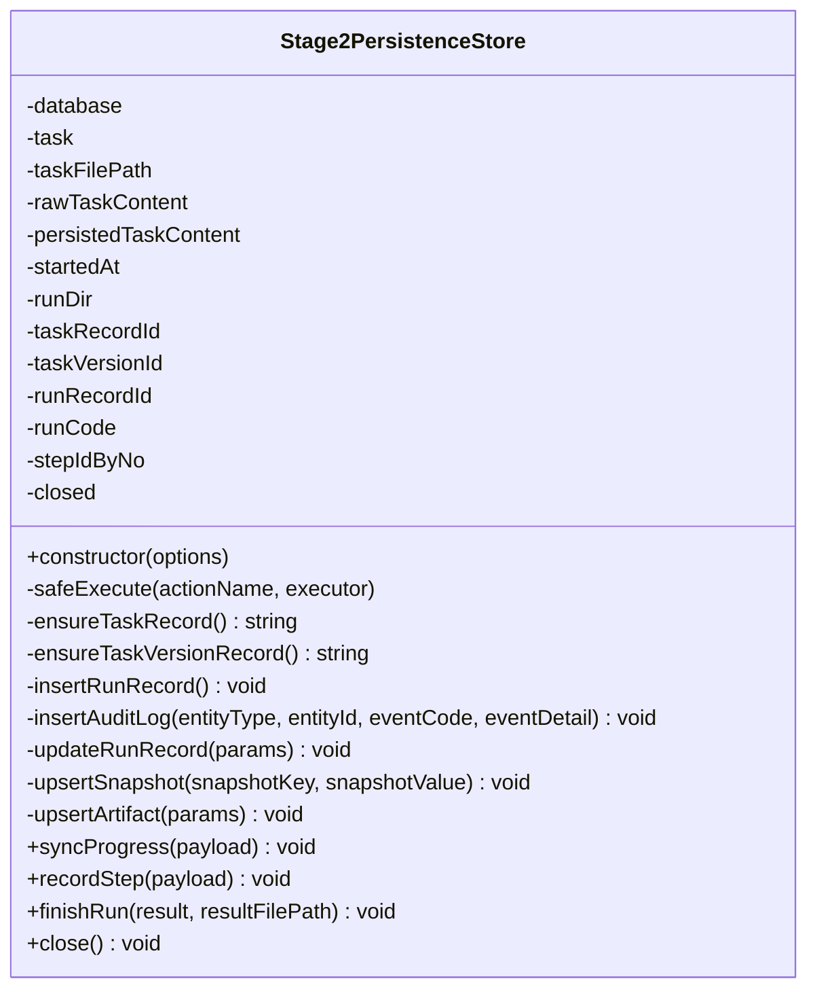
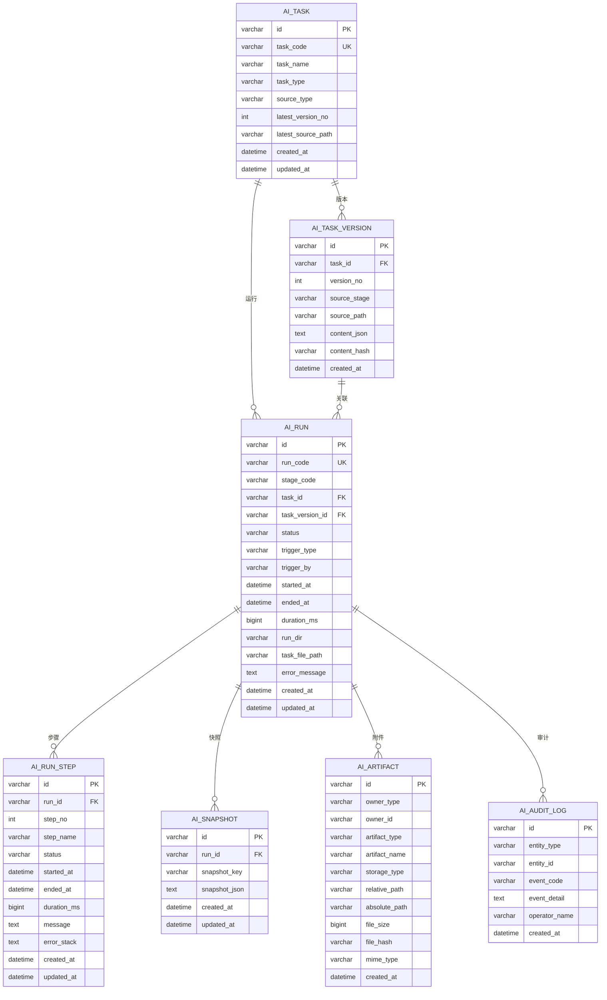
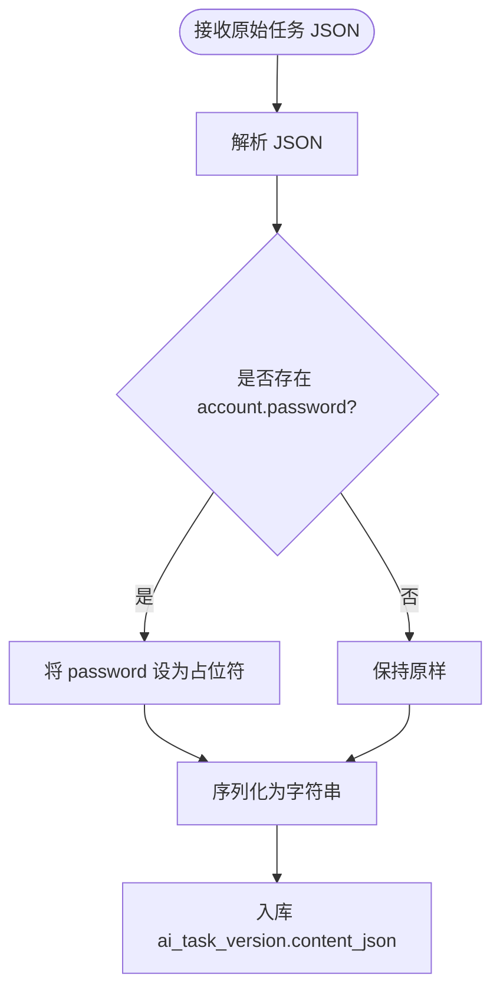
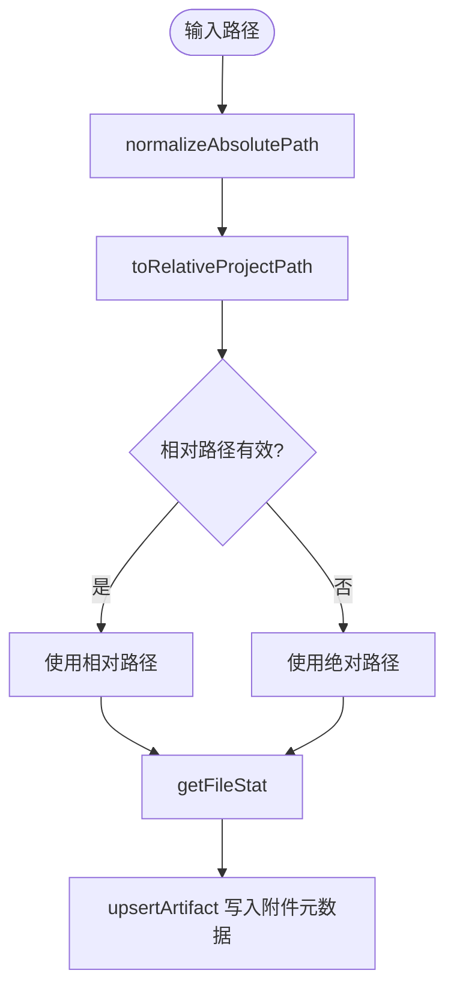
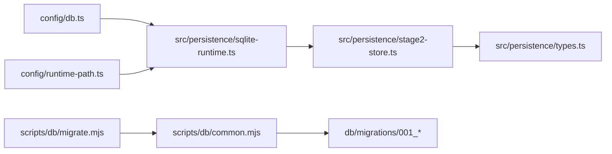

# 存储策略

<cite>
**本文引用的文件**
- [sqlite-runtime.ts](file://src/persistence/sqlite-runtime.ts)
- [stage2-store.ts](file://src/persistence/stage2-store.ts)
- [types.ts](file://src/persistence/types.ts)
- [db.ts](file://config/db.ts)
- [runtime-path.ts](file://config/runtime-path.ts)
- [001_global_persistence_init.sql](file://db/migrations/001_global_persistence_init.sql)
- [migrate.mjs](file://scripts/db/migrate.mjs)
- [common.mjs](file://scripts/db/common.mjs)
- [README.md](file://README.md)
- [stage2-acceptance-runner.spec.ts](file://tests/generated/stage2-acceptance-runner.spec.ts)
- [acceptance-task.template.json](file://specs/tasks/acceptance-task.template.json)
</cite>

## 目录
1. [简介](#简介)
2. [项目结构](#项目结构)
3. [核心组件](#核心组件)
4. [架构总览](#架构总览)
5. [详细组件分析](#详细组件分析)
6. [依赖关系分析](#依赖关系分析)
7. [性能考量](#性能考量)
8. [故障排查指南](#故障排查指南)
9. [结论](#结论)
10. [附录](#附录)

## 简介
本文件系统性阐述项目的“数据存储策略”，聚焦于持久化存储的整体架构与数据流向，涵盖 SQLite 数据库与文件系统的协同机制、不同数据类型的落库方式（结构化数据入库、文件类数据仅存路径）、敏感信息处理（如密码掩码）、数据压缩与优化方案、存储路径管理与相对/绝对路径处理、存储性能优化与缓存策略、磁盘空间管理以及存储配置选项与最佳实践。

## 项目结构
围绕“存储”主题的关键目录与文件：
- config：数据库与运行时路径配置
- db/migrations：数据库迁移脚本
- scripts/db：数据库迁移脚本（命令行）
- src/persistence：持久化运行时与写库服务
- tests/generated：端到端执行入口，触发写库流程
- specs/tasks：任务模板，用于演示敏感信息掩码与落库

图表来源
- [db.ts:1-28](file://config/db.ts#L1-L28)
- [runtime-path.ts:1-41](file://config/runtime-path.ts#L1-L41)
- [migrate.mjs:1-52](file://scripts/db/migrate.mjs#L1-L52)
- [common.mjs:1-108](file://scripts/db/common.mjs#L1-L108)
- [001_global_persistence_init.sql:1-128](file://db/migrations/001_global_persistence_init.sql#L1-L128)
- [sqlite-runtime.ts:1-116](file://src/persistence/sqlite-runtime.ts#L1-L116)
- [stage2-store.ts:1-655](file://src/persistence/stage2-store.ts#L1-L655)
- [types.ts:1-125](file://src/persistence/types.ts#L1-L125)
- [stage2-acceptance-runner.spec.ts:1-39](file://tests/generated/stage2-acceptance-runner.spec.ts#L1-L39)
- [acceptance-task.template.json:1-141](file://specs/tasks/acceptance-task.template.json#L1-L141)

章节来源
- [README.md:97-131](file://README.md#L97-L131)

## 核心组件
- 数据库配置与路径解析：负责读取环境变量、解析数据库驱动与文件路径，并提供绝对路径解析函数。
- 迁移与数据库初始化：确保 schema_migrations 表存在，扫描迁移文件，按序执行并记录校验和。
- 写库服务（Stage2）：封装任务、版本、运行、步骤、快照、附件、审计等实体的写入与更新逻辑。
- 类型定义：统一结构化数据的字段与枚举，保证数据库与前端/脚本的一致性。
- 运行时路径配置：集中管理 t_runtime 下各类输出目录，便于统一归档与磁盘空间规划。
- 迁移脚本：提供命令行入口，支持初始化与迁移执行。

章节来源
- [db.ts:1-28](file://config/db.ts#L1-L28)
- [runtime-path.ts:1-41](file://config/runtime-path.ts#L1-L41)
- [sqlite-runtime.ts:73-114](file://src/persistence/sqlite-runtime.ts#L73-L114)
- [stage2-store.ts:74-123](file://src/persistence/stage2-store.ts#L74-L123)
- [types.ts:1-125](file://src/persistence/types.ts#L1-L125)
- [migrate.mjs:1-52](file://scripts/db/migrate.mjs#L1-L52)
- [common.mjs:31-58](file://scripts/db/common.mjs#L31-L58)

## 架构总览
整体存储架构采用“结构化数据入数据库 + 文件路径入数据库”的双轨策略：
- 结构化数据：任务、版本、运行、步骤、快照、审计日志等，全部以 JSON 文本或规范化文本形式存入数据库，便于查询与统计。
- 文件类数据：截图、报告、中间结果等大体量文件保留在文件系统，数据库仅保存其元数据（相对/绝对路径、大小、MIME、哈希占位等）。

图表来源
- [stage2-acceptance-runner.spec.ts:1-39](file://tests/generated/stage2-acceptance-runner.spec.ts#L1-L39)
- [stage2-store.ts:74-123](file://src/persistence/stage2-store.ts#L74-L123)
- [sqlite-runtime.ts:73-84](file://src/persistence/sqlite-runtime.ts#L73-L84)
- [db.ts:1-28](file://config/db.ts#L1-L28)
- [runtime-path.ts:1-41](file://config/runtime-path.ts#L1-L41)
- [migrate.mjs:1-52](file://scripts/db/migrate.mjs#L1-L52)
- [001_global_persistence_init.sql:1-128](file://db/migrations/001_global_persistence_init.sql#L1-L128)

## 详细组件分析

### 组件一：数据库配置与路径解析
- 功能要点
  - 读取环境变量 DB_DRIVER 与 DB_FILE_PATH，支持默认值与运行时前缀 RUNTIME_DIR_PREFIX。
  - 提供 resolveDbPath 将相对路径解析为绝对路径，确保数据库文件创建与迁移脚本一致。
- 关键行为
  - 若 DB_DRIVER 非 sqlite，则在运行期抛错，避免误用。
  - 通过 dotenv 加载 .env，确保配置可被脚本与运行时共享。

图表来源
- [db.ts:24-26](file://config/db.ts#L24-L26)

章节来源
- [db.ts:1-28](file://config/db.ts#L1-L28)

### 组件二：迁移与数据库初始化
- 功能要点
  - 确保 schema_migrations 表存在，记录已执行迁移及其校验和。
  - 扫描 db/migrations 下的 SQL 文件，按文件名排序执行，事务包裹，失败回滚。
  - 迁移脚本与运行时库共享相同的迁移逻辑与校验流程。
- 关键行为
  - 仅支持 sqlite 驱动，非 sqlite 将直接报错。
  - 执行前确保数据库文件所在目录存在。

图表来源
- [migrate.mjs:1-52](file://scripts/db/migrate.mjs#L1-L52)
- [common.mjs:31-106](file://scripts/db/common.mjs#L31-L106)
- [001_global_persistence_init.sql:1-128](file://db/migrations/001_global_persistence_init.sql#L1-L128)

章节来源
- [migrate.mjs:1-52](file://scripts/db/migrate.mjs#L1-L52)
- [common.mjs:31-108](file://scripts/db/common.mjs#L31-L108)

### 组件三：写库服务（Stage2）
- 功能要点
  - 初始化数据库与迁移，创建任务与版本记录，插入运行主记录，记录审计日志。
  - 进度同步：写入 resolved_values、query_snapshots、progress_state 快照，同时将进度 JSON 作为附件写入。
  - 步骤写入：按步骤号去重更新或插入，失败时记录审计事件。
  - 结束收尾：更新运行状态、耗时、错误信息，写入最终结果摘要与结果 JSON 附件。
  - 敏感信息处理：任务 JSON 中的 account.password 在入库前被掩码处理，原始文件仍保留。
  - 路径管理：统一使用 toRelativeProjectPath 生成相对路径，normalizeAbsolutePath 处理绝对路径，getFileStat 获取文件大小。
- 关键行为
  - 所有写入均在事务边界内执行，失败捕获并记录错误，避免部分写入。
  - 附件表仅存路径与元数据，不保存大文件二进制。
  - 任务版本通过内容哈希去重，避免重复入库。

图表来源
- [stage2-store.ts:74-641](file://src/persistence/stage2-store.ts#L74-L641)

章节来源
- [stage2-store.ts:1-655](file://src/persistence/stage2-store.ts#L1-L655)

### 组件四：数据模型与表结构
- 功能要点
  - 统一的任务、版本、运行、步骤、快照、附件、审计日志的数据模型。
  - 表结构遵循 MySQL 兼容子集，便于未来迁移至 MySQL。
- 关键行为
  - 外键约束启用，保证引用完整性。
  - 多处索引提升查询效率（按任务/状态/时间等维度）。

图表来源
- [001_global_persistence_init.sql:1-128](file://db/migrations/001_global_persistence_init.sql#L1-L128)
- [types.ts:34-123](file://src/persistence/types.ts#L34-L123)

章节来源
- [001_global_persistence_init.sql:1-128](file://db/migrations/001_global_persistence_init.sql#L1-L128)
- [types.ts:1-125](file://src/persistence/types.ts#L1-L125)

### 组件五：敏感信息处理策略
- 密码掩码
  - 在入库前对任务 JSON 的 account.password 进行掩码处理，原始文件仍保留。
  - 掩码策略在写库服务初始化时应用，确保数据库中不出现明文密码。
- 其他敏感字段
  - 可扩展到其他敏感字段（如 token、密钥），建议在入库前统一清洗。

图表来源
- [stage2-store.ts:37-48](file://src/persistence/stage2-store.ts#L37-L48)

章节来源
- [stage2-store.ts:37-48](file://src/persistence/stage2-store.ts#L37-L48)

### 组件六：存储路径管理与相对/绝对路径处理
- 路径策略
  - 绝对路径：normalizeAbsolutePath 将传入路径标准化为绝对路径，便于一致性比较与定位。
  - 相对路径：toRelativeProjectPath 将绝对路径转换为相对于项目根目录的相对路径，仅当转换有效时使用，否则回退为原始绝对路径。
  - 文件统计：getFileStat 获取文件大小，用于附件表的 file_size 字段。
- 附件表设计
  - 同时保存 relative_path 与 absolute_path，便于跨环境迁移与调试。
  - storage_type 固定为 local_file，便于后续扩展其他存储类型。

图表来源
- [stage2-store.ts:54-67](file://src/persistence/stage2-store.ts#L54-L67)
- [stage2-store.ts:404-468](file://src/persistence/stage2-store.ts#L404-L468)

章节来源
- [stage2-store.ts:54-67](file://src/persistence/stage2-store.ts#L54-L67)
- [stage2-store.ts:404-468](file://src/persistence/stage2-store.ts#L404-L468)

### 组件七：数据压缩与优化方案
- 结构化数据压缩
  - 建议对 ai_snapshot.snapshot_json 与 ai_task_version.content_json 进行压缩（如 gzip）后入库，以降低存储体积与网络传输成本。
  - 压缩与解压在入库/出库时进行，不影响现有接口与查询逻辑。
- 索引优化
  - 已有针对常用查询维度的索引（如 ai_run(stage_code,status,started_at)、ai_run_step(run_id,status) 等），可进一步评估热点查询并增加复合索引。
- 清理策略
  - 建议定期清理旧版本任务版本与过期运行记录，结合 retention 策略控制历史数据规模。

章节来源
- [001_global_persistence_init.sql:120-127](file://db/migrations/001_global_persistence_init.sql#L120-L127)

## 依赖关系分析
- 组件耦合
  - Stage2PersistenceStore 依赖 sqlite-runtime.ts 提供数据库连接与迁移能力。
  - sqlite-runtime.ts 依赖 config/db.ts 与 config/runtime-path.ts 解析路径与驱动。
  - 迁移脚本与运行时库共享 common.mjs 的迁移逻辑，确保一致性。
- 外部依赖
  - node:sqlite 提供同步数据库访问能力。
  - dotenv 用于加载 .env 配置。
- 循环依赖
  - 无循环依赖，模块职责清晰。

图表来源
- [db.ts:1-28](file://config/db.ts#L1-L28)
- [runtime-path.ts:1-41](file://config/runtime-path.ts#L1-L41)
- [sqlite-runtime.ts:1-116](file://src/persistence/sqlite-runtime.ts#L1-L116)
- [stage2-store.ts:1-655](file://src/persistence/stage2-store.ts#L1-L655)
- [migrate.mjs:1-52](file://scripts/db/migrate.mjs#L1-L52)
- [common.mjs:1-108](file://scripts/db/common.mjs#L1-L108)
- [001_global_persistence_init.sql:1-128](file://db/migrations/001_global_persistence_init.sql#L1-L128)
- [types.ts:1-125](file://src/persistence/types.ts#L1-L125)

章节来源
- [sqlite-runtime.ts:1-116](file://src/persistence/sqlite-runtime.ts#L1-L116)
- [stage2-store.ts:1-655](file://src/persistence/stage2-store.ts#L1-L655)
- [migrate.mjs:1-52](file://scripts/db/migrate.mjs#L1-L52)
- [common.mjs:1-108](file://scripts/db/common.mjs#L1-L108)

## 性能考量
- 数据库层面
  - 使用事务批量写入，减少提交次数带来的 I/O 开销。
  - 合理使用索引，避免全表扫描；对高频查询字段建立复合索引。
  - 控制快照与附件数量，避免单条记录过大导致锁竞争。
- 文件系统层面
  - 将运行产物统一收敛到 t_runtime，便于磁盘配额与清理策略。
  - 对大文件（截图/报告）采用分目录组织，避免单目录文件过多影响文件系统性能。
- 运行时优化
  - 合理设置任务超时与步骤超时，避免长时间占用数据库连接。
  - 在写库失败时快速失败并记录日志，避免阻塞主线程。

[本节为通用性能指导，无需特定文件引用]

## 故障排查指南
- 数据库连接失败
  - 检查 DB_DRIVER 是否为 sqlite，DB_FILE_PATH 是否可解析为绝对路径。
  - 确认数据库文件所在目录存在且具备写权限。
- 迁移执行失败
  - 查看迁移脚本输出，确认 SQL 文件语法正确与依赖表存在。
  - 检查 schema_migrations 表是否正常创建与记录。
- 写库异常
  - Stage2PersistenceStore 在写库过程中捕获异常并记录错误，检查控制台日志定位具体失败步骤。
  - 确认任务 JSON 中敏感字段已被正确掩码，避免因格式问题导致解析失败。
- 路径问题
  - 若附件路径为空，检查 toRelativeProjectPath 的返回值与 normalizeAbsolutePath 的输入是否合理。
  - 确认运行目录与产物目录由 .env 统一管理，避免路径漂移。

章节来源
- [sqlite-runtime.ts:73-84](file://src/persistence/sqlite-runtime.ts#L73-L84)
- [stage2-store.ts:125-133](file://src/persistence/stage2-store.ts#L125-L133)
- [migrate.mjs:15-51](file://scripts/db/migrate.mjs#L15-L51)

## 结论
本项目采用“结构化数据入数据库 + 文件路径入数据库”的混合存储策略，既保证了结构化数据的可查询性与可维护性，又避免了大文件直接入库带来的性能与存储压力。通过统一的配置与迁移机制、严格的路径管理与敏感信息掩码策略，实现了可扩展、可运维、可演进的存储体系。建议在后续阶段引入压缩与清理策略，并逐步完善 MySQL 迁移能力，以满足更大规模与更高可用性的需求。

[本节为总结性内容，无需特定文件引用]

## 附录

### 存储配置选项与最佳实践
- 环境变量
  - DB_DRIVER：数据库驱动（当前仅支持 sqlite）
  - DB_FILE_PATH：数据库文件路径（默认收敛到 t_runtime/db/hi_test.sqlite）
  - RUNTIME_DIR_PREFIX：运行时根目录前缀（默认 t_runtime/）
  - PLAYWRIGHT_OUTPUT_DIR、PLAYWRIGHT_HTML_REPORT_DIR、MIDSCENE_RUN_DIR、ACCEPTANCE_RESULT_DIR：各类运行产物目录
- 最佳实践
  - 将所有运行产物收敛到 t_runtime，便于统一管理与清理。
  - 对任务 JSON 中的敏感字段（如密码、token）在入库前进行掩码处理。
  - 定期执行迁移脚本，确保表结构与索引保持最新。
  - 控制快照与附件数量，避免单条记录过大；必要时对 JSON 进行压缩。
  - 建立清理策略，定期删除过期任务版本与运行记录，控制数据库体积。

章节来源
- [README.md:39-54](file://README.md#L39-L54)
- [README.md:76-96](file://README.md#L76-L96)
- [db.ts:1-28](file://config/db.ts#L1-L28)
- [runtime-path.ts:1-41](file://config/runtime-path.ts#L1-L41)
- [stage2-store.ts:37-48](file://src/persistence/stage2-store.ts#L37-L48)