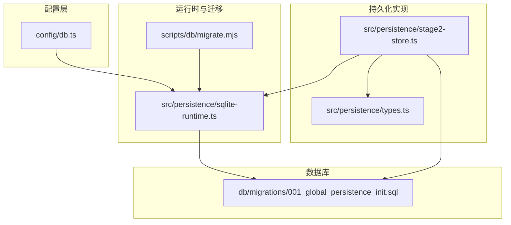
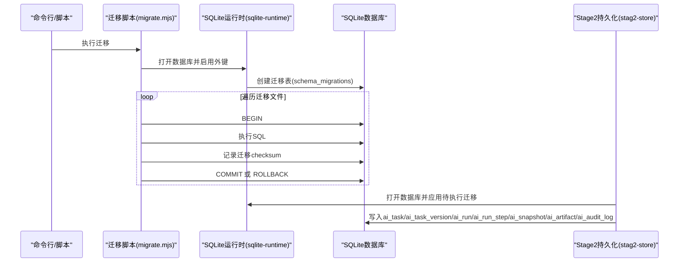
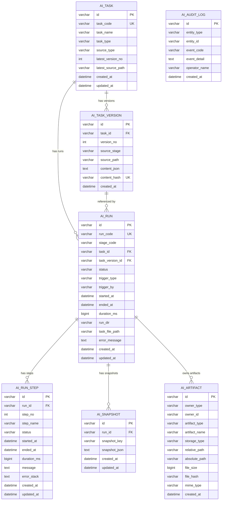
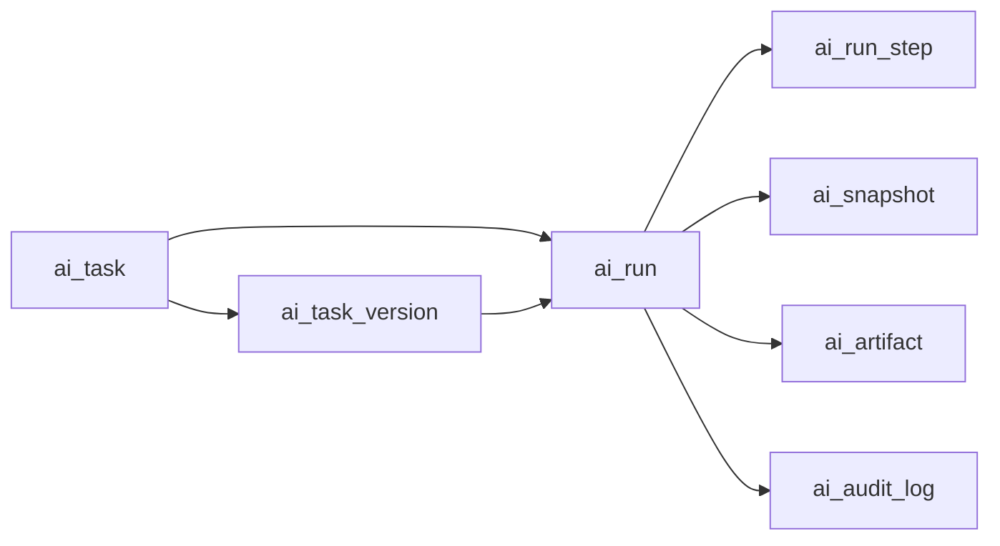
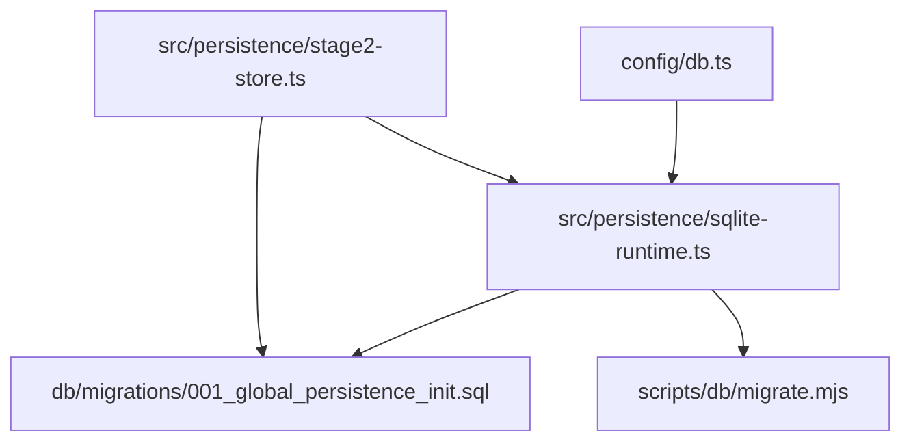

# 数据库设计

<cite>
**本文引用的文件**
- [001_global_persistence_init.sql](file://db/migrations/001_global_persistence_init.sql)
- [types.ts](file://src/persistence/types.ts)
- [sqlite-runtime.ts](file://src/persistence/sqlite-runtime.ts)
- [stage2-store.ts](file://src/persistence/stage2-store.ts)
- [db.ts](file://config/db.ts)
- [migrate.mjs](file://scripts/db/migrate.mjs)
</cite>

## 目录
1. [简介](#简介)
2. [项目结构](#项目结构)
3. [核心组件](#核心组件)
4. [架构总览](#架构总览)
5. [详细组件分析](#详细组件分析)
6. [依赖关系分析](#依赖关系分析)
7. [性能考量](#性能考量)
8. [故障排查指南](#故障排查指南)
9. [结论](#结论)
10. [附录](#附录)

## 简介
本文件面向基于 SQLite 的全局数据持久化架构，系统性梳理核心表结构（ai_task、ai_task_version、ai_run、ai_run_step、ai_snapshot、ai_artifact、ai_audit_log），阐明字段定义、数据类型、约束条件与业务含义，解释表间关系与外键约束设计，说明主键生成策略与索引优化方案，并总结数据完整性保障机制与事务处理策略。文档同时提供表结构图与 ER 关系图，帮助读者快速理解数据模型的设计原则与扩展性考虑。

## 项目结构
数据库相关的核心文件分布如下：
- 初始化迁移脚本：db/migrations/001_global_persistence_init.sql
- 类型定义：src/persistence/types.ts
- SQLite 运行时与迁移工具：src/persistence/sqlite-runtime.ts
- 第二阶段持久化写入实现：src/persistence/stage2-store.ts
- 数据库配置：config/db.ts
- 命令行迁移脚本：scripts/db/migrate.mjs

图表来源
- [db.ts:1-28](file://config/db.ts#L1-L28)
- [sqlite-runtime.ts:73-114](file://src/persistence/sqlite-runtime.ts#L73-L114)
- [migrate.mjs:1-52](file://scripts/db/migrate.mjs#L1-L52)
- [stage2-store.ts:101-123](file://src/persistence/stage2-store.ts#L101-L123)
- [001_global_persistence_init.sql:1-128](file://db/migrations/001_global_persistence_init.sql#L1-L128)

章节来源
- [db.ts:1-28](file://config/db.ts#L1-L28)
- [sqlite-runtime.ts:73-114](file://src/persistence/sqlite-runtime.ts#L73-L114)
- [migrate.mjs:1-52](file://scripts/db/migrate.mjs#L1-L52)
- [stage2-store.ts:101-123](file://src/persistence/stage2-store.ts#L101-L123)
- [001_global_persistence_init.sql:1-128](file://db/migrations/001_global_persistence_init.sql#L1-L128)

## 核心组件
本节概述七个核心表及其职责边界：
- ai_task：任务主记录，维护任务元信息与最新版本号
- ai_task_version：任务版本与内容摘要，支持按内容哈希去重
- ai_run：阶段运行主记录，关联任务与任务版本
- ai_run_step：运行步骤明细，记录步骤执行状态与耗时
- ai_snapshot：结构化快照（JSON 字符串），按运行与键聚合
- ai_artifact：附件元数据（截图、报告、结果文件等），按拥有者聚合
- ai_audit_log：关键审计事件日志，记录实体变更与操作

章节来源
- [001_global_persistence_init.sql:1-128](file://db/migrations/001_global_persistence_init.sql#L1-L128)
- [types.ts:34-123](file://src/persistence/types.ts#L34-L123)

## 架构总览
数据库采用 SQLite 单文件存储，迁移脚本负责初始化表结构与索引。运行时通过 Node 的 node:sqlite 同步接口打开数据库并启用外键约束。第二阶段执行器在运行生命周期内写入运行主记录、步骤明细、快照与附件元数据，并记录审计日志。

图表来源
- [migrate.mjs:15-46](file://scripts/db/migrate.mjs#L15-L46)
- [sqlite-runtime.ts:73-114](file://src/persistence/sqlite-runtime.ts#L73-L114)
- [stage2-store.ts:101-123](file://src/persistence/stage2-store.ts#L101-L123)

## 详细组件分析

### ai_task：任务主记录
- 字段与约束
  - id：VARCHAR(64)，主键
  - task_code：VARCHAR(128)，唯一索引
  - task_name：VARCHAR(255)，普通索引
  - task_type：VARCHAR(64)
  - source_type：VARCHAR(64)
  - latest_version_no：INT，默认 0
  - latest_source_path：VARCHAR(512)，可空
  - created_at/updated_at：DATETIME
- 业务含义
  - 记录任务标识、名称、类型、来源类型
  - 维护最新版本号与最新源路径
- 外键与索引
  - 无外键
  - 主键 + 唯一(task_code) + 普通索引(task_name)

章节来源
- [001_global_persistence_init.sql:1-13](file://db/migrations/001_global_persistence_init.sql#L1-L13)
- [types.ts:34-44](file://src/persistence/types.ts#L34-L44)

### ai_task_version：任务版本与内容摘要
- 字段与约束
  - id：VARCHAR(64)，主键
  - task_id：VARCHAR(64)，外键指向 ai_task(id)，级联删除
  - version_no：INT
  - source_stage：VARCHAR(32)
  - source_path：VARCHAR(512)，可空
  - content_json：TEXT
  - content_hash：VARCHAR(64)，唯一索引
  - created_at：DATETIME
- 业务含义
  - 存储任务版本号、来源阶段与内容摘要（哈希）
  - 通过 content_hash 去重，避免重复版本入库
- 外键与索引
  - 外键：task_id -> ai_task(id)（ON DELETE CASCADE）
  - 唯一：(task_id, version_no)、(task_id, content_hash)

章节来源
- [001_global_persistence_init.sql:15-30](file://db/migrations/001_global_persistence_init.sql#L15-L30)
- [types.ts:46-55](file://src/persistence/types.ts#L46-L55)

### ai_run：阶段运行主记录
- 字段与约束
  - id：VARCHAR(64)，主键
  - run_code：VARCHAR(128)，唯一索引
  - stage_code：VARCHAR(32)
  - task_id：VARCHAR(64)，可空，外键指向 ai_task(id)，ON DELETE SET NULL
  - task_version_id：VARCHAR(64)，可空，外键指向 ai_task_version(id)，ON DELETE SET NULL
  - status：VARCHAR(32)
  - trigger_type/trigger_by：VARCHAR(32)/VARCHAR(128)，可空
  - started_at/ended_at：DATETIME/可空
  - duration_ms：BIGINT，默认 0
  - run_dir/task_file_path：VARCHAR(512)，可空
  - error_message：TEXT，可空
  - created_at/updated_at：DATETIME
- 业务含义
  - 记录一次运行的生命周期、触发来源、状态与耗时
  - 可选关联任务与任务版本，便于回溯
- 外键与索引
  - 外键：task_id -> ai_task(id)（ON DELETE SET NULL）、task_version_id -> ai_task_version(id)（ON DELETE SET NULL）
  - 唯一(run_code)
  - 复合索引：(task_id, stage_code, started_at)、(stage_code, status, started_at)

章节来源
- [001_global_persistence_init.sql:32-57](file://db/migrations/001_global_persistence_init.sql#L32-L57)
- [types.ts:57-74](file://src/persistence/types.ts#L57-L74)

### ai_run_step：运行步骤明细
- 字段与约束
  - id：VARCHAR(64)，主键
  - run_id：VARCHAR(64)，外键指向 ai_run(id)，ON DELETE CASCADE
  - step_no：INT
  - step_name：VARCHAR(255)
  - status：VARCHAR(32)
  - started_at/ended_at：DATETIME
  - duration_ms：BIGINT，默认 0
  - message/error_stack：TEXT，可空
  - created_at/updated_at：DATETIME
- 业务含义
  - 记录每个步骤的执行状态、时间戳与错误信息
- 外键与索引
  - 外键：run_id -> ai_run(id)（ON DELETE CASCADE）
  - 唯一：(run_id, step_no)
  - 复合索引：(run_id, status)

章节来源
- [001_global_persistence_init.sql:59-77](file://db/migrations/001_global_persistence_init.sql#L59-L77)
- [types.ts:76-89](file://src/persistence/types.ts#L76-L89)

### ai_snapshot：结构化快照
- 字段与约束
  - id：VARCHAR(64)，主键
  - run_id：VARCHAR(64)，外键指向 ai_run(id)，ON DELETE CASCADE
  - snapshot_key：VARCHAR(128)
  - snapshot_json：TEXT
  - created_at/updated_at：DATETIME
- 业务含义
  - 存储运行过程中的结构化快照（JSON 字符串），按运行与键聚合
- 外键与索引
  - 外键：run_id -> ai_run(id)（ON DELETE CASCADE）
  - 唯一：(run_id, snapshot_key)

章节来源
- [001_global_persistence_init.sql:79-91](file://db/migrations/001_global_persistence_init.sql#L79-L91)
- [types.ts:91-98](file://src/persistence/types.ts#L91-L98)

### ai_artifact：附件元数据
- 字段与约束
  - id：VARCHAR(64)，主键
  - owner_type：VARCHAR(32)
  - owner_id：VARCHAR(64)
  - artifact_type：VARCHAR(64)
  - artifact_name：VARCHAR(255)
  - storage_type：VARCHAR(32)，固定为 local_file
  - relative_path/absolute_path：VARCHAR(512)/VARCHAR(1024)，可空
  - file_size：BIGINT，可空
  - file_hash：VARCHAR(64)，可空
  - mime_type：VARCHAR(128)，可空
  - created_at：DATETIME
- 业务含义
  - 记录截图、报告、结果文件等附件的元数据与存储路径
- 外键与索引
  - 无外键
  - 复合索引：(owner_type, owner_id)、(artifact_type, created_at)

章节来源
- [001_global_persistence_init.sql:93-107](file://db/migrations/001_global_persistence_init.sql#L93-L107)
- [types.ts:100-113](file://src/persistence/types.ts#L100-L113)

### ai_audit_log：关键审计日志
- 字段与约束
  - id：VARCHAR(64)，主键
  - entity_type：VARCHAR(64)
  - entity_id：VARCHAR(64)
  - event_code：VARCHAR(64)
  - event_detail：TEXT，可空
  - operator_name：VARCHAR(128)，可空
  - created_at：DATETIME
- 业务含义
  - 记录实体的关键事件与操作者信息，便于审计与排障
- 外键与索引
  - 无外键
  - 复合索引：(entity_type, entity_id, created_at)

章节来源
- [001_global_persistence_init.sql:109-118](file://db/migrations/001_global_persistence_init.sql#L109-L118)
- [types.ts:115-123](file://src/persistence/types.ts#L115-L123)

### 主键生成策略
- 统一采用 createPersistentId(prefix) 生成，格式为：prefix_时间戳(36进制)_随机字节十六进制，确保全局唯一性与可排序性。
- 该策略用于 ai_task、ai_task_version、ai_run、ai_run_step、ai_snapshot、ai_artifact、ai_audit_log 的 id 字段。

章节来源
- [sqlite-runtime.ts:24-26](file://src/persistence/sqlite-runtime.ts#L24-L26)
- [stage2-store.ts:112-122](file://src/persistence/stage2-store.ts#L112-L122)

### 索引优化方案
- ai_task：idx_ai_task_name(task_name)
- ai_run：idx_ai_run_task_stage_started_at(task_id, stage_code, started_at)、idx_ai_run_status_started_at(stage_code, status, started_at)
- ai_run_step：idx_ai_run_step_run_id_status(run_id, status)
- ai_artifact：idx_ai_artifact_owner(owner_type, owner_id)、idx_ai_artifact_type_created_at(artifact_type, created_at)
- ai_audit_log：idx_ai_audit_log_entity_created_at(entity_type, entity_id, created_at)

章节来源
- [001_global_persistence_init.sql:120-126](file://db/migrations/001_global_persistence_init.sql#L120-L126)

### 数据完整性与事务策略
- 外键约束
  - ai_run.task_id -> ai_task(id)（ON DELETE SET NULL）
  - ai_run.task_version_id -> ai_task_version(id)（ON DELETE SET NULL）
  - ai_task_version.task_id -> ai_task(id)（ON DELETE CASCADE）
  - ai_run_step.run_id -> ai_run(id)（ON DELETE CASCADE）
  - ai_snapshot.run_id -> ai_run(id)（ON DELETE CASCADE）
- 事务处理
  - 迁移脚本与运行时均显式使用 BEGIN/COMMIT/ROLLBACK 包裹 DDL/DML，确保原子性
  - 运行时开启 PRAGMA foreign_keys = ON，并设置 enableForeignKeyConstraints: true
- 数据一致性
  - 通过唯一约束防止重复版本入库（ai_task_version.content_hash）
  - 通过唯一约束防止重复运行记录（ai_run.run_code）
  - 通过唯一约束防止重复步骤（ai_run_step.run_id, step_no）

章节来源
- [sqlite-runtime.ts:79-83](file://src/persistence/sqlite-runtime.ts#L79-L83)
- [sqlite-runtime.ts:104-113](file://src/persistence/sqlite-runtime.ts#L104-L113)
- [001_global_persistence_init.sql:51-56](file://db/migrations/001_global_persistence_init.sql#L51-L56)
- [001_global_persistence_init.sql:27-29](file://db/migrations/001_global_persistence_init.sql#L27-L29)
- [001_global_persistence_init.sql:74-76](file://db/migrations/001_global_persistence_init.sql#L74-L76)
- [001_global_persistence_init.sql:88-90](file://db/migrations/001_global_persistence_init.sql#L88-L90)

### 表结构图

图表来源
- [001_global_persistence_init.sql:1-128](file://db/migrations/001_global_persistence_init.sql#L1-L128)

### ER 关系图

图表来源
- [001_global_persistence_init.sql:15-30](file://db/migrations/001_global_persistence_init.sql#L15-L30)
- [001_global_persistence_init.sql:32-57](file://db/migrations/001_global_persistence_init.sql#L32-L57)
- [001_global_persistence_init.sql:59-77](file://db/migrations/001_global_persistence_init.sql#L59-L77)
- [001_global_persistence_init.sql:79-91](file://db/migrations/001_global_persistence_init.sql#L79-L91)
- [001_global_persistence_init.sql:93-107](file://db/migrations/001_global_persistence_init.sql#L93-L107)
- [001_global_persistence_init.sql:109-118](file://db/migrations/001_global_persistence_init.sql#L109-L118)

## 依赖关系分析
- 配置层
  - config/db.ts 提供数据库驱动与文件路径解析
- 运行时层
  - sqlite-runtime.ts 负责打开数据库、应用迁移、生成 ID、计算哈希、相对路径转换
- 实现层
  - stage2-store.ts 在运行生命周期内写入各表，调用运行时工具函数
- 脚本层
  - scripts/db/migrate.mjs 作为命令行入口，复用运行时迁移逻辑

图表来源
- [db.ts:20-26](file://config/db.ts#L20-L26)
- [sqlite-runtime.ts:73-114](file://src/persistence/sqlite-runtime.ts#L73-L114)
- [migrate.mjs:12-13](file://scripts/db/migrate.mjs#L12-L13)
- [stage2-store.ts:101-123](file://src/persistence/stage2-store.ts#L101-L123)

章节来源
- [db.ts:20-26](file://config/db.ts#L20-L26)
- [sqlite-runtime.ts:73-114](file://src/persistence/sqlite-runtime.ts#L73-L114)
- [migrate.mjs:12-13](file://scripts/db/migrate.mjs#L12-L13)
- [stage2-store.ts:101-123](file://src/persistence/stage2-store.ts#L101-L123)

## 性能考量
- 索引覆盖常见查询模式
  - ai_run：按任务+阶段+时间、按阶段+状态+时间检索
  - ai_run_step：按运行+状态过滤
  - ai_artifact：按拥有者聚合、按类型+时间扫描
  - ai_task：按名称检索
  - ai_audit_log：按实体+时间排序
- 大字段处理
  - content_json 与 snapshot_json 为 TEXT，建议仅在必要时读取，避免全量传输
- 外部路径
  - relative_path/absolute_path 仅存路径，不存二进制，降低数据库体积
- 哈希去重
  - content_hash 避免重复版本入库，减少索引与存储压力

[本节为通用指导，无需列出具体文件来源]

## 故障排查指南
- 迁移失败
  - 症状：执行迁移时报错或中断
  - 排查：确认 schema_migrations 是否存在、迁移文件是否已记录、是否发生 ROLLBACK
  - 参考
    - [sqlite-runtime.ts:86-114](file://src/persistence/sqlite-runtime.ts#L86-L114)
    - [migrate.mjs:35-45](file://scripts/db/migrate.mjs#L35-L45)
- 外键约束冲突
  - 症状：插入/更新 ai_run_step/ai_snapshot 时提示外键约束
  - 排查：确认 ai_run.id 是否存在，以及删除策略（CASCADE/SET NULL）
  - 参考
    - [001_global_persistence_init.sql:74-76](file://db/migrations/001_global_persistence_init.sql#L74-L76)
    - [001_global_persistence_init.sql:88-90](file://db/migrations/001_global_persistence_init.sql#L88-L90)
    - [001_global_persistence_init.sql:51-56](file://db/migrations/001_global_persistence_init.sql#L51-L56)
- 数据重复
  - 症状：重复版本或重复运行记录
  - 排查：检查 content_hash、run_code 唯一约束是否被触发
  - 参考
    - [001_global_persistence_init.sql:27-29](file://db/migrations/001_global_persistence_init.sql#L27-L29)
    - [001_global_persistence_init.sql:50](file://db/migrations/001_global_persistence_init.sql#L50)
- 路径异常
  - 症状：relative_path 为空
  - 排查：确认 toRelativeProjectPath 返回值与工作目录关系
  - 参考
    - [sqlite-runtime.ts:32-41](file://src/persistence/sqlite-runtime.ts#L32-L41)

章节来源
- [sqlite-runtime.ts:86-114](file://src/persistence/sqlite-runtime.ts#L86-L114)
- [migrate.mjs:35-45](file://scripts/db/migrate.mjs#L35-L45)
- [001_global_persistence_init.sql:27-29](file://db/migrations/001_global_persistence_init.sql#L27-L29)
- [001_global_persistence_init.sql:50](file://db/migrations/001_global_persistence_init.sql#L50)
- [001_global_persistence_init.sql:74-76](file://db/migrations/001_global_persistence_init.sql#L74-L76)
- [001_global_persistence_init.sql:88-90](file://db/migrations/001_global_persistence_init.sql#L88-L90)
- [001_global_persistence_init.sql:51-56](file://db/migrations/001_global_persistence_init.sql#L51-L56)
- [sqlite-runtime.ts:32-41](file://src/persistence/sqlite-runtime.ts#L32-L41)

## 结论
该数据库设计以 SQLite 为基础，采用严格的外键约束与唯一索引保障数据一致性，通过复合索引覆盖常见查询场景。主键生成策略兼顾唯一性与可排序性，路径与哈希机制降低存储与传输成本。迁移脚本与运行时均采用显式事务，确保变更原子性。整体设计遵循“结构化数据入库、文件路径落盘”的原则，具备良好的扩展性与可移植性，便于未来迁移到 MySQL。

[本节为总结性内容，无需列出具体文件来源]

## 附录
- 设计原则
  - 唯一性约束优先：content_hash、run_code、(run_id, step_no)、(run_id, snapshot_key)
  - 外键约束：确保父子关系完整，删除策略合理（CASCADE/SET NULL）
  - 索引优化：围绕查询热点建立复合索引
  - 数据最小化：仅存结构化信息与路径，不存大文件二进制
- 扩展性考虑
  - 表结构按 MySQL 兼容子集设计，便于未来迁移
  - 运行时与脚本解耦，便于独立演进
  - 类型定义集中管理，降低耦合度

[本节为概念性内容，无需列出具体文件来源]